# 数据结构的实现

redis 的五种数据结构分别是 string，hash，list，set，zset。它们内部编码其实是有多种实现的：

| 数据结构 |            内部编码            |
| :------: | :----------------------------: |
|  String  |        int，raw，embstr        |
|   hash   |       ziplist，hashtable       |
|   list   | ziplist，linkedlist，quicklist |
|   set    |       intset，hashtable        |
|   zset   |       ziplist，skiplist        |

可以使用 object encoding 命令查看内部编码模式。

hash 类型的内部编码：

- **ziplist（压缩列表）**：当哈希类型元素个数小于`hash-max-ziplist-entries` 配置（默认512个）、同时所有键长度或值长度都小于`hash-max-ziplist-value`配置（默认64 字节）时，`Redis`会使用`ziplist`作为哈希的内部实现，ziplist使用更加紧凑的结构实现多个元素的连续存储，所以在节省内存方面比`hashtable`更加优秀。

  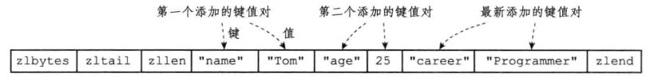

- **hashtable（哈希表）**：当哈希类型无法满足`ziplist`的条件时，`Redis`会使用`hashtable`作为哈希的内部实现

  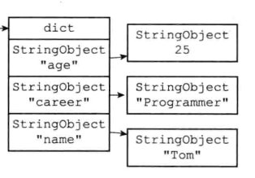

列表的内部编码：

- **ziplist（压缩列表）**：当列表的元素个数小于 `list-max-ziplist-entries` 配置 （默认512个），同时列表中每个字符串元素的长度都小于 `list-max-ziplist-value` 配置时 （默认64字节），Redis 会选用 ziplist 来作为列表的内部实现，来减少内存的使用。

  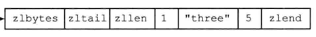

- **linkedlist（链表）**：当列表类型无法满足 ziplist 的条件时，Redis会使用 linkedlist 作为列表的内部实现。

  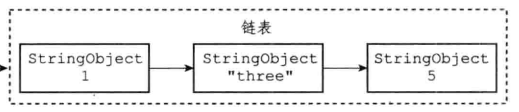

- **quicklist**：此数据结构是 redis 3.2 版本之后新增的数据结构，它结合了 ziplist+linkedlist

set 类型的内部编码：

- **intset（整数集合）**：当集合中的元素都是整数，而且元素个数小于 `set-maxintset-entries` 配置（默认512个）时，Redis 会选用 intset 来作为集合的内部实现，从而减少内存的使用。

  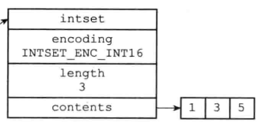

- **hashtable（哈希表）**：当集合类型无法满足 intset 的条件时，Redis会使用 hashtable 作为集合的内部实现。

  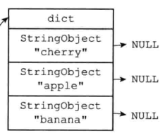

zset 的内部编码：

- **ziplist（压缩列表）**：当有序集合内元素个数小于等于`zset-max-ziplist-entries`（默认128个），并且每个元素的值都小于`zset-max-ziplist-value`（默认64字节）。redis会使用ziplist作为集合内部实现，可以减少内存的使用。

  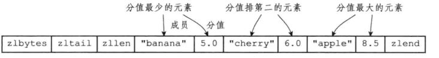

- **skiplist（跳表）**：当有序集合不满足 ziplist 作为内部实现时，使用 skiplist 作为内部实现

  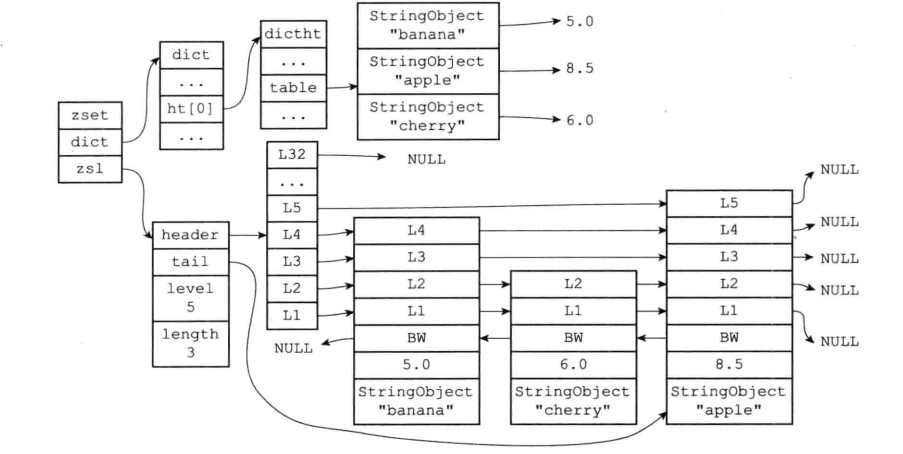

## 字符串

Redis 没有直接使用 C 语言传统的字符串表示（以空字符结尾的字符数组，以下简称 C 字符串）， 而是自己构建了一种名为简单动态字符串（simple dynamic string，SDS）的抽象类型， 并将 SDS 用作 Redis 的默认字符串表示。

~~~c
struct sdshdr {
    // 记录 buf 数组中已使用字节的数量
    // 等于 SDS 所保存字符串的长度
    int len;
    // 记录 buf 数组中未使用字节的数量
    int free;
    // 字节数组，用于保存字符串
    char buf[];
};
~~~

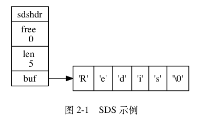

这样做的好处有：

- **以O(1)复杂度获取字符串的长度**

- **杜绝缓冲区溢出**。当 SDS API 需要对 SDS 进行修改时， API 会先检查 SDS 的空间是否满足修改所需的要求。若不满足， API 会自动将 SDS 的空间扩展至执行修改所需的大小。

- **减少修改字符串所带来的内存分配次数**。

  - 如果程序执行的是增长字符串的操作， 比如拼接操作（append），那么必须重分配内存，扩展所需的空间，以避免缓冲区溢出。
  - 如果程序执行的是缩短字符串的操作， 比如截断操作（trim），那么必须重分配内存，抛除掉不需要的空间，以避免内存泄露

  而 SDS 采用了空间预分配机制，用于优化 SDS 字符串增长操作。即当 SDS  API 需要扩展一个 SDS 空间时，会额外分配一些空间，具体策略如下：

  - 如果对 SDS 进行修改后， SDS 的长度（也即是 `len` 属性的值）小于 `1 MB`，那么等额分配一个空间。举个例子， 如果进行修改之后， SDS 的 `len` 将变成 `13` 字节， 那么程序也会分配 `13` 字节的未使用空间， SDS 的 `buf` 数组的实际长度将变成 `13 + 13 + 1 = 27` 字节
  - 如果对 SDS 进行修改之后， SDS 的长度将大于等于 `1 MB` ， 那么会分配一个1MB大小的空间。举个例子， 如果进行修改之后， SDS 的 `len` 将变成 `30 MB` ， 那么程序会分配 `1 MB` 的未使用空间， SDS 的 `buf` 数组的实际长度将为 `30 MB + 1 MB + 1 byte` 。

  惰性空间释放用于优化 SDS 的字符串缩短操作：当 SDS 的 API 需要缩短 SDS 保存的字符串时， 程序并不立即使用内存重分配来回收缩短后多出来的字节， 而是使用 `free` 属性将这些字节的数量记录起来， 并等待将来使用。与此同时， SDS 也提供了相应的 API ， 让我们可以在有需要时， 真正地释放 SDS 里面的未使用空间， 所以不用担心惰性空间释放策略会造成内存浪费。

- 二进制安全，SDS API 会以二进制来解释字符串，这样 Redis 不仅可以保存文本数据， 还可以保存任意格式的二进制数据。

- 兼容 C 字符串函数

Redis 会在初始化服务器时， 创建一万个**字符串对象**， 这些对象包含了从 `0` 到 `9999` 的所有整数值， 当服务器需要用到值为 `0` 到 `9999` 的字符串对象时， 服务器就会使用这些共享对象， 而不是新创建对象。

> 创建共享字符串对象的数量可以通过修改 `redis.h/REDIS_SHARED_INTEGERS` 常量来修改。

另外， 这些共享对象不单单只有字符串键可以使用， 那些在数据结构中嵌套了字符串对象的对象（`linkedlist` 编码的列表对象、 `hashtable` 编码的哈希对象、 `hashtable` 编码的集合对象、以及 `zset` 编码的有序集合对象）都可以使用这些共享对象。但是由于压缩列表（ziplist）的实现，它并不共享对象。而且还要注意这种共享对于 maxmemory + lru 淘汰策略的影响。

## ziplist

> 从 7.0 开始，Redis 就用 listpack 这个结构替换了 ziplist 结构。

压缩列表是 Redis 为了节约内存而开发的， 由一系列特殊编码的连续内存块组成的顺序型（sequential）数据结构。它的结构如下图所示：

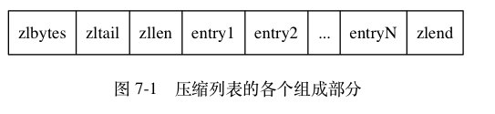

- `zlbytes`：整个 ziplist 所占的总字节数
- `zltail`：记录了最后一个 entry 在 ziplist 里面的偏移字节数。这个字段是为了实现逆序遍历
- `zllen`：记录了压缩列表包含的节点数量： 当这个属性的值小于 `UINT16_MAX` （`65535`）时， 这个属性的值就是压缩列表包含节点的数量； 当这个值等于 `UINT16_MAX` 时， 节点的真实数量需要遍历整个压缩列表才能计算得出。
- `entry`：压缩列表包含的各个节点，节点的长度由节点保存的内容决定。
- `zlend`： 特殊值 `0xFF` （十进制 `255` ），用于标记压缩列表的末端。

每个压缩列表节点都由 `previous_entry_length` 、 `encoding` 、 `content` 三个部分组成， 如图 7-4 所示。

![digraph {      label = "\n 图 7-4    压缩列表节点的各个组成部分";      node [shape = record];      n [label = " previous_entry_length | encoding | content "];  }](./assets/graphviz-cc6b40e182bfc142c12ac0518819a2d949eafa4a-1719665180859-9.png)

- `prevlen`：记录了前一个 entry 节点占了多少个字节，这个字段是为了实现逆序遍历。
  - 如果前一节点的长度小于 `254` 字节， 那么 `prevlen` 属性的长度为 `1` 字节
  - 如果前一节点的长度大于等于 `254` 字节， 那么 `prevlen` 属性的长度为 `5` 字节： 其中属性的第一字节会被设置为 `0xFE` （十进制值 `254`）， 而之后的四个字节则用于保存前一节点的长度。
- `len`：记录 data 的长度
- `data`：存储数据

如果 data 存储的是 String 对象，那么 len 编码规则如下：

| 编码                                           | 编码长度 | `data` 属性保存的值                    |
| ---------------------------------------------- | -------- | -------------------------------------- |
| `00bbbbbb`                                     | `1` 字节 | 长度小于等于 `63` 字节的字节数组。     |
| `01bbbbbb xxxxxxxx`                            | `2` 字节 | 长度小于等于 `16383` 字节的字节数组。  |
| `10______ aaaaaaaa bbbbbbbb cccccccc dddddddd` | `5` 字节 | 长度小于等于 `4294967295` 的字节数组。 |

如果 data 存储的是 int 类型，那么 len 编码规则如下：

| 编码       | 编码长度 | `content` 属性保存的值                                       |
| ---------- | -------- | ------------------------------------------------------------ |
| `11000000` | `1` 字节 | `int16_t` 类型的整数。                                       |
| `11010000` | `1` 字节 | `int32_t` 类型的整数。                                       |
| `11100000` | `1` 字节 | `int64_t` 类型的整数。                                       |
| `11110000` | `1` 字节 | `24` 位有符号整数。                                          |
| `11111110` | `1` 字节 | `8` 位有符号整数。                                           |
| `1111xxxx` | `1` 字节 | 使用这一编码的节点没有相应的 `data` 属性， 因为编码本身的 `xxxx` 四个位已经保存了一个介于 `0` 和 `12` 之间的值， |

Redis 将在特殊情况下产生的连续多次空间扩展操作称之为**「连锁更新」（cascade update）**。现在， 考虑这样一种情况： 在一个压缩列表中， 有多个连续的、长度介于 `250` 字节到 `253` 字节之间的节点 `e1` 至 `eN`

[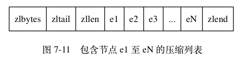](https://github.com/AtsukoRuo/note/blob/default/框架 %26 中间件/Redis/assets/image-20240114224641671.png)

这时， 如果我们将一个长度大于等于 `254` 字节的新节点 设置为压缩列表的表头节点。因为 `e1` 的 `prevlen` 属性仅长 `1` 字节， 它没办法保存新节点的长度， 所以程序将对压缩列表执行空间重分配操作， 并将 `e1` 节点的 `previous_entry_length` 属性从原来的 `1` 字节长扩展为 `5` 字节长。此时这对于 e2、e3 ... eN 来说都成立，那么恐怖的连锁更新就发生了。

因为连锁更新在最坏情况下需要对压缩列表执行 `N` 次空间重分配操作， 而每次空间重分配的最坏复杂度为 O(N) ， 所以连锁更新的最坏复杂度为 O(N^2) 。

## intset

整数集合的结构如下：

~~~c
typedef struct inset {
    uint32_t 	ending;
    uint32_t 	length;
    int8_t		contents[];
}
~~~

- `length` 属性：记录了整数集合包含的元素数量
- `encoding` 属性：
  - INTSET_ENC_INT16 ，那么 contents 就是一个 int16_t 类型的数组
  - INTSET_ENC_INT32 ，那么 contents 就是一个 int32_t 类型的数组
  -  INTSET_ENC_INT64 ，那么 contents 就是一个 int64_t 类型的数组

每当我们要将一个新元素添加到整数集合里面， 若新元素的类型比整数集合现有所有元素的类型都要长时， 整数集合需要先进行升级（upgrade）， 即扩展整数集合底层数组的空
间大小，然后才能将新元素添加到整数集合里面。但是整数集合不支持降级操作。

举个例子，如果现在我的整数数组中元素的类型是 int16_t 。现在我们插入 65535 ，那么变化如下：

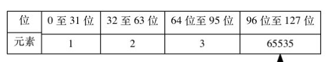

## Redis 为什么要使用跳表

跳表是一种可以用来代替平衡树的数据结构。跳表使用概率平衡而不是严格强制的平衡，因此，跳表中的插入和删除算法比平衡树的等效算法简单得多，更容易实现和调试，速度也快得多。

相比较于红黑树来说，跳表的实现也更简单一些。并且，按照区间来查找数据这个操作，红黑树的效率没有跳表高。

因为 Redis 作为内存数据库它不可能存储大量的数据，所以对于索引不需要通过 B+树这种方式进行维护，只需按照概率进行随机维护即可，节约内存。
