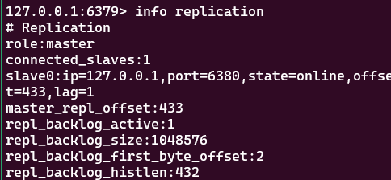
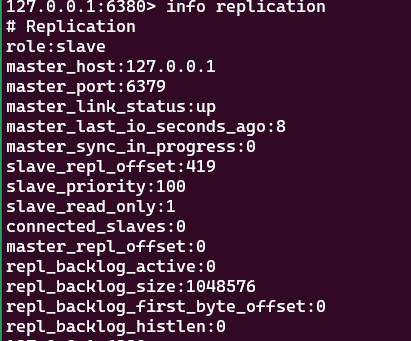

# 持久化 & 复制

[TOC]

Redis 分别提供了 RDB 和 AOF 两种持久化机制：

- RDB 将数据库的快照（snapshot）以二进制的方式保存到磁盘中。
- AOF 则以协议文本的方式，将所有对数据库进行过写入的命令（及其参数）记录到 AOF 文件，以此达到记录数据库状态的目的。

Redis 加载 RDB 恢复数据远远快于 AOF 的方式，但是没办法做到实时持久化/秒级持久化，因为 bgsave 每次运行都要执行 fork ，操作创建子进程，属于重量级操作。所以它非常适用于备份，全量复制等场景。

## RDB

RDB 持久化是把当前 Redis 在内存中的数据生成快照，然后保存到硬盘的过程。

触发 RDB 持久化过程分为 **手动触发** 和**自动触发**。手动触发分别对应`save`和`bgsave`命令

- `save` 命令（废除）：阻塞当前 Redis 节点，直到 RDB 过程完成为止
- `bgsave`命令：Redis 进程执行 fork 操作创建子进程，RDB 持久化过程由子进程负责。它的工作流程如下：
  1. 执行 `bgsave` 命令，Redis 父进程判断当前是否存在正在执行的子进程，例如 RDB/AOF 子进程。如果存在，则直接返回。
  2. 父进程执行 fork 操作创建子进程，fork 操作过程中父进程会阻塞，通过 info stats 命令查看 latest_fork_usec 选项，可以获取最近一个fork 操作的耗时。
  3. 父进程 fork 完成后，bgsave 命令返回 “Background saving started” 信息，并不再阻塞父进程，可以继续响应其他命令。由于 RDB 是在某个时间点生成的数据快照，所以备份启动时间之后的数据变化，并不会体现在当前的 RDB 备份文件中。AOF 却不一样。
  4. 子进程创建 RDB 文件，根据父进程内存生成临时快照文件，完成后对原有文件进行原子替换。执行 lastsave 命令可以获取最后一次生成 RDB 的时间，对应 info stats 的 rdb_last_save_time 选项。由于操作系统使用写时复制（Copy-On-Write, COW）技术，任何在父进程（Redis主进程）上发生的写操作不会影响子进程中的数据。这确保了子进程中的数据是隔离的，不受父进程中数据更改的影响。
  5. 进程发送信号给父进程表示完成，父进程更新统计信息。

Redis 内部还存在自动触发 RDB 的持久化机制，例如以下场景：

1. 使用 save 相关配置，如「save m n」。表示 m 秒内数据集存在 n 次修改时，自动触发 bgsave。
2. 如果从节点执行全量复制操作，主节点自动执行 bgsave 生成 RDB 文件并发送给从节点
3. 执行 debug reload 命令重新加载 Redis 时，也会自动触发 save 操作
4. 执行 shutdown 命令时，若没有开启 AOF 持久化功能，则自动执行 bgsave

RDB 文件保存在 dir 配置指定的目录下，文件名通过 dbfilename 配置指定。可以通过执行`config set dir{newDir}`和`config set dbfilename{newFileName}`命令在运行期中动态执行。

Redis 默认采用 LZF 算法对生成的 RDB 文件做压缩处理，可以通过参数 `config set rdbcompression{yes|no}` 来决定是否开启压缩操作。虽然压缩 RDB 会消耗 CPU，但可大幅降低文件的体积，推荐开启。

## AOF

**AOF（append only file）持久化**：以日志的方式记录每次写命令， 重启时再重新执行 AOF 文件中的命令达到恢复数据的目的。AOF的主要作用是解决了数据持久化的实时性。

开启 AOF 功能需要设置配置：`appendonly yes`，默认不开启。AOF文件名通过`appendfilename`配置设置，默认文件名是`appendonly.aof`。保存路径同 RDB持久化方式一致，通过dir配置指定

AOF 的工作流程操作：

1. **命令写入 （append）**：所有的写入命令会以 RESP 格式追加到 aof_buf（AOF 缓冲区）中。

2. **文件同步（sync）**：将 aof_buf 缓冲区中的命令写入到 AOF 文件中。AOF 缓冲区同步文件的策略如下：

   - always ，调用 write 写入文件后，再调用 fsync 来冲刷
   - everysec（默认策略），调用 write 写入文件后直接返回，由专门线程每秒调用 fsync 来冲刷。
   - no，调用 write 写入文件后直接返回，由操作系统来负责冲刷的时机。

3. **文件重写（rewrite）**：随着 AOF 文件越来越大，需要定期对 AOF 文件进行重写，达到压缩的目的。重写的思路是首先从数据库中读取键现在的值，然后用一条命令去记录键值对，代替之前记录这个键值对的多条命令。

   AOF 重写过程可以手动触发和自动触发。

   - **手动触发**：直接调用 bgrewriteaof 命令

   - **自动触发**：根据 auto-aof-rewrite-min-size 和 auto-aof-rewrite-percentage 参数两者共同确定自动触发时机。

     - auto-aof-rewrite-min-size：表示运行 AOF 重写时文件最小体积，默认为 64MB。
     - auto-aof-rewrite-percentage：代表当前 AOF 文件空间 （aof_current_size）和上一次重写后 AOF 文件空间（aof_base_size）的比值

     自动触发时机为

     ~~~c
     aof_current_size > auto-aof-rewrite-minsize
     &&（aof_current_size - aof_base_size）/aof_base_size >= auto-aof-rewrite-percentage
     ~~~

     其中 aof_current_size 和 aof_base_size 可以在 info Persistence 统计信息中查看。

自动触发的工作流程如下：

1. 如果当前进程正在执行 AOF 重写，则直接返回
2. 如果当前进程正在执行 bgsave 操作，重写命令延迟到 bgsave 完成之后再执行。
3. 父进程执行 fork 创建子进程，开销等同于 bgsave 过程。主进程 fork 操作完成后，继续响应其他命令。
4. 由于父进程依然响应命令，Redis 使用 **“AOF重写缓冲区”**（ 注意不是 AOF 缓冲区）保存这部分新数据，防止新 AOF 文件生成期间丢失这部分数据。
5. 子进程将数据写入到**新的** AOF 文件。每次批量写入硬盘数据量由配置`aof-rewrite-incremental-fsync`控制，默认为 32MB，防止单次刷盘数据过多造成硬盘阻塞。
6. 新 AOF 文件写入完成后，子进程发送信号给父进程，父进程更新统计信息，具体见 info persistence 下的 aof_* 相关统计。
7. 父进程把 AOF 重写缓冲区的数据写入到新的 AOF 文件。
8. 使用新 AOF 文件替换老文件，完成 AOF 重写。

## 重启加载

AOF 和 RDB 文件都可以用于服务器重启时的数据恢复。

1. AOF 持久化开启且存在 AOF 文件时，优先加载 AOF 文件
2. AOF 关闭或者 AOF 文件不存在时，加载 RDB 文件
3. 加载 AOF/RDB 文件成功后（如果有的话），Redis 启动成功
4. AOF/RDB 文件存在错误时（校验失败），Redis 启动失败并打印错误信息。

对于错误格式的 AOF 文件，采用 `redis-check-aof --fix` 命令进行修复，修复后使用 `diff-u` 对比数据的差异，找出丢失的数据，有些可以人工修改补全。

AOF 文件可能存在结尾不完整的情况，比如机器突然掉电导致 AOF 尾部文件命令写入不全。Redis 为我们提供了 aof-load-truncated 配置来兼容这种情况，默认开启。加载 AOF 时，当遇到此问题时会忽略并继续启动，同时打印警告日志。

## AOF 追加阻塞

如果硬盘负载过高，那么 fsync 操作可能会超过 1s；如果 Redis 主线程持续高速向aof_buf 写入命令，硬盘的负载可能会越来越大，IO资源消耗更快；因此，主线程每次进行 AOF 时，会对比上次 fsync 成功的时间；如果距上次不到 2s，主线程写入后直接返回；如果超过2s，则主线程阻塞直到 fsync 同步完成。

可见，everysec 策略最多可能丢失 2 秒数据，也就是说，最多允许 2 秒的同步延迟，不是 1 秒。每当发生 AOF 追加阻塞事件发生时，会累加在 info Persistence 统计中的 `aof_delayed_fsync` 指标

## 多实例部署

Redis 单线程架构导致无法充分利用 CPU 多核特性，通常的做法是在一 台机器上部署多个 Redis 实例。当多个实例开启 AOF 重写后，彼此之间会产生对 CPU 和 IO 的竞争，这是无法避免的，但是我们可以提供监控机制以分散竞争压力。

Redis 在 info Persistence 中为我们提供了监控子进程运行状况的度量指标

我们基于以上指标，可以通过外部程序轮询，手动触发 bgrewriteaof 命令，使多个 Redis 的 AOF 重写操作可以串行执行。记得要关闭自动 AOF 机制。

1. 外部程序定时**轮询**监控机器（machine）上所有 Redis 实例。
2. 对于开启 AOF 的实例，查看（aof_current_sizeaof_base_size）/ aof_base_size 确认增长率。
3. 当增长率超过特定阈值（如100%），执行`bgrewriteaof`命令手动触发，当前实例的 AOF 重写。
4. 运行期间循环检查 aof_rewrite_in_progress 和  aof_current_rewrite_time_sec 指标，直到 AOF 重写结束。
5. 确认实例 AOF 重写完成后，再检查其他实例并重复 2）~4）步操作。 从而保证机器内每个 Redis 实例 AOF 重写串行化执行。

## 启用主从复制

在分布式系统中为了解决单点问题，通常会把数据复制多个副本部署到其他机器，满足故障恢复和负载均衡等需求，Redis 主从复制也正是如此。

> 分布式系统中，两个关于数据的关键设计：
>
> - 数据分区
> - 数据复制
>
> 在 Redis 中，主从复制解决的是数据复制的问题，而集群解决的是数据分区的问题

参与复制的 Redis 实例划分为主节点（master）和从节点（slave）。

- 默认情况下，Redis 都是主节点。 
- 主节点和从节点的关系是一对多的
- 复制的数据流是单向的，只能由主节点复制到从节点。

有三种方式，启用主从复制

- 在配置文件中加入 slaveof {masterHost} {masterPort}，随 Redis 启动生效。
- 在 redis-server 命令后添加 `--slaveof {masterHost} {masterPort}`选项
- 直接使用命令：`slaveof {masterHost} {masterPort}`。

主从节点复制成功建立后，可以使用`info replication`命令查看复制相关状态。主节点的复制状态信息

从节点的复制状态信息

可以通过`slaveof no one`来断开复制：

- 断开与主节点复制关系。
- 从节点晋升为主节点。

从节点断开复制后并不会抛弃原有数据，只是无法再获取主节点上的数据变化。

`slaveof`命令还可以切换主节点

- 断开与旧主节点复制关系
- 与新主节点建立复制关系
- 删除从节点当前所有数据
- 对新主节点进行复制操作

在 Redis 中，`masterauth`参数用于处理主从复制时的安全验证问题。如果主节点设置了`requirepass`密码，那么从节点需要通过`masterauth`参数（在redis.conf配置文件中）来设置相同的密码。

默认情况下，从节点使用`slave-read-only=yes`配置，即只读模式。由于复制只能从主节点到从节点，对于从节点的任何修改主节点都无法感知，修改从节点会造成主从数据不一致

在 Redis 中，`repl-disable-tcp-nodelay` 参数用于控制 Redis 复制数据时，是否禁用 `TCP_NODELAY`。 默认情况下，`repl-disable-tcp-nodelay`参数是设置为 no 的，即默认启用`TCP_NODELAY`。在这种情况下，Redis 主服务器会尽可能快地将数据发送到从节点，不会去等待可能的更大的数据包，以减少数据在网络中传输的延迟。然而，这种立即发送的方式，虽然可以减少延迟，但可能会导致网络带宽的浪费。

## 拓扑

- 一主一从：是最基本的Redis复制配置，其中一个主节点负责接收写入，一个从节点维持数据副本，用于在主节点故障时提供冗余备份。

  在高并发的写入场景中，持久化操作可能会对主节点造成性能压力。在这种情况下，可以只在从节点启用 AOF（Append Only File，追加只读文件持久化），这样可以保证数据的安全性，同时避免持久化对主节点的性能干扰。

  然而，这种配置中有一个需要特别注意的点。当主节点因为某些原因被关闭，且本身没有开启持久化，如果此时主节点自动重启，那么主节点将会成为空数据库。此时，如果从节点还在复制主节点，从节点的数据也会被清空，这就破坏了我们原本设定AOF的意义——数据的持久化。

  为了避免这种情况发生，当主节点关闭时，应该先在从节点上执行 `slaveof no one`命令，这个命令会断开从节点与主节点的复制关系。然后再重启主节点，这样就可以避免从节点数据被误清空的情况。

- 一主多从：相当于一主一从拓扑结构的扩展。

  

- 树状主从

  

  在树状主从结构中，一个节点既可以作为主节点对下一层的从节点复制数据，又可以作为从节点从上一层的主节点获取数据。这种多级复制的模式形成了一种类似于树形的拓扑结构，它可以更有效地分散主节点的负载，减少主节点需要传输给从节点的数据量。

## 复制原理

Redis的复制功能分为 **同步（sync）** 和 **命令传播（command propagate）** 两个操作。

在旧复制机制实现中，从服务器对主服务器的同步操作，需要向主服务器发送 SYNC 命令。以下是 SYNC 命令的执行步骤：

- 从服务器向主服务器发送 SYNC 命令
- 收到 SYNC 命令的主服务器执行 BGSAVE 命令，在后台生成一个 RDB 文件。然后使用一个复制缓冲区（不是下面的复制积压缓冲区）记录从现在开始执行的所有写命令。
- 主服务器会将 BGSAVE 命令生成的 RDB 文件发送给从服务器，从服务器接收并载入这个 RDB 文件，此时从节点会阻塞直到加载完 RDB 文件。
- 主服务器将记录在缓冲区里面的所有写命令发送给从服务器，从服务器执行这些写命令，将自己的数据库状态更新至主服务器数据库当前所处的状态

当完成了同步之后，主从服务器就会进入命令传播阶段，这时主服务器只要一直将自己执行的写命令发送给从服务器，就可以保证主从服务器的数据一致性了。注意，这里是异步完成的，也就是说主节点自身处理完写命令后，直接返回结果，并不等待从节点复制完成。此外，传播操作的延迟还受`repl-disabletcp-nodelay`影响。

在命令传播阶段，从服务器默认会以每秒一次的频率，向主服务器发送命令（**心跳机制**）：
`REPLCONF ACK <replication_offset>`，其中 replication_offset 是从服务器当前的复制偏移量。发送 `REPLCONF ACK` 命令对于主从服务器有三个作用：

- 检测主从服务器的网络连接状态。

- 准备数据（仅仅在同步阶段会使用，在命令传播阶段并不会使用）

  **在从库完成同步后**，会发送一条 `REPLCONF ACK {Replication Offset}` 命令，主库收到该命令时，会将从库 client 添加到 IO 线程的处理队列中，后续 IO 线程会根据从库的 Replication Offset，将复制积压缓冲区中积攒的命令发送给从库。这样，从库才算正式上线。

- 辅助实现 min-slaves 选项。

  Redis 的 min-slaves-to-write 和 min-slaves-max-lag 两个选项，可以防止主服务器在不安全的情况下执行写命令。

  举个例子，如果我们向主服务器提供以下设置：

  ~~~
  min-slaves-to-write 3
  min-slaves-max-lag 10
  ~~~

  那么在从服务器的数量少于3个，或者三个从服务器的延迟（lag）值都大于或等于10秒时，主服务器将拒绝执行写命令。

同步操作的两个场景：

- 初次连接
- 断线重连

在旧版复制功能中，从节点短暂地断线而又恢复后，会向主节点再次发送 SYNC 命令。显然这种做法十分低效。Redis 从2.8版本开始，使用 PSYNC 命令代替 SYNC 命令来执行复制时的同步操作。

PSYNC命令具有**「全量同步」（full resynchronization）**和**「部分同步」（partial resynchronization）**两种模式：

- 全量同步的执行步骤和 SYNC 命令的执行步骤基本一样，用于处理初次复制情况
- 部分同步用于当从服务器在断线后重新连接主服务器时。**如果条件允许**，主服务器可以将主从服务器连接断开期间执行的写命令发送给从服务器，从服务器只要接收并执行这些写命令，就可以将数据库更新至主服务器当前所处的状态。而不是低效地执行 SYNC 命令。

部分同步由以下三个部分构成

- 主服务器的 **复制偏移量（replication offset）**和 从服务器的复制偏移量
- 主服务器的**复制积压缓冲区（replication backlog）**
- **服务器的运行ID（run ID）**

主服务器和从服务器会**分别**维护一个复制偏移量：

- 主服务器每次向从服务器传播 N 个字节的数据时，就将自己的复制偏移量的值加上 N
- 从服务器每次收到主服务器传播来的 N 个字节的数据时，就将自己的复制偏移量的值加上 N

通过对比主从服务器的复制偏移量，程序可以很容易地知道主从服务器是否处于一致状态.

复制积压缓冲区是由主服务器维护的一个固定长度先进先出（FIFO）队列，默认大小为1MB。

- 当主服务器进行命令传播时，它不仅会将写命令发送给所有从服务器，还会将写命令入队到复制积压缓冲区里面。

- 主服务器的复制积压缓冲区里面会保存着一部分最近传播的写命令，并且复制积压缓冲区会为队列中的每个字节记录相应的复制偏移量

  

当从服务器重新连上主服务器时，从服务器会通过 PSYNC 命令将自己的复制偏移量 offset 发送给主服务器，主服务器会根据这个复制偏移量来决定对从服务器执行何种同步操作：

- 如果 offset 偏移量之后的数据（也即是偏移量 offset+1 开始的数据）仍然存在于复制积压缓冲区里面，那么主服务器将对从服务器执行部分重同步操作
- 相反，如果 offset 偏移量之后的数据已经不存在于复制积压缓冲区，那么就执行全量复制操作。

配置文件中，`repl-backlog-size`可修改复制积压缓冲区的大小

> 复制积压缓冲区的最小大小可以根据公式second * write_size_per_second来估算
>
> - 其中 second 为从服务器断线后重新连接上主服务器所需的平均时间（以秒计算）
> - 而 write_size_per_second 则是主服务器平均每秒产生的写命令数据量（协议格式的写命令的长度总和）

实现部分同步还需要用到服务器 **运行ID（run ID）**

- 每个 Redis 服务器，不论主服务器还是从服务，都会有自己的运行ID
- 运 行ID 在服务器启动时自动生成，由 40 个随机的十六进制字符组成，例如53b9b28df8042fdc9ab5e3fcbbbabff1d5dce2b3

当从服务器对主服务器进行初次复制时，主服务器会将自己的运行 ID 传送给从服务器，而从服务器则会将这个运行 ID 保存起来。当从服务器断线并重新连上一个主服务器时，从服务器将向当前连接的主服务器发送之前保存的运行 ID

- 如果从服务器保存的运行ID和当前连接的主服务器的运行ID相同，那么说明从服务器断线之前复制的就是当前连接的这个主服务器，尝试执行部分同步操作。
- 相反地，执行全量同步操作。

PSYNC 命令的调用方法有两种：

- 如果从服务器以前没有复制过任何主服务器，或者之前执行过 SLAVEOF no one 命令，那么从服务器在开始一次新的复制时将向主服务器发送 `PSYNC -1` 命令，主动请求主服务器进行全量同步

- 相反，向主服务器发送`PSYNC <runid> <offset>`命令：其中 runid 是上一次复制的主服务器的运行ID，而 offset 则是从服务器当前的复制偏移。

  - 如果主服务器返回`+FULLRESYNC <runid> <offset>`回复，那么表示主服务器将与从服务器执行全量同步操作
  - 如果主服务器返回 +CONTINUE 回复，那么执行部分操作
  - 如果主服务器返回 -ERR 回复，那么表示主服务器的版本低于Redis 2.8，它识别不了 PSYNC 命令，从服务器将向主服务器发送 SYNC 命令

  

## 复制中运维问题

如果 RDB 文件过大，导致传输时间超过 repl-timeout 所配置的值（默认60秒），那么从节点将放弃接受 RDB 文件并清理已经下载的、不完整的 RDB 文件，即全量复制失败。

前面提及过。在从节点接收 RDB 快照期间，主节点仍然响应读写命令，因此主节点会把这期间写命令数据保存在复制客户端缓冲区内，当从节点加载完 RDB 文件后，主节点再把缓冲区内的数据发送给从节点。如果传输时间过长，可能导致缓冲区溢出，此时主节点将直接关闭复制客户端连接，造成全量同步失败。

溢出的默认配置为`client output-buffer-limit slave 256MB 64MB 60`，即 60 秒内缓冲区消耗持续大于 64 MB，或者直接超过 256 MB。

当使用主从复制来实现读写分离特性时，会存在数据延迟、过期数据等问题：

- **数据延迟**：由于 Redis 异步复制，这种问题是无法避免的。可以编写外部监控程序监听主从节点的复制偏移量，当延迟较大时通知客户端，以避免读取延迟过高的从节点。

  监控程序（monitor）定期检查主从节点的偏移量，主节点偏移量在 info replication 的 master_repl_offset 指标中记录，从节点偏移量可以查询主节点的 slave0 字段的 offset 指标。

- **过期数据**，删除策略主要有两种

  - 惰性删除：主节点每次处理读取命令时，都会检查键是否超时，如果超时则执行 del 命令删除键对象，之后 del 命令也会异步发送给从节点。
  - Redis 主节点在内部定时任务会循环采样一定数量的键，当发现采样的键过期时执行 del 命令，之后再同步给从节点。

  **从节点永远不会主动删除超时数据**，需要主节点通过 del 命令进行同步。这可能导致在从节点上。读取到已经超时的数据。Redis 在 3.2 版本解决了这个问题，从节点读取到过期数据，仍不会主动删除，但会返回NULL。

主从配置不一致是一个容易忽视的问题。对于有些配置是可以不一致的，比如：主节点关闭AOF在从节点开启。但是对于与内存相关的配置必须要一致

复制风暴是指大量从节点对同一主节点（单主节点复制风暴）或者对同一台机器的多个主节点（单机器复制风暴）短时间内发起全量复制的过程。

- 单主节点复制风暴

  - 减少主节点挂载从节点的数量

  - 采用树状复制结构，减少挂载从节点的数量

    

    这样网络开销交给位于中间层的从节点，但是会增加处理故障转移的难度。

- 单机器复制风暴：由于 Redis 的单线程架构，通常单台机器会部署多个 Redis 实例。当一台 机器（machine）上同时部署多个主节点（master）时，会有大量从节点针对这台机器的主节点进行全量复制，从而造成当前机器网络带宽耗尽。

  - 应该把主节点尽量分散在多台机器上，避免在单台机器上部署过多的主节点。

  - 当主节点所在机器故障后提供故障转移机制，避免机器恢复后进行密集的全量复制。

