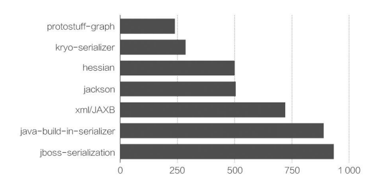
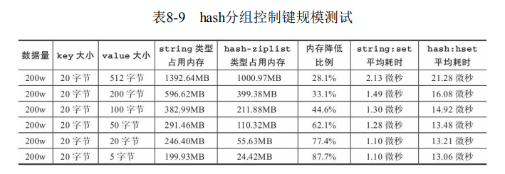
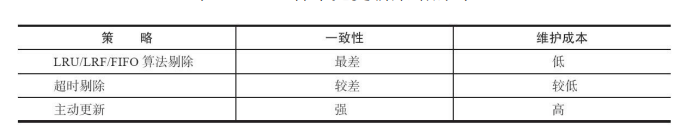
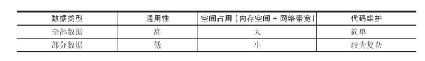

# 缓存设计

[TOC]

## 内存

可通过执行info memory 命令获取内存相关指标

| 指标                    | 含义                                                         |
| :---------------------- | :----------------------------------------------------------- |
| used_memory             | 是从Redis的角度得到的量，他表示的是Redis分配器分配的内存总量。 |
| used_memory_rss         | 表示Redis进程占据操作系统的内存，与top及ps命令看到的值是一致的。这个值除了包含分配器分配的内存之外，还包括了因为内存碎片、内存对齐引入的开销 |
| used_memory_peak        | redis的内存消耗峰值(以字节为单位)，即历史使用记录中redis使用内存峰值。 |
| used_memory_peak_perc   | 使用内存达到峰值内存的百分比，used_memory/ used_memory_peak) *100%，即当前redis使用内存/历史使用记录中redis使用内存峰值*100% |
| used_memory_overhead    | Redis为了维护数据集的内部机制所需的内存开销，包括所有客户端输出缓冲区、查询缓冲区、AOF重写缓冲区和主从复制的backlog。 |
| used_memory_startup     | Redis服务器启动时消耗的内存                                  |
| used_memory_dataset     | 数据实际占用的内存大小，即used_memory-used_memory_overhead   |
| total_system_memory     | 整个系统内存                                                 |
| used_memory_lua         | Lua脚本存储占用的内存                                        |
| maxmemory               | Redis实例的最大内存配置                                      |
| maxmemory_policy        | 当达到maxmemory时的淘汰策略                                  |
| mem_fragmentation_ratio | 碎片率，used_memory_rss/ used_memory。                       |
| mem_allocator           | 内存分配器                                                   |

需要重点关注的指标有`mem_fragmentation_ratio`

- 当`mem_fragmentation_ratio>1`时，说明有内存碎片
- 当`mem_fragmentation_ratio<1`时，说明正在使用虚拟内存

Redis进程内消耗主要包括：自身内存、对象内存、缓冲内存、内存碎片

- 自身内存可以忽略不计。

- 对象内存是 Redis 内存占用最大的一块，存储着所有的业务数据

- 缓冲内存主要包括：客户端缓冲、复制积压缓冲区、AOF 缓冲区

- Redis 默认的内存分配器采用 jemalloc，可选的分配器还有：glibc、 tcmalloc。

  jemalloc 采用分层固定块的策略。比如当保存 5KB 对象时，jemalloc 可能会采用 8KB 的块存储，而剩下的 3KB 空间变为了内存碎片不能再分配给其他对象存储。

Redis 使用`maxmemory`参数限制最大可用的对象内存（默认是尽可能地使用所有可用内存）。值得注意的是，maxmemory 限制的是 Redis 实际使用的内存量，也就是 used_memory 统计项对应的内存。这也就是说，输出缓冲区/Lua 缓存等等不受 maxmemory 限制，但却考虑在 maxmemory 内。此外，还可以通过`config set maxmemory`进行动态修改。

 

Redis 的内存回收机制主要体现在以下两个方面：

- 删除到达过期时间的键对象
- 内存使用达到 maxmemory 上限

对于第一个方面，Redis 采用以下机制，来实现过期键的内存回收。

- 定时删除：在设置键的过期时间的同时，创建一个定时器（timer），让定时器在键的过期时间来临时，立即执行对键的删除操作。但占用系统资源多，而且不高效。

- 惰性删除：惰性删除用于当客户端读取带有超时属性的键时，如果已经超过键设置的过期时间，会执行删除操作并返回空值。但是如果过期键一直不会被访问到，那么就有内存泄露的问题。
- Redis 内部维护一个定时任务，默认每秒运行10次（通过配置`hz`设置）来删除任务。它循环遍历全部 redisDb，从当前 redisDb 中随机抽取 20 个键值，如果发现过期就直接删除。判断 20 个键值中的 25%（也就是5个）是否过期：
  1. 如果小于等于25%，则退出当前 redisDb 的循环，继续下一个redisDb。
  2. 如果大于25%，继续抽取 20 个键值进行循环。清理过期 key 的时间不能超过 CPU 时间的 25%。如果 hz=1，一次清理的最大时间为 250ms；hz=10，一次清理的最大时间为 25ms。若循环总时间超过，那么就立退出。
  
  如果之前超时，那么进入快模式，此时每个事件循环前会调用 beforeSleep () 函数，执行过期 key 清理，执行清理耗时不超过 1ms。注意两次 FAST 模式间隔不低于 2ms

当Redis所用内存达到`maxmemory`上限时，就会触发相应的溢出控制策略：

- `noeviction`：默认策略，不会删除任何数据，拒绝所有写入操作并返回客户端错误信息，此时Redis只响应读操作。
- `volatile-lru`：根据 LRU 算法删除设置了 expire 属性的键（无论它是否过期），直到腾出足够空间为止。如果没有可删除的键对象，回退到`noeviction`策略。
- `allkeys-lru`：根据 LRU 算法删除键，无论数据是否设置了 expire 属性， 直到腾出足够空间为止。
- `allkeys-random`：随机删除所有键
- `volatile-random`：随机删除设置了expire属性的键
- `volatile-ttl`：根据键值对象的`ttl`属性，删除最近将要过期数据。如果没有，回退到`noeviction`策略。

 具体策略受`maxmemory-policy`参数控制，内存溢出控制策略可以采用`config set maxmemory -policy {policy}`来动态配置。每次 Redis 执行命令时都会检查是否满足 maxmeory 参数的约束。

降低 Redis 内存使用最直接的方式就是分别缩减键（key）和值（value）的长度：

- 尽量使用短名称来命名键

- 可以通过把业务对象序列化成二进制数组并放入 Redis 中，来减少值的长度。此外，应该选择更高效的序列化工具来尽可能地压缩长度

  

  

  除了存储二进制数据之外，还可以存储 json、xml 格式的文本数据。这种方式优点是方便调试和跨语言，但是对于内存的要求更高，可以考虑使用一些字符串压缩算法。

我们也可以减少键的数量，例如，把大量键分组映射到多个 hash 结构中。以查询性能换取空间。

- hash 的 field 可用于记录原始 key 字符串
- hash 的 value 保存原始值对象

这样做的坏处是 hash 重构后所有的键，无法再使用超时（expire）和 LRU 淘汰机制自动删除。但开发人员可以存储每个对象写入的时间，再通过定时任务使用 hscan 命令扫描数据，找出 hash 内超时的数据项删除即可。

### 缓存的更新策略

- `maxmemory-policy` 所指定的更新策略
- `expire` 命令
- 在向数据库写入数据时，通过消息系统通知缓存进行更新。这一套逻辑由程序员负责实现。

对于一致性要求高的业务，推荐使用主动更新策略。而对一致性不敏感的业务，使用`expire`或者`maxmeory-policy`即可。

### 缓存粒度

缓存粒度回答这个问题：对于从数据库中获取的数据，缓存哪些列？

解决方案有两种

| 方案       | 原理                                     | 优势           | 劣势           | 适用场景     |
| ---------- | ---------------------------------------- | -------------- | -------------- | ------------ |
| 缓存空对象 | 存储层返回空对象，缓存层保存这个空对象。 | 代码维护简单   | 占用缓存空间多 | 数据频繁变化 |
| 布隆过滤器 | 在缓存层前，添加布隆过滤器               | 占用缓存空间少 | 代码逻辑负责   | 数据相对固定 |

### 无底洞优化

当添加大量节点做水平扩容时，键值对会分布到更多的节点上。这就导致批量操作涉及到更多的节点，相应地网络 IO时间增加。这是分布式系统无法避免的问题，我们只能从 IO 层入手解决这个问题。

- **串行命令**，直接将命令依次发送出去，时间复杂度为$\Omicron(keys)$
- **串行IO**，Smart客户端会保存slot和节点的对应关系，这样就得到每个节点的key子列表，之后依次对每个节点执行mget或者Pipeline操作，时间复杂度为$\Omicron(nodes)$
- **并行IO**，在串行IO的基础上，并行地发送IO请求
- **hash_tag**，将多个key强制分配到 一个节点上，这会出现数据倾斜的情况
