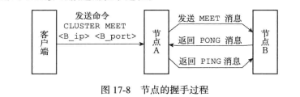
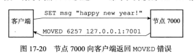
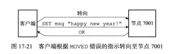
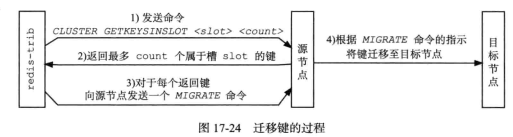
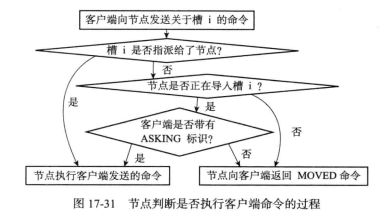
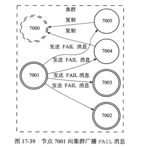
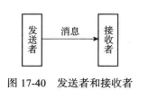

## 集群

[TOC]

## 概述

分布式数据库首先要解决的是，把整个数据集按照分区规则映射到多个节点的问题，即把数据集划分到多个节点上，每个节点负责整体数据的一个子集。

常见的分区规则有：

- **哈希分区**：对 Key 使用 Hash，适用于无法预估数据分布，或者对负载均衡有要求的情况
- **顺序分区**：将 Key 的值域进行固定划分，适用于查询优化的情况

哈希设计有以下三种策略

- `hash(key) % N`，其中`N`为节点的数量。这种策略简单，但是当扩容（收缩）节点时，需要重新计算所有键的 hash 值，这会导致数据的迁移。
- **一致性哈希分区（Distributed Hash Table）**，为每个节点分配一个`token`。先根据 Key 计算出 Hash 值，然后顺时针找到第一个大于等于该 Hash 值得 token 节点。 这样当节点变更时，只会影响环中的相邻节点。
- 虚拟槽分区（Redis 集群采用的方案）。通过一个哈希函数把所有数据映射到一个固定范围的整数集合中，集合中的每个整数称为槽（slot），每个节点负责一定数量的槽。

Redis 集群的局限性

- 对 key 的批量操作支持有限。例如，对于 mset、mget 命令，目前只支持对具有相同 slot 值的 key 执行批量操作
- 对 key 的事务操作支持有限。只支持多 key 在同一节点上的事务操作
- 不支持多数据库空间。集群模式下只能使用一个数据库空间，即 db0。
- 复制结构只支持一层，从节点只能复制主节点，不支持嵌套树状复制结构。

**redis cluster 不支持 pipeline、事务、批操作**，原因在于所有的键必须在同一个节点所持有的槽中。并且 Lua 脚本所操作的键必须在同一个节点中。

## 命令

集群

- `cluster info` 打印集群的信息
- `cluster nodes` 列出集群当前已知的所有节点

节点

- `cluster meet <ip> <port>` 将 ip 和 port 所指定的节点添加到集群当中，让它成为集群的一份子。**注意，此时并没有槽分配给它**
- `cluster forget <node_id>` 将 node_id 指定的节点设置为离线状态，此时槽没有分派给其他节点。
- `cluster del-node <ip:port> <node_id>`：将指定的节点从集群中移除（释放有关它的所有资源）。在删除之前，必须把该节点上的哈希槽分配到其他主节点上。**注意，从节点是没有被指派过槽的，所以可以直接删除**
- `cluster replicate <node_id>` 将当前节点的主节点设置为 node_id 所指定的节点
- `cluster slaves <node_id>` 列出该 slave 节点的 master 节点
- `cluster reset [HARD|SOFT]` ：Reset a Redis Cluster node. Note that this command **does not work for masters if they hold one or more keys**. `flushkey`：移除所有的键

槽

- `cluster flushslots` 移除指派给当前节点的所有槽。
- `cluster addslots <slot> [slot ...]` 将槽指派给当前节点，这个槽必须是未分配的
- `cluster delslots <slot> [slot ...]` 要求节点忘记哪个主节点正在为指定为参数的哈希槽提供服务。我们说这些哈希槽是“未绑定”的。如果具有未绑定哈希槽的节点从另一个节点收到心跳数据包，该节点声称拥有其中一些哈希槽，则该关联会立即建立。
- `cluster setslot <slot> node <node_id>` 将槽指派给指定的节点，如果槽已经指派给另一个节点，那么先让另一个节点删除该槽，然后再进行指派。
- `cluster setslot <slot> migrating <node_id>` 将本节点的槽迁移到指定的节点中。
- `cluster setslot <slot> importing <node_id>` 从指定的节点中导入槽到本节点
- `cluster keyslot <key>` 查看给定键属于哪个槽：
- `cluster countkeysinslot <slot>` 返回槽所包含的键值对数量
- `cluster getkeysinslot <slot> <count>` 返回槽中的 count 个键

对于动态新增或删除结点操作，推荐使用 redis-trib.rb，它会处理好槽的分片的。

搭建集群前，需要做以下配置：

~~~shell
cluster-enabled yes
cluster-config-file nodes.conf
cluster-node-timeout 5000
bind 0.0.0.0
appendonly yes			# 开启 AOF

masterauth passwd 		# Setting a slave to authenticate to a master If your master has a password via requirepass
requirepass passwd		# 设置密码
~~~

- cluster-enabled：开启集群模式
- cluster-conf-file：指定集群配置文件的路径，这个文件由 Redis 自动生成。 

启动集群（会自动处理好分片的）：

~~~shell
redis-cli --cluster create 122.9.7.252:6379 114.116.204.34:6379 114.116.220.197:6379 122.9.36.231:6379 114.116.218.95:6379 116.63.9.166:6379 --cluster-replicas 1 -a grf.2001
~~~

- --cluster-replicas：指定的副本数。列表前面 m 个节点作为主节点，然后每往后 n 个节点作为对应主节点的副本。
- 这里一定要指定公网地址，否则当 Redis 客户端（Redisson）从外网访问 Redis 集群时，只能获取到节点的内网地址，从而连接不到节点。

每个 Redis 集群中的节点都需要打开两个 TCP 连接。一个连接用于正常的给 Client 提供服务，比如 6379，还有一个额外的端口（通过在这个端口号上加10000）作为数据端口（6379 + 10000 = 16379）

**集群搭建后，一定要修改集群文件 cluster-config-file （/var/lib/redis/nodes-6379.conf），将其中的内网 IP 地址改为对应的公网 IP 地址。**否则 Redis 客户端将会与它自己的内网连接，从而导致失败。

如果上述命令的主从随机划分不和预期，那么我们就手动调整：

~~~shell
# 主库变从库
CLUSTER FLUSHSLOTS
CLUSTER REPLICATE c71b52f728ab58fedb6e05a525ce00b453fd2f6b

# 从库变主库
CLUSTER FAILOVER # 在从库中执行该命令
~~~

CLUSTER FAILOVER 用于支持手动故障转移，它的工作原理如下：

1. 从节点向主节点发送 CLUSTERMSG_TYPE_MFSTART 包；
2. 主节点收到该包后，会将其所有客户端置于阻塞状态，不再处理客户端发来的命令；并且在其发送的心跳包中，会带有 CLUSTERMSG_FLAG0_PAUSED 标记；
3. 从节点收到主节点发来的，带 CLUSTERMSG_FLAG0_PAUSED 标记的心跳包后，从中获取主节点当前的复制偏移量。从节点等到自己的复制偏移量达到该值后，才会开始执行故障转移流程：发起选举、统计选票、赢得选举；

FORCE 和 TAKEOVER 这两个选项，可以改变上述的流程：

- FORCE：从节点不会与主节点进行交互，主节点也不会阻塞其客户端，而是从节点立即开始故障转移流程：发起选举、统计选票、赢得选举。
- TAKEOVER：从节点不再发起选举，而是直接将自己升级为主节点，接手原主节点的槽位

添加节点：

~~~shell
$ redis-cli --cluster add-node 新节点ip:端口号  集群中任意节点ip:端口号
$ redis-cli --cluster add-node --slave --master-id <ID> 新节点ip:端口号  集群中任意节点ip:端口号
~~~

删除节点

~~~shell
redis-cli --cluster del-node 127.0.0.1:7006 node-id
~~~

重新分配槽

~~~shell
# 旧版需执行 ./redis-trib.rb 脚本
$ redis-cli --cluster reshard 192.168.0.120:6379 

# 你需要分配多少？
How many slots do you want to move (from 1 to 16384)? 
4096

# 你要给哪一个集群节点分配插槽？
what is the receiving node ID? 
d1ca7e72126934ef569c4f4d34ba75562d36068f

# 你要从哪些集群节点给 node4 节点分配插槽呢？可以输入 all 代表所有节点平均分配，也可以输入所有节 点node-ID 以done结束
Please enter all the source node IDs.
  Type 'all' to use all the nodes as source nodes for the hash slots.
  Type 'done' once you entered all the source nodes IDs.
Source node #1: all
~~~

删除集群：

1. 先重分配槽集中到某个节点 A
2. del-node 其他所有节点
3. Flushslots & FlushKeys 节点 A
4. 每个节点执行 CLUSTER RESET HARD
5. 此时每个节点仍保留集群信息，忽略即可，直接重建集群。

## 节点

连接各个**集群节点**的工作，可以使用`CLUSTER MEET`命令来完成。

~~~shell
$ CLUSTER MEET <ip> <port> 
~~~

在成功执行`CLUSTER MEET`命令之后，节点 A 会将节点 B 的信息通过 Gossip 协议传播给集群中的其他节点，让其他节点也与节点 B 进行握手，最终，经过一段时间之后，节点 B 会被集群中的所有节点认识。通过`CLUSTER NODE`可以查看集群的状态。

Redis 服务器在启动时会根据`cluster-enabled`配置选项，来决定是否开启服务器的集群模式。

~~~shell
#节点端口
port 6379

# 开启集群模式
cluster-enabled yes
# 节点超时时间，单位毫秒
cluster-node-timeout 15000
# 集群内部配置文件的路径 ${REDIS_HOME}/${cluster-config-fil}
cluster-config-file "nodes-6379.conf"
~~~

## 槽分配

集群的整个数据库被分为16384个槽（slot），数据库中的每个键都属于这 16384 个槽的其中一个。当数据库中的 16384 个槽都有节点在处理时，集群处于**上线状态（ok）**，否则处于**下线状态（fail）**。**每个节点都以各自视角维护着集群状态以及槽的分配情况。**

通过向节点发送 `CLUSTER ADDSLOTS` 命令，我们可以将槽分配到指定节点中：

~~~shell
$ CLUSTER ADDSLOTS <slot> [slot ...]

# 例子，将槽0至槽5000指派给节点负责
$ CLUSTER ADDSLOTS 0 1 2 3 4 ... 5000
~~~

一个节点还会将自己的 slots 数组通过消息发送给集群中的其他节点，以此来告知其他节点自己目前负责处理哪些槽。为了知道槽 x 被指派给了哪个节点，程序需要遍历 slots 数组，复杂度为$\Omicron(n)$。但是判断节点是否持有槽 x 的时间复杂度为$\Omicron(1)$。

## 在集群中执行命令

当客户端向节点发送与键有关的命令时：接收命令的节点会计算出命令要处理的键属于哪个槽。如果键所在的槽正好就指派给了当前节点，那么节点直接执行这个命令。否则会向客户端返回一个 MOVED 错误，指引客户端转向（redirect）至正确的节点（路由重定位）

MOVED 错误的格式为：

~~~shell
$ MOVED <slot> <ip>:<port>
~~~

> 被隐藏的MOVED错误
>
> 客户端启动时，携带`-c`选项，就可以进入集群模式
>
> ~~~shell
> $ redis-cli -c -p 7000 # 集群模式
> ~~~
>
> ~~~shell
> $ redis-cli -p 7000 # 单机模式
> ~~~
>
> 对于集群模式，它会根据 MOVED 错误自动进行节点转向。单机模式不理解 MOVED 错误，会在客户端中直接打印错误
>
> ~~~shell
> $ redis-cli -c -p 7000 # 集群模式
> 
> 127.0.0.1:7000> SET msg "happy new year!"
> -> Redirected to slot [6257] located at 
> 
> 
> $ redis-cli -p 7000 # 单机模式
> 
> 127.0.0.1:7000> SET msg "happy new year!"
> (error) MOVED 6257 127.0.0.1:7001
> ~~~

节点和单机服务器在数据库方面的一个区别是，节点只能使用 0 号数据库，而单机Redis 服务器则没有这一限制。

## 重新分片

Redis 集群的重新分片操作，可以将任意数量的已经指派给某个节点（源节点）的槽重新分配给另一个节点（目标节点）。并且与槽关联的键值对，也会从源节点被移动到目标节点。该操作是由 Redis 的集群管理软件 redis-trib 负责的：

~~~shell
$ redis-trib.rb reshard host:port --from <arg> --to <arg> --slots <arg> --yes --timeout
<arg> --pipeline <arg>
~~~

节点下线

~~~shell
$ redistrib.rb del-node {host：port} {downNodeId}
~~~

重分配的步骤如下：

1. redis-trib 对目标节点发送`CLUSTER SETSLOT <slot> IMPORTING <source_id>` 命令，让目标节点准备好从源节点导入（import）属于槽 slot 的键值对。

2. redis-trib 对源节点发送`CLUSTER SETSLOT <slot> MIGRATING <target_id>`命令，让源节点准备好将属于槽 slot 的键值对迁移（migrate）至目标节点。
3. redis-trib 向源节点发送`CLUSTER GETKEYSINSLOT <slot> <count>`命令，获得最多 count 个属于槽 slot 的键值对的键名（key name）
4. 对于步骤 3 获得的每个键名，redis-trib 都向源节点发送一个`MIGRATE <target_ip> <target_port> <key_name> 0 <timeout>`命令，将被选中的键，原子地从源节点迁移至目标节点。
5. 重复执行步骤 3 和步骤 4，直到源节点保存的所有属于槽 slot 的键值对都被迁移至目标节点为止
6. redis-trib 向集群中的任意一个节点发送`CLUSTER SETSLOT <slot> NODE <target_id>`命令，这信息会通过消息发送至整个集群，最终集群中的所有节点都会知道槽 slot 已经指派给了目标节点。

## ASK 错误

在进行重新分配槽的期间，源节点的数据库保存一部分与槽关联的键值对，目标节点的保存另一部分。此时，当客户端向源节点发送一个与键有关的命令时

1. 源节点会先在自己的数据库里面查找指定的键，如果查找成功，那么直接执行客户端发送的命令，

2. 否则，节点会检查看键 key 所属的槽 x 是否正在进行迁移

3. 如果槽 x 的确在进行迁移的话，那么节点会向客户端发送一个 ASK 错误，引导客户端到目标节点去查找键 key。

   ~~~shell
   ASK 16198 127.0.0.1:7003
   ~~~

4. 然后客户端向目标节点发送一个`ASKING`命令，之后再重新发送原本想要执行的命令。该命令唯一要做的就是，启用发送该命令的客户端的`REDIS_ASKING`标识。

   

   **注意，在槽迁移过程中，并没有更新指派信息**，这就导致如果客户端不发送`ASKING`命令，而直接发送想要执行的命令的话，那么客户端发送的命令将被节点拒绝执行，并返回`MOVED`错误。

   而且当节点执行了一个带有`REDIS_ASKING`标识的客户端命令之后，客户端的`REDIS_ASKING`标识就会被移除。

   

和隐藏的 MOVED 错误情况类似，集群模式的 redis-cli 在接到 ASK 错误时也不会打印错误。

## 复制与故障转移

**Redis Cluster 自带复制与故障转移功能。**

Redis 集群中的节点分为**主节点（master）**和**从节点（slave）**，其中主节点用于处理槽，而从节点则用于复制某个主节点，并在被复制的主节点下线时，代替下线主节点继续处理命令请求。

~~~shell
$ CLUSTER REPLICATE <node_id>
~~~

可以让接收命令的节点成为 node_id 所指定节点的从节点，并开始对主节点进行复制。一个节点成为从节点这个信息，会通过消息发送给集群中的其他节点。

集群中的每个节点都会定期地向集群中的其他节点发送 PING 消息，以此来检测对方是否在线，如果接收 PING 消息的节点（目的节点）没有在规定的时间内，向源节点返回 PONG 消息，那么源节点就会将目的节点标记为**疑似下线（probable fail，PFAIL）**

集群中的各个节点会通过互相发送消息的方式来交换集群中各个节点的状态信息，例如某个节点是处于在线状态、疑似下线状态（PFAIL），还是已下线状态（FAIL）。

如果在一个集群里面，半数以上主节点都将某个主节点`x`报告为疑似下线，那么这个主节点`x`将被标记为已下线（FAIL）。将主节点`x`标记为已下线的节点，会向集群广播一条关于主节点 x 的FAIL消息，所有收到这条FAIL消息的节点都会立即将主节点 x 标记为已下线。

当一个从节点发现自己正在复制的主节点进入了已下线状态时，从节点将开始对下线主节点进行故障转移，以下是故障转移的执行步骤：

1. 选举出一个新的主节点
2. 被选中的从节点会执行 SLAVEOF no one 命令
3. 新的主节点会撤销所有对已下线主节点的槽，并将这些槽全部指派给自己。
4. 新的主节点向集群广播一条 PONG 消息，这条 PONG 消息可以让集群中的其他节点立即知道这个从节点变成了主节点。

以下是集群选举新的主节点的方法（Raft算法）：

- 集群的配置纪元是一个自增计数器，它的初始值为0。
- 当集群里的某个节点开始一次故障转移操作时，集群配置纪元的值会被增一。
- 当从节点发现自己的主节点进入下线状态时，从节点会往集群中广播一条`CLUSTERMSG_TYPE_FAILOVER_AUTH_REQUEST`消息，要求具有投票权的主节点向这个从节点投票。
- 在每个配置纪元中，集群里每个主节点都有一次投票的机会，而且只会投给一个请求票的从节点。主节点将向要求投票的从节点返回一条`CLUSTERMSG_TYPE_FAILOVER_AUTH_ACK`消息，表示这个主节点支持从节点成为新的主节点。
- 如果集群里有`N`个具有投票权的主节点，那么当一个从节点收集到大于等于`N/2+1`张支持票时，这个从节点就会当选为新的主节点。因为投票机制确保了新的主节点只会有一个
- 如果在一个配置纪元里面没有从节点能收集到足够多的支持票，那么集群进入一个新的配置纪元，并再次进行选举，直到选出新的主节点为止。

## 消息

集群中的各个节点通过发送和接收消息（message）来进行通信。

节点发送的消息主要有以下五种：

- MEET 消息：当发送者接到客户端发送的 CLUSTER MEET 命令时，发送者会向接收者发送 MEET 消息，请求接收者加入到发送者当前所处的集群里面。
- PING 消息：集群里的每个节点默认每隔一秒钟就会从已知节点列表中随机选出五个节点，然后对这五个节点中最长时间没有发送过 PING 消息的节点发送 PING 消息，以此来检测被选中的节点是否在线。除此之外，如果节点 A 最后一次收到节点 B 发送的 PONG 消息的时间，距离当前时间已经超过了节点 A 的 cluster-node-timeout 选项设置时长的一半，那么节点 A 也会向节点 B 发送 PING 消息，这可以防止节点 A 因为长时间没有随机选中节点 B 作为 PING 消息的发送对象，而导致对节点 B 的信息更新滞后。
- PONG 消息：当接收者收到发送者发来的 MEET 消息或者 PING 消息时，为了向发送者确认这条 MEET 消息或者 PING 消息已到达，接收者会向发送者返回一条 PONG 消息。另外，一个节点也可以通过向集群广播自己的 PONG 消息来让集群中的其他节点立即刷新关于这个节点的认识
- FAIL 消息：当一个主节点 A 判断另一个主节点 B 已经进入 FAIL 状态时，节点 A 会向集群广播一条关于节点 B 的 FAIL 消息，所有收到这条消息的节点都会立即将节点 B 标记为已下线。
- PUBLISH 消息：当客户端向集群中的某个主节点发送命令：`PUBLISH <channel> <msg>`。，节点会执行这个命令，并向集群广播一条 PUBLISH 消息，所有接收到这条 PUBLISH 消息的节点都会执行相同的 PUBLISH 命令。

Redis 集群中的各个节点通过 Gossip 协议来交换各自关于不同节点的状态信息，其中 Gossip 协议由 MEET、PING、PONG 三种消息实现，

## 运维问题

redis为了保持事务，同一个lua脚本访问应该访问同一个slot（hash槽），否则报出 `command keys must in same slot` 的异常

在故障转移的整个阶段，整个集群是不可用状态。更一般的说，如果有某个槽未被指派，那么整个集群不可用。可以将参数`cluster-require-full-coverage`配置为`no`，这样只有故障节点所负责的键是不可用的。

此外，还要考虑集群内部 Gossip 协议所带来的通信消耗，建议

- 集群节点分布在不同机器上
- 一个集群内的节点要尽可能少（控制在 100 以内）

还有，集群内的`Publish`命令会向所有节点进行广播，加重网络负担。

集群倾斜就是各个节点之间的负载不均衡，原因可能如下：

- 槽分配不均

- 请求不均衡，尤其在热点数据集中分布时

- 不同槽内键的数量差异过大，尤其是在大量使用`hash_tag`时

  使用 hash tag 后客户端在计算 key 的 crc16 时，只计算 {} 中数据。如果没使用 hash tag，客户端会对整个 key 进行 crc16计算。

  ~~~shell
  set user:info{1}
  ~~~
  
  

在集群模式下，从节点不接受任何读写请求，发送过来的键命令会重定向到相应的主节点上。客户端可以通过`config set slave-read-only yes` 命令，允许客户端直接读取 slaves 服务器节点。

由于复制动作是异步进行，所以可能 Master 执行写操作后尚未同步到 Salve 中，主从服可能存在一个数据不一致的中间状态

