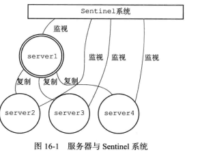
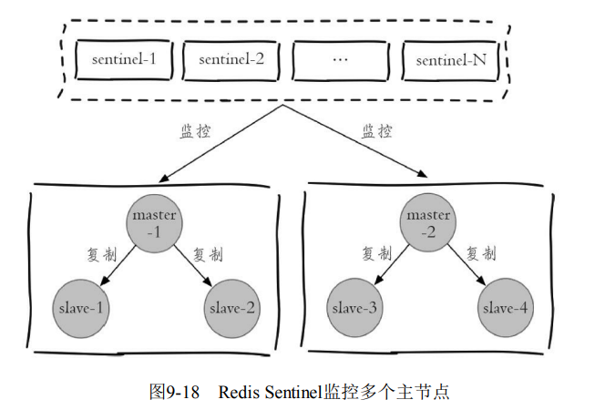
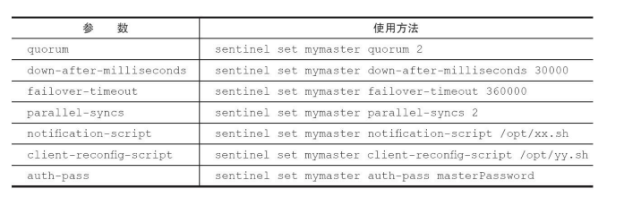
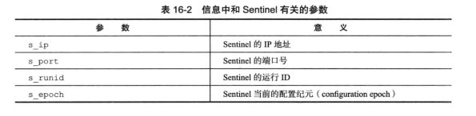
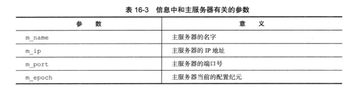
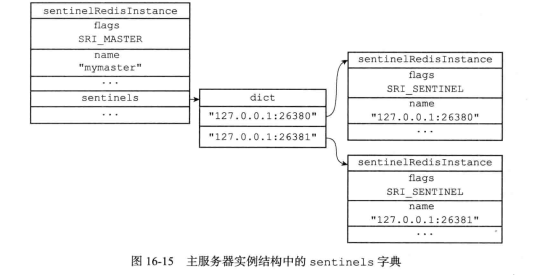
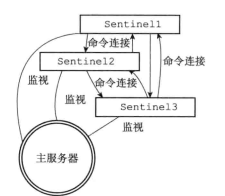
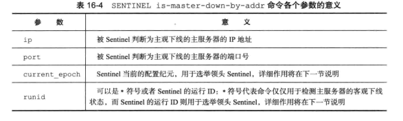
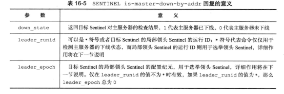

# 哨兵

[TOC]

## Sentinel 概述

Redis的主从复制模式下，一旦主节点由于故障不能提供服务，需要人工介入做以下两件事情

- 某个从节点晋升为主节点`slaveof no one`
- 通知从节点更新主节点地址
- 如果旧的主节点恢复上线，那么旧的主节点降级为从节点

在很多场景下，这种故障处理的方式是无法接受的：

- 应用方无法及时感知到主节点的变化，必然会造成一定的写数据丢失和读数据错误
- 整个故障转移的过程是需要人工来介入的，在故障转移实时性和准确性上，都无法得到保障

Redis从2.8开始正式提供了 Redis Sentinel（哨兵）架构来解决这个问题。Redis Sentine l是一个分布式架构，其中包含若干个 Sentinel 节点和 Redis 数据节点，每个 Sentinel 节点会对数据节点和其余 Sentinel 节点进行监控。如果发现主节点不可达时，那么会选举出一个新的主节点，这整个故障转移过程是全自动的。

> - Redis 数据节点：主节点和从节点
> - Sentinel 节点：监控 Redis 数据节点
> - Redis Sentinel：Sentinel 节点和数据节点
> - 应用方：泛指一个或多个客户端

## 部署Sentinel

首先编写配置文件：

~~~shell
port 26379											# Redis Sentinel 服务在端口号26379上监听连接。
daemonize yes										# Redis Sentinel 进程会在后台运行
logfile "26379.log"									# 设置 Redis Sentinel 的日志文件名
sentinel monitor mymaster 127.0.0.1 6379 2			# 监听 127.0.0.1#6379 Redis 数据节点，并将其命名为 mymaster
sentinel down-after-milliseconds mymaster 30000		# 'mymaster'在30,000毫秒(即30秒)内没有响应，则认为'mymaster'宕机
sentinel parallel-syncs mymaster 2					# 最多允许 2 个从节点在故障恢复后，同时进行同步。
sentinel failover-timeout mymaster 180000			# 如果在180,000毫秒(即180秒)内，故障转移操作没有成功完成，那么Redis Sentinel将会放弃这次故障转移。

#sentinel auth-pass <master-name> <password>
#sentinel notification-script <master-name> <script-path>
#sentinel client-reconfig-script <master-name> <script-path>
~~~

启动 sentinel 服务

~~~shell
$ redis-sentinel redis-sentinel-26379.conf
# 或者
$ redis-server --sentinel redis-sentinel-26379.conf
~~~

通过 info sentinel 命令查看 sentinel 节点的信息

~~~shell
$ redis-cli -h 127.0.0.1 -p 26379 info Sentinel
# Sentinel
sentinel_masters:1
sentinel_tilt:0
sentinel_running_scripts:0
sentinel_scripts_queue_length:0
master0:name=mymaster,status=ok,address=127.0.0.1:6379,slaves=2,sentinels=3
~~~

**sentinel 节点会自动关联主节点上的其他 sentinel 节点，以及监控所有的从节点。**

Redis Sentinel 可以同时监控多个主节点，只需指定多个 masterName 来区分不同的主节点即可

~~~shell
sentinel monitor master-business-1 10.10.xx.1 6379 2
sentinel down-after-milliseconds master-business-1 60000

sentinel monitor master-business-2 10.16.xx.2 6380 2
sentinel down-after-milliseconds master-business-2 10000
~~~

Sentinel 节点也支持动态地设置参数

~~~shell
sentinel set <param> <value>
~~~

- sentinel set 命令只对当前 Sentinel 节点有效。一定要保证多个 Sentinel 之间的配置一样。
- sentinel set 命令如果执行成功会立即刷新配置文件，这点和 Redis 普通数据节点需要执行`config rewrite`刷新到配置文件不同。

下面讲解一下它的配置项

~~~
sentinel monitor <master-name> <ip> <port> <quorum>
~~~

- `quorum`，代表要判定主节点最终不可达所需要的票数。建议设置为 $\frac{sentinel节点}{2} + 1$

~~~
sentinel down-after-milliseconds <master-name> <times>
~~~

每个 Sentinel 节点都要通过定期发送 ping 命令，来判断 Redis 数据节点和其余 Sentinel 节点是否可达。如果超过了down-after-milliseconds 配置的时间且没有有效的回复，则判定节点不可达。

~~~c
sentinel parallel-syncs <master-name> <nums>
~~~

parallel-syncs 就是用来限制在一次故障转移之后，每次向新的主节点发起复制操作的从节点个数。例如，parallelsyncs=3 表示每次会有三个从节点并行发起复制；parallel-syncs=1表示从节点会轮询发起复制。

~~~
sentinel failover-timeout <master-name> <times>
~~~

failover-timeout 表示超时时间，分别作用于故障转移的各个阶段：

1. 选出合适从节点。

2. 晋升选出的从节点为主节点。

   如果 sentinel 节点向（1）阶段选出来的从节点执行`slaveof no one`超过 failover-timeout，那么故障转移失败。

   在（2）阶段如果执行成功，sentinel 还会继续执行 info 命令来确认（1）阶段选出来的节点确实晋升为主节点，如果此过程执行时间超过 failover-timeout 时，则故障转移失败.

3. 其余从节点复制新的主节点。

   如果（3）节点执行时间超过了 failover-timeout（不包含复制时间），则故障转移失败

4. 旧的主节点恢复后，复制新的主节点。

如果故障转移失败，那么等待$2 * timeout$后再次进行故障转移操作

~~~
sentinel auth-pass <master-name> <password>
~~~

当Master设置了密码时，Sentinel 连接 Master 时需要通过设置参数`auth-pass`，来提供相应的密码。

~~~shell
sentinel notification-script
~~~

在故障转移期间，当一些警告级别的 Sentinel 事件发生（例如，-sdown：客观下线、-odown：主观下 线）时，会执行指定路径的脚本，并向脚本发送相应的事件参数。

~~~shell
#!/bin/sh
#获取所有参数
msg=$*
# 报警脚本或者接口，将msg作为参数
exit 0
~~~

~~~
sentinel client-reconfig-script
~~~

在故障转移结束后，会执行指定路径的脚本，并向脚本发送与故障转移结果相关的参数。

## Sentinel API

Sentinel 不能使用数据节点的命令，例如 set、get，它有自己的一套命令。

输出指定被监控的主节点状态

~~~shell
# 输出指定主节点的状态
$ sentinel master <master name>

# 输出所有主节点的状态
$ sentinel masters
~~~

输出指定主节点下的从节点状态

~~~shell
$ sentinel slaves <master name>
~~~

输出指定主节点上的 Sentinel 节点状态

~~~shell
$ sentinel sentinels <master name>
~~~

对匹配 pattern 的主节点进行重置，包括清除主节点的相关状态（例如故障转移），重新选举等等

~~~shell
$ sentinel reset <pattern>
~~~

对指定主节点强制进行故障转移，即不与其他 Sentinel 节点进行协商。当故障转移完成后，其他`Sentinel`节点按照故障转移的结果更新自身配置。

~~~shell
$ sentinel failover <master name>
~~~

检测指定主节点与其他 Sentinel 的连接

~~~shell
 $ sentinel ckquorum <master name>
 # OK 3 usable Sentinels. Quorum and failover authorization can be reached
~~~

取消当前 Sentinel 节点对于指定主节点的监控。

~~~shell
$ sentinel remove <master name>
~~~

对某个主节点进行监控

~~~shell
$ sentinel monitor <master name> <ip> <port> <quorum>
~~~

## 客户端连接

对于 Redis 的客户端而言，如果使用了支持集群的客户端库，那么当节点失效时，故障转移过程对用户来说是透明的。

~~~java
public JedisSentinelPool(
    String masterName, 					// 主节点名
    Set<String> sentinels, 				//  Sentinel 节点集合
    GenericObjectPoolConfig poolConfig,  // common-pool连接池配置
    int connectionTimeout, 				// 连接超时
    int soTimeout, 						// 读写超时
    String password, 					// 主节点密码
    int database, 						// 当前数据库索引
    String clientName)					//  客户端名
~~~

使用示例：

~~~java
Jedis = jedisSentinelPool.getResouce();
~~~

初始化的过程如下：

~~~java
private HostAndPort initSentinels(Set<String> sentinels, String masterName) {
    HostAndPort master = null;
    boolean sentinelAvailable = false;
    Iterator var5 = sentinels.iterator();

    String sentinel;
    HostAndPort hap;
    // 遍历所有sentinel节点
    while(var5.hasNext()) {
        sentinel = (String)var5.next();
        hap = this.toHostAndPort(Arrays.asList(sentinel.split(":")));
        Jedis jedis = null;

        try {
            jedis = new Jedis(hap.getHost(), hap.getPort());
            
            // 找到一个可用的 Sentinel 节点，执行 sentinelGetMasterAddrByName（masterName），并找到指定主节点信息。
            List<String> masterAddr = jedis.sentinelGetMasterAddrByName(masterName);
            sentinelAvailable = true;
            if (masterAddr != null && masterAddr.size() == 2) {
                master = this.toHostAndPort(masterAddr);
                break;
            }
            // 查找指定主节点失败（主节点并不在该Sentinel节点的监控下），那么继续遍历
        } catch (JedisException var13) {
        } finally {
            if (jedis != null) {
                jedis.close();
            }
        }
    }

    if (master == null) {
        // 抛出异常
    } else {
        var5 = sentinels.iterator();
        while(var5.hasNext()) {
            //  为每一个 Sentinel 节点单独启动一个线程，利用 Redis 的发布订阅功能，每个线程订阅 Sentinel 节点上的“+switch-master”频道，以自动切换主节点
            sentinel = (String)var5.next();
            hap = this.toHostAndPort(Arrays.asList(sentinel.split(":")));
            MasterListener masterListener = new MasterListener(masterName, hap.getHost(), hap.getPort());
            masterListener.setDaemon(true);
            this.masterListeners.add(masterListener);
            masterListener.start();
        }
        return master;
    }
}
~~~

## 原理

### 定时任务

Redis Sentinel 通过三个定时监控任务完成对各个节点发现和监控：

1. 每隔10秒，每个 Sentinel 节点会向主节点发送 info 命令。通过分析 INFO 命令的回复，来获取主服务器的当前信息。

   ~~~shell
   # Server
   ...
   run_id:7611c59dc3a29aa6fa0609f841bb6a1019008a9c
   ...
   
   # Replication
   # 获取从服务器的信息，这样Sentinel无须用户提供从服务器的地址信息，就可以自动发现从服务器。
   role:master
   ...
   slave0:ip=127.0.0.1,port=11111,state=online,offset=43,lag=0
   slave1:ip=127.0.0.1,port=22222,state=online,offset=43,lag=0
   slave2:ip=127.0.0.1,port=33333,state=online,offset=43,lag=0
   ...
   
   # Other sections
   ~~~

   当 Sentinel 发现有新的从服务器时，会创建到从节点的命令连接和订阅连接。在创建命令连接之后，Sentinel 在默认情况下，会以每十秒一次的频率通过命令连接向从服务器发送 INFO 命令，并获得类似于以下内容的回复：

   ~~~shell
   # Server
   ...
   run_id:32be0699dd27b410f7c90dada3a6fab17f97899f
   ...
   
   # Replication
   role:slave
   master_host:127.0.0.1
   master_port:6379
   master_link_status:up
   slave_repl_offset:11887
   slave_priority:100
   
   # Other sections
   ...
   ~~~

2. 每个 Sentinel 节点各自会创建一个订阅连接，专门用于订阅主（从）服务器的`__sentinel__:hello`频道。

   在默认情况下，Sentinel 会以每两秒一次的频率，通过命令连接向所有被监视的主服务器和从服务器发送以下格式的命令：

   ~~~
   PUBLISH __sentinel__:hello "<s_ip>,<s_port>,<s_runid>,<s_epoch>,<m_name>,<m_ip>,<m_port>,<m_epoch>"
   ~~~

   

   

   这里有意思的一点是，Sentinel 既通过命令向服务端的`__sentinel__:hello`频道发送信息，又通过订阅从服务端的`__sentinel__:hello`频道接收信息。

   当一个 Sentinel 接收（目的）到其他 Sentinel（源）发来的信息：

   1. 根据信息提取出的主服务器参数，并据此查找相应的主节点实例结构，然后提取出 sentinel 参数。

   - 如果源 Sentinel 的实例已经存在该 sentinels 参数中，那么进行相应的更新
   - 否则为源 Sentinel 创建一个新的实例结构，并添加进 sentinels 字典中，同时创建一个连向新 Sentinel 的命令连接。

   

   因此，用户在使用 Sentinel 时，无需要提供各个 Sentinel 的地址信息，监视同一个主服务器的多个 Sentinel 可以自动发现对方，形成相互连接的网络。

   

3. 每隔1秒，每个 Sentinel 节点会向主节点、从节点、其余 Sentinel 节点，发送一条 ping 命令，来做一次心跳检测。

### 主客观下线

每个 Sentinel 节点会向主节点、从节点、其余 Sentinel 节点，发送一条 ping 命令，来做一次心跳检测。

对 PING 命令的回复可以分为以下两种情况：

- 有效回复：返回+PONG、-LOADING、 -MASTERDOWN 其中一种
- 无效回复

如果主节点 master 在`down-after-milliseconds`（默认值为50000）内，每次都向 Sentinel 返回无效回复时，那么Sentinel 就会将 master 标记为主观下线。

~~~xml
  sentinel monitor master 127.0.0.1 6379 2
  sentinel down-after-milliseconds master 50000
~~~

上述配置不仅会成为 Sentinel 判断 master 进入主观下线的标准，还会成为 Sentinel 判断 master 下的所有从服务器，以及监控该 master 的其他 Sentinel 进入主观下线的标准。

当 Sentinel 将一个主服务器判断为主观下线之后，为了确认这个主服务器是否真的下线了，它会向同样监视这一主服务器的其他 Sentinel，询问它们是否也认为主服务器已经进入了下线状态。通过下述命令来进行询问：

~~~shell
$ SENTINEL is-master-down-by-addr <ip> <port> <current_epoch> <runid>
~~~

当一个 Sentinel（目标Sentinel）接收到另一个Sentinel（源Sentinel）发来的`SENTINEL is-master-down-by`命令时，目标 Sentinel 会分析并取出命令请求中包含的各个参数，并根据其中的主服务器IP和端口号，检查主服务器是否已下线，然后向源 Sentinel 返回包含三个参数的`Multi Bulk`回复

~~~shell
1) <down_state>
2) <leader_runid>
3) <leader_epoch>
~~~

当 Sentinel 从其他 Sentinel 接收到足够数量（由参数`quorum`来指定）的主观下线判断之后，Sentinel 就会将从服务器判定为**客观下线**，并对主服务器执行故障转移操作。

### 领导者选举

当一个主服务器被判断为客观下线时，监视该主服务器的各个 Sentinel 会进行协商，选举出一个领头 Sentinel，并由领头 Sentinel 对下线主服务器执行故障转移操作。

选举规则如下（Raft算法）：

- 所有在线的 Sentinel 都有被选为领头 Sentinel 的资格
- 每次进行领头 Sentinel 选举之后，不论选举是否成功，所有 Sentinel 的配置纪元（con guration epoch）的值都会自增一次
- 在一个配置纪元里面，所有 Sentinel 都有一次将某个 Sentinel 设置为局部领头 Sentinel 的机会。局部领头一旦设置，在这个配置纪元里面就不能再次更改。
- **每个发现主服务器进入客观下线的 Sentinel**（候选者），都会要求其他 Sentinel （跟随者）将自己设置为局部领头 Sentinel（SENTINEL is-master-down-by-addr 的 runid 参数为源 Sentinel 的 ID）。
- Sentinel 设置局部领头 Sentinel 的规则是先到先得
-  目标 Sentinel 在接收到 SENTINEL is-master-down-by-addr 命令之后，将向源 Sentinel 返回一条命令回复，回复中的 leader_runid 参数和 leader_epoch 参数分别记录了目标 Sentinel 的局部领头 Sentinel 的运行 ID 和配置纪元。
- 源 Sentinel 在接收到目标 Sentinel 返回的命令回复之后，会检查回复中 leader_epoch 参数的值和自己的配置纪元是否相同，如果相同的话，那么源 Sentinel 继续取出回复中的 leader_runid 参数。如果 leader_runid 参数的值和源 Sentinel 的运行 ID 一致，那么表示目标 Sentinel 将源 Sentinel 设置成了局部领头 Sentinel。如果不一致，那么源 Sentinel 放弃候选者身份，而投票给目的 Sentinel 所投给的 Sentinel。
-  如果有某个 Sentinel 被半数以上的 Sentinel 设置成了局部领头 Sentinel，那么这个 Sentinel 成为领头 Sentinel。
- 因为领头 Sentinel 的产生需要半数以上 Sentinel 的支持，并且每个 Sentinel 在每个配置纪元里面只能设置一次局部领头 Sentinel，所以在一个配置纪元里面，只会出现一个领头 Sentinel。
- 如果在给定时限内，没有一个 Sentinel 被选举为领头 Sentinel，那么各个 Sentinel 将在一段时间之后再次进行选举，直到选出领头 Sentinel 为止。

### 故障转移

在选举产生出领头Sentinel之后，领头Sentinel将对已下线的主服务器执行故障转移操作，该操作包含以下三个步骤：

1. 领头 Sentinel 会将客观下线主服务器所属的所有从服务器，都保存到一个列表里面，然后按照以下规则，一项一项地对列表进行过滤：

   - 删除已下线的从服务器
   - 删除列表中所有最近五秒内没有回复过领头 Sentinel 的 INFO 命令的从服务器
   - 删除所有与已下线主服务器连接断开超过 down-after-milliseconds * 10 毫秒的从服务器，保证数据都是比较新的
   - 之后，领头Sentinel将根据从服务器的优先级，对列表中剩余的从服务器进行排序，并选出其中优先级最高的从服务器
   - 如果有多个优先级相同的，那么领头 Sentinel 将从中挑选出偏移量最大的从服务器
   - 如果偏移量还相同，那么从总挑选出ID最小的从服务器。

   然后向这个从服务器发送 SLAVEOF no one 命令，将这个从服务器转换为主服务器。之后领头 Sentinel 会以每秒一次的频率向被升级的从服务器发送 INFO 命令，直到在从服务回复中的角色信息为 master

2. 然后让其他所有从服务器去复制新的主服务器，这一动作可以通过向从服务器发送 SLAVEOF 命令来实现。

3. 最后当旧的主服务器重新上线时，Sentinel 就会向它发送 SLAVEOF 命令，让它成为新主节点的从服务器。

   

## 哨兵运维

从节点一般可以起到两个作用

1. 当主节点出现故障时，作为主节点的后备顶上来，从而实现故障转移
2. 扩展主节点的读能力

Sentinel 的故障转移是针对主节点的，但是我们同时也要保证从节点的高可用性，这一点可以通过在客户端中订阅以下主题，并实现相应的逻辑。

- +switch-master：晋升为主节点
- +convert-to-slave：降级为从节点
- +sdown：主观下线
- +reboot：重新启动了某个节点

