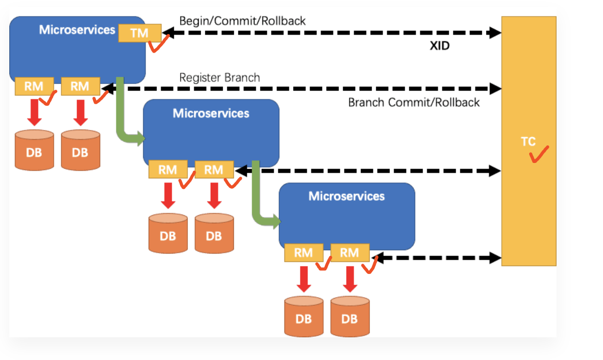
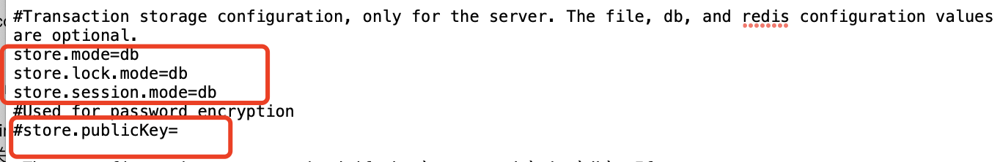
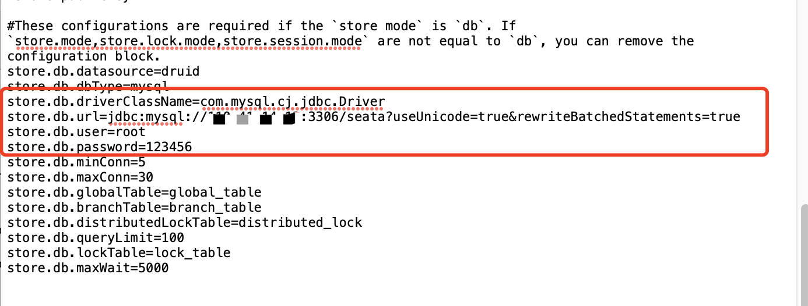
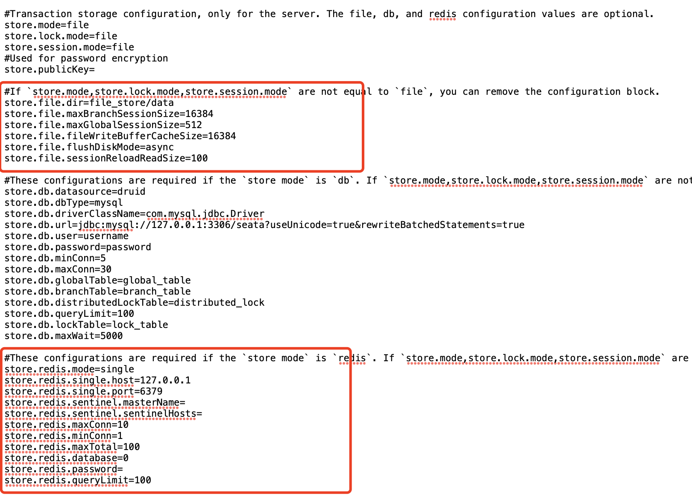
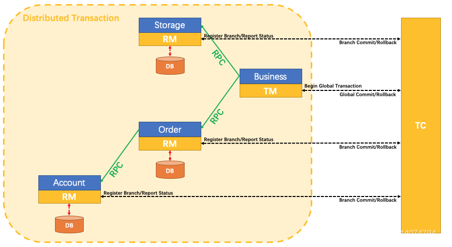
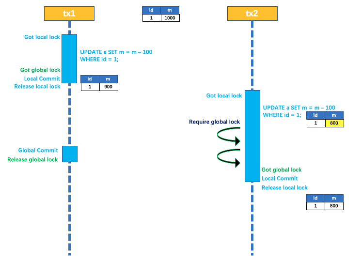
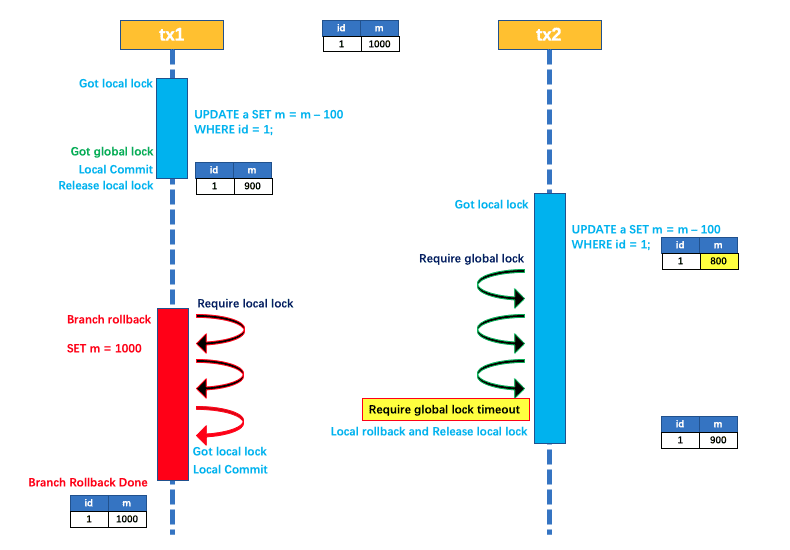
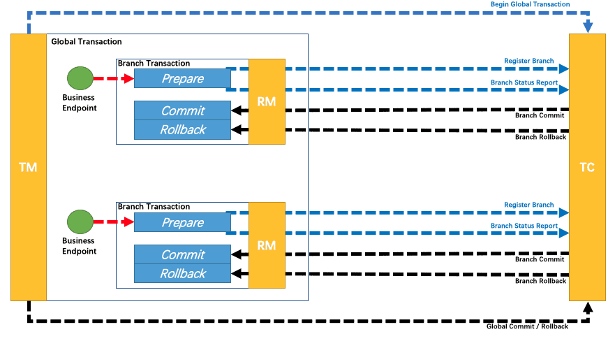

# Seata

[TOC]

Seata 是一款开源的分布式事务解决方案，致力于提供高性能和简单易用的分布式事务服务。Seata 提供了 AT、TCC、SAGA 和 XA 事务模式。它是由以下三个角色构成的：


- TC (Transaction Coordinator) - 事务协调者：维护全局事务和分支事务的状态，驱动全局事务提交或回滚
- TM (Transaction Manager) - 事务管理器：与 TC 交互，开启、提交、回滚全局事务
- RM (Resource Manager) - 资源管理器：与 TC 交互，注册分支事务和报告分支事务的状态，并驱动分支事务提交或回滚。

其中，TC 为单独部署的 **Server** 服务端，TM 和 RM 为嵌入到应用中的 **Client** 客户端。

Seata 处理分布式事务的主要流程（XA、AT、TCC 基本上都依赖于 2PC 模型）：



1. TM 请求 TC 开启一个全局事务。TC 会生成一个 **XID** 作为该全局事务的编号。
2. RM 请求 TC 将本地事务注册为全局事务的分支事务，通过全局事务的 **XID** 进行关联。
3. TM 请求 TC 告诉 **XID** 对应的全局事务是进行提交还是回滚。
4. TC 驱动 RM 们将 **XID** 对应的自己的本地事务进行提交还是回滚。


本质上，AT、TCC、Sage 都是补偿性的。它们的事务处理机制构建在框架或者应用中。事务资源本身对分布式事务是无感知的。但是在 XA 模式下，事务资源对分布式事务是有所感知的。XA 模式是传统分布式强一致性的解决方案，性能较低，在实际业务中使用得较少。

## 安装服务端

下载服务端：https://seata.apache.org/zh-cn/unversioned/download/seata-server/#:~:text=%E7%A8%B3%E5%AE%9A%E7%89%88.%20ASF


按照 `application.example.yml` 来修改 `application.yml` 文件。

1. 在 logging 配置中 `${log.home:${user.home}/logs/seata}` ，`${log.home}` 是首选属性，如果该属性存在且有值，那么表达式的值就是 `${log.home}` 的值；如果 `${log.home}` 不存在或者没有值，那么这个表达式的值就是 `${user.home}/logs/seata`。

2. 不要删除 security 配置项

3. Seata Server 需要对全局事务与分支事务进行存储，以便对它们进行管理。其存储模式目前支持三种：file、db 与 redis。

   根据` script/server/db` 下的 `mysql.sql` 文件，来创建 db 所需的表

4. 由于 Seata 不支持 mysql8，所以要将 [mysql-connector-j-8.3.0.jar](..\..\..\..\.m2\repository\com\mysql\mysql-connector-j\8.3.0\mysql-connector-j-8.3.0.jar) 包放在 lib 目录下。

5. `script/config-center`下的` config.txt` 文件**要先**上传到配置中心的，这样客户端才可以使用到

   1. 将 `store.mode`、`store.lock.mode`、`store.session.mode` 中原来的 file 值修改为 db。再将公钥行注释掉。

      

   2. 修改 store.db 下的相关配置项

      

   3. 由于这里指定的存储模式是db，所以需要将file模式与redis模式相关的配置全部删除。

      

在 cmd 中运行 bin 目录下的脚本即可，这样可以看报错信息。


~~~yaml
server:
  port: 7091    # 管理页面的端口

spring:
  application:
    name: seata-server

logging:
  config: classpath:logback-spring.xml
  file:
    path: ${log.home:${user.home}/logs/seata}

console:
  user:
    username: seata
    password: seata

seata:
  config:
    type: file
  registry:
    type: file
  server:
    service-port: 8091 #If not configured, the default is '${server.port} + 1000'
    max-commit-retry-timeout: -1
    max-rollback-retry-timeout: -1
    rollback-retry-timeout-unlock-enable: false
    enable-check-auth: true
    enable-parallel-request-handle: true
    enable-parallel-handle-branch: false
    retry-dead-threshold: 130000
    xaer-nota-retry-timeout: 60000
    enableParallelRequestHandle: true
    applicationDataLimitCheck: true
    applicationDataLimit: 64000
    recovery:
      committing-retry-period: 1000
      async-committing-retry-period: 1000
      rollbacking-retry-period: 1000
      timeout-retry-period: 1000
    undo:
      log-save-days: 7
      log-delete-period: 86400000
    session:
      branch-async-queue-size: 5000 #branch async remove queue size
      enable-branch-async-remove: false #enable to asynchronous remove branchSession
  store:
    mode: db
    db:
      datasource: druid
      db-type: mysql
      driver-class-name: com.mysql.cj.jdbc.Driver
      url: jdbc:mysql://116.63.9.166:3306/seata?rewriteBatchedStatements=true
      user: root
      password: grf.2001
      min-conn: 10
      max-conn: 100
      global-table: global_table
      branch-table: branch_table
      lock-table: lock_table
      distributed-lock-table: distributed_lock
      query-limit: 1000
      max-wait: 5000

  security:
    secretKey: SeataSecretKey0c382ef121d778043159209298fd40bf3850a017
    tokenValidityInMilliseconds: 1800000
    ignore:
      urls: /,/**/*.css,/**/*.js,/**/*.html,/**/*.map,/**/*.svg,/**/*.png,/**/*.jpeg,/**/*.ico,/api/v1/auth/login
~~~


## 客户端

Maven 依赖如下：

~~~xml
<!-- https://mvnrepository.com/artifact/io.seata/seata-spring-boot-starter -->
<dependency>
    <groupId>io.seata</groupId>
    <artifactId>seata-spring-boot-starter</artifactId>
    <version>2.0.0</version>
</dependency>
~~~

Seata 的配置文件如下：

~~~yaml
seata:
	enabled: true
	registry:
		type: file	# type 用于指定配置中心，指定 file 的话，说明让客户端通过配置文件来发现 Seata Server 
	config:
		type: file	# type 用于指定配置中心
	service:
		vgroup-mapping:
			default_tx_group: default		 # Key 为事务组的名称，在下面的 tx-service-group 来配置，而 Value 为集群的名称
            
        # 在 registry.type=file 时，才能使用此项配置
		grouplist:
			default: 192.168.198.128:8091  # 名为 default 的 seata 服务端的地址
			
		disable-global-transcation: false  # 是否禁用全局事务
		
	application_id: abc					  # 用于标识客户端的
	tx-service-group: default_tx_group	   # 指定事务组的名称
	enable-auto-data-source-proxy: true	   # 开启自动代理
	data-source-proxy-mode: XA			  # 使用 XA 事务模式，还支持 AT
~~~

自动代理就是框架对 `DataSource` 封装一层，这样在调用`getConnection()`时，不直接返回一个`Connection`，而是返回`ConnectionProxy`。如果我们设置 `enable-auto-data-source-proxy: false`，则必须手动代理，否则 Seata 拦截不到 SQL 语句的执行，从而导致事务机制失效。

~~~java
// 多层代理
@Bean
public DataSource druidDataSource() {
    return new DruidDataSource()
}

// 返回代理对象
@Primary
@Bean("dataSource")
public DataSourceProxy dataSource(DataSource druidDataSource) {
    //AT 代理 二选一
    return new DataSourceProxy(druidDataSource);
    //XA 代理
    return new DataSourceProxyXA(druidDataSource)
}
~~~


在分布式场景下，可以使用 cloud 版本的 Seata 框架。因为它会自动帮我们处理好事务 ID 在各个请求中的传播。否则我需要借助 HTTP 拦截器来手动传递事务 ID，事实上 cloud 也是这么做的。cloud 用 `SeataFeignClient`替换了默认的`feignClient`，把`xid`放到了`requestHeader`里。下游通过 `SeataHandlerInterceptor.preHandle()` MVC 拦截器来获取到 XID。

~~~xml
<dependency>
    <groupId>com.alibaba.cloud</groupId>
    <artifactId>spring-cloud-starter-alibaba-seata</artifactId>
</dependency>
~~~

> [!warning]
>
> seata cloud 并不兼容 RestClient 客户端，因此我们必须手动拦截并注入 XID

~~~java
// 上游通过 HTTP客户端（RestClient） 的拦截器来获取
public class XIDInterceptor implements ClientHttpRequestInterceptor {
     @Override
    public ClientHttpResponse intercept(HttpRequest request, byte[] body, ClientHttpRequestExecution execution) throws IOException {
        if (StringUtils.isEmpty(RootContext.getXID())) {
            httpRequest.getHeaders().add(RootContext.KEY_XID, RootContext.getXID());
        }
    }
}
~~~

RootContext 的实现是基于 ThreadLocal 的，即 XID 绑定在当前线程上下文中。通过上述基本原理，我们可以很容易理解：跨服务调用场景下的事务传播，本质上就是要把 XID 通过服务调用传递到服务提供方，并绑定到 RootContext 中去。

~~~java
public class SeataHandlerInterceptor implements HandlerInterceptor {

    private static final Logger log = LoggerFactory
            .getLogger(SeataHandlerInterceptor.class);

    @Override
    public boolean preHandle(HttpServletRequest request, HttpServletResponse response,
                             Object handler) {

        String xid = RootContext.getXID();
        String rpcXid = request.getHeader(RootContext.KEY_XID);
        System.err.println("xid in RootContext " + xid + "  xid in RpcContext {}" + rpcXid);

        if (xid == null && rpcXid != null) {
            RootContext.bind(rpcXid);
            System.err.println("bind " + rpcXid + " to RootContext");
        }
        return true;
    }

    @Override
    public void afterCompletion(
        HttpServletRequest request, 
        HttpServletResponse response,
        Object handler, 
        Exception e) {
        String rpcXid = request.getHeader(RootContext.KEY_XID);

        if (StringUtils.isEmpty(rpcXid)) {
            return;
        }

        String unbindXid = RootContext.unbind();
        if (log.isDebugEnabled()) {
            log.debug("unbind {} from RootContext", unbindXid);
        }
        if (!rpcXid.equalsIgnoreCase(unbindXid)) {
            log.warn("xid in change during RPC from {} to {}", rpcXid, unbindXid);
            if (unbindXid != null) {
                RootContext.bind(unbindXid);
                log.warn("bind {} back to RootContext", unbindXid);
            }
        }
    }

}
~~~


对于 TM 的 rollback 触发有两种情况：

- 分支事务抛出异常，被 `@Transcation` 捕获到。此时，调用 `report(false)` 来通知 TM 该分支事务要回滚。
- TM 捕获到下游系统上抛的异常，即发起全局事务标有`@GlobalTransactional`注解的方法捕获到的异常。

如果 OpenFeign 等框架吞掉了异常，导致无法触发全局事务的回滚时，我们此时就要将下述代码添加到各种异常情况的回调方法中，例如，降级方法、Controller 的全局异常处理器。

~~~java
if (RootContext.inGlobalTransaction()) {
    try {
        GlobalTransactionContext.reload(RootContext.getXID()).rollback();
    } catch (TranscationException e) {
        throw new RuntimeException(e);
    }
}
~~~

## 事务分组

事务分组就是指定了与Seata 服务端集群的映射关系

1. 在 SpringBoot 应用中，通过 seata.tx-service-group 指定要使用的逻辑分组
2. 客户端在配置中心获取 `service.vgroupMapping.${seata.tx-service-group}`，即对应的集群名称
3. 借助集群名称构造服务名，从注册中心中获取服务列表。

下面以 eureka 来进行说明：

客户端的配置：

~~~yaml
seata:
  tx-service-group: default_tx_group
  service:
    vgroup-mapping:
      default_tx_group: seata-server # 此处配置对应 Server 端配置 registry.eureka.application 的值
      
  registry:
    type: eureka
    eureka:
      service-url: http://localhost:8761/eureka
~~~

服务端的配置

~~~yaml
seata:
  registry:
    type: eureka
    eureka:
      service-url: http://localhost:8761/eureka
      application: seata-server
      weight: 1
~~~


## 集成 ShardingSphere

ShardingSphere 对外提供 begin/commit/rollback 传统事务接口，通过 LOCAL，XA，BASE 三种模式提供了分布式事务的能力。

|          |      LOCAL       |       XA        |       BASE        |
| :------: | :--------------: | :-------------: | :---------------: |
| 业务改造 |        无        |       无        | 需要 Seata Server |
|  一致性  |      不支持      |      支持       |     最终一致      |
|  隔离性  |      不支持      |      支持       |    业务方保证     |
| 并发性能 |      无影响      |    严重衰退     |     略微衰退      |
| 适合场景 | 业务方处理不一致 | 短事务 & 低并发 |  长事务 & 高并发  |

Apache ShardingSphere 集成了 SEATA 作为柔性（BASE）事务的使用方案。@Transactional 和 @ShardingTransactionType 注解必须同时添加才能使分布式事务生效，不再使用 `@GlobalTransaction`

~~~xml
<dependency>
  <groupId>org.apache.shardingsphere</groupId>
  <artifactId>shardingsphere-transaction-base-seata-at</artifactId>
  <version>${sharding-sphere.version}</version>
</dependency>
~~~

~~~java
@PostMapping("/saveTestShardingSphere")
@Transactional(rollbackFor = Exception.class)
@ShardingTransactionType(TransactionType.BASE)
public Result<Long> saveTestShardingSphere() {
    
}
~~~


在 5.4.0 版本后，全局事务仍可以使用 @GlobalTransaction，而分支事务配置是这样的

~~~xml
<project>
    <dependencies>
      <dependency>
         <groupId>org.apache.shardingsphere</groupId>
         <artifactId>shardingsphere-jdbc</artifactId>
         <version>${shardingsphere.version}</version>
      </dependency>
      <dependency>
         <groupId>org.apache.shardingsphere</groupId>
         <artifactId>shardingsphere-transaction-base-seata-at</artifactId>
         <version>${shardingsphere.version}</version>
      </dependency>
      <dependency>
         <groupId>io.seata</groupId>
         <artifactId>seata-all</artifactId>
         <version>2.0.0</version>
         <exclusions>
            <exclusion>
               <groupId>org.antlr</groupId>
               <artifactId>antlr4-runtime</artifactId>
            </exclusion>
         </exclusions>
      </dependency>
    </dependencies>
</project>
~~~


在 classpath 的根目录中增加 `seata.conf` 文件

~~~conf
shardingsphere.transaction.seata.at.enable = true
shardingsphere.transaction.seata.tx.timeout = 60

client {
    application.id = example
    transaction.service.group = default_tx_group
}
~~~


## XA

下面来看个案例：



具体的执行流程如下（这里的各种服务可以视为 RM）：

1. 交易服务接收到购买请求，作为 TM 向 TC 申请开启一个全局事务，全局事务创建成功并生成一个全局唯一的 XID。
2. 交易服务向库存服务（Storage）和订单服务（Order）发起 RPC 请求。（XID 在微服务调用链路的上下文中传播）
3. 库存服务（Storage）和订单服务（Order）向 TC 注册分支事务，并执行扣减库存，生产订单的业务逻辑，并将其纳入XID对应的全局事务的管辖。
4. 订单服务（Order）向账户服务（Account）发起请求扣减账户余额，账户服务（Account）向 TC 注册分支事务，执行扣减账户余额操作。
5. 账户服务（Account），订单服务（Order），库存服务（Storage）分支事务执行完毕。
6. TM 向 TC 发起针对 XID 的全局提交或回滚决议。
7. TC 调度 XID 下管辖的全部分支事务，完成提交或回滚请求。

在发起分布式事务请求的方法上，添加 @GlobalTransactional 注解，开启全局事务。分支事务上，添加 @Transactional 注解。

## AT

AT 模式是 Seata 创新的一种非侵入式的分布式事务解决方案。它是两阶段提交协议的演变。它大致的做法是在业务数据提交时，自动拦截所有SQL，分别保存SQL对数据修改前后结果的快照，生成行锁，通过本地事务一起提交到操作的数据源中，这就相当于自动记录了重做和回滚日志。

如果分布式事务成功提交了，那么我们后续只需清理每个数据源中对应的日志数据即可；而如果分布式事务需要回滚，就要根据日志数据自动产生用于补偿的「逆向SQL」。所以，基于这种补偿方式，分布式事务中所涉及的每一个数据源都可以单独提交，然后立刻释放锁和资源。相比 2PC 极大地提升了系统的吞吐量水平。**而使用的代价就是大幅度地牺牲了隔离性，甚至直接影响到了原子性。**

比如，当在本地事务提交之后、分布式事务完成之前，该数据被补偿之前又被其他操作修改过，即出现了**脏写（Dirty Wirte）**，而这个时候一旦出现分布式事务需要回滚，就不可能再通过自动的逆向SQL来实现补偿，只能由人工介入处理了。所以，GTS增加了一个「**全局锁**」（Global Lock）的机制来实现写隔离：

1. 一阶段本地事务提交前，需要确保先拿到**全局锁** 。
2. 拿不到**全局锁** ，不能提交本地事务。
3. 拿**全局锁**的尝试被限制在一定范围内，超出范围将放弃，并回滚本地事务，释放本地锁。

以一个示例来说明：



1. 两个全局事务 tx1 和 tx2，分别对 a 表的 m 字段进行更新操作，m 的初始值 1000。
2. tx1 先开始，开启本地事务，拿到本地锁，更新操作 m = 1000 - 100 = 900。
3. 本地事务提交前，先拿到该记录的全局锁 ，本地提交释放本地锁。 
4. tx2 后开始，开启本地事务，拿到本地锁，更新操作 m = 900 - 100 = 800。
5. 本地事务提交前，尝试拿该记录的全局锁 
6. 该记录的全局锁被 tx1 持有，tx2 需要重试等待全局锁 。
7. tx1 二阶段全局提交，释放全局锁 。
8. tx2 拿到全局锁提交本地事务。



1.  tx1 的二阶段全局回滚，则 tx1 需要重新获取该数据的本地锁，进行反向补偿的更新操作，实现分支的回滚。
2. 此时， tx2 仍在等待该数据的全局锁，同时持有本地锁
3.  因为 tx2 仍持有本地锁，导致 tx1 的分支回滚会失败，但 tx1 会一直重试回滚
4. 直到 tx2 的全局锁等锁超时，放弃全局锁，并且回滚本地事务来释放本地锁
5. tx1 的分支回滚最终成功。

因为整个过程 **全局锁** 在 tx1 结束前一直是被 tx1 持有的，所以不会发生 **脏写** 的问题。


Seata（AT 模式）的默认全局隔离级别是**读未提交（Read Uncommitted）** 。如果应用在特定场景下，必需要求全局的 **读已提交** ，目前 Seata 的方式是通过 SELECT FOR UPDATE 语句的代理。SELECT FOR UPDATE 语句的执行会申请 **全局锁** ，如果 **全局锁** 被其他事务持有，则释放本地锁（回滚 SELECT FOR UPDATE 语句的本地执行）并重试。这个过程中，查询是被 block 住的，直到 **全局锁** 拿到。出于总体性能上的考虑，Seata 目前的方案并没有对所有 SELECT 语句都进行代理，仅针对 FOR UPDATE 的 SELECT 语句。


在 **AT** 模式中，需要在参与全局事务的数据库中，添加一个 undo_log 表

| Field         | Type         |
| ------------- | ------------ |
| branch_id     | bigint PK    |
| xid           | varchar(100) |
| context       | varchar(128) |
| rollback_info | longblob     |
| log_status    | tinyint      |
| log_created   | datetime     |
| log_modified  | datetime     |

以 MySQL 为例：

```sql
-- 注意此处 0.7.0+ 增加字段 context
CREATE TABLE `undo_log` (
  `id` bigint(20) NOT NULL AUTO_INCREMENT,
  `branch_id` bigint(20) NOT NULL,
  `xid` varchar(100) NOT NULL,
  `context` varchar(128) NOT NULL,
  `rollback_info` longblob NOT NULL,
  `log_status` int(11) NOT NULL,
  `log_created` datetime NOT NULL,
  `log_modified` datetime NOT NULL,
  PRIMARY KEY (`id`),
  UNIQUE KEY `ux_undo_log` (`xid`,`branch_id`)
) ENGINE=InnoDB AUTO_INCREMENT=1 DEFAULT CHARSET=utf8;
```

AT 的使用方式和 XA 一样，就不再介绍

## TCC



TCC 模式，不依赖于底层数据资源的事务支持。

首先定义 TCC 接口。Seata 框架把每一组 TCC 服务接口作为一个资源。在业务启动时，Seata 框架会自动扫描 TCC 服务接口的调用方和发布方。对于发布方，Seata 框架向 TC 注册 TCC Resource。

~~~java
public interface TccActionOne {
    @TwoPhaseBusinessAction(
        name = "DubboTccActionOne", 
        commitMethod = "commit", 
        rollbackMethod = "rollback")
    
    public boolean prepare
        (BusinessActionContext actionContext, 
         @BusinessActionContextParameter(paramName = "a") String a);
    
    public boolean commit(BusinessActionContext actionContext);
    public boolean rollback(BusinessActionContext actionContext);
}
~~~

- Try 阶段，预定操作资源（Prepare） 这一阶段所以执行的方法便是被 `@TwoPhaseBusinessAction` 所修饰的方法。如示例代码中的 `prepare` 方法。
- Confirm 阶段，执行主要业务逻辑（Commit） 这一阶段使用 `commitMethod` 属性所指向的方法，来执行Confirm 的工作。
- Cancel 阶段，事务回滚（Rollback） 这一阶段使用 `rollbackMethod` 属性所指向的方法，来执行 Cancel 的工作。

在 TCC 模式下使用 `BusinessActionContext` 在事务上下文中传递查询参数：

- `xid` 全局事务id
- `branchId` 分支事务id
- `actionName` 分支资源id
- `actionContext` 业务传递的参数，可以通过 `@BusinessActionContextParameter` 来标注需要传递的参数。通过 `context.getActionContext("accountId", Integer.class)` 来获取参数

注意，如果 TCC 参与者是本地 Bean（非远程RPC服务），本地 TCC bean 还需要在接口定义中添加 @LocalTCC 注解

~~~java
@LocalTCC
public interface TccActionTwo {
   // ...
}
~~~


在定义好 TCC 接口之后，我们可以像 AT 模式一样，通过 `@GlobalTransactional` 开启一个分布式事务。

```java
@GlobalTransactional
public String doTransactionCommit(){
    // 直接调用 TCC 接口实现类的方法即可。 
    // 第一个参数直接设置为 null 即可，JDK代理调用的 AOP 生成动态代理对象，拦截器会自动创建 context 对象
    
    // 开始预定资源
    tccActionOne.prepare(null, "one");		
    tccActionTwo.prepare(null, "two");
}

// 正常提交那么就自动执行 commit 方法，否则执行 rollback 方法
```


微服务的版本：

~~~java
// 订单服务
@GlobalTransaction
public void doOrder() {
    openFeign.money();		// 发送 HTTP 请求
}


// 资金服务
@Transaction
public void doMoney() {
    moneyService.prepare();		// try 阶段
}
~~~


TCC 的三大问题：

- 若尚未执行到锁定资源的代码就抛出异常了，那么就立即执⾏ rollback 进⾏回滚，但这会导致数据错误。这就是**空回滚问题**。
- 在 commit/cancel 阶段，因为 TC 没有收到分支事务的响应，需要进行重试，这就要分支事务支持幂等。
- TC 通过 RPC 来调用事务的 `try()` 方法，但是由于网络延迟，这个请求迟迟未到，从而导致超时回滚而执行了 `cancel()`。当执行完毕，这个请求又到达了，那么 `try()` 方法开始执行，这个就是**悬挂问题**。


在 Seata1.5.1 版本中，增加了一张事务控制表，表名是 `tcc_fence_log` 来同时解决上述三个问题。而在上一节 @TwoPhaseBusinessAction 注解中提到的属性 useTCCFence 就是来指定是否开启这个机制，这个属性值默认是 false。

~~~sql
CREATE TABLE IF NOT EXISTS `tcc_fence_log`
(
    `xid`           VARCHAR(128)  NOT NULL COMMENT 'global id',
    `branch_id`     BIGINT        NOT NULL COMMENT 'branch id',
    `action_name`   VARCHAR(64)   NOT NULL COMMENT 'action name',
    `status`        TINYINT       NOT NULL COMMENT 'status(tried:1;committed:2;rollbacked:3;suspended:4)',
    `gmt_create`    DATETIME(3)   NOT NULL COMMENT 'create time',
    `gmt_modified`  DATETIME(3)   NOT NULL COMMENT 'update time',
    PRIMARY KEY (`xid`, `branch_id`),
    KEY `idx_gmt_modified` (`gmt_modified`),
    KEY `idx_status` (`status`)
) ENGINE = InnoDB
DEFAULT CHARSET = utf8mb4;
~~~

~~~java
//需要添加mybtais相关依赖 作⽤域provided
public interface BaseMapper {
    // try ⽇志添加
    @Insert("insert into try_log values(#{xid},now())")
    void insertTryLog(String xid);
    
    // 查询是否有 try ⽇志
    @Select("select count(1) from try_log where xid=#{xid}")
    int existsTryLog(String xid);
    
    // commit 的⽇志添加
    @Insert("insert into commit_log values(#{xid},now())")
    void insertCommitLog(String xid);
    
    // 查询是否有 commit ⽇志
    @Select("select count(1) from commit_log where xid=#{xid}")
    int existsCommitLog(String xid);
    
    // rollback ⽇志添加
    @Insert("insert into rollback_log values(#{xid},now())")
    void insertRollbackLog(String xid);
    
    // 查看是够有 rollback ⽇志
    @Select("select count(1) from rollback_log where xid=#{xid}")
    int existsRollbackLog(String xid);
}


@Component
public class OrderActionImpl implements OrderAction {
    @Autowired
    private OrderMapper orderMapper;
    
    @Override
    public void tryCreateOrder(BusinessActionContext context, Order order)
    {
        // 解决幂等性
        String xid = context.getXid();
        
        // 有数据证明已经执⾏过了
        if (orderMapper.existsTryLog(xid) > 0) {
            return;
        }
        
        // 解决悬挂问题
        if(orderMapper.existsCommitLog(xid) > 0 || 
           orderMapper.existsRollbackLog(xid) > 0){
            return;
        }
        
        System.out.println("order 的 try ⽅法执⾏了");
        orderMapper.addOrder(order);
        // 执⾏完毕保存⽇志
        orderMapper.insertTryLog(xid);
    }
    
    @Override
    public void commit(BusinessActionContext context) {
        String xid = context.getXid();
        
        // 解决幂等性
        if(orderMapper.existsCommitLog(xid)>0){
            return;
        }
        // 解决空回滚 不存在try⽇志 证明try⽅法没有执⾏
        if(orderMapper.existsTryLog(xid)==0){
            return;
        }
        
        Order order = context.getActionContext("order", Order.class);
        order.setStatus(OrderStatus.SUCCESS.name());
        orderMapper.updateOrderStatus(order);
        // 执⾏完毕后 添加commit⽇志
        orderMapper.insertCommitLog(xid);
    }
    
    @Override
    public void rollback(BusinessActionContext context) {
        String xid = context.getXid();
        // 解决幂等性
        if(orderMapper.existsRollbackLog(xid) > 0){
            return;
        }
        
        // 解决空回滚 不存在try⽇志 证明try⽅法没有执⾏
        if(orderMapper.existsTryLog(xid) == 0){
            return;
        }
        
        Order order = context.getActionContext("order", Order.class);
        orderMapper.deleteOrder(order);
        orderMapper.insertRollbackLog(xid);
    }
}
~~~

