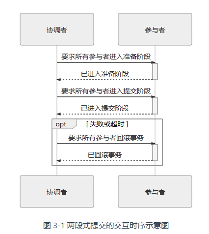
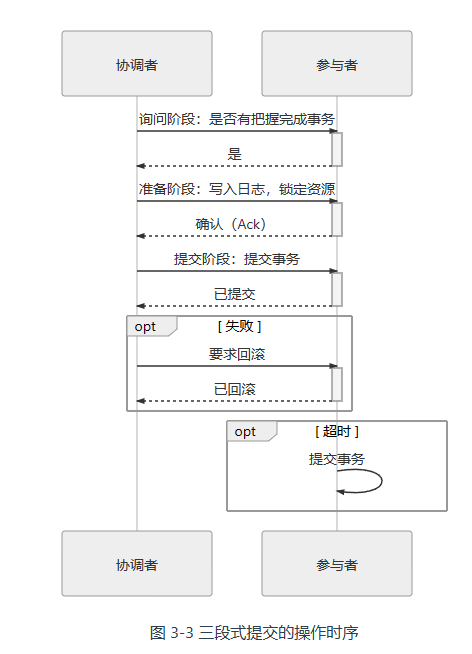

# 概述 

[TOC]

柔性事务满足 BASE 理论，刚性事务满足 ACID 理论。接下来介绍的事务都是柔性的。

## 本地事务

**本地事务（Local Transaction）**是指仅操作单一事务资源的、不需要全局事务管理器进行协调的事务。它只适用于**单个服务使用单个数据源**的场景。

从应用角度看，它是直接依赖于数据源本身提供的事务能力来工作的（事务的开启、终止、提交、回滚、嵌套、设置隔离级别、事务传播方式），在程序代码层面，最多只能对事务接口做一层标准化的包装（如 `JDBC` 接口），并不能深入参与到事务的运作过程当中。

## 全局事务

### 2 PC

在工程实现中，**全局事务是指单个服务使用多个数据源的事务处理机制**。理论上的全局事务并没有「单个服务」的约束，它本来就是 DTP（[Distributed Transaction Processing](https://en.wikipedia.org/wiki/Distributed_transaction)）分布式事务处理模型中的概念。

1991 年，为了解决分布式事务的一致性问题，[X/Open](https://en.wikipedia.org/wiki/X/Open)组织提出了一套名为[X/Open XA](https://en.wikipedia.org/wiki/X/Open_XA)（XA 是 eXtended Architecture 的缩写）的处理事务架构，其核心内容是定义了**全局的事务管理器**（Transaction Manager，用于协调事务，可以理解为主节点）和**局部的资源管理器**（Resource Manager，用于驱动本地事务，可以理解为从节点）之间的通信接口。XA 接口是双向的。

XA 是一套语言无关的通用规范， Java 中专门定义了 [JSR 907 Java Transaction API](https://www.jcp.org/en/jsr/detail?id=907) 来实现 XA 规范。JTA  最主要的两个接口是：

- 事务管理器的接口：
  - `javax.transaction.TransactionManager`接口：是给 Java EE 服务器提供容器事务（由容器自动负责事务管理）使用的
  - `javax.transaction.UserTransaction`接口：用于通过程序代码手动开启、提交和回滚事务
- 满足 XA 规范的资源接口`javax.transaction.xa.XAResource`：任何资源（JDBC、JMS 等等）如果想要支持 JTA，只要实现 XAResource 接口中的方法即可。


假如你平时以声明式事务来编码，不过就是标个`@Transactional`注解而已，但如果以编程式事务来实现的话，伪代码如下所示：

```java
public void buyBook(PaymentBill bill) {
    userTransaction.begin();
    warehouseTransaction.begin();
    businessTransaction.begin();
	try {
        userAccountService.pay(bill.getMoney());
        warehouseService.deliver(bill.getItems());
        businessAccountService.receipt(bill.getMoney());
        userTransaction.commit();
        warehouseTransaction.commit();
        businessTransaction.commit();
	} catch(Exception e) {
        userTransaction.rollback();
        warehouseTransaction.rollback();
        businessTransaction.rollback();
	}
}
```

从代码上可看出，程序的目的是要做三次事务提交，但实际上代码并不能这样写，试想一下，如果在`businessTransaction.commit()`中出现错误，代码转到`catch`块中执行，此时`userTransaction`和`warehouseTransaction`已经完成提交，再去调用`rollback()`方法已经无济于事，这将导致一部分数据被提交，另一部分被回滚，整个事务的一致性也就无法保证了。


为了解决这个问题（一个事务跨多节点），XA 将事务提交拆分成为两阶段过程：

- **准备阶段**（投票阶段）：在这一阶段，协调者询问事务的所有参与者是否准备好提交。参与者收到询问后，就开始执行事务逻辑。如果参与者执行完成，则回复 Prepared，否则回复 Non-Prepared。此时并不执行 Commit 或者 Rollback 操作。

- **提交阶段**（执行阶段）：
  - 如果所有参与者回复 Prepared，那么协调者向参与者发起 Commit 指令，所有参与者立即执行事务提交操作。
  - 任意一个参与者回复了 Non-Prepared 消息，或任意一个参与者超时未回复，那么协调协调者向参与者发起 Abort 指令，所有参与者立即执行 Rollback 操作。



以上这两个过程被称为 “[两段式提交](https://zh.wikipedia.org/wiki/二阶段提交)”（2 Phase Commit，2PC）协议，而它能够成功保证一致性还需要一些其他前提条件：

- 在提交阶段网络是可靠的
- 节点的失联必须是短暂的

它有以下缺点：

- **单点问题**：协调者在两段提交中具有举足轻重的作用，协调者等待参与者回复时可以有超时机制，但参与者等待协调者指令时无法做超时处理。一旦协调者宕机，那所有参与者都会受到影响

- **性能问题**：准备阶段的时间取决于响应最慢的从节点

- **一致性风险**：协调者会先持久化事务状态，并提交自己的事务。如果这时候网络忽然被断开，无法再通过网络向所有参与者发出 Commit 指令，这就会导致协调者的已提交，但参与者的既未提交，也没有办法回滚，从而产生了数据不一致的问题。

  还有一种情况就是在提交阶段，只有部分 Commit 请求发送成功。这样一部分节点已提交，而另一部分尚未提交。


### 3PC

为了缓解 2PC 协议的一部分缺陷，后续又发展出了“[三段式提交](https://zh.wikipedia.org/wiki/三阶段提交)”（3 Phase Commit，3PC）协议。三段式提交把 2PC 的准备阶段，再细分为两个阶段，分别称为 CanCommit、PreCommit，并把提交阶段改称为 DoCommit 阶段。其中，新增的 CanCommit 是一个询问阶段，协调者让每个参与者根据自身状态，评估该事务是否有可能顺利完成。

将准备阶段一分为二的理由是，这个阶段是重负载的操作。在 2PC 中，一旦协调者发出开始准备的消息，每个参与者都将马上开始写 Redo Log，它们所涉及的数据资源即被锁住，如果此时某一个参与者宣告无法完成提交，相当于大家都白做了一轮无用功。而 3PC 中的 CanCommit 减少是由于事务失败而回滚的概率。

此外，如果在 PreCommit 阶段后，协调者发生了宕机，即参与者没有能等到 DoCommit 的消息的话，默认的操作策略将是提交事务，而不是 2PC 中的持续等待。



## 共享事务

共享事务是指多个服务共用同一个数据源。

一种实现共享事务的可行方案是，直接让各个服务共享数据库连接。由于连接是与 IP 地址和端口号绑定的，所以必须新增一个中间角色来作为各个服务的代理，与数据库打交道，从而「共享连接」


实际上共享事务可能是一个伪需求，这是因为一个服务集群中，数据库才是压力最大、最不容易伸缩拓展的重灾区。在实际应用中并不常见，也几乎没有相应的成功案例

还有一种方案：使用消息队列作为中间代理。

## 分布式事务

**「分布式事务」（Distributed Transaction**）特指业务上关联的多个服务同时访问多个数据源的事务处理机制。

### 可靠事件队列


1. 首先对各个事务出错概率做个先验评估，根据出错概率的大小来安排它们的操作顺序
2. 本地服务向远程服务发送消息，远程服务消费消息并执行相应操作。
3. 本地服务在自己的数据库中建立一张消息表，维护远程服务的执行状态
4. 远程服务执行完成后，向本地服务发送成功消息。本地服务在消息表中将远程服务的状态更新为「已完成」。
5. 定时轮询消息表，将状态是「进行中」的消息，重新发送给对应的远程服务。这个步骤决定了远程服务必须具备幂等性，通常我们的设计是让消息带上一个事务 ID。如果一个远程服务宕机，那么仍然是持续自动重发消息，直至操作成功，或者被人工介入为止。

这种靠着持续重试来保证可靠性的操作，是“[最大努力交付](https://en.wikipedia.org/wiki/Best-effort_delivery)”（Best-Effort Delivery）的体现

### TCC 事务

TCC 是一种业务侵入式较强的事务方案，要求业务处理过程必须拆分为「预留业务资源」和「确认/释放消费资源」两个子过程，并分为以下三个阶段：

- **Try**：尝试执行阶段，完成所有业务可执行性的检查（保障一致性），并且**预留好**全部需用到的业务资源（保障隔离性）。如果第三方接口并不支持「预留资源」特性，那么 TCC 方案就无法实施。 
- **Confirm**：确认执行阶段，不进行任何业务检查，直接使用 Try 阶段准备的资源来完成业务处理。Confirm 阶段可能会重复执行，因此本阶段所执行的操作需要具备幂等性。
- **Cancel**：取消执行阶段，释放 Try 阶段预留的业务资源。Cancel 阶段可能会重复执行，也需要满足幂等性。


TCC 其实有点类似 2PC 的准备阶段和提交阶段，**但 TCC 是位于用户代码层面**，而不是在基础设施层面，它甚至不需要依赖于底层数据资源的事务支持，这为它的实现带来了较高的灵活性，可以根据需要设计资源锁定的粒度。

### SAGA 事务

SAGA 的思路是把一个大事务分解为可以交错运行的一系列子事务集合，避免避免大事务长时间锁定数据库的资源。SAGA 由两部分操作组成：

- 大事务拆分若干个小事务，将整个分布式事务 T 分解为 n 个子事务，命名为 T1，T2，…，Ti，…，Tn。每个子事务都应该是原子的
- 为每一个子事务设计对应的补偿动作，命名为 C1，C2，…，Ci，…，Cn。 Ti与 Ci必须满足以下条件：
  - Ti 与 Ci 都具备幂等性。
  - Ti 与 Ci 满足交换律（Commutative），即先执行 Ti 还是先执行 Ci，其效果都是一样的。
  - Ci 必须能成功提交，即不考虑 Ci 本身提交失败被回滚的情形，如出现就必须持续重试直至成功，或者要人工介入。

如果 T1 到 Tn 均成功提交，那事务顺利完成，否则，要采取以下两种恢复策略之一：

- **正向恢复**（Forward Recovery）：如果 Ti事务提交失败，则一直对 Ti进行重试，直至成功为止（最大努力交付）。这种恢复方式不需要补偿。正向恢复的执行模式为：T1，T2，…，Ti（失败），Ti（重试）…，Ti+1，…，Tn。
- **反向恢复**（Backward Recovery）：如果 Ti 事务提交失败，则一直执行 Ci 对 Ti 进行补偿，直至成功为止（最大努力交付）。反向恢复的执行模式为：T1，T2，…，Ti（失败），Ci（补偿），…，C2，C1。

与 TCC 相比，SAGA 不需要为资源设计冻结状态和撤销冻结的操作。而且，补偿操作往往要比资源冻结操作容易实现得多。

