# Ioc 进阶

[TOC]


## BeanFactory 的继承体系

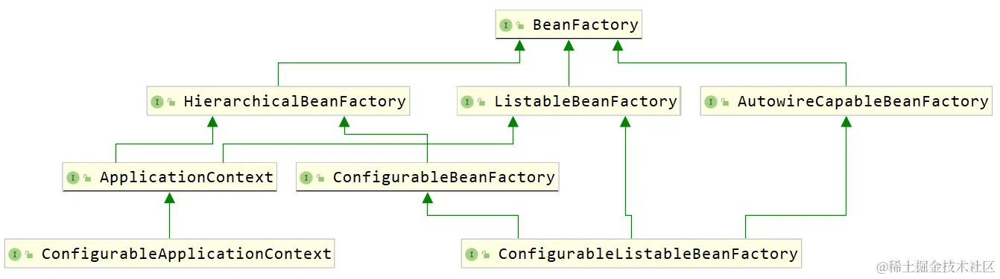

- `BeanFacory` 

  - 根容器
  - 定义了作用域概念
  - Bean 的注册中心：所有的 Bean 最终都在 BeanFactory 中创建和保存
  - 支持多种类型的配置源：可以使用 XML 或者注解来注册 Bean
  - 集成了环境配置：Environment 对象以及外部资源文件注入到 Bean 对象中
  - 设有完整的生命周期控制机制
  
- `HierarchicalBeanFactory` ：支持父子结构

  ~~~java
public interface HierarchicalBeanFactory extends BeanFactory {
      @Nullable
      BeanFactory getParentBeanFactory();
  
      boolean containsLocalBean(String var1);
  }
  ~~~
  
  `getBean`方法会从当前 `BeanFactory` 开始查找是否存在指定的 Bean ，如果当前找不到就依次向上找父 `BeanFactory` ，直到找到为止返回，或者都找不到最终抛出 `NoSuchBeanDefinitionException`

  `containsLocalBean(String name)` ，它是检查当前容器中是否有指定名称的 Bean ，并不会考察父容器 。

- `ListableBeanFactory`：枚举出当前容器（不包括父容器）中的所有 Bean

  可以借助 `BeanFactoryUtils` 工具类来获取所有 Bean（工具类中有不少以 `"IncludingAncestors"` 结尾的方法，代表可以一起取父容器）。

  `ListableBeanFactory`会忽略通过其他方式（例如 `ConfigurableBeanFactory` 的 `registerSingleton` 方法）注册的任何单实例 bean，但`getBeanNamesForType` 和 `getBeansOfType` 并不会忽略。下面给出一个例子来说明

  ~~~java
  // 手动注册一个单实例Bean
  beanFactory.registerSingleton("doggg", new Dog());
  getBeanDefinitionNames()  // 该方法不会包括手动注册的 Bean
  beanFactory.getBeanNamesForType(Dog.class)) // 该方法可以获取手动注册的 Bean
  ~~~

- `AutowireCapableBeanFactory`：一般与其他框架进行集成时才使用，当其它框架的一些 Bean 实例不受 SpringFramework 容器的控制，但又需要向其注入一些由 SpringFramework 容器管理的对象，那就可以用它了。

  此外，其他框架还可以依赖查询 IOC 容器【推】，从 IOC 容器中获取到对应的Bean对象（不推荐）。

- `ConfigurableBeanFactory`：具有 set 相关的操作，而其他的 `BeanFactory` 只有 get 相关的操作。

  ```java
  void setBeanClassLoader(@Nullable ClassLoader beanClassLoader);
  void setTypeConverter(TypeConverter typeConverter);
  void addBeanPostProcessor(BeanPostProcessor beanPostProcessor);
  void setParentBeanFactory(BeanFactory var1) throws IllegalStateException; //设置父容器
  //...
  ```
  
  

BeanFactory 的实现类

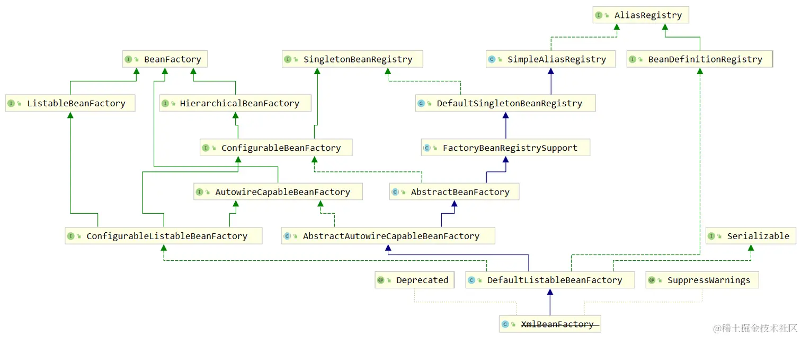

- `AbstractBeanFactory`：是`BeanFactory` 接口最基础的抽象实现类。它还提供了 `getBeanDefinition` 和 `createBean` 两个模板方法，供子类来实现

- `AbstractAutowireCapableBeanFactory`

   - ` createBean`以及`doCreateBean`实现了对 `Bean` 的创建、赋值、依赖注入、初始化的逻辑。但是它并不负责 `BeanDefinition` 的注册。

     >在 SpringFramework 的框架编码中，不带 do 开头的方法一般负责前置校验处理、返回结果封装，带 do 开头的方法是真正执行逻辑的方法（如 `getBean` 方法的底层会调用 `doGetBean` 来真正的寻找 IOC 容器的 bean ，`createBean` 会调用 `doCreateBean` 来真正的创建一个 bean ）。
     
   - 提供了 `resolveDependency(DependencyDescriptor, String, Set, TypeConverter)`模板方法，它用于解析依赖关系。

- `DefaultListableBeanFactory`：实现了 `BeanDefinitionRegistry` 接口，来负责 `BeanDefinition` 的注册，但并不负责解析 `Bean` 资源文件。

- `XmlBeanFactory` 正式被标注为**过时**，代替的方案是使用 `DefaultListableBeanFactory + XmlBeanDefinitionReader` ，这种设计更**符合组件的单一职责原则**。**配置源分离**。`XmlBeanDefinitionReader` 用来**加载并解析** XML 配置文件，将`<bean>` 元素转化为一个 `BeanDefinition` 对象，然后注册进 `DefaultListableBeanFactory`。注意 `XmlBeanDefinitionReader` 组合了 `ResourceLoader` 对象，用于加载文件。

  ~~~java
  DefaultListableBeanFactory beanFactory = new DefaultListableBeanFactory();
  
  // Reader 与 DefaultListableBeanFactory 形成绑定关系
  XmlBeanDefinitionReader reader = new 
  XmlBeanDefinitionReader(beanFactory);
  
  // 在 loadBeanfinition 中使用 ResourceLoader 加载资源文件。完成加载、解析后，向 DefaultListableBeanFactory 注册解析生成的 BeanDefinition
  reader.loadBeanDefinitions("applicationContext.xml");
  ~~~
  
  
  
  

`ApplicationContext` 比 `BeanFactory` 强大的地方是支持更多的机制，这里面就包括了**后置处理器、监听器**、MessageSource等，而这些都是一个一个的 Bean ，`BeanFactory` 不会把它们区别对待，但是 `ApplicationContext` 就可以区分出来，并且赋予他们发挥特殊能力的机会。

| Feature                      | `BeanFactory` | `ApplicationContext` |
| ---------------------------- | ------------- | -------------------- |
| Bean的实例化和属性注入       | Yes           | Yes                  |
| 生命周期管理                 | No            | Yes                  |
| Bean 后置处理器的支持        | No            | Yes                  |
| BeanFactory 后置处理器的支持 | No            | Yes                  |
| 消息转换服务（国际化）       | No            | Yes                  |
| 事件发布机制（事件驱动）     | No            | Yes                  |


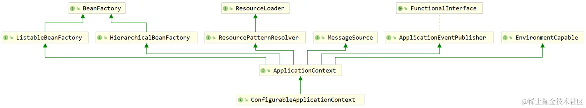

- `ApplicationContext` 

  - 以通用方式加载文件资源的能力。继承自 `ResourceLoader` 接口。

  - 能够将事件发布给注册的监听器。继承自 `ApplicationEventPublisher` 接口。

  - 解析消息的能力，支持国际化。继承自 `MessageSource` 接口。

  - 支持从父上下文继承。在子容器中的定义是始终优先的。
  - 负责回调注入，例如 `ResourceLoaderAware`、`ApplicationEventPublisherAware`、`ApplicationContextAware` 等 `Aware` 接口。
  - 注意，它并没有直接继承`AbstractBeanFactory`，但它的实现子类通过组合的方式，在内部包含一个 `BeanFactory`，来解析Bean。

- `EnvironmentCapable`的定义如下：

  - 获取Environment

    ~~~java
    public interface EnvironmentCapable {
    	Environment getEnvironment();
    }
    ~~~

    在 SpringFramework 中，以 Capable 结尾的接口，通常意味着可以通过这个接口的某个方法（通常是 `getXXX()` ）拿到特定的组件。

- `ConfigurableApplicationContext`

  - 扩展了 `setParent` 、`setEnvironment` 、`addBeanFactoryPostProcessor` 、`addApplicationListener` 等方法

  - 还扩展了一些方法，刷新（refresh）和关闭（close）方法。

- `MessageSource`

  - 支持国际化

    `ResourcePatternResolver`是 `ResourceLoader` 的扩展，`ResourceLoader` 实现最基本的解析，`ResourcePatternResolver` 可以支持 **Ant** 形式的带星号 ( * ) 的路径解析

    - `/WEB-INF/*.xml` ：匹配 `/WEB-INF` 目录下的任意 xml 文件
    - `/WEB-INF/**/beans-*.xml` ：匹配 `/WEB-INF` 下面任意层级目录的 `beans-` 开头的 xml 文件
    - `/**/*.xml` ：匹配任意 xml 文件

    `ResourcePatternResolver` 还可以匹配类路径下的资源文件，即在资源路径中加一个 `classpath*:` 的前缀

    

ApplicationContext 的实现类：

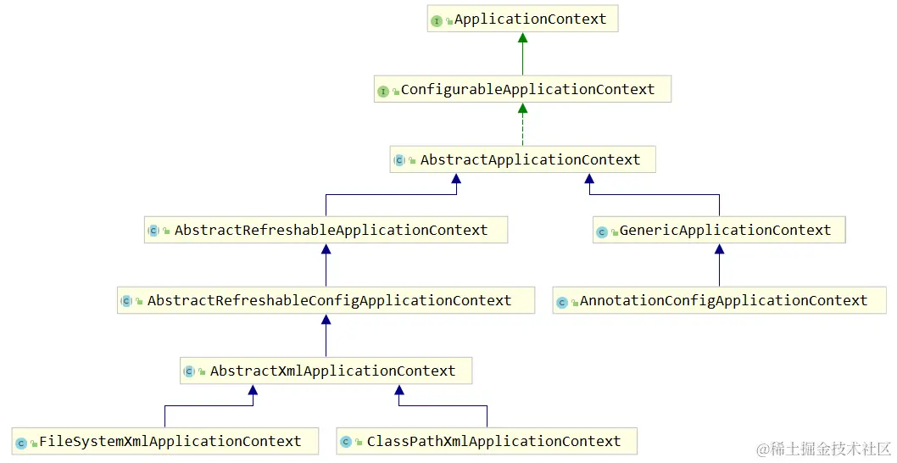

- `AbstractApplicationContext` ：

  - 实现了控制 `ApplicationContext` 生命周期的核心方法：**`refresh`**

  - 继承了 `DefaultResourceLoader`。为 `XXXReader` 提供一个加载源。

- `GenericApplicationContext`

  - 它组合了一个 `DefaultListableBeanFactory`

    ~~~java
    public GenericApplicationContext() {
        // 内置的beanFactory在GenericApplicationContext创建时就已经初始化好了
        this.beanFactory = new DefaultListableBeanFactory();
    }
    ~~~

  - 它还实现了 `BeanDefinitionRegistry` 接口。然而它在实现的注册方法 `registerBeanDefinition` 中，还是调用的 `DefaultListableBeanFactory` 执行 `registerBeanDefinition` 方法，说明它也没有对此做什么扩展。

  - 只能刷新一次

    ~~~java
    public AnnotationConfigApplicationContext() {
        this.reader = new AnnotatedBeanDefinitionReader(this);
        this.scanner = new ClassPathBeanDefinitionScanner(this);
    }
    
    public AnnotationConfigApplicationContext(Class<?>... componentClasses) {
        this();
        register(componentClasses);
        refresh();
    }
    ~~~

    ~~~java
    protected final void refreshBeanFactory() throws IllegalStateException {
        if (!this.refreshed.compareAndSet(false, true)) {
            // 利用CAS，保证只能设置一次 true，如果出现第二次，就抛出重复刷新异常
            throw new IllegalStateException(
                    "GenericApplicationContext does not support multiple refresh attempts: just call 'refresh' once");
        }
        this.beanFactory.setSerializationId(getId());
    }
    ~~~

- `AbstractRefreshableApplicationContext`

  - 支持多次刷新，每次刷新都创建一个新的内部 `BeanFactory` 实例
  - 提供了一个模板方法 `loadBeanDefinitions` ，它在每次刷新时都会被调用，用于注册 `BeanDefinitons`。子类在实现时，通常创建 `BeanDefinitionReader` 对象，用来加载并解析资源，并将解析出的 `BeanDefinitons` 注册到  `DefaultListableBeanFactory` 中。

- `AbstractXmlConfigApplicationContext` 提供了一个 `configLocations` 属性，用于存储 XML 配置文件的位置。可以通过`getConfigLocations()` 方法获取这个属性。

- `AbstractXmlApplicationContext`：组合了一个 `XmlBeanDefinitionReader` 组件来加载并解析 xml 配置文件。

- `ClassPathXmlApplicationContext`


## @componentScan

~~~java
@Repeatable(ComponentScans.class)
public @interface ComponentScan {
	Class<?>[] basePackageClasses() default {};
    // ...
}
~~~

`basePackageClasses`元素值会以指定类所在的包进行扫描

~~~java
@Configuration
@ComponentScan(basePackageClasses = {DemoService.class, DemoComponent.class})
public class BasePackageClassConfiguration {
    
}
~~~

上面这个示例会把 DemoService、DemoComponent 所在的包扫描进去。


`@componentScan`还可以支持包扫描的过滤

~~~java
@Configuration
@ComponentScan(basePackages = "com.linkedbear.spring.annotation.f_typefilter",
               includeFilters = @ComponentScan.Filter(type = FilterType.ANNOTATION, value = Animal.class))
public class TypeFilterConfiguration {
    // 扫描含有 @Animal 注解的类
}

~~~

注意，多个`includeFilters`之间互不干扰，相当于取它们的并集。`@ComponentScan` 注解中还有一个属性：`useDefaultFilters` ，它代表的「是否启用默认的过滤规则」，即扫描`@Component` 、`@Repository` 、`@Service` 或 `@Controller`

~~~java
// 排除含有 @Animal 注解的类
@ComponentScan(excludeFilters = @ComponentScan.Filter(type = FilterType.ANNOTATION, value = Animal.class))

// 将Color类型包含进来
@ComponentScan.Filter(type = FilterType.ASSIGNABLE_TYPE, value = Color.class)

// 正则表达式
@ComponentScan.Filter(type = FilterType.REGEX, pattern = "com.linkedbear.spring.annotation.f_typefilter.+Demo.+")
~~~


自定义过滤策略，要实现`TypeFilter`接口

~~~java
@FunctionalInterface
public interface TypeFilter {
	boolean match(MetadataReader metadataReader, MetadataReaderFactory metadataReaderFactory) throws IOException;
}
~~~

- **metadataReader** ：the metadata reader for the target class
- **metadataReaderFactory** ：a factory for obtaining metadata readers for other classes (such as superclasses and interfaces)

使用示例：

~~~java
public boolean match(MetadataReader metadataReader, MetadataReaderFactory metadataReaderFactory)
         throws IOException {
    ClassMetadata classMetadata = metadataReader.getClassMetadata();
    // 返回 true ，则说明已经匹配上了。
    return classMetadata.getClassName().equals(Green.class.getName());
}
~~~

注册该过滤器：

~~~java
@ComponentScan.Filter(type = FilterType.CUSTOM, value = GreenTypeFilter.class)
~~~


如果在使用`@Component`时，不指定 Bean 名称，那么默认使用首字母小写的类名。这是由 @ComponentScan 中的属性 nameGenerator 来决定的，它的默认值是`BeanNameGenerator`接口，它的实现类是`AnnotationBeanNameGenerator`

## 资源管理

SpringFramework 并没有使用 JDK 提供的资源管理，而是自己创建了新的资源模型。

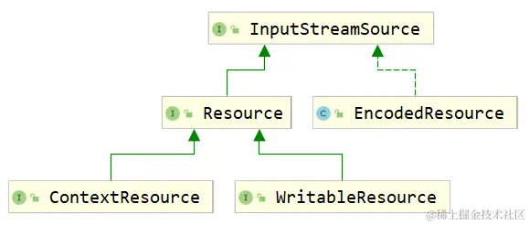

- `InputStreamSource`：获取资源的输入流

  ~~~java
  public interface InputStreamSource {
  	InputStream getInputStream() throws IOException;
  }
  ~~~

- Resource 抽象了资源的类型

- EncodedResource 表示编码后的资源，它在内部组合了一个 Resource

- WritableResource 表示可写的资源

- ContextResource 表示从一个「上下文」中加载的资源，例如来自 `javax.servlet.ServletContext`

JDK 能加载的资源：

- ClassLoader：加载类路径下的资源
- File：加载文件系统中的资源
- URL：加载网络上的资源

SpringFramework 提供了对应的实现：

- ClassLoader → `ClassPathResource` [ classpath:/ ]
- File → `FileSystemResource` [ file:/ ]
- URL → `UrlResource` [ xxx:/ ]


我们知道，`AbstractApplicationContext` 继承了 `DefaultResourceLoader`，具有加载各种资源的能力。而`DefaultResourceLoader`组合了一堆`ProtocolResolver`，根据不同的资源路径，调用不同的`ProtocolResolver`，来解析资源地址并获取资源。

如果资源路径没有明确的前缀，`DefaultResourceLoader`默认会认为这是一个类路径资源，尝试使用`ClassPathResource`来加载。下面是相关源代码：

~~~java
public Resource getResource(String location) {
    // ......
    if (location.startsWith("/")) {
        return getResourceByPath(location);
    } else if (location.startsWith(CLASSPATH_URL_PREFIX)) {
        return new ClassPathResource(location.substring(CLASSPATH_URL_PREFIX.length()), getClassLoader());
    }
    // ......
}

protected Resource getResourceByPath(String path) {
    return new ClassPathContextResource(path, getClassLoader());
}
~~~

子类覆写`getResourceByPath`方法，可以改变默认的加载器（类加载器）。例如`GenericWebApplicationContext`从`ServletContext` 中加载。


我们可以自定义 `ProtocolResolver`，下面给出一个示例：

~~~java
public class DogProtocolResolver implements ProtocolResolver {

    public static final String DOG_PATH_PREFIX = "dog:";

    @Override
    public Resource resolve(String location, ResourceLoader resourceLoader) {
        if (!location.startsWith(DOG_PATH_PREFIX)) {
            return null;
        }
        
        // 把自定义前缀去掉，替换为 classpath
        String realpath = location.substring(DOG_PATH_PREFIX.length());
        String classpathLocation = "classpath:resource/" + realpath;
        
        // 一般最后都是调用 resourceLoader#getResource()
        return resourceLoader.getResource(classpathLocation);
    }
}

public class ProtocolResolverApplication {
    public static void main(String[] args) throws Exception {
        DefaultResourceLoader resourceLoader = new DefaultResourceLoader();
        DogProtocolResolver dogProtocolResolver = new DogProtocolResolver();
        // 将 dogProtocolResolver 绑定到 ResourceLoader中
        resourceLoader.addProtocolResolver(dogProtocolResolver);
        Resource resource = resourceLoader.getResource("dog:Dog.txt");
    }
}
~~~

## 配置源 & 配置元信息

容器的元信息分为 beans 和 context 两部分

beans 的配置元信息：

| 配置元信息                  | 含义 / 作用                                                  | 默认值           |
| --------------------------- | ------------------------------------------------------------ | ---------------- |
| profile                     | 基于环境的配置                                               | ""               |
| default-autowire            | 默认的自动注入模式（不需要声明 `@Autowired` 等注解即可注入组件） | default（no）    |
| default-autowire-candidates | 满足指定属性名规则的属性才会被自动注入                       | ""               |
| default-init-method         | 全局 bean 的初始化方法                                       | ""               |
| default-destroy-method      | 全局 bean 的销毁方法                                         | ""               |
| default-lazy-init           | 全局 bean 是否延迟加载                                       | default（false） |
| default-merge               | 继承父 bean 时直接合并父 bean 的属性值                       | default（false） |

 context 的元信息：

| 配置元信息                        | 含义 / 作用                                               |
| --------------------------------- | --------------------------------------------------------- |
| `<context:annotation-config/>`    | 开启注解驱动                                              |
| `<context:component-scan/>`       | 开启组件扫描                                              |
| `<context:property-placeholder/>` | 引入外部的资源文件（ properties xml yml 等）              |
| `<context:property-override/>`    | 指定配置源会覆盖全局配置（可用于配置覆盖）                |
| `<context:spring-configured/>`    | 可以对没有注册到 IOC 容器的 bean 实现依赖注入             |
| `<context:load-time-weaver/>`     | 与 AOP 相关（放到 AOP 章节介绍）                          |
| `<context:mbean-server/>`         | 暴露应用运行状态监控（与 JMX 管理监控有关）               |
| `<context:mbean-export/>`         | 注册 MBean 到 JMX 实现运行状态监控（与 JMX 管理监控有关） |

## Bean 与 BeanDefinition

`BeanDefinition` 是一种**配置元信息**，它描述了 **Bean 的定义信息**

- Bean 的类信息 - 全限定类名 ( beanClassName )
- Bean 的属性 - 作用域 ( scope ) 、是否默认 Bean ( primary ) 、描述信息 ( description ) 等
- Bean 的行为特征 - 是否延迟加载 ( lazy ) 、是否自动注入 ( autowireCandidate ) 、初始化 / 销毁方法 ( initMethod / destroyMethod ) 等
- Bean 与其他 Bean 的关系 - 父 Bean 名 ( parentName ) 、依赖的 Bean ( dependsOn ) 等
- Bean 的配置属性 - 构造器参数 ( constructorArgumentValues ) 、属性变量值 ( propertyValues ) 等

`BeanDefinition` 具有父子层级，并且可以在 IOC 容器初始化阶段被 `BeanDefinitionRegistryPostProcessor` 构造和注册，被 `BeanFactoryPostProcessor` 拦截修改等。

BeanDefinition 的结构：

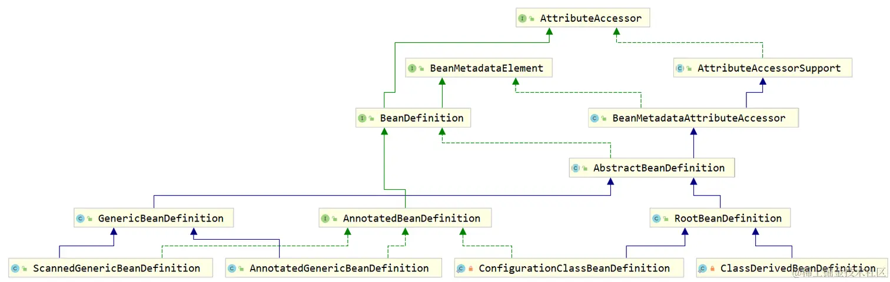

- `AttributeAccessor`

  ~~~java
  public interface AttributeAccessor {
      // 设置 bean 中属性的值
      void setAttribute(String name, @Nullable Object value);
  
      // 获取 bean 中指定属性的值
      Object getAttribute(String name);
  
      // 移除 bean 中的属性
      Object removeAttribute(String name);
  
      // 判断 bean 中是否存在指定的属性
      boolean hasAttribute(String name);
  
      // 获取 bean 的所有属性
      String[] attributeNames();
  }
  ~~~

- `AbstractBeanDefinition`：定义一些元信息属性。

  ~~~java
  private volatile Object beanClass;		// bean的全限定类名
  private String scope = SCOPE_DEFAULT;	// 默认的作用域为单实例
  private boolean abstractFlag = false;	// 默认bean都不是抽象的
  private Boolean lazyInit;				// 是否延迟初始化
  // ...
  ~~~

- `GenericBeanDefinition`：仅仅比 `AbstractBeanDefinition` 多了一个 `parentName` 属性而已。支持父子层次结构。


  

  ## BeanDefinitionRegistry

`BeanDefinitionRegistry`的设计目的就是保存所有的`BeanDefinition`。Spring 框架将注册表抽象成一个接口——`BeanDefinitionRegistry`，它有三个关键方法：

~~~java
void registerBeanDefinition(String beanName, BeanDefinition beanDefinition)
            throws BeanDefinitionStoreException;

void removeBeanDefinition(String beanName) throws NoSuchBeanDefinitionException;

BeanDefinition getBeanDefinition(String beanName) throws NoSuchBeanDefinitionException;
~~~

其实在 SpringFramework 中的底层，对于 `BeanDefinition` 的注册表的设计，就是一个 `Map` ：

~~~java
// 源自DefaultListableBeanFactory，它也实现了BeanDefinitionRegistry接口，也是主要的实现类
private final Map<String, BeanDefinition> beanDefinitionMap = new ConcurrentHashMap<>(256);
~~~


我们可以实现 `BeanFactoryPostProcessor` 接口，并重写 `postProcessBeanFactory` 方法，来定制 `BeanFactory`

~~~java
@Component
public class RemoveBeanDefinitionPostProcessor implements BeanFactoryPostProcessor {
    @Override
    public void postProcessBeanFactory(ConfigurableListableBeanFactory beanFactory) throws BeansException {
         // 移除 IOC 容器中所有性别为 male 的 Person 。
        
        BeanDefinitionRegistry registry = (BeanDefinitionRegistry) beanFactory;
        // 获取IOC容器中的所有 BeanDefinition
        for (String beanDefinitionName : beanFactory.getBeanDefinitionNames()) {
            BeanDefinition beanDefinition = beanFactory.getBeanDefinition(beanDefinitionName);
            // 判断 BeanDefinition 对应的Bean是否为Person类型
            if (Person.class.getName().equals(beanDefinition.getBeanClassName())) {
                // 判断 Person 的性别是否为male
                TypedStringValue sex = (TypedStringValue) beanDefinition.getPropertyValues().get("sex");
                if ("male".equals(sex.getValue())) {
                    // 移除 BeanDefinition
                    registry.removeBeanDefinition(beanDefinitionName);
                }
            }
        }
    }
}
~~~


BeanDefinition 的合并，下面通过一个例子来讲解：

~~~java
public class Person { }

public abstract class Animal {
    private Person person;
}

public class Cat extends Animal {
    private String name;
}
~~~

~~~xml
<bean id="person" class="com.linkedbear.spring.definition.d_merge.bean.Person"/>
<bean class="com.linkedbear.spring.definition.d_merge.bean.Cat" parent="abstract-animal">
    <property name="person" ref="person"/>
    <property name="name" value="咪咪"/>
</bean>
~~~

如果要创建多个 Cat Bean，那么必须在每个 Bean 中注入 People 的 Property。此时，可以使用 `BeanDefinition` 合并的特性来避免繁琐的代码编写

~~~xml
<!--在 Spring 配置文件中将 bean 标记为抽象，那么这个 bean 不能被实例化。-->
<bean id="abstract-animal" class="com.linkedbear.spring.definition.d_merge.bean.Animal" abstract="true">
    <property name="person" ref="person"/>
</bean>

<bean id="cat" class="com.linkedbear.spring.definition.d_merge.bean.Cat" parent="abstract-animal">
    <property name="name" value="咪咪"/>
</bean>
~~~

测试代码：

~~~java
BeanDefinition catDefinition = ctx.getBeanFactory().getBeanDefinition("cat");
~~~

这样获取的 Cat BeanDefinition 是没有和 Animal BeanDefinition 合并在一起的（propertyValues 为 1，只有 name 属性）

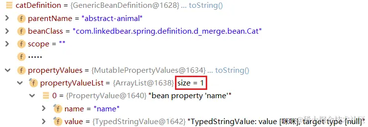

我们可以通过`getMergedBeanDefinition()`方法来解决这个问题：

~~~java
BeanDefinition catDefinition = ctx.getBeanFactory().getMergedBeanDefinition("cat");
~~~

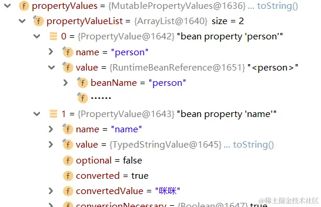


这里顺便讲解一下 `@Component` 抽象类（https://segmentfault.com/q/1010000039720497）。接口和抽象类都是可以加`@Component`注解的，但是必须其中至少还有一个方法带有`@Lookup`注解。`@Lookup`注解是一个在单例`bean`中使用一个多例`bean`的解决方案。考虑下面这个场景：

~~~java
@Component
public class A {
    @Autowired
    B b;
    
    public void print() {
        System.out.println(b);
    }
}

@Component
@Scope(ConfigurableBeanFactory.SCOPE_PROTOTYPE)
public class B {
    
}
~~~

这里自动注入的对象 B 是不变的。如果想要在每次调用 print 时，打印一个新的 b 对象，那么可以考虑实现`ApplicationContextAware`接口，执行 `ApplicationContext#getBean(String beanName)` 来获取 Bean，但这样代码过于笨重。此时我们就可以引入 @Lookup 来优雅地解决这个问题：

~~~java
@Component
public class A {
    public void print() {
        System.out.println(this.getB());
    }
    
    @Lookup
    public B getB () {
        // 容器会自动帮你覆盖实现，改为调用 BeanFactory 的 getBean 方法
        return null;
    }
}
~~~

但这有点侵入代码的味道，我们可以这样写：

~~~java
@Component
public interface BCreator {
    @Lookup
    B getB();
}

@Component
public class A {
    @Autowired
    BCreator bCreator;
    
    public void print() {
        System.out.println(bCreator.getB());
    }
}
~~~

这就是可以有 `@Component` 抽象类的原因。

## 后置处理器

`BeanPostProcessor` 是一个容器的扩展点，它可以在 bean 的初始化阶段前后，添加自定义处理 Bean 的逻辑，并且不同 IOC 容器间的 `BeanPostProcessor` 不会相互干预。

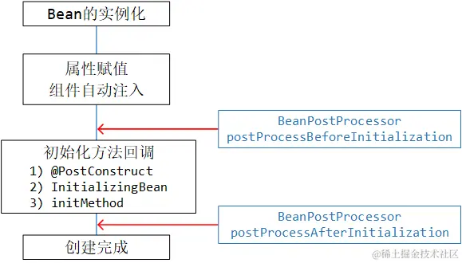


`BeanPostProcessor` 提供了两个回调时机：「**bean 的初始化之前**」和「 **bean 的初始化之后**」，它们分别适合做**填充**和**代理**的工作。

~~~java
public interface BeanPostProcessor {
    
    default Object postProcessBeforeInitialization(Object bean, String beanName) throws BeansException {
        return bean;
    }

    default Object postProcessAfterInitialization(Object bean, String beanName) throws BeansException {
        return bean;
    }
}
~~~

- `postProcessBeforeInitialization` 方法会在任何 bean 的初始化回调（例如 `InitializingBean` 的 `afterPropertiesSet` 或自定义 `init-method` ）之前执行。如果处理完的结果返回 null ，则不再执行后面剩余的 `BeanPostProcessor`（拦截处理） ，直接返回上一个 `BeanPostProcessor` 处理之后的 bean 对象。

- `postProcessAfterInitialization` 方法会在任何 bean 的初始化回调之后。

- 不论是基于构造方法的依赖注入，还是基于 Setter 方法的依赖注入，都是在 `postProcessBeforeInitialization` 方法之前进行的

可以配置多个 `BeanPostProcessor` 实例，并且可以通过设置 `order` 属性来控制这些 `BeanPostProcessor` 实例的运行顺序。


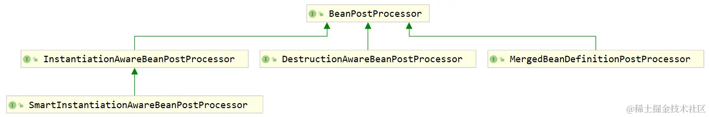

`BeanPostProcessor` 的子接口，它添加了实例化之前的回调，以及在实例化之后但在设置显式属性或自动装配发生之前的回调，**主要供框架内部使用**。


`InstantiationAwareBeanPostProcessor` 中定义了 4 个方法：

~~~java
public interface InstantiationAwareBeanPostProcessor extends BeanPostProcessor {
    @Nullable
    default Object postProcessBeforeInstantiation(Class<?> beanClass, String beanName) throws BeansException {
        return null;
    }
	
    default boolean postProcessAfterInstantiation(Object bean, String beanName) throws BeansException {
        return true;
    }

    @Nullable
    default PropertyValues postProcessProperties(PropertyValues pvs, Object bean, String beanName) throws BeansException {
        //  PropertyValues 是一组 field - value 的键值对
        //  它会参与到 bean 的属性赋值环节
        return null;
    }

    /** @deprecated  被上面两个方法代替 */
    @Deprecated
    @Nullable
    default PropertyValues postProcessPropertyValues(PropertyValues pvs, PropertyDescriptor[] pds, Object bean, String beanName) throws BeansException {
        return pvs;
    }
}
~~~

- `postProcessBeforeInstantiation` ：在 bean 的实例化之前调用。如果返回一个非空对象，那么后续的所有 Bean 实例化与初始化的动作将不再进行（包括依赖注入）。只会调用后续的`BeanPostProcessor@postProcessAfterInitialization()`。
- `postProcessAfterInstantiation` ：在 bean 的实例化之后，在依赖注入之前调用。如果返回 false ，则，将会跳过 Bean 的剩余属性填充步骤（包括`postProcessProperties`）
- `postProcessProperties` ：在装配属性（自动注入&属性赋值）之前执行。


使用示例

~~~java
@Component
class CustomBeanPostProcessor implements InstantiationAwareBeanPostProcessor {    
	@Override
    public PropertyValues postProcessProperties(PropertyValues pvs, Object bean, String beanName) throws BeansException {
        if ("ball2".equals(beanName)) {
            MutablePropertyValues values = new MutablePropertyValues(pvs);
            values.addPropertyValue("id", "拦截球~");
            return values;
        }
        return null;
    }
}
~~~


`DestructionAwareBeanPostProcessor`可以在 bean 销毁前进行拦截处理。

~~~java
public interface DestructionAwareBeanPostProcessor extends BeanPostProcessor {
    void postProcessBeforeDestruction(Object var1, String var2) throws BeansException;

    default boolean requiresDestruction(Object bean) {
        return true;
    }
}
~~~


之前我们介绍过基于 XML 的 bean 合并，现我们来看基于注解的 Bean 合并。

```java
public abstract class Animal {
    @Autowired
    private Person person;
}

public class Cat extends Animal {
    private String name;
}
```

`MergeDefinitionPostProcessor`拦截合并之后的 BeanDefinition 合并，它发生在 bean 的实例化之后，自动注入之前。

~~~java
public interface MergedBeanDefinitionPostProcessor extends BeanPostProcessor {
	void postProcessMergedBeanDefinition(RootBeanDefinition beanDefinition, Class<?> beanType, String beanName);

	default void resetBeanDefinition(String beanName) {}
}
~~~


## BeanFactoryPostProcessor

`BeanFactoryPostProcessor` 是容器的扩展点，它可以在 IOC 容器的生命周期中的所有 `BeanDefinition` 注册到 `BeanFactory` 后触发回调，用于访问 / 修改已经存在的 `BeanDefinition` 。与 `BeanPostProcessor` 相同，它们都是容器隔离的，不同容器中的 `BeanFactoryPostProcessor` 不会相互起作用。它的定义如下：

~~~java
@FunctionalInterface
public interface BeanFactoryPostProcessor {
    void postProcessBeanFactory(ConfigurableListableBeanFactory var1) throws BeansException;
}
~~~

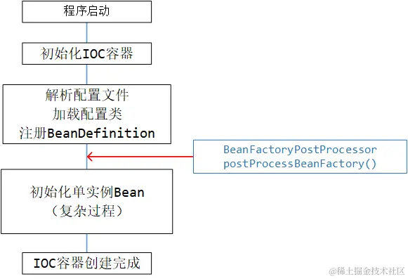


使用示例：

~~~java
@Component
public class ColorNameSetterFactoryPostProcessor implements BeanFactoryPostProcessor {
    
    @Override
    public void postProcessBeanFactory(ConfigurableListableBeanFactory beanFactory) throws BeansException {
        Stream.of(beanFactory.getBeanDefinitionNames()).forEach(beanName -> {
            BeanDefinition beanDefinition = beanFactory.getBeanDefinition(beanName);
            if (StringUtils.hasText(beanDefinition.getBeanClassName())) {
                if (ClassUtils.resolveClassName(
                    		beanDefinition.getBeanClassName(), 
                    		this.getClass().getClassLoader())
                    	.getSuperclass()
                    	.equals(Color.class)) {
                    // 如果一个对象的父类为Color，那么给该对象的 name 属性赋值
                    beanDefinition.getPropertyValues().add("name", beanName);
                }
            }
        });
    }
}
~~~

`BeanDefinitionRegistryPostProcessor`可以在 `BeanFactoryPostProcessor` 之前，注册其他的 `BeanDefinition`。而且`BeanFactoryPostProcessor#postProcessBeanFactory()`优先处理通过它注册的`BeanDefiniton`


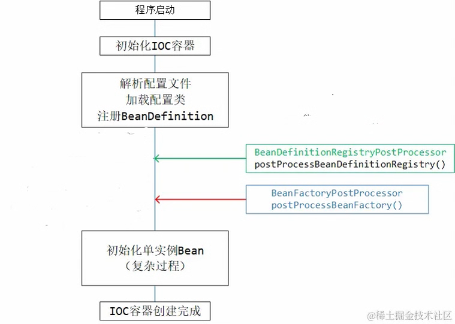

使用示例：

~~~java
@Component
public class DogRegisterPostProcessor implements BeanDefinitionRegistryPostProcessor {
    
    @Override
    public void postProcessBeanDefinitionRegistry(BeanDefinitionRegistry registry) throws BeansException {
        if (!registry.containsBeanDefinition("dog")) {
            // 构造BeanDefinition，并注册进BeanFactory
            BeanDefinition dogDefinition = BeanDefinitionBuilder.genericBeanDefinition(Dog.class).getBeanDefinition();
            registry.registerBeanDefinition("dog", dogDefinition);
        }
    }
    
}
~~~


此外，还可以通过 `BeanDefinitionRegistryPostProcessor`动态注册`BeanFactoryPostProcessor`

~~~java
@Component
public class AnimalProcessorRegisterPostProcessor implements BeanDefinitionRegistryPostProcessor {
    
    @Override
    public void postProcessBeanDefinitionRegistry(BeanDefinitionRegistry registry) throws BeansException {
        // 这里的AnimalNameSetterPostProcessor类已经实现了BeanFactoryPostProcessor接口
        registry.registerBeanDefinition("animalNameSetterPostProcessor", 
                new RootBeanDefinition(AnimalNameSetterPostProcessor.class));
    }
    
    @Override
    public void postProcessBeanFactory(ConfigurableListableBeanFactory beanFactory) throws BeansException {
    
    }
}

public class AnimalNameSetterPostProcessor implements BeanFactoryPostProcessor { }
~~~


## 编程式驱动的 IOC

前面我们是配置式/声明式来使用 IOC 容器，这里我们简单展示一下编程式来使用 IOC 容器。

借助 BeanDefinition 来注册 Bean

~~~java
public static void main(String[] args) throws Exception {
    AnnotationConfigApplicationContext ctx = new AnnotationConfigApplicationContext();
    BeanDefinition personDefinition = BeanDefinitionBuilder
        .rootBeanDefinition(Person.class)
        // 设置name属性
        .addPropertyValue("name", "zhangsan")
        .getBeanDefinition();
    
    BeanDefinition catDefinition = BeanDefinitionBuilder.rootBeanDefinition(Cat.class)
        // 依赖注入的对象引用，在 xml 配置文件中用 ref 属性，此处也是用对应的 property reference 来设置
        .addPropertyValue("name", "咪咪").addPropertyReference("person", "laowang")
        .getBeanDefinition();
    
    ctx.registerBeanDefinition("person", personDefinition)
    ctx.registerBeanDefinition("car", personDefinition)    
    ctx.refresh();
    // refresh 方法的执行，会触发非延迟加载的单实例 bean 的实例化和初始化
    
    Person person = ctx.getBean(Person.class);
    System.out.println(person);
}
// registerBeanDefinition 方法来自于 BeanDefinitionRegistry接口，所以用 ApplicationContext 或者 ConfigurableApplicationContext 接口是拿不到该方法的
~~~


借助包扫描来注册 Bean

~~~java
AnnotationConfigApplicationContext ctx = new AnnotationConfigApplicationContext();

ClassPathBeanDefinitionScanner scanner = new ClassPathBeanDefinitionScanner(ctx);

scanner.addIncludeFilter((metadataReader, metadataReaderFactory) -> {
    // getClassMetadata可以获取到扫描类的相关元信息，此处把Animal的子类都拿出来
    return metadataReader
        .getClassMetadata()
        .getSuperClassName()
        .equals(Animal.class.getName());
});

// 返回值是注册进 IOC 容器的 bean 的数量
int count = scanner.scan("com.linkedbear.spring.programmatic.b_di.bean");
~~~

`ClassPathBeanDefinitionScanner` 还有一个方法

~~~java
public Set<BeanDefinition> findCandidateComponents(String basePackage);
~~~

该方法会获取包扫描之后 `BeanDefinition`，但不会注册进 IOC 容器中，这给了我们很大的操作空间。

~~~java
Set<BeanDefinition> animalDefinitions = scanner
    .findCandidateComponents("com.linkedbear.spring.programmatic.b_di.bean");

animalDefinitions.forEach(definition -> {
    MutablePropertyValues propertyValues = definition.getPropertyValues();
    String beanClassName = definition.getBeanClassName();
    propertyValues.addPropertyValue("name", beanClassName);
    // 设置依赖注入的引用，需要借助RuntimeBeanReference实现
    // 设置person属性
    propertyValues.addPropertyValue("person", new RuntimeBeanReference("laowang"));
    // 手动注册
    ctx.registerBeanDefinition(
        Introspector.decapitalize(
            beanClassName.substring(
                beanClassName.lastIndexOf("."))), 
        definition);
    
});

ctx.refresh();	// 手动刷新。
~~~

## Bean的工厂创建

### FactoryBean

FactoryBean 将复杂的 Bean 创建逻辑抽离出来了

~~~java
public interface FactoryBean<T> {
    // 返回 Bean 对象
    @Nullable
    T getObject() throws Exception;

    // 返回 Bean 对象的类型
    @Nullable
    Class<?> getObjectType();

    // 创建的对象是单实例 Bean（默认） 还是原型 Bean，
    default boolean isSingleton() {
        return true;
    }
}
~~~

下面给出一个例子：

~~~java
class Child {
    private String wantToy = "ball";
    public String getWantToy() {
        return wantToy;
    }
}

abstract class Toy {
    private String name;
    public Toy(String name) {
        this.name = name;
    }
}

class Ball extends Toy { 
    public Ball(String name) {
        super(name);
    }
}

class Car extends Toy { 
    public Car(String name) {
        super(name);
    }
}
~~~

~~~java
public class ToyFactoryBean implements FactoryBean<Toy> {
    private Child child;
    
    @Override
    public Toy getObject() throws Exception {
        switch (child.getWantToy()) {
            case "ball":
                return new Ball("ball");
            case "car":
                return new Car("car");
            default:
                return null;
        }
    }
    
    @Override
    public Class<Toy> getObjectType() {
        return Toy.class;
    }
    
    public void setChild(Child child) {
        this.child = child;
    }
}
~~~

通过 xml 注册 FactoryBean

~~~xml
<bean id="child" class="com.linkedbear.spring.bean.a_type.bean.Child"/>

<bean id="toyFactory" class="com.linkedbear.spring.bean.a_type.bean.ToyFactoryBean">
    <property name="child" ref="child"/>
</bean>
~~~

或者通过配置类注册 FactoryBean

~~~java
@Bean
public Child child() {
    return new Child();
}

@Bean
public ToyFactoryBean toyFactory() {
    ToyFactoryBean toyFactory = new ToyFactoryBean();
    toyFactory.setChild(child());
    return toyFactory;
}
~~~

FactoryBean 会向容器中注册两个 Bean，一个是它本身，一个是 getObject() 返回的对象。

`FactoryBean` 有一个子接口 `SmartFactoryBean`，它的定义如下：

~~~java
public interface SmartFactoryBean<T> extends FactoryBean<T> {
    default boolean isPrototype() {
        return false;
    }

    default boolean isEagerInit() {
        return false;
    }
}
~~~

- isPrototype：创建的 Bean 对象是否为多例的
- isEagerInit：是否要提前初始化 Bean。默认情况下，仅仅初始化 FactoryBean 本身，而被它包裹的 Bean 只有在第一次被使用时，才会初始化。这个设置为 true 后，在初始化 FactoryBean 的同时，也会初始化它包裹的 Bean。

### 静态工厂

静态工厂创建 Bean

~~~java
public class CarStaticFactory {
    public static Car getCar() {
        return new Car();
    }
}
~~~

配置 xml

~~~xml
<bean id="car2" class="com.linkedbear.spring.bean.c_instantiate.bean.CarStaticFactory" factory-method="getCar"/>
~~~

注意：静态工厂本身未注册到容器中

### 实例工厂

实例工厂创建 Bean

~~~java
public class CarInstanceFactory {
    public Car getCar() {
        return new Car();
    }
}
~~~

配置xml

~~~xml
<bean id="carInstanceFactory" class="com.linkedbear.spring.bean.c_instantiate.bean.CarInstanceFactory"/>

<bean id="car3" factory-bean="carInstanceFactory" factory-method="getCar"/>
~~~
