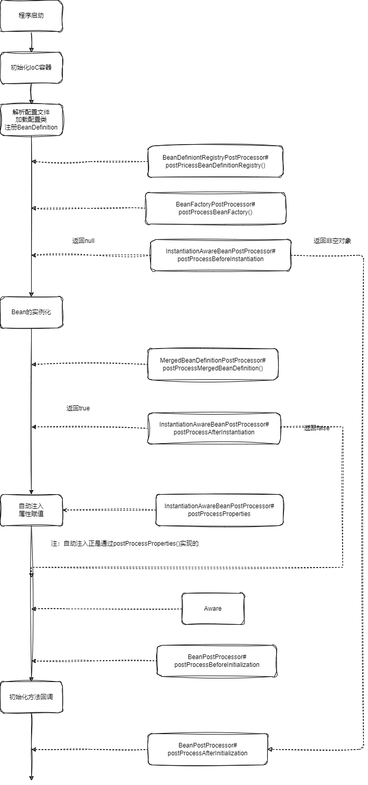
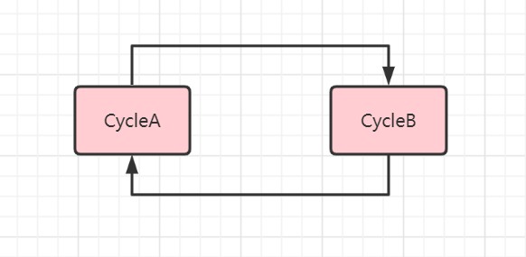
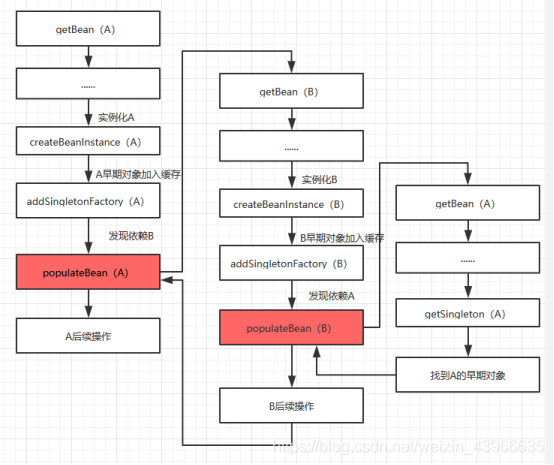

# IoC进阶二

[TOC]

## Bean 完整的生命周期概述

- BeanDefinition
  - `BeanDefinition` 的解析
  - `BeanDefinition` 的注册
- Bean 实例
  - 实例化
  - 属性赋值 + 依赖注入
  - 初始化流程
  - 启动与停止
  - 销毁
  

~~~java
// # AbstractApplicationContext
public void refresh() throws BeansException, IllegalStateException {
    //第一步：容器刷新前的准备，设置上下文状态，获取属性，验证必要的属性等
    prepareRefresh();
    
    //第二步：获取新的 beanFactory，销毁原有 beanFactory、生成 BeanDefinition
    ConfigurableListableBeanFactory beanFactory = obtainFreshBeanFactory();

    // 3. BeanFactory 的预处理配置，注册 BeanPostProcessor 等等
    prepareBeanFactory(beanFactory);

    // 4. 注册 BeanFactoryPostProcessors
    postProcessBeanFactory(beanFactory);

    // 5. 执行 BeanFactory 创建后的后置处理器 BeanFactoryPostProcessors
    // 以及解析 @Component 注解
    invokeBeanFactoryPostProcessors(beanFactory);

    // 6. 注册 Bean 的后置处理器
    registerBeanPostProcessors(beanFactory);

    // 7. 初始化 MessageSource
    initMessageSource();

    // 8. 初始化事件派发器
    initApplicationEventMulticaster();

    // 9. 回调子类 onRefresh
    onRefresh();

    // 10. 注册监听器
    registerListeners();

    //到此为止，BeanFactory 已创建完成

    // 11. 初始化所有剩下的单例 Bean
    finishBeanFactoryInitialization(beanFactory);

    // 12. 完成容器的创建工作
    finishRefresh();
}
~~~

这张图混淆了 IOC 容器初始化过程与 Bean 生命周期。在 `BeanFactoryPostProcessor` 之前（包括它），都是 IOC 初始化的主要过程。在 IOC 初始化的最后一步 `finishBeanFactoryInitialization`中，才开始 Bean 的生命周期，在图中对应的是 `InstantiationAwareBeanPostProcessor`。而且 IOC 容器初始化过程是线性的，而各个 Bean 的生命周期是交错的，当调用 getBean 时，它们生命周期就开始了。

IOC 容器的切入点如下：

## 注册 BeanDefiniton 

`BeanDefinition`来源：

- 声明式

  - `@Configuration + @Bean`
  - `@Component + @ComponentScan`
  - `@Import`

- 配置式

  - `<Bean>`标签

- 编程式（`BeanDefinition`）

  - 手动构造 `BeanDefinition`并注册到容器中

    ~~~java
    AnnotationConfigApplicationContext ctx = new AnnotationConfigApplicationContext();
    
    BeanDefinition personDefinition = BeanDefinitionBuilder
        .rootBeanDefinition(Person.class)
        .addPropertyValue("name", "zhangsan")
        .getBeanDefinition();
    
    ctx.registerBeanDefinition("person", personDefinition);
    ctx.refresh();
    ~~~

  - `BeanDefinitionRegistryPostProcessor` 

    ~~~java
    public void postProcessBeanDefinitionRegistry(BeanDefinitionRegistry registry) throws BeansException {
        registry.registerBeanDefinition("animalNameSetterPostProcessor", 
                new RootBeanDefinition(AnimalNameSetterPostProcessor.class));
    }
    ~~~

  - `ImportBeanDefinitionRegistrar`：直接可以向工厂里注册 BeanDefinition

    ~~~java
    public class WaiterRegistrar implements ImportBeanDefinitionRegistrar {
        
        @Override
        public void registerBeanDefinitions(AnnotationMetadata metadata, BeanDefinitionRegistry registry) {
            registry.registerBeanDefinition("waiter", new RootBeanDefinition(Waiter.class));
        }
    }
    
    // 通过 @Import 来注册
    @Configuration
    @Import(WaiterRegistrar.class) {
        
    }
    ~~~
    
    

### 加载  xml  配置文件

发生在  `refresh` 方法中的 `obtainFreshBeanFactory` 一步。

核心方法是 `loadBeanDefinitions`。此时 `BeanFactory` 刚刚构建完成，它会借助 `XmlBeanDefinitionReader` 来加载并解析 xml 配置文件，而`XmlBeanDefinitionReader`委托给 `DefaultBeanDefinitionDocumentReader` 解析 xml 配置文件，最后将 `<bean>` 标签内容转换为 `BeanDefinition`，最后注册到 `BeanDefinitionRegistry` 。

无论是 `XmlBeanFactory` 还是 `ClassPathXmlApplicationContext`，它们都使用 `XXXReader` 的 `loadBeanFactory` 方法来**加载并解析**资源文件。并且在该方法中，将解析出的 `BeanDefinition` 注册到  `beanFactory` 中。

而 `XXXReader#loadBeanFactory` 依赖于 `ResourceLoader` 接口来加载资源文件。之前我们提及过 `AbstractApplicationContext` 继承了 `DefaultResourceLoader`，而 `DefaultResourceLoader` 实现了 `ResourceLoader` 接口。

`ClassPathXmlApplicationContext` 实现了 `loadBeanDefinitions` 方法，对`XXXReader#loadBeanFactory`的方法进行了一层封装，用于获取 `BeanDefinition`。

~~~java
// # AbstractXmlApplicationContext
protected void loadBeanDefinitions(DefaultListableBeanFactory beanFactory) throws BeansException, IOException {
    // 创建 beanDefinitionReader，并对其做初始化工作
    XmlBeanDefinitionReader beanDefinitionReader = new XmlBeanDefinitionReader(beanFactory);
    beanDefinitionReader.setEnvironment(this.getEnvironment());
    
    // 这里给 Reader 设置 ResourceLoader
    // 注意 AbstractXmlApplicationContext 在父类 AbstractApplicationContext 中实现了 ResourceLoader 接口。
    beanDefinitionReader.setResourceLoader(this);
    beanDefinitionReader.setEntityResolver(new ResourceEntityResolver(this));
    this.initBeanDefinitionReader(beanDefinitionReader);
    
    // 开始使用 beanDefinitionReader 加载 & 解析文件，并将解析出的 BeanDefinition 注册到 beanFactory 参数中
    this.loadBeanDefinitions(beanDefinitionReader);
}
~~~

在 `XmlBeanFactory` 中使用 `XmlBeanDefinitionReader#loadBeanFactory` 方法并未指定 `ResourceLoader`，好在 `XmlBeanDefinitionReader` 提供了一个默认的 `ResourceLoader`作为加载源 。

### 解析注解配置类

发生在 `refresh` 方法的 `invokeBeanFactoryPostProcessors`一步。主要解析 @Component、@Import、@ImportResource、@Bean、@PropertySource 等。

该阶段首先会执行 `ConfigurationClassPostProcessor` （继承自`BeanDefinitionRegistryPostProcessor`，而且该后置处理器是最先执行的）的 `postProcessBeanDefinitionRegistry` 方法。它主要完成三件事：

1. 借助 `ClassPathBeanDefinitionScanner`，找出所有的配置类，排序后依次解析。
2. 借助 `ConfigurationClassParser`，解析配置类上的注解（如 `@Import` 、`@ImportResource` 、`@PropertySource` 等）
3. 借助 `ConfigurationClassBeanDefinitionReader`：解析配置类中的 `@Bean` 并封装 `BeanDefinition`

注意：在 SpringFramework 4.0 中，`ImportSelector`有一个子接口 `DeferredImportSelector`，它**在完成解析配置类的所有工作后**才执行。而`ImportSelector` 在处理@ImportResource、@Bean之前就完成了。它在 Spring Boot 中却有大量的应用，配合着`@Conditional`注解（尤其是`@ConditionalOnBean`，使用它要确保我们导入的 Bean 已经存在了）时，可以体现自动装配中约定大于配置的思想

此外，从 @Component 以及 xml 配置文件中的 `<bean>`标签解析出来的 BeanDefiniton，它们都处理了 Bean 的全限定名、属性注入等，最终实例化的 Bean 对象必定是通过反射创建的。而  `@Bean` 方法是**有实际的代码执行**，属于**编程式创建**。因此，@Bean 对应的 BeanDefinition 就要记录该 Bean 的定义源（包含配置类和方法名），以保证在实例化 bean 对象时，能够使用反射调用该配置类的方法，生成 bean 对象并返回。`<bean>`上的 `factory-method`属性也属于编程式创建，原理与之类似

## Bean 的实例化

在实例化所有非延迟加载的单例 bean 之前，会先注册所有的 `BeanPostProcessor` 。这一步发生在 `refresh` 方法的 `registerBeanPostProcessors()`中。

然后在 `refresh` 方法的 `finishBeanFactoryInitialization`一步中，实例化所有非延迟加载的单例 Bean。其中的核心方法是核心方法是 `preInstantiateSingletons`：

~~~java
// DefaultListableBeanFactory
@Override
public void preInstantiateSingletons() throws BeansException {
    List<String> beanNames = new ArrayList<>(this.beanDefinitionNames);
    // getBean 用于获取指定名称的 Bean，如果不存在或者多例的，那么就尝试实例化它。
    for (String beanName : beanNames) {
        RootBeanDefinition bd = getMergedLocalBeanDefinition(beanName);
   		// 非抽象、单例、非延迟加载的 Bean
        if (!bd.isAbstract() && bd.isSingleton() && !bd.isLazyInit()) {
            // 如果是 FactoryBean
            if (isFactoryBean(beanName)) {
                // 这里加了前缀 $，获取或实例化 BeanFactory 本身
                Object bean = getBean(FACTORY_BEAN_PREFIX + beanName);
                if (bean instanceof SmartFactoryBean<?> smartFactoryBean && smartFactoryBean.isEagerInit()) {
                    // 这里并没有前缀 $，获取或实例化 BeanFactory 下的 Bean 对象
                    getBean(beanName);
                }
            }
            else {
                // 获取或实例化 Bean 对象
                getBean(beanName);
            }
        }
    }
    
    //...
}
~~~

从上述代码中我们可以得知 Bean 的实例化时机：

- 对于 Singleton Bean （非延迟加载的）、FactoryBean、SmartFactoryBean 创建的 Bean（isEagerInit=true）等，都是伴随容器初始化而创建。
- 而  FactoryBean 创建的 Bean 、 Prototype Bean 等，都是在使用时延迟创建的（按需创建），或者在循坏依赖中创建出来。

它们都是通过 getBean 方法来创建的。它会获取指定名称的 Bean。如果未获取到，或者它是多例的，那么就实例化它。

**getBean 方法十分重要，它是 Bean 对象生命周期的起点**。下面就对 `doGetBean` 中出现的重要方法做一个概述：

1. 原型 Bean 的循环检测

2. 如果本容器中不存在，那么从父容器中获取

3. 处理 @DependOn 注解

4. 创建对象

   ~~~java
   if (mbd.isSingleton()) {
       sharedInstance = getSingleton(beanName, () -> {
           try {
               return createBean(beanName, mbd, args);
           } // catch ......
       });
       bean = getObjectForBeanInstance(sharedInstance, name, beanName, mbd);
   }
   else if (mbd.isPrototype()) {
       Object prototypeInstance = null;
       prototypeInstance = createBean(beanName, mbd, args);
       bean = getObjectForBeanInstance(prototypeInstance, name, beanName, mbd);
   }
   ~~~

- `getSingleton`：从单实例 bean 的缓存中获取该对象，如果不存在，那么尝试调用回调函数来创建它。
- `getObjectForBeanInstance`：判断 bean 是不是 FactoryBean
  - 不是：直接返回 bean
  - 是并且以 & 符号开头：直接返回 bean，也就是 factoryBean 本身
  - 是但不以  & 符号开头：返回从 `FactoryBean#getObject()`中获取的 Bean 对象。
- `createBean`：
  - 调用 `resolveBeforeInstantiation` 方法来回调`InstantiationAwareBeanPostProcessor`接口的`postProcessBeforeInstantiation` 方法
  -  ，如果它返回一个 `Bean` 对象，那么就直接退出 `createBean` 方法
  - 调用 `doCreateBean` 完成以下三件事情：
    - 实例化 Bean 对象：找到符合要求的构造函数，然后构造出 Bean 对象
    - 属性赋值 & 依赖注入
    - Bean 对象的初始化

## Bean的初始化

下面我们介绍 `doCreateBean` 剩下的部分，它是 `Bean` 的初始化生命周期：

1. 回调 `MergedBeanDefinitionPostProcessor` 接口
2. 收集有关 `@PostConstruct` 和 `@PreDestroy` 注解的信息
3. 收集有关 `@WebServiceRef` 、`@EJB` 、`@Resource`、`@Autowired`、`@Value` 等注解的信息。
4. 调用 `populateBean` 方法，来处理属性赋值 + 依赖注入
   1. 执行 `InstantiationAwareBeanPostProcessor` 接口的 `postProcessAfterInstantiation` 方法。如果返回 `false`，那么就直接退出该方法
   2. 预处理 `@Autowired` 注解，添加对象之间的依赖关系，同时调用 `getBean` 获取或实例化依赖对象。注意，依赖注入的信息被添加到 `PropertyValues` 中了。
   3. 执行 `InstantiationAwareBeanPostProcessor` 接口的 `postProcessProperties` 方法。注意（2）其实是在 `AutowiredAnnotationBeanPostProcessor#postProcessProperties` 中完成的。
   5. 执行属性赋值 + 依赖注入，就是把前面准备好的 `PropertyValues` 对象，应用到当前 Bean 实例上
5. 按顺序执行剩余回调：
   1. 执行 `BeanPostProcessor` 的前置回调
   2. 初始化回调：`InitializingBean` 接口的 `afterPropertiesSet` 方法回调，以及 `init-method` 的回调
   3. 执行 BeanPostProcessor 的后置回调

有些 Aware 子接口（例如 `BeanNameAware`）是通过 `BeanPostProcessor`的子类`ApplicationContextAwareProcessor`来回调的。而其他 Aware 接口（例如 `EnvironmentAware`）回调注入不由 `BeanFactory` 负责，也就是说，Spring 在适当的时机会自行调用这些 Aware 接口的方法。这样我们可以编写出以下代码

~~~java
public class DataSourceRegisterPostProcessor implements BeanDefinitionRegistryPostProcessor, EnvironmentAware {
    // 在 BeanDefinitionRegistryPostProcessor 回调时，Environment 对象已经注入完成
}
~~~

## Lifecycle

在 `refresh` 方法中最后一步 `finishRefresh` 中，它会找出所有实现了 `Lifecycle` 接口的、且实例化的 `bean` ，然后调用它们的 `start` 方法。

Lifecycle 接口的定义如下：

~~~java
public interface Lifecycle {
	void start();
	void stop();
	boolean isRunning();
}
~~~

- `start`：容器启动后调用。多用于**建立连接**、**加载资源**等等操作，以备程序的运行期使用。
- `stop`：容器停止时调用
- `isRunning`：检查此组件是否正在运行。

## 销毁

关闭 `ApplicationContext` 会顺序执行以下几步：

1. 广播容器关闭事件`ContextClosedEvent`

2. 回调所有实现了 `Lifecycle` 接口的 `bean` 对象的 `close` 方法

3. 销毁所有 bean。由 `BeanFactory` 取出所有单实例 bean ，并逐个销毁。销毁动作会

   1. 先将当前 bean 依赖的所有 bean 都销毁。

   2. 随后回调自定义的 bean 的销毁方法。

   3. 之后如果 bean 中有定义内部 bean 则会一并销毁。这里内部的 Bean 是指：

      ~~~xml
      <bean id="cat" class="com.linkedbear.spring.lifecycle.e_source.bean.Cat">
          <property name="name" value="mimi"/>
          <property name="master">
              <bean class="com.linkedbear.spring.lifecycle.e_source.bean.Person"/>
          </property>
      </bean>
      ~~~

   销毁的顺序是：

   1. @PreDestroy（这个正是通过由 Spring 自己注册的 DestructionAwareBeanPostProcessor 对象来完成的）
   2. 回调 DestructionAwareBeanPostProcessor 接口
   3. destroy 方法
   4. destroy-method 方法

4. 关闭 BeanFactory

5. 标记本身为不可用

注意，程序员要自己管理原型 bean 的生命周期。Spring 框架已经帮我们管理了单例 Bean 的生命周期。

## 循环依赖

下面我们来看一个循环依赖的例子：

~~~java
@Component
public class CycleA {
	@Autowired
	private CycleB cycleB;
}

@Component
public class CycleB {
	@Autowired
	private CycleA cycleA;
}
~~~

Spring 能够处理这种循环依赖，解决循环依赖问题的核心思路是「利用**三级缓存**来**提前暴露 bean 的引用**」，这就破坏了循环等待这个条件。

IOC 无法解决的两种循环依赖：

1. 非单例对象：因为非单例对象不会放入缓存的，每次都是按需要创建

2. 构造器注入：调用构造器创建实例是在 `createBeanInstance` 方法，而解决循环依赖是在`populateBean`（负责属性注入的方法）这个方法中，执行顺序也决定了无法解决该种循环依赖。

   可以给构造器参数添加 @Lazy 来解决构造器之间的循环依赖问题：

   ~~~java
   public CycleB(@Lazy CycleA cycleA){
       this.cycleA = cycleA;
   }
   ~~~

   

三级缓存如下：

- `singletonObjects`：单例对象的缓存，也就是常说的一级缓存，key-value为 bean 名称到 bean 实例，这里的实例是**完整**的 bean
- `earlySingletonObjects`：早期单例对象的缓存，也就是常说的二级缓存，key-value 为 bean 名称到 bean 实例，这里的实例是**半成品**的 bean（未属性注入的）。
- `singletonFactories`：单例工厂的缓存，也就是常说的三级缓存，key-value 为 bean 名称到创建该 bean 的`ObjectFactory`。

下图就说明如何解决上面的例子循环依赖问题：

1. 在实例化 A 之后，先把 A 放在三级缓存中
2. 在 A 的 populateBean （属性注入）中，发现依赖对象 B。由于在缓存中没有找到 B 对象，故开始初始化 B 对象。
3. 实例化 B，并将其放在三级缓存中。
4. 在 B 的 populateBean （属性注入）中，发现依赖对象 A。从三级缓存中获取 A 对象，并尝试 AOP 代理，然后放在二级缓存中。
5. B 完成初始化工作，放在一级缓存中
6. A 注入完整的 B 对象，然后完成初始化工作，将自己放在一级缓存中。此时对于 B 来说，A 已经是一个完整的 Bean 了。

从理论上来说，使用二级缓存是可以解决 AOP 代理 Bean 的循环依赖的。即在 doCreateBean方法中，直接生成基于 AOP 的代理对象，将代理对象存入二级缓存 earlySingleton。但是这样做的话，就把 AOP 中创建代理对象的时机提前了，不管是否发生循环依赖，都在 doCreateBean 方法中完成了 AOP 的代理。这不仅没有必要，而且违背 了Spring 违反了 Bean 的生命周期的设计。

1. 创建实例 createBeanInstance
2. 填充依赖 populateBean 
3. 后置处理 initializeBean ，包括 AOP 对象的产生

我们只需**特殊情况特殊对待**就行，而不是将整个 AOP 机制提前到 populateBean 中执行。所以，Spring 引入了一个三级缓存，并使用  ObjectFacotry 对象来包装半成品 Bean。当从三级缓存中获取的 Bean 对象，就会对其调用`wrapIfNecessary()`方法来**尝试**进行代理。

而 `wrapIfNecessary()`另一个调用点在`AnnotationAwareAspectJAutoProxyCreator#postProcessAfterInitialization()`方法里，该方法会在对象实例化后、初始化完成后再进行调用。这里是在属性注入的时候就已经创建，所以相对而言，创建代理的时机提前了。
