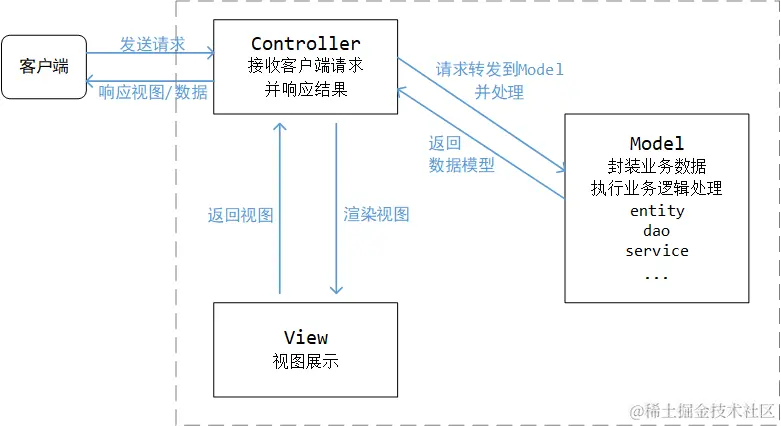
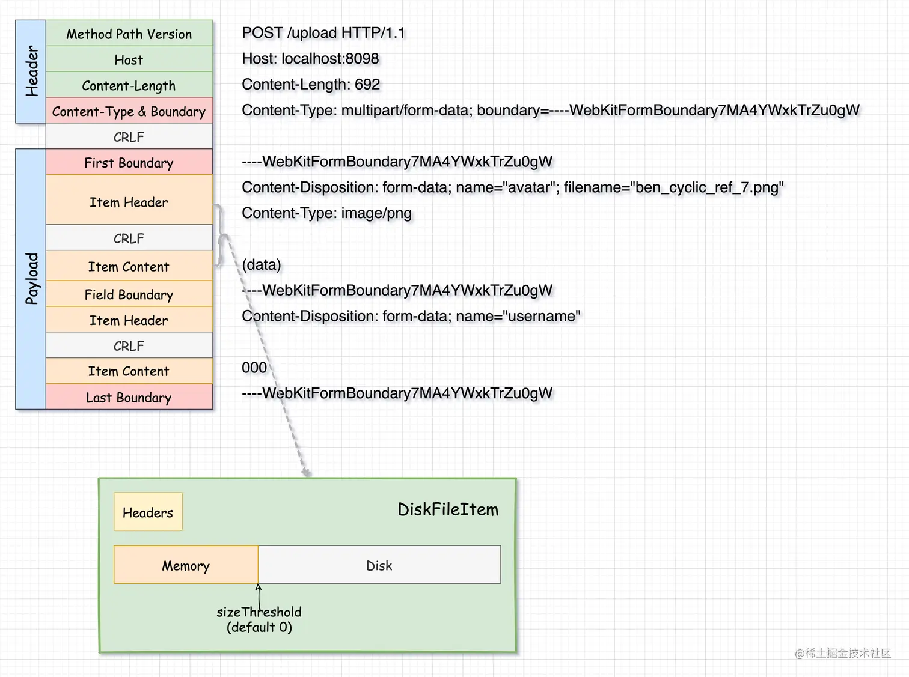
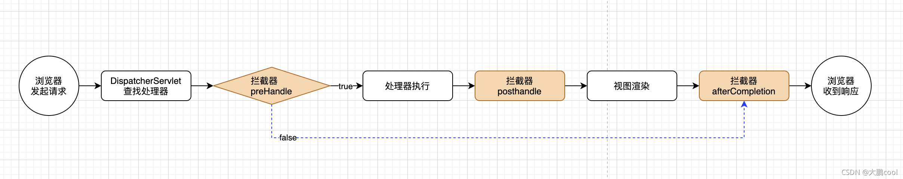
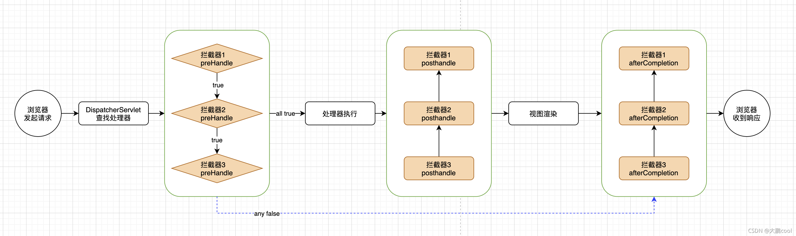
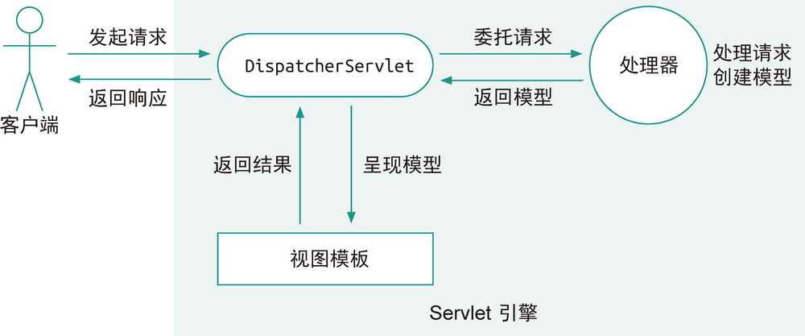
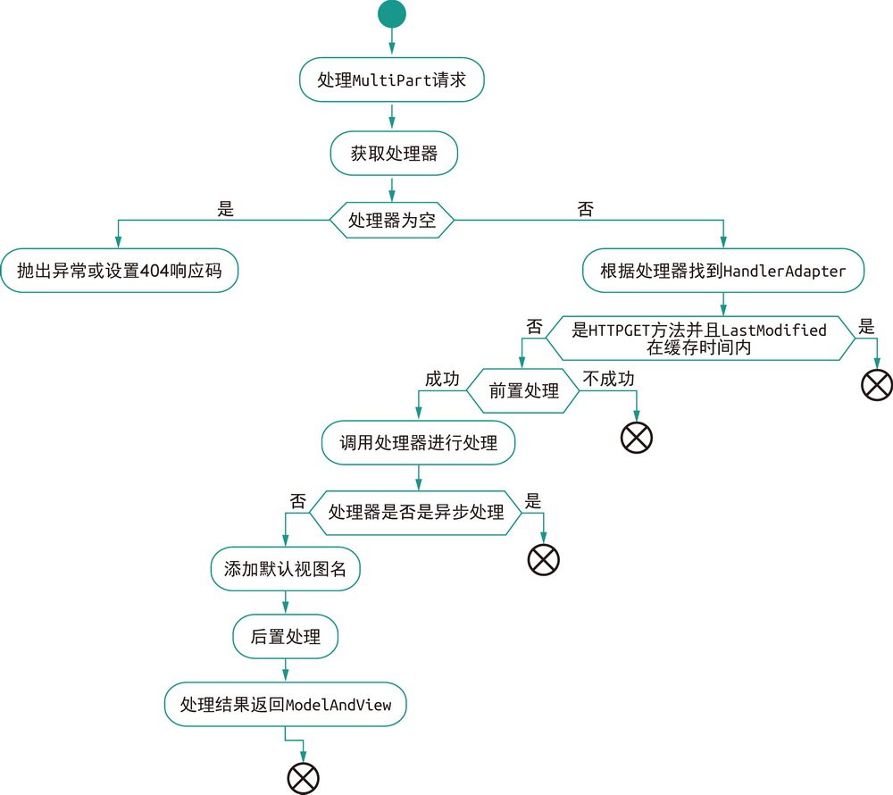
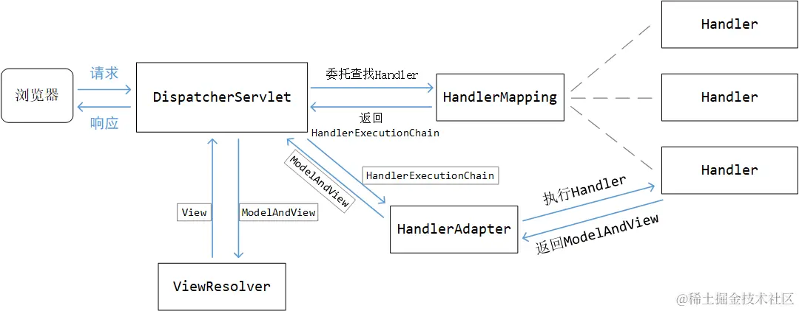

# Web

[TOC]

## 概述

Spring MVC 能帮助我们方便地开发符合 MVC 模式的 Web 应用，MVC 即 **Model-View-Controller**（模型——视图——控制器），是一种软件架构模式。MVC 的主要目标就是对用户界面与业务逻辑进行解耦，提升系统代码的可扩展性、可复用性和可维护性。

- **模型层**封装了业务逻辑
- **视图层**则是暴露给用户的界面
- **控制器层**则在两者之间充当黏合剂，很单薄

在前后端分离的设计中，后端负责暴露接口给前端调用。也就是将 MVC 中的 View 层分离到前端去，原本的`Model`层被`Service`层以及`Repository`层代替。这种情况下，我们一般就将后端项目分为：

- `Repository`层：负责数据访问

- `Service`层：负责业务逻辑

- `Controller`层：负责暴露接口

Spring MVC 的设计是围绕 `DispatcherServlet` 展开的，它是整个 Spring MVC 的核心，跟它配合的组件主要有下面这些：

- **控制器**，我们编写的各种 `Controller`；
- 各类**校验器**，例如，Spring MVC 内置了对 Hibernate Validator 的支持；
- 各类**解析器**，例如，视图解析器 `ViewResolver`、异常解析器 `HandlerExceptionResolver` 和 Multipart 解析器 `MultipartResolver`；
- **处理器映射**，`HandlerMapping` 定义了请求该如何找到对应的处理器，例如，根据 Bean 名称的 `BeanNameUrlHandlerMapping`，以及根据 `@RequestMapping` 注解的 `RequestMappingHandlerMapping`；
- **处理器适配器**，`DispatcherServlet` 在收到请求时，通过 `HandlerAdapter` 来调用所映射的处理器。

>什么是Servlet？
>
>早期的 Web 只是简单地提供静态资源。随着技术的发展，逐步出现了一些动态技术，即通过调用服务器上的一些程序动态地响应用户的请求。1993 年美国国家超级电脑应用中心（NCSA）提出了 CGI（Common Gateway Interface，通用网关接口）标准来规范化这种技术。
>
>为了规范 Java Web 程序，提升开发效率，Java EE（以前叫 J2EE）中诞生了 Java Servlet 技术。Servlet 规范定义了如何接收请求，如何返回响应，如何处理表单，如何处理异常，如何处理 Cookie，如何处理 Session……
>
>所有的 Servlet 都必须实现 `Servlet` 接口，其中有 5 个方法，分别是：
>
>- `init()`，初始化方法；
>- `getServletConfig()`，获得 Servlet 的配置，例如名称、初始化参数等；
>- `getServletInfo()`，获得 Servlet 的信息，例如作者、版本等；
>- `service()`，主要的执行方法；
>- `destroy()`，销毁方法。
>
>但在实际开发时，我们更多地会使用 `HttpServlet` 这个抽象类，去实现里面的 `doXxx()` 方法

## Controller

### 概述

**表 9-1　Spring MVC 中的常用注解**

| 注解              | 说明                                                         |
| :---------------- | :----------------------------------------------------------- |
| `@Controller`     | 定义控制器类，与 `@Service` 和 `@Repository` 类似            |
| `@RestController` | 定义 REST 服务的控制器类，这是个快捷方式注解，其实就是结合了 `@Controller` 和 `@ResponseBody` |
| `@RequestMapping` | 定义URL请求的处理方法，其中的 `path` 属性是正是 URL，`method` 是 `RequestMethod` 枚举中的 HTTP 方法，对于后者，还可以使用一些快捷注解，例如 `@GetMapping`、`@PostMapping`、`@PutMapping`、`@DeleteMapping` 和 `@PathMapping` |
| `@RequestBody`    |                                                              |
| `@ResponseBody`   | `@ResponseBody`注解主要作用是将Controller的方法返回的对象，通过适当的`HttpMessageConverter`转换为指定的格式后，写入到 HTTP 响应（response）体中。 |
| `@ResponseStatus` | 定义请求应答的 HTTP 响应码，具体的响应码可以用 `HttpStatus` 枚举 |

依赖如下：

~~~xml
<dependency>
    <groupId>org.springframework.boot</groupId>
    <artifactId>spring-boot-starter-web</artifactId>
</dependency>
~~~

### 简单的示例

~~~java
// 表明是MVC控制器
@Controller			
// @ResponseBody 可以写在类上，也可以写在方法上，表示将方法的返回值作为响应的正文。
@ResponseBody		
// 类上的 @RequestMapping 注解设置了整个类里的公共属性，在这里是设置了 URL 映射的基础路径 /menu
@RequestMapping("/menu")		
public class MenuController {
    @Autowired
    private MenuService menuService;

    // @GetMapping 相当于 @RequestMapping(method = RequestMethod.GET)
    @GetMapping(params = "!name")
    public List<MenuItem> getAll() {
        return menuService.getAllMenu();
    }

    @GetMapping(path = "/{id}", produces = MediaType.APPLICATION_JSON_VALUE)
    public Optional<MenuItem> getById(@PathVariable Long id) {
        return menuService.getById(id);
    }

    @RequestMapping(params = "name", method = RequestMethod.GET)
    public List<MenuItem> getByName(@RequestParam String name) {
        return menuService.getByName(name);
    }
}
~~~

### @RequestMapping

被 `@RequestMapping` 注解的方法称为**「请求处理方法」**

| 属性       | 类型              | 说明                                                         |
| :--------- | :---------------- | :----------------------------------------------------------- |
| `name`     | `String`          | 为映射定义一个名称。当类上和方法上的 @RequestMapping 注解里都定义了名称。 将它们连接起来 |
| `path`     | `String[]`        | 指定映射的 URL，也是本注解的默认属性，类上的 `path` 会作为方法上的 `path` 的前缀，如果路径中用了占位符 `{}`，可以用 `@PathVariable` 注解来取得对应占位符的值 |
| `method`   | `RequestMethod[]` | 用来缩小映射的范围，指定可以接受的 HTTP 方法，`RequestMethod` 定义了支持的 HTTP 方法 |
| `params`   | `String[]`        | 用来缩小映射的范围，当请求参数匹配规则时才做映射，可以用 `param1=value1`、`param2!=value2`、`param3` 和 `!param4` 分别表示参数等于某个值，参数不等于某个值，必须包含某个参数和不能包含某个参数 |
| `headers`  | `String[]`        | 当 HTTP 请求头匹配规则时才做映射，规则配置方式与 `params` 相同 |
| `consumes` | `String[]`        | 只能处理特定媒体类型的请求，也就是匹配请求头里的 `Content-Type`，可以用 `!` 表示否定 |
| `produces` | `String[]`        | 只能处理接受特定「返回媒体类型」的请求，本方法的结果会被限制在指定的媒体类型里 |

Spring默认将每个`@Controller`注释的类作为单例（Singleton）进行管理。`@Scope`注解可以用来指定Spring bean的生命周期范围：

1. singleton（默认）：对每个Spring IoC容器只存在一个Bean实例。
2. prototype：每次请求创建一个新的Bean实例。
3. request：每次Http请求都会创建一个新的Bean，这只在web应用中有效。
4. session：同一个Http Session内共享一个Bean，不同的Http Session使用不同的Bean。

~~~java
@Controller
@Scope("request")
public class FileHandlerController {
    
}
~~~

在Spring框架中，`@RestController` 和 `@RequestMapping`注解的路由可以以斜杠 "/" 开头，也可以不以斜杠开头。当 Spring 在拼接这些路径时，会自动正确地处理这些斜杠。

### 参数

这些请求处理方法可以携带特定类型的参数，在被调用处理请求时，MVC 框架会自动注入这些参数。

| 参数类型                              | 说明                                                         |
| ------------------------------------- | ------------------------------------------------------------ |
| `ServletRequest`、`ServletResponse`   | 获取当前对应的请求与响应，可以是这两个接口的子类型，例如 `HttpServletRequest`，对这些对象的操作是最灵活的，但如果没有特殊原因，不建议直接操作 `ServletRequest` 和 `ServletResponse` |
| `HttpEntity<T>` 与 `RequestEntity<T>` | 获取当前请求的 HTTP 头和请求体，请求体会被 `HttpMessageConverter` 转换成对应的泛型类型 |
| `HttpSession`                         | 获取当前的 Session 信息，注意这里对 `Session` 的操作不是线程安全的. |
| `HttpMethod`                          | 获得请求的 HTTP 方法，例如 `GET` 或 `POST`                   |
| `InputStream` 与 `Reader`             | 获得请求的原始消息体内容                                     |
| `OutputStream` 与 `Writer`            | 获得响应的输出流，以便能够直接输出内容                       |
| `Map`、`Model` 与 `ModelMap`          | 获得用于呈现视图时要使用的模型信息，这三个类型的本质都是 `Map` |
| `Errors` 与 `BindingResult`           | 获得绑定对象和校验时的错误信息                               |
| `Principal`                           | 获得当前认证的用户信息                                       |
| `SessionStatus`                       | 与 `@SessionAttributes` 搭配使用，这是一个加在控制器类上的注解 |

除了上述类型，还可以在参数上增加一些注解，获取特定的信息，常用的注解如表 9-7 所示。

**表 9-7　Spring MVC 请求处理方法的常用参数注解**

| 注解                | 说明                                                         |
| ------------------- | ------------------------------------------------------------ |
| `@PathVariable`     | 获得 `@RequestMapping` 的 `path` 里配置的占位符对应的值      |
| `@RequestParam`     | 获得请求的参数（查询参数或者`application/x-www-form-urlencoded`的表单数据） |
| `@RequestHeader`    | 获得请求的 HTTP 头                                           |
| `@RequestBody`      | 获得请求的消息体                                             |
| `@RequestPart`      | 针对 Multipart 请求，获取其中指定的一段内容                  |
| `@CookieValue`      | 获得 Cookie 内容                                             |
| `@ModelAttribute`   | 获得模型中的属性，如果不存在则初始化一个。                   |
| `@SessionAttribute` | 获得 Session 中已有的属性                                    |
| `@RequestAttribute` | 获得请求中已有的属性                                         |

简单的例子：

~~~java
@SpringBootApplication
@RestController
@RequestMapping(value="hello")
public class SimpleApplication {

    public static void main(String[] args) {
        SpringApplication.run(SimpleApplication.class, args);
    }

    @GetMapping(value="/{firstName}")
    public String helloGET(
        @PathVariable("firstName") String firstName,
        @RequestParam("lastName") String lastName) {
        return String.format("{\"message\":\"Hello %s %s\"}",firstName, lastName);
    }

    @PostMapping
    public String helloPOST( @RequestBody Hello hello) {
        return String.format("{\"message\":\"Hello %s %s\"}",request.getFirstName(), request.getLastName());
    }
}

~~~

在`@RequestMapping`方法中，Spring 会将简单类型和某些特殊类型（String 类型）默认标记为`@RequestParam`。然而，对于 POJO 类型，Spring 会尝试将请求参数注入到到这些对象。如果一个请求参数被`@RequestParam`显式指定到其他方法参数上，那么该参数不会自动注入到 POJO 对象中。

`@RequestParam`注解：

- `value`：获取由`value`指定的参数，解决请求中的参数名和方法中的参数名不一致的情况
- `required`：它表示请求参数中是否必须携带指定的参数，默认值为`true`，此时如果并未携带，那么返回400错误码。
- `defaultValue`：当未携带此参数时（`required = false`），返回一个默认值

`@RequestPart`注解：

- `name`/`value`: 这两个属性意义相同，用于指定请求 part 的名字
- `required`: 这个属性是一个布尔值，用于确定是否这个请求 part 是必需的。如果设为 true（也是默认值），而 part 缺失，那么Spring 会抛出一个异常。如果设为 false，相应的方法参数会被设为 null。

使用示例：

~~~http
POST /upload HTTP/1.1
Host: www.example.com
Content-Type: multipart/form-data; boundary=abc123

--abc123
Content-Disposition: form-data; name="username"

John Doe
--abc123
Content-Disposition: form-data; name="email"

john.doe@example.com
--abc123
Content-Disposition: form-data; name="profile_picture"; filename="profile.jpg"
Content-Type: image/jpeg

(BINARY DATA)
--abc123--
~~~

~~~java
@PostMapping("/fileupload")
public String handleFormUpload(
    @RequestPart("username") String username,
    @RequestPart("email") String email, 
    @RequestPart("profile_picture") MultipartFile profilePic) {
    // 获取文件名
    String name = profilePic.getOriginalFilename();

    // 获取文件内容，注意处理可能抛出的异常
    try {
        byte[] bytes = profilePic.getBytes();
    }
}
~~~

### 返回值

**表 9-8　Spring MVC 请求处理方法的常见返回值类型**

| 返回值类型                             | 说明                                                         |
| -------------------------------------- | ------------------------------------------------------------ |
| `@ResponseBody`                        | 方法的返回值会直接序列化为响应的消息正文                     |
| `ModelAndView`                         | 返回最终呈现结果时会用到的模型与视图                         |
| `Map` 与 `Model`                       | 返回的数据会被加入模型中，用来最终呈现的视图由 `RequestToViewNameTranslator` 来决定 |
| `View`                                 | 返回视图对象，结合模型呈现最终内容                           |
| `String`                               | 返回一个视图名，`ViewResolver` 要从中解析出视图，再结合模型呈现最终内容 |
| `HttpEntity<T>` 与 `ResponseEntity<T>` | 返回的对象就是完整的响应报文，可以设置响应码、响应头部和正文 |
| `HttpHeaders`                          | 响应只有 HTTP 头，没有消息正文                               |

如果方法（不被`@RequestBody`标注）的返回值类型是 `void`，Spring MVC 会默认去找与请求处理方法名同名的视图，但是下面几种情况意味着请求已经被处理（不会返回视图）

- 设置了 `ServletResponse` 的 `OutputStream` 参数；
- 有 `@ResponseStatus` 注解设置了返回的 HTTP 响应码；

如果被`@RequestBody`标注的方法返回类型为`void`，那么消息正文就为空。

`HttpEntity` 的使用示例：

~~~java
HttpHeaders headers = new HttpHeaders();//请求头
headers.setContentType(MediaType.TEXT_PLAIN);//设置body的类型：纯文本形式
HttpEntity<String> entity = new HttpEntity<>("HelloWorld",headers);
~~~

`ResponseEntity` 扩展了 `HttpEntity` 类，新增了 `status` 成员变量，表示状态码：

~~~java
public class ResponseEntity<T> extends HttpEntity<T> {
 
	private final Object status;
 
	public ResponseEntity(@Nullable T body, @Nullable MultiValueMap<String, String> headers, HttpStatus status) {
		super(body, headers);
		Assert.notNull(status, "HttpStatus must not be null");
		this.status = status;
	}
 
    // 省略其他代码
}
~~~

使用示例：

~~~java
@RequestMapping("/download")
public ResponseEntity<byte[]> download(@RequestParam String fileName) throws IOException {
    byte[] bytes = xxx;
    return ResponseEntity.ok()
        .headers(headers)
        .body(bytes);
}

@RequestMapping("/download")
public ResponseEntity<byte[]> download(@RequestParam String fileName) throws IOException {
    byte[] bytes = xxx;
    return new ResponseEntity<>(bytes, headers, HttpStatus.OK);
}
~~~

### 消息转换

`Formatter`作用于路径中的参数转换，而`HttpMessageConverter`作用于 HTTP 消息正文

#### HttpMessageConverter

`@RequestBody` 和 `@RequestPart` 也会对请求正文进行转换，将它们转换为各种不同的类型传到参数中，这里的转换其实就是由 `HttpMessageConverter` 来实现的。在 Spring MVC 中，框架为我们内置了大量的转换器，例如之前已经用到过的 Jackson JSON 的转换。

**表 9-10　Spring MVC 内置的常用`HttpMessageConverter` 列表**

| 类名                                      | 生效条件                     | 处理类型                             |
| :---------------------------------------- | :--------------------------- | ------------------------------------ |
| `ByteArrayHttpMessageConverter`           | 默认生效                     | 字节数组                             |
| `StringHttpMessageConverter`              | 默认生效                     | 文本                                 |
| `AllEncompassingFormHttpMessageConverter` | 默认生效                     | 按 CLASSPATH 加载支持的所有类型      |
| `AtomFeedHttpMessageConverter`            | 存在 ROME 依赖               | Atom Feed，即 `application/atom+xml` |
| `MappingJackson2XmlHttpMessageConverter`  | 存在 Jackson 的 XML 依赖     | XML                                  |
| `Jaxb2RootElementHttpMessageConverter`    | 存在 `javax.xml.bind.Binder` | XML                                  |
| `MappingJackson2HttpMessageConverter`     | 存在 Jackson 的 JSON 依赖    | JSON                                 |

~~~java
public interface HttpMessageConverter<T> {
    /**
     * 根据mediaType判断clazz是否可读
     */
    boolean canRead(Class<?> clazz, @Nullable MediaType mediaType);

    /**
     * 根据mediaType判断clazz是否可写
     */
    boolean canWrite(Class<?> clazz, @Nullable MediaType mediaType);

    /**
     * 哪些HTTP格式类型（列表）可以被转换器支持
     */
    List<MediaType> getSupportedMediaTypes();

    /**
     * 将HttpInputMessage流中的数据绑定到clazz中
     */
    T read(Class<? extends T> clazz, HttpInputMessage inputMessage)
			throws IOException, HttpMessageNotReadableException;

    /**
     * 将t对象写入到HttpOutputMessage流中
     */
    void write(T t, @Nullable MediaType contentType, HttpOutputMessage outputMessage)
			throws IOException, HttpMessageNotWritableException;
}

~~~

#### Formatter

当`handler`方法上的参数类型为`Date`，而从`request`中获取到的参数类型是字符串，`SpringMVC`在默认情况下无法实现字符串转`Date`。此时，可以在由@`InitBinder`注解修饰的方法中，为`WebDataBinder`对象注册一个转换器，从而使得`WebDataBinder`能将从`request`中获取到的字符串再转换为`Date`对象。

~~~java
@Controller
public class FormController {
    
    @InitBinder
    protected void initBinder(WebDataBinder binder) {
        binder.addCustomFormatter(new DateFormatter("yyyy-MM-dd"));
    }
    
    // ...
}
~~~

这里的`DateFormatter`是`Formatter`接口的实现类：

~~~java
public interface Formatter<T> extends Printer<T>, Parser<T> {}
~~~

其中，`Printer<T>`是将`T`转变为`String`，而`Parser<T>`是将`String`转换为`T`

Spring Boot  会收集上下文中的 `Converter` 和 `Formatter` Bean，自动完成注册，我们无须去手动初始化 `WebDataBinder`。

### 校验

在将请求内容绑定到参数上之后，一般还会做一些内容的校验，Spring Framework 中就支持 Jakarta Bean Validation API，Hibernate Validator 就是它的一种实现。

**表 9-11　Jakarta Bean Validation API 中的一些常用注解**

| 注解                                                         | 说明                             |
| :----------------------------------------------------------- | :------------------------------- |
| `@NotNull`、`@NotBlank`、`@NotEmpty`                         | 非 `null`、非空白、非空的判断    |
| `@Email`                                                     | 是否为电子邮件地址               |
| `@Digits`                                                    | 是否是指定范围和类型的数字       |
| `@Min`、`@Max`、`@DecimalMin`、`@DecimalMax`                 | 数字是否在给定最大、最小范围内   |
| `@Negative`、`@NegativeOrZero`、`@Positive`、`@PositiveOrZero` | 数字是负数、正数和零的相关判断   |
| `@Future`、`@FutureOrPresent`、`@Past`、`@PastOrPresent`     | 时间是过去、现在和将来的判断     |
| `@Size`                                                      | 集合类型、数组、字符串的长度判断 |
| `@Pattern`                                                   | 按正则表达式进行匹配             |

- **`@NotNull`**: 用于校验注解的元素不能为 `null`
- **`@NotEmpty`**: 用于校验注解的元素既不能为 `null`，也不能为空。可以用在 String，Collection，Map 和 Array 上。对于字符串来说，它校验字符串长度大于0，对于集合、映射和数组，它检查元素数量大于0。
- **`@NotBlank`**: 只能用于字符串，并且只校验字符串是否为空或者全为空格。与 `@NotEmpty` 不同的是，它会移除目标字符串的首位空格后再进行非空校验。

在对象的属性上添加了上述注解后，还需要在控制器方法的对应参数上增加 `@Valid` 注解，声明这个参数需要进行绑定校验。紧随其后的参数必须是 `Errors` 或 `BindingResult` 类型的，以便我们能够获得校验的错误信息。

~~~java
@Getter
@Setter
public class NewMenuItemForm {
    @NotBlank
    private String name;
    @NotNull
    private Money price;
    @NotNull
    private Size size;
}
~~~

~~~java
@Controller
@ResponseBody
@RequestMapping("/menu")
@Slf4j
public class MenuController {
    @Autowired
    private MenuService menuService;

    @PostMapping(consumes = MediaType.APPLICATION_FORM_URLENCODED_VALUE)
    public Optional<MenuItem> createByForm(
        @Valid NewMenuItemForm form, 
        BindingResult result,              
        HttpServletResponse response) {
        
        if (result.hasErrors()) {
            log.warn("绑定参数错误：{}", result.getAllErrors());
            response.setStatus(HttpStatus.BAD_REQUEST.value());
            return Optional.empty();
        }
        
        MenuItem item = MenuItem.builder().name(form.getName())
                .price(form.getPrice()).size(form.getSize()).build();
        return menuService.save(item);
    }
    // 省略其他内容
}
~~~

分组校验的例子：

1. 首先创建标记接口，作为分组的标识：

   ~~~java
   public interface UserInfoGroup { }
   public interface UserPasswordGroup { }
   ~~~

2. 通过groups属性，表明所属的分组

   ~~~java
   @NotBlank(message = "用户名不能为空", groups = {UserInfoGroup.class, UserPasswordGroup.class})
   @Length(min = 6, max = 20, message = "用户名的长度必须为6-20位", groups = {UserInfoGroup.class, UserPasswordGroup.class})
   private String username;
   
   @NotBlank(message = "用户姓名不能为空", groups = UserInfoGroup.class)
   private String name;
   ~~~

3. 通过`@Validated`指定要使用的分组：

   ~~~java
   public String save(@Validated(UserPasswordGroup.class) User user, BindingResult bindingResult) { ... }
   ~~~

   这样，save请求方法只会对name属性做校验。

## 文件上传与下载

与表单有关的 Content-Type：

- application/x-www-form-urlencoded
- multipart/form-data

在 application/x-www-form-urlencoded 中，如果以 GET 方法发送请求，那么将表单数据作为作为查询参数附加到 URL 中。如果以 POST 方法发送请求，那么就将 form 数据封装到 http body 中。下面给出一个例子：

~~~java
<form action="user/login.do" method="post" >  
    用户名:<input type="text" name="username">   
    密码:<input type="text" name="password">   
    <input type="submit" value="登录"/>  
</form> 
~~~

~~~http
POST http://localhost:8080/springmvc/user/login.do HTTP/1.1  
Content-Type: application/x-www-form-urlencoded  

username=xiaoming&password=123456789
~~~

当要上传文件时，就要使用 **multipart/form-data** 了，它将整个表单数据进行分割，并为每个部分加上 Content-Disposition （form-data 或者 file）、Content-Type （默认为 text/plain）、name 等信息，并加上分割符（boundary）。下面我们来看一个例子：

~~~html
<form action="user/login.do" method="post" enctype="multipart/form-data">  
    用户名:<input type="text" name="username">   
    密码:<input type="text" name="password">   
    上传文件:<input type="file" name="uploadFile"/>   
    <input type="submit" value="登录"/>  
</form>  
~~~

~~~http
POST http://localhost:8080/springmvc/user/login.do HTTP/1.1
Content-Type: multipart/form-data; boundary=----WebKitFormBoundarykALcKBgBaI9xA79y  

------WebKitFormBoundarykALcKBgBaI9xA79y  
Content-Disposition: form-data; name="username"  

xiaoming 
------WebKitFormBoundarykALcKBgBaI9xA79y  
Content-Disposition: form-data; name="password"  

123456789  
------WebKitFormBoundarykALcKBgBaI9xA79y  
Content-Disposition: form-data; name="uploadFile"; filename="file.txt"  
Content-Type: text/plain  

HelloWorld!    
------WebKitFormBoundarykALcKBgBaI9xA79y--  

~~~

注意，MultipartFile 会将文件内容全部加载到内存中，这可能导致内存溢出。与它相关的配置：

~~~yaml
spring:
  servlet:
    multipart:
      max-file-size: 10MB       # 单个最大文件大小，默认是1MB
      max-request-size: 100MB   # 总请求文件大小
~~~

MultipartFile 接口的相关方法如下：

- byte[] getBytes() ：以字节数组的形式返回文件内容。
- String getContentType() ：返回文件内容类型。
- InputStream getInputStream() ：返回一个InputStream，从中读取文件内容。
- String getName() ：返回请求参数的名称。
- String getOriginalFilename() ：返回上传文件的文件名。
- long getSize() ：返回文件的大小，单位为字节。
- boolean isEmpty() ：判断被上传文件是否为空。
- void transferTo(File destination) ：将上传文件保存到目标目录下。

~~~java
@PostMapping(consumes = MediaType.MULTIPART_FORM_DATA_VALUE)
public ResponseEntity<List<MenuItem>> createBatch(
    @RequestParam("file") MultipartFile file) {
    // 参数类型可以是 MultipartFile，这样可以处理多个文件的上传
    // 在定义方法时，我们可以通过 MultipartFile 这个参数类型来获得上传的文件，从中取得 InputStream 读取内容
    try (BufferedReader reader = new BufferedReader(new InputStreamReader(file.getInputStream()))) {
        
    }
    
}
~~~

分块上传的大致思路：

1. 前端做分块逻辑，然后分批上传到服务端

2. 后端以分块的 MD5 作为文件名，来创建临时文件

3. 通过 FileChannel 来合并文件：

   ~~~java
   FileChannel outChannel = new FileOutputStream(outputFile).getChannel();
   
   FileChannel inChannel;
   for(File file : files){
       inChannel = new FileInputStream(file).getChannel();
       inChannel.transferTo(0, inChannel.size(), outChannel);
       inChannel.close();
   }
   outChannel.close();
   ~~~

4. 合并后做一次 MD5 校验。校验通过，就删除临时文件，否则要求客户端重新传校验不合格的文件。

通过 Range 响应头来实现断点续传：

~~~shell
Range : bytes=50-       # 从第 50 个字节开始
Range : bytes=-70       # 从最后的 70 个字节开始
Range : bytes=50-100    # 下载第 50 字节到 100 字节
~~~

下面给出一个例子

~~~http
GET /filename.pdf HTTP/1.1

Range:bytes=5000-10000,12000-150000
~~~

响应：

~~~http
HTTP/1.1 206 Partial Content

Content-Type:multipart/byteranges;boundary=xxxxx
--xxxxx
Content-Type:application/pdf
Content-Range:bytes=5000-10000

--xxxxx
Content-Type:application/pdf
Content-Range:bytes=12000-15000

--xxxxx--
~~~

文件下载需要两个响应报头：

- `Content-Type：application/x-msdownload`
- `Content-Disposition`

~~~java
@RequestMapping(value = "download")
public void download(
    String fileName, 
    HttpServletRequest request, 
    HttpServletResponse response) throws IOException {
    // 获取下载的文件路径
    // 设置下载文件时的响应报头
    response.setHeader("Content-Type", "application/x-msdownload");
    response.setHeader("Content-Disposition", "attachment;filename=" + toUTF8String(fileName));

    // 获取文件输入流
    FileInputStream in = new FileInputStream(new File(realpath, fileName));

    // 获得响应对象的输出流，用于向客户端输出二进制数据
    ServletOutputStream out = response.getOutputStream();
}
~~~

##  Tomcat

如果参数是 GET queryString 方式，那么所有参数都在报文头中，会一次性全部读取至内存。

Tomcat 在处理 POST 类型报文时，会先读取前面的 Header 部分。剩下的 Payload 部分并不会一次性读取，而是包装了一个 InputStream。对 HttpServletRequest 调用涉及读取 Payload 部分的 getParameter/getInputStream 等这些方法时，就会从 InputStream 内部的 Socket RCV_BUF 中读取 Payload 数据。

Tomcat 并不会主动读取 InputStream，一般由 Web 框架（比如 SpringMVC）主动调用 getParameter 等方法，进行 read 操作来读取 Socket 里的 RCV_BUF 数据。

对于 multipart 类型的请求，Tomcat 增加了一个暂存文件的概念，**在解析（Web 框架调用 HttpServletRequest#getParts）报文时，会将该字段中的数据全部写入到磁盘中**。如下图所示，Tomcat 对每一个字段都包装为一个 DiskFileItem。

DiskFileItem 内又分为 Header 部分和 Content 部分。Content 中一部分存储在内存，剩下的存储至磁盘。而这一部分通过一个 sizeThreshold 进行分割；**不过这个值默认为 0**，也就是说默认会把内容部分全部存储至磁盘。

Tomcat 在处理 multipart 类型的报文时，如果某个字段不是文件，会将这个字段的 key/value 添加到 parameterMap 中，也就是说通过 request.getParameter/getParameterMap 可以获取到这些非文件的字段。

为什么要先写入临时文件，直接包装 InputStream 交给应用层读取不行吗？如果应用层不（及时）读取 RCV_BUF，那么当收到的数据写满 RCV_BUF 时，就不会再返回 ACK 了，客户端的的数据也会存储在 SND_BUF 中，无法继续发送数据，当 SND_BUF 被应用层写满时，这条连接就被阻塞了。

## WebSocket 

Maven 依赖如下：

~~~xml
<dependency>
    <groupId>org.springframework.boot</groupId>
    <artifactId>spring-boot-starter-websocket</artifactId>
</dependency>
~~~

注入一个 ServerEndPointExporter：

~~~java
@Component
public class WebSocketConfig {
    @Bean
    public ServerEndPointExporter serverEndPointExporter() {
        return new ServerEndPointExporter();
    }
}
~~~

定义 WebSocket 端点：

~~~java
@ServerEndpoint(value = "/websocket") // 接受 websocket 请求路径
@Component  //注册到spring容器中
public class MyWebSocket {
    //保存所有在线 socket 连接
    private static Map<String, Session> onlineSessionClientMap = new ConcurrentHashMap<>();

    private static AtomicInteger onlineSessionClientCount = new AtomicInteger(0);

    private String uid;
    private Session session;

    // 连接建立成功后回调
	@OnOpen
    public void onOpen(@PathParam("uid") String uid, Session session) {
        // 可以使用 session.getId() 来代替 uid 参数
        onlineSessionClientMap.put(uid, session);
        onlineSessionClientCount.incrementAndGet();
        this.uid = uid;
        this.session = session;
    }
    
    @OnClose
    public void onClose(@PathParam("uid") String uid, Session session) {
        onlineSessionClientMap.remove(uid);
        onlineSessionClientCount.decrementAndGet();
    }
    
    @OnError
    public void onError(Session session, Throwable error) {
        log.error("WebSocket发生错误，错误信息为：" + error.getMessage());
        error.printStackTrace();
    }
    
    @OnMessage
    public void onMessage(String message, Session session) {
        Message msgObj = JsonUtils.getObject(message, Message.class);
        Session toSession = onlineSessionClientMap.get(msgObj.toUid);
        // 向 toSession 的 WS 客户端发送消息
        toSession.getAsyncRemote().sendText(message);
    }
}
~~~

## 异常处理

通过`@ExceptionHandler` 注解，声明式地捕获指定的异常，下面给出一个例子：

~~~java
@ControllerAdvice
public class RuntimeExceptionHandler {
    
    // 当抛出 RuntimeException 异常时，就会调用该方法
    @ExceptionHandler(RuntimeException.class)
    public String handleRuntimeException(
        HttpServletRequest request, 
        HttpServletResponse response, 
        RuntimeException e) {
        // 这里的 error 是视图名
        return "error";
    }
}
~~~

可以通过声明 `@ControllerAdvice` 的 `value` / `basePackages` 来指定增强的包，也可以声明 `assignableTypes` 来单独点名指定要增强的 `@Controller` ：

~~~java
@ControllerAdvice(basePackages = "com.linkedbear.spring.withdao.controller")
@ControllerAdvice(assignableTypes = UserController.class)
~~~

 `@ControllerAdvice`除了配合 `@ExceptionHandler` 来完成的统一异常处理，它还可以配合`@InitBinder` 、`@ModelAttribute` 注解

## Jackson

Jackson提供了三种JSON的处理方式，分别是：

- 对象绑定

- JSON树模型

- 流式API

其中前两项功能都是基于`ObjectMapper`来实现的，而流式 API 功能则需要基于更底层的`JsonGenerator`和`JsonParser`来实现。

默认情况下，Jackson 通过 JSON 字段的名称与 Java 对象中的 getter 和 setter 方法进行匹配，将 JSON 对象的字段映射到 Java 对象中的属性。 Jackson 删除了 getter 和 setter 方法名称的 “get” 和 “ set” 部分，并将其余名称的第一个字符转换为小写。所以，强烈推荐JSON字段名首字母小写。

使用 Maven 构建项目，需要添加依赖：

~~~xml
<dependency>
  <groupId>com.fasterxml.jackson.core</groupId>
  <artifactId>jackson-core</artifactId>
  <version>2.9.6</version>
</dependency>

<dependency>
  <groupId>com.fasterxml.jackson.core</groupId>
  <artifactId>jackson-annotations</artifactId>
  <version>2.9.6</version>
</dependency>

<dependency>
  <groupId>com.fasterxml.jackson.core</groupId>
  <artifactId>jackson-databind</artifactId>
  <version>2.9.6</version>
</dependency>

~~~

JSON 转 Java 对象：

- JSON 字符串转换为 Car 类对象：

  ~~~java
  ObjectMapper mapper = new ObjectMapper();
  String carJson ="{ \"brand\" : \"Mercedes\", \"doors\" : 5 }";
  
  Car car = objectMapper.readValue(carJson, Car.class);
  ~~~

- JSON 流转换为 Java 对象

  ~~~java
  ObjectMapper objectMapper = new ObjectMapper();
  
  String carJson = "{ \"brand\" : \"Mercedes\", \"doors\" : 4 }";
  Reader reader = new StringReader(carJson);
  
  Car car = objectMapper.readValue(reader, Car.class);
  
  ~~~

- JSON 文件转换为 Java 对象

  ~~~java
  ObjectMapper objectMapper = new ObjectMapper();
  
  File file = new File("data/car.json");
  
  Car car = objectMapper.readValue(file, Car.class);
  ~~~

- JSON 数组以及 Map 对象

  ~~~java
  ObjectMapper objectMapper = new ObjectMapper();
  
  String jsonArray = "[{\"brand\":\"ford\"}, {\"brand\":\"Fiat\"}]";
  List<Car> cars1 = objectMapper.readValue(
      jsonArray, 
      new TypeReference<List<Car>>(){});
  ~~~

  ~~~java
  String jsonObject = "{\"brand\":\"ford\", \"doors\":5}";
  
  ObjectMapper objectMapper = new ObjectMapper();
  Map<String, Object> jsonMap = objectMapper.readValue(
      jsonObject,
      new TypeReference<Map<String,Object>>(){});
  ~~~
  
  
  
  

Java 对象转 JSON

  - writeValue()
  - writeValueAsString()
  - writeValueAsBytes()

  ~~~java
  ObjectMapper objectMapper = new ObjectMapper();
  Car car = new Car();
  objectMapper.writeValue(
        new FileOutputStream("data/output-2.json"), car);
  ~~~

  

  

可以通过 @JsonProperty 这个注解显示指定 JSON 字段名与 Java 属性名之间的映射关系。如果 Java 对象在多个服务间复用，那么不推荐这么做，因为这把 Java 对象强行绑定到一个 JSON 格式上，不利于在多个服务中扩展。这时，可以考虑使用 Map，或者通过 JsonNode 来手动处理：

~~~Java
ObjectMapper objectMapper = new ObjectMapper();
JsonNode jsonNode = objectMapper.readTree(json);

String kernelVersion = jsonNode.get("kernelVersion").asText();
String cpuName = jsonNode.get("cpuName").asText();

ArrayNode nodes = (ArrayNode)jsonNode.get("GPUInfoSlice");
for (int i = 0; i < nodes.size(); i++) {
    JsonNode node = nodes.get(i);
    String gpuName = node.get("gpuName").asText();
    String gpuMemoryTotal = node.get("gpuMemoryTotal").asText();
}
~~~

~~~java
@Test
void jacksonDemo() {
    String jsonString = "[{\"key1\":\"value1\"}, {\"key2\":\"value2\", \"key3\":3.1}]";
    ObjectMapper mapper = new ObjectMapper();

    try {
        List<Map<String, Object>> list = mapper.readValue(jsonString, new TypeReference<List<Map<String,Object>>>(){});
        // [{key1=value1}, {key2=value2, key3=3.1}]
        System.out.println(list);
    } catch (IOException e) {
        e.printStackTrace();
    }
}
~~~

## 拦截器

拦截器是 SpringWebMvc（框架） 的概念，而过滤器是 Servlet（Web容器） 的概念。任何来自于 Servlet 容器的请求都会走这些过滤器。而拦截器只能处理被 `DispatcherServlet` 过滤器接收的请求。

拦截器 `Interceptor` 在 Spring MVC 中的定义：

~~~java
public interface HandlerInterceptor {
	default boolean preHandle(
        HttpServletRequest request, 
        HttpServletResponse response, 
        Object handler) throws Exception {
		return true;
	}

	default void postHandle(
        HttpServletRequest request, 
        HttpServletResponse response, 
        Object handler,	
        @Nullable ModelAndView modelAndView) throws Exception {
        
	}

	default void afterCompletion(
        HttpServletRequest request, 
        HttpServletResponse response, Object handler, 
        @Nullable Exception ex) throws Exception {
        
	}
}
~~~

三个方法具体的执行流程如下：

- `preHandle` ：在执行 Controller 的方法之前触发，可用于编码、权限校验拦截等。如果返回 false 将跳过处理器、拦截器 postHandle 方法、视图渲染等，直接执行拦截器 afterCompletion 方法。
- `postHandle` ：在 Controller 方法正常返回后执行
- `afterCompletion` ：无论 Controller 方法是否抛异常都会执行，可用于异常处理、性能监控等

当多个拦截器同时工作时，它们的`preHandle()`方法会按照配置文件中拦截器的配置顺序执行，而它们的`postHandle()`方法和`afterCompletion()`方法则会逆序执行。注意如果某个拦截器的 preHandle 返回 false，那么仍执行完整的 afterCompletion 链

通过 Bean 的方式来注册一个拦截器：

~~~java
public class LogInterceptor implements HandlerInterceptor {
    @Override
    public boolean preHandle(
        HttpServletRequest request, 
        HttpServletResponse response, 
        Object handler) throws Exception {
        System.out.println("请求来了");
        return true;
    }
}

@Configuration
public class MvcConfig {
    @Bean
    public MappedInterceptor loginInterceptor() {
        return new MappedInterceptor(new String[]{"/**"}, new String[]{"/login"}, new LoginInterceptor());
    }
}
~~~

或者通过 `InterceptorRegistry` 来注册：

~~~java
@Configuration
public class MvcConfig implements WebMvcConfigurer {
    
    @Override
    public void addInterceptors(InterceptorRegistry registry) {
        registry.addInterceptor(new LogInterceptor());
        registry.addInterceptor(new LoginInterceptor())
            .addPathPatterns("/**")
            .excludePathPatterns("/login");
    }
}
~~~

## 异步请求

如果请求方法返回一个 Callable 对象，那么就异步执行。Spring MVC 会在新的异步线程中执行 Callable 的 call 方法，并在操作完成后将结果返回给主线程。最后主线程将异步操作的结果发送给客户端。

~~~java
@RestController
public class AsyncController {
    
    @GetMapping("/async")
    public Callable<String> async() {
        return () -> {
            TimeUnit.SECONDS.sleep(5);
            return "AsyncController async ......";
        };
    }
}
~~~

如果请求方法的返回类型是 DeferredResult，那么该方法并不会给前端响应结果，直到超时或者在别的地方调用 `setResult()` 方法。

注意，当 DeferredResult 阻塞时，Servlet 容器线程会结束，另起线程来对 DeferredResult 的结果进行处理。

~~~~java
private DeferredResult<String> deferredResult = null;

@GetMapping("/deferred")
public DeferredResult<String> deferred() {
    // 设置超时时间
    DeferredResult<String> deferredResult = new DeferredResult<>(5000L);
    this.deferredResult = deferredResult;
    return deferredResult;
}

@GetMapping("/addData")
public void addData() {
    if (this.deferredResult != null) {
        // deferredResult 返回请求
        this.deferredResult.setResult("AsyncController deferredResult setResult");
        this.deferredResult = null;
    }
}
~~~~

## 请求处理的逻辑

现代 Java Web 项目在处理 HTTP 请求时基本都遵循一样的规范，即 Java Servlet 规范（JSR 340）。

> JSR（Java Specification Requests），是指 Java 规范请求。这个请求（提案）是提给 JCP 的（Java Community Process），而JCP 是一家专门为 Java 技术开发标准技术规范的组织机构。

其处理流程都是 Servlet 容器（例如 Tomcat 或者 Jetty）收到一个请求，接着找到合适的 Servlet 进行处理，随后返回响应。

在 Spring MVC 中，这个处理请求的 Servlet 就是前面提到过的 `DispatcherServlet`。根据配置，Servlet 容器会将指定的请求都交由它来处理，在收到请求后，`DispatcherServlet` 会在 Spring 容器中找到合适的处理器（大部分情况下是控制器，即带有 `@Controller` 注解的类）来处理请求，处理结果经过视图模板后得到可以呈现（render）的响应内容，最后再返回给用户

`DispatcherServlet` 在收到请求后，会交由 `doService()` 方法来进行处理，其中包含了两个主要的步骤：

1. 在Request中设置一些与 Spring MVC 相关的属性，例如

   | 属性名**9**                         | 说明                                                         |
   | :---------------------------------- | :----------------------------------------------------------- |
   | `WEB_APPLICATION_CONTEXT_ATTRIBUTE` | `WebApplicationContext`，即 Web 的应用上下文                 |
   | `LOCALE_RESOLVER_ATTRIBUTE`         | 处理请求时可能会需要用到的 `LocaleResolver`，如果没有国际化需求，可以忽略它 |
   | ...                                 | ...                                                          |

2. 调用 `doDispatch()` ，将请求分派给具体的处理器。它的处理逻辑如下：

   

   而且需要特别说明的是，在后置处理中，会调用`HandlerMethodReturnValueHandler`对返回值进行处理。例如，

   -  `@ResponseBody` 的方法，返回值就直接被 `RequestResponseBodyMethodProcessor` 处理掉了。即选择合适的 `HttpMessageConverter` 将对象直接序列化为相应的内容；
   - 而未加`@ResponseBody`而且返回 String 类型的值，则是由 `ViewNameMethodReturnValueHandler` 来处理的。

- 一个标注了 `@RequestMapping` 注解的方法，就是一个 `Handler`
- `DispatcherServlet` 委托 `HandlerMapping` 来负责找 `Handler`。`HandlerMapping`将`Handler`、涉及到的拦截器以及请求封装成`HandlerExecutionChain`返回给`DispatcherServlet` 
- `DispatcherServlet` 委托`HandlerAdapter` 去执行`Handler`

## 访问Web资源

### 静态资源和缓存

现在基本上中大型系统都采用了前后端分离的开发模式，前端所有的资源都会放在静态资源服务器上，而且用户对静态资源的访问都会先经过 CDN。但对一些小系统，可能还是会将静态资源放在 Servlet 容器里，性能虽然不好，但勉强够用就行。

Spring MVC 不仅能够处理动态请求，也为静态资源提供了一定的支持。在 Spring Boot 中，可以通过配置来调整静态资源的设置：

| 配置                                    | 默认值                                                       | 说明                                               |
| :-------------------------------------- | :----------------------------------------------------------- | :------------------------------------------------- |
| `spring.mvc.static-path-pattern`        | `/**`                                                        | 静态资源映射的路径                                 |
| `spring.web.resources.static-locations` | `[classpath:/META-INF/resources/, classpath:/resources/, classpath:/static/, classpath:/public/]` | 静态资源的存放位置                                 |
| `spring.web.resources.cache.period`     |                                                              | 静态资源的缓存时间，不指定单位的话，默认以秒为单位 |

如果没有在 Spring Boot 中，或者我们希望自己配置静态资源，那也可以使用 Spring MVC 原生的配置方式，例如，想把静态资源都映射到 /static/ 下，XML 的配置是这样的：

~~~xml
<mvc:resources mapping="/static/**"
    location="/static, classpath:/static/"
    cache-period="600" />
~~~

对应的 Java 配置，需要在 `WebMvcConfigurer` 的实现类里覆盖 `addResourceHandlers()` 方法，就像下面这样：

~~~java
@Configuration
@EnableWebMvc
public class WebConfig implements WebMvcConfigurer {
    @Override
    public void addResourceHandlers(ResourceHandlerRegistry registry)    {
        registry.addResourceHandler("/static/**")
                 .addResourceLocations("/static", "classpath:/static/")
                 .setCachePeriod(600);
    }
}
~~~

通常服务器会对静态资源进行缓存处理。如果命中缓存，服务器会直接返回不带正文的 `304 Not Modified` 应答，同时可以使用 `Cache-Control` 这个响应头来设置相关的缓存参数，RFC 7234 对这个响应头做了详细的规定。

> HTTP的缓存机制所涉及到的头字段包括`Cache-Control`, `Last-Modified`, `If-Modified-Since`, `Etag`, `If-None-Match` 等。
>
> - `Cache-Control` 响应头表示了资源是否可以被缓存，以及缓存的有效期。
>
> - `Etag`响应头标识了资源的版本，此后浏览器可据此进行缓存以及询问服务器。
>
> - `Last-Modified` 响应头标识了资源的修改时间，此后浏览器可据此进行缓存以及询问服务器。
>
> `Etag` 响应头字段表示资源的版本，浏览器在发送请求时会带 `If-None-Match` 头字段， 来询问服务器该版本是否仍然可用。如果服务器发现该版本仍然是最新的， 就可以返回 304 状态码指示 UA 继续使用缓存。
>
> 与 `Etag` 类似，`Last-Modified` HTTP 响应头也用来标识资源的有效性。 不同的是使用修改时间而不是实体标签。对应的请求头字段为`If-Modified-Since`
>
> 

Spring Boot 可以对静态资源缓存做更精细的控制，相关的配置就在 `WebProperties.Resources.Cache.Cachecontrol` 这个内部类里，对应的就是 `spring.web.resources.cache.cachecontrol.*` 的配置项

| 配置项                                                  | 说明                                                         |
| :------------------------------------------------------ | :----------------------------------------------------------- |
| `spring.web.resources.cache.cachecontrol.max-age`       | 最大的可缓存时间，例如 `3600s`，如果没有指定时间单位，默认为秒 |
| `spring.web.resources.cache.cachecontrol.no-store`      | 是否可缓存，取值为 `true` 和 `false`                         |
| `spring.web.resources.cache.cachecontrol.cache-public`  | 是否是公开缓存，所有地方都可进行缓存，取值为 `true` 和 `false` |
| `spring.web.resources.cache.cachecontrol.cache-private` | 是否是针对单个用户的私有缓存，共享缓存不可对其进行缓存，取值为 `true` 和 `false` |
| `spring.web.resources.cache.cachecontrol.no-transform`  | 缓存或其他中介不能对响应内容进行转换处理，取值为 `true` 和 `false` |

除了静态资源，也能对Spring MVC 控制器所返回的对象做缓存：

~~~java
@GetMapping
void cachedContent(ResposeEntity resposeEntity) {
    CacheControl cc = CacheControl.maxAge(2, TimeUnit.HOURS).cachePublic();
    // 设置Cache-Control 响应头部
    reposeEntity.ok().cacheControl(cc).body(...);
}
~~~

###  http

连接池有：

- Java HttpURLConnection，内置于`JDK`中
- Java11 HttpClient，JDK 提供的，旨在替代原有的`HttpURLConnection`，支持`HTTP/2`和异步操作。
- Apache HttpClient
- OkHttp

封装库：

1. Retrofit
2. SpringBoot RestTemplate
3. Spring5 WebClient
4. Spring Cloud Feign
5. Spring6.1 RestClient

GET 请求：

读取 Body 的内容

~~~java
RestClient restClient = RestClient.create();

String result = restClient.get()
  .uri("https://example.com")
  .retrieve()
  .body(String.class);
System.out.println(result);
~~~

访问整个 Http 响应体

~~~java
ResponseEntity<String> result = restClient.get()
  .uri("https://example.com")
  .retrieve()
  .toEntity(String.class);

System.out.println("Response status: " + result.getStatusCode());
System.out.println("Response headers: " + result.getHeaders());
System.out.println("Contents: " + result.getBody());
~~~

将 JSON 转换为对象

~~~java
int id = ...
Pet pet = restClient.get()
  .uri("https://petclinic.example.com/pets/{id}", id)
  .accept(APPLICATION_JSON)
  .retrieve()
  .body(Pet.class);
~~~

默认情况下，`RestClient`在接收到4xx和5xx状态码的时候，会抛出一个`RestClientException`的子类。对于这个动作，我们可以通过`onStatus`方法去重写它

~~~java
String result = restClient.get()
  .uri("https://example.com/this-url-does-not-exist")
  .retrieve()
  .onStatus(HttpStatusCode::is4xxClientError, (request, response) -> {
      throw new MyCustomRuntimeException(response.getStatusCode(), response.getHeaders())
  })
  .body(String.class);
~~~

exchange方法提供了更灵活且完整的请求处理入口。

POST 操作：

~~~java
Pet pet = ...
ResponseEntity<Void> response = restClient.post()
  .uri("https://petclinic.example.com/pets/new")
  .contentType(APPLICATION_JSON)
  .body(pet)
  .retrieve()
  .toBodilessEntity();
~~~

上传文件：

~~~java
HttpEntity httpEntity = MultipartEntityBuilder.create()
    // 表单数据
    .addPart("url", new StringBody("...", ContentType.APPLICATION_FORM_URLENCODED))
    // JSON数据，
    .addPart("meta", new StringBody(), ContentType.APPLICATION_JSON))
    // 文件数据
    .addBinaryBody("logo", new File())
    .build();

ResponseEntity<String> responseEntity = restClient
    .post()
    .uri("http://localhost:8080/demo/upload")
    // 设置 Content Type
    .contentType(MediaType.parseMediaType(
    	httpEntity.getContentType().getValue()))
    .body(httpEntity::writeTo) // 把编码后的请求体写入到服务器
    .retrieve()
    .toEntity(String.class)
~~~

