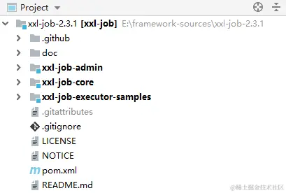
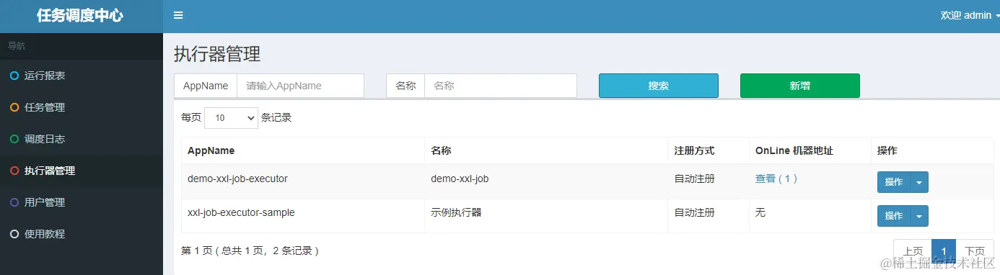
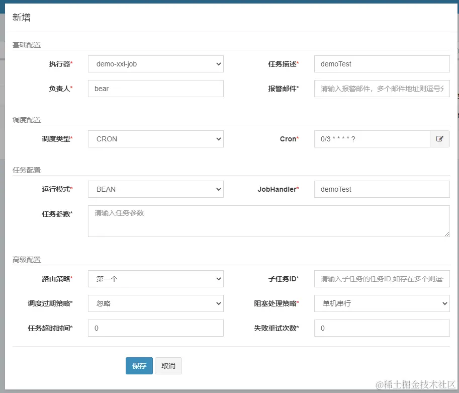
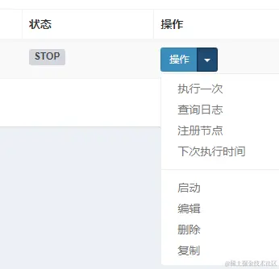
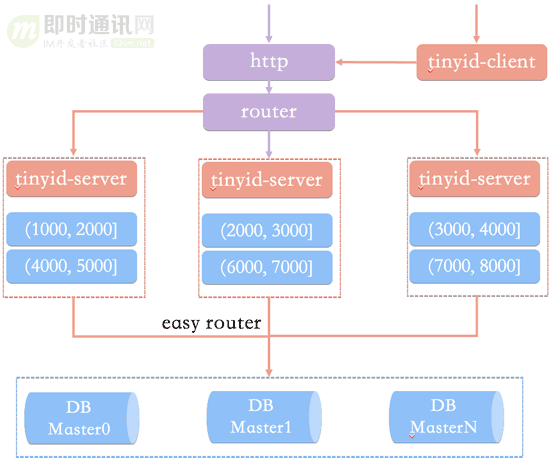

# SpringBoot  整合

[TOC]

## Https

有两种方式可以获取到 SSL 证书：

1. 自己通过 keytool 生成
2. 通过证书授权机构购买

```shell
keytool -genkey -alias SpringSecurity -dname "CN=GaoRuofan,OU=Personal,O=Personal,L=JINAN,ST=SHANDONG,C=CN" -storetype PKCS12 -keyalg RSA -keysize 2048 -keystore keystore.p12 -validity 365
```

- -genkey ：要求命令进行生成 key 的操作；
- -alias ：key 的别名；
- -dname：指定证书拥有者信息
  - CN：Common Name 名字与姓氏
  - OU：Organization Unit 组织单位名称
  - O：Organization 组织名称
  - L：Locality 城市或区域名称
  - ST：State 州或省份名称
  - C：Country 国家名称

- -storetype ：指定密钥库的类型。常用的有 JKS（默认）、JCEKS（推荐）、PKCS12、BKS、UBER。
- -keyalg ：指定要使用的算法
- -keysize ：指定密钥的长度
- -keystore ：指定证书文件的存储路径
- -validity ： 指定证书的有效期


Spring Boot 配置 SSL 很简单，只需要通过一系列的 `server.ssl.*` 参数即可完成配置

一个 SSL 单向验证的演示：

~~~properties
server.port=8443
server.ssl.protocol=TLS

# 证书的路径
server.ssl.key-store=classpath:javastack.keystore		

# 密钥库口令，在生成证书时设置的
server.ssl.key-store-password=javastack
server.ssl.key-store-type=PKCS12 
~~~


~~~java
server.ssl.ciphers= # Supported SSL ciphers.
server.ssl.client-auth= # Whether client authentication is wanted ("want") or needed ("need"). Requires a trust store.
server.ssl.enabled= # Enable SSL support.
server.ssl.enabled-protocols= # Enabled SSL protocols.
server.ssl.key-alias= # Alias that identifies the key in the key store.
server.ssl.key-password= # Password used to access the key in the key store.
server.ssl.key-store= # Path to the key store that holds the SSL certificate (typically a jks file).
server.ssl.key-store-password= # Password used to access the key store.
server.ssl.key-store-provider= # Provider for the key store.
server.ssl.key-store-type= # Type of the key store.
server.ssl.protocol=TLS # SSL protocol to use.
server.ssl.trust-store= # Trust store that holds SSL certificates.
server.ssl.trust-store-password= # Password used to access the trust store.
server.ssl.trust-store-provider= # Provider for the trust store.
server.ssl.trust-store-type= # Type of the trust store.
~~~

## log4j2

日志级别优先级从低到高：`ALL、DEBUG、 INFO、 WARN、 ERROR、FATAL、 OFF`

log4j2 的 Maven 依赖。注意在所有包含 `spring-boot-starter-*` 的依赖中排除 `spring-boot-starter-logging`

~~~xml
<dependency>
    <groupId>org.springframework.boot</groupId>
    <artifactId>spring-boot-starter-web</artifactId>
    <exclusions>
        <exclusion>
            <groupId>org.springframework.boot</groupId>
            <artifactId>spring-boot-starter-logging</artifactId>
        </exclusion>
    </exclusions>
</dependency>

<dependency>
    <groupId>org.springframework.boot</groupId>
    <artifactId>spring-boot-starter-log4j2</artifactId>
</dependency>

<dependency>
    <groupId>org.springframework.boot</groupId>
    <artifactId>spring-boot-starter</artifactId>
    <exclusions>
        <exclusion>
            <groupId>org.springframework.boot</groupId>
            <artifactId>spring-boot-starter-logging</artifactId>
        </exclusion>
    </exclusions>
</dependency>
~~~

 引入`log4j2`依赖后，需要在 `application.yaml` 中指定 log4j2 的配置文件路径 ：

~~~yaml
#日志配置 无特殊需求无需更改
logging:
  config:  classpath:log4j2.xml
  level:
  	# 当配置为某个等级时，表示这个等级及以上的日志信息都将被记录。
    root: INFO
    javax.activation: INFO
    org.apache.catalina: INFO
    org.apache.commons.beanutils.converters: INFO
    org.apache.coyote.http11.Http11Processor: INFO
    org.apache.http: INFO
    org.apache.tomcat: INFO
    org.springframework: INFO
    com.chinamobile.cmss.bdpaas.resource.monitor: DEBUG
~~~

xml 配置模板如下：

~~~xml
<?xml version="1.0" encoding="UTF-8"?>
<Configuration>
    <!--<Configuration status="WARN" monitorInterval="30"> -->
    <!--monitorterval：是用于指定 log4j 自动重新检测读取配置内容的间隔时间-->
    <properties>
        <!--定义一些变量-->
        <property name="LOG_HOME">./service-logs</property>
    </properties>
    
    
    <Appenders>
        
        <!--*********************控制台日志***********************-->
        <Console name="consoleAppender" target="SYSTEM_OUT">
            <!--设置日志格式及颜色-->
            <PatternLayout
                    pattern="%style{%d{HH:mm:ss}}{bright,green} %highlight{%-5level} [%style{%t}{bright,blue}] %style{%C}{bright,yellow}: %msg%n%style{%throwable}{red}"
                    disableAnsi="false" noConsoleNoAnsi="false"/>
        </Console>

        <!--*********************文件日志***********************-->
        <!-- all 级别日志 -->
        <!--%i 是一个递增的数字-->
        <!-- 触发滚动时，会按照 filePattern 来创建文件-->
        <RollingFile name="allFileAppender"
                     fileName="${LOG_HOME}/all.log"
                  
                     filePattern="${LOG_HOME}/$${date:yyyy-MM}/all-%d{yyyy-MM-dd}-%i.log">
            <!-- 设置日志格式 -->
            <PatternLayout>
                <pattern>%d %p %C{} [%t] %m%n</pattern>
            </PatternLayout>
            
            <Policies>
                <!-- 设置日志文件切分参数 -->
                <!--<OnStartupTriggeringPolicy/>-->
                
                <!--设置日志基础文件大小，超过该大小就触发日志文件滚动更新-->
                <SizeBasedTriggeringPolicy size="100 MB"/>
                
                <!--设置日志文件滚动更新的时间->
                <!--<TimeBasedTriggeringPolicy/>-->
            </Policies>
            <!--设置日志的文件个数上限，不设置默认为7个，超过大小后会被覆盖-->
            <DefaultRolloverStrategy max="100"/>
        </RollingFile>

        <!--debug级别日志-->
        <RollingFile name="debugFileAppender"
                     fileName="${LOG_HOME}/debug.log"
                     filePattern="${LOG_HOME}/$${date:yyyy-MM}/debug-%d{yyyy-MM-dd}-%i.log.gz">
            <Filters>
                <!--过滤掉info及更高级别日志-->
                <ThresholdFilter level="info" onMatch="DENY" onMismatch="NEUTRAL"/>
            </Filters>
           
            <PatternLayout>
                <pattern>%d %p %C{} [%t] %m%n</pattern>
            </PatternLayout>
            <Policies>
                <SizeBasedTriggeringPolicy size="100 MB"/>
            </Policies>
            <DefaultRolloverStrategy max="100"/>
        </RollingFile>

       
        <!-- json 格式 error 级别日志-->
        <RollingFile name="errorJsonAppender"
                     fileName="${LOG_HOME}/error-json.log"
                     filePattern="${LOG_HOME}/error-json-%d{yyyy-MM-dd}-%i.log.gz">
            <JSONLayout compact="true" eventEol="true" locationInfo="true"/>
            <Policies>
                <SizeBasedTriggeringPolicy size="100 MB"/>
                <TimeBasedTriggeringPolicy interval="1" modulate="true"/>
            </Policies>
        </RollingFile>
    </Appenders>

    <Loggers>
        <!-- 根日志设置 -->
        <!--<Root> 元素表示的是根日志器。在Log4j2中，所有的Logger都派生自Root Logger-->
        <!--这里 level=debug 意味着该应用程序会记录所有debug及以上级别的日志-->
        <Root level="debug">
            <!--可以同时应用多个 Appender -->
            <AppenderRef ref="consoleAppender" level="debug"/>
            <!--
            <AppenderRef ref="allFileAppender" level="all"/>
            <AppenderRef ref="debugFileAppender" level="debug"/>
            <AppenderRef ref="infoFileAppender" level="info"/>
            <AppenderRef ref="warnFileAppender" level="warn"/>
            <AppenderRef ref="errorFileAppender" level="error"/>
            <AppenderRef ref="errorJsonAppender" level="error"/>
			-->
        </Root>

        <!-- spring 日志-->
        <Logger name="org.springframework" level="debug"/>
                                                        
        <!--druid数据源日志-->
        <Logger name="druid.sql.Statement" level="warn"/>
                                                       
        <!-- mybatis日志 -->
        <Logger name="com.mybatis" level="warn"/>
        <Logger name="org.hibernate" level="warn"/>
        <Logger name="com.zaxxer.hikari" level="info"/>
        <Logger name="org.quartz" level="info"/>
        <Logger name="com.andya.demo" level="debug"/>
    </Loggers>
</Configuration>
~~~

关于 Pattern 的说明：

| 类型               | 转换字符                     | 输出                     |
| ------------------ | ---------------------------- | ------------------------ |
| 日期               | %-d{yyyy-MM-dd HH:mm:ss.SSS} | 2021-05-08 14:51:59 1048 |
| 线程名             | %t                           | main                     |
| 日志级别           | %-5level                     | INFO                     |
| 日志信息           | %msg                         |                          |
| 输出所在方法名     | %M                           | main                     |
| 输出所在行号       | %L                           | 33                       |
| 调用该 Logger 的类 | %C                           | cn.atsukoruo.demo        |
| 换行符             | %n                           |                          |
| 日志事件的发生位置 | %l                           |                          |


TimeBasedTriggeringPolicy 基于时间的触发策略：

- interval：指定滚动时间间隔，filePattern 日期格式精确到哪一位，interval 也精确到哪一个单位
- modulate：是否以 0 点为边界进行偏移计算。比如，modulate=true，interval=4 hours， 那么假设上次封存日志的时间为03:00，则下次封存日志的时间为 04:00， 之后的封存时间依次为 08:00，12:00，16:00


使用示例：

~~~java
@Slf4j
public class Demo {
    void foo() {
        log.trace(...);
        log.debug(...);
        log.info(...);
        log.warn(...);
        log.err(...);
    }
}
~~~


## 数据源

~~~yaml
spring:
  datasource:
    url: jdbc:mysql://localhost:3306/test?useUnicode=true&characterEncoding=utf8
    driverClassName: com.mysql.jdbc.Driver
    username: root
    password: 123456
~~~


## JUnit

JUnit 是一个 Java 单元测试框架。JUnit 5 由 3 个模块构成，分别是

- JUnit Platform ：基于 JVM 上启动测试框架的基础
- JUnit Jupiter ：JUnit 5 的核心，提供 JUnit 5 的新的编程模型，内部包含一个测试引擎，该测试引擎会基于 JUnit Platform 运行；
- JUnit Vintage ：兼容 JUnit 4 、JUnit 3 支持的测试引擎


|              | 意义                             |
| ------------ | -------------------------------- |
| @Test        | 标注一个测试方法                 |
| @BeforeEach  | 在每个测试方法前执行             |
| @AfterEach   | 在每个测试方法后执行             |
| @BeforeAll   | 在当前类中的所有测试方法之前执行 |
| @AfterAll    | 在当前类中的所有测试方法之后执行 |
| @Disabled    | 禁用测试方法/类                  |
| @Tag         | 标记和过滤                       |
| @TestFactory | 声明测试工厂进行动态测试         |
| @Nested      | 嵌套测试                         |
| @ExtendWith  | 注册自定义扩展                   |


Maven依赖

~~~xml
<dependency>
    <groupId>org.springframework.boot</groupId>
    <artifactId>spring-boot-starter-test</artifactId>
    <scope>test</scope>
</dependency>
~~~


在测试类上添加 @SpringBootTest 注解，SpringBoot 将自动加载整个应用程序上下文。

~~~java
@SpringBootTest
class SpringBootDemoApplicationTests {
    @Test
    void contextLoads() {
    }
}
~~~


断言的使用：

~~~java
// 数值断言
int num = 3 + 5;
Assertions.assertEquals(num, 8);

// Boolean 断言
int num = 3 + 5;
Assumptions.assumeTrue(num < 10);

// 浮点断言，可以指定浮动值
double result = 10.0 / 3;
Assertions.assertEquals(result, 3, 0.5);

// 可以自定义错误提示信息
Assertions.assertEquals(result, 3, 0.2, "计算数值偏差较大！");

// 断言两个对象是否是同一个
Object o1 = new Object();
Object o2 = o1;
Object o3 = new Object();
Assertions.assertSame(o1, o2);
Assertions.assertSame(o1, o3);

// 断言两个数组的元素是否完全相同
Assertions.assertArrayEquals(arr1, arr3);

// 断言是否抛出异常
Assertions.assertThrows(ArithmeticException.class, () -> {
    int i = 1 / 0;
});

// 断言是否超时
Assertions.assertTimeout(Duration.ofMillis(500), () -> {
    System.out.println("testTimeout run ......");
    TimeUnit.SECONDS.sleep(1);
    System.out.println("testTimeout finished ......");
});

// 断言强制失败
Assertions.fail();


~~~

组合条件断言，要求这些断言必须同时全部通过

~~~java

Assertions.assertAll(
    () -> {
        int num = 3 + 5;
        Assertions.assertEquals(num, 8);
    },
    () -> {
        String[] arr1 = {"aa", "bb"};
        String[] arr2 = {"bb", "aa"};
        Assertions.assertArrayEquals(arr1, arr2);
    }
);

~~~


参数化测试：

- 手动指明需要测试的值：
  ~~~java
  @ParameterizedTest
  @ValueSource(strings = {"aa", "bb", "cc"})
  // 声明了 3 个需要测试的值
  public void testSimpleParameterized(String value) throws Exception {
      System.out.println(value);
      Assertions.assertTrue(value.length() < 3);
  }
  ~~~

-  通过静态方法来提供测试数据

  ~~~java
  @ParameterizedTest
  @MethodSource("dataProvider")
  public void testDataStreamParameterized(Integer value) throws Exception {
      System.out.println(value);
      Assertions.assertTrue(value < 10);
  }
  
  private static Stream<Integer> dataProvider() {
      return Stream.of(1, 2, 3, 4, 5);
  }
  ~~~
  
- 通过 CSV 来提供测试数据

  ~~~Java
  @ParameterizedTest
  @CsvFileSource(resources = "/test.csv")
  void calcInsurance(int age,int score,int money) {
      assertEquals(money,insurance.calcInsurance(age,score));
  }
  ~~~

  


测试套件意味着捆绑几个单元测试用例并且一起执行他们。在 JUnit 中，`@RunWith`和`@Suite`注释用来运行套件测试。

~~~java
@RunWith(Suite.class)
@SuiteClasses({
        CountTest.class,
        TestFixture.class,
        AssertTest.class,
        TestRunSequence.class,
})
public class runAllTest {
 
}

class CountTest {
    @Test
    public void foo() {}
}
~~~


`timeout`参数和 `@Test` 注释一起使用可执行时间测试

~~~java
@Test(timeout=1000)
~~~

`expected` 参数和 `@Test` 注释一起使用，测试代码是否它抛出了想要得到的异常

~~~java
@Test(expected = ArithmeticException.class)
~~~


`@RepeatedTest` 指定所需的总重复次数


### MockMvc

通过 MockMvc，我们可以方便地构建各种 HTTP 请求：

~~~java
@SpringBootTest
class MenuControllerTest {
    private MockMvc mockMvc;

    @BeforeEach
    void setUp(WebApplicationContext wac) {
        this.mockMvc = MockMvcBuilders.webAppContextSetup(wac).alwaysExpect(status().isOk()).build();
    }

    @AfterEach
    void tearDown() {
        mockMvc = null;
    }
    // 省略其他部分
}
~~~

测试部分如下：

~~~java
@SpringBootTest
class MenuControllerTest {
    // 省略其他部分
    @Test
    void testGetAll() throws Exception {
        mockMvc.perform(get("/menu"))
            	// 设置查询参数
            	.param("name", "Java"))
             	// 判断响应头
            	.andExpect(content()
                           .contentType(MediaType.APPLICATION_JSON))
                // 判断处理方法
                .andExpect(handler().handlerType(MenuController.class))
                .andExpect(handler().methodName("getAll"))
                // 判断返回JSON内容
                .andExpect(jsonPath("$").isArray())
                .andExpect(jsonPath("$.length()").value(2))
                .andExpect(jsonPath("$..name")
                           .value(Matchers.hasItem("Java咖啡")));
    }
}
~~~

1. 首先通过 `MockMvcRequestBuilders.get()` 发起 `GET` 请求
2. `andExpect()` 用来设置期望的检查项，通过各种静态方法（`handler()`、`jsonPath()`等）获取请求体的信息。这些静态类包括
   - `MockMvcBuilders.*`
   - `MockMvcRequestBuilders.*`
   - `MockMvcResultMatchers.*`
   - `MockMvcResultHandlers.*`

**表 9-3　JsonPath 的常用操作符**

| 操作符                          | 说明                               |
| :------------------------------ | :--------------------------------- |
| `$`                             | JSON 的根元素                      |
| `@`                             | 正在处理的当前节点                 |
| `*`                             | 通配符                             |
| `..`                            | 深度扫描，可以扫描很多层以下的内容 |
| .< 名称 >                       | 特定名称的子节点                   |
| [ 数组下标 ]                    | 返回数组的特定位置的元素           |
| [ 起始数组下标 : 结束数组下标 ] | 从数组中切出一部分                 |


### MockwebServer

有时候，我们通过RestTemplate去调用业务部门的微服务。但是这些微服务的代码资产并不在本开发小组中，因此无法有效地展开单元测试。我们可以通过MockwebServer工具来解决这个问题。

使用`MockWebServer` 编写一个单元测试，大概分成下面几个步骤：

1. 引入 `com.squareup.okhttp3:mockwebserver` 依赖；

   ~~~xml
   <dependency>
       <groupId>com.squareup.okhttp3</groupId>
       <artifactId>mockwebserver</artifactId>
       <scope>test</scope>
   </dependency>
   ~~~

2. 在测试类中构造并启动 `MockWebServer`

   ~~~java
   class OrderRunnerTest {
       private static MockWebServer webServer;
   	private OrderRunner runner; 	// 被测试的对象
       
       @BeforeAll
       static void setUp() throws IOException {
           webServer = new MockWebServer();
           webServer.start();
       }
   
       @AfterAll
       static void tearDown() throws IOException {
           webServer.shutdown();
       }
       
       @BeforeEach
       void setUpBeforeEach() {
           runner = new OrderRunner();
           // 获取MockWebServer的接口
           runner.setBinarytea("http://localhost:" + webServer.getPort());
       }
       // 省略具体测试方法
   }
   ~~~

3. 构造模拟的响应；客户端发起 HTTP 调用，并验证应答以及请求。

   ~~~java
   class OrderRunnerTest {
       // 省略公共部分代码
       @Test
       void testCallForEntity() throws Exception {
           // 构造应答
           String body = "{\"id\":1, \"status\":\"ORDERED\"}";
           MockResponse response = new MockResponse().setResponseCode(HttpStatus.CREATED.value())
                   .addHeader(HttpHeaders.CONTENT_TYPE, MediaType.APPLICATION_JSON_VALUE).setBody(body);
           webServer.enqueue(response);
   
           // 发送请求
           ResponseEntity<String> entity = runner.callForEntity();
           
           // 验证响应
           assertEquals(HttpStatus.CREATED, entity.getStatusCode());
           assertEquals(MediaType.APPLICATION_JSON_VALUE,entity.getHeaders().getFirst(HttpHeaders.CONTENT_TYPE));
           assertEquals(body, entity.getBody());
   
           // 验证请求
           RecordedRequest request = webServer.takeRequest();
           assertEquals("/order", request.getPath());
   
           NewOrderForm form = objectMapper.readValue(request.getBody().readUtf8(),NewOrderForm.class);
           assertLinesMatch(Arrays.asList("1"), form.getItemIdList());
           assertEquals(90, form.getDiscount());
       }
   }
   ~~~


## Mybatis

~~~xml
<dependency>
    <groupId>org.mybatis.spring.boot</groupId>
    <artifactId>mybatis-spring-boot-starter</artifactId>
    <version>2.2.0</version>
</dependency>
<dependency>
    <groupId>com.mysql</groupId>
    <artifactId>mysql-connector-j</artifactId>
    <scope>runtime</scope>
</dependency>
~~~

~~~yaml
spring:
  datasource:
    driver-class-name: com.mysql.cj.jdbc.Driver
    username: root
    password: Huicheng123**
    url: jdbc:mysql://localhost:3306/codingmore-mybatis?useUnicode=true&characterEncoding=utf-8&serverTimezone=Asia/Shanghai&useSSL=false
~~~

配置文件：

~~~properties
# 是否执行MyBatis xml配置文件的状态检查, 只是检查状态,默认false
mybatis.check-config-location=true

# mybatis-config.xml文件的位置
mybatis.config-location=classpath:mybatis/mybatis-config.xml

# Mapper对应的xml路径
mybatis.mapper-locations=classpath:mybatis/mapper/*.xml

# 设置别名的路径,可避免写全限定类名
mybatis.type-aliases-package=com.manu.mybatisxml.model
~~~


在 Spring Boot中，如何实现一个 Mapper：

- 为 Mapper 打上注解 @Mapper

  ~~~java
  @Mapper
  @Repository
  public interface UserMapper {
      void save(User user);
      
      List<User> findAll();
  }
  ~~~

- `mappe.xml` 文件的路径，包括文件名，必须同数据层的接口完全一致

  `mapper.xml` 文件可以和接口放在同一个目录下，也可以放在 `resource/${包名}` 目录下
  
- 在启动类上添加 @MapperScan 注解，并指定包路径

  ~~~java
  @SpringBootApplication
  @MapperScan("edu.qdu.gpumonitor.Mapper")
  public class GpuMonitorApplication {
      public static void main(String[] args) {
          SpringApplication.run(GpuMonitorApplication.class, args);
      }
  }
  ~~~

  注意：注解方式与 xml 配置文件可以搭配使用，一起实现一个 Mapper 接口。


直接通过依赖注入来获取：

~~~java
@Service
public class UserService {
    @Autowired
    private UserMapper userMapper;
    
    public void test() {
        User user = new User();
        user.setName("test mybatis");
        user.setTel("1234567");
        userMapper.save(user);
        
        List<User> userList = userMapper.findAll();
        userList.forEach(System.out::println);
    }
}
~~~

## Druid 

Druid 为监控而生的数据池

~~~xml
<!-- 阿里巴巴的druid数据源 -->
<!-- https://mvnrepository.com/artifact/com.alibaba/druid-spring-boot-3-starter -->
<dependency>
    <groupId>com.alibaba</groupId>
    <artifactId>druid-spring-boot-3-starter</artifactId>
    <version>1.2.23</version>
</dependency>


<dependency>
    <groupId>org.mybatis.spring.boot</groupId>
    <artifactId>mybatis-spring-boot-starter</artifactId>
    <version>2.1.3</version>
    <exclusions>
        <!-- 排除默认的 HikariCP 数据源 -->
        <exclusion>
            <groupId>com.zaxxer</groupId>
            <artifactId>HikariCP</artifactId>
        </exclusion>
    </exclusions>
</dependency>
~~~

~~~yaml
spring:
  datasource:
    type: com.alibaba.druid.pool.DruidDataSource
    driver-class-name: com.mysql.cj.jdbc.Driver
    url: jdbc:mysql://192.168.10.106:3306/xj_doc?characterEncoding=utf8&serverTimezone=Asia/Shanghai
    username: root
    password: 123456
    # druid 连接池管理
    druid:
      # 初始化时建立物理连接的个数
      initial-size: 5
      # 连接池的最小空闲数量
      min-idle: 5
      # 连接池最大连接数量
      max-active: 20
      # 获取连接时最大等待时间，单位毫秒
      max-wait: 60000
      # 申请连接的时候检测，如果空闲时间大于timeBetweenEvictionRunsMillis，执行validationQuery检测连接是否有效。
      test-while-idle: true
      # 既作为检测的间隔时间又作为testWhileIdel执行的依据
      time-between-eviction-runs-millis: 60000
      # 销毁线程时检测当前连接的最后活动时间和当前时间差大于该值时，关闭当前连接(配置连接在池中的最小生存时间)
      min-evictable-idle-time-millis: 30000
      # 用来检测数据库连接是否有效的sql 必须是一个查询语句(oracle中为 select 1 from dual)
      validation-query: select 'x'
      # 申请连接时会执行validationQuery检测连接是否有效,开启会降低性能,默认为true
      test-on-borrow: false
      # 归还连接时会执行validationQuery检测连接是否有效,开启会降低性能,默认为true
      test-on-return: false
      # 是否缓存preparedStatement, 也就是PSCache,PSCache对支持游标的数据库性能提升巨大，比如说oracle,在mysql下建议关闭。
      pool-prepared-statements: false
      # 置监控统计拦截的filters，去掉后监控界面sql无法统计，stat: 监控统计、Slf4j:日志记录、waLL: 防御sqL注入
      filters: stat,wall,slf4j
      # 要启用PSCache，必须配置大于0，当大于0时，poolPreparedStatements自动触发修改为true。在Druid中，不会存在Oracle下PSCache占用内存过多的问题，可以把这个数值配置大一些，比如说100
      max-pool-prepared-statement-per-connection-size: -1
      # 合并多个DruidDataSource的监控数据
      use-global-data-source-stat: true
      # 通过connectProperties属性来打开mergeSql功能；慢SQL记录
      connect-properties: druid.stat.mergeSql=true;druid.stat.slowSqlMillis=5000

      web-stat-filter:
        # 添加过滤规则
        url-pattern: /*
        # 忽略过滤的格式
        exclusions: /druid/*,*.js,*.gif,*.jpg,*.png,*.css,*.ico

      stat-view-servlet:
        # 访问路径为/druid时，跳转到StatViewServlet
        url-pattern: /druid/*
        # 是否能够重置数据
        reset-enable: false
        # 需要账号密码才能访问控制台，默认为root
        login-username: druid
        login-password: druid
        # IP白名单
        allow: 127.0.0.1
        # IP黑名单（共同存在时，deny优先于allow）
        deny:
~~~

控制台的访问地址通常是：http://localhost:30001/druid/login.html。


与 Dynamic-Source 集成

~~~yaml
spring:
  datasource:
    type: com.alibaba.druid.pool.DruidDataSource
    dynamic:
      primary: mysql
      strict: false
      datasource:
        mysql:
          driver-class-name: com.mysql.cj.jdbc.Driver
          url: jdbc:mysql://122.9.7.252:3306/cloud_music_test?useUnicode=true&characterEncoding=utf-8&serverTimezone=Asia/Shanghai&useSSL=false
          username: root
          password: grf.2001
      druid:
      	# 这里不能配置 filter 了，只能 @Configuration
~~~


~~~java
@Configuration
public class DruidConfiguration {

    @Bean
    public ServletRegistrationBean druidStatViewServle() {
        //注册服务
        ServletRegistrationBean servletRegistrationBean = new ServletRegistrationBean(
                new StatViewServlet(), "/druid/*");
        // 白名单(为空表示,所有的都可以访问,多个IP的时候用逗号隔开)
        servletRegistrationBean.addInitParameter("allow", "127.0.0.1");
        // IP黑名单 (存在共同时，deny优先于allow) （黑白名单就是如果是黑名单，那么该ip无法登陆该可视化界面）
        servletRegistrationBean.addInitParameter("deny", "127.0.0.2");
        // 设置登录的用户名和密码
        servletRegistrationBean.addInitParameter("loginUsername", "root");
        servletRegistrationBean.addInitParameter("loginPassword", "123456");
        // 是否能够重置数据.
        servletRegistrationBean.addInitParameter("resetEnable", "false");
        return servletRegistrationBean;
    }

    @Bean
    public FilterRegistrationBean druidStatFilter() {
        FilterRegistrationBean filterRegistrationBean = new FilterRegistrationBean(
                new WebStatFilter());
        // 添加过滤规则
        filterRegistrationBean.addUrlPatterns("/*");
        // 添加不需要忽略的格式信息
        filterRegistrationBean.addInitParameter("exclusions", "*.js,*.gif,*.jpg,*.png,*.css,*.ico,/druid/*");
        System.out.println("druid初始化成功!");
        return filterRegistrationBean;

    }
}
~~~


## Redis

Redis 客户端有 luttuce、jedis、redisson。性能较好的是 luttuce 与 redisson，因为它们都使用了 Netty。其中 luttuce 简单易用，而 redisson 功能强大。这里就介绍 redisson 了。

**注意，如果 Redis 服务端以集群模式启动，那么必须配置多节点，而不是单节点模式。**

- Redisson 客户端需要通过发送集群节点发现请求，来获取 Redis 集群中所有节点的信息，并将其保存在本地的拓扑维护表中。
- Redisson 客户端将操作路由到正确的节点上，以便访问正确的数据。
- Redisson 客户端需要能够将多个命令组合成一个批量操作，以便将其发送到多个节点上执行，从而减少网络延迟和操作次数。
- Redisson 还提供了事务支持和 Lua 脚本执行功能，可以在多个节点之间执行事务和脚本。

~~~xml
<!-- https://mvnrepository.com/artifact/org.redisson/redisson-spring-boot-starter -->
<dependency>
    <groupId>org.redisson</groupId>
    <artifactId>redisson-spring-boot-starter</artifactId>
    <version>3.33.0</version>
</dependency>
~~~

~~~yaml
spring:
  redis:
     redisson: 
        file: classpath:redisson.yaml
~~~

~~~yaml
# 单节点配置
singleServerConfig:
  # 连接空闲超时，单位：毫秒
  idleConnectionTimeout: 10000
  # 连接超时，单位：毫秒
  connectTimeout: 10000
  # 命令等待超时，单位：毫秒
  timeout: 3000
  # 命令失败重试次数,如果尝试达到 retryAttempts（命令失败重试次数） 仍然不能将命令发送至某个指定的节点时，将抛出错误。
  # 如果尝试在此限制之内发送成功，则开始启用 timeout（命令等待超时） 计时。
  retryAttempts: 3
  # 命令重试发送时间间隔，单位：毫秒
  retryInterval: 1500
  # 密码
  password:
  # 单个连接最大订阅数量
  subscriptionsPerConnection: 5
  # 客户端名称
  clientName: myredis
  # 节点地址
  address: redis://127.0.0.1:6379
  # 发布和订阅连接的最小空闲连接数
  subscriptionConnectionMinimumIdleSize: 1
  # 发布和订阅连接池大小
  subscriptionConnectionPoolSize: 50
  # 最小空闲连接数
  connectionMinimumIdleSize: 32
  # 连接池大小
  connectionPoolSize: 64
  # 数据库编号
  database: 0
  # DNS监测时间间隔，单位：毫秒
  dnsMonitoringInterval: 5000
# 线程池数量,默认值: 当前处理核数量 * 2
#threads: 0
# Netty线程池数量,默认值: 当前处理核数量 * 2
#nettyThreads: 0
# 编码
codec: !<org.redisson.codec.JsonJacksonCodec> {}
# 传输模式
transportMode : "NIO"
# 线程池数量
threads: 8
# Netty线程池数量
nettyThreads: 16
~~~

~~~yaml
# 集群模式
clusterServersConfig:
  # 集群节点地址
  # 一定不要在前面全写主节点的地址，否则有个奇怪的BUG。
  nodeAddresses:
    - "redis://127.0.0.1:18001"
    - "redis://127.0.0.1:18002"
    - "redis://127.0.0.1:18003"
    - "redis://127.0.0.1:18004"
    - "redis://127.0.0.1:18005"
    - "redis://127.0.0.1:18006"
  # 密码
  password: redis@pass
  # 客户端名称 
  clientName: redisClient
  # master 最小空闲连接数
  masterConnectionMinimumIdleSize: 16
  # master 连接池大小
  masterConnectionPoolSize: 32
  # slave最小空闲连接数
  slaveConnectionMinimumIdleSize: 16
  # slave连接池大小
  slaveConnectionPoolSize: 64
  # 连接空闲超时，单位：毫秒
  idleConnectionTimeout: 10000
  # 命令等待超时，单位：毫秒
  timeout: 3000
  # 发布和订阅连接池大小
  subscriptionConnectionPoolSize: 50
  # 读取模式
  readMode: "SLAVE"
  # 订阅模式
  subscriptionMode: "MASTER"
~~~

~~~java
@Autowired
private RedissonClient redissonClient;
~~~


手动装配：

~~~xml
<!-- Redisson -->
<!-- https://mvnrepository.com/artifact/org.redisson/redisson-spring-boot-starter -->
<dependency>
    <groupId>org.redisson</groupId>
    <artifactId>redisson</artifactId>
    <version>3.35.0</version>
</dependency>
~~~

~~~java
@Bean
public RedissonClient redissonClient() {
    Config config = new Config();
    ClusterServersConfig clusterServersConfig = config.useClusterServers()
        .addNodeAddress(
        "redis://114.116.218.95:6379",
        "redis://116.63.9.166:6379",
        "redis://114.116.204.34:6379",
        "redis://114.116.220.197:6379",
        "redis://122.9.36.231:6379",
        "redis://122.9.7.252:6379")
        .setSlaveConnectionMinimumIdleSize(1)
        .setMasterConnectionMinimumIdleSize(1)
        .setMasterConnectionPoolSize(8)
        .setSlaveConnectionPoolSize(8);
    clusterServersConfig.setPassword("grf.2001");//设置密码
    return Redisson.create(config);
}
~~~


操作字符串：

~~~java
RedissonClient redisson = ...;
RBucket<String> bucket = redisson.getBucket("name");

bucket.set("Redisson");
String value = bucket.get();
~~~

操作队列：

~~~java
RQueue<String> queue = redisson.getQueue("myQueue");

queue.add("一条消息"); // 往队列添加元素
String item = queue.poll(); // 从队列获取并移除一个元素
~~~

操作 Map

~~~java
RMap<String, String> map = redisson.getMap("myMap");

map.put("key1", "值1");
String value = map.get("key1");
~~~

订阅主题：

~~~java
// 订阅主题
RTopic topic = redisson.getTopic("myTopic");
topic.addListener(String.class, new MessageListener<String>() {
    @Override
    public void onMessage(CharSequence channel, String msg) {
        System.out.println("收到消息：" + msg);
    }
});

// 发布消息
topic.publish("Hello Redisson!");
~~~

事务：

~~~java
RTransaction transaction = redisson.createTransaction(TransactionOptions.defaults());
RMap<String, String> map = transaction.getMap("myMap");
map.put("1", "2");
String value = map.get("3");
RSet<String> set = transaction.getSet("mySet")
set.add(value);
try {
   transaction.commit();
} catch(TransactionException e) {
   transaction.rollback();
}
~~~

有序集合：

~~~java
RZSet<String> zset = redisson.getScoredSortedSet("my-zset");
// 添加元素到 ZSet 集合
zset.add("item1", 1.0);
zset.add("item2", 2.0);
zset.add("item3", 3.0);

// 获取元素的分数
Double score = zset.getScore("item2");
System.out.println(score); // 输出：2.0

// 获取指定范围的元素
Collection<String> items = zset.range(0, 2);
System.out.println(items); // 输出：[item1, item2]

// 获取指定分数范围的元素
Collection<String> itemsByScore = zset.rangeByScore(1.0, 2.0);
System.out.println(itemsByScore); // 输出：[item1, item2]

// 使用 zset.first() 方法获取排名最高的元素。
// 使用 zset.delete() 方法删除所有元素。
~~~

## Kafka

Maven 依赖

~~~xml
<!--Kafka配置-->
<dependency>
    <groupId>org.springframework.kafka</groupId>
    <artifactId>spring-kafka</artifactId>
    <version>3.0.11</version>
</dependency>
<dependency>
    <groupId>org.slf4j</groupId>
    <artifactId>slf4j-api</artifactId>
    <version>2.0.9</version>
</dependency>
~~~

生产消息：

~~~java
@Configuration
public class KafkaProducerConfig {

   
    // KakfaTemplate 实例是线程安全的
    // 创建 kafka 操作模板对象, 用于简化消息发送操作
    // 第一个泛型参数指定 Key 的类型，而第二个指定 Value 的类型
    @Bean
    public KafkaTemplate<String, String> kafkaTemplate(ProducerFactory<String, String> producerFactory) {
        return new KafkaTemplate<String, String>(producerFactory);
    }

    // 创建 kafka 生产者工厂
    @Bean
    public ProducerFactory<String, String> producerFactory() {
        Map<String, Object> properties = buildProducerProperties();
        return new DefaultKafkaProducerFactory<>(properties);
    }

    /**
     * 构建生产者配置
     */
    private static Map<String, Object> buildProducerProperties() {
        Map<String, Object> properties = new HashMap<>();
        properties.put(ProducerConfig.BOOTSTRAP_SERVERS_CONFIG, "122.9.7.252:9092");
        properties.put(ProducerConfig.ACKS_CONFIG, "all");
        properties.put(ProducerConfig.RETRIES_CONFIG, 3);
        properties.put(ProducerConfig.BATCH_SIZE_CONFIG, 16384);
        properties.put(ProducerConfig.LINGER_MS_CONFIG, 1);
        properties.put(ProducerConfig.BUFFER_MEMORY_CONFIG, 33554432);
        properties.put(ProducerConfig.KEY_SERIALIZER_CLASS_CONFIG, StringSerializer.class.getName());
        properties.put(ProducerConfig.VALUE_SERIALIZER_CLASS_CONFIG, StringSerializer.class.getName());
        return properties;
    }
}

@Component
public class KafkaProducerDemo {
    public void send(String topic, Object msg) throws InterruptedException {
        ProducerRecord<String, String> pr = new ProducerRecord<>(topic, objectMapper.writeValueAsString(msg));
        pr.headers().add("type", msg.getClass().getName().getBytes(StandardCharsets.UTF_8));
        kafkaTemplate.send(pr);
    }
}
~~~


消费消息：

~~~java
@Configuration
public class KafkaConsumerConfig {

    /**
     * 创建 消费者对象
     */
    @Bean
    public Consumer<String, String> consumer(ConsumerFactory<String, String> consumerFactory) {
        return consumerFactory.createConsumer();
    }

    @Bean
    public ConsumerFactory<String,String> consumerFactory() {
        return new DefaultKafkaConsumerFactory<>(buildConsumerProperties());
    }

    /**
     * 构建消费者配置
     */
    public static Map<String, Object> buildConsumerProperties() {
        Map<String, Object> properties = new HashMap<>();
        properties.put(ConsumerConfig.BOOTSTRAP_SERVERS_CONFIG, "114.116.204.34:9092");
        properties.put(ConsumerConfig.GROUP_ID_CONFIG, "test");
        properties.put(ConsumerConfig.ENABLE_AUTO_COMMIT_CONFIG, false);
        properties.put(ConsumerConfig.SESSION_TIMEOUT_MS_CONFIG, "60000");
        properties.put(ConsumerConfig.KEY_DESERIALIZER_CLASS_CONFIG, StringDeserializer.class.getName());
        properties.put(ConsumerConfig.VALUE_DESERIALIZER_CLASS_CONFIG, StringDeserializer.class.getName());
        return properties;
    }
}

@Component
public class KafkaConsumerDemo {
    @Autowired
    private Consumer<String, Object> consumer;

    @PostConstruct
    public void consumerTest() {
        consumer.subscribe(Arrays.asList("test"));
        ConsumerRecords<String, Object> records = consumer.poll(100);
        for (ConsumerRecord<String, Object> record : records) {
            System.out.println("消费消息： " + record.value());
        }
    }
}
~~~


## ElasticSearch

maven依赖：

~~~xml
<dependency>
    <groupId>co.elastic.clients</groupId>
    <artifactId>elasticsearch-java</artifactId>
    <version>7.16.2</version>
</dependency>

<dependency>
    <groupId>com.fasterxml.jackson.core</groupId>
    <artifactId>jackson-databind</artifactId>
    <version>2.12.3</version>
</dependency>
~~~

如果是 Spring Boot 项目，就不用添加第二个依赖了，因为 Spring Boot 的 Web 中默认已经加了这个依赖了，但是 Spring Boot 一般需要额外添加下面这个依赖

~~~xml
<!-- Needed only if you use the spring-boot Maven plugin -->
<dependency>
    <groupId>jakarta.json</groupId>
    <artifactId>jakarta.json-api</artifactId>
    <version>2.0.1</version>
</dependency>
~~~


~~~java
public class EsConfig {
 
    @Value(value = "${elasticsearch.clusterNodes}")
    private String clusterNodes; // es 集群节点 例：//192.168.1.96:9200,192.168.1.97:9200,192.168.1.98:9200
 
    @Value(value = "${elasticsearch.account}")
    private String account; //账号 例：elastic
 
    @Value(value = "${elasticsearch.passWord}")
    private String passWord; //密码 例：123456
 
    public static ElasticsearchClient client;
 
    //http集群
    public void esClient(){
        HttpHost[] httpHosts = Arrays.stream(clusterNodes.split(",")).map(x -> {
                      String[] hostInfo = x.split(":");
                       return new HttpHost(hostInfo[0], Integer.parseInt(hostInfo[1]));
                   }).toArray(HttpHost[]::new);
 
        final CredentialsProvider credentialsProvider = new BasicCredentialsProvider();
        credentialsProvider.setCredentials(
                AuthScope.ANY, new UsernamePasswordCredentials(account, passWord));//设置账号密码
 
        RestClientBuilder builder = RestClient.builder(httpHosts)
                .setHttpClientConfigCallback(httpClientBuilder -> httpClientBuilder.setDefaultCredentialsProvider(credentialsProvider));
 
        // Create the low-level client
        RestClient restClient = builder.build();
        
        // Create the transport with a Jackson mapper
        ElasticsearchTransport transport = new RestClientTransport(
                restClient, new JacksonJsonpMapper());
        
        // 同步客户端
        client = new ElasticsearchClient(transport);
 		
        // 异步客户端
        client = new ElasticsearchAsyncClient(transport);
    }
}
~~~


创建索引：

~~~java
ElasticsearchClient client = new ElasticsearchClient(transport);

CreateIndexResponse createIndexResponse = client
    .indices()
    .create(i -> i
            .index("blog")
            .settings(s -> s
                      .numberOfShards("2")
                      .numberOfReplicas("3")
                     )
            .mappings(m -> m
                      .properties("title", t -> t.text(tt -> tt.analyzer("ik_max_word")))
                      .properties("publish", p -> p.keyword(pp -> pp.index(true)))
                      .properties("date",d->d.date(dd->dd.format("yyyy-MM-dd")))
                     )
            .aliases("my_blog", aa -> aa.isWriteIndex(false))
           );
~~~

等同于：

```json
PUT blog
{
  "settings": {
    "number_of_shards": 2,
    "number_of_replicas": 3
  },
  "mappings": {
    "properties": {
      "title":{
        "type": "text",
        "analyzer": "ik_max_word"
      },
      "publish":{
        "type": "keyword"
      },
      "date":{
        "type": "date",
        "format": "yyyy-MM-dd"
      }
    }
  },
  "aliases": {
    "my_blog": {
      "is_write_index": false
    }
  }
}
```


直接使用 JSON 来构建：

~~~java
//直接使用json
StringReader input = new StringReader(
    "{\n" +
    "  \"settings\": {\n" +
    "    \"number_of_shards\": 2,\n" +
    "    \"number_of_replicas\": 3\n" +
    "  },\n" +
    "  \"mappings\": {\n" +
    "    \"properties\": {\n" +
    "      \"title\":{\n" +
    "        \"type\": \"text\",\n" +
    "        \"analyzer\": \"ik_max_word\"\n" +
    "      },\n" +
    "      \"publish\":{\n" +
    "        \"type\": \"keyword\"\n" +
    "      },\n" +
    "      \"date\":{\n" +
    "        \"type\": \"date\",\n" +
    "        \"format\": \"yyyy-MM-dd\"\n" +
    "      }\n" +
    "    }\n" +
    "  },\n" +
    "  \"aliases\": {\n" +
    "    \"my_blog\": {\n" +
    "      \"is_write_index\": false\n" +
    "    }\n" +
    "  }\n" +
    "}");

CreateIndexResponse createIndexResponse = client.indices().create(i-> i.index("blog").withJson(input));
~~~


添加文档：

~~~java
Book blog = new Book("三国演义", "罗贯中", "2022-01-11");
IndexResponse response = client.index(i -> i.index("books").document(blog).id("1"));

response.result();
response.id();
response.seqNo();
response.index();
response.shards();
~~~


删除文档：

~~~java
client.delete(i -> i.index("books").id("1")).whenComplete((success,failure)->{
    System.out.println(success.index());
    System.out.println(success.version());
});
~~~


查询文档：

~~~java
//构造查询条件
SearchRequest searchRequest = SearchRequest.of(
    s -> s.index("books")
    .query(q -> q.match(m -> m.field("title").query("三国演义")))
    .query(q -> q.term(t -> t.field("author").value("罗")))
);

//处理响应结果
SearchResponse<Book> response = client.search(searchRequest, Book.class);

//最大分数
System.out.println(response.maxScore());

//分片数
System.out.println(response.shards());

//是否超时
System.out.println(response.timedOut());


//拿到匹配的数据
HitsMetadata<Book> hitsMetadata = response.hits();
//得到总数
System.out.println(hitsMetadata.total());
//拿到hits命中的数据
List<Hit<Book>> hits = hitsMetadata.hits();
for (Hit<Book> hit : hits) {
    //拿到_source中的数据
    System.out.println(hit.source());
    System.out.println(hit.index());
    System.out.println(hit.id());
    System.out.println(hit.score());
}
、
~~~


## Caffine

常见的缓存淘汰算法有：

1. FIFO：先进先出
2. LRU：最近最少使用算法，每次访问数据都会将其放在我们的队尾，如果需要淘汰数据，就只需要淘汰队首即可。LRU 通过历史数据来预测未来是局限的，它会认为最后到来的数据是最可能被再次访问的，从而给与它最高的优先级。
3. LFU：最近最少频率使用，利用额外的空间记录每个数据的使用频率。只要数据访问模式的概率分布随时间保持不变时，其命中率就能变得非常高。如果数据的访问模式遵循先热后冷，那么 LFU 算法表现并不好。

一种现代缓存 W-TinyLFU 综合了 LRU、LFU 两者的长处。而 Caffine 正是采用了这种算法，它的 Maven 依赖如下：

~~~xml
<dependency>
    <groupId>com.github.ben-manes.caffeine</groupId>
    <artifactId>caffeine</artifactId>
    <version>2.6.2</version>
</dependency>
~~~

Caffeine Cache 提供了三种缓存填充策略：手动、同步加载和异步加载。

~~~java
public Object manulOperator(String key) {
    Cache<String, Object> cache = Caffeine.newBuilder()
        .expireAfterWrite(1, TimeUnit.SECONDS)
        .expireAfterAccess(1, TimeUnit.SECONDS)
        .maximumSize(10)
        .build();
    // 如果一个 key 不存在，那么会使用指定的函数来生成 value
    Object value = cache.get(key, t -> setValue(key).apply(key));
    cache.put("hello",value);

    // 判断是否存在，如果不存在返回 null
    Object ifPresent = cache.getIfPresent(key);
    // 移除一个 key
    cache.invalidate(key);
    return value;
}

public Function<String, Object> setValue(String key){
    return t -> key + "value";
}
~~~

~~~java
public Object syncOperator(String key) {
    // 在构造时，传入一个 CacheLoader 实现类，来在 key 不存在的情况下生成 value
    LoadingCache<String, Object> cache = Caffeine.newBuilder()
        .maximumSize(100)
        .expireAfterWrite(1, TimeUnit.MINUTES)
        .build(k -> setValue(key).apply(key));
    return cache.get(key);
}

public Function<String, Object> setValue(String key){
    return t -> key + "value";
}
~~~

~~~java
public Object asyncOperator(String key){
    // 异步加载
    AsyncLoadingCache<String, Object> cache = Caffeine.newBuilder()
        .maximumSize(100)
        .expireAfterWrite(1, TimeUnit.MINUTES)
        .buildAsync(k -> setAsyncValue(key).get());

    return cache.get(key);
}

public CompletableFuture<Object> setAsyncValue(String key){
    return CompletableFuture.supplyAsync(() -> {
        return key + "value";
    });
}
~~~

Caffeine 提供了 4 种回收策略：

- 基于个数回收

  ~~~java
  // 根据缓存的计数进行驱逐
  LoadingCache<String, Object> cache = Caffeine.newBuilder()
      .maximumSize(10000)
      .build(key -> function(key));
  ~~~

- 基于权重回收

  ~~~java
  // 根据缓存的权重来进行驱逐，必须得提供一个函数来设定每个条目的权重值是多少
  // 要么限制缓存条目的数量，要么限制缓存条目的权重值
  LoadingCache<String, Object> cache1 = Caffeine.newBuilder()
      .maximumWeight(10000)
      .weigher(key -> function1(key))
      .build(key -> function(key));
  ~~~

- 基于时间回收

  ~~~java
  // 基于固定的到期策略进行驱逐
  // expireAfterAccess(long, TimeUnit): 在最后一次访问或者写入后开始计时，在指定的时间后过期。每次访问或写入都会重新开始计时
  // expireAfterWrite(long, TimeUnit): 在最后一次写入缓存后开始计时，在指定的时间后过期。
  LoadingCache<String, Object> cache = Caffeine.newBuilder()
      .expireAfterAccess(5, TimeUnit.MINUTES)
      .build(key -> function(key));
  LoadingCache<String, Object> cache1 = Caffeine.newBuilder()
      .expireAfterWrite(10, TimeUnit.MINUTES)
      .build(key -> function(key));
  
  // 基于不同的到期策略进行驱逐
  LoadingCache<String, Object> cache2 = Caffeine.newBuilder()
      .expireAfter(new Expiry<String, Object>() {
          @Override
          public long expireAfterCreate(String key, Object value, long currentTime) {
              return TimeUnit.SECONDS.toNanos(seconds);
          }
  
          @Override
          public long expireAfterUpdate(@Nonnull String s, @Nonnull Object o, long l, long l1) {
              return 0;
          }
  
          @Override
          public long expireAfterRead(@Nonnull String s, @Nonnull Object o, long l, long l1) {
              return 0;
          }
      }).build(key -> function(key));
  ~~~

- 基于引用回收：

  ~~~java
  // 当 key 和 value 都没有引用时驱逐
  LoadingCache<String, Object> cache = Caffeine.newBuilder()
      .weakKeys()
      .weakValues()
      .build(key -> function(key));
  
  // 当垃圾收集器需要释放内存时驱逐
  LoadingCache<String, Object> cache1 = Caffeine.newBuilder()
      .softValues()
      .build(key -> function(key));
  ~~~

  注意：AsyncLoadingCache 不支持弱引用和软引用。


设置驱逐事件的回调函数：

~~~java
Cache<String, Object> cache = Caffeine.newBuilder()
    .removalListener((String key, Object value, RemovalCause cause) ->
                     System.out.printf("Key %s was removed (%s)%n", key, cause)).build();
~~~


CacheWriter 方法可以将缓存中所有的数据写入到第三方：

~~~java
LoadingCache<String, Object> cache2 = Caffeine.newBuilder()
    .writer(new CacheWriter<String, Object>() {
        @Override public void write(String key, Object value) {
            // 写入到外部存储
        }
        @Override public void delete(String key, Object value, RemovalCause cause) {
            // 删除外部存储
        }
    })
    .build(key -> function(key));
~~~


在 SpringBoot  中集成  Cache-Caffine Cache，首先引入依赖：

~~~xml
<dependency>
    <groupId>org.springframework.boot</groupId>
    <artifactId>spring-boot-starter-cache</artifactId>
</dependency>
<dependency>
    <groupId>com.github.ben-manes.caffeine</groupId>
    <artifactId>caffeine</artifactId>
    <version>2.6.2</version>
</dependency>
~~~

添加 @EnableCaching 注解：

~~~java
@SpringBootApplication
@EnableCaching
public class SingleDatabaseApplication {
    public static void main(String[] args) {
        SpringApplication.run(SingleDatabaseApplication.class, args);
    }
}
~~~

~~~java
@Configuration
public class CacheConfig {
    /**
     * 创建基于Caffeine的Cache Manager
     */
    @Bean
    @Primary
    public CacheManager caffeineCacheManager() {
        SimpleCacheManager cacheManager = new SimpleCacheManager();
        ArrayList<CaffeineCache> caches = Lists.newArrayList();
        List<CacheBean> list = setCacheBean();
        for(CacheBean cacheBean : list){
            caches.add(new CaffeineCache(cacheBean.getKey(), Caffeine
                                         .newBuilder()
                                         .recordStats()
                                         .expireAfterWrite(cacheBean.getTtl(), TimeUnit.SECONDS)
                                         .maximumSize(cacheBean.getMaximumSize())
                                         .build()));
        }
        cacheManager.setCaches(caches);
        return cacheManager;
    }


    // 这里的 CacheBean 为各个 LoadingCache 的配置参数
    private List<CacheBean> setCacheBean(){
        List<CacheBean> list = Lists.newArrayList();
        CacheBean userCache = new CacheBean();
        userCache.setKey("userCache");
        userCache.setTtl(60);
        userCache.setMaximumSize(10000);

        CacheBean deptCache = new CacheBean();
        deptCache.setKey("userCache");
        deptCache.setTtl(60);
        deptCache.setMaximumSize(10000);

        list.add(userCache);
        list.add(deptCache);
        return list;
    }

    class CacheBean {
        private String key;
        private long ttl;
        private long maximumSize;
		// getter、setter
    }

}
~~~

我们可以使用 spring 提供的 `@Cacheable`、`@CachePut`、`@CacheEvict`等注解，来方便的使用 caffeine 缓存。

## Quartz

通过 Cron 表达式来描述任务的定期执行策略

~~~bash
【seconds minutes hours day-of-month month day-of-week year】
~~~

- **`\*`（通配符）**：匹配任意值，例如`* * * * * ?`表示每秒执行一次任务
- **`,`（列表）**：用于指定多个取值
- **`-`（范围）**：用于指定一个范围内的取值
- **`/`（步长）**：用于指定一个取值的步长，例如`0 */30 * * * ?`表示每30分钟执行一次任务。
- **`?`（无意义占位符）**：用于指定一个字段没有具体的取值
- **`#`（日历偏移量）**：用于指定某个月份的第几个周几，例如`0 0 0 ? * 3#1`表示每个月的第一个星期三执行任务。

Cron 使用示例：

- `0 0 10,14,16 * * ?` ：每天上午 10 点，下午 2 点、4 点
- `0 0/30 9-17 * * ?` ：上午 9 点到下午 5 点内每半小时
- `0 0 12 ? * WED` ：表示每个星期三中午 12 点
- `0 0 12 * * ?` ：每天中午 12 点触发
- `0 15 10 ? * *` ：每天上午 10:15 触发
- `0 15 10 * * ?` ：每天上午 10:15 触发
- `0 15 10 * * ? *` ：每天上午 10:15 触发
- `0 15 10 * * ? 2022` ：2022 年的每天上午 10:15 触发
- `0 * 14 * * ?` ：在每天下午 2 点到下午 2:59 期间的每 1 分钟触发
- `0 0/5 14 * * ?` ：在每天下午 2 点到下午 2:55 期间的每 5 分钟触发
- `0 0/5 14,18 * * ?` ：在每天下午 2 点到 2:55 期间和下午 6 点到 6:55 期间的每 5 分钟触发
- `0 0-5 14 * * ?` ：在每天下午 2 点到下午 2:05 期间的每 1 分钟触发
- `0 10,44 14 ? 3 WED` ：每年三月的星期三的下午 2:10 和 2:44 触发
- `0 15 10 ? * MON-FRI` ：周一至周五的上午 10:15 触发
- `0 15 10 15 * ?` ：每月 15 日上午 10:15 触发
- `0 15 10 L * ?` ：每月最后一日的上午 10:15 触发
- `0 15 10 ? * 6L` ：每月的最后一个星期五上午 10:15 触发
- `0 15 10 ? * 6L 2022-2023` ：2022 年至 2023 年的每月的最后一个星期五上午 10:15 触发
- `0 15 10 ? * 6#3` ：每月的第三个星期五上午 10:15 触发


XML 依赖如下：

~~~xml
<dependencies>
    <dependency>
        <groupId>org.springframework.boot</groupId>
        <artifactId>spring-boot-starter-web</artifactId>
    </dependency>

    <dependency>
        <groupId>org.springframework.boot</groupId>
        <artifactId>spring-boot-starter-quartz</artifactId>
    </dependency>
</dependencies>
~~~

~~~java
@EnableScheduling
@SpringBootApplication
public class SpringBootQuartzApplication {}

@Scheduled(cron = 0/5 * * * * *)
public void test() {
    LOGGER.info("ScheduleService test invoke ......");
}
~~~


Quartz 的内部是由 3 个核心 API 构成的，它们分别是：

- `Job` ：任务模型，封装了要执行的业务逻辑；
- `Trigger` ：任务触发器，根据 Cron 表达式触发具体的 Job
- `Scheduler` ：任务调度器，将 `Job` 和 `Trigger` 关联起来

~~~java
// 通过 Job 接口来封装任务
public class SimpleJob implements Job {
    private Logger logger = LoggerFactory.getLogger(this.getClass());
    
    @Override
    public void execute(JobExecutionContext context) {
        logger.info("简单任务执行 ......");
    }
}
~~~

~~~java
@Autowired
private Scheduler scheduler;

@GetMapping("/addSchedule")
public String addSchedule() throws SchedulerException {
    int random = ThreadLocalRandom.current().nextInt(1000);
    
    // 1. 创建JobDetail
    // withIdentity 用于标识该任务的，可用于后续的暂停、删除任务。
    JobDetail jobDetail = JobBuilder.newJob(SimpleJob.class)
        .withIdentity("test-schedule" + random, "test-group").build();
    
    // 2. 创建Trigger，并指定每3秒执行一次
    CronScheduleBuilder cron = CronScheduleBuilder.cronSchedule("0/3 * * * * ?");
    Trigger trigger = TriggerBuilder.newTrigger()
        .withIdentity("test-trigger" + random, "test-trigger-group")
        .withSchedule(cron).build();
    
    // 3. 调度任务
    scheduler.scheduleJob(jobDetail, trigger);
    return "success";
}
~~~


上面介绍的是基于内存的动态定时任务。下面我们介绍如何将定时任务持久化。关键在于以下配置项

~~~properties
# 设置将定时任务的信息保存到数据库
spring.quartz.job-store-type=jdbc
# 每次应用启动的时候都初始化数据库表结构
spring.quartz.jdbc.initialize-schema=always
~~~

`spring.quartz.jdbc.initialize-schema` 设置为 always 的话有个问题：每次重启应用的时候，跟 Quartz 相关的表会被删除重建！所以可以先用 always 模式执行一次后，再调为 never （不初始化）即可。


暂停任务：

~~~java
@GetMapping("/pauseSchedule")
public String pauseSchedule(String jobName, String jobGroup) throws SchedulerException {
    JobKey jobKey = JobKey.jobKey(jobName, jobGroup);
    // 获取定时任务
    JobDetail jobDetail = scheduler.getJobDetail(jobKey);
    if (jobDetail == null) {
        return "error";
    }
    scheduler.pauseJob(jobKey);
    return "success";
}
~~~

恢复任务：

~~~java
@GetMapping("/remuseSchedule")
public String remuseSchedule(String jobName, String jobGroup) throws SchedulerException {
    JobKey jobKey = JobKey.jobKey(jobName, jobGroup);
    // 获取定时任务
    JobDetail jobDetail = scheduler.getJobDetail(jobKey);
    if (jobDetail == null) {
        return "error";
    }
    scheduler.pauseJob(jobKey);
    return "success";
}
~~~

移除定时任务：

~~~java
@GetMapping("/removeSchedule")
public String removeSchedule(String jobName, String jobGroup, String triggerName, String triggerGroup) throws SchedulerException {
    TriggerKey triggerKey = TriggerKey.triggerKey(triggerName, triggerGroup);
    JobKey jobKey = JobKey.jobKey(jobName, jobGroup);
    Trigger trigger = scheduler.getTrigger(triggerKey);
    if (trigger == null) {
        return "error";
    }
    // 停止触发器
    scheduler.pauseTrigger(triggerKey);
    // 移除触发器
    scheduler.unscheduleJob(triggerKey);
    // 删除任务
    scheduler.deleteJob(jobKey);
    return "success";
}
~~~


## xxl-job

xxl-job 是分布式任务调度平台。它的设计思想是，调度平台本身不承担业务逻辑，而是负责调度请求。执行器接收到调度请求后执行任务，这里的任务抽象为分散的 JobHandler。

要从 [Github](https://codeload.github.com/xuxueli/xxl-job/zip/refs/tags/2.3.1) 中下载项目的 ZIP 包，直接解压即可：



然后执行[ SQL脚本 ](https://github.com/xuxueli/xxl-job/blob/master/doc/db/tables_xxl_job.sql)完成数据库初始化。最后我们就启动 `xxl-job-admin`项目即可，通过 [http://localhost:18899/xxl-job-admin/](https://link.juejin.cn/?target=http%3A%2F%2Flocalhost%3A18899%2Fxxl-job-admin%2F)  访问管理页面。默认的用户名密码为 `admin / 123456`。


在我们自己的项目中导入以下依赖：

~~~xml
<dependency>
    <groupId>org.springframework.boot</groupId>
    <artifactId>spring-boot-starter-web</artifactId>
</dependency>

<dependency>
    <groupId>com.xuxueli</groupId>
    <artifactId>xxl-job-core</artifactId>
    <version>2.3.1</version>
</dependency>
~~~

相关配置如下：

~~~properties
xxl.job.admin.addresses=http://127.0.0.1:18899/xxl-job-admin
xxl.job.executor.appname=demo-xxl-job-executor
# 在 xxl-job-admin 的配置文件中有 xxl.job.accessToken 的定义
xxl.job.accessToken=default_token 	
~~~

创建如下配置：

~~~java
@Configuration(proxyBeanMethods = false)
public class XxlJobConfiguration {
    
    @Value("${xxl.job.admin.addresses}")
    private String adminAddresses;

    @Value("${xxl.job.accessToken}")
    private String accessToken;

    @Value("${xxl.job.executor.appname}")
    private String appname;

    @Value("${xxl.job.executor.address}")
    private String address;

    @Value("${xxl.job.executor.ip}")
    private String ip;

    @Value("${xxl.job.executor.port}")
    private int port;

    @Value("${xxl.job.executor.logpath}")
    private String logPath;

    @Value("${xxl.job.executor.logretentiondays}")
    private int logRetentionDays;
    
    @Bean
    public XxlJobSpringExecutor xxlJobExecutor() {
        XxlJobSpringExecutor xxlJobSpringExecutor = new XxlJobSpringExecutor();
        xxlJobSpringExecutor.setAdminAddresses(adminAddresses);
        xxlJobSpringExecutor.setAppname(appname);
        xxlJobSpringExecutor.setAddress(address);
        xxlJobSpringExecutor.setIp(ip);
        xxlJobSpringExecutor.setPort(port);
        xxlJobSpringExecutor.setAccessToken(accessToken);
        xxlJobSpringExecutor.setLogPath(logPath);
        xxlJobSpringExecutor.setLogRetentionDays(logRetentionDays);
        return xxlJobSpringExecutor;
    }
}
~~~

最后在方法上添加 @XxlJob 即可：

~~~java
@Service
public class DemoService {
    
    // 每个微服务都会注册一个同名的 JobHandle
    // 调度平台根据路由策略，选择某个（些） JobHandle 来执行任务。
    @XxlJob("demoTest")
    public void test() {
        System.out.println("触发定时任务 。。。");
    }
}
~~~

回到 `xxl-job-admin` 任务调度中心上，在「执行器管理」页面添加执行器 demo xxl-job：



来到「任务管理」页面创建执行任务即可：



然后启动任务就大功告成了




## Swagger

在线文档最大的亮点就是实时更新的，无需我们手动更新文档。而且可以在文档中对接口进行调试。而 OpenAPI 规范如何编写接口文档内容，这是 Swagger 需要考虑的事情

Swagger 希望我们使用遵循 RESTful 规范的方式来编写接口

~~~xml
<dependency>
    <groupId>io.springfox</groupId>
    <artifactId>springfox-boot-starter</artifactId>
    <version>3.0.0</version>
</dependency>
~~~


使用示例：

~~~java
@Configuration(proxyBeanMethods = false)
@EnableSwagger2
public class Swagger2Configuration {
    @Bean
    public Docket createRestApi() {
        return new Docket(DocumentationType.OAS_30)
            .apiInfo(apiInfo())
            .select()
            // 扫描 RestController
            .apis(RequestHandlerSelectors
                  .basePackage("com.linkedbear.boot.swagger"))
            .paths(PathSelectors.any())
            .build();
    }
    
    private ApiInfo apiInfo() {
        return new ApiInfoBuilder()
                .title("SpringBoot 手动集成 Swagger2")
                .description("test swagger document")
                .contact(new Contact("https://github.com/LinkedBear", "", ""))
                .version("1.0")
                .build();
    }
}
~~~

启动工程后，我们来访问 [http://localhost:8080/swagger-ui.html](https://link.juejin.cn/?target=http%3A%2F%2Flocalhost%3A8080%2Fswagger-ui.html)


Swagger 以 RestController 类进行分组的，默认分组名是  Controller 类名。可以通过 @Api 为分组指定一个命名

~~~java
@RestController
@Api(tags = "这是一个测试接口类")
public class DemoController {
    
    // ......
}
~~~

 @ApiOperation 给接口添加说明信息

~~~java
@GetMapping("/test")
@ApiOperation(value = "这是一个测试的接口", notes = "仅供测试，切勿当真", hidden = false)
// 如果我们不希望接口出现在文档中，可以通过 hidden = true 来隐藏它
public String test() {
    return "test";
}
~~~


@ApiParam 给参数添加说明信息

| 属性名称        | 属性类型 | 默认值 | 作用                     |
| --------------- | -------- | ------ | ------------------------ |
| name            | String   | 空     | 定义参数的名称           |
| value           | String   | 空     | 定义参数的简单描述       |
| defaultValue    | String   | 空     | 定义参数的默认值         |
| allowableValues | String   | 空     | 定义参数的取值范围       |
| required        | boolean  | false  | 定义参数是否必填         |
| allowMultiple   | boolean  | false  | 定义参数能否接收多个数值 |
| example         | String   | 空     | 给出一个合法的参数值示例 |
| hidden          | boolean  | false  | 定义参数是否展示在文档上 |

~~~java
@GetMapping("/test")
@ApiOperation(value = "这是一个测试的接口", notes = "仅供测试，切勿当真")
public String test(
    @ApiParam(
        value = "测试姓名", 
        defaultValue = "zhangsan",
        allowableValues = "zhangsan,lisi,wangwu", 
        required = true) 
    String name,
    
    @ApiParam(
        value = "测试年龄", 
        allowableValues = "10, 20, 30, 40, 50", 
        example = "10") 
    Integer age) {
    
    return "test";
}
~~~


我们通过 @ApiModelProperty 来说明返回对象的信息：

~~~java
@ApiModel(value = "用户类", description = "封装用户的基本信息")
public class User {
    @ApiModelProperty(value = "用户id", required = true)
    private String id;
    
    @ApiModelProperty(value = "用户姓名", required = true)
    private String name;
    
    @ApiModelProperty(value = "用户年龄", notes = "只能传入大于0的数")
    private Integer age;
    
    // getter setter ......
~~~

## Lombok

Lombok 可以帮助我们减少编写模板代码

~~~java
@ToString
class CmowerLombok {
	@Getter @Setter private int age;
	@Getter private String name;
	@Setter private BigDecimal money;
}
~~~

`@Data` 注解可以生成 `getter / setter`、`equals`、`hashCode`，以及 `toString`

~~~java
@Data
class CmowerLombok {
	private int age;
	private String name;
	private BigDecimal money;
}


class CmowerLombok {
	private int age;
	private String name;
	private BigDecimal money;

	public int getAge() {
		return this.age;
	}

	public void setAge(int age) {
		this.age = age;
	}
    
    // ...

	public boolean equals(Object o) {
		if (o == this) {
			return true;
		} else if (!(o instanceof CmowerLombok)) {
			return false;
		} else {
			CmowerLombok other = (CmowerLombok) o;
			if (!other.canEqual(this)) {
				return false;
			} else if (this.getAge() != other.getAge()) {
				return false;
			} else {
				Object this$name = this.getName();
				Object other$name = other.getName();
				if (this$name == null) {
					if (other$name != null) {
						return false;
					}
				} else if (!this$name.equals(other$name)) {
					return false;
				}

				Object this$money = this.getMoney();
				Object other$money = other.getMoney();
				if (this$money == null) {
					if (other$money != null) {
						return false;
					}
				} else if (!this$money.equals(other$money)) {
					return false;
				}

				return true;
			}
		}
	}

	protected boolean canEqual(Object other) {
		return other instanceof CmowerLombok;
	}

	public int hashCode() {
		int PRIME = true;
		int result = 1;
		int result = result * 59 + this.getAge();
		Object $name = this.getName();
		result = result * 59 + ($name == null ? 43 : $name.hashCode());
		Object $money = this.getMoney();
		result = result * 59 + ($money == null ? 43 : $money.hashCode());
		return result;
	}

	public String toString() {
		return "CmowerLombok(age=" + this.getAge() + ", name=" + this.getName() + ", money=" + this.getMoney() + ")";
	}
}
~~~

`@Slf4j` 生成日志

~~~java
@Slf4j
public class Log4jDemo {
    public static void main(String[] args) {
        log.info("level:{}", "info");
        log.warn("level:{}", "warn");
        log.error("level:{}", "error");
    }
}

public class Log4jDemo {
    private static final Logger log = LoggerFactory.getLogger(Log4jDemo.class);

    public Log4jDemo() {
    }

    public static void main(String[] args) {
        log.info("level:{}", "info");
        log.warn("level:{}", "warn");
        log.error("level:{}", "error");
    }
}
~~~


@NoArgsConstructor, @RequiredArgsConstructor and @AllArgsConstructor 示例

- @NoArgsConstructor：生成一个无参数的构造方法。
- @RequiredArgsConstructor：标记为 `final` 和 `@NonNull` 的字段会被作为参数。
- @AllArgsConstructor：生成一个包含所有字段的构造方法。

~~~java
@NoArgsConstructor
@RequiredArgsConstructor
@AllArgsConstructor
public class Student {
    @NonNull
    private String name;
    private final int age;
}

// 无参数的构造方法：public Student() { }
// 包含所有特殊字段（name 和 age）的构造方法：public Student(String name, int age) { this.name = name; this.age = age; }
// 包含所有字段的构造方法：public Student(String name, int age) { this.name = name; this.age = age; }
~~~

- `@NoArgsConstructor(force = true)`：当有 `final` 字段没有被初始化时，这个选项可以强制 Lombok 生成一个无参数的构造方法，并将所有 `final` 字段初始化为其默认值（0、false、null等）。
- `@AllArgsConstructor(access = AccessLevel.PROTECTED)`：这个选项可以用来改变生成的构造方法的访问级别。
- `@RequiredArgsConstructor(staticName = "of")`：这个选项可以让 Lombok 为你生成一个静态的工厂方法，而不是一个构造方法。

## TinyID



在号段用到一定程度的时候，就异步加载下一个号段，保证内存中始终有可用号段，可避免性能波动。


按照官网说明来安装即可：https://github.com/didi/tinyid。这里有两个坑：

- 要用 Java 8 来编译

  ~~~bash
  /usr/lib/jvm/java-8-openjdk-amd64/jre/bin/java -jar output/tinyid-server-0.1.0-SNAPSHOT.jar
  ~~~

- 在 pom.xml 依赖中，将 mysql 驱动更新为 8.0 版本的。

  ~~~xml
  <dependency>
      <groupId>mysql</groupId>
      <artifactId>mysql-connector-java</artifactId>
      <version>8.0.20</version>
  </dependency>
  ~~~

  

客户端的安装

[maven 仓库中心](https://mvnrepository.com/) 是没有 tinyid-client 依赖的，必须手动进行打包到本地仓库中。踩坑点：

- 必须对根项目进行打包
- tinyid-server 必须做好配置，否则测试不通过
- 项目的 Java 版本需调成 11 或 1.8
  - Project Structure
  - POM.xml


~~~xml
<dependency>
    <groupId>com.xiaoju.uemc.tinyid</groupId>
    <artifactId>tinyid-client</artifactId>
    <version>${tinyid.version}</version>
</dependency>
~~~

~~~properties
tinyid.server=localhost:9999
tinyid.token=0f673adf80504e2eaa552f5d791b644c

#(tinyid.server=localhost:9999/gateway,ip2:port2/prefix,...)
~~~

~~~java
Long id = TinyId.nextId("test");
List<Long> ids = TinyId.nextId("test", 10);
~~~


Rest API

~~~shell
nextId:
curl 'http://localhost:9999/tinyid/id/nextId?bizType=test&token=0f673adf80504e2eaa552f5d791b644c'
response:{"data":[2],"code":200,"message":""}


with batchSize:
curl 'http://localhost:9999/tinyid/id/nextIdSimple?bizType=test&token=0f673adf80504e2eaa552f5d791b644c&batchSize=10'
response: 4,5,6,7,8,9,10,11,12,13
~~~


