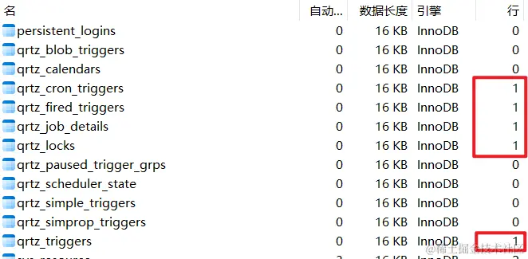

# SpringBoot  整合

[TOC]

## Https

有两种方式可以获取到 SSL 证书：

1. 自己通过 keytool 生成
2. 通过证书授权机构购买

```shell
keytool -genkey -alias SpringSecurity -dname "CN=GaoRuofan,OU=Personal,O=Personal,L=JINAN,ST=SHANDONG,C=CN" -storetype PKCS12 -keyalg RSA -keysize 2048 -keystore keystore.p12 -validity 365
```

- -genkey ：要求命令进行生成 key 的操作；
- -alias ：key 的别名；
- -dname：指定证书拥有者信息
  - CN：Common Name 名字与姓氏
  - OU：Organization Unit 组织单位名称
  - O：Organization 组织名称
  - L：Locality 城市或区域名称
  - ST：State 州或省份名称
  - C：Country 国家名称

- -storetype ：指定密钥库的类型。常用的有 JKS（默认）、JCEKS（推荐）、PKCS12、BKS、UBER。
- -keyalg ：指定要使用的算法
- -keysize ：指定密钥的长度
- -keystore ：指定证书文件的存储路径
- -validity ： 指定证书的有效期


Spring Boot 配置 SSL 很简单，只需要通过一系列的 `server.ssl.*` 参数即可完成配置

一个 SSL 单向验证的演示：

~~~properties
server.port=8443
server.ssl.protocol=TLS

# 证书的路径
server.ssl.key-store=classpath:javastack.keystore		

# 密钥库口令，在生成证书时设置的
server.ssl.key-store-password=javastack
server.ssl.key-store-type=PKCS12 
~~~


~~~java
server.ssl.ciphers= # Supported SSL ciphers.
server.ssl.client-auth= # Whether client authentication is wanted ("want") or needed ("need"). Requires a trust store.
server.ssl.enabled= # Enable SSL support.
server.ssl.enabled-protocols= # Enabled SSL protocols.
server.ssl.key-alias= # Alias that identifies the key in the key store.
server.ssl.key-password= # Password used to access the key in the key store.
server.ssl.key-store= # Path to the key store that holds the SSL certificate (typically a jks file).
server.ssl.key-store-password= # Password used to access the key store.
server.ssl.key-store-provider= # Provider for the key store.
server.ssl.key-store-type= # Type of the key store.
server.ssl.protocol=TLS # SSL protocol to use.
server.ssl.trust-store= # Trust store that holds SSL certificates.
server.ssl.trust-store-password= # Password used to access the trust store.
server.ssl.trust-store-provider= # Provider for the trust store.
server.ssl.trust-store-type= # Type of the trust store.
~~~

## log4j2

日志级别优先级从低到高：`ALL、DEBUG、 INFO、 WARN、 ERROR、FATAL、 OFF`

log4j2 的 Maven 依赖。注意在所有包含 `spring-boot-starter-*` 的依赖中排除 `spring-boot-starter-logging`

~~~xml
<dependency>
    <groupId>org.springframework.boot</groupId>
    <artifactId>spring-boot-starter-web</artifactId>
    <exclusions>
        <exclusion>
            <groupId>org.springframework.boot</groupId>
            <artifactId>spring-boot-starter-logging</artifactId>
        </exclusion>
    </exclusions>
</dependency>
<dependency>
    <groupId>org.springframework.boot</groupId>
    <artifactId>spring-boot-starter-log4j2</artifactId>
</dependency>
~~~

 引入`log4j2`依赖后，需要在 `application.yaml` 中指定 log4j2 的配置文件路径 ：

~~~yaml
#日志配置 无特殊需求无需更改
logging:
  config:  classpath:log4j2.xml
  level:
  	# 当配置为某个等级时，表示这个等级及以上的日志信息都将被记录。
    root: INFO
    javax.activation: info
    org.apache.catalina: INFO
    org.apache.commons.beanutils.converters: INFO
    org.apache.coyote.http11.Http11Processor: INFO
    org.apache.http: INFO
    org.apache.tomcat: INFO
    org.springframework: INFO
    com.chinamobile.cmss.bdpaas.resource.monitor: DEBUG
~~~

xml 配置模板如下：

~~~xml
<?xml version="1.0" encoding="UTF-8"?>
<Configuration>
    <!--<Configuration status="WARN" monitorInterval="30"> -->
    <!--monitorterval：是用于指定log4j自动重新检测读取配置内容的间隔时间-->
    <properties>
        <property name="LOG_HOME">./service-logs</property>
    </properties>
    <Appenders>
        
        <!--*********************控制台日志***********************-->
        <Console name="consoleAppender" target="SYSTEM_OUT">
            <!--设置日志格式及颜色-->
            <PatternLayout
                    pattern="%style{%d{ISO8601}}{bright,green} %highlight{%-5level} [%style{%t}{bright,blue}] %style{%C{}}{bright,yellow}: %msg%n%style{%throwable}{red}"
                    disableAnsi="false" noConsoleNoAnsi="false"/>
        </Console>

        <!--*********************文件日志***********************-->
        <!-- all级别日志 -->
        <!--%i 是一个递增的数字-->
        <RollingFile name="allFileAppender"
                     fileName="${LOG_HOME}/all.log"
                    
                     filePattern="${LOG_HOME}/$${date:yyyy-MM}/all-%d{yyyy-MM-dd}-%i.log">
            <!-- 设置日志格式 -->
            <PatternLayout>
                <pattern>%d %p %C{} [%t] %m%n</pattern>
            </PatternLayout>
            
            <Policies>
                <!-- 设置日志文件切分参数 -->
                <!--<OnStartupTriggeringPolicy/>-->
                
                <!--设置日志基础文件大小，超过该大小就触发日志文件滚动更新-->
                <SizeBasedTriggeringPolicy size="100 MB"/>
                
                <!--设置日志文件滚动更新的时间，默认情况下，这个策略是根据每天的更替（午夜）来创建新文件。它常常与 PatternLayout 中的 filePattern 选项一同使用-->
                <!--<TimeBasedTriggeringPolicy/>-->
            </Policies>
            <!--设置日志的文件个数上限，不设置默认为7个，超过大小后会被覆盖；依赖于filePattern中的%i-->
            <DefaultRolloverStrategy max="100"/>
        </RollingFile>

        <!--debug级别日志-->
        <RollingFile name="debugFileAppender"
                     fileName="${LOG_HOME}/debug.log"
                     filePattern="${LOG_HOME}/$${date:yyyy-MM}/debug-%d{yyyy-MM-dd}-%i.log.gz">
            <Filters>
                <!--过滤掉info及更高级别日志-->
                <ThresholdFilter level="info" onMatch="DENY" onMismatch="NEUTRAL"/>
            </Filters>
           
            <PatternLayout>
                <pattern>%d %p %C{} [%t] %m%n</pattern>
            </PatternLayout>
            <Policies>
                <SizeBasedTriggeringPolicy size="100 MB"/>
            </Policies>
            <DefaultRolloverStrategy max="100"/>
        </RollingFile>

        <!--info级别日志-->
        <RollingFile name="infoFileAppender"
                     fileName="${LOG_HOME}/info.log"
                     filePattern="${LOG_HOME}/$${date:yyyy-MM}/info-%d{yyyy-MM-dd}-%i.log.gz">
            <Filters>
                <!--过滤掉warn及更高级别日志-->
                <ThresholdFilter level="warn" onMatch="DENY" onMismatch="NEUTRAL"/>
            </Filters>
            
            <PatternLayout>
                <pattern>%d %p %C{} [%t] %m%n</pattern>
            </PatternLayout>
            <Policies>
                <SizeBasedTriggeringPolicy size="100 MB"/>
                <TimeBasedTriggeringPolicy interval="1" modulate="true" />
            </Policies>
        </RollingFile>

        <!--warn级别日志-->
        <RollingFile name="warnFileAppender"
                     fileName="${LOG_HOME}/warn.log"
                     filePattern="${LOG_HOME}/$${date:yyyy-MM}/warn-%d{yyyy-MM-dd}-%i.log.gz">
            <Filters>
                <!--过滤掉error及更高级别日志-->
                <ThresholdFilter level="error" onMatch="DENY" onMismatch="NEUTRAL"/>
            </Filters>
            <!--设置日志格式-->
            <PatternLayout>
                <pattern>%d %p %C{} [%t] %m%n</pattern>
            </PatternLayout>
            <Policies>
                <SizeBasedTriggeringPolicy size="100 MB"/>
                <TimeBasedTriggeringPolicy/>
            </Policies>
            <DefaultRolloverStrategy max="100"/>
        </RollingFile>

        <!--error及更高级别日志-->
        <RollingFile name="errorFileAppender"
                     fileName="${LOG_HOME}/error.log"
                     filePattern="${LOG_HOME}/$${date:yyyy-MM}/error-%d{yyyy-MM-dd}-%i.log.gz">
            <PatternLayout>
                <pattern>%d %p %C{} [%t] %m%n</pattern>
            </PatternLayout>
            <Policies>
                <SizeBasedTriggeringPolicy size="100 MB"/>
                <TimeBasedTriggeringPolicy/>
            </Policies>
            <DefaultRolloverStrategy max="100"/>
        </RollingFile>

        <!--json格式error级别日志-->
        <RollingFile name="errorJsonAppender"
                     fileName="${LOG_HOME}/error-json.log"
                     filePattern="${LOG_HOME}/error-json-%d{yyyy-MM-dd}-%i.log.gz">
            <JSONLayout compact="true" eventEol="true" locationInfo="true"/>
            <Policies>
                <SizeBasedTriggeringPolicy size="100 MB"/>
                <TimeBasedTriggeringPolicy interval="1" modulate="true"/>
            </Policies>
        </RollingFile>
    </Appenders>

    <Loggers>
        <!-- 根日志设置 -->
        <!--<Root> 元素表示的是根日志器。在Log4j2中，所有的Logger都派生自Root Logger-->
        <!--这里 level=debug 意味着该应用程序会记录所有debug及以上级别的日志-->
        <Root level="debug">
            <AppenderRef ref="allFileAppender" level="all"/>
            <AppenderRef ref="consoleAppender" level="debug"/>
            <AppenderRef ref="debugFileAppender" level="debug"/>
            <AppenderRef ref="infoFileAppender" level="info"/>
            <AppenderRef ref="warnFileAppender" level="warn"/>
            <AppenderRef ref="errorFileAppender" level="error"/>
            <AppenderRef ref="errorJsonAppender" level="error"/>
        </Root>

        <!--spring日志-->
        <Logger name="org.springframework" level="debug"/>
                                                        
        <!--druid数据源日志-->
        <Logger name="druid.sql.Statement" level="warn"/>
                                                       
        <!-- mybatis日志 -->
        <Logger name="com.mybatis" level="warn"/>
        <Logger name="org.hibernate" level="warn"/>
        <Logger name="com.zaxxer.hikari" level="info"/>
        <Logger name="org.quartz" level="info"/>
        <Logger name="com.andya.demo" level="debug"/>
    </Loggers>

</Configuration>
~~~


使用示例：

~~~java
@Slf4j
public class Demo {
    void foo() {
        log.trace(...);
        log.debug(...);
        log.info(...);
        log.warn(...);
        log.err(...);
    }
}
~~~


## 数据源

~~~yaml
spring:
  datasource:
    url: jdbc:mysql://localhost:3306/test?useUnicode=true&characterEncoding=utf8
    driverClassName: com.mysql.jdbc.Driver
    username: root
    password: 123456
~~~


## JUnit

JUnit 是一个 Java 单元测试框架。JUnit 5 由 3 个模块构成，分别是

- JUnit Platform ：基于 JVM 上启动测试框架的基础
- JUnit Jupiter ：JUnit 5 的核心，提供 JUnit 5 的新的编程模型，内部包含一个测试引擎，该测试引擎会基于 JUnit Platform 运行；
- JUnit Vintage ：兼容 JUnit 4 、JUnit 3 支持的测试引擎


|              | 意义                             |
| ------------ | -------------------------------- |
| @Test        | 标注一个测试方法                 |
| @BeforeEach  | 在每个测试方法前执行             |
| @AfterEach   | 在每个测试方法后执行             |
| @BeforeAll   | 在当前类中的所有测试方法之前执行 |
| @AfterAll    | 在当前类中的所有测试方法之后执行 |
| @Disabled    | 禁用测试方法/类                  |
| @Tag         | 标记和过滤                       |
| @TestFactory | 声明测试工厂进行动态测试         |
| @Nested      | 嵌套测试                         |
| @ExtendWith  | 注册自定义扩展                   |


Maven依赖

~~~xml
<dependency>
    <groupId>org.springframework.boot</groupId>
    <artifactId>spring-boot-starter-test</artifactId>
    <scope>test</scope>
</dependency>
~~~


在测试类上添加 @SpringBootTest 注解，SpringBoot 将自动加载整个应用程序上下文。

~~~java
@SpringBootTest
class SpringBootDemoApplicationTests {
    @Test
    void contextLoads() {
    }
}
~~~


断言的使用：

~~~java
// 数值断言
int num = 3 + 5;
Assertions.assertEquals(num, 8);

// Boolean 断言
int num = 3 + 5;
Assumptions.assumeTrue(num < 10);

// 浮点断言，可以指定浮动值
double result = 10.0 / 3;
Assertions.assertEquals(result, 3, 0.5);

// 可以自定义错误提示信息
Assertions.assertEquals(result, 3, 0.2, "计算数值偏差较大！");

// 断言两个对象是否是同一个
Object o1 = new Object();
Object o2 = o1;
Object o3 = new Object();
Assertions.assertSame(o1, o2);
Assertions.assertSame(o1, o3);

// 断言两个数组的元素是否完全相同
Assertions.assertArrayEquals(arr1, arr3);

// 断言是否抛出异常
Assertions.assertThrows(ArithmeticException.class, () -> {
    int i = 1 / 0;
});

// 断言是否超时
Assertions.assertTimeout(Duration.ofMillis(500), () -> {
    System.out.println("testTimeout run ......");
    TimeUnit.SECONDS.sleep(1);
    System.out.println("testTimeout finished ......");
});

// 断言强制失败
Assertions.fail();


~~~

组合条件断言，要求这些断言必须同时全部通过

~~~java

Assertions.assertAll(
    () -> {
        int num = 3 + 5;
        Assertions.assertEquals(num, 8);
    },
    () -> {
        String[] arr1 = {"aa", "bb"};
        String[] arr2 = {"bb", "aa"};
        Assertions.assertArrayEquals(arr1, arr2);
    }
);

~~~


参数化测试：

- 手动指明需要测试的值：
  ~~~java
  @ParameterizedTest
  @ValueSource(strings = {"aa", "bb", "cc"})
  // 声明了 3 个需要测试的值
  public void testSimpleParameterized(String value) throws Exception {
      System.out.println(value);
      Assertions.assertTrue(value.length() < 3);
  }
  ~~~

-  通过静态方法来提供测试数据

  ~~~java
  @ParameterizedTest
  @MethodSource("dataProvider")
  public void testDataStreamParameterized(Integer value) throws Exception {
      System.out.println(value);
      Assertions.assertTrue(value < 10);
  }
  
  private static Stream<Integer> dataProvider() {
      return Stream.of(1, 2, 3, 4, 5);
  }
  ~~~
  
- 通过 CSV 来提供测试数据

  ~~~Java
  @ParameterizedTest
  @CsvFileSource(resources = "/test.csv")
  void calcInsurance(int age,int score,int money) {
      assertEquals(money,insurance.calcInsurance(age,score));
  }
  ~~~

  


测试套件意味着捆绑几个单元测试用例并且一起执行他们。在 JUnit 中，`@RunWith`和`@Suite`注释用来运行套件测试。

~~~java
@RunWith(Suite.class)
@SuiteClasses({
        CountTest.class,
        TestFixture.class,
        AssertTest.class,
        TestRunSequence.class,
})
public class runAllTest {
 
}

class CountTest {
    @Test
    public void foo() {}
}
~~~


`timeout`参数和 `@Test` 注释一起使用可执行时间测试

~~~java
@Test(timeout=1000)
~~~

`expected` 参数和 `@Test` 注释一起使用，测试代码是否它抛出了想要得到的异常

~~~java
@Test(expected = ArithmeticException.class)
~~~


`@RepeatedTest` 指定所需的总重复次数


### MockMvc

通过 MockMvc，我们可以方便地构建各种 HTTP 请求：

~~~java
@SpringBootTest
class MenuControllerTest {
    private MockMvc mockMvc;

    @BeforeEach
    void setUp(WebApplicationContext wac) {
        this.mockMvc = MockMvcBuilders.webAppContextSetup(wac).alwaysExpect(status().isOk()).build();
    }

    @AfterEach
    void tearDown() {
        mockMvc = null;
    }
    // 省略其他部分
}
~~~

测试部分如下：

~~~java
@SpringBootTest
class MenuControllerTest {
    // 省略其他部分
    @Test
    void testGetAll() throws Exception {
        mockMvc.perform(get("/menu"))
            	// 设置查询参数
            	.param("name", "Java"))
             	// 判断响应头
            	.andExpect(content()
                           .contentType(MediaType.APPLICATION_JSON))
                // 判断处理方法
                .andExpect(handler().handlerType(MenuController.class))
                .andExpect(handler().methodName("getAll"))
                // 判断返回JSON内容
                .andExpect(jsonPath("$").isArray())
                .andExpect(jsonPath("$.length()").value(2))
                .andExpect(jsonPath("$..name")
                           .value(Matchers.hasItem("Java咖啡")));
    }
}
~~~

1. 首先通过 `MockMvcRequestBuilders.get()` 发起 `GET` 请求
2. `andExpect()` 用来设置期望的检查项，通过各种静态方法（`handler()`、`jsonPath()`等）获取请求体的信息。这些静态类包括
   - `MockMvcBuilders.*`
   - `MockMvcRequestBuilders.*`
   - `MockMvcResultMatchers.*`
   - `MockMvcResultHandlers.*`

**表 9-3　JsonPath 的常用操作符**

| 操作符                          | 说明                               |
| :------------------------------ | :--------------------------------- |
| `$`                             | JSON 的根元素                      |
| `@`                             | 正在处理的当前节点                 |
| `*`                             | 通配符                             |
| `..`                            | 深度扫描，可以扫描很多层以下的内容 |
| .< 名称 >                       | 特定名称的子节点                   |
| [ 数组下标 ]                    | 返回数组的特定位置的元素           |
| [ 起始数组下标 : 结束数组下标 ] | 从数组中切出一部分                 |


### MockwebServer

有时候，我们通过RestTemplate去调用业务部门的微服务。但是这些微服务的代码资产并不在本开发小组中，因此无法有效地展开单元测试。我们可以通过MockwebServer工具来解决这个问题。

使用`MockWebServer` 编写一个单元测试，大概分成下面几个步骤：

1. 引入 `com.squareup.okhttp3:mockwebserver` 依赖；

   ~~~xml
   <dependency>
       <groupId>com.squareup.okhttp3</groupId>
       <artifactId>mockwebserver</artifactId>
       <scope>test</scope>
   </dependency>
   ~~~

2. 在测试类中构造并启动 `MockWebServer`

   ~~~java
   class OrderRunnerTest {
       private static MockWebServer webServer;
   	private OrderRunner runner; 	// 被测试的对象
       
       @BeforeAll
       static void setUp() throws IOException {
           webServer = new MockWebServer();
           webServer.start();
       }
   
       @AfterAll
       static void tearDown() throws IOException {
           webServer.shutdown();
       }
       
       @BeforeEach
       void setUpBeforeEach() {
           runner = new OrderRunner();
           // 获取MockWebServer的接口
           runner.setBinarytea("http://localhost:" + webServer.getPort());
       }
       // 省略具体测试方法
   }
   ~~~

3. 构造模拟的响应；客户端发起 HTTP 调用，并验证应答以及请求。

   ~~~java
   class OrderRunnerTest {
       // 省略公共部分代码
       @Test
       void testCallForEntity() throws Exception {
           // 构造应答
           String body = "{\"id\":1, \"status\":\"ORDERED\"}";
           MockResponse response = new MockResponse().setResponseCode(HttpStatus.CREATED.value())
                   .addHeader(HttpHeaders.CONTENT_TYPE, MediaType.APPLICATION_JSON_VALUE).setBody(body);
           webServer.enqueue(response);
   
           // 发送请求
           ResponseEntity<String> entity = runner.callForEntity();
           
           // 验证响应
           assertEquals(HttpStatus.CREATED, entity.getStatusCode());
           assertEquals(MediaType.APPLICATION_JSON_VALUE,entity.getHeaders().getFirst(HttpHeaders.CONTENT_TYPE));
           assertEquals(body, entity.getBody());
   
           // 验证请求
           RecordedRequest request = webServer.takeRequest();
           assertEquals("/order", request.getPath());
   
           NewOrderForm form = objectMapper.readValue(request.getBody().readUtf8(),NewOrderForm.class);
           assertLinesMatch(Arrays.asList("1"), form.getItemIdList());
           assertEquals(90, form.getDiscount());
       }
   }
   ~~~


## Mybatis

~~~xml
<dependency>
    <groupId>org.mybatis.spring.boot</groupId>
    <artifactId>mybatis-spring-boot-starter</artifactId>
    <version>2.2.0</version>
</dependency>
<dependency>
    <groupId>mysql</groupId>
    <artifactId>mysql-connector-java</artifactId>
    <version>8.0.31</version>
</dependency>
~~~

配置文件：

~~~properties
# 是否执行MyBatis xml配置文件的状态检查, 只是检查状态,默认false
mybatis.check-config-location=true
# mybatis-config.xml文件的位置
mybatis.config-location=classpath:mybatis/mybatis-config.xml
# Mapper对应的xml路径
mybatis.mapper-locations=classpath:mybatis/mapper/*.xml
# 设置别名的路径,可避免写全限定类名
mybatis.type-aliases-package=com.manu.mybatisxml.model
~~~


在 Spring Boot中，如何实现一个 Mapper：

- 为 Mapper 打上注解 @Mapper

  ~~~java
  @Mapper
  @Repository
  public interface UserMapper {
      void save(User user);
      
      List<User> findAll();
  }
  ~~~

- `mappe.xml` 文件的路径，包括文件名，必须同数据层的接口完全一致

  `mapper.xml` 文件可以和接口放在同一个目录下，也可以放在 `resource/${包名}` 目录下
  
- 在启动类上添加 @MapperScan 注解，并指定包路径

  ~~~java
  @SpringBootApplication
  @MapperScan("edu.qdu.gpumonitor.Mapper")
  public class GpuMonitorApplication {
      public static void main(String[] args) {
          SpringApplication.run(GpuMonitorApplication.class, args);
      }
  }
  ~~~

  注意：注解方式与 xml 配置文件可以搭配使用，一起实现一个 Mapper 接口。


直接通过依赖注入来获取：

~~~java
@Service
public class UserService {
    @Autowired
    private UserMapper userMapper;
    
    public void test() {
        User user = new User();
        user.setName("test mybatis");
        user.setTel("1234567");
        userMapper.save(user);
        
        List<User> userList = userMapper.findAll();
        userList.forEach(System.out::println);
    }
}
~~~

## Redis

SpringBoot 中默认的客户端是 Lettuce, 所以需要 exclude 掉 lettuce-core 包，并引入 jedis 的包。

~~~xml
<dependency>
    <groupId>org.springframework.boot</groupId>
    <artifactId>spring-boot-starter-data-redis</artifactId>
    <exclusions>
        <exclusion>
            <artifactId>lettuce-core</artifactId>
            <groupId>io.lettuce</groupId>
        </exclusion>
    </exclusions>
</dependency>

<dependency>
    <groupId>redis.clients</groupId>
    <artifactId>jedis</artifactId>
</dependency>

<dependency>
    <groupId>org.apache.commons</groupId>
    <artifactId>commons-pool2</artifactId>
    <version>2.9.0</version>
</dependency>
~~~

配置文件如下：

~~~properties
spring.data.redis.host = 你的Redis服务器地址
spring.data.redis.port = 你的Redis服务器端口
spring.data.redis.password = 你的Redis密码 (如果有的话)
spring.data.redis.database = 数据库索引 (默认为0)
spring.data.redis.jedis.pool.max-active = 连接池最大连接数 (使用负值表示没有限制)
spring.data.redis.jedis.pool.max-idle = 连接池中的最大空闲连接
spring.data.redis.jedis.pool.min-idle = 连接池中的最小空闲连接
spring.data.redis.jedis.pool.max-wait = 连接池最大阻塞等待时间（使用负值表示没有限制）
~~~

SpringBootTest 提供了针对 SpringDataRedis 的场景测试器，所以可以直接用 `@DataRedisTest` 而不是 `@SpringBootTest`

~~~java
@DataRedisTest
public class RedisTest {
    @Autowired
    // 这里的反省参数指定redis中key的类型，以及value类型
    // 如果是Object，那么直接保存 协议序列化的字符串
    private RedisTemplate<Object, Object> redisTemplate;
    
    @Autowired
    // 相当于RedisTemplate<String, String>
    private StringRedisTemplate stringRedisTemplate;
}
~~~


key-value 的操作：

~~~java
ValueOperations<Object, Object> valueOperations = redisTemplate.opsForValue();

// 存入指定值
valueOperations.set("abc", "def");
valueOperations.setIfAbsent("qaz", 123);
valueOperations.setIfAbsent("qaz", 456); // 这次不会生效

 // 存入指定值，并设置过期时间为1分钟（三种方式均可）
valueOperations.set("qqq", 333, 1, TimeUnit.MINUTES);
valueOperations.set("aaa", 444, TimeUnit.MINUTES.toMillis(1));
valueOperations.set("zzz", 555, Duration.ofMinutes(1));

// 取出指定值
valueOperations.get("abc")
valueOperations.get("qaz")
    
// 获取指定key的过期时间
redisTemplate.getExpire("qqq")
    
// 删除指定值，多个值
redisTemplate.delete("abc");
redisTemplate.delete(Arrays.asList("qqq", "aaa", "zzz"));

// 检查某个key是否存在
redisTemplate.hasKey("qaz")
~~~


List 列表的操作

~~~java
ListOperations<Object, Object> listOperations = redisTemplate.opsForList();

// 向一个列表的左侧压入数据
listOperations.leftPush("leftList", "aaa");
// 一次性向左侧压入多个数据
listOperations.leftPushAll("leftList", 123, 456, 789);
// 获取列表中的数据
List<Object> leftList = listOperations.range("leftList", 0, 100);

// 替换列表中的一个数据
listOperations.set("leftList", 0, 999);

// 根据索引获取数据
listOperations.index("leftList", 1)
    
// 获取数据对应的索引
listOperations.indexOf("leftList", 456) 
    
// 向左弹出一个数据
listOperations.leftPop("leftList")

// 删除指定元素
// 如果第二个参数不为0，则表示将要删除的元素所在的位置，例如传入-1表示删除从列表末尾开始的第一个值为111的元素，并传入1则表示删除从列表开头计数的第一个值为111的元素。 为0，表示删除所有
listOperations.remove("rightList", 0, 111);
~~~


对于 Set 的操作、Hash 的操作、ZSet 等操作，回来自行查阅补充


工具类的封装

~~~java
public class RedisUtil {

    @SuppressWarnings("unchecked")
    private static RedisTemplate<String, String> redisTemplate = SpringUtil.getBean(StringRedisTemplate.class);

    static  public boolean expire(String key, long time) {
        return redisTemplate.expire(key, time, TimeUnit.SECONDS);
    }

    static  public long getExpireTime(String key) {
        return redisTemplate.getExpire(key, TimeUnit.SECONDS);
    }

    static  public boolean hasKey(String key) {
        return redisTemplate.hasKey(key);
    }

    static  public Object get(String key) {
        return key == null ? null : redisTemplate.opsForValue().get(key);
    }

    static public void set(String key, String value) {
        redisTemplate.opsForValue().set(key, value);
    }
    static public void delete(String key) {
        redisTemplate.delete(key);
    }
    static public void batchSet(Map<String, String> keyAndValue) {
        redisTemplate.opsForValue().multiSet(keyAndValue);
    }
}


/**
 * spring工具类 方便在非spring管理环境中获取bean
 *
 * @author Lion Li
 */
@Component
public final class SpringUtil implements BeanFactoryPostProcessor
{
    /** Spring应用上下文环境 */
    private static ConfigurableListableBeanFactory beanFactory;

    @Override
    public void postProcessBeanFactory(ConfigurableListableBeanFactory beanFactory) throws BeansException
    {
        SpringUtil.beanFactory = beanFactory;
    }

    @SuppressWarnings("unchecked")
    public static <T> T getBean(String name) throws BeansException
    {
        return (T) beanFactory.getBean(name);
    }

    public static <T> T getBean(Class<T> clz) throws BeansException
    {
        T result = (T) beanFactory.getBean(clz);
        return result;
    }
}
~~~


## Kafka

Maven 依赖

~~~xml
<!--Kafka配置-->
<dependency>
    <groupId>org.springframework.kafka</groupId>
    <artifactId>spring-kafka</artifactId>
    <version>3.0.11</version>
</dependency>
<dependency>
    <groupId>org.slf4j</groupId>
    <artifactId>slf4j-api</artifactId>
    <version>2.0.9</version>
</dependency>
~~~

生产消息：

~~~java
@Configuration
public class KafkaProducerConfig {

    // 创建 kafka 操作模板对象, 用于简化消息发送操作
    @Bean
    public KafkaTemplate<?, ?> kafkaTemplate(ProducerFactory<Object, Object> producerFactory) {
        return new KafkaTemplate<>(producerFactory);
    }

    // 创建 kafka 生产者工厂
    @Bean
    public ProducerFactory<?, ?> producerFactory() {
        Map<String, Object> properties = buildProducerProperties();
        return new DefaultKafkaProducerFactory<>(properties);
    }

    /**
     * 构建生产者配置
     * @return
     */
    public static Map<String, Object> buildProducerProperties() {
        Map<String, Object> properties = new HashMap<>();
        properties.put("bootstrap.servers", "127.0.0.1:9092");
        properties.put("acks", "all");
        properties.put("retries", 0);
        properties.put("batch.size", 16384);
        properties.put("linger.ms", 1);
        properties.put("buffer.memory", 33554432);
        properties.put("key.serializer", StringSerializer.class.getName());
        properties.put("value.serializer", StringSerializer.class.getName());
        return properties;
    }
}

@Component
public class KafkaProducerDemo {
    @Autowired
    private Consumer<String, Object> consumer;
    public void send() throws InterruptedException {
        // 创建 Header
        Header recordHeader = new RecordHeader("myHeader", "headerValue".getBytes());

        // 创建 Message
        Message<String> message = MessageBuilder
            .withPayload(payload)
            .setHeader(KafkaHeaders.TOPIC, topic)
            .setHeader(KafkaHeaders.MESSAGE_KEY, "myKey")
            .setHeader(KafkaHeaders.TIMESTAMP, System.currentTimeMillis())
            .setHeaders(new RecordHeaders(Arrays.asList(recordHeader)))
            .build();

        // 发送消息
        kafkaTemplate.send(message);
    }
}
~~~


消费消息：

~~~java
@Configuration
public class KafkaConsumerConfig {

    /**
     * 创建 消费者对象
     *
     * @param consumerFactory
     * @return
     */
    @Bean
    public Consumer<?, ?> consumer(ConsumerFactory<Object, Object> consumerFactory) {
        return consumerFactory.createConsumer();
    }

    @Bean
    public ConsumerFactory<?,?> consumerFactory() {
        return new DefaultKafkaConsumerFactory<>(buildConsumerProperties());
    }

    /**
     * 构建消费者配置
     *
     * @return
     */
    public static Map<String, Object> buildConsumerProperties() {
        Map<String, Object> properties = new HashMap<>();
        properties.put(ConsumerConfig.BOOTSTRAP_SERVERS_CONFIG, "119.45.163.155:9092");
        properties.put(ConsumerConfig.GROUP_ID_CONFIG, "gpu_realtime_group");
        properties.put(ConsumerConfig.ENABLE_AUTO_COMMIT_CONFIG, false);
        properties.put(ConsumerConfig.SESSION_TIMEOUT_MS_CONFIG, "60000");
        properties.put(ConsumerConfig.KEY_DESERIALIZER_CLASS_CONFIG, StringDeserializer.class.getName());
        properties.put(ConsumerConfig.VALUE_DESERIALIZER_CLASS_CONFIG, StringDeserializer.class.getName());
        return properties;
    }
}

@Component
public class KafkaConsumerDemo {
    @Autowired
    private Consumer<String, Object> consumer;


    @PostConstruct
    public void consumerTest() {
        consumer.subscribe(Arrays.asList("test"));
        ConsumerRecords<String, Object> records = consumer.poll(100);
        for (ConsumerRecord<String, Object> record : records) {
            System.out.println("消费消息： " + record.value());
        }
    }
}
~~~


## ElasticSearch

maven依赖：

~~~xml
<dependency>
    <groupId>org.springframework.boot</groupId>
    <artifactId>spring-boot-starter-data-elasticsearch</artifactId>
</dependency>
~~~


~~~java
@Autowired
private ElasticsearchRestTemplate elasticsearchRestTemplate;

@Test
public void testTemplate() throws Exception {
	SearchHits<GraphicsCard> hits = elasticsearchRestTemplate.search(
        new CriteriaQuery(Criteria
            .where("name")
            .contains("ROG")), 
        GraphicsCard.class);
}
~~~

## Cache

 Java 中的缓存模型规范：**JSR-107** 规范

- CachingProvider：它可以生产多个 `CacheManager`

- CacheManager：创建和管理 `Cache` 对象

  ~~~java
  public interface CacheManager {
      // 获取特定的 Cache
      Cache getCache(String name);
      // 获取所有的 Cache 名
      Collection<String> getCacheNames();
  }
  ~~~

- Cache 是具体的缓存器，它的设计非常类似于 `Map` 

  ~~~java
  public interface Cache {
  	String getName();
  	@Nullable
  	ValueWrapper get(Object key);
  	@Nullable
  	<T> T get(Object key, @Nullable Class<T> type);
  	@Nullable
  	<T> T get(Object key, Callable<T> valueLoader);
  	void put(Object key, @Nullable Object value);
  }
  ~~~

- Entry

- Expiry

Maven依赖：

~~~xml
<dependency>
    <groupId>org.springframework.boot</groupId>
    <artifactId>spring-boot-starter-cache</artifactId>
</dependency>
~~~


使用示例：

~~~java
 @Autowired
private CacheManager cacheManager;

 public User get(Integer id) {
     // 1. 通过 CacheManager 拿到名为 user 的缓存对象 Cache
     Cache cache = cacheManager.getCache("user");
     
     // 2. 从 Cache 中尝试获取一个指定 id 的 User 类型的对象
     User user = cache.get(id, User.class);
     
     // 3. 如果对象数据存在，则直接返回
     if (user != null) {
         return user;
     }
     
     // 4. 如果数据不存在，则需要查询数据库，并将查询的结果放入Cache中
     User userFromDatabase = userMapper.get(id);
     cache.put(id, userFromDatabase);
     return userFromDatabase;
 }
~~~

要在主启动类上标注 `@EnableCaching` 注解

~~~java
@EnableCaching
@SpringBootApplication
public class SpringBootCacheApplication
~~~


可以在 Bean 初始化时就获取 `Cache` 对象，减少一部分重复代码。

~~~java
@Service
public class CachedUserService implements InitializingBean {;
    @Autowired
    private CacheManager cacheManager;
    private Cache cache;
    
    @Override
    public void afterPropertiesSet() throws Exception {
        this.cache = cacheManager.getCache("user");
    }

~~~


我们可以通过 @Cacheable 来简单快速地使用缓存：

~~~Java
@Service
public class AnnotationUserService {
    @Cacheable("user.get")
    // value代表缓存的名字，这个参数必填
    public User get(Integer id) {
        // 这里缓存映射关系是 id → User
        return ...;
    }
}
~~~

~~~java
@Autowired
private AnnotationUserService annotationUserService;

@Test
public void test3() throws Exception {
    User user1 = annotationUserService.get(1);
    User user2 = annotationUserService.get(1);
    System.out.println(user1 == user2);			// true
}
~~~

这里有两点需要着重说明一下：

- 这套缓存抽象背后是通过 AOP 来实现的，所以如果执行缓存操作，那么必须访问代理后的对象（依赖注入帮我们处理好了）
- 只有那些**可幂等操作**的方法才适用于这套抽象，因为必须要保证相同的参数拥有一样的返回值。

| Spring 注解    | 说明                                                         |
| -------------- | ------------------------------------------------------------ |
| `@Cacheable`   | 从缓存中获取对应的缓存值，没有的话就执行方法并缓存，然后返回。其中 `sync` 如果为 `true`，在调用方法时会锁住缓存，相同的参数只有一个线程会计算，其他线程等待结果 |
| `@CachePut`    | 直接更新缓存                                                 |
| `@CacheEvict`  | 清除缓存，其中的 `allEntries` 如果设置为 `true`，则清除指定缓存 |
| `@Caching`     | 可以用来组合多个缓存抽象的注解，比如两个 `@CacheEvict`       |
| `@CacheConfig` | 添加在类上，为这个类里的缓存抽象注解提供公共配置，例如统一的 `cacheNames` 和 `cacheManager` |

这些注解中有很多一样的属性（除了 `@Caching`），具体如下

- `cacheNames`，标识一个缓存
- `key`，计算缓存Key名的 SpEL 表达式
- `keyGenerator`，自定义的 `KeyGenerator` Bean 名称，用来生成缓存键名，与 `key` 属性互斥。
- `cacheManager`，缓存管理器的 Bean 名称，负责管理实际的缓存
- `cacheResolver`，缓存解析器的 Bean 名称，与 `cacheManager` 属性互斥
- `condition`，在调用方法**之前**判断条件，决定是否缓存
- `unless`：在调用方法**之后**判断条件，决定是否**不**缓存。


key 属性值的说明

- `#root.methodName` 和 `#root.method.name` ：以方法名作为 key。

- `#root.targetClass`：以类名作为 key。

- `#root.args[0]`：以第一个参数名作为 key。如果只有一个参数，那么 `#id` 与 `#root.args[0]`作用一样

- `#root.caches[1]`：以 value[] 中的第一个参数作为 key

- 自定义 key 的生成：

  ~~~java
  @Component
  public class UserKeyGenerator implements KeyGenerator {
      @Override
      public Object generate(Object target, Method method, Object... params) {
          return method.getName() + params[0];
      }
  }
  ~~~

~~~java
// 此处将方法名、name 参数与 size 参数用“-”拼接在一起作为缓存的键名。
@Cacheable(key = "#root.methodName + '-' + #name + '-' + #size")
public Optional<MenuItem> getByNameAndSize(String name, Size size) {
    return menuRepository.findByNameAndSize(name, size);
}
~~~


删除缓存：

```java
@CacheEvict(cacheNames = "hello", key = "#id") 
public String delete(String id) {
    // 删除key为id的缓存
    return "删除成功";
}
```

修改缓存：

```java
@CachePut(cacheNames = "hello", key = "#id") 
public String update(String id) {
    return "修改后的缓存数据";
}
```


Spring 缓存抽象的默认实现为`ConcurrentHashMap`，其实 Spring 的缓存抽象能够支持多种不同的后端缓存实现，通过ChacheMananger来指定：

| 实现类                      | 底层实现            | 说明                                                      |
| --------------------------- | ------------------- | --------------------------------------------------------- |
| `ConcurrentMapCacheManager` | `ConcurrentHashMap` | 建议仅用于测试目的                                        |
| `NoOpCacheManager`          | 无                  | 不做任何缓存操作，可以视为关闭缓存                        |
| `CompositeCacheManager`     | 无                  | 用于组合多个不同的 `CacheManager`，会在其中遍历要找的缓存 |
| `EhCacheCacheManager`       | EhCache             | 适用于 EhCache                                            |
| `CaffeineCacheManager`      | Caffeine            | 适用于 Caffeine                                           |
| `JCacheCacheManager`        | JCache              | 适用于遵循 JSR-107 规范的缓存                             |

此外还有 Redis、Hazelcast、Infinispan。

## Quartz

Quartz 是定时调度框架。通过 Cron 表达式来描述任务的定期执行策略

~~~bash
【seconds minutes hours day-of-month month day-of-week year】
~~~

- **`\*`（通配符）**：匹配任意值，例如`* * * * * ?`表示每秒执行一次任务
- **`,`（列表）**：用于指定多个取值
- **`-`（范围）**：用于指定一个范围内的取值
- **`/`（步长）**：用于指定一个取值的步长，例如`0 */30 * * * ?`表示每30分钟执行一次任务。
- **`?`（无意义占位符）**：用于指定一个字段没有具体的取值
- **`#`（日历偏移量）**：用于指定某个月份的第几个周几，例如`0 0 0 ? * 3#1`表示每个月的第一个星期三执行任务。

Cron 使用示例：

- `0 0 10,14,16 * * ?` ：每天上午 10 点，下午 2 点、4 点
- `0 0/30 9-17 * * ?` ：上午 9 点到下午 5 点内每半小时
- `0 0 12 ? * WED` ：表示每个星期三中午 12 点
- `0 0 12 * * ?` ：每天中午 12 点触发
- `0 15 10 ? * *` ：每天上午 10:15 触发
- `0 15 10 * * ?` ：每天上午 10:15 触发
- `0 15 10 * * ? *` ：每天上午 10:15 触发
- `0 15 10 * * ? 2022` ：2022 年的每天上午 10:15 触发
- `0 * 14 * * ?` ：在每天下午 2 点到下午 2:59 期间的每 1 分钟触发
- `0 0/5 14 * * ?` ：在每天下午 2 点到下午 2:55 期间的每 5 分钟触发
- `0 0/5 14,18 * * ?` ：在每天下午 2 点到 2:55 期间和下午 6 点到 6:55 期间的每 5 分钟触发
- `0 0-5 14 * * ?` ：在每天下午 2 点到下午 2:05 期间的每 1 分钟触发
- `0 10,44 14 ? 3 WED` ：每年三月的星期三的下午 2:10 和 2:44 触发
- `0 15 10 ? * MON-FRI` ：周一至周五的上午 10:15 触发
- `0 15 10 15 * ?` ：每月 15 日上午 10:15 触发
- `0 15 10 L * ?` ：每月最后一日的上午 10:15 触发
- `0 15 10 ? * 6L` ：每月的最后一个星期五上午 10:15 触发
- `0 15 10 ? * 6L 2022-2023` ：2022 年至 2023 年的每月的最后一个星期五上午 10:15 触发
- `0 15 10 ? * 6#3` ：每月的第三个星期五上午 10:15 触发

Maven依赖

~~~xml
<dependency>
    <groupId>org.springframework.boot</groupId>
    <artifactId>spring-boot-starter-quartz</artifactId>
</dependency>
~~~

使用示例：

~~~java
@Service
public class ScheduleService {
    @Scheduled(cron = 0/5 * * * * *)
    public void test() {
        LOGGER.info("ScheduleService test invoke ......");
    }
}
~~~

这种方式只能把 Cron 表达式硬编码在代码中，无法做到动态定时任务管理。下面我们来实现这一点。首先 Quartz 是由 3 个核心 API 构成的，它们分别是：

- `Job` ：任务模型
- `Trigger` ：任务触发器
- `Scheduler` ：任务调度器

下面我们通过 RESTful API 来动态添加任务管理器

~~~java
@RestController
public class DynamicScheduleController {
    Autowired
    private Scheduler scheduler;
    
    @GetMapping("/addSchedule")
    public String addSchedule() throws SchedulerException {
		int random = ThreadLocalRandom.current().nextInt(1000);
        // 1. 创建 JobDetail
        JobDetail jobDetail = JobBuilder
            .newJob(SimpleJob.class) 
            .withIdentity("test-schedule" + random, "test-group")
            .build();
        
        // 2. 创建 Trigger，并指定每3秒执行一次
        CronScheduleBuilder cron = CronScheduleBuilder
            .cronSchedule("0/3 * * * * ?");
        
        Trigger trigger = TriggerBuilder
            .newTrigger()
            .withIdentity("test-trigger" + random, "test-trigger-group")
            .withSchedule(cron).build();
        
        // 3. 调度任务
        scheduler.scheduleJob(jobDetail, trigger);
    }
}

public class SimpleJob implements Job {
    private Logger logger = LoggerFactory.getLogger(this.getClass());
    
    @Override
    public void execute(JobExecutionContext context) {
        logger.info("简单任务执行 ......");
    }
}
~~~

默认将定时任务的信息保存在内容中，可以在 application.yaml 中配置相关参数，将信息保存在数据库中：

~~~yaml
# 设置将定时任务的信息保存到数据库
spring.quartz.job-store-type=jdbc
    
# 每次应用启动的时候都初始化数据库表结构
spring.quartz.jdbc.initialize-schema=always
~~~



暂停与恢复定时任务：

~~~java
@GetMapping("/pauseSchedule")
public String pauseSchedule(String jobName, String jobGroup) throws SchedulerException {
    JobKey jobKey = JobKey.jobKey(jobName, jobGroup);
    // 获取定时任务
    JobDetail jobDetail = scheduler.getJobDetail(jobKey);
    if (jobDetail == null) {
        return "error";
    }
    scheduler.pauseJob(jobKey);
    return "success";
}

@GetMapping("/remuseSchedule")
public String remuseSchedule(String jobName, String jobGroup) throws SchedulerException {
    JobKey jobKey = JobKey.jobKey(jobName, jobGroup);
    // 获取定时任务
    JobDetail jobDetail = scheduler.getJobDetail(jobKey);
    if (jobDetail == null) {
        return "error";
    }
    scheduler.pauseJob(jobKey);
    return "success";
}
~~~

移除定时任务：

~~~java
@GetMapping("/removeSchedule")
public String removeSchedule(String jobName, String jobGroup, String triggerName, String triggerGroup) throws SchedulerException {
    TriggerKey triggerKey = TriggerKey.triggerKey(triggerName, triggerGroup);
    JobKey jobKey = JobKey.jobKey(jobName, jobGroup);
    Trigger trigger = scheduler.getTrigger(triggerKey);
    if (trigger == null) {
        return "error";
    }
    // 停止触发器
    scheduler.pauseTrigger(triggerKey);
    // 移除触发器
    scheduler.unscheduleJob(triggerKey);
    // 删除任务
    scheduler.deleteJob(jobKey);
    return "success";
}
~~~

## Swagger

在线文档最大的亮点就是实时更新的，无需我们手动更新文档。而且可以在文档中对接口进行调试。而 OpenAPI 规范如何编写接口文档内容，这是 Swagger 需要考虑的事情

Swagger 希望我们使用遵循 RESTful 规范的方式来编写接口

~~~xml
<dependency>
    <groupId>io.springfox</groupId>
    <artifactId>springfox-boot-starter</artifactId>
    <version>3.0.0</version>
</dependency>
~~~


使用示例：

~~~java
@Configuration(proxyBeanMethods = false)
@EnableSwagger2
public class Swagger2Configuration {
    @Bean
    public Docket createRestApi() {
        return new Docket(DocumentationType.OAS_30)
            .apiInfo(apiInfo())
            .select()
            // 扫描 RestController
            .apis(RequestHandlerSelectors
                  .basePackage("com.linkedbear.boot.swagger"))
            .paths(PathSelectors.any())
            .build();
    }
    
    private ApiInfo apiInfo() {
        return new ApiInfoBuilder()
                .title("SpringBoot手动集成Swagger2")
                .description("test swagger document")
                .contact(new Contact("https://github.com/LinkedBear", "", ""))
                .version("1.0")
                .build();
    }
}
~~~

启动工程后，我们来访问 [http://localhost:8080/swagger-ui.html](https://link.juejin.cn/?target=http%3A%2F%2Flocalhost%3A8080%2Fswagger-ui.html)


Swagger 以 RestController 类进行分组的，默认分组名是  Controller 类名。可以通过 @Api 为分组指定一个命名

~~~java
@RestController
@Api(tags = "这是一个测试接口类")
public class DemoController {
    
    // ......
}
~~~

 @ApiOperation 给接口添加说明信息

~~~java
@GetMapping("/test")
@ApiOperation(value = "这是一个测试的接口", notes = "仅供测试，切勿当真", hidden = false)
// 如果我们不希望接口出现在文档中，可以通过 hidden = true 来隐藏它
public String test() {
    return "test";
}
~~~


@ApiParam 给参数添加说明信息

| 属性名称        | 属性类型 | 默认值 | 作用                     |
| --------------- | -------- | ------ | ------------------------ |
| name            | String   | 空     | 定义参数的名称           |
| value           | String   | 空     | 定义参数的简单描述       |
| defaultValue    | String   | 空     | 定义参数的默认值         |
| allowableValues | String   | 空     | 定义参数的取值范围       |
| required        | boolean  | false  | 定义参数是否必填         |
| allowMultiple   | boolean  | false  | 定义参数能否接收多个数值 |
| example         | String   | 空     | 给出一个合法的参数值示例 |
| hidden          | boolean  | false  | 定义参数是否展示在文档上 |

~~~java
@GetMapping("/test")
@ApiOperation(value = "这是一个测试的接口", notes = "仅供测试，切勿当真")
public String test(
    @ApiParam(
        value = "测试姓名", 
        defaultValue = "zhangsan",
        allowableValues = "zhangsan,lisi,wangwu", 
        required = true) 
    String name,
    
    @ApiParam(
        value = "测试年龄", 
        allowableValues = "10, 20, 30, 40, 50", 
        example = "10") 
    Integer age) {
    
    return "test";
}
~~~


我们通过 @ApiModelProperty 来说明返回对象的信息：

~~~java
@ApiModel(value = "用户类", description = "封装用户的基本信息")
public class User {
    @ApiModelProperty(value = "用户id", required = true)
    private String id;
    
    @ApiModelProperty(value = "用户姓名", required = true)
    private String name;
    
    @ApiModelProperty(value = "用户年龄", notes = "只能传入大于0的数")
    private Integer age;
    
    // getter setter ......
~~~


