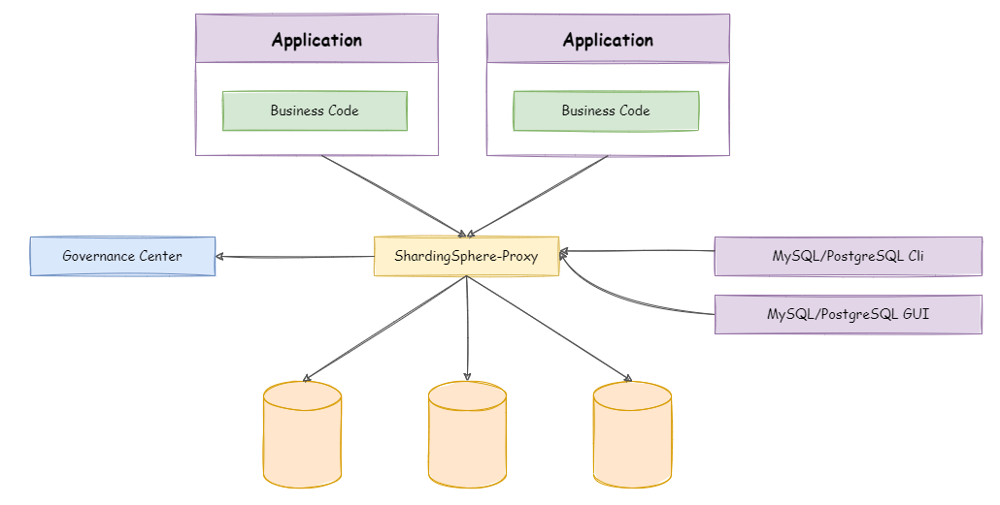
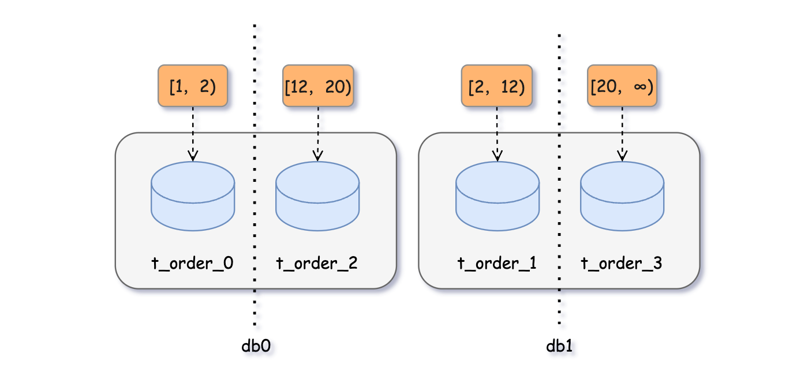
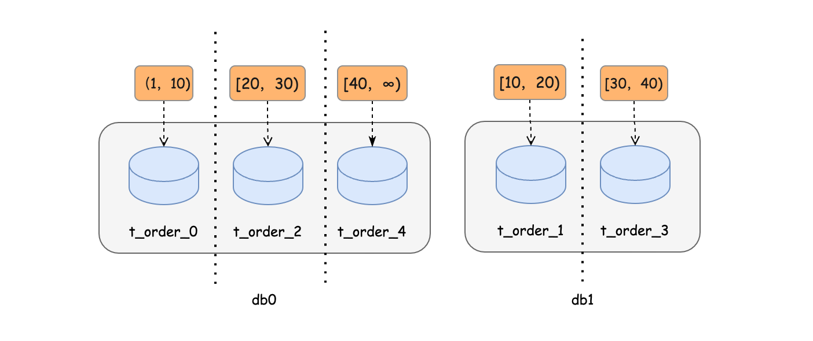

# ShardingSphere

[TOC]

## 概述

Apache ShardingSphere 是分布式数据库中间件，它由 JDBC、Proxy 和 Sidecar（规划中）这 3 款相互独立，却又能够混合部署配合使用的产品组成。

ShardingSphere-JDBC 定位为轻量级 Java 框架，在 Java 的 JDBC 层提供的额外服务。可理解为增强版的 JDBC 驱动，完全兼容 JDBC 和各种 ORM 框架。


ShardingSphere-JDBC 的 Maven 依赖如下：

~~~xml
<!-- shardingsphere-jdbc -->
<dependency>
    <groupId>org.apache.shardingsphere</groupId>
    <artifactId>shardingsphere-jdbc-core</artifactId>
    <!--对于最新 5.4.X 版本（2024.9.16），它的 YAML 解析器有问题。建议使用 5.5.0，需要从官网上下载源码，在本地进行 Maven Install-->
    <version>5.5.0</version>
</dependency>


<!-- 阿里巴巴的 druid 数据源 -->
<dependency>
    <groupId>com.alibaba</groupId>
    <artifactId>druid-spring-boot-3-starter</artifactId>
    <version>1.1.23</version>
</dependency>

<!-- dynamic-datasource -->
<dependency>
    <groupId>com.baomidou</groupId>
    <artifactId>dynamic-datasource-spring-boot-starter</artifactId>
    <version>3.6.1</version>
</dependency>


<dependency>
    <groupId>org.mybatis.spring.boot</groupId>
    <artifactId>mybatis-spring-boot-starter</artifactId>
    <version>2.1.3</version>
    <exclusions>
        <!-- 排除默认的 HikariCP 数据源 -->
        <exclusion>
            <groupId>com.zaxxer</groupId>
            <artifactId>HikariCP</artifactId>
        </exclusion>
    </exclusions>
</dependency>
~~~


下面配置定义了 ShardingSphere 使用的数据源：

~~~yaml
spring:
  datasource:
    # 配置 DataSource Driver
    driver-class-name: org.apache.shardingsphere.driver.ShardingSphereDriver
    # 指定 YAML 配置文件
    url: jdbc:shardingsphere:classpath:xxx.yaml
~~~

注意，ShardingSphere 在`5.3.0`版本之后，不再提供`spring boot`版本依赖，而是统一使用`shardingsphere-jdbc-core`。如果接下来的配置文件中出现 `spring.shardingsphere`，那么请直接忽略它。

~~~yaml
# sharding-sphere-config.yaml
dataSources:
  write:
    dataSourceClassName: com.alibaba.druid.pool.DruidDataSource
    driverClassName: com.mysql.cj.jdbc.Driver
    url: jdbc:mysql://localhost:3306/dirk?serverTimezone=UTC&useSSL=false&useUnicode=true&characterEncoding=UTF-8
    username: root
    password: root
  read:
    dataSourceClassName: com.alibaba.druid.pool.DruidDataSource
    driverClassName: com.mysql.cj.jdbc.Driver
    url: jdbc:mysql://localhost:3306/dirk?serverTimezone=UTC&useSSL=false&useUnicode=true&characterEncoding=UTF-8
    username: root
    password: root

rules:
  - !SHARDING
    autoTables:
      sharding_test:
        actualDataSources: write
        keyGenerateStrategy:
          column: id
          keyGeneratorName: snowflake
        shardingStrategy:
          standard:
            shardingColumn: id
            shardingAlgorithmName: auto_mod

    shardingAlgorithms:
      auto_mod:
        type: MOD
        props:
          sharding-count: 3

    keyGenerators:
      snowflake:
        type: SNOWFLAKE

  - !READWRITE_SPLITTING
    dataSources:
      write:
        writeDataSourceName: write
        readDataSourceNames:
          - read
        loadBalancerName: round_robin
    loadBalancers:
      round_robin:
        type: ROUND_ROBIN

props:
  sql-show: true
~~~

**接下来的配置文件都是旧版本的，请参考新版本的配置。**


ShardingSphere-Proxy 定位为透明化的**数据库代理端**，提供封装了数据库二进制协议的服务端版本




虽然我们在 ShardingSphere 中配置了多个数据源，但是 ShardingSphere 将多个数据源合并为一个统一的逻辑数据源。所以从客户端来看，只有一个逻辑数据源。在配置分表分库以及数据分片时，都会指定一个逻辑表名，客户端要以逻辑表名为依据，来执行 SQL 语句。

## 分库分表

当表过大（超过 20,000k 行）导致 CPU 负载过高，但是主机 IO 负载并不高，那么就在**一个数据库中**将一张大表拆分成几张小表，表的 schema 很保持相同，这就是**「水平分表」**。垂直分表：适合将表中某些不常用的列，或者是占了大量空间的列拆分出去。


如果 IO 负载过高，那么就考虑在别的节点上建立新的数据库（表），这就是**「分库」**。

1. 库：将一个节点上的库迁移到另一个节点上
2. 表：将某个库里的表迁移到另一个库中
3. 行（最难）：将表里的某些行迁移到另一个节点上的表中


现在我们有一个需求：将 t_order 表拆分到两个数据库中，分别为`db1`和`db2`，每个数据库又将该表拆分为三张表，分别为`t_order_1`、`t_order_2`和`t_order_3`。

~~~html
db0
├── t_order_0
├── t_order_1
└── t_order_2
db1
├── t_order_0
├── t_order_1
└── t_order_2
~~~


~~~yaml
spring:
  shardingsphere:
    rules:
        sharding:
            # 分片算法配置
            sharding-algorithms:
                database-inline:
                    # 分片算法类型
                    type: INLINE
                    props:
                    # 分片算法的行表达式
                    # 行表达式标识符可以使用 ${...} 或 $->{...}，但前者与 Spring 本身的属性文件占位符冲突，因此在 Spring 环境中使用行表达式标识符建议使用 $->{...}
                        algorithm-expression: db$->{order_id > 4 ? 1 : 0}
                table-inline:
                    # 分片算法类型
                    type: INLINE
                    props:
                        # 分片算法的行表达式
                        algorithm-expression: t_order_$->{order_id % 4}

            tables:
                t_order:	# 定义一个逻辑表名称
                    actual-data-nodes: db$->{0..1}.t_order_${0..3}
                    # 分库策略
                    database-strategy:
                        standard:
                            # 分片列名称
                            sharding-column: order_id
                            # 分片算法名称
                            sharding-algorithm-name: database-inline
                    # 分表策略
                    table-strategy:
                        standard:
                            # 分片列名称
                            sharding-column: order_id
                            # 分片算法名称
                            sharding-algorithm-name: table-inline
~~~

在 Mapper 中，表名就填写逻辑表的名称即可。

用于调试的：

~~~java
spring:
    shardingsphere: 
        props:
          sql:
            show: true #开启SQL显示，默认false
~~~

## 分片策略

https://www.cnblogs.com/chengxy-nds/p/18097298

- 分片策略确定了数据的拆分依据，**若 SQL 语句中没有分片键，则无法进行分片，需要全路由。**
- 分片算法则决定了如何对分片键值运算，将数据路由到哪个物理分片中

`ShardingSphere`对外提供了`standard`、`complex`、`hint`、`inline`、`none `5 种分片策略。不同的分片策略可以搭配使用不同的分片算法。

~~~yaml
spring:
  shardingsphere:
    rules:
      sharding:
        tables:
          t_order: # 逻辑表名称
            # 数据节点：数据库.分片表
            actual-data-nodes: db$->{0..1}.t_order_${1..10}
            # 分库策略
            databaseStrategy: # 分库策略
              standard: # 用于单分片键的标准分片场景
                shardingColumn: order_id # 分片列名称
                shardingAlgorithmName: # 分片算法名称
            tableStrategy: # 分表策略，同分库策略
# 该策略支持精确分片，即在SQL中包含=、in操作符，以及范围分片，包括BETWEEN AND、>、<、>=、<=等范围操作符。
~~~

~~~yaml
databaseStrategy: # 分库策略
	complex: # 用于多分片键的复合分片场景
		shardingColumns: order_id，user_id # 分片列名称，多个列以逗号分隔
		shardingAlgorithmName: # 分片算法名称
tableStrategy: # 分表策略，同分库策略
~~~

~~~yaml
# 分库策略
databaseStrategy: # 分库策略
	hint: # Hint 分片策略
		shardingAlgorithmName: # 分片算法名称
tableStrategy: # 分表策略，同分库策略
~~~

~~~yaml
# 分库策略
databaseStrategy: # 分库策略
	none: # 不分片
tableStrategy: # 分表策略，同分库策略

# 设置了不分片策略，那么对逻辑表的所有操作将会执行全库表路由。
~~~

~~~yaml
# 分库策略
databaseStrategy: # 分库策略
	inline:   # 行表达式类型分片策略
		# 相当于直接执行 INLINE 分片算法
		algorithm-expression: db$->{order_id % 2} Groovy表达式
tableStrategy: # 分表策略，同分库策略

# 仅支持支持SQL语句中=和in操作符。
~~~


行表达式能够支持：

- `${begin..end}` 表示范围区间
- `${[unit1, unit2, unit_x]}` 表示枚举值
- Groovy 能够支持的所有操作，行表达式均能够支持。

行表达式中如果出现连续多个 `${ expression }` 或 `$->{ expression }` 表达式，整个表达式最终的结果将会根据每个子表达式的结果进行笛卡尔组合。

~~~yaml
${['online', 'offline']}_table${1..3}
~~~

最终会解析为：

```
online_table1, online_table2, online_table3, offline_table1, offline_table2, offline_table3
```

## 分片算法

~~~yaml
# 分片算法定义
sharding-algorithms:
	t_order_table_mod:
		type: MOD # 取模分片算法
		props:
			# 指定分片数量
			sharding-count: 6
~~~

~~~yaml
sharding-algorithms:
	t_order_table_hash_mod:	# 该分片算法的名字
		type: HASH_MOD # 哈希取模分片算法
		props:
			# 指定分片数量
			sharding-count: 6
~~~

~~~yaml
sharding-algorithms:
	t_order_table_volume_range:
		type: VOLUME_RANGE	# 按分配均匀分布
		props:
			range-lower: 2 # 范围下界，超过边界的数据会报错
			range-upper: 20 # 范围上界，超过边界的数据会报错
			sharding-volume: 10 # 分片容量
			
tables:
	t_order: # 逻辑表名称
		actual-data-nodes: db$->{0..1}.t_order_${0..2}
		# 分库策略
		database-strategy:
		....
		# 分表策略
		table-strategy:
			standard:
				sharding-column: order_id
				sharding-algorithm-name: t_order_table_volume_range
~~~




~~~yaml
sharding-algorithms:
	# 基于分片边界的范围分片算法
	t_order_table_boundary_range:
		type: BOUNDARY_RANGE
		props:
			sharding-ranges: 10,20,30,40 # 分片的范围边界，多个范围边界以逗号分隔
			
actual-data-nodes: db$->{0..1}.t_order_${0..2}
~~~




~~~yaml
# 分片算法定义
sharding-algorithms:
	# 标准分片算法
	# 行表达式分片算法
	t_order_table_inline:
		type: INLINE
		props:
			algorithm-expression: t_order_$->{order_id % 3} # 分片算法的行表达式
			allow-range-query-with-inline-sharding: false # 由于该算法只支持含有 = 和 IN 操作符的SQL，一旦SQL使用了范围查询 >、< 等操作会报错。要想执行范围查询成功，该属性开启为true即可，一旦开启范围查询会无视分片策略，进行全库表路由查询，这个要慎重开启！
			
tables:
 	actual-data-nodes: db$->{0..1}.t_order_${0..2}
 	table-strategy:
 		standard:
 			sharding-column: order_id
 			sharding-algorithm-name: t_order_table_inline
~~~


在一些应用场景中，分片条件并不存在于 SQL，而存在于外部业务逻辑。 因此需要提供一种通过外部指定分片结果的方式，在 Apache ShardingSphere 中叫做 Hint。

例如，如果想要向`db0.t_order_1`分片表中插入一条数据，但 Insert SQL 中并没有分片健，此时执意执行插入操作可能就会导致全库表路由，插入的数据就会重复，显然是不能接受的。Hint 算法可以很好的解决此场景。

~~~yaml
# HINT_INLINE 算法一定要在 HINT 分片策略内使用，否则会报错。
sharding-algorithms:
	# Hint 行表达式分片算法
	t_order_database_hint_inline:
		type: HINT_INLINE
		props:
			algorithm-expression: db$->{Integer.valueOf(value) % 2} # 分片算法的行表达式，默认值${value}
~~~

这里的 Value 由 HintManager 来设置。这个对象是由 ThreadLocal 管理的，因此 value 尽在当前线程内生效：

~~~java
HintManager hintManager = HintManager.getInstance();
hintManager.clearShardingValues();

// 设置逻辑表 t_order 的分库值
hintManager.addDatabaseShardingValue("t_order", 0);

// 设置逻辑表 t_order 的分表值
hintManager.addTableShardingValue("t_order", 1);

// 1 % 3 = 1 所以放入 db0.t_order_1 分片表
jdbcTemplate.execute("INSERT INTO `t_order`(`id`,`order_date`,`order_id`, `order_number`, `customer_id`, `total_amount`, `interval_value`, `user_id`) VALUES (1, '2024-03-20 00:00:00', 1, '1', 1, 1.00, '2024-01-01 00:00:00', 1);");
hintManager.close();
~~~

## 主从同步

> 这里主要介绍单主复制。


MySQL 主从同步的基本原理是：「slave 从 master 中读取 binlog 来进行数据同步」。具体步骤如下：

1. master 将数据改变记录到二进制日志（binary log）中。
2. 当 slave 上执行 `start slave` 命令之后，slave 会创建一个 IO 线程用来连接 master，请求 master 中的 binlog。
3. 当 slave 连接 master 时，master 会创建一个 `log dump` 线程，用于发送 binlog 的内容。slave 在读取 binlog 时，会对主节点上的 binlog 加锁，当读取完成并发送给「从服务器」后解锁。
4. IO 线程接收主节点 binlog dump 进程发来的更新之后，保存到中继日志（relay log） 中
5. slave 的 SQL 线程，读取 relay log 日志，并解析成具体操作，从而实现主从操作一致，最终数据一致。


MySQL 的安装：

~~~shell
apt install mysql-server
systemctl start mysql
systemctl enable mysql


mysql -uroot -p
ALTER USER 'root'@'localhost' IDENTIFIED WITH mysql_native_password BY 'grf.2001';

CREATE USER 'root'@'%' IDENTIFIED BY 'grf.2001';
GRANT ALL PRIVILEGES ON *.* TO 'root'@'%' WITH GRANT OPTION; 
FLUSH PRIVILEGES;
~~~

在 `/etc/mysql/mysql.conf.d/mysqld.cnf` 配置文件中，将 `bind-address` 以及 `mysqlx-bind-address` 修改为 `0.0.0.0`。记得执行 `systemctl daemon-reload`

下面简单搭建一个一主多从的 MySQL 架构：


1. 在 docker 中创建并启动 MySQL 主服务器，并创建 MySQL 主服务器配置文件（my.cnf）

   ~~~shell
   [mysqld]
   # 服务器唯一id，默认值1
   server-id=1
   # 设置日志格式，默认值ROW
   binlog_format=STATEMENT
   
   # 二进制日志名，默认binlog
   log-bin=binlog
   
   # 设置需要复制的数据库，默认复制全部数据库
   # binlog_do_db=mytestdb1
   # binlog_do_db=mytestdb2
   
   # 设置不需要复制的数据库
   # binlog_ignore_db=mysql
   # binlog_ignore_db=infomation_schema
   ~~~

   `binlog_format` 的参数说明：

   - `STATEMENT`：日志记录的是主机数据库的`写指令`，性能高，但是 now() 之类的函数，以及获取系统参数的操作，会出现主从数据不同步的问题。
   - `ROW`（默认）：日志记录的是主机数据库的`写后的数据`，批量操作时性能较差，解决now()或者 user()或者 @@hostname 等操作，在主从机器上不一致的问题。
   - `MIXED`：是以上两种 level 的混合使用，有函数用 ROW，没函数用 STATEMENT

2. 使用命令行登录到 MySQL 主服务器：

   ~~~shell
   #进入容器：env LANG=C.UTF-8 避免容器中显示中文乱码
   docker exec -it atguigu-mysql-master env LANG=C.UTF-8 /bin/bash
   #进入容器内的mysql命令行
   mysql -uroot -p
   ~~~

3. 在主机中创建 replica 用户：

   ~~~sql
   -- 创建slave用户
   CREATE USER 'replica'@'%';
   
   -- 设置密码
   ALTER USER 'replica'@'%' IDENTIFIED WITH mysql_native_password BY 'grf.2001';
   
   -- 授予复制权限
   GRANT REPLICATION SLAVE ON *.* TO 'replica'@'%';
   
   -- 刷新权限
   FLUSH PRIVILEGES;
   ~~~

4. 主机中查询 master 状态：

   ~~~sql
   -- 查询 master 状态
   SHOW MASTER STATUS;
   ~~~

   记下`File`和`Position`的值。执行完此步骤后不要再操作主服务器 MYSQL，防止主服务器状态值变化。

   [](https://image-tuchuang.oss-cn-chengdu.aliyuncs.com/image-20220804191852164.png)

4. 在主节点上执行 `FLUSH TABLES WITH READ LOCK` 命令，以锁定主节点的表，确保主节点不再写入任何新的数据。

5. 在 docker 中创建并启动 MySQL 从服务器，创建 MySQL 从服务器配置文件，并配置如下内容：

   ~~~shell
   [mysqld]
   # 服务器唯一id，每台服务器的id必须不同，如果配置其他从机，注意修改id
   server-id=2
   
   # 中继日志名，默认xxxxxxxxxxxx-relay-bin
   relay-log=relay-bin
   
   # 记得执行 `systemctl daemon-reload`
   ~~~

6. 使用命令行登录 MySQL **从服务器**：

   ~~~shell
   #进入容器：
   docker exec -it atguigu-mysql-slave1 env LANG=C.UTF-8 /bin/bash
   #进入容器内的mysql命令行
   mysql -uroot -p
   ~~~

7. 在从机上配置主从关系：

   ~~~sql
   CHANGE MASTER TO MASTER_HOST='192.168.0.93', MASTER_USER='replica',MASTER_PASSWORD='grf.2001', MASTER_PORT=3306, MASTER_LOG_FILE='binlog.000005', MASTER_LOG_POS=157;
   ~~~

8. 启动从机的复制功能：

   ~~~sql
   START SLAVE;
   SHOW SLAVE STATUS \G;
   ~~~
   
10. 解除主节点上的读锁：`UNLOCK TABLES`


当下面两个参数都是 Yes 时，则说明主从配置成功！

[](https://image-tuchuang.oss-cn-chengdu.aliyuncs.com/image-20220715000533951.png)


需要停止/重置时，可以使用如下 SQL 语句

```sql
-- 停止 I/O 线程和 SQL 线程的操作。
stop slave; 

-- 在从机上执行。用于删除 SLAVE 数据库的 relaylog 日志文件，并重新启用新的 relaylog 文件。
reset slave;

-- 在主机上执行。删除所有的 binglog 日志文件，并将日志索引文件清空，重新开始所有新的日志文件。
-- 用于第一次进行搭建主从库时，进行主库 binlog 初始化工作；
reset master;
```

## 读写分离

~~~properties
rules:
- !READWRITE_SPLITTING
  dataSourceGroups:
  	# 定义读写分离逻辑数据源名称
    <data_source_name> (+): 
       # 所引用的写数据源的名称，默认使用 Groovy 的行表达式 SPI 实现来解析
       write_data_source_name: 
       
       # 所引用的读数据源的名称，多个从数据源用逗号分隔，默认使用 Groovy 的行表达式 SPI 实现来解析
       read_data_source_names: 
       
        # 事务内读请求的路由策略，可选值：PRIMARY（路由至主库）、FIXED（同一事务内路由至固定数据源）、DYNAMIC（同一事务内路由至非固定数据源）。默认值：DYNAMIC
       transactionalReadQueryStrategy (?):
       
       # 负载均衡算法名称
       loadBalancerName: 
  
  # 负载均衡算法配置
  loadBalancers:
  # 定义负载均衡算法名称
    <load_balancer_name> (+): 
    # 负载均衡算法类型
      type: 
      # 负载均衡算法属性配置
      props: 
        # ...
~~~

下面给出一个示例：

~~~yaml
spring:
  shardingsphere:
    rules:
     READWRITE_SPLITTING:
      dataSourceGroups:
        readwrite_ds:
          writeDataSourceName: write_ds
          readDataSourceNames:
            - read_ds_0
            - read_ds_1
          transactionalReadQueryStrategy: PRIMARY
          loadBalancerName: random
      loadBalancers:
        random:
          type: RANDOM		# 随机负载均衡算法
        round:
          type: ROUND
        weight:
          tpye: WEIGHT
          props:
            read_ds_0: 1
            read_ds_1: 2
~~~


直接在分库中指定逻辑数据源，即可将读写分离和分库分表结合起来，下面给出一个示例：

~~~html
// Master_A
sharding-test_0
├── student_0
└── student_1


// Master_B
sharding-test_1
├── student_0
└── student_1


// SLAVE_A_0
sharding-test_0
├── student_0
└── student_1


// SLAVE_B_0
sharding-test_1
├── student_0
└── student_1

// SLAVE_A_1
sharding-test_0
├── student_0
└── student_1


// SLAVE_B_1
sharding-test_1
├── student_0
└── student_1
~~~

~~~yaml
dataSources:
  write_ds_0:
    url: 
  write_ds_1:
    url: 
  read_ds_0:
    url: 
  read_ds_1:
    url: 
  read_ds_2:
    url: 
  read_ds_3:
    url: 
 
rules:
    READWRITE_SPLITTING:
      dataSources:
        # 读写分离
        readwrite_ds_0: 	# 逻辑数据源
           static-strategy:
              read-data-source-names:
                - read_ds_0
                - read_ds_1
              write-data-source-name: write_ds_0
           loadBalancerName: random
        readwrite_ds_1:		# 逻辑数据源
          static-strategy:
              read-data-source-names:
                - read_ds_0
                - read_ds_1
              write-data-source-name: write_ds_0
           loadBalancerName: random
      loadBalancers:
        random:
          type: RANDOM
 
    SHARDING:
      tables:
      #	分表
        student: 	# 指定一个逻辑表名
         # 这里指定的是读写分离中的逻辑数据源，后面跟一个真实的表名。此外，分片策略中仍要使用逻辑数据源
          actualDataNodes: readwrite_ds_${0..1}.student_${0..1}
~~~


## 多数据源

这里使用 `dynamic-datasource` 来实现多数据源的切换。

~~~xml
<!-- dynamic 多数据源 -->
<dependency>
    <groupId>com.baomidou</groupId>
    <artifactId>dynamic-datasource-spring-boot3-starter</artifactId>
    <version>4.3.0</version>
</dependency>
~~~

~~~yaml
spring:
  datasource:
  	type: com.alibaba.druid.pool.DruidDataSource # 与 Druid 整合
    dynamic:
      primary: master
      strict: false
      datasource:
        master:
          url: jdbc:mysql://localhost:3306/dirk?serverTimezone=UTC&useSSL=false&useUnicode=true&characterEncoding=UTF-8
          username: root
          password: root
          driver-class-name: com.mysql.jdbc.Driver
        slave_1:
          url: jdbc:mysql://localhost:3306/dirk?serverTimezone=UTC&useSSL=false&useUnicode=true&characterEncoding=UTF-8
          username: root
          password: root
          driver-class-name: com.mysql.jdbc.Driver
        sharding:		# 从这里指定 sharding
          url: jdbc:shardingsphere:classpath:sharding-sphere-config.yaml
          driver-class-name: org.apache.shardingsphere.driver.ShardingSphereDriver
~~~

接着使用 @DS 注解来指定所使用的数据源：

~~~java
@DS("slave_1")
public class UserServiceImpl extends ServiceImpl<UserMapper, UserDO> implements IUserService {
    @DS("salve_1")
    @Override
    public List<UserDO> getList() {
        return this.getList();
    }
 
    @DS("master")
    @Override
    public int saveUser(UserDO userDO) {
        boolean save = this.save(userDO);
        if (save){
            return 1;
        }else{
            return 0;
        }
    }
}
~~~

推荐使用枚举值来代替硬编码的字符串


## 广播表

  广播表指所有的分片数据源中都存在的表，表结构及其数据在每个数据库中均完全一致。 适用于数据量不大且需要与海量数据的表进行关联查询的场景。

1. 插入、更新操作会实时在所有节点上执行，保持各个分片的数据一致性
2. 查询操作，只从一个节点获取

~~~yaml
rules:
- !BROADCAST
  tables: # 广播表规则列表
  	# 确保每个数据源中都有 table_name 这张表
    - <table_name>
    - <table_name>
~~~


## 事务

spring 提供的 @Tansactional 注解是不支持多数据源的。

ShardingSphere 对 @Transactional 做了增强，支持由于逻辑异常而导致的分布式事务问题。但是对于由于网络、硬件等因素导致的事务异常，它是不支持的，例如同一个事务中，跨两个库更新，更新完毕后，提交之前，第一个库宕机了，则只有第二个库数据提交。不过，ShardingSphere 可以接入 Seata 来完成分布式事务的处理。

下面，我们来看一个例子：

~~~java
@Mapper
@DS("A")
public interface AMapper{
      @Insert("insert into a ...")
      void save();
}
~~~

~~~java
@Mapper
@DS("B")
public interface BMapper{
      @Insert("insert into b ...")
      void save();
}
~~~

~~~java
public class aService{
    @Transactional
    public void save(){
	    aMapper.save();
	    bMapper.save(); // 报错：找不到表 B
    }    
}
~~~

这是因为 @Transactional 开始执行时，将事务信息通过 ThreadLocal 绑定在当前线程。而在事务信息中，就包括 Connection 连接。因此，在执行 bMapper 时，会通过 aMapper 的连接来访问 b 表，这当然会报错。解决方案很简单：

~~~java
@Mapper
@DS("B")
public interface BMapper{
      @Insert("insert into b ...")
      @Transactional(Propagation.REQUIRES_NEW)
      void save();
}
~~~

这样在调用另一个事务方法时，TransactionInterceptor 会将原事务挂起，暂时性地将原事务信息和当前线程解绑。然后创建一个新的事务，并且从数据源中取出一个 connection 连接。此时，数据源已经被切换成我所需的数据源。这正是 **@DSTransactional** 的工作原理，在实际开发中，我们使用 @DSTransactional 来代替 @Transactional 即可。

## 数据同步 Canal

~~~shell
 # 1.下载 deployer
 $ wget https://github.com/alibaba/canal/releases/download/canal-1.1.5/canal.deployer-1.1.5.tar.gz
 # 下载适配器，不是必须的
 $ wget https://github.com/alibaba/canal/releases/download/canal-1.1.5/canal.adapter-1.1.5.tar.gz 
 # 下载管理台，不是必须的
 $ wget https://github.com/alibaba/canal/releases/download/canal-1.1.5/canal.admin-1.1.5.tar.gz

 # 2.解压 deployer (解压后的目录要存在)
 tar -zxvf canal.deployer-1.1.5.tar.gz 
 
  $ tree conf                  
 conf
 ├── canal.properties
 ├── canal_local.properties
 ├── example
 │   └── instance.properties
 ├── logback.xml
 ├── metrics
 │   └── Canal_instances_tmpl.json
 └── spring
    ├── base-instance.xml
    ├── default-instance.xml
    ├── file-instance.xml
    ├── group-instance.xml
    ├── memory-instance.xml
    └── tsdb
        ├── h2-tsdb.xml
        ├── mysql-tsdb.xml
        ├── sql
        │   └── create_table.sql
        └── sql-map
            ├── sqlmap-config.xml
            ├── sqlmap_history.xml
            └── sqlmap_snapshot.xml
~~~

~~~properties
[mysqld]
log-bin=mysql-bin # 开启 binlog
binlog-format=ROW # 选择 ROW 模式
server_id=1 # 配置 MySQL replaction 需要定义，不要和 canal 的 slaveId 重复
~~~

~~~sql
CREATE USER canal IDENTIFIED BY 'canal';  
GRANT SELECT, REPLICATION SLAVE, REPLICATION CLIENT ON *.* TO 'canal'@'%';
-- GRANT ALL PRIVILEGES ON *.* TO 'canal'@'%' ;
FLUSH PRIVILEGES;
~~~

**vim conf/canal.properties**

~~~yaml
# canal server 绑定的本地IP信息，如果不配置，默认选择一个本机 IP 进行启动服务
canal.ip = 

# canal server提供socket服务的端口
canal.port = 11111

# metrics 端口
canal.metrics.pull.port = 11112

# canal 服务的用户名
canal.user = canal

# canal 服务的密码（必须提供加密的密码）
canal.passwd = E3619321C1A937C46A0D8BD1DAC39F93B27D4458

# tcp, kafka, rocketMQ, rabbitMQ
canal.serverMode = tcp

# 当前 server 上部署的 instance 列表
canal.destinations = customer
~~~

这里的  `canal.user.passwd` 要做密码加密处理，在 mysql 中运行以下命令来获取加密的密码：

~~~sql
select upper(sha1(unhex(sha1('your password'))))
~~~

一个`instance`就是一个消息队列，每个 instance 都必须在 conf 目录下有同名文件夹，里面包含 `instance.properties` 配置文件吗，它的配置如下

~~~yaml
# 不能与my.ini下的server_id=1相同
canal.instance.mysql.slaveId=1234

# mysql地址和端口
canal.instance.master.address=127.0.0.1:3306

# 若不指定任何信息，则从当前数据库的位点进行启动。
# mysql主库链接时，起始的binlog文件
canal.instance.master.journal.name=
# mysql主库链接时，起始的binlog偏移量
canal.instance.master.position=
# mysql主库链接时，起始的binlog的时间戳
canal.instance.master.timestamp=


# 数据库账号密码，可以使用root账号或刚创建的canal账号
canal.instance.dbUsername=canal
canal.instance.dbPassword=canal
canal.instance.connectionCharset=UTF-8

# 配置监听，支持正则表达式
canal.instance.filter.regex=canal01\\..*
# 配置不监听，支持正则表达式
canal.instance.filter.black.regex=mysql\\.slave_.*
~~~

`canal.instance.filter.regex`规则如下：

1. 所有表：`.*`  or  `.*\\..*`
2. canal schema 下所有表： `canal\\..*`
3. canal 下的以 canal 打头的表：`canal\\.canal.*`
4. canal schema 下的一张表：`canal\\.test1`
5. 多个规则组合使用（逗号分割）：`canal\\..*,mysql.test1,mysql.test2` 


启动 canal 

~~~bash
# 启动canal server
sh bin/startup.sh
~~~

1. 启动后可能报 Unrecognized VM option 'PermSize=96m' 错误，此时我们要修改 startup.sh 脚本

   ~~~sql
   str=`file -L $JAVA | grep 64-bit`
   if [ -n "$str" ]; then
       JAVA_OPTS="-server -Xms2048m -Xmx3072m -Xmn1024m -XX:SurvivorRatio=2 -Xss256k"
   else
       JAVA_OPTS="-server -Xms1024m -Xmx1024m -XX:NewSize=256m -XX:MaxNewSize=256m "
   fi
   ~~~

2. 启动后报错 `java.lang.ClassNotFoundException: com.alibaba.druid.pool.DruidDataSource`，从 https://repo1.maven.org/maven2/com/alibaba/druid/1.2.22/ 下载 jar 包安装到 lib 目录下即可。

3. instance 报错：Unknown host

   在 hosts 文件中配置域名和 IP 的映射关系


查看日志

~~~shell
# canal 查看日志
tail -f -n200 logs/canal/canal.log

# 如果 canal 启动失败，则需要查看此日志
tail -f -n200 logs/canal/canal_stdout.log

# 查看 instance 日志，由上面的配置可知，我们的 instance 的名字是 song，所以看这个日志。
tail -f -n200 logs/song/song.log
~~~


客户端引入依赖：

~~~xml
<dependency>
    <groupId>com.alibaba.otter</groupId>
    <artifactId>canal.client</artifactId>
    <version>1.1.5</version>
</dependency>
<dependency>
    <groupId>com.alibaba.otter</groupId>
    <artifactId>canal.protocol</artifactId>
    <version>1.1.5</version>
</dependency>
<dependency>
    <groupId>com.alibaba.otter</groupId>
    <artifactId>canal.common</artifactId>
    <version>1.1.5</version>
</dependency>
~~~

~~~java
@Test
void testCanal() {
    String destination = "song";
    CanalConnector canalConnector = CanalConnectors.newSingleConnector(
        new InetSocketAddress("122.9.36.231", 11111),
        "song",
        "canal",
        "canal");

    canalConnector.connect();

    canalConnector.subscribe("cloud_music_song\\.song");
    canalConnector.rollback();
    int batchSize = 1000;
    System.out.println("开始监听数据");
    while (true) {
        // 获取一批数据，不一定会获取到 batchSize 条
        Message message = canalConnector.getWithoutAck(batchSize);
        // 获取批次id
        long batchId = message.getId();
        // 获取数据
        List<CanalEntry.Entry> entries = message.getEntries();
        if (batchId == -1 || entries.isEmpty()) {
            System.out.println("并没有获取到数据");
            try {
                TimeUnit.SECONDS.sleep(3);
            } catch (InterruptedException e) {
                e.printStackTrace();
            }
            continue;
        }
        System.out.println("获取到数据");
        for (CanalEntry.Entry entry : entries) {
            if (entry.getEntryType() == CanalEntry.EntryType.TRANSACTIONBEGIN || entry.getEntryType() == CanalEntry.EntryType.TRANSACTIONEND) {
                continue;
            }

            CanalEntry.RowChange rowChange;
            try {
                rowChange = CanalEntry.RowChange.parseFrom(entry.getStoreValue());
            } catch (Exception e) {
                throw new RuntimeException("解析binlog数据出现异常 , data:" + entry.toString(), e);
            }

            CanalEntry.EventType eventType = rowChange.getEventType();


            System.out.println(String.format("================> binlog[%s:%s] , name[%s,%s] , eventType : %s",
                entry.getHeader().getLogfileName(),
                entry.getHeader().getLogfileOffset(),
                entry.getHeader().getSchemaName(),
                entry.getHeader().getTableName(),
                eventType));

            if (eventType == CanalEntry.EventType.QUERY || rowChange.getIsDdl()) {
                System.out.println("sql => " + rowChange.getSql());
            }

            for (CanalEntry.RowData rowData : rowChange.getRowDatasList()) {
                if (eventType == CanalEntry.EventType.DELETE) {
                    printColumn(rowData.getBeforeColumnsList());
                } else if (eventType == CanalEntry.EventType.INSERT) {
                    printColumn(rowData.getAfterColumnsList());
                } else {
                    System.out.println("-------> before");
                    printColumn(rowData.getBeforeColumnsList());
                    System.out.println("-------> after");
                    printColumn(rowData.getAfterColumnsList());
                }
            }
        }
        canalConnector.ack(batchId);
    }
}

private void printColumn(List<CanalEntry.Column> columns) {
    for (CanalEntry.Column column : columns) {
        System.out.println(column.getName() + " : " + column.getValue() + " update=" + column.getUpdated());
    }
}
~~~

