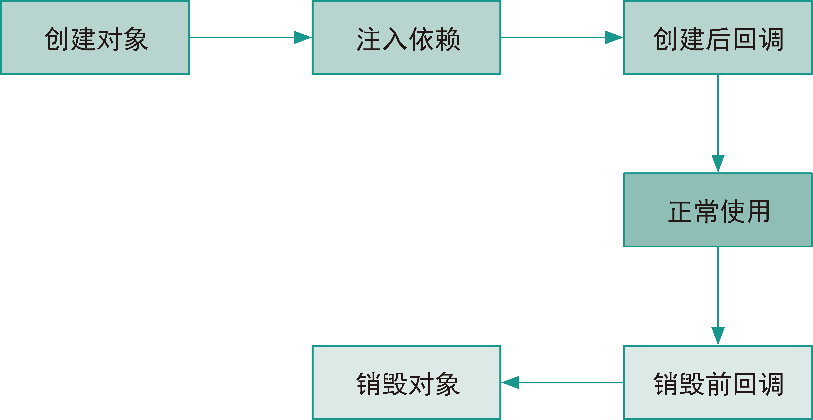

# IoC

[TOC]

## 概述

Spring 家族中的主要成员：

- **Spring Framework**：提供了依赖注入、AOP、容器、资源管理等特性。
- **Spring Boot**：包含了健康检查、监控、度量指标、外化配置等生产所需的功能，降低了开发生产级 Spring 应用的门槛。此外，它还提供了**起步依赖**（starter dependency）很好地解决了 Spring 应用的依赖管理困境。而且提供了**自动配置**来减少了 Spring 应用的配置
- **Spring Cloud**，它是一系列模块的集合，这些模块分别实现了服务发现、配置管理、服务路由、服务熔断、链路追踪等功能
- **Spring Data**，Spring Framework 为传统的关系型数据库操作提供了统一的抽象。

> SSH 的三个字母分别指代 Spring Framework、Struts 和 Hibernate。现在 Spring MVC 替代了 Struts


一个标准的 Maven 工程结构包含

-  pom.xml：包含工程元数据、依赖和插件配置
-  application.properties：工程的配置文件
- ApplicationTests：测试类
- Application：入口程序


## 容器 & 控制反转

**控制反转（Inversion of Control，IoC）**、**依赖注入（Dependency Injection）**与**面向切面编程（Aspect Oriented Programming，AOP）**是 Spring Framework 中最重要的概念。

首先我们来介绍下**「控制反转」（Inversion Of Control）**。这里的「控制」指的是对程序执行流程的控制，而「反转」指的是调用者与被调用者之间的控制权转移。例如，在没有使用框架之前，程序员自己控制整个程序的执行。在使用框架之后，整个程序的执行流程可以通过框架来控制（模板方法）。流程的控制权从程序员「反转」到了框架。

**依赖注入（Dependency Injection）**：不通过 new() 的方式在类内部创建依赖类对象，而是将依赖的类对象在外部创建好之后，通过构造函数、setter 函数等方式传递（注入）给类使用。也就是说，将对象的创建**控制反转**给上层来处理。

在实际的软件开发中，一些项目可能会涉及几十、上百、甚至几百个类，类对象的创建、依赖注入、组件之间依赖关系的处理会变得非常复杂。而这些工作跟具体的业务逻辑是无关的，此时我们完全可以抽象成框架来自动完成，从而减少手动装配出错的可能性。Spring Framework 的 IoC 容器正是基于依赖注入的思想，将组件内部的依赖管理、生命周期管理的逻辑抽离出来，从而让开发人员专注于业务逻辑的实现。


为了使用 Spring 的容器，需要在 pom.xml 文件中引入 `org.springframework:spring-beans` 依赖：

~~~xml
<dependency>
    <groupId>org.springframework</groupId>
    <artifactId>spring-beans</artifactId>
    <version>5.3.15</version>
</dependency>
~~~

在`resources/`目录下创建`.xml`配置文件

~~~xml
<?xml version="1.0" encoding="UTF-8"?>
<beans xmlns="http://www.springframework.org/schema/beans"
    xmlns:xsi="http://www.w3.org/2001/XMLSchema-instance"
    xsi:schemaLocation="http://www.springframework.org/schema/beans
        https://www.springframework.org/schema/beans/spring-beans.xsd">
</beans>
~~~

编写Bean对象

~~~java
public class Person { }
~~~

向配置文件中注册Bean对象

~~~xml
<bean id="person" class="${全限定包名}"></bean>
~~~

获取Bean对象

~~~java
public static void main(String[] args) throws Exception {
    // 加载配置
    BeanFactory factory = new ClassPathXmlApplicationContext("basic_dl/quickstart-byname.xml");
    
    // 获取 Bean 对象，按ID获取
    Person person = (Person) factory.getBean("person");
    
    // 获取 Bean 对象，按类名获取
    Person person = factory.getBean(Person.class);
}
~~~

`BeanFactory` 是容器的基础接口。`ApplicationContext` 接口继承了 `BeanFactory`，在它的基础上增加了更多企业级应用所需要的特性（国际化、事件发布、生命周期管理等等）。常见的 `ApplicationContext` 实现类如下：

| 类名                                 | 说明                                                    |
| ------------------------------------ | ------------------------------------------------------- |
| `ClassPathXmlApplicationContext`     | 从 CLASSPATH 中加载 XML 文件来配置 `ApplicationContext` |
| `FileSystemXmlApplicationContext`    | 从文件系统中加载 XML 文件来配置 `ApplicationContext`    |
| `AnnotationConfigApplicationContext` | 根据注解和 Java 类配置 `ApplicationContext`             |

如果要使用 `ApplicationContext`，那么需要在 pom.xml 文件中引入 `org.springframework: spring-context` 依赖。

~~~xml
<dependency>
    <groupId>org.springframework</groupId>
    <artifactId>spring-context</artifactId>
    <version>5.3.15</version>
</dependency>
~~~

然后在代码中使用 `ApplicationContext` 对象

~~~java
public class Application {
    public static void main(String[] args) {
        // 直接读取配置文件到容器中，比DefaultListableBeanFactory 和 XmlBeanDefinitionReader 的组合要简洁
        ApplicationContext applicationContext = new ClassPathXmlApplicationContext("beans.xml");
        
        Hello hello = applicationContext.getBean("hello", Hello.class);
    }
}
~~~


`Spring`容器之间存在着继承关系——子容器可以继承父容器中配置的组件。假设现在有两个 xml 文件`child-beans.xml`与`parent-beans.xml`。如果我们要指定`parent-beans`为`child-beans`的父配置，那么需要在代码中：

~~~java
public class Application {
    private ClassPathXmlApplicationContext parentContext;
    private ClassPathXmlApplicationContext childContext;


    public Application() {
        parentContext = new ClassPathXmlApplicationContext("parent-beans.xml");
        
        // 从这里指定继承关系
        childContext = new ClassPathXmlApplicationContext(
                new String[] {"child-beans.xml"}, true, parentContext);
        
        // 设置容器的标识符
        parentContext.setId("ParentContext");
        childContext.setId("ChildContext");
    }
}
~~~

现在我们说明继承容器中 Bean 的可见性和覆盖情况

- 子容器可以看到父容器中定义的 `Bean`，反之则不行
- 子容器中可以定义与父容器同 ID 的 `Bean`，它们各自都能获取自己定义的 Bean（覆写）。

通过容器的 `setAllowBeanDefinitionOverriding()` 方法可以设置覆盖同 ID Bean 的特性。如果参数设为 false，那么在 Spring 配置信息解析过程中，一旦遇到新的同名 Bean 定义，框架就会抛出异常。记得在调用后，要刷新容器。

## Beans

JavaBeans 是 Java 中一种特殊的类，它满足：

- 可序列化
- 提供 public 无参构造器
- 属性都是私有的，并且为每一个属性提供 getter、setter 方法


其中，Bean 是指**可复用软件组件**。Spring 容器也遵循这一惯例，因此将容器中管理的可复用组件称为 **Spring Bean**（以下简称 **Bean**）。在一个 Bean 的定义中，会包含如下部分：

- Bean 的名称，一般是 Bean 的 `id`，也可以为 Bean 指定别名（alias）；
- Bean 的具体类信息，这是一个全限定类名；（BO、VO、POJO等）
- Bean 的作用域，是单例（singleton）还是原型（prototype）；前者每次获取返回的是同一个 Bean，而后者每次获取返回的是一个新的对象。**通常来说 Prototype 对应有状态（Stateful）的 Bean 对象，而 Singleton 对象无状态（Stateless）的 Bean 对象**
- 依赖注入相关信息，构造方法参数、属性以及自动织入（autowire）方式；
- 创建销毁相关信息，懒加载模式、初始化回调方法与销毁回调方法。

### Bean 的 id、name 属性

`id`属性唯一地标识某个Bean对象

`name`属性用于定义Bean实例的别名（aliases），一个 Bean 实例可以有多个别名，在 name 属性中用`,`或`;`分隔各个别名即可：

~~~xml
<bean name="map,java_map;jdk_map" class="java.util.HashMap" />
~~~

如果一个 bean 标签未指定 id 属性，那么将 class 属性中的全限定类名作为 bean 的默认 id。如果有多个 bean 未指定 id，而且 class 属性值相同，那么会按照其出现的次序，分别给其的 id 设置为 「全限定类名#1」, 「全限定类名#2」

在同一个配置文件中，任意 Bean 对象之间的 id、name 属性值是禁止重复的

|                           非法配置                           |                       含义                       |
| :----------------------------------------------------------: | :----------------------------------------------: |
| `<bean id="map" class="java.util.HashMap" />`<br>`<bean id="map" class="java.util.HashMap" />` |              两个 bean 的 id 值重复              |
| `<bean name="map" class="java.util.HashMap" />` <br>`<bean name="map" class="java.util.HashMap" />` |             两个 bean 的 name 值重复             |
| `<bean id="map" class="java.util.HashMap" />`<br/>`<bean name="map" class="java.util.HashMap" />` | 第一个 bean 的 id 值与第二个 bean 的 name 值重复 |

### Bean的作用域

| 作用域类型  | 概述                                         |
| ----------- | -------------------------------------------- |
| singleton   | 一个 IOC 容器中只有一个【默认值】            |
| prototype   | 每次获取创建一个                             |
| request     | 一次请求创建一个（仅Web应用可用）            |
| session     | 一个会话创建一个（仅Web应用可用）            |
| application | 一个 Web 应用创建一个（仅Web应用可用）       |
| websocket   | 一个 WebSocket 会话创建一个（仅Web应用可用） |

Bean 的实例化时机：

- 对于 Singleton Bean 以及 FactoryBean（isEagerInit=true），都是伴随容器初始化而创建
- 而 FactoryBean（isEagerInit=false）、FactoryBean 创建的 Bean 、 Prototype Bean，都是在使用时延迟创建的（按需创建）

它们都是通过 getBean 方法来创建的

### Bean 的三种配置方式

Spring Framework 提供了多种不同风格的配置方式：

- 基于 XML  文件的配置

  - 在 XML 中编写 Bean 标签
  
- 基于注解的配置，是配合 Bean XML 或者 Java 配置类来一起使用的

  - Bean XML：`<context:component-scan base-package="learning.spring"/>`
  - Java配置类：`@ComposeScan`

- Java配置类一般和 SpringBoot 配合使用，兼容 XML 以及注解
  - `@Bean`
  - `@ComposeScan`，兼容注解
  - `@ImportResource`，兼容 XML


#### 基于 XML 文件的配置

有两种基本的注入方式：

- 基于构造方法的注入
- 基于 Setter 方法的注入

~~~java
public class Hello {
    private String name;
    public Hello(String name) {
        this.name = name;
    }
}
~~~

在对应的 XML 配置文件中，使用 `<constructor-arg/>` 来传入构造方法所需的内容

~~~xml
<bean id="hello" class="learning.spring.helloworld.Hello">
    <constructor-arg value="Spring"/>
</bean>
~~~

`<constructor-arg/>` 的可配置属性如下：

|  属性   |                    作用                     |
| :-----: | :-----------------------------------------: |
| `value` |                所要注入的值                 |
|  `ref`  |    所要注入的 Bean 对象，其值为 Bean ID     |
| `type`  |        通过类型来指定所要传入的参数         |
| `index` | 通过位置来指定所要传入的参数，从 0 开始计算 |
| `name`  |        通过命名来指定所要传入的参数         |

每一个`constructor-arg`标签都对应构造函数中的一个参数。所以有 N 个`constructor-arg`标签就对应具有 N 个参数的构造函数。


通过`<list>`、`<set>`、`<map>`等子标签，可以注入集合类型：

~~~xml
<bean class="live.sunhao.vo.Student">
	<constructor-arg>
		<list>
			<value>12</value>
			<value>Tomcat</value>
			<ref bean="other_bean"/>
			<bean class="java.lang.String">
				<constructor-arg value="This is a list"></constructor-arg>
			</bean>
		</list>
	</constructor-arg>
    
    <constructor-arg>
		<set>
			<value>12</value>
			<value>Tomcat</value>
			<ref bean="other_bean"/>
			<bean class="java.lang.String">
				<constructor-arg value="This is a set"></constructor-arg>
			</bean>
		</set>
	</constructor-arg>
    
    <constructor-arg>
		<map>
			<entry key="name" value="myself"></entry>
			<entry key="age" value="22"></entry>
			<entry key="now" value-ref="da"></entry>
		</map>
	</constructor-arg>
</bean>
~~~

如果 Map 的 key/value 的类型为基本类型或者 String，那么可以直接通过 key/value 属性来设置。如果是其他类类型，那么就需要通过 key-ref/value-ref 来设置。


通过`<property/>`标签，我们可以基于 Setter 方法来依赖注入。注意，Setter 只接受一个参数

~~~xml
<bean id="..." class="...">
    <!--name 为要注入的方法的名字-->
    <property name="xxx">
        <!-- 直接定义一个内部的Bean -->
        <bean class="..."/>
    </property>

    <property name="yyy">
        <!-- 定义依赖的Bean -->
        <ref bean="..."/>
    </property>

    <property name="zzz">
        <!-- 定义一个列表 -->
        <list>
            <value>aaa</value>
            <value>bbb</value>
        </list>
    </property>
</bean>
~~~


在 `<bean/>` 中可以通过 `autowire` 属性来设置使用何种自动装配的方式

|     名称      |                             说明                             |
| :-----------: | :----------------------------------------------------------: |
|     `no`      |                        不进行自动织入                        |
|   `byName`    | 若某个Bean对象的ID属性与所要注入的属性的名字匹配，那么就将该Bean对象注入到该属性中 |
|   `byType`    | 若某个Bean对象的Class属性与所要注入的属性的类型匹配，那么就将该Bean对象注入到该属性中 |
| `constructor` |        同 `byType`，但是通过构造函数的参数类型来匹配         |

~~~XML
<!-- 使用引用的方式 -->
<bean id="cat" class="com.wei.pojo.Cat"></bean>
<bean id="user" class="com.wei.pojo.User" autowire="byType">
    <property name="cat" ref="cat" />
</bean>

<!-- 使用autowire的方式-->
<bean id="user" class="com.wei.pojo.User" autowire="byType"></bean>
~~~

在使用自动装配时，需要注意以下事项：

- 开启自动织入后，仍可以手动设置依赖，手动设置的依赖优先级高于自动织入；
- 自动装配无法注入基本类型和字符串；
- 如果有多个匹配的Bean对象，那么就会抛出异常
- 对于集合类型，使用`byType`装配模式，此时将匹配到多个的Bean对象都依赖注入到该集合中，并不会像第三点那样抛出异常。

为了避免第三点中说到的问题，可以将

-  `<bean/>` 的 `autowire-candidate` 属性用来指定该bean是否可以被自动装配到其他的bean中。设置为 `false`即可。
-  将某一个候选 Bean 中的`<bean/>` 中的 `primary`属性 设置为 `true`


如何指定 Bean 的初始化顺序？

- 一般情况下，Spring 容器会根据依赖关系来决定 Bean 的初始化顺序。不过，有时 Bean 之间的依赖关系是循环的，容器可能无法按照我们的预期进行初始化。此时，我们可以通过`<bean/>` 的 `depends-on` 属性来指定当前 Bean 还要依赖哪些 Bean，来确定Bean的依赖顺序（`@DependsOn` 注解）

#### 基于注解的配置

我们需要在 xml 文件中写入以下配置，来启用基于注解的配置：

~~~xml
<context:component-scan base-package="learning.spring"/>
~~~

上述配置会扫描 `learning.spring` 包内的类。对于添加以下四个注解的类，Spring 容器把它们注册为 `Bean`对象

| 注解          | 说明                                                         |
| :------------ | :----------------------------------------------------------- |
| `@Component`  | 将类标识为普通的组件，即一个 Bean                            |
| `@Service`    | 将类标识为服务层的服务                                       |
| `@Repository` | 将类标识为数据层的数据仓库，一般是 DAO（Data Access Object） |
| `@Controller` | 将类标识为 Web 层的 Web 控制器（后来针对 REST 服务又增加了一个 `@RestController` 注解） |

`@Controller` 、`@Service` 、`@Repository`本质上都是`@Component`：

~~~java
@Component
public @interface Controller { ... }
~~~


~~~java
@Component("aaa")
public class Person { }
~~~

如果不指定 Bean 的名称，那么默认名称是首字母小写的类名（例如 `DepartmentServiceImpl` 的默认名称是 `departmentServiceImpl` ）。


在Spring Boot中，如果一个 @Component 类有多个构造器，Spring 会尝试选择一个最合适的构造器来实例化该类：

- 如果该类中只有一个构造器，Spring 会使用该构造器来实例化该类。
- 如果该类中有多个构造器，Spring 会首先尝试使用默认构造器（即无参构造器）来实例化该类。如果没有默认构造器，Spring会优先选择带有 @Autowired 注解的构造器（如果有的话），并将其用于实例化该类。
- 如果有多个构造器都带有 @Autowired 注解，Spring 会选择参数数量最多的构造器来实例化该类
- 如果有多个构造器的参数数量相同，则Spring会引发异常，因为无法确定应该使用哪个构造器。


如果要注入依赖，可以使用如下的注解：

| 注解         | 说明                                 |
| :----------- | :----------------------------------- |
| `@Autowired` | **根据类型注入依赖**                 |
| `@Resource`  | JSR-250 的注解，**根据名称注入依赖** |
| `@Inject`    | JSR-330 的注解，同 `@Autowired`      |


@Autowired 可以作用在构造函数、属性、setter上：

~~~java
@Service
public class ConstructorServiceImpl implements ConstructorService {
    // 1.属性注入
    @Autowired
    private UserService userService;
    
    // 2.构造函数注入（推荐）
    // 构造器参数列表过长的情况，可能是这个 Bean 承担的责任太多，应该考虑组件的责任拆解。
    @Autowired
    public ConstructorServiceImpl(UserService userService) {
        this.userService = userService;
    }
    
    // 2. 非显式的构造函数注入，无需Autowired
	public ConstructorServiceImpl(UserService userService) {
        this.userService = userService;
    }
    
    // 3. setter注入
    @Qualifier("userService2")
    @Autowired
    public void setUserService(UserService userService) {
        this.userService = userService;
    }
}
~~~

@Autowired 的注入逻辑如下：

1. 按照类型，来匹配类型与之相同的 Bean 对象（考虑向上兼容）
2. 如果有多个匹配的Bean，
   - 按被注入对象的属性名来继续匹配 Bean ID。
3. 否则默认抛出异常，如果设置了`@Autowired(required = false)`，那么返回`null`

@Autowired的细节

- 只有使用构造函数注入才能注入 final 字段
- 执行顺序：构造函数注入/构造函数 -> 字段注入/setter注入。这个执行顺序会有一些微妙的问题。

ObjectProvider 可以和 @Autowired 搭配使用

~~~java
@Autowired
public Dog(ObjectProvider<Person> person) {
    // 如果没有Bean，则采用缺省策略创建
    this.person = person.getIfAvailable(Person::new);
}
~~~


Spring可能会匹配到多个 Bean，此时这些 Bean 统称为**候选者（candidates）。**可以使用`@Primary`注解或者`@Qualifier` 注释来决定在冲突时使用哪一个Bean。优先级@Qualifier > @Primary 。**一般来说通过Primary来指定默认行为，而通过@Qualifier来指定特定行为。**

@Primary添加在候选者上，而@Qualifier添加在被注入的对象上（通常和@Autowired一起）。@Qualifier("foo")，将匹配 Bean 的 ID 为 foo 的 Bean。

此外，集合类型可以把所有指定类型的 Bean 都注入。可以避免上述冲突问题

~~~java
@Autowired
private List<Person> persons;
~~~


`@Resource`的注入逻辑

- 如果同时指定了 name 和 type，则注入同时匹配 name 和 type 的Bean
- 如果指定了name，则注入匹配ID的Bean
- 如果指定了type，则注入匹配类型的Bean
- 如果既没有指定name，又没有指定type，则首先按照 byName 方式进行装配；如果没有匹配，则按照 byType 方式进行装配


#### 基于 Java 类的配置

`Spring`配置类的定义例子：

```java
@Configuration
@ComponentScan("learning.spring")
@ImportResource("classpath:annotation/beans.xml")
@Import({ CongfigA.class, ConfigB.class })
public class Config {
    @Bean
    @Lazy
    @Scope("prototype")
    public Hello helloBean() {
        return new Hello();
    }
}
```

- `@Configuration` 注解表明这是一个 Java 配置类。实际上，它也是一个`@Component` 

  ~~~java
  //...
  @Component
  public @interface Configuration { ... }
  ~~~

  向 BeanFactory 注册配置类：

  ~~~java
  AnnotationConfigApplicationContext context = new AnnotationConfigApplicationContext(Config.class);
  ~~~

-  `@ComponentScan` 注解将指定包下的Bean对象（@Component、@Configuration等注解的类）添加到当前配置类中（兼容基于注解的配置）。 如果不写 `@ComponentScan` ，也是可以做到组件扫描的，可以在 `AnnotationConfigApplicationContext` 的构造方法中指定

  ~~~java
  ApplicationContext ctx = new AnnotationConfigApplicationContext("com.linkedbear.spring.annotation.c_scan.bean");
  ~~~

- `@ImportResource`将指定XML配置文件中的Bean对象添加到当前配置类中（兼容基于XML的配置）。 

- `@Import`导入其他配置类

- `@Bean` 注解表示该方法的返回对象会被当做容器中的一个 Bean

- `@Lazy` 注解说明这个 Bean 是延时加载的，

- `@Scope` 注解则指定了 `Bean`是原型的。


`@Bean` 注解的属性如下：

| 属性                | 默认值                                | 说明                                                 |
| :------------------ | :------------------------------------ | :--------------------------------------------------- |
| `name`              | `{}`                                  | Bean 的名称（相当于 xml 中的 id 属性），默认同方法名 |
| `value`             | `{}`                                  | 同 `name`                                            |
| `autowire`          | `Autowire.NO`                         | 自动织入方式                                         |
| `autowireCandidate` | `true`                                | 是否自动装配到其他 Bean 中                           |
| `initMethod`        | `""`                                  | 初始化方法名                                         |
| `destroyMethod`     | `AbstractBeanDefinition.INFER_METHOD` | 销毁方法名                                           |

AbstractBeanDefinition.INFER_METHOD表示在Bean销毁时，自动调用修饰符为 `public`、没有参数且方法名是 `close` 或 `shutdown` 的方法（`close`优于`shutdown`）。


在 Java 配置类中指定 Bean 之间的依赖关系有两种方式：

- 通过方法的参数注入依赖
- 直接调用类中带有 `@Bean` 注解的方法

~~~java
@Configuration
public class Config {
    @Bean
      public Foo foo() {
        return new Foo();
    }

    @Bean
    public Bar bar(Foo foo) {			// 方式1
        return new Bar(foo);
    }

    @Bean
    public Baz baz() {
        return new Baz(foo());		 	// 方式2
    }
}
~~~

Spring Framework 针对 `@Configuration` 类中带有 `@Bean` 注解的方法通过 CGLIB（Code Generation Library）做了特殊处理。对于返回单例Bean的方法，只会执行一次，之后的多次调用都直接返回相同的Bean对象，并不会执行该方法。

### Bean的获取

**优先通过 `ObjectProvider` 获取 Bean**。当容器中没有Bean，或者有多个未决候选者Bean时，那么就在编译时抛出异常。而通过ObjectProvider类型，可以将这些问题放在运行时来处理，例如：

~~~java
public IndexService(ObjectProvider<B> b) {
    // 在没有发现B类型的Bean对象时，返回`null`，而不是抛出异常。
	this.b = b.getIfAvailable();
}
~~~


getBean()再按类型查询时，要求只有一个符合类型的Bean对象，否则抛出`NoUniqueBeanDefinitionException`异常

~~~java
ctx.getBean(Color.class);
~~~

但是ApplicationContext提供了getBeansOfType，可以返回多个符合类型的Bean对象：

~~~java
ApplicationContext ctx = new ClassPathXmlApplicationContext("basic_dl/quickstart-oftype.xml");
Map<String, DemoDao> beans = ctx.getBeansOfType(DemoDao.class);
beans.forEach((beanName, bean) -> {
    System.out.println(beanName + " : " + bean.toString());
});
~~~

此外，还可以获取标有特定注解的Bean对象

~~~java
ApplicationContext ctx = new ClassPathXmlApplicationContext("basic_dl/quickstart-withanno.xml");
// 这里的Color是一个注解
Map<String, Object> beans = ctx.getBeansWithAnnotation(Color.class);
beans.forEach((beanName, bean) -> {
    System.out.println(beanName + " : " + bean.toString());
})
~~~

获取每一个Bean的名字：

~~~java
ApplicationContext ctx = new ClassPathXmlApplicationContext("basic_dl/quickstart-withanno.xml");
String[] beanNames = ctx.getBeanDefinitionNames();
Stream.of(beanNames).forEach(System.out::println);
~~~


如果未查找到Bean对象，会抛出`NoSuchBeanDefinitionException`异常。我们可以通过捕获异常来启用缺省策略：

~~~java
try {
    dog = ctx.getBean(Dog.class);
} catch (NoSuchBeanDefinitionException e) {
    // 找不到Dog时手动创建
    dog = new Dog();
}
~~~

这样编写代码并不优雅，好在ApplicationContext为我们提供了`containsBean()`方法，用于判断是否存在这样一个Bean

~~~java
Dog dog = ctx.containsBean("dog") ? (Dog) ctx.getBean("dog") : new Dog();
~~~

此外，还有`ObjectProvider`，它可以延迟查找：

~~~java
 // 下面的代码会报Bean没有定义 NoSuchBeanDefinitionException
// Dog dog = ctx.getBean(Dog.class);

// 这一行代码不会报错
ObjectProvider<Dog> dogProvider = ctx.getBeanProvider(Dog.class);
~~~

只有调用`ObjectProvider`的`getObject()`方法时，才去获取Bean对象。若未查找到，则抛出异常。它还有其他方法

~~~java
// 当未查找到时，调用Suppplier回调函数
Dog dog = dogProvider.getIfAvailable(Dog::new);

dogProvider.ifAvailable(dog -> System.out.println(dog));
~~~


## 定制容器与 Bean 的行为

### Bean的生命周期



可以通过以下三种方式来注册创建或销毁 Bean 时的回调：

- 实现 `InitializingBean` 和 `DisposableBean` 接口；

  - `InitializingBean` 接口有一个 `afterPropertiesSet()` 方法
  - `DisposableBean` 接口中的 `destroy()` 方法

- 使用 JSR-250 的 `@PostConstruct` 和 `@PreDestroy` 注解；

- 在 `<bean/>` 或 `@Bean` 里配置初始化和销毁方法。

  - 在 `<bean/>` 中指定 `destroy-method`，或者在 `@Bean` 中指定 `destroyMethod`。

  - 在 `<bean/>` 中指定 `init-method`，或者在 `@Bean` 中指定 `initMethod`。

    ~~~xml
    <context:annotation-config />
    <bean id="hello" class="learning.spring.helloworld.Hello" init-method="init" />
    ~~~
    
    ~~~java
    @Bean(initMethod="init")
    public Hello hello() {...}
    ~~~
    


无论是初始化还是销毁，Spring 都会按照如下顺序依次进行调用（销毁并不会逆序执行）：

1. 添加了 `@PostConstruct` 或 `@PreDestroy` 的方法；

2. 实现了 `InitializingBean` 的 `afterPropertiesSet()` 方法，或 `DisposableBean` 的 `destroy()` 方法；

3. 在 `<bean/>` 中配置的 `init-method` 或 `destroy-method`，`@Bean` 中配置的 `initMethod` 或 `destroyMethod`。

对于原型Bean来说，并不会像单例 Bean 那样在容器初始化时执行回调，而是在延迟创建（按需创建）时，执行初始化回调。并且在销毁时，不会执行`destroy-method` 标注的方法。

何时执行销毁回调

- 从容器中删除Bean时：`ctx.getBeanFactroy().destroyBean(pen);`
- 容器关闭时：`ctx.close();`	

对于初始化以及销毁方法的要求：

1. 方法无参数
2. 方法无返回值

### Aware 接口


| 接口名                         | 用途                             |
| ------------------------------ | -------------------------------- |
| BeanFactoryAware               | 注入 BeanFactory                 |
| ApplicationContextAware        | 注入 ApplicationContext          |
| EnvironmentAware               | 注入 Environment                 |
| ApplicationEventPublisherAware | 注入事件发布器                   |
| ResourceLoaderAware            | 注入资源加载器                   |
| BeanClassLoaderAware           | 注入加载当前 Bean 的 ClassLoader |
| BeanNameAware                  | 注入当前 Bean 的名称             |


例子：

~~~java
@Component
public class MyBean implements ApplicationContextAware, BeanNameAware {
    private ApplicationContext applicationContext;
	private String beanName;
    
    // 会回调此方法的。
    @Override
    public void setApplicationContext(ApplicationContext applicationContext) throws BeansException {
        this.applicationContext = applicationContext;
    }
    
    // 会回调此方法的。
	@Override
    public void setBeanName(String name) {
        this.beanName = name;
    }
    
    public void doSomthing() {
        // 通过ApplicationContext来获取Bean实例
        Stream.of(ctx.getBeanDefinitionNames())
            .forEach(System.out::println);
    }
}
~~~


### 事件机制

`ApplicationContext` 提供了一套事件机制，容器在特定条件时，会向实现 `ApplicationListener` 接口的类通知相应的 ApplicationEvent 事件。例如，`ApplicationContext` 在启动、停止、关闭和刷新时，分别会通知`ContextStartedEvent`、`ContextStoppedEvent`、`ContextClosedEvent` 和 `ContextRefreshedEvent` 事件。

SpringFramework 中内置的监听器接口是 `ApplicationListener`

~~~java
@FunctionalInterface
public interface ApplicationListener<E extends ApplicationEvent> extends EventListener {
	void onApplicationEvent(E event);
}
~~~

我们要自定义监听器，只需要实现这个 `ApplicationListener` 接口即可。

~~~java
@Component
public class ContextClosedEventListener implements ApplicationListener<ContextClosedEvent> {
    // 泛型参数指定要监听何种事件
    // 当事件发生时，就会调用该方法
    @Override
    public void onApplicationEvent(ContextClosedEvent event) {
        System.out.println("[ApplicationListener]ApplicationContext closed.");
    }
}
~~~

除了实现`ApplicationListener` 接口，还可以通过`@EventListener`来为特定事件注册回调函数：

~~~java
@Component
public class ContextClosedEventAnnotationListener {
    @EventListener
    // 通过参数类型指定要监听的数据
    public void onEvent(ContextClosedEvent event) {
        System.out.println("[@EventListener]ApplicationContext closed.");
    }
}
~~~

`@EventListener` 还有一些其他的用法，比如，在监听到事件后希望再发出另一个事件，这时可以将方法返回值从 `void` 修改为对应事件的类型

`@EventListener` 也可以与 `@Async` 注解结合，实现在另一个线程中处理事件。


`PayloadApplicationEvent`是`ApplicationEvent`的扩展，它能承载任何类型的数据：

~~~java
public class PayloadApplicationEvent<T> extends ApplicationEvent implements ResolvableTypeProvider {
	private final T payload;

	public PayloadApplicationEvent(Object source, T payload) {
		super(source);
		this.payload = payload;
	}
}
~~~

使用示例：

~~~java
public class PayloadObjectApplicationListener implements ApplicationListener<PayloadApplicationEvent> {
    
    @Override
    public void onApplicationEvent(PayloadApplicationEvent event) {
        System.out.println("监听到PayloadApplicationEvent ------> " + event.getPayload());
    }
}
~~~

如果指定了`PayloadApplicationEvent`的泛型为 `Integer` ，那就只会监听 `Integer` 类型的 payload 事件了。如果不指定具体的泛型，则会监听所有的 `PayloadApplicationEvent` 事件


我们还可以自定义事件，只需要继承`ApplicationEvent`即可

~~~java
public class CustomEvent extends ApplicationEvent {
    public CustomEvent(Object source) {
        super(source);
    }
}
~~~

然后，我们通过`ApplicationEventPublisher`来发布自定义事件即可

~~~java
@Component
public class CustomEventPublisher implements ApplicationEventPublisherAware {
    private ApplicationEventPublisher publisher;

    public void fire() {
        publisher.publishEvent(new CustomEvent("Hello"));
    }

    @Override
    public void setApplicationEventPublisher(ApplicationEventPublisher applicationEventPublisher) {
        this.publisher = applicationEventPublisher;
    }
}
~~~

子容器的事件会向上传播到父容器，父容器的事件不会向下传播。


### 关闭容器

Java 进程在退出（正常退出、抛出异常、System.exit）时，我们可以通过 `Runtime.getRuntime().addShutdownHook()` 方法添加一些钩子，在关闭进程时执行特定的操作。

`ConfigurableApplicationContext` 接口扩展自 `ApplicationContext`，其中提供了一个 `registerShutdownHook()`。`AbstractApplicationContext` 类实现了该方法，正是调用了前面说到的 `Runtime.getRuntime().addShutdownHook()`，并且还在其中调用了 `doClose()` 方法。

我们只要在创建 `AbstractApplicationContext` 时，覆写 `doClose()` 方法即可：
~~~java
ConfigurableApplicationContext context = new AbstractApplicationContext() {
    @Override
    protected void doClose() { super.doClose(); }

    @Override
    protected void refreshBeanFactory() throws BeansException, IllegalStateException {}

    @Override
    protected void closeBeanFactory() {}

    @Override
    public ConfigurableListableBeanFactory getBeanFactory() throws IllegalStateException { return null; }
};
~~~

### 容器的抽象

Spring Framework 针对研发和运维过程中的很多常见场景做了抽象处理。

#### 环境抽象

虽然有 JVM 这层隔离，但我们的程序还是需要应对不同的运行环境细节：比如使用了 WebLogic 的某些特性，会导致程序很难迁移到 Tomcat 上；此外，程序还要面对开发、测试、预发布、生产等环境的配置差异；在云上，不同可用区（availability zone）可能也有细微的差异。Spring Framework 的环境抽象可以简化大家在处理这些问题时的复杂度，代表程序运行环境的 `Environment` 接口包含两个关键信息——`Profile` 和 `Properties`

##### Profile

假设我们的系统在测试环境中不需要加载监控相关的 Bean，而在生产环境中则需要加载；亦或者针对不同的客户要求，A 客户要求我们部署的系统直接配置数据库连接池，而 B 客户要求通过 JNDI 获取连接池。此时，就可以利用 Profile 帮我们解决这些问题。

如果使用 XML 进行配置，可以在 `<beans/>` 的 `profile` 属性中进行设置，如果使用 Java 类的配置方式，添加 `@Profile` 注解，并在其中指定该配置生效的具体 `Profile`

~~~java
@Configuration
@Profile("dev")
public class DevConfig {
    @Bean
    public Hello hello() {
        Hello hello = new Hello();
        hello.setName("dev");
        return hello;
    }
}

@Configuration
@Profile("test")
public class TestConfig {
    @Bean
    public Hello hello() {
        Hello hello = new Hello();
        hello.setName("test");
        return hello;
    }
}

@Configuration
public class DataSourceConfiguration {
    @Bean
    @Profile("dev")
    public DataSource devDataSource() {
        return null;
    }
    @Bean
    @Profile("test")
    public DataSource testDataSource() {
        return null;
    }
    @Bean
    @Profile("prod")
    public DataSource prodDataSource() {
        return null;
    }
}
~~~

通过如下两种方式可以指定要激活的 `Profile`（多个 Profile 用逗号分隔）：

- `ConfigurableEnvironment.setActiveProfiles()` 方法指定要激活的 `Profile`

  ~~~java
  AnnotationConfigApplicationContext ctx = new AnnotationConfigApplicationContext(TavernConfiguration.class);
  // 给ApplicationContext的环境设置正在激活的profile
  ctx.getEnvironment().setActiveProfiles("city");
  ~~~

  这样写是错误的，因为`AnnotationConfigApplicationContext`只能刷新一次。推荐这样写

  ~~~java
  AnnotationConfigApplicationContext ctx = new AnnotationConfigApplicationContext();
  ctx.getEnvironment().setActiveProfiles("city");
  ctx.register(TavernConfiguration.class);
  ctx.refresh();
  ~~~

- `spring.profiles.active` 属性指定要激活的 `Profile`

- 启动程序时，在命令行中增加 `spring.profiles.active` 参数：

  ~~~shell
  java -Dspring.profiles.active="dev" -jar xxx.jar
  ~~~

  

##### Properties

`PropertySource`对不同来源（系统属性、JVM属性、命令行参数、属性文件）的属性值做了抽象，以及**外部化配置**。我们可以通过以下两种方式获取属性值：

- `Environment`对象

  ~~~java
  @Component
  public class Hello {
      @Autowired
      private Environment environment;
  
      public void hello() {
          System.out.println("foo.bar: " + environment.getProperty("foo.bar"));
      }
  }
  ~~~

-  `@Value` 注解，不支持注入到静态字段中。

  ~~~java
  //`${}` 引用配置文件中的变量
  @Value("${red.name}")
  private String name;
  
  @Value("${red.order}")
  private Integer order;
  
  // 这里使用了一个常量，并不是SpEL表达式
  @Value("1")				
  private Integer age;
  ~~~
  
  @Value 还支持 SpEL 表达式。SpEL 的语法统一用 **`#{}`** 表示
  
  - 算术运算符：加（+）、减（-）、乘（*）、除（/）、求余 （%）、幂（^）、求余（MOD）和除（DIV）等算术运算符
  - 关系运算符：等于（==）、不等于（!=）、大于（>）、大 于等于（>=）、小于（<）、小于等于（<=）、区间（between）运算 等。例如：#{2>3}的值为false。
  - 逻辑运算符：与（and）、或（or）、非（!或NOT）
  - 字符串运算符：连接（+）和截取（[ ]）。例如：#{'Hello ' + 'World!'}的结果为“Hello World!”；#{'Hello World!'[0]} 截取第一个字符“H”
  - 三目运算符
  - 正则表达式匹配符： matches。例如：#{'123' matches '\\d{3}' }返回true
  - 类型访问运算符： T(Type)。其中，“Type”表示某个Java类型，实际上对应于Java类的 java.lang.Class实例。Type必须是类的全限定名（包括包名），但是 核心包“java.lang”中的类除外。例如：T(String)表示访问的是 java.lang.String类，#{T(String).valueOf(1)}表示将整数1转换成字符串。
  - 变量引用符：SpEL 提供了一个上下文变量的引用符“#”
  
  
  
  
  
  我们可以在配置类上添加`@PropertySource("classpath:basic_di/value/red.properties")`，其中注解值为属性文件的路径。那么 @Value 可以从属性文件中获取属性值。

#### 任务抽象

Spring Framework 通过 `TaskExecutor` 和 `TaskScheduler` 这两个接口分别对任务的异步执行与定时执行进行了抽象

 `TaskExecutor`是在`java.util.concurrent.Executor`的基础上又做了一层封装。`TaskExecutor` 有很多实现，例如：

- `SyncTaskExecutor`
- `SimpleAsyncTaskExecutor`
- `ConcurrentTaskExecutor`
- `ThreadPoolTaskExecutor`

我们可以像下面这样直接配置一个 `ThreadPoolTaskExecutor`：

~~~xml
<bean id="taskExecutor" class="org.springframework.scheduling.concurrent.ThreadPoolTaskExecutor">
    <property name="corePoolSize" value="4"/>
    <property name="maxPoolSize" value="8"/>
    <property name="queueCapacity" value="32"/>
</bean>

<!--等价配置-->
<task:executor id="taskExecutor" pool-size="4-8" queue-capacity="32"/>
~~~

在配置好了 `TaskExecutor` 后

- 在依赖注入后，可以直接调用它的 `execute()` 方法，并传入一个 `Runnable` 对象

- 在方法上使用 `@Async` 注解

  ~~~java
  @Async("taskExecutor")
  public void runAsynchronous() {...}
  ~~~

  为了让该注解生效，需要在配置类上增加 `@EnableAsync` 注解，或者在 XML 文件中增加 `<task:annotation-driven/>` 配置。


`TaskScheduler`对定时任务有着很好的支持。

- 在依赖注入后，可以直接调用它的 schedule() 方法

- 也可以使用 @Scheduled 注解

  ~~~java
  @Scheduled(fixedRate=1000) // 每隔1000ms执行
  public void task1() {...}
  
  @Scheduled(fixedDelay=1000) // 每次执行完后等待1000ms再执行下一次
  public void task2() {...}
  
  @Scheduled(initialDelay=5000, fixedRate=1000) // 先等待5000ms开始执行第一次，后续每隔1000ms执行一次
  public void task3() {...}
  
  @Scheduled(cron="0 15 15 * * 1-5") // 按Cron表达式执行
  public void task4() {...}
  ~~~

  为了让该注解生效，需要在Java配置类上增加 `@EnableScheduling` 注解，或者在 XML 文件中增加 `<task:annotation-driven/>` 配置。


## 模块装配

定义 EnableXXXX 注解，并添加`@Import`注解：

~~~java
@Documented
@Retention(RetentionPolicy.RUNTIME)
@Target(ElementType.TYPE)
@Import		// 这里应该向 @Import 应该注册一些类，但省略掉了
public @interface EnableTavern {}
~~~

在配置类上添加该注解：

~~~java
@Configuration
@EnableTavern
public class TavernConfiguration {}
~~~

这样，通过`@Import`注册的类，可以添加到该配置类上。

`@Import`的定义：

~~~java
@Documented
public @interface Import {
	/**
	 * {@link Configuration @Configuration}, {@link ImportSelector},
	 * {@link ImportBeanDefinitionRegistrar}, or regular component classes to import.
	 */
	Class<?>[] value();
}
~~~

向 @Import 注册的三种方式：

- 在 @Import 接口中，直接导入「类」，或者「配置类」

  ~~~java
  @Import({Boss.class, BartenderConfiguration.class})
  ~~~

- 编写一个实现`ImportSelector` 接口的类（通过类名来加载）

  ~~~java
  public class BarImportSelector implements ImportSelector {
      
      @Override
      public String[] selectImports(AnnotationMetadata importingClassMetadata) {
          // 返回要导入类的全限定类名
          return new String[] {Bar.class.getName(), BarConfiguration.class.getName()};
      }
  }
  
  ~~~

  然后在`@Import`注解中，注册该`ImportSelector`实现类即可

  ~~~java
  @Import(BarImportSelector.class)
  ~~~

- 编写一个实现`ImportBeanDefinitionRegistrar` 接口的类（通过 BeanDefinition 来加载）

  ~~~java
  public class WaiterRegistrar implements ImportBeanDefinitionRegistrar {
      
      @Override
      public void registerBeanDefinitions(AnnotationMetadata metadata, BeanDefinitionRegistry registry) {
          // 通过 BeanDefinitionRegistry 注册 Bean
          registry.registerBeanDefinition("waiter", new RootBeanDefinition(Waiter.class));
      }
  }
  ~~~
  
  然后在`@Import`注解中，注册该`ImportBeanDefinitionRegistrar`实现类即可
  
  ~~~java
  @Import({WaiterRegistrar.class})
  ~~~

## 条件装配

条件装配的一个注解是`@Profile`，在环境抽象一节中介绍过，不再阐述。

另一个是`@Conditional`注解。被 `@Conditional` 注解标注的组件，只有所有指定条件都匹配时，才有资格注册。如果 `@Configuration` 配置类被 `@Conditional` 标记，则与该类关联的所有 `@Bean` 的工厂方法，`@Import` 注解和 `@ComponentScan` 注解也将受条件限制。

`@Conditional` 注解中需要传入`Condition` 实现类的数组，这里它们的定义：

~~~java
@Target({ElementType.TYPE, ElementType.METHOD})
@Retention(RetentionPolicy.RUNTIME)
@Documented
public @interface Conditional {
    Class<? extends Condition>[] value();
}
~~~

~~~java
@FunctionalInterface
public interface Condition {
    boolean matches(ConditionContext context, AnnotatedTypeMetadata metadata);
}
~~~

下面给出一个使用示例（注意，这里我们使用了派生注解，下面有对此做解释）：

~~~java
@Documented
@Retention(RetentionPolicy.RUNTIME)
@Target({ElementType.TYPE, ElementType.METHOD})
@Conditional(OnBeanCondition.class)
public @interface ConditionalOnBean {
    String[] beanNames() default {};
}
~~~

~~~java
public class OnBeanCondition implements Condition {
    @Override
    public boolean matches(ConditionContext context, AnnotatedTypeMetadata metadata) {
        // 获取派生注解，并读取派生注解中的beanNames元素值。
        String[] beanNames = (String[]) metadata
            .getAnnotationAttributes(ConditionalOnBean.class.getName())
            .get("beanNames");
        return true;
    }
}
~~~

~~~java
@Bean
@ConditionalOnBean(beanNames = "com.linkedbear.spring.configuration.c_conditional.component.Boss")
public Bar bbbar() {
    return new Bar();
}
~~~

> 在 Java 中，如果一个注解被 `@Target(ElementType.TYPE)` 或 `@Target(ElementType.ANNOTATION_TYPE)` 标注，那么，该注解可以标注其它注解。被标注的注解称为**复合注解（Composed Annotation）**。这类似于继承的关系，但是派生注解不仅**不继承**元素，还要必须设置没有默认值的元素。
>
> ~~~java
> @Target(ElementType.TYPE)
> @Retention(RetentionPolicy.RUNTIME)
> public @interface Zero {
> 	String value() default "";
> }
> 
> 
> @Target(ElementType.TYPE)
> @Retention(RetentionPolicy.RUNTIME)
> @Zero("114514")
> public @interface One {
> 	String value() default "";
> }
> 
> @One
> class App { }
> ~~~
>
> 获取注解的注解
>
> ~~~java
> One annotationOne = App.class.getAnnotation(One.class);  
> Class<? extends Annotation> classOne = annotationOne.annotationType(); 
> Zero annotationZero = classOne.getAnnotation(Zero.class);
> ~~~

## 装配实战

需求：通过标注一个 `@EnableJdbc` 的注解，能够根据当前工程中所导入的数据库连接驱动，注册对应的数据源到 IOC 容器中去。

### V1

~~~java
@Documented
@Retention(RetentionPolicy.RUNTIME)
@Target(ElementType.TYPE)
@Import(JdbcConfiguration.class)
public @interface EnableJdbc {}
~~~

下面我们编写条件装配

~~~java
@Documented
@Retention(RetentionPolicy.RUNTIME)
@Target({ElementType.TYPE, ElementType.METHOD})
@Conditional(OnClassNameConditional.class)
public @interface ConditionalOnClassName {
    String value();
}
~~~

~~~java
public class OnClassNameConditional implements Condition {
    
    @Override
    public boolean matches(ConditionContext context, AnnotatedTypeMetadata metadata) {
        String className = (String) metadata.getAnnotationAttributes(ConditionalOnClassName.class.getName()).get("value");
        try {
            Class.forName(className);
            return true;
        } catch (ClassNotFoundException e) {
        	return false;
        }
    }
}
~~~

编写被@Import 导入的配置类 `JdbcConfiguration`：

~~~java
@Configuration
public class JdbcConfiguration {
    @Bean
    @ConditionalOnClassName("com.mysql.jdbc.Driver")
    public DataSource dataSource() {
        DruidDataSource dataSource = new DruidDataSource();
        dataSource.setDriverClassName("com.mysql.jdbc.Driver");
        dataSource.setUrl("jdbc:mysql://localhost:3306/test?characterEncoding=utf8");
        dataSource.setUsername("root");
        dataSource.setPassword("123456");
        return dataSource;
    }
    
    @Bean
    @ConditionalOnClassName("h2")
    public DataSource dataSource() {
        DruidDataSource dataSource = new DruidDataSource();
        dataSource.setDriverClassName("h2");
        dataSource.setUrl("jdbc:h2://localhost:3306/test");
        // ...
    }
}
~~~

这一版有以下问题：

1. 配置都是写死在配置类
2. 数据源的装配重复

### V2

创建一个 `jdbc.properties` 文件：

~~~java
jdbc.url=jdbc:mysql://localhost:3306/test?characterEncoding=utf8
jdbc.username=root
jdbc.password=123456
~~~

用 `EnvironmentAware` 向 `JdbcConfiguration` 注入 `Environment` ，然后每个 `DataSource` 的创建就可以使用 `Environment` 的取值了：

~~~java
private EnvironmentAware environment
@Override
void setEnvironmentAware(EnvironmentAware environment) {
    this.environment = environment;
}

@Bean
@ConditionalOnClassName("com.mysql.jdbc.Driver")
public DataSource mysqlDataSource() {
    DruidDataSource dataSource = new DruidDataSource();
    dataSource.setDriverClassName("com.mysql.jdbc.Driver");
    dataSource.setUrl(environment.getProperty("jdbc.url"));
    dataSource.setUsername(environment.getProperty("jdbc.username"));
    dataSource.setPassword(environment.getProperty("jdbc.password"));
    return dataSource;
}
~~~

这样就可以做到外化配置了。

### V3

首先介绍一下**SPI（Service Provider Interface 服务提供接口）**，它通过「**服务寻找**」的机制，动态加载接口 / 抽象类对应的具体实现类。

我们先来看 JDK 的 SPI。所有定义的 SPI 文件都必须放在工程的 `META-INF/services` 目录下，且文件名必须命名为接口 / 抽象类的全限定名，文件内容为接口 / 抽象类的具体实现类的全限定名。SPI 文件的示例：

~~~java
com.linkedbear.spring.configuration.z_spi.bean.DemoMySQLDaoImpl
com.linkedbear.spring.configuration.z_spi.bean.DemoOracleDaoImpl
~~~

测试代码：

~~~java
public static void main(String[] args) throws Exception {
    ServiceLoader<DemoDao> serviceLoader = ServiceLoader.load(DemoDao.class);
    serviceLoader.iterator().forEachRemaining(dao -> {
        // 这里的 dao 对象的类型就是DemoDao接口/抽象类的实现类
        System.out.println(dao);
    });
}
~~~

然后我们再来看 SpringFramework 的 SPI，它可不像 JDK SPI 那样，局限于接口 / 抽象类，而是可以服务发现任何一个类、接口、注解。所有定义的 SPI 文件都必须放在工程的`META-INF` 下，且文件名必须为 `spring.factories`，key 是要服务发现的对象，而 value 是实现它的类，如果有多个类，那么用逗号分割。SPI 文件的示例：

~~~properties
com.linkedbear.spring.configuration.z_spi.bean.DemoDao=\
  com.linkedbear.spring.configuration.z_spi.bean.DemoMySQLDaoImpl,\
  com.linkedbear.spring.configuration.z_spi.bean.DemoOracleDaoImpl
~~~

测试代码：

~~~java
 // 加载并实例化
List<DemoDao> demoDaos = SpringFactoriesLoader
	.loadFactories(
    	DemoDao.class, 
    	SpringSpiApplication.class.getClassLoader());

demoDaos.forEach(dao -> {
    System.out.println(dao);
});
/**
com.linkedbear.spring.configuration.z_spi.bean.DemoMySQLDaoImpl@7506e922
com.linkedbear.spring.configuration.z_spi.bean.DemoOracleDaoImpl@4ee285c6
*/

// 只加载全限定类名
List<String> daoClassNames = SpringFactoriesLoader
	.loadFactoryNames(
    	DemoDao.class, 
    	SpringSpiApplication.class.getClassLoader());
daoClassNames.forEach(className -> {
    System.out.println(className);
});
/**
com.linkedbear.spring.configuration.z_spi.bean.DemoMySQLDaoImpl
com.linkedbear.spring.configuration.z_spi.bean.DemoOracleDaoImpl
*/
~~~

下面我们就用 Spring SPI 机制来实现需求：

首先将每个 Bean 数据源单独拆分到不同的配置类中

~~~java
@Configuration
@ConditionalOnClassName("com.mysql.jdbc.Driver")
public class MySQLJdbcConfiguration extends AbstractJdbcConfiguration {
    @Bean
    public DataSource dataSource() {
        DruidDataSource dataSource = new DruidDataSource();
        dataSource.setDriverClassName("com.mysql.jdbc.Driver");
        dataSource.setUrl(environment.getProperty("jdbc.url"));
        dataSource.setUsername(environment.getProperty("jdbc.username"));
        dataSource.setPassword(environment.getProperty("jdbc.password"));
        return dataSource;
    }
}
//...
~~~

然后把几个配置类都声明到 `spring.factories` 中

~~~properties
com.linkedbear.spring.configuration.e_enablejdbc.config.EnableJdbc=\
  com.linkedbear.spring.configuration.e_enablejdbc.config.MySQLJdbcConfiguration,\
  com.linkedbear.spring.configuration.e_enablejdbc.config.OracleJdbcConfiguration,\
  com.linkedbear.spring.configuration.e_enablejdbc.config.H2JdbcConfiguration
~~~

通过 `ImportSelector`加载全限定名对应的类：

~~~java
public class JdbcConfigSelector implements ImportSelector {
    @Override
    public String[] selectImports(AnnotationMetadata importingClassMetadata) {
        List<String> configClassNames = SpringFactoriesLoader
                .loadFactoryNames(EnableJdbc.class, this.getClass().getClassLoader());
        return configClassNames.toArray(new String[0]);
    }
}
~~~

之后，在 `@EnableJdbc` 注解上，把这个 `JdbcConfigSelector` 导入进去：

~~~java
@Documented
@Retention(RetentionPolicy.RUNTIME)
@Target(ElementType.TYPE)
@Import(JdbcConfigSelector.class)
public @interface EnableJdbc {}
~~~

### v4

在拆分配置类时，我们很容易注意到代码重复性高。我们可以使用 BeanDefinition 来消除冗余代码：

~~~java
public class DataSourceRegisterPostProcessor implements BeanDefinitionRegistryPostProcessor, EnvironmentAware {
    
    private Environment environment;
    
    @Override
    public void postProcessBeanDefinitionRegistry(BeanDefinitionRegistry registry) throws BeansException {
        BeanDefinitionBuilder builder = BeanDefinitionBuilder.rootBeanDefinition(DruidDataSource.class)
                .addPropertyValue("url", environment.getProperty("jdbc.url"))
                .addPropertyValue("username", environment.getProperty("jdbc.username"))
                .addPropertyValue("password", environment.getProperty("jdbc.password"));
        
        // 根据当前classpath下的数据库连接驱动添加driverClassName
        List<String> driverClassNames = SpringFactoriesLoader.
            loadFactoryNames(Driver.class, this.getClass().getClassLoader());
        
        String driverClassName = null;
        for (String temp : driverClassNames) {
            try {
                Class.forName(temp);
                driverClassName = temp;
                break;
            } catch (ClassNotFoundException ignored) {
                // 加载失败，classpath 下无当前驱动，继续下一个
            }
        }
        // 存在驱动，注册DataSource
        if (driverClassName != null) {
            builder.addPropertyValue("driverClassName", driverClassName);
            registry.registerBeanDefinition("dataSource", builder.getBeanDefinition());
        }
    }
    
    @Override
    public void postProcessBeanFactory(ConfigurableListableBeanFactory beanFactory) throws BeansException {}
    
    @Override
    public void setEnvironment(Environment environment) {
        this.environment = environment;
    }
}
~~~

编写配置类：

~~~java
@Configuration
public class JdbcConfiguration {

    @Bean
    public DataSourceRegisterPostProcessor dataSourceRegisterPostProcessor() {
        return new DataSourceRegisterPostProcessor();
    }
}
~~~

在  `@EnableJdbc`中导入这个配置类：

~~~java
@Documented
@Retention(RetentionPolicy.RUNTIME)
@Target(ElementType.TYPE)
@Import(JdbcConfiguration.class)
public @interface EnableJdbc {}
~~~


## 依赖查找 & 依赖注入

- 依赖查找

  - `getBean` ：根据 **name** 获取 / 根据 **Class** 获取指定的 bean

  - `ofType` ：根据 **Class** 获取容器中所有指定类型的 bean

  - `withAnnotation` ：获取标注了指定注解的 bean

  - `getBeanDefinitionNames` ：获取容器中的所有 bean 的 name

  - `getBeanProvider` ：延迟查找，先获取 `ObjectProvider` 后获取实际的对象，如果不存在可使用缺省值代替

- 依赖注入


  - xml 配置文件
    - 借助 `<property>` 标签给带有 setter 方法的属性赋值 / 注入依赖对象
    - 借助 `<constructor-arg>` 标签使用 bean 的构造器注入依赖对象 / 属性赋值
    
    
    - 注解驱动方式
      - 使用 `@Value` 给普通属性赋值
      - 使用 `@Autowired` / `@Resource` / `@Inject` 注解给组件依赖注入
      - 借助 `ObjectProvider` 可以实现组件延迟注入


  - 借助 `Aware` 系列接口实现回调注入


- 依赖注入通常借助一个上下文**被动**的接收（标注 `@Autowired` 注解 / `<property>` 标签配置），推荐可以做到解耦
- 依赖查找通常**主动**使用上下文搜索（拿到 `BeanFactory` / `ApplicationContext` 之后主动调用 `getBean` 方法）
