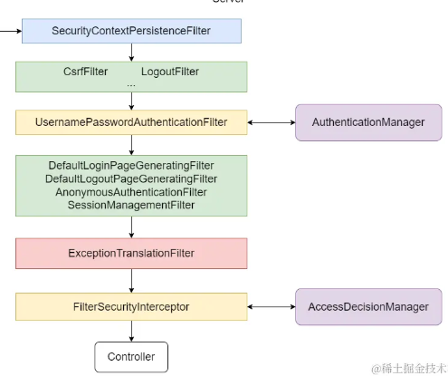
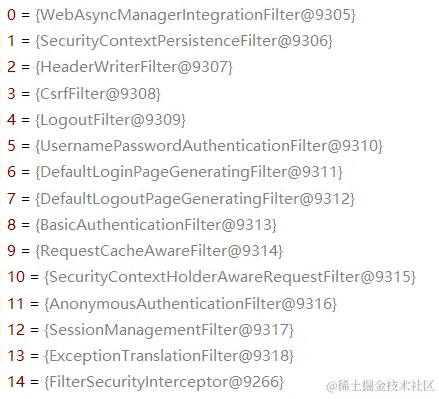
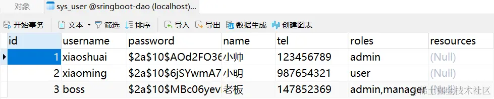
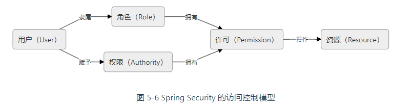
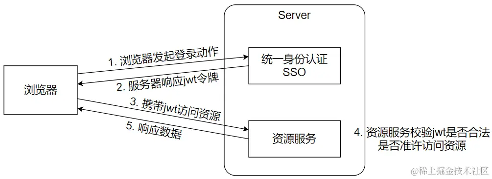
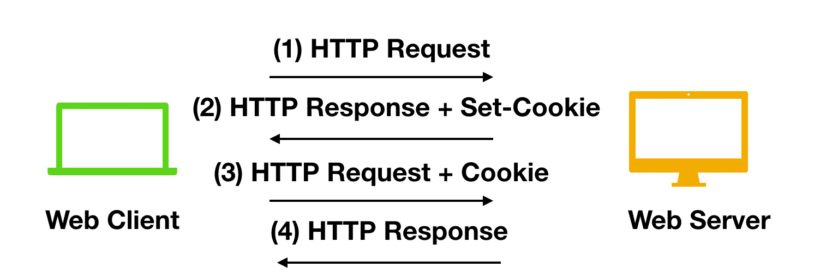
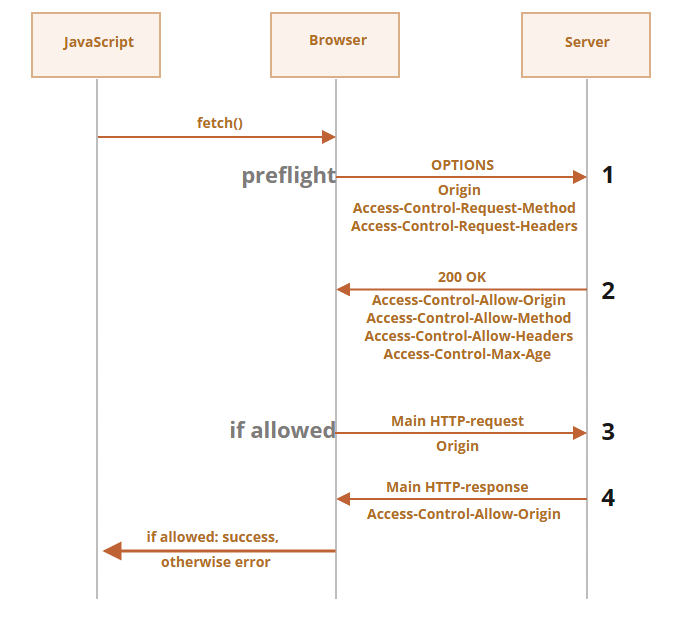

# Spring Security

[TOC]

- **Authentication 认证**，验证用户是否在系统中存在。
- **Authorization 授权**，验证用户是否拥有访问某个系统资源的权限。

## 过滤链

原生的 `Filter` 是属于 Servlet 容器生命周期的，为了使基于 IOC 容器的 `Filter` 整合进 Servlet 容器的生命周期，SpringFramework 扩展了一个 `DelegatingFilterProxy` 来做代理适配。也就是说，将本来注册到 IOC 容器中的 `Filter` ，挂载到 Servlet 容器的应用上，这样就可以实现 IOC 容器中注册的 `Filter` 也能参与 `Servlet` 访问的过滤。

`Spring Security` 针对不同安全需求提供了大量过滤器：

- `WebAsyncManagerIntegrationFilter` ：把 SecurityContext 设置到异步线程中
- `SecurityContextPersistenceFilter`：它能够让后续的过滤器以及业务代码中，能够全局获取到当前登录人的信息；
  - 当前登录人的获取方式：`SecurityContextHolder.getContext()` ，从返回的 `SecurityContext` 中可以获取到 `Authentication` 对象
  - `Authentication` 对象的实现类包含 `UsernamePasswordAuthenticationToken` 、`RememberMeAuthenticationToken` 、`AnonymousAuthenticationToken` 等

- `CsrfFilter` ：跨站请求伪造的核心过滤器，会对所有 POST 、PUT 、DELETE 类请求进行验证，检查其中提交的数据是否包含于 CSRF 相关的 Token 信息，如果没有则会响应 403 拒绝访问
- `LogoutFilter` ：精准匹配指定的注销登录请求（默认是 `/logout` ），以实现用户注销登录，清除认证信息的功能；
- `UsernamePasswordAuthenticationFilter` ：它会精准匹配指定的登录请求（默认是 `/login` ），通过收集用户名和密码信息，来进行认证；
  1. 调用 AbstractAuthenticationProcessingFilter.doFilter() 方法执行过滤器
  2. 调用 UsernamePasswordAuthenticationFilter.attemptAuthentication() 方法
  3. 调用 AuthenticationManager.authenticate() 方法
- `DefaultLoginPageGeneratingFilter` ：生成默认登录页的过滤器，如果我们没有使用 `http.loginPage(xxx)` 方法指定登录页，则由它生成内置的表单登录页；
- `DefaultLogoutPageGeneratingFilter` ：生成默认注销确认页的过滤器，无论我们如何配置，它都会生成；也就是说，它必定会拦截 GET 方式请求的 `/logout` 路径
- `BasicAuthenticationFilter` ：提供一个 HTTP basic 的认证方式，这个过滤器会自动截取请求头中 `Authentication` ，且内容是以 `Basic` 开头的数据，之后按照特定的规则解析出用户名和密码；
- `RememberMeAuthenticationFilter`：处理记住我功能的过滤器
- `AnonymousAuthenticationFilter` ：当 `UsernamePasswordAuthenticationFilter` 和 `BasicAuthenticationFilter` 都没有有效提取并封装用户信息时，会由该过滤器生成一个匿名用户的信息 `AnonymousAuthenticationToken` ，并保存到 `SecurityContextHolder` 中；
- `ExceptionTranslationFilter` ：它可以收集并处理整个过滤器链上的异常并转换；
- `FilterSecurityInterceptor` ：它会根据当前登录信息，以及正在访问的资源路径，判定是否准许访问；

完整的过滤链如下：

SpringSecurity过滤器链采用的是责任链的设计模式，它有一条很长的过滤器链：

- ChannelProcessingFilter：ChannelProcessingFilter 通常是用来过滤哪些请求必须用 https 协议， 哪些请求必须用 http协议， 哪些请求随便用哪个协议都行
- ConcurrentSessionFilter：ConcurrentSessionFilter 主要用来判断 session 是否过期，以及更新最新的访问时间。
- WebAsyncManagerIntegrationFilter：用于将SecurityContext集成到Spring异步执行机制中
- SecurityContextPersistenceFilter：SecurityContextPersistenceFilter 主要控制 SecurityContext 的在一次请求中的生命周期 。请求来临时，创建SecurityContext 安全上下文信息，请求结束时清空 SecurityContextHolder 。SecurityContextPersistenceFilter 通过 HttpScurity#securityContext() 及相关方法引入其配置对象SecurityContextConfigurer 来进行配置。
- HeaderWriterFilter：HeaderWriterFilter 用来给 http 响应添加一些 Header ,比如 X-Frame-Options , X-XSSProtection， X-Content-Type-Options 。
- CorsFilter：跨域相关的过滤器。
- CsrfFilter：CsrfFilter 用于防止 csrf 攻击，一旦开启了CSRF（默认开启），所有经过 springsecurity 的 http请求以及资源都会被 CsrfFilter 拦截，仅仅 GET|HEAD|TRACE|OPTIONS 这4类方法会被放行（只读请求，不会改变服务器状态），也就是说post、delete 等方法依旧是被拦截掉。在你使用 jwt 等 token 技术时，是不需要这个的。
- LogoutFilter：LogoutFilter 是处理注销的过滤器。
- OAuth2AuthorizationRequestRedirectFilter：和上面的有所不同，这个需要依赖 spring-scurity-oauth2 相关的模块。该过滤器是处理 OAuth2 请求首选重定向相关逻辑的。
- Saml2WebSsoAuthenticationRequestFilter：这个需要用到 Spring Security SAML 模块，这是一个基于 SMAL 的 SSO 单点登录请求认证过滤器。
- X509AuthenticationFilter：X509 认证过滤器。
- AbstractPreAuthenticatedProcessingFilter：AbstractPreAuthenticatedProcessingFilter 处理经过预先认证的身份验证请求的过滤器的基类，目的是从传入请求中提取主体上的必要信息
- CasAuthenticationFilter：CAS 单点登录认证过滤器 。依赖 Spring Security CAS 模块
- OAuth2LoginAuthenticationFilter：这个需要依赖 spring-scurity-oauth2 相关的模块，OAuth2 登录认证过滤器，处理通过 OAuth2进行认证登录的逻辑。
- Saml2WebSsoAuthenticationFilter：这个需要用到 Spring Security SAML 模块，这是一个基于 SMAL 的 SSO 单点登录认证过滤器。
- UsernamePasswordAuthenticationFilter：处理用户以及密码认证的核心过滤器，认证请求提交的username 和 password 被封装成token 进行一系列的认证
- OpenIDAuthenticationFilter：基于OpenID 认证协议的认证过滤器，需要依赖额外的相关模块才能启用它。
- DefaultLoginPageGeneratingFilter：生成默认的登录页，默认 /login 。
- DefaultLogoutPageGeneratingFilter：生成默认的退出页，默认 /logout 。
- DigestAuthenticationFilter：Digest 身份验证是 Web 应用程序中流行的可选的身份验证机制 。DigestAuthenticationFilter 能够处理 HTTP 头中显示的摘要式身份验证凭据。
- BasicAuthenticationFilter：和Digest 身份验证一样都是Web 应用程序中流行的可选的身份验证机制 。BasicAuthenticationFilter 负责处理 HTTP 头中显示的基本身份验证凭据。这个 Spring Security的 Spring Boot 自动配置默认是启用的
- RequestCacheAwareFilter：用于用户认证成功后，重新恢复因为登录被打断的请求。当匿名访问一个需要授权的资源时会跳转到认证处理逻辑，此时请求被缓存。在认证逻辑处理完毕后，从缓存中获取最开始的资源请求进行再次请求
- SecurityContextHolderAwareRequestFilter：用来实现j2ee中 Servlet Api 一些接口方法, 比如 getRemoteUser 方法、isUserInRole 方法在使用 Spring Security 时其实就是通过这个过滤器来实现的
- JaasApiIntegrationFilter：适用于JAAS （ Java 认证授权服务）。 如果 SecurityContextHolder 中拥有的Authentication 是一个 JaasAuthenticationToken ，那么该 JaasApiIntegrationFilter 将使用包含在 JaasAuthenticationToken 中的 Subject 继续执行 FilterChain 。
- RememberMeAuthenticationFilter：处理记住我功能的过滤器
- AnonymousAuthenticationFilter：匿名认证过滤器。对于 Spring Security 来说，所有对资源的访问都是有 Authentication 的。对于无需登录（ UsernamePasswordAuthenticationFilter ）直接可以访问的资源，会授予其匿名用户身份
- SessionManagementFilter：Session 管理器过滤器，内部维护了一个SessionAuthenticationStrategy 用于管理 Session
- ExceptionTranslationFilter：主要来传输异常事件
- FilterSecurityInterceptor：这个过滤器决定了访问特定路径应该具备的权限，访问的用户的角色，权限是什么？访问的路径需要什么样的角色和权限？这些判断和处理都是由该类进行的。如果你要实现动态权限控制就必须研究该类 。
- SwitchUserFilter：SwitchUserFilter 是用来做账户切换的

## SecurityContext

在 Spring Security 中，有一个安全上下文的概念，用 `SecurityContext` 接口来表示。`SecurityContextHolder` 负责提供方法，来创建并维护当前的 `SecurityContext`

~~~java
public interface SecurityContext extends Serializable {
    Authentication getAuthentication();
    void setAuthentication(Authentication authentication);
}
~~~

 `Authentication` 接口表示当前用户的身份信息，由下面三个部分组成：

- **权限信息**，由 `GrantedAuthority` 接口来表示，描述了当前用户是什么角色的，能做什么。
- **证明信息**，通常就是密码，在身份认证通过后会清除该信息，避免信息泄露。
- **用户主体信息** 

~~~java
public interface Authentication extends Principal, Serializable {
    Collection<? extends GrantedAuthority> getAuthorities();
    Object getCredentials();
    Object getDetails();
    Object getPrincipal();
    boolean isAuthenticated();
    void setAuthenticated(boolean isAuthenticated) throws IllegalArgumentException;
}
~~~

- `getPrincipal()`方法，**当用户成功登录后**，可以通过调用`Authentication.getPrincipal()`方法获取到一个`UserDetails`对象，这个对象就是表示当前已认证用户的主体。

  ~~~java
  public interface UserDetails extends Serializable {
      Collection<? extends GrantedAuthority> getAuthorities();
      String getPassword();
      String getUsername();
      boolean isAccountNonExpired();
      boolean isAccountNonLocked();
      boolean isCredentialsNonExpired();
      boolean isEnabled();
  }
  
  ~~~

- `getAuthorities()` 方法用于返回一个表示用户已授权的权限的集合。

- `getCredentials()` 方法返回的是用户提供的用于进行身份验证的凭据，通常是密码。

- `getDetails()` 方法用于获取更详细的身份验证信息。这可能包括 IP 地址、证书细节或者自定义的信息。

当前用户实际上指的是当前这个请求所对应的用户。由于一个请求从开始到结束都由一个线程处理，所以在这段时间内，相当于这个线程跟当前用户是一一对应的。请求结束后，`SpringSecurity`将认证结果存储到 `Session`，对应的 `Key` 是：`SPRING_SECURITY_CONTEXT`，并且会生成一个与此 Session 相关联的 JSESSIONID。每次请求携带 JSESSIONID，再从 `Session` 对象中取回认证信息。

## 初步

在 SpringBoot 中，Security 的 Maven 依赖：

~~~xml
<dependency>
    <groupId>org.springframework.boot</groupId>
    <artifactId>spring-boot-starter-security</artifactId>
</dependency>
~~~

SpringBoot 整合 SpringSecurity 时，需要单独编写一个配置类，使其继承 `WebSecurityConfigurerAdapter` ，并标注 `@EnableWebSecurity` 注解。

~~~java
@EnableWebSecurity
@Configuration
public class WebSecurityConfiguration extends WebSecurityConfigurerAdapter {
    
    @Override
    protected void configure(HttpSecurity http) throws Exception {
        // 限制所有接口都需要认证后访问
        http.authorizeRequests().anyRequest().authenticated();
        
        // 开启表单登录功能
        http.formLogin();
    }
}
~~~

在 SpringBoot 3.X 中，`WebSecurityConfigurerAdapter`被移除了。这是因为框架的开发人员鼓励用户转向基于组件的配置。下面给出示例：

~~~java
@Configuration
public class SecurityConfiguration {
    @Bean
    public SecurityFilterChain filterChain(HttpSecurity http) throws Exception {
         http.authorizeRequests().antMatchers("/login").permitAll()
                .antMatchers("/users/**", "/settings/**").hasAuthority("Admin");
         http.headers().frameOptions().sameOrigin();
        
        return http.build();
    }     
}
~~~

## 登录、登出

**`formLogin()` 提供的一些常用配置**

|        配置方法        |           作用           |
| :--------------------: | :----------------------: |
| `usernameParameter()`  | 指定表单中的用户名字段名 |
| `passwordParameter()`  |  指定表单中的密码字段名  |
| `defaultSuccessUrl()`  |   登录成功后跳转的 URL   |
|     `failureUrl()`     |   登录失败后跳转的 URL   |
| `loginProcessingUrl()` |   处理验证的URL，POST    |
|     `loginPage()`      | 指定自己的登录页，GET。  |

**`logout()` 提供的一些常用配置方法**

|         配置方法          |                             作用                             |
| :-----------------------: | :----------------------------------------------------------: |
|       `logoutUrl()`       |             触发退出操作的 URL，默认是 `/logout`             |
|   `logoutSuccessUrl()`    |                     成功退出后跳转的 URL                     |
| `logoutSuccessHandler()`  | 指定自定义的 `LogoutSuccessHandler`，有这个设置 `logoutSuccessUrl()` 会失效 |
| `invalidateHttpSession()` |                    是否清理 HTTP Session                     |
|     `deleteCookies()`     |                       删除指定 Cookies                       |
|   `addLogoutHandler()`    | 添加 `LogoutHandler`，Spring Security 有好多该接口的实现，默认 `SecurityContextLogoutHandler` 会加在最后 |
| `logoutRequestMatcher()`  |                    设置退出请求的匹配规则                    |

Spring Security 中默认开启了 CSRF 防护，所以 `/logout` 也要求带有 CSRF 的 Token，而且必须要使用 `POST` 方法

下面这种链式调用已经被废除了

~~~java
formLogin.loginPage("/login").permitAll()
~~~

推荐使用回调版本的：

~~~java
http.formLogin(formLogin -> {
    formLogin.loginPage("/login").permitAll();
});
~~~

登录成功后，可以通过`successHandler()`回调函数的 `Authentication` 参数，获取到用户名等信息：

~~~java
formLogin
    .loginPage("/login").permitAll()
    .successHandler(new AuthenticationSuccessHandler() {
        @Override
        public void onAuthenticationSuccess(
            HttpServletRequest request, 
            HttpServletResponse response, 
            Authentication authentication) 
            throws IOException, ServletException {
            
            // 通过HttpServletResponse 返回一些自定义的JSON数据
			authentication.getAuthorities();
        }
    });
~~~

相应地，也有登录失败处理器`failureHandler`（处理用户名找不到的情况，即抛出`UsernameNotFoundException`异常）。

## 登录自定义

### Controller

我们可以在 Controller 层中自定义登录逻辑，此时就放弃了 formLogin 的登录逻辑。

~~~java
@RestController
public class TokenController {
    // 依赖注入一个验证器
    @Autowired
    private AuthenticationManager authenticationManager;
    

    @PostMapping("/login")
    public ResponseEntity<TokenResponse> createToken(
        String username,
        String password,
        String token
    ) {
        // 构建一个认证信息
        Authentication authentication =
                new UsernamePasswordAuthenticationToken(username, password, token);
        try {
            // 开始验证
            authenticationManager.authenticate(authentication);
            // 验证成功，一定要设置安全上下文
			SecurityContextHolder
                .getContext()
                .setAuthentication(authentication);
        	return ResponseEntity.ok();
        } catch (AuthenticationException e) {
         	// 验证失败
            return ResponseEntity.status(HttpStatus.FORBIDDEN);
        }
    }
}
~~~

`AuthenticationManager` 接口定义了 `Spring Security` 应该如何进行身份认证：

~~~java
public interface AuthenticationManager {
    Authentication authenticate(Authentication authentication) throws AuthenticationException;
}
~~~

而 `ProviderManager` 是`AuthenticationManager`的实现类，它持有多个认证器 `AuthenticationProvider`，认证逻辑如下：

~~~java
public class ProviderManager implements AuthenticationManager, MessageSourceAware, InitializingBean {
    private List<AuthenticationProvider> providers;
    
    public Authentication authenticate(Authentication authentication) throws AuthenticationException {
        Class<? extends Authentication> toTest = authentication.getClass();
        ... 
        while(var9.hasNext()) {
        	AuthenticationProvider provider = (AuthenticationProvider)var9.next();
            // 判断该 provider 是否支持验证该 authentication
        	if (provider.supports(toTest)) {
                ...
                try {
                    result = provider.authenticate(authentication);
                    if (result != null) {
                        // 讲 result 中的 details 复制到 authentication 中
                        this.copyDetails(authentication, result);
                        break;
                        // 认证成功，直接退出
                    }
                }
                ...
            }
            ...
        }
        ...
    }
}
~~~

认证器的接口定义如下：

~~~java
public interface AuthenticationProvider {
    Authentication authenticate(Authentication authentication) throws AuthenticationException;

    boolean supports(Class<?> authentication);
}
~~~

SpringSecurity 默认提供一个`DaoAuthenticationProvider`来做检验。我们可以注入一个自己的认证器，来代替这个默认的`DaoAuthenticationProvider`。这样就可以在登录时做额外的检测逻辑。

~~~java
@Component
public class SmsCodeAuthenticationProvider implements AuthenticationProvider {
    @Autowired
    private UserDetailsService userDetailsService; // 获取认证数据源
    
    @Override
    public Authentication authenticate(Authentication authentication) throws AuthenticationException {
       
        // 认证逻辑的处理
    }
}
~~~

此外，还可以通过实现`Authentication`接口，封装更多的验证信息，例如验证码、JWT

### 过滤器

- 实现`Authentication`接口，封装更多的验证信息，例如验证码、JWT

- 一个自定义的过滤器，针对特定的请求，封装认证信息，调用**认证逻辑**。

  ~~~java
  public class SmsCodeAuthenticationProcessingFilter extends AbstractAuthenticationProcessingFilter {
      @Override
      public Authentication attemptAuthentication(HttpServletRequest request, HttpServletResponse response) throws AuthenticationException, IOException, ServletException {
  		// 构造认证信息
          Authentication authentication;
          
          // 开始认证
          return this.getAuthenticationManager().authenticate(authRequest);
      }
  }
  ~~~

- 一个 `AuthenticationProvider` 的实现类，提供**认证逻辑**

  

  ~~~java
  public class SmsCodeAuthenticationProvider implements AuthenticationProvider {
      private UserDetailsService userDetailsService; // 获取认证数据源
      
      @Override
      public Authentication authenticate(Authentication authentication) throws AuthenticationException {
          // 这里无需设置安全上下文，因为过滤器还未执行完成。
          
          // 认证逻辑的处理
      }
  }
  ~~~

- 定义认证成功以及失败的处理器

  ~~~java
  public class SmsCodeAuthenticationSuccessHandler implements AuthenticationSuccessHandler {
      @Override
      public void onAuthenticationSuccess(HttpServletRequest request, HttpServletResponse response, Authentication authentication) throws IOException, ServletException {
          response.setContentType("text/plain;charset=UTF-8");
          response.getWriter().write(authentication.getName());
      }
  }
  ~~~

  ~~~java
  public class SmsCodeAuthenticationFailureHandler implements AuthenticationFailureHandler {
      @Override
      public void onAuthenticationFailure(HttpServletRequest request, HttpServletResponse response, AuthenticationException exception) throws IOException, ServletException {
          response.setContentType("text/plain;charset=UTF-8");
          response.getWriter().write("认证失败");
      }
  }
  ~~~

- 组装

  ~~~java
  @Component
  public class SmsCodeAuthenticationSecurityConfig extends SecurityConfigurerAdapter<DefaultSecurityFilterChain, HttpSecurity> {
      
      @Override
      private final UserDetailsService userDetailsService;
  
      @Override
      public void configure(HttpSecurity http) {
          // 创建过滤器
          SmsCodeAuthenticationProcessingFilter smsCodeAuthenticationFilter = new SmsCodeAuthenticationProcessingFilter();
          
          // 为过滤器设置认证器管理器
  		smsCodeAuthenticationFilter
      		.setAuthenticationManager(http.getSharedObject(AuthenticationManager.class));
          
          // 为过滤器设置成功处理器
          smsCodeAuthenticationFilter
              .setAuthenticationSuccessHandler(new SmsCodeAuthenticationSuccessHandler());
          
          smsCodeAuthenticationFilter
              .setAuthenticationFailureHandler(new SmsCodeAuthenticationFailureHandler());
  
          // 创建过滤器
          SmsCodeAuthenticationProvider smsCodeAuthenticationProvider = new SmsCodeAuthenticationProvider();
          smsCodeAuthenticationProvider.setUserDetailsService(userDetailsService);
  
          // 注册认证器，注册过滤器
          http
              .authenticationProvider(smsCodeAuthenticationProvider)
              .addFilterAfter(
              	smsCodeAuthenticationFilter,
              	UsernamePasswordAuthenticationFilter.class);
      }
  }
  ~~~

  

## 认证源

`Spring Security`支持各种来源的用户验证数据，包括内存、数据库等。它们被抽象为一个`UserDetailsService`接口，任何实现了`UserDetailsService` 接口的对象都可以作为**进行认证的数据源**。

SrpingSecurity提供了两个`UserDetailsService`的实现类：

- `InMemoryUserDetailsManager`
- `JdbcUserDetailsManager`

~~~java
public interface UserDetailsService {
    UserDetails loadUserByUsername(String username) throws UsernameNotFoundException;
}
~~~

`InMemoryUserDetailsManager` 的示例：

~~~java
@Configuration
@EnableWebSecurity
public class SecurityConfig {
    
    // 用户校验数据的来源
	@Bean
    public UserDetailsService userDetailsService() {
        // 在内存中保存了两个用户
        UserDetails user1 = User.withUsername("admin")
            .password("123456")
            .roles("admin", "user").build();
        
        UserDetails user2 = User.withUsername("user")
            .password("123456").
            roles("user").build();
        
       	return new InMemoryUserDetailsManager(user1, user2);
    }
    
    // 必须提供一个加密器
    @Bean
    public PasswordEncoder passwordEncoder() {
         
    }
}
~~~

`JdbcUserDetailsManager` 提供了一个默认的数据库表`org/springframework/security/core/userdetails/jdbc/users.ddl`。这张表通常并不满足我们的业务需求。为此我们必须自定义数据库的认证与授权：

~~~java
@Service
public class UserService implements UserDetailsService {
    @Override
    UserDetails loadUserByUsername(String username) throws UsernameNotFoundException; {
        List<User> users = userDao.findAllByUsername(username);
        if (users.isEmpty()) {
            throw new UsernameNotFoundException(username);
        }
        User.UserBuilder userBuilder = org.springframework.security.core.userdetails.User
                .withUsername(user.getUsername()).password(user.getPassword());
        if (StringUtils.hasText(user.getRoles())) {
            userBuilder = userBuilder.roles(user.getRoles().split(","));
        }
                                                
        return userBuilder.build();
    }
}
~~~

注册这个认证源

~~~java
@Autowired
private UserDetailsService userDetailsService;

@Override
protected void configure(HttpSecurity http) throws Exception {
    http.userDetailsService(userDetailsService);
}
~~~

## 加密

`SpringSecurity`要求我们提供一个`PasswordEncoder`，用于将密码加密。我们使用`PasswordEncoderFactories.createDelegatingPasswordEncoder()` 可以创建一个包含大量算法的 `PasswordEncoder` 实例:

~~~java
// 直接通过配置类来注册加密器即可
@Bean
PasswordEncoder passwordEncode() {
    return new PasswordEncoderFactories.createDelegatingPasswordEncoder();
}
~~~

在解码时，这个实例会根据密文的前缀自动选择解码器：

| 前缀        | 对应的 `PasswordEncoder` 实现  |
| :---------- | :----------------------------- |
| `{noop}`    | `NoOpPasswordEncoder`          |
| `{bcrypt}`  | `BCryptPasswordEncoder`        |
| `{pbkdf2}`  | `Pbkdf2PasswordEncoder`        |
| `{scrypt}`  | `SCryptPasswordEncoder`        |
| `{SHA-1}`   | `MessageDigestPasswordEncoder` |
| `{SHA-256}` | `MessageDigestPasswordEncoder` |
| `{sha256}`  | `StandardPasswordEncoder`前缀  |

使用实例：

~~~java
// 加密
@Autowired
PasswordEncoder encoder;

public void foo() {
    user = new User();
    user.setUsername("xiaoming");
    user.setPassword(passwordEncoder.encode("654321"));
    userDao.save(user);
}
~~~

## 权限控制

用户权限就是添加`ROLE_`前缀的权限，SpringSecurity 会自动帮我们处理好这个前缀的。以自定义验证逻辑下的授权管理为例：

1. 在表中定义好授权字段，类型为 string。一个用户若有多个授权，则用逗号分割。
2. 在 UserDetailsService 中，解析这授权字段。确保这些字段可以被 getAuthorities() 获取。

在Spring Security 中，有四种常见的控制资源权限的方式：

- Ant 表达式
- 授权注解 +  SpEl 表达式
- 过滤器注解
- 动态权限

SpringSecurity 中的访问控制模型：

Role 和 Authority 完全共享同一套存储结构，唯一的差别仅是 Role 会在存储时自动带上“ROLE_”前缀罢了。在使用上，权限可以更加细粒度地管理 Permission。

### Ant 表达式

利用Ant表达式实现权限控制进行静态权限检查，如果检查未通过，那么就会抛出异常并会返回`403 Forbidden`状态码。

~~~java
@Configuration
@EnableWebSecurity
//@EnableWebSecurity会开启SpringSecurity，并注册大量的Servlet Filter
public class SecurityConfig {

    @Bean
    public SecurityFilterChain securityFilterChain(HttpSecurity http) throws Exception {
        http.authorizeHttpRequests(authorizationHttpRequests -> {
            	// 说明哪些用户可以访问资源
                authorizationHttpRequests
                    .requestMatchers("/login").hasRole("admin")
                    .requestMachers("/user").hasAnyRole("admin", "user")
                    .anyRequest().permitAll();		// 剩下的请求，无需登录
            }
        );
        
        // permitAll 无需登录
        // authenticated 无需权限，但需要登录
        // hasAuthority 需要权限，需要登录
        
        // 新版本 Spring Security 6.0 已经弃用 antMatchers()
        // 用 requestMatchers() 替代 antMatchers() 即可
        http.authorizeRequests()
            .antMatchers("/", "/home", "/css/**", "/js/**").permitAll()  // 这些路径无需认证
            .anyRequest().authenticated();  // 其他请求则需要登录
        
        
        http.authorizeHttpRequests(authorizationHttpRequests -> {
            	// 说明用户带有哪些权限可以访问资源
                authorizationHttpRequests
                    .requestMatchers("/login").hasAuthority("admin:api")
                    .requestMatchers("/user").hasAuthority("admin:api", "user:api");
            }
        );
    }
}
~~~

这里说明一下`requestMathcers`的匹配规则：

| 符号 |       含义        |
| :--: | :---------------: |
|  ?   |   任意单个字符    |
|  *   | 0到任意数量的字符 |
|  **  |   0到任意个目录   |

### 授权注解

下面介绍利用授权注解结合SpEl表达式实现权限控制。我们可以在方法上添加授权注解来权限控制，常用的授权注解有3个：

- @PreAuthorize：方法执行前进行权限检查；
- @PostAuthorize：方法执行后进行权限检查；
- @Secured：类似于 @PreAuthorize，简化了角色权限的编写

我们首先需要使用@EnableGlobalMethodSecurity注解，来开启授权注解功能：

~~~java
@Configuration
@EnableGlobalMethodSecurity(prePostEnabled = true,securedEnabled = true)
public class SecurityConfig  {
    ...
    ...
}
~~~

然后在具体的接口方法上利用授权注解进行权限控制，代码如下：

~~~java
@RestController
public class UserController {
 
    @Secured({"ROLE_USER"})			// 只有拥有'ROLE_USER'角色的用户才能访问此方法
    @PreAuthorize("hasRole('USER')")	// 同上
    
    @PreAuthorize("permitAll()")	// 所有的用户，包括即使没有经过身份验证的用户，也都可以访问。
    
    @PreAuthorize("@ph.check('USERx')") // 首先要通过名称为 "ph" 的bean（可能是一个权限检查服务）的 "check" 方法进行一次安全检查。在此标记下，只有当 "@ph.check('USERx')" 的调用返回true时，才会允许该方法被调用。
    @GetMapping("/user/hello")
    public String helloUser() {
        return "hello, user";
    }
 
    @PreAuthorize("hasRole('ADMIN')")
    @GetMapping("/admin/hello")
    public String helloAdmin() {
        return "hello, admin";
    }
 
    @PreAuthorize("#age>100")
    @GetMapping("/age")
    public String getAge(@RequestParam("age") Integer age) {
 
        return String.valueOf(age);
    }
 
    @GetMapping("/visitor/hello")
    public String helloVisitor() {
        return "hello, visitor";
    }
 
}
~~~

这个注解可以使你的安全控制规则非常明确和直观，但是同时也有缺点，因为它把安全控制规则和你的业务代码耦合在一起

### 过滤器注解

接着介绍使用过滤器注解实现**数据权限控制**。在 Spring Security 中还提供了另外的两个注解，即 @PreFilter 和 @PostFilter，这两个注解可以对集合类型的参数或返回值进行过滤。即 Spring Security 将移除对应表达式结果为 false 的元素。也就是说权限的控制粒度在数据级别。

~~~java
@RestController
public class FilterController {
    /**
     * 只返回结果中id为偶数的user元素。
     * filterObject是@PreFilter和@PostFilter中的一个内置表达式，表示集合中的当前所遍历到的对象。
     */
    @PostFilter("filterObject.id%2==0")
    @GetMapping("/users")
    public List<User> getAllUser() {
        List<User> userList = new ArrayList<>(Arrays.asList(
                new User(1L,"admin","123456"),
                new User(2L,"test","123456"),
                new User(3L,"王五","123456"),
                new User(4L,"赵六","123456"),
                new User(5L,"小王","123456"),
                new User(6L,"小张","123456")
        ));
        return userList;
    }

~~~

~~~java
@PostFilter("filterObject.userName == authentication.principal.username")

@PostFilter("hasRole('USER') and filterObject.userName == authentication.principal.username")
~~~

~~~java
@Service
public class FilterService {
    /**
     * 当@PreFilter标注的方法内拥有多个集合类型的参数时，
     * 可以通过@PreFilter的filterTarget属性来指定当前是针对哪个参数进行过滤的。
     */
    @PreFilter(filterTarget = "ids", value = "filterObject%2==0")
    public List<Integer> doFilter(List<Integer> ids, List<User> users) {
        log.warn("ids=" + ids.toString());
        log.warn("users=" + users.toString());
        return ids;
    }

}
~~~

### 动态注解

最后介绍最常用的权限控制方法：**使用过滤器实现动态权限控制！**。此时，资源权限必须在数据库中存储了。

`AuthorizationFilter`已经实现了动态权限控制的大部分的逻辑，我们只需实现`AuthorizationManager`接口即可

~~~java
public class AuthorizationFilter extends GenericFilterBean {
    // ...
}
~~~

~~~java
public interface AuthorizationManager<T> {
    default void verify(Supplier<Authentication> authentication, T object) {
        AuthorizationDecision decision = this.check(authentication, object);
        if (decision != null && !decision.isGranted()) {
            throw new AccessDeniedException("Access Denied");
        }
    }

    @Nullable
    AuthorizationDecision check(Supplier<Authentication> authentication, T object);
}

~~~

实现的逻辑

~~~java
@Component
public class MyAuthorizationManager implements AuthorizationManager<RequestAuthorizationContext> {
    
    @Autowired
    RoleMapper roleMapper;
    
    @Override
    void verify(
        Supplier<Authentication> authentication, 
        T object) {
        
        // 当前用户的权限信息
        Collection<? extends GrantedAuthority> authorities = authenticationSupplier.get().getAuthorities();
        
        // 我们可以获取携带的查询参数
        Map<String, String> variables = requestAuthorizationContext.getVariables();
        
        // 获取URL
        String requestURI = requestAuthorizationContext.getRequest().getRequestURI();
        
        // 获取原始 request 对象
        HttpServletRequest request = requestAuthorizationContext.getRequest();
        
        // 根据URL、当前用户的权限信息以及对应的权限（@Mapper）做出进一步判断
        
        //  授权失败
	    // throw new AccessDeniedException()
    }
}
~~~

## 异常

**Spring Security** 中的异常主要分为两大类：一类是认证异常（`AuthenticationException`），另一类是授权相关的异常（`AccessDeniedException`）。

**HTTP 401 错误 - 未授权(Unauthorized)**，一般来说该错误消息表明您首先需要登录

**HTTP 403 错误 - 被禁止(Forbidden)** 出现该错误表明您在访问受限资源时没有得到许可

`exceptionHandling()`用于统一处理异常。

~~~java
http.exceptionHandling(e -> {
    e.accessDeniedHandler(new AccessDeniedHandler() {
        @Override
        public void handle(
            HttpServletRequest request, 
            HttpServletResponse response, 
            AccessDeniedException accessDeniedException) 
            throws IOException, ServletException {
            
            System.out.println("Fail");
        }
    });
});
~~~

## 记住我

Spring Security 里为我们提供了一个 `RememberMeServices` 抽象，由它来实现“记住我”功能，默认有几个实现：

- `NullRememberMeServices`，空实现，即不提供「记住我」功能，`UsernamePasswordAuthenticationFilter` 内部默认使用了这个实现；

- `TokenBasedRememberMeServices`，通过 `Cookie` 中的一段经 `BASE64` 编码的令牌来实现「记住我」功能，实现较为简单；

  ~~~xml
  base64(用户名 + ":" + 失效时间 + ":" + md5Hex(用户名 + ":" + 失效时间 + ":" + 密码 + ":" + 私钥))
  ~~~

  这样服务器就可以根据令牌来将用户信息放入到安全上下文中了

- `PersistentTokenBasedRememberMeServices`，通过持久化的令牌来实现「记住我」功能，这里的持久化可以是在内存里的（这严格上不算真正的持久化），也可以是持久化到数据库里的。

一个示例：

~~~java
http.rememberMe(e -> e.rememberMeParameter("rememberMe").key("i*24qg}{bp}"));
~~~

**`rememberMe()` 中常用的配置方法**

| 配置方法                 | 作用                                                         |
| :----------------------- | :----------------------------------------------------------- |
| `key()`                  | 设置 `md5Hex()` 时使用的私钥                                 |
| `rememberMeParameter()`  | 请求中表示是否要“记住我”的参数名，默认是 `remember-me`       |
| `rememberMeCookieName()` | 在 Cookies 中保存令牌的 Cookie 名称，默认是 `remember-me`    |
| `tokenValiditySeconds()` | 令牌的有效时间，默认两周                                     |
| `userDetailsService()`   | 设置用来根据用户名获取用户信息的 `UserDetailsService`        |
| `alwaysRemember()`       | 是否始终开启“记住我”功能                                     |
| `tokenRepository()`      | 设置用于保存持久化令牌的 `PersistentTokenRepository`，设置了这个后，就会使用 `PersistentTokenBasedRememberMeServices`，否则是 `TokenBasedRememberMeServices` |

## JWT

一个 jwt 令牌包含以下的 3 部分组成：

- **header** 头部：包含令牌的类型（通常就是 `JWT` ）以及使用的哈希算法（ RSA 、HMAC 、SHA256 等）
- **payload** 载荷：包含用户的信息，这部分是我们自定义的，还有一些 jwt 预定义的
- **signature** 签名：签名的部分会将前两部分使用 Base64 编码后连接起来，并进行一次签名（加密）操作

最终的这 3 部分内容会使用 Base64 编码，分别生成一串内容，最后用英文句号（.）连接

在 SpringSecurity 中整合 jwt：

~~~xml
<!-- jwt -->
<dependency>
    <groupId>io.jsonwebtoken</groupId>
    <artifactId>jjwt-api</artifactId>
    <version>0.11.5</version>
</dependency>
<dependency>
    <groupId>io.jsonwebtoken</groupId>
    <artifactId>jjwt-impl</artifactId>
    <version>0.11.5</version>
</dependency>
<dependency>
    <groupId>io.jsonwebtoken</groupId>
    <artifactId>jjwt-jackson</artifactId>
    <version>0.11.5</version>
</dependency>
~~~

1. 封装载荷对象

   ~~~java
   public class TokenPayload {
       private String id;
       private User user;
       private Date expiration;
       // ......
   }
   ~~~

2. 封装 jwt 工具类

   ~~~java
   public abstract class JsonUtils {
   
       public static final ObjectMapper OBJECT_MAPPER = new ObjectMapper();
   
       // json -> Map
       public static Map<String, Object> parseObject(String json) {
           if (StringUtils.hasText(json)) {
               return parseObject(json, Map.class);
           }
           return new HashMap<>();
       }
   
       // json -> 指定类型
       public static <T> T parseObject(String json, Class<T> type) {
           try {
               return OBJECT_MAPPER.readValue(json, type);
           } catch (IOException e) {
               throw new JsonParseException(e);
           }
       }
       
       // 对象 -> json
       public static String toJson(Object obj) {
           if (obj == null) {
               return "";
           }
           try {
               return OBJECT_MAPPER.writeValueAsString(obj);
           } catch (JsonProcessingException e) {
               throw new JsonParseException(e);
           }
       }
   }
   ~~~
   
   ~~~java
   public abstract class JwtUtils {
       
       
       public static final String JWT_PAYLOAD = "user";
       
       // 响应头
       public static final String JWT_HEADER = "authorization";
       
       // 分割 jwt 与刷新令牌的标识
       public static final String JWT_SLIPTER = "abcdefg.uvwxyz";
       
       public static final char ENCODE_CHAR = 'a';
       
       // 向客户端返回 jwt 访问令牌
       public static void writeJwtToken(
           HttpServletResponse response, 
           User user, 
           PrivateKey privateKey,
           int accessExpire) {
           
           String jwtToken = JwtUtils.generateJwtToken(user, privateKey, accessExpire);
           response.addHeader(JWT_HEADER, jwtToken);
       }
       
       // 刷新 jwt 令牌
       public static void refreshJwtToken(
           HttpServletResponse response, 
           User user, 
           PrivateKey privateKey, 
           int refreshExpire) {
           
           String refreshToken = JwtUtils.generateRefreshToken(user, privateKey, refreshExpire);
           response.addHeader(JWT_HEADER, jwtToken + JWT_SLIPTER + refreshToken);
       }
       
       // 生成 jwt 令牌
       public static String generateJwtToken(User user, PrivateKey privateKey, int expire) {
           // 1. Claims 是一个键值对，其中的信息可以是任何东西。Claims 信息被加入到 JWT 的 payload 部分。
           // 2. 在 JWT 规范中，定义了一些预先定义的 claims，这些预定义的 claims 称为 Registered Claims，包括 "iss" (发行人)，“sub”(主题)，"aud" (观众)，"exp" (过期时间)，"nbf" (不早于)，"iat" (颁发时间) 和 "jti" (JWT ID)
           // 3. .setId() 在设置的是一个预定义的 Claim，名为 "jti"（JWT ID）。
           return Jwts.builder()
               .claim(JWT_PAYLOAD, JsonUtils.toJson(user))
               .setId(createJtl())
               .setExpiration(new Date(System.currentTimeMillis() + expire * 1000))
               .signWith(privateKey, SignatureAlgorithm.RS256)
               .compact();
       }
       
       // 生成刷新令牌
       public static String generateRefreshToken(User user, PrivateKey privateKey, int expire) {
           String tokenJson = JsonUtils.toJson(user);
           String encodedTokenJson = encodeRefreshToken(tokenJson);
           
           return Jwts.builder()
               .claim(JWT_PAYLOAD, encodedTokenJson)
               .setId(createJtl())
               .setExpiration(new Date(System.currentTimeMillis() + expire * 1000))
               .signWith(privateKey, SignatureAlgorithm.RS256)
               .compact();
       }
       
       // 解析 jwt 令牌
       public static TokenPayload parseToken(String token, PublicKey publicKey) {
           // 如果签名不对或者 JWT 已经过期，这个操作将失败并抛出异常。
           Jws<Claims> claimsJws = Jwts.parserBuilder().setSigningKey(publicKey).build().parseClaimsJws(token);
           
           Claims claims = claimsJws.getBody();
           
           // payload 实际上就是一个 key-value
           TokenPayload payload = new TokenPayload();
           payload.setId(claims.getId());
           payload.setExpiration(claims.getExpiration());
           
           String userPayload = claims.get(JWT_PAYLOAD).toString();
           User user = JsonUtils.parseObject(userPayload, User.class);
           payload.setUser(user);
           return payload;
       }
       
       // 解析 jwt 令牌中的载荷部分
       public static String  getTokenPayload(String token, PublicKey publicKey) {
           Jws<Claims> claimsJws = Jwts.parserBuilder().setSigningKey(publicKey).build().parseClaimsJws(token);
           Claims claims = claimsJws.getBody();
           return claims.get(JWT_PAYLOAD).toString();
       }
       
       public static String createJtl() {
           return new String(Base64.getEncoder().encode(UUID.randomUUID().toString().getBytes()));
       }
       
       // 编码 token 中的信息（在业务逻辑中可选）
       public static String encodeRefreshToken(String tokenJson) {
           StringBuilder sb = new StringBuilder(tokenJson.length() + 10);
           sb.append("refresh ");
           char[] chars = tokenJson.toCharArray();
           for (char c : chars) {
               c ^= ENCODE_CHAR;
               sb.append(c);
           }
           String encodedTokenJson = sb.toString();
           return new String(Base64Utils.encode(encodedTokenJson.getBytes()));
       }
       
       // 解码 token 中的信息 （在业务逻辑中可选）
       public static String decodeRefreshToken(String encodedToken) {
           if (!StringUtils.hasText(encodedToken)) {
               return "";
           }
           
           String encodedTokenJson = new String(Base64Utils.decode(encodedToken.getBytes()));
           if (encodedTokenJson.length() <= 8) {
               return "";
           }
           encodedTokenJson = encodedTokenJson.substring(8);
           StringBuilder sb = new StringBuilder(encodedTokenJson.length());
           char[] chars = encodedTokenJson.toCharArray();
           for (char c : chars) {
               c ^= ENCODE_CHAR;
               sb.append(c);
           }
           return sb.toString();
       }
   ~~~
   
   这里我们用密钥生成 Token，同时仅在服务器持有公玥，用来解析用密钥加密的 Token。
   
   ~~~java
   public abstract class RsaUtils {
       
       public static final int DEFAULT_KEY_SIZE = 2048;
       public static final String RSA_SECURT = "websecurity";
       
       /**
        * 根据路径加载公钥
        * @param filename
        * @return
        */
       public static PublicKey getPublicKey(String filename) {
           try {
               ClassPathResource resource = new ClassPathResource(filename);
               byte[] publicKeyBytes = FileCopyUtils.copyToByteArray(resource.getInputStream());
               byte[] decode = Base64Utils.decode(publicKeyBytes);
               X509EncodedKeySpec keySpec = new X509EncodedKeySpec(decode);
               KeyFactory keyFactory = KeyFactory.getInstance("RSA");
               return keyFactory.generatePublic(keySpec);
           } catch (IOException e) {
               throw new SecurityException("加载公钥文件失败！", e);
           } catch (NoSuchAlgorithmException | InvalidKeySpecException e) {
               throw new SecurityException(e.getMessage(), e);
           }
       }
       
       /**
        * 根据路径加载私钥
        * @param filename
        * @return
        */
       public static PrivateKey getPrivateKey(String filename) {
           try {
               ClassPathResource resource = new ClassPathResource(filename);
               byte[] privateKeyBytes = FileCopyUtils.copyToByteArray(resource.getInputStream());
               byte[] decode = Base64Utils.decode(privateKeyBytes);
               PKCS8EncodedKeySpec keySpec = new PKCS8EncodedKeySpec(decode);
               KeyFactory keyFactory = KeyFactory.getInstance("RSA");
               return keyFactory.generatePrivate(keySpec);
           } catch (IOException e) {
               throw new SecurityException("加载私钥文件失败！", e);
           } catch (NoSuchAlgorithmException | InvalidKeySpecException e) {
               throw new SecurityException(e.getMessage(), e);
           }
       }
       
       /**
        * 生成公钥、私钥
        * @param publicKeyFilename
        * @param privateKeyFilename
        * @param secret
        */
       public static void generateKey(String publicKeyFilename, String privateKeyFilename, String secret) {
           try {
               KeyPairGenerator keyPairGenerator = KeyPairGenerator.getInstance("RSA");
               SecureRandom secureRandom = new SecureRandom(secret.getBytes());
               keyPairGenerator.initialize(DEFAULT_KEY_SIZE, secureRandom);
               KeyPair keyPair = keyPairGenerator.genKeyPair();
               
               // 获取公钥并写出
               byte[] publicKeyBytes = keyPair.getPublic().getEncoded();
               publicKeyBytes = Base64.getEncoder().encode(publicKeyBytes);
               writeFile(publicKeyFilename, publicKeyBytes);
               
               // 获取私钥并写出
               byte[] privateKeyBytes = keyPair.getPrivate().getEncoded();
               privateKeyBytes = Base64.getEncoder().encode(privateKeyBytes);
               writeFile(privateKeyFilename, privateKeyBytes);
           } catch (NoSuchAlgorithmException e) {
               throw new SecurityException(e.getMessage(), e);
           }
       }
       
       private static void writeFile(String filename, byte[] bytes) {
           try {
               File file = new File(filename);
               if (!file.exists()) {
                   file.createNewFile();
               }
               Files.write(file.toPath(), bytes);
           } catch (IOException e) {
               throw new SecurityException("保存密钥文件失败！", e);
           }
       }
       
       public static void main(String[] args) {
           generateKey("D:/jwt_rsa.pub", "D:/jwt_rsa", RSA_SECURT);
       }
   }
   ~~~
   
   

准备工作完成后，下面我们就来将 jwt 融合到认证流程中：

~~~java
private PrivateKey privateKey;

@Override
protected void configure(HttpSecurity http) throws Exception {
    // ......

    // 开启表单登录功能，设置认证成功后响应jwt信息
    this.privateKey = RsaUtils.getPrivateKey("jwt_rsa");
    http.formLogin().successHandler((request, response, authentication) -> {
        User user = (User) authentication.getPrincipal();
        // 从 authentication 中取到 User，生成 jwt 并写入 response
        JwtUtils.writeJwtToken(response, user, privateKey, 600, 3600);
        response.setContentType("application/json;charset=utf-8");
        response.getWriter().write("登录成功");
    }); // 省略failureHandler ......
}
~~~

编写配套的过滤器，来解析 jwt 令牌：

~~~java
@Component
public class JwtTokenFilter extends SecurityContextPersistenceFilter {
    
    private PublicKey publicKey;
    
    public JwtTokenFilter() {
        this.publicKey = RsaUtils.getPublicKey("jwt_rsa.pub");
    }
    
        @Override
    public void doFilter(ServletRequest request, ServletResponse response, FilterChain chain)
            throws IOException, ServletException {
        HttpServletRequest req = (HttpServletRequest) request;
        try {
            // 解析jwt令牌
            String jwt = req.getHeader(JwtUtils.JWT_HEADER);
            if (StringUtils.hasText(jwt)) {
                TokenPayload payload = JwtUtils.parseToken(jwt, publicKey);
                User user = payload.getUser();
                // 重要：设置用户信息
                SecurityContextHolder.setContext(new SecurityContextImpl(
                        new UsernamePasswordAuthenticationToken(user, null, user.getAuthorities())));
            } else {
                // 没有获取到jwt信息，则存入一个空用户信息
                SecurityContextHolder.setContext(SecurityContextHolder.createEmptyContext());
            }
            chain.doFilter(request, response);
        } catch (ExpiredJwtException e) {
            response.setContentType("application/json;charset=utf-8");
            response.getWriter().write("jwt令牌已过期！");
            response.getWriter().flush();
            response.getWriter().close();
        } catch (JwtException e) {
            response.setContentType("application/json;charset=utf-8");
            response.getWriter().write("解析jwt令牌失败！");
            response.getWriter().flush();
            response.getWriter().close();
        } finally {
            SecurityContextHolder.clearContext();
        }
    }
}
~~~

过滤器编写完毕后，我们还需要回到 `WebSecurityConfiguration` 的 `configure` 方法中，再加两行配置

~~~java
@Autowired
private JwtTokenFilter jwtTokenFilter;

@Override
protected void configure(HttpSecurity http) throws Exception {
    // ......
    // 设置 jwt 令牌的解析过滤器执行时机比 AnonymousAuthenticationFilter 靠前
    http.addFilterBefore(jwtTokenFilter, AnonymousAuthenticationFilter.class);
    
    // 设置无状态session
    http.sessionManagement().sessionCreationPolicy(SessionCreationPolicy.STATELESS);
}
~~~

## HTTP 安全

### URL

HTTP 请求的内容通称为"资源"，每个资源都由一个 ([URI](https://developer.mozilla.org/zh-CN/docs/Glossary/URI)) 来进行标识，它由五部分组成：

- **协议**

  

- **域名**

  

- **端口**

  

- **资源访问路径**

  

- **查询参数**

  

- **片段**

  

几个重要的MIME类型：

- `application/octet-stream`：未知的二进制文件。

- `text/plan`：未知的文本文件

- `multipart/form-data`：可用于 [HTML 表单](https://developer.mozilla.org/zh-CN/docs/Learn/Forms)从浏览器发送信息给服务器。其中`multipart`是多部份类型

  ~~~http
  Content-Type: multipart/form-data; boundary=---------------------------8721656041911415653955004498
  Content-Length: 465
  
  -----------------------------8721656041911415653955004498
  Content-Disposition: form-data; name="myTextField"
  
  Test
  -----------------------------8721656041911415653955004498
  Content-Disposition: form-data; name="myCheckBox"
  
  on
  -----------------------------8721656041911415653955004498
  Content-Disposition: form-data; name="myFile"; filename="test.txt"
  Content-Type: text/plain
  
  Simple file.
  -----------------------------8721656041911415653955004498--
  ~~~

  

### 重定向

1. 服务器收到向 `http://www.example.org/whaddup` 的请求
2. 服务器回应代码 [`301`](https://developer.mozilla.org/zh-CN/docs/Web/HTTP/Status/301)，以及标头 `Location: http://example.org/whaddup`。
3. 该客户端向`http://example.org/whaddup`——发送请求。

### 点击劫持攻击防护

“点击劫持”攻击允许恶意页面 **以用户的名义** 点击“受害网站”。

我们以 Facebook 为例，解释点击劫持是如何完成的：

1. 访问者被恶意页面吸引。怎样吸引的不重要。
2. 恶意页面在该链接上方放置了一个**透明的** `<iframe>`，其 `src` 来自于 facebook.com，这使得“点赞”按钮恰好位于该链接上面。
3. 用户尝试点击该链接时，实际上点击的是“点赞”按钮。

~~~html

点击即可变得富有：

<!-- 来自受害网站的 url -->
<iframe src="/clickjacking/facebook.html"></iframe>

<button>点这里！</button>

……你很酷（我实际上是一名帅气的黑客）！

~~~

服务器端 header `X-Frame-Options` 可以允许或禁止在 frame 中显示页面。这个 header 可能包含 3 个值：

- `DENY`：始终禁止在 frame 中显示此页面。

- `SAMEORIGIN`：允许在和父文档同源的 frame 中显示此页面。

- `ALLOW-FROM domain`：允许在来自给定域的父文档的 frame 中显示此页面。

### XSS

**跨站脚本攻击（Cross-site scripting，XSS）**是一种安全漏洞，攻击者可以利用这种漏洞在网站上注入恶意的客户端代码。若受害者运行这些恶意代码，攻击者就可以突破网站的访问限制并冒充受害者。浏览器无法探测到这些恶意脚本是不可信的，所以，这些脚本可以任意读取 cookie，session tokens，或者其他敏感的网站信息，或者让恶意脚本重写[HTML](https://developer.mozilla.org/zh-CN/docs/Glossary/HTML)内容。

### Cookie、Session

Cookie 使基于[无状态](https://developer.mozilla.org/zh-CN/docs/Web/HTTP/Overview#http_是无状态，有会话的)的 HTTP 协议记录稳定的状态信息成为了可能。

服务器使用 [`Set-Cookie`](https://developer.mozilla.org/zh-CN/docs/Web/HTTP/Headers/Set-Cookie) 响应头部向用户代理（一般是浏览器）发送 Cookie 信息。

~~~http
HTTP/1.0 200 OK
Content-type: text/html
Set-Cookie: yummy_cookie=choco
Set-Cookie: tasty_cookie=strawberry
~~~

现在，对该服务器发起的每一次新请求，浏览器都会将之前保存的 Cookie 信息通过 [`Cookie`](https://developer.mozilla.org/zh-CN/docs/Web/HTTP/Headers/Cookie) 请求头部再发送给服务器。

~~~http
GET /sample_page.html HTTP/1.1
Host: www.example.org
Cookie: yummy_cookie=choco; tasty_cookie=strawberry
~~~

Cookie 的生命周期可以通过两种方式定义：

- *会话期* Cookie 会在当前的会话结束之后删除

- *持久性* Cookie 在过期时间（`Expires`）指定的日期或有效期（`Max-Age`）指定的一段时间后被删除。

  ~~~http
  Set-Cookie: id=a3fWa; Expires=Wed, 21 Oct 2015 07:28:00 GMT;
  ~~~

  

Session是另一种记录客户状态的机制，不同的是Cookie保存在客户端浏览器中，而Session保存在服务器上。

1. 服务器第一次接收到请求时，创建了Session对象，同时生成一个 sessionId 
2. 该sessionId通过响应头的 **Set-Cookie：JSESSIONID=XXXXXXX **返回到客户端
3. 客户端保存该Cookie，该 Cookie 的过期时间为浏览器会话结束；

有时用户会在浏览器中禁用cookie，在这种情况下，我们可以使用URL重写方案：

~~~url
http://localhost:8080;jsessionid=xxxx
~~~

### Token

 `token`是服务端生成的一串加密的字符串，由客户端负责保存。客户端每次进行请求时，都要携带 token。这样服务端通过解码，就可以获取之前保存的信息。

Json Web Token（RFC 7519），用于安全地传输 Json 对象。JWT 中存储的信息是经过数字签名的，因此可以被信任和理解。

### CSRF

**CSRF（Cross-site request forgery）**跨站请求伪造：攻击者诱导受害者进入第三方网站，在第三方网站中，向被攻击网站发送跨站请求。受害者在被攻击网站已经获取的注册凭证，这样拿着凭证绕过后台的用户验证，达到冒充用户对被攻击的网站执行某项操作的目的。

一个典型的CSRF攻击有着如下的流程：

- 受害者登录 a.com，并保留了登录凭证（Cookie）。
- 攻击者引诱受害者访问了 b.com。
- b.com 向 a.com 发送了一个请求：a.com/act=xx。浏览器会默认携带a.com的Cookie。
- a.com接收到请求后，对请求进行验证，并确认是受害者的凭证，误以为是受害者自己发送的请求。
- a.com以受害者的名义执行了act=xx。
- 攻击完成，攻击者在受害者不知情的情况下，冒充受害者，让a.com执行了自己定义的操作。

显然，CSRF攻击具有两个特点：

- CSRF（通常）发生在第三方域名。
- CSRF攻击者不能获取到Cookie等信息，只是使用。

针对这两点，我们可以专门制定防护策略，如下：

- 阻止不明外域的访问（对应第一个特点）

  - 同源检测：同协议，同域名，同端口就是同源的。

    如果攻击者有权限在本域发布评论（含链接、图片等，统称UGC），那么它可以直接在本域发起攻击，这种情况下同源策略无法达到防护的作用。

  - `Samesite Cookie`：Set-Cookie响应头新增`Samesite`属性，它用来标明这个 `Cookie`是个“同站 `Cookie`”，同站`Cookie`只能作为第一方`Cookie`，不能作为第三方`Cookie`，`Samesite` 有两个属性值，分别是 `Strict` 和 `Lax`。

- 提交时要求附加本域才能获取的信息（对应第二个特点）

  - CSRF Token：要求所有的用户请求都携带一个CSRF攻击者无法获取到的Token。服务器通过校验请求是否携带正确的Token，来把正常的请求和攻击的请求区分开，也可以防范CSRF的攻击。

    1. 用户打开页面的时候，服务器需要给这个用户生成一个Token，该Token通过加密算法对数据进行加密，一般`Token`都包括随机字符串和时间戳的组合
    2. 显然在提交时`Token`不能再放在`Cookie`中了，否则又会被攻击者冒用。因此，为了安全起见`Token`最好还是存在服务器的`Session`中，之后在每次页面加载时，使用JS遍历整个`DOM`树，对于`DOM`中所有的`a`和`form`标签后加入`Token`。**页面提交的请求URL携带这个Token**
    3. 当用户从客户端得到了Token，再次提交给服务器的时候，服务器需要判断Token的有效性，验证过程是先解密Token，对比加密字符串以及时间戳，如果加密字符串一致且时间未过期，那么这个Token就是有效的。

    在大型网站中，使用`Session`存储`CSRF Token`会带来很大的压力，而且`Session`机制在分布式环境下失效。目前很多网站采用`Encrypted Token Pattern`方式。这种方法的`Token`是一个计算出来的结果，而非随机生成的字符串。这样在校验时无需再去读取存储的`Token`，只用再次计算一次即可。在`token`解密成功之后，服务器可以访问解析值，`Token`中包含的`UserID`和时间戳将会被拿来被验证有效性。类似JWT，此外这种策略也可以防止重放攻击（时间戳）

### CORS

**跨源资源共享**（[CORS](https://developer.mozilla.org/zh-CN/docs/Glossary/CORS)）允许服务器标示其他[源](https://developer.mozilla.org/zh-CN/docs/Glossary/Origin)（域、协议或端口）来加载访问自己的资源。

跨源 HTTP 请求的一个例子：运行在 `https://domain-a.com` 的 JavaScript 代码使用 [`XMLHttpRequest`](https://developer.mozilla.org/zh-CN/docs/Web/API/XMLHttpRequest) 来发起一个到 `https://domain-b.com/data.json` 的请求。出于安全考虑，浏览器限制脚本内发起的跨源 HTTP 请求，除非响应报文包含了正确 CORS 响应头。

如果一个请求满足下面这两个条件，则该请求是安全的：

1. 安全的方法：GET，POST 或 HEAD
2. 安全的 header
   - `Accept`，
   - `Accept-Language`，
   - `Content-Language`，
   - `Content-Type` 的值为 `application/x-www-form-urlencoded`，`multipart/form-data` 或 `text/plain`。

任何其他请求都被认为是“非安全”请求，

安全请求和非安全的区别在于，安全请求会立即发送，并带有 `Origin` header，而对于其他非安全请求，浏览器会发出初步的“预检”请求，以请求许可。

我们先来看看安全请求的跨源处理。

如果一个请求是跨源的，浏览器始终会向其添加 `Origin` header。服务器可以检查 `Origin`，如果同意接受这样的请求，就会在响应中添加一个特殊的 header `Access-Control-Allow-Origin`。该 header 包含了允许的源

浏览器在这里扮演受被信任的中间人的角色：

1. 它确保发送的跨源请求带有正确的 `Origin`。
2. 它检查响应中的许可 `Access-Control-Allow-Origin`，如果存在，则允许 JavaScript 访问响应，否则将失败并报错。

对于跨源请求，默认情况下，JavaScript 只能访问“安全的” response header：

- `Cache-Control`
- `Content-Language`
- `Content-Type`
- `Expires`
- `Last-Modified`
- `Pragma`

访问任何其他 response header 都将导致 error。要授予 JavaScript 对任何其他 response header 的访问权限，服务器必须发送 `Access-Control-Expose-Headers` header。

~~~http
Access-Control-Expose-Headers: Content-Length,API-Key
~~~

对于非安全请求，HTTP客户端会先发送一个初步的、所谓的**“预检（preflight）”**请求，来请求许可。预检请求使用 `OPTIONS` 方法，它没有 body，但是有三个 header：

- `Access-Control-Request-Method` header 带有非安全请求的方法。
- `Access-Control-Request-Headers` header 提供一个以逗号分隔的非安全 HTTP-header 列表。

如果服务器同意处理请求，那么它会进行响应，此响应的状态码应该为 200，没有 body，具有 header：

- `Access-Control-Allow-Origin` 必须为 `*` 或进行请求的源才能允许此请求。
- `Access-Control-Allow-Methods` 必须具有允许的方法。
- `Access-Control-Allow-Headers` 必须具有一个允许的 header 列表。
- 另外，header `Access-Control-Max-Age` 可以指定缓存此权限的秒数。因此，浏览器不是必须为满足给定权限的后续请求发送预检。

- 然后，发送实际的请求，并应用之前的“安全请求”的方案。

默认情况下，由 JavaScript 代码（MLHttpRequest 或 Fetch API）发起的跨源请求不会带来任何凭据（cookies 或者 HTTP 认证）。若要携带 Cookie，以 XMLHttpRequest 对象为例，需要设置属性 withCredentials 的值为 true。

如果服务器同意接受 **带有凭据** 的请求，则除了 `Access-Control-Allow-Origin` 外，服务器还应该在响应中添加 header `Access-Control-Allow-Credentials: true`。

~~~java
http.cors();
~~~

启用 SpringSecurity 的 CORS 支持:

~~~java
@Configuration
public class CorsConfig implements WebMvcConfigurer {
    @Override
    public void addCorsMappings(CorsRegistry registry) {
        registry.addMapping("/**")
                //是否发送Cookie
                .allowCredentials(true)
                //放行哪些原始域
                .allowedOriginPatterns("*")
                .allowedMethods("GET", "POST", "PUT", "DELETE")
                .allowedHeaders("*")
                .exposedHeaders("*");
    }
}

~~~

