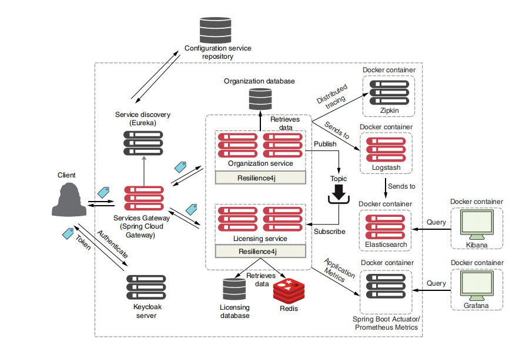
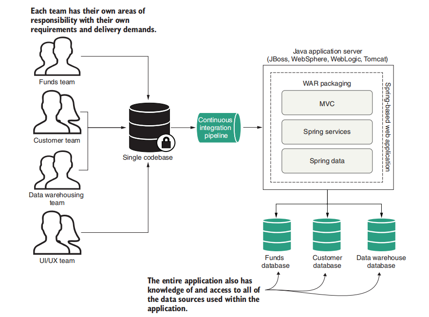
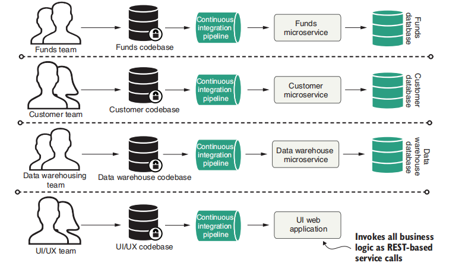

# 概述

[TOC]

为了构建微服务架构，Spring Cloud 容纳了很多分布式开发的组件

- Spring Cloud Config：配置管理，允许被集中化放到远程服务器中。
- Spring Cloud Bus：分布式事件、消息总线、用于集群（如配置发生变化）中传播事件状态
- Netflix Eureka：服务治理中心，它提供微服务的治理，包括微服务的注册和发现
- Netflix Hystrix：断路器，在某个组件因为某些原因无法响应或者响应超时之际进行熔断，以避免其他微服务调用该组件造成大量线程积压。它提供了更为强大的容错能力
- Netflix Zuul：API网关，它可以拦截Spring Cloud的请求，提供动态路由功能。它还可以限流，保护微服务持续可用，还可以通过过滤器提供验证安全
- Spring Cloud Security：它是基于Spring Security的，可以给微服务提供安全控制
- Spring Cloud Sleuth：它是一个日志收集工具包，可以提供分布式追踪的功能
- Spring Cloud Stream：分布式数据流操作，它封装了关于Redis、RabbitMQ、Kafka等数据流的开发工具
- Netflix Ribbon：提供客户端的负载均衡。它提供了多种负载均衡的方案
- OpenFeign：它是一个声明式的调用方案，可以屏蔽REST风格的代码调用，而采用接口声明方式调用，这样就可以有效减少不必要的代码，进而提高代码的可读性
- ...

Spring Cloud 的未来趋势是去 Netflix 组件

**MiscroService = Small, Simple, and Decoupled Services = Scalable, Resilient, and Flexible Applications**

微服务与单体架构的对比：

|                          Monolithic                          |                         microservice                         |
| :----------------------------------------------------------: | :----------------------------------------------------------: |
|  |  |

 
