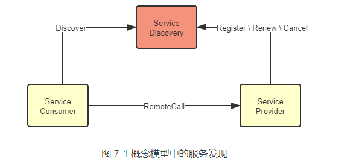
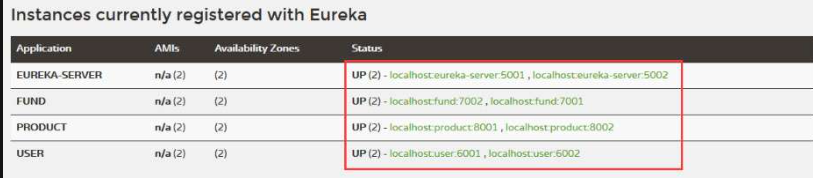
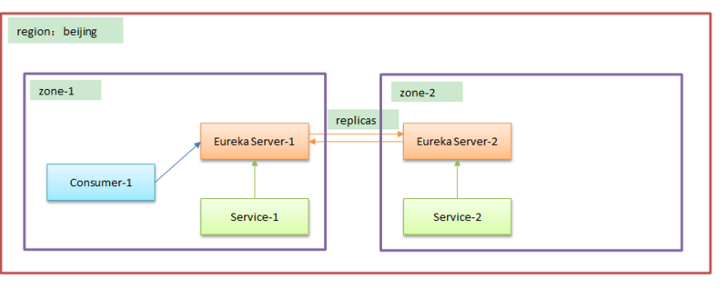
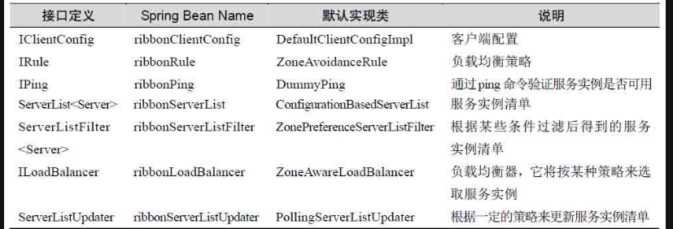
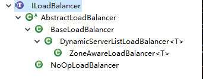
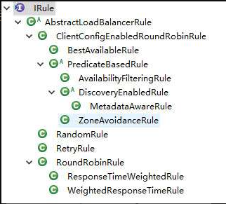

# 服务治理

服务治理中心是微服务（分布式）架构中最基础和最核心的功能组件，它主要对各个服务实例进行管理，包括服务注册和服务发现等。

[TOC]

## Eureka

服务发现必须包含以下三个过程：

1. **服务的注册**（Service Registration）：当服务启动的时候，它应该通过某些形式（如调用 API、产生事件消息、在 ZooKeeper/Etcd 的指定位置记录、存入数据库，等等），将自己的坐标信息通知到服务治理中心。
2. **服务的维护**（Service Maintaining）：监控服务是否健康存活，将不健康的服务自动从服务注册表中剔除。
3. **服务的发现**（Service Discovery）：把一个符号转换为服务实际坐标的过程

下面我们以 Netflix Eureka 和 Hashicorp Consul 为例，说明 CAP 矛盾。

Eureka 选择了高可用性，而牺牲一致性。Eureka 的各个节点间采用异步复制来交换服务注册信息，当有新服务注册进来时，并不需要等待信息在其他节点复制完成，而是马上宣告服务可见。同时，当有服务发生变动，譬如下线或者断网，变动信息不会实时的同步给所有服务端与客户端。这样的设计使得不论是 Eureka 的服务端还是客户端，都能够持有自己的服务注册表缓存，并以 TTL（Time to Live）机制来进行更新，哪怕服务注册中心完全崩溃，客户端在仍然可以维持最低限度的可用。以较小的同步代价换取了最高的可用性；Eureka 能够选择这种模型的底气在于，与它相配合的 Ribbon 和 Hystrix 模块可以兜底，故障转移（Failover）或者快速失败（Failfast）。

Consul 的选择一致性，牺牲可用性。Consul 采用 [Raft 算法](https://icyfenix.cn/distribution/consensus/raft.html)，要求多数派节点写入成功后服务的注册或变动才算完成。它没有其他组件为它兜底了。

### 服务注册

#### 治理中心

~~~xml
<dependency>
    <groupId>org.springframework.cloud</groupId>
    <artifactId>spring-cloud-starter-netflix-eureka-server</artifactId>
</dependency>
~~~

~~~java
@SpringBootApplication
// 驱动Eureka服务治理中心
@EnableEurekaServer
public class EurekaServerApplication {
   public static void main(String[] args) {
      SpringApplication.run(EurekaServerApplication.class, args);
   }
}
~~~

配置文件：

~~~yaml
# 定义 Spring 应用名称，它是一个微服务的名称，一个微服务可拥有多个实例
spring:
  application:
    name:  eureka-server

server:
  port: 5001 # 设置端口为5001

eureka:
  client:
    # 服务自身就是治理中心，所以这里设置为 false，否则会抛出异常
    register-with-eureka: false
    # 取消服务获取
    fetch-registry: false
  instance:
    hostname: 192.168.1.100
   	instance-id: authorization-service
~~~

所谓微服务，是指完成某一业务功能的独立系统。一个微服务可以有多个实例，所谓实例，是指一个具体的服务节点。Eureka 通过实例的 `spring.appliacation.name` 配置项来确定该实例是属于哪一个微服务的。可以配置`eureka.instance.appname`，它的优先级比 `spring.appliacation.name` 的高。

`eureka.instance.` 开头的配置

- `hostname`：向外暴露该实例的主机名

- `ip-address`：向外暴露该实例的 IP

- `instance-id`：标识该实例

  

  默认格式为 `${spring.cloud.client.hostname}:${spring.application.name}:${spring.application.instance_id:${server.port}}`。

  `spring.cloud.client.hostname` 需要自己定义的

- `prefer-ip-address`：取值为 true 时，客户端在注册时，使用自己的 `ip-address` 而不是 `hostname`。默认是 false

- `lease-expiration-duration-in-seconds`：服务失效时间（），失效的服务将被剔除。单位为秒，默认 90

- `lease-renewal-interval-in-seconds`：服务续约（心跳）频率。单位为秒，默认 30

- `eureka.client.service-url.defaultZone`：Eureka 服务中心的地址，多个服务中心地址之间用逗号分隔。

  - 在治理中心中，该配置项用于完成集群的搭建。

  - 而微服务实例通过向 `eureka.client.serviceUrl.defaultZone` 指定的服务中心发送请求来完成注册的。

  如果引入了 Zone 的特性，那么在 `service-url` 以及 `availability-zones` 中描述这些中心的地址，该配置项不再使用。

- `eureka.client.register-with-eureka`：是否向服务中心注册自己，默认值为 true。一般情况下，服务中心将该配置项设置为 false

- `eureka.client.fetch-registry`：是否从 Eureka 服务中心获取注册信息，默认值为 true。一般情况下，Eureka 服务中心应将其设置为 false。

#### 客户端

~~~xml
<dependency>
    <groupId>org.springframework.cloud</groupId>
    <artifactId>spring-cloud-starter-netflix-eureka-client</artifactId>
</dependency>
~~~

~~~java
@SpringBootApplication
// 在新版本的 Spring Cloud中，不再需要这个注解驱动服务发现了
// @EnableDiscoveryClient
public class UserApplication {
   public static void main(String[] args) {
      SpringApplication.run(UserApplication.class, args);
   }
}
~~~

~~~yaml
eureka:
  client:
    serviceUrl:
      #  向 http://localhost:5001/eureka/ 注册自己
      defaultZone : http://localhost:5001/eureka/
  instance:
    instance-id: society-service
    prefer-ip-address: true
~~~

### 服务调用（发现）

~~~java
@SpringBootApplication
public class ProductApplication {
   // 负载均衡
   @LoadBalanced
   @Bean
   public RestTemplate initRestTemplate() {
      return new RestTemplate();
   }
   ......
}

@RestController
@RequestMapping("/product")
public class ProductController {
   // 依赖注入RestTempalte
   @Autowired
   private RestTemplate restTemplate = null;

   @GetMapping("/purchase/{userId}/{productId}/{amount}")
   public ResultMessage purchaseProduct(
          @PathVariable("userId")  Long userId,
          @PathVariable("productId") Long productId,
          @PathVariable("amount") Double amount) {
      // 这里的 FUND 代表资金微服务， RestTemplate 会自动负载均衡
      String url = "http://FUND/fund/account/balance/{userId}/{amount}";
      // 封装请求参数
      Map<String, Object> params = new HashMap<>();
      params.put("userId", userId);
      params.put("amount", amount);
      // 请求资金微服务
      ResultMessage rm = restTemplate.postForObject(url, null, ResultMessage.class, params );
   }
}
~~~

- HTTP 域名要填写服务名
- 当 Ribbon 需要进行服务调用时，它先根据这个名称从服务治理中心获取服务提供者的实例列表，保存在本地，然后通过特定的负载均衡的策略确定具体的实例，最后通过请求该实例获取数据

这里可以看出，一个微服务可以同时是服务消费者和服务提供者。

任何的微服务实例（Eureka 客户端）都可以对 Eureka 服务治理中心（Eureka 服务端）发送 REST 风格的请求。Eureka客户端的请求类型包括：

- 注册

  - 配置项 `spring.application.name` 可以明确该实例归属于哪个微服务
  - `eureka.client.register-with-eureka`，默认为 true，代表默认情况下将微服务注册到 Eureka 服务治理中心。
  - 向 `eureka.client.serviceUrl.defaultZone` 指定的服务中心注册
  - 当启动微服务时，它默认 40s 后才向服务中心发送注册请求

- 续约：按一个频率向 Eureka 服务端维持心跳，告诉 Eureka 该实例是可用的，借此来避免被Eureka 服务端剔除出去，这样的行为被称为续约（Renew）。相关配置：

  ~~~yaml
  eureka:
    instance: 
      # 微服务实例超时失效秒数，默认值为 90 秒
      # 倘若续约超时，Eureka 会将微服务实例剔除
      lease-expiration-duration-in-seconds: 90
      # 间隔对应的秒数执行一次续约服务，默认值为 30 秒
      lease-renewal-interval-in-seconds: 30
  ~~~
  
- 下线：主动告知服务端自己要下线了

Eureka 服务端：

- 各个 Eureka 服务器之间也会相互复制，也就是当微服务发生注册、下线和续约这些操作的时候，Eureka 会将这些消息转发到其他服务治理中心的实例上，这样就完成同步了。需要注意的是，这里的 Eureka 服务器之间采用的是对等模式（Peer-to-Peer），这有别于主从模式（Master-Slave）。

- Eureka Server 在启动时，会创建一个定时任务，在默认的情况下，每间隔 60 秒就会更新一次微服务实例的清单，只要发现有超过 90 秒没有完成续约的实例，就会将其剔除出去。

- 自我保护是一种应对网络异常的安全保护措施。一旦进入保护模式，Eureka Server 不会剔除任何心跳测试失败的客户端（AP系统）。当在 15 分钟内低于 85% 的情况下心跳测试失败，那么就会进入该模式

  ~~~yaml
  eureka:
    server: 
      enable-self-preservation: false # 取消Eureka自我保护机制
  ~~~
  
  

Ribbon 完成负载均衡的过程：

1. **服务获取**：Eureka 客户端向 Eureka 服务治理中心发送 REST 风格请求，获取一份只读的服务实例清单，然后缓存在本地，并按一个时间间隔刷新（默认是30秒）。

   ~~~yaml
   eureka:
     client: 
       # 是否检索服务实例清单，默认值 true
       # 在服务端，这个设置为 false
       fetch-registry: true
       
       # 检索服务实例清单的时间间隔（单位秒），默认值30
       registry-fetch-interval-seconds: 30
   ~~~

2. **服务调用**：根据服务实例清单，Ribbon 按负载均衡策略来发送请求

从上述讨论中可以看出，Eureka 是一个强调 AP（可用性和分区容忍）的组件

### Region & Zone

实际上，Region 和 Zone 是来自亚马逊云技术服务（Amazon Web Services，AWS）平台的概念。Region 是指大的地区，如亚洲、欧洲或者北美洲等。Zone 则是指更小的地区，如华北、华南地区，甚至是机房。

~~~yaml
# EurekaServer-1
spring:
  application:
    name: Server-1
server:
  port: 30000
eureka:
  instance:
    hostname: localhost
  client:
    region: beijing
    availability-zones:
      beijing: zone-1, zone-2
    service-url:
      zone-1: http://localhost:30000/eureka/
      zone-2: http://localhost:30001/eureka/
      
# EurekaServer-2
spring:
  application:
    name: Server-1
server:
  port: 30001
eureka:
  instance:
    hostname: localhost
  client:
    region: beijing
    availability-zones:
      beijing: zone-1, zone-2
    service-url:
      zone-1: http://localhost:30000/eureka/
      zone-2: http://localhost:30001/eureka/
      
# Service
spring:
  application:
    name: service
server:
  port: 30011
eureka:
  instance:
    metadata-map:
      zone: zone-1
  client:
    #地区
    region: beijing
    availability-zones:
      beijing: zone-2,zone-1
    service-url:
      zone-1: http://localhost:30000/eureka/
      zone-2: http://localhost:30001/eureka/
      
# Consumer
spring:
  application:
    name: consumer
server:
  port: 30030
eureka:
  instance:
    metadata-map:
      zone: zone-1
  client:
    #地区
    region: beijing
    availability-zones:
      beijing: zone-1, zone-2
    service-url:
      zone-1: http://localhost:30000/eureka/
      zone-2: http://localhost:30001/eureka/
~~~

- service-url 指定每个机房 zone 里面（多个）服务中心的地址。

- 同一个 Zone 可以属于不同的 Region，但是这是没有意义的。

- 通过 `eureka.instance.metadata-map.zone` 来决定「服务消费者」和「服务提供者」分别属于哪个 `zone`。而「服务中心」通过自己暴露的地址和 `service-url` 来间接反映自己的 Zone。

- 每个「服务中心」、「服务提供者」以及「消费者」通过 eureka.client.region 来指定自己所属的区域，然后根据 region 在 availability-zones 中选择对应的 zone 列表。

- `prefer-same-zone-eureka`
  
  - true：优先向同一 zone 下的治理中心注册并维护心跳。
  
  要保证服务注册到同一个 Zone 内的治理中心。若注册到别的治理中心，那么网络延时比较大，心跳测试不稳定。
  
  

### 元数据

通过 `eureka.instance.metadata-map` 来自定义服务实例的元数据

~~~yaml
# 定义微服务实例信息
eureka:
  instance:
    metadata-map:
      # 自定义元数据版本号（version）为v2
      version: v2
~~~

自定义的元数据会被发送到 Eureka 服务端，其他的微服务也可以读取这个配置

## Ribbon

~~~xml
<!-- https://mvnrepository.com/artifact/org.springframework.cloud/spring-cloud-starter-netflix-ribbon -->
<dependency>
    <groupId>org.springframework.cloud</groupId>
    <artifactId>spring-cloud-starter-netflix-ribbon</artifactId>
</dependency>
~~~

在 Spring Cloud 中，提供的服务调用是 `Ribbon` 和 `OpenFeign`。服务调用最为核心的流程就是**「负载均衡」**。下面是 Ribbon 中与负载均衡有关的接口。

~~~java
@LoadBalanced
@Bean
RestClient.Builder restClientBuilder() {
    return RestClient.builder();
}
~~~

~~~java
@Autowired
private RestClient.Builder restClientBuilder;

@Test
public void testRestClient() {
    String result =  restClientBuilder.build().post().uri("http://authorization-service/login");
}
~~~

在使用了注解 `@LoadBalanced` 后，Ribbon 通过 `LoadBalancerInterceptor` 拦截 `RestTemplate`，然后在其 intercept 方法调用 `LoadBalancerClient` 接口的 `execute` 方法来执行负载均衡。LoadBalancerClient 把在请求 URL 中作为域名的 ServiceID 替换为 host:port。

Ribbon 中的负载均衡包括两个部分：

- **负载均衡器**

- **负载均衡策略**

  

### 负载均衡器

- ServerList : 从 Eureka 获取的实例清单
- ServerListFilter：对实例清单进行过滤处理

服务实例过滤器（ServerListFilter）为负载均衡器（Loadbalancer）提供在 ServerList 中符合要求的服务实例。ServerListFilter 实现类如下：

负载均衡器接口和实现类之间的关系如下：

ZoneAwareLoadBalancer 的实现流程：

1. 判断是否启用了 Zone 的功能，如果 Zone 至多有一个（受 `prefer-same-zone-eureka` 区域亲和性参数的影响），就采用 BaseLoadBalancer 的 chooseServer() 中的负载策略（默认为轮询），来选择具体的服务。结束流程。
2. 排除最高负载 20% 或者故障率大于 99.999%的 Zone
3. 通过 `ZoneAvoidanceRule.getAvailableZones` 来获取可用的 Zone
4. 倘若存在可用的 Zone，采用 `ZoneAvoidanceRule.randomChooseZone` 随机获取一个 Zone，然后执行 Zone 对应的负载均衡策略（默认为轮询）。
5. 如果没有 Zone，那么就执行 BaseLoadBalancer 的 chooseServer 方法。

### 负载策略

负载均衡策略的接口与实现类如下：

这里我们讨论最常用的四种策略：

- `RoundRobinRule`：轮询，有 10 次失败重试机会。

- `RetryRule`：默认使用 RoundRobinRule 策略，可以设置为其他策略。若 maxRetryMillis （默认为 500 ms）后仍未获取到可用的服务，那么返回 `null`

- `WeightedResponseTimeRule`：根据每个服务提供者的响应时间分配一个权重，响应时间越长，权重越小，被选中的可能性也就越低。

  - 通过一个后台线程来统计分析各个服务的响应时间，即任务按时间间隔（默认 30 秒）启动线程类 `DynamicServerWeightTask` 的 run 方法，在其中通过调用类 `ServerWeight` 的 `maintainWeights` 方法计算权重值

  - 计算权重的步骤

    1. 计算各个服务的平均统计时间
    2. 求平均响应时间总和（totalResponseTime）
    3. 对于每个服务，通过公式「当前累计平均权重 + 平均响应时间总和 - 该服务平均响应时间」来计算出它的权重

    举个例子：现在一个微服务有5个实例，A、B、C、D 和 E，它们的平均响应时间分别为 10、20、30、40 和 50

    - 实例 A：$0+(150-10)=140$
    - 实例 B：$140+(150-20)=270$
    - 实例 C：$270+(150-30)=390$
    - 实例 D：$390+(150-40)=500$
    - 实例 E：$500+(150-50)=600$

  - 根据权重区间来选择服务的，继续以上面例子说明：

    - 实例 A：$[0, 140]$
    - 实例 B：$(140, 270]$
    - 实例 C：$(270, 390]$
    - 实例 D：$(390, 500]$
    - 实例 E：$(500, 600)$

    然后生成一个随机数，落在哪个区间，就选择对应的服务实例。可以看出被选中的概率取决于实例区间的跨度。显然平均响应时间越短，被选中的概率就越大。

- `AvailabilityFilteringRule`：先过滤掉非健康的服务实例，然后再选择连接数较小的服务实例。

- `ZoneAvoidanceRule`：根据服务所在区域（zone）的性能和服务的可用性（就是下面两个断言），来选择服务实例。

  - `ZoneAvoidancePredicate`：排除性能较差的 Zone。它的核心流程会调用到 `ZoneAvoidanceRule.getAvailableZones()`
  - `AvailabilityPredicate`：排除熔断或者流量过大的服务。

#### 全局

~~~java
@Configuration
public class GlobalConfiguration {
   // 服务过滤器
   @Bean(name="ribbonServerListFilter")
   public ServerListFilter<Server> serverListFilter() {
      // 使用优先选择的过滤器，一般无需提供自己的 Filter 
      ZonePreferenceServerListFilter filter 
         = new ZonePreferenceServerListFilter();
      // 使用默认Zone
      filter.setZone(EndpointUtils.DEFAULT_ZONE);
      return filter;
   }

   // 负载均衡策略
   @Bean
   public IRule rule() {
      // 使用随机选择服务的策略
      return new RandomRule();
   }   
}
~~~

这里配置的是全局性的，也就是针对所有的微服务都有效。

#### 局部

可以通过以下配置项，来对`<clientName>`微服务使用特定的策略：

- `<clientName>.ribbon.NFLoadBalancerClassName`：负载均衡类，需实现。 ILoadBalancer 接口。
- `<clientName>.ribbon.NFLoadBalancerRuleClassName`：负载均衡策略，需实现 IRule 接口。
- `<clientName>.ribbon.NFLoadBalancerPingClassName`：心跳监测类，需实现I Ping 接口。
- `<clientName>.ribbon.NIWSServerListClassName`：服务实例清单类，需实现 ServerList 接口。
- `<clientName>.ribbon.NIWSServerListFilterClassName`：服务实例清单过滤类，需实现 ServerListFilter 接口。

使用示例：

~~~yaml
FUND:
  ribbon:
    NFLoadBalancerRuleClassName: com.netflix.loadbalancer.BestAvailableRule
    NFLoadBalancerPingClassName: com.netflix.loadbalancer.PingUrl
~~~

其实对于局部定义，Spring Cloud 还提供了 `@RibbonClient` 和 `@RibbonClients`。 使用示例：

~~~java
@Configuration
// name 配置具体的客户端， configuration指向一个配置类FundConfiguration，
// 测试要求FundConfiguration标注@Configuration
@RibbonClient(name="FUND", configuration=FundConfiguration.class)
public class GlobalConfiguration { }

// 这个类不能放在 Spring Boot 主入口文件扫描的范围内，因为如果这个类是被扫描的，那么对应的配置策略就会对全局生效
@Configuration
public class FundConfiguration {
    @Bean
    public IRule rule() {
        return new BestAvailableRule();
    }
    
    @Bean
    public IPing ribbonPing() {
        return new PingUrl();
    }
}
~~~

全局配置的优先级大于局部的

### 使用实践

重试与超时的配置：

~~~yaml
FUND: # 代表只对资金微服务执行这样的配置
  ribbon:
    # 连接超时时间，单位毫秒
    ConnectTimeout: 1000
    # 请求超时时间，单位毫秒
    ReadTimeout: 3000
    # 最大连接数
    MaxTotalHttpConnections: 500
    # 每个服务提供者的最大连接数
    MaxConnectionsPerHost: 100
    # 是否所有操作都重试
    OkToRetryONAllOperations: false
    # 重试其他实例的最大重试次数，不包括首次所选的server
    MaxAutoRetriesNextServer: 2
    # 同一实例的最大重试次数，不包括首次调用
    MaxAutoRetries : 1
~~~

当一个微服务发布了一个新的实例，服务实例清单不能实时得到它的注册信息。这样的情况会对第一次服务调用产生很大的麻烦，可能会产生超时错误，为了解决这样的问题，我们可以使用 Ribbon 的饥渴加载

~~~yaml
ribbon:
  eager-load:
    # 是否启动饥渴加载？默认值为false
    enabled: true
    # 饥渴加载的微服务ID
    clients: user, product, fund
~~~

