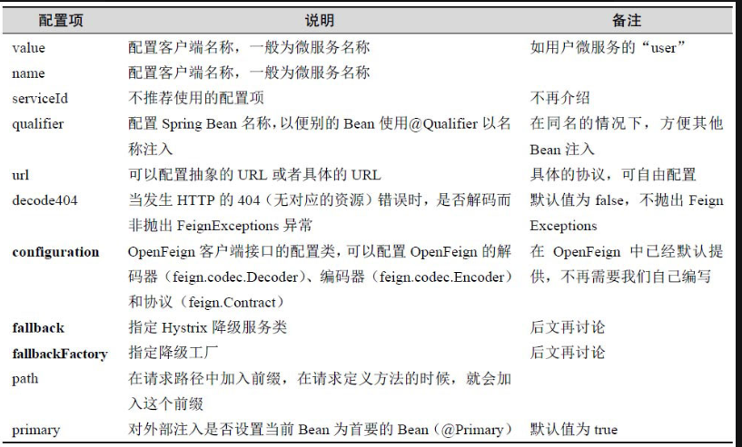
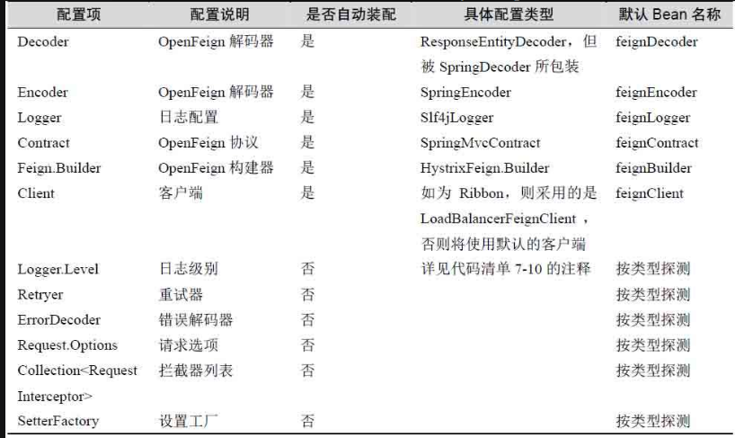
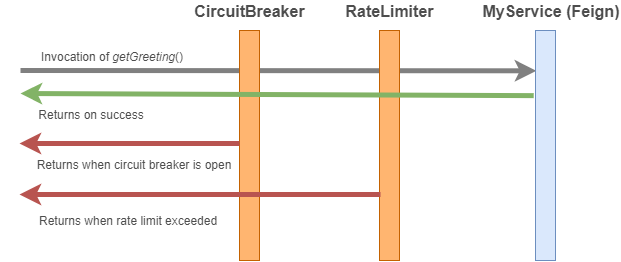

# 声明式调用——OpenFeign

[TOC]

## 使用

Maven 依赖：

~~~xml
<!-- 依赖feign -->
<dependency>
   <groupId>org.springframework.cloud</groupId>
   <artifactId>spring-cloud-starter-openfeign</artifactId>
</dependency>
<!-- 依赖hystrix -->
<dependency>
   <groupId>org.springframework.cloud</groupId>
   <artifactId>spring-cloud-starter-netflix-hystrix</artifactId>
</dependency>
~~~

下面我们通过一个例子来掌握 OpenFeign 的使用

在 Ribbon 中，需要使用 RestTemplate 的方式进行开发，比较繁琐。但在 OpenFeign 中，只需要声明接口，而且风格是 Spring MVC 的

~~~java
@FeignClient("user") 
// 声明为 OpenFeign 的客户端
// 底层将使用 Ribbon 执行 REST 风格调用，配置的 "user" 是一个微服务的名称
public interface UserFacade {
   @GetMapping("/user/info/{id}")  
   public UserInfo getUser(@PathVariable("id") Long id);

    // 传递JSON数据
   @PutMapping("/user/info")
   public UserInfo putUser(@RequestBody UserInfo userInfo);
}
~~~

~~~java
// 扫描装配Bean
@SpringBootApplication(scanBasePackages = "com.spring.cloud.fund")

// 扫描装配 OpenFeign 接口到 IoC 容器中
@EnableFeignClients(basePackages="com.spring.cloud.fund")
public class FundApplication {
   public static void main(String[] args) {
      SpringApplication.run(FundApplication.class, args);
   }
}
~~~

在控制器中使用 OpenFegin 接口：

~~~java
@Autowired
private UserFacade userFacade = null;

UserInfo user = userFacade.getUser(id);
~~~

此外，OpenFeign 还支持以下传参方式：

~~~java

@GetMapping("/user/infoes2")
public ResponseEntity<List<UserInfo>> findUsers2(
   // @RequestParam代表请求参数
   @RequestParam("ids") Long []ids);

@DeleteMapping("/user/info")
public ResultMessage deleteUser(
   // @RequestHeader代表请求头传参
   @RequestHeader("id") Long id);

@RequestMapping(value = "/user/upload",
   // 说明提交一个 "multipart/form-data" 类型的表单
   consumes = MediaType.MULTIPART_FORM_DATA_VALUE)
public ResultMessage uploadFile(
   // @RequestPart 代表传递文件流
   @RequestPart("file") MultipartFile file);

// POJO 表单传参
@PostMapping("/openfeign/provider/order1")
Order createOrder1(@SpringQueryMap Order order);
~~~

OpenFeign 客户端接口还可以提供继承的功能：

~~~java
// 此处删除注解 FeignClient
public interface UserFacade  {
   @GetMapping("/user/info/{id}")  
   public UserInfo getUser(@PathVariable("id") Long id);
}

@FeignClient(value="user")
// 它所继承的 UserFacade 接口也会被 OpenFeign 扫描
public interface UserClient extends UserFacade {}
~~~

当 HTTP 请求失败时，会抛出 FeignException  异常。

## OpenFeign 客户端的配置

### 注解

注解 `@FeignClient` 的配置见下表

configuration 这个配置项的内容是一个注解 @Configuration 的类，它的目的是创建 OpenFeign 所需的解码器、编码器和协议来处理各种 Spring MVC 请求类型。官方提供了一个默认配置类 `FeignClientsConfiguration`。我们可以根据以下配置项提供自己定义的配置类。

对于已经装配的，OpenFeign 都给出了默认实现，这就意味着，当根据自己的需要替换时，应该按照对应的 Bean 名称进行替换。对于那些未装配的，按照类型注册即可。

~~~java
@FeignClient(value="user", 
   // 指定配置类
   configuration = UserFacade.UserFeignConfig.class)
public interface UserFacade {
   ...... 

   class UserFeignConfig {

      // 注入Spring MVC消息转换器工厂
      @Autowired
      private ObjectFactory<HttpMessageConverters> messageConverters = null;

      @Bean(name = "feignDecoder")
      // 设置为"prototype"，代表只对当前客户端使用
      @Scope(ConfigurableBeanFactory.SCOPE_PROTOTYPE)
      public Decoder clientDecoder() {
         return new SpringDecoder(messageConverters);
      }

      @Bean
      // 设置为"prototype"，代表只对当前客户端使用
      @Scope(ConfigurableBeanFactory.SCOPE_PROTOTYPE)
      public RequestInterceptor userInterceptor() {
         return new UserInterceptor();
      }

      @Bean
      // 设置为"prototype"，代表只对当前客户端使用
      @Scope(ConfigurableBeanFactory.SCOPE_PROTOTYPE)
      Logger.Level loggerLevel() {
         return Logger.Level.FULL;
      }
   }
}
~~~

如果想让这个配置设置为默认全局的 OpenFeign 客户端配置，可以在注解 @EnableFeignClients 的配置项 defaultConfiguration 中配置，并将各个类的作用域声明为单例。

Fallback 的使用示例：

~~~java
@FeignClient(name = "user",url = "${user.url}",fallback = UserFeignFallback.class
/*fallbackFactory = UserFeignFactory.class*/)
public interface UserFeign {
    @PostMapping
    void save(User user);

    @GetMapping("/{id}")
    User getUserByID(@PathVariable("id") String id);

    @GetMapping
    List<User> findAll();
}

@Component
public class UserFeignFallback implements UserFeign {

    @Override
    public void save(User user) {}

    @Override
    public User getUserByID(String id) {
        User user = new User();
        user.setId("100");
        user.setName("fallback 回调用户");
        return user;
    }

    @Override
    public List<User> findAll() {
        return null;
    }
}

// 通过 Factory 可以获取异常信息
@Component
public class UserFeignFactory implements FallbackFactory<UserFeign> {

    private final UserFeignFallback userFeignFallback;

    // 这里的 userFeignFallback 会自动注入的。
    public UserFeignFactory(UserFeignFallback userFeignFallback) {
        this.userFeignFallback = userFeignFallback;
    }

    @Override
    public UserFeign create(Throwable cause) {
        //打印下异常
        cause.printStackTrace();
        // 返回一个 Fallback 示例
        return userFeignFallback;
    }
}
~~~

### YAML

OpenFeign 还允许我们使用 YAML 文件进行配置

~~~yaml
feign:
 ## 开启压缩
  compression:
    request:
      enabled: true
      ## 开启压缩的阈值，单位字节，默认2048，即是2k，这里为了演示效果设置成10字节
      min-request-size: 10
      mime-types: text/xml,application/xml,application/json
    response:
      enabled: true
  Client:
    # 指定一个默认配置
    default-config: default 
    # 是否启用默认的属性配置机制
    default-to-properties: true
    config: 
      # 名为 default 的 @FeignClient
      default:  
        # 当发生HTTP的404（无对应的资源）错误时，
        # 是否解码而非抛出 FeignExceptions 异常
        decode404: false
        # 读取请求超时时间（单位毫秒），如果openFeign没有设置对应得超时时间，那么将会采用Ribbon的默认超时时间
        read-timeout: 5000
        # 连接远程服务器超时时间（单位毫秒）
        connect-timeout: 5000
        # 重试器全限定名（要求是feign.Retryer接口的实现类）
        retryer: xxx
        # OpenFeign协议全限定名（要求是feign.Contract接口的实现类） 
        contract: xxx
        # OpenFeign解码器全限定名（要求是feign.codec.Decoder接口的实现类）
        decoder: xxx
        # OpenFeign编码器全限定名（要求是feign.codec.Encoder接口的实现类）
        encoder: xxx
        # 日志级别, 分为4级：
        # 1. NONE: 不记录任何日志（默认值）
        # 2. BASIC:只记录请求方法和URL以及响应状态代码和执行时间，且只记录基本信息以及请求和响应头
        # 3. HEADERS:记录基本信息以及请求和响应头
        # 4. FULL：记录全部请求头和请求体，并记录请求和响应的各类数据
        logger-level: basic
        # OpenFeign调用拦截器， List<Class<RequestInterceptor>>类型，
        # 主要拦截 OpenFeign 请求，一般可以加入一些请求头
        request-interceptors: xxx,xxx,xxx
        # OpenFeign错误解码器全限定名（要求是feign.codec.ErrorDecoder接口的实现类）
        error-decoder: xxx
      # 名为 name 的 @FeignClient
      user: 
        # 连接远程服务器超时时间（单位毫秒）
        connectTimeout: 5000
        # 执行请求超时时间（单位毫秒）
        readTimeout: 5000
~~~

通过 @FeignClient 中的 name 属性来指定要使用的 FeignClient

这里介绍下 `request-interceptors` ，它定义了一个拦截器（实现 `RequestInterceptor` 接口），这样可以根据自己的需要定制 RestTemplate 和请求参数、请求体等。

~~~java
public class UserInterceptor implements RequestInterceptor {
   @Override
   public void apply(RequestTemplate template) {
      // 给所有的请求添加 id 头部
      template.header("id", "1");
   }
}
~~~

对于 request- interceptors 配置项来说，可以配置多个拦截器，但是请注意，OpenFeign 并不保证拦截器的顺序。

## 全局配置

OpenFeign 底层默认使用的是 Ribbon，而 Ribbon 默认使用的是 Apache HTTP Client 作为底层连接，因此 OpenFeign 也给出了对应的配置项

~~~yaml
feign:
  httpclient:
    # 是否启用Apache HTTP Client作为底层连接（Ribbon的默认方法）
    enabled: true
    # 尝试连接超时时间
    connection-timeout: 2000
    # 是否禁止SSL协议验证
    disable-ssl-validation: false
    # 连接重新尝试
    connection-timer-repeat: 2000
    # 默认最大连接数
    max-connections: 100
    # 单个调用最大连接数
    max-connections-per-route: 30
    # HttpClient的存活时间，默认为900，单位通过time-to-live-unit配置
    time-to-live: 500
    # HttpClient的存活时间单位，默认为秒（second）
    time-to-live-unit: milliseconds
    # 当HTTP返回码为3xx（重定向）时，是否执行重定向操作，默认为true
    follow-redirects: false
~~~

## 与 R4j 整合

~~~java
// 这里不能添加 @FeignClient 注解。
public interface MyService {
    @RequestLine("GET /greeting")
    String getGreeting();
            
    @RequestLine("POST /greeting")
    String createGreeting();
}

// For decorating a feign interface
CircuitBreaker circuitBreaker = CircuitBreaker.ofDefaults("backendName");
RateLimiter rateLimiter = RateLimiter.ofDefaults("backendName");

// withRateLimiter 与 withCircuitBreaker 的顺序对行为有着影响。
FeignDecorators decorators = FeignDecorators
    .builder()            
    .withRateLimiter(rateLimiter)      
    .withCircuitBreaker(circuitBreaker)
    .build();

// 创建由 R4j 代理的 Feign 对象
MyService myService = Resilience4jFeign
    .builder(decorators)
    .target(MyService.class, "http://localhost:8080/");
~~~

~~~java
// For decorating a feign interface with fallback
MyService requestFailedFallback = () -> "fallback greeting";
MyService circuitBreakerFallback = () -> "CircuitBreaker is open!";
CircuitBreaker circuitBreaker = CircuitBreaker.ofDefaults("backendName");

FeignDecorators decorators = FeignDecorators
    .builder()
    //  the requestFailedFallback is called when a FeignException is thrown (usually when the HTTP request fails), 
    .withFallback(requestFailedFallback, 
                  FeignException.class)
    .withFallback(circuitBreakerFallback,
                  CircuitBreakerOpenException.class)
    .build();

MyService myService = Resilience4jFeign.builder(decorators).target(MyService.class, "http://localhost:8080/", fallback);
~~~

A fallback can consume a thrown Exception if needed. 

~~~java
public interface MyService {
    @RequestLine("GET /greeting")
    String greeting();
}

public class MyFallback implements MyService {
    private Exception cause;

    public MyFallback(Exception cause) {
        this.cause = cause;
    }

    public String greeting() {
        if (cause instanceOf FeignException) {
            return "Feign Exception";
        } else {
            return "Other exception";
        }
    }
}

FeignDecorators decorators = FeignDecorators.builder()
                                 .withFallbackFactory(MyFallback::new)
                                 .build();
~~~

