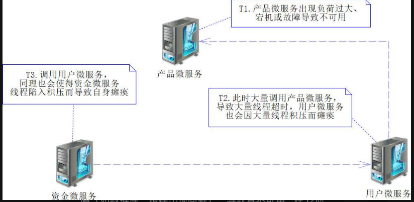
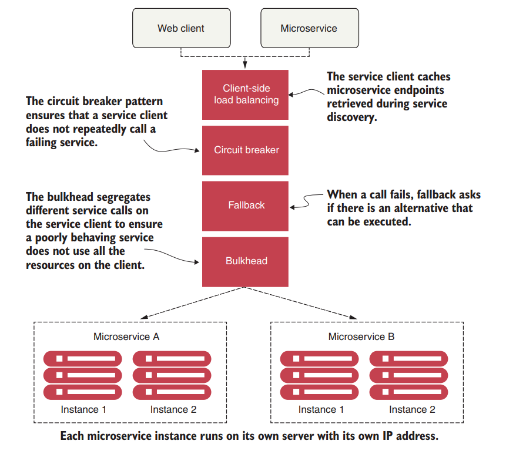

# Resilience4j

`Netflix Hystrix` 项目不再新增功能和发布新版本，只修复现有功能的缺陷，所以 Spring Cloud 打算使用 `Resilience4j` 框架取代 `Netflix Hystrix`。

## 基本概念



因为产品微服务不可用，会导致其他正常微服务出现线程积压的情况，这种情况会进一步蔓延，最终导致所有服务不可用，这便是雪崩效应。有三种方案来处理这种雪崩问题：

1. 熔断：熔断这一概念来源于电子工程中的断路器（Circuit Breaker）。在互联网系统中，当下游服务因访问压力过大而响应变慢或失败，上游服务为了保护系统整体的可用性，可以暂时切断对下游服务的调用。即**牺牲局部，保全整体**，避免请求堆积和资源耗尽

2. 限流：设置一个请求速率阈值，限制每个客户端或用户在特定时间内的请求次数。这样可以防止过多的请求涌入系统，保护系统免受过载和压力冲击，平滑流量，避免系统突发流量的影响。

3. 服务降级：当服务不可用时，降级服务会代替提供一些基本功能或返回预设的默认值，以确保系统依然能够提供有限的功能或服务；

   





Resilience4j 包含多个模块，开发者可以根据自己的需要加入依赖，核心模块有以下几个：

- resilience4j-circuitbreaker：断路器
- resilience4j-ratelimiter：限速器
- resilience4j-bulkhead：舱壁模式
- resilience4j-bulkhead：舱壁模式
- resilience4j-retry：自动重试（同步和异步）
- resilience4j-cache：响应结果缓存
- resilience4j-timelimiter：超时处理

附加模块有以下几个：

- resilience4j-reactor：Spring Reactor 适配器
- resilience4j-micrometer：Micrometer 度量输出
- resilience4j-spring-boot2：Spring Boot 2.x 启动器

~~~xml
<!--resilience4j Spring Boot Starter依赖，
   它会依赖circuitbreaker、ratelimiter和consumer包-->
<dependency>
   <groupId>io.github.resilience4j</groupId>
   <artifactId>resilience4j-spring-boot2</artifactId>
   <version>0.13.2</version>
</dependency>
<!-- 缓存模块 -->
<dependency>
   <groupId>io.github.resilience4j</groupId>
   <artifactId>resilience4j-cache</artifactId>
   <version>0.13.2</version>
</dependency>
<!--ehcache缓存包，它是一个JCache规范的实现--> 
<dependency>
   <groupId>org.ehcache</groupId>
   <artifactId>ehcache</artifactId>
   <version>3.6.3</version>
</dependency> 
<!-- 重试模块 -->
<dependency>
   <groupId>io.github.resilience4j</groupId>
   <artifactId>resilience4j-retry</artifactId>
   <version>0.13.2</version>
</dependency>
<!-- 舱壁模式 -->
<dependency>
   <groupId>io.github.resilience4j</groupId>
   <artifactId>resilience4j-bulkhead</artifactId>
   <version>0.13.2</version>
</dependency>
<!-- 超时限制 -->
<dependency>
   <groupId>io.github.resilience4j</groupId>
   <artifactId>resilience4j-timelimiter</artifactId>
   <version>0.13.2</version>
</dependency>
~~~

## CircuitBreaker

### 基本概念

在 Resilience4j 中存在以下 5 种不同的断路器状态：

- `CLOSED(0)`：初始化状态，关闭断路器，让所有请求通过。
- `OPEN(1)`：打开断路器，不让请求通过。
- `HALF_OPEN(2)`：半打开状态
- `DISABLED(3)`：断路器失效，让所有请求通过。
- `FORCED_OPEN(4)`：强制打开断路器，不让请求通过。

CLOSED、OPEN 和 HALF_OPEN 这 3 个状态对外发布事件，其余的状态都不对外发布事件。


The CircuitBreaker uses a sliding window to store and aggregate the outcome of calls. You can choose between a count-based sliding window and a time-based sliding window. The count-based sliding window aggregrates the outcome of the last N calls. The time-based sliding window aggregrates the outcome of the calls of the last N seconds. 下面我们仅介绍基于计数的滑动窗口。


状态转移：

- 初始化的时候，断路器会处于 CLOSED 状态。

- 在调用业务逻辑到一定次数（默认为 10 次，可配置）时，判断环形位缓冲区中的失败比例是否达到阈值（默认失败比例 50% 以上，可配置）。若达到，则断路器状态就会从 CLOSED 转变为 OPEN 

-  **To calculate a failure rate, the ring must be full**. When the circuit breaker is in the open state, all calls are rejected during a configurable time, and the circuit breaker throws a `CallNotPermittedException`. Once the configuration time expires, the circuit breaker changes to the half-open state and allows a number of requests to see if the service is still unavailable. 

  In the half-open state, the circuit breaker uses another configurable ring bit buffer to evaluate the failure rate. If this new failure rate is above the configured threshold, the circuit breaker changes back to open;

- the only way to exit from the **DISABLED** & **FORCED_OPEN** is to reset the circuit breaker or trigger a state transition

断路器都会将成功或者失败记录到环形位缓冲区中。只有环满了才开始计算失败率。例如，如果 Ring Bit Buffer 的大小设置为 10，如果一开始 9 次请求调用都失败，也不会计算失败率。


### 使用示例

Resilience4 通过注册机来创建断路器，注册机的对应接口是 `CircuitBreakerRegistry`，它的唯一实现类是 `InMemoryCircuitBreakerRegistry`。 

推荐使用静态方法 `CircuitBreakerRegistry.of` 来创建注册机：

~~~java
// 这里在创建 Registry 时指定了一个默认自定义配置 circuitBreakerConfig
circuitBreakerRegistry circuitBreakerRegistry = CircuitBreakerRegistry.of(circuitBreakerConfig)
~~~

|                    配置属性                    |   默认值    | 描述                                                         |
| :--------------------------------------------: | :---------: | ------------------------------------------------------------ |
|             `failureRateThreshold`             |     50      | 失败请求百分比,超过这个比例,CircuitBreaker就会变成OPEN状态   |
|          `slowCallDurationThreshold`           |  60000(ms)  | 慢调用时间,当一个调用慢于这个时间时，会被记录为慢调用        |
|            `slowCallRateThreshold`             |     100     | 当慢调用达到这个百分比的时候,CircuitBreaker就会变成OPEN状态  |
|    `permittedNumberOfCallsInHalfOpenState`     |     10      | 当CircuitBreaker处于HALF_OPEN状态的时候,允许通过的请求数量   |
|              `slidingWindowType`               | COUNT_BASED | 滑动窗口类型:COUNT_BASED代表是基于计数的滑动窗口,TIME_BASED代表是基于计时的滑动窗口 |
|              `slidingWindowSize`               |     100     | 滑动窗口大小,如果配置COUNT_BASED默认值100就代表是最近100个请求,如果配置TIME_BASED代表记录:最近100s的请求. |
|             `minimumNumberOfCalls`             |     100     | 最小请求个数.只有在滑动窗口内,请求个数达到这个个数,才会触发CircuitBreaker对于是否打开断路器的判断 |
|           `waitDurationInOpenState`            |  60000(ms)  | 从OPEN状态变成HALF_OPEN状态需要的等待时间                    |
| `automaticTransitionFromOpenToHalfOpenEnabled` |    false    | 如果设置为true代表:是否自动从OPEN状态变成HALF_OPEN,即使没有请求过来. |
|               `recordExceptions`               |    empty    | 需要记录为失败的异常列表                                     |
|               `ignoreExceptions`               |    empty    | 需要忽略的异常列表                                           |


我们通过注册机来创建 `CircuitBreaker` 对象，通过 `CircuitBreakerConfig.custom()` 来创建  `CircuitBreakerConfig`。

~~~java
@SpringBootApplication(scanBasePackages = "com.spring.cloud.product"
   // 排除Resilience4j Spring Boot stater的自动装配类
   , exclude = {CircuitBreakerAutoConfiguration.class, 
          CircuitBreakerMetricsAutoConfiguration.class,
          RateLimiterAutoConfiguration.class,
          RateLimiterMetricsAutoConfiguration.class
          })

// 驱动熔断器
@EnableCircuitBreaker
public class ProductApplication {

   @LoadBalanced
   @Bean
   public RestTemplate initRestTemplate() {
      return new RestTemplate();
   }

   // 断路器配置
   private CircuitBreakerConfig circuitBreakerConfig = null;
    
   // 断路器注册机
   private CircuitBreakerRegistry circuitBreakerRegistry = null;

   @Bean(name = "circuitBreakerConfig")
   public CircuitBreakerConfig initCircuitBreakerConfig() {
      if (circuitBreakerConfig == null) {
         circuitBreakerConfig = CircuitBreakerConfig.custom()
                // 当请求失败比例达到30%时，打开断路器，默认为50%
                .failureRateThreshold(30)
                // 当断路器为打开状态时，等待多少时间，转变为半打开状态，默认为60秒
                .waitDurationInOpenState(Duration.ofSeconds(5))
                // 配置断路器半打开时的环形位缓冲区大小（假设记为 n，默认为 10），
                // 在等待 n 次请求后，才重新分析请求结果，来确定是否改变断路器的状态
                .ringBufferSizeInHalfOpenState(5)
             
                // 配置断路器闭合时环形位缓冲区的大小（假设记为 n，默认为100），
                // 在等待 n 次请求后，才重新分析请求结果来确定是否改变断路器的状态
                .ringBufferSizeInClosedState(5)
             
                // 构建建立配置
                .build();
      }
      return circuitBreakerConfig;
   }

   // 构建断路器注册机
   @Bean(name = "circuitBreakerRegistry")
   public CircuitBreakerRegistry initCircuitBreakerRegistry() {
      if (circuitBreakerConfig == null) {
         initCircuitBreakerConfig();
      }
      if (circuitBreakerRegistry == null) {
         // 创建断路器注册机，并指定一个默认配置
         circuitBreakerRegistry = 
            CircuitBreakerRegistry.of(circuitBreakerConfig);
      }
      return circuitBreakerRegistry;
   }

   public static void main(String[] args) {
      SpringApplication.run(ProductApplication.class, args);
   }
}
~~~

从 CircuitBreakerRegistry 中获取 CircuitBreaker：

~~~java
//从 entryMap 中获取所有的熔断器
@Override
public Seq<CircuitBreaker> getAllCircuitBreakers() {}

// 根据名字获取熔断器，当不存在时，创建一个，并使用默认自定义配置
@Override
public CircuitBreaker circuitBreaker(String name) {}

// 根据名字获取熔断器，当不存在时，创建一个，并使用指定配置
@Override
public CircuitBreaker circuitBreaker(String name, CircuitBreakerConfig config) {}

// 根据名字获取熔断器，当不存在时，创建一个，并使用指定配置。
@Override
public CircuitBreaker circuitBreaker(String name, String configName) {}
~~~

我们这里演示最后一个方法的使用：

~~~java
CircuitBreakerConfig circuitBreakerConfig = CircuitBreakerConfig.custom()
    .failureRateThreshold(70)
    .build();

circuitBreakerRegistry.addConfiguration("someSharedConfig", config);

CircuitBreaker circuitBreaker = circuitBreakerRegistry
    .circuitBreaker("name", "someSharedConfig");
~~~

此外，我们还可以通过熔断器的静态方法直接获取 `CircuitBreaker` 

~~~java

// 创建名称为 "otherName" 的熔断器实例，配置为默认的
CircuitBreaker defaultCircuitBreaker = CircuitBreaker.ofDefaults("otherName");

CircuitBreaker customCircuitBreaker = CircuitBreaker.of("uniqueName", circuitBreakerConfig);
~~~


You can decorate any `Callable`, `Supplier`, `Runnable`, `Consumer`, `CheckedRunnable`, `CheckedSupplier`, `CheckedConsumer` or `CompletionStage` with a CircuitBreaker.

- 静态装饰方法：

  ~~~java
  // Returns a supplier which is decorated by a CircuitBreaker.
  static <T> Supplier<T>
  decorateSupplier(CircuitBreaker circuitBreaker, Supplier<T> supplier)
  ~~~

- 实例装饰方法：

  ~~~java
  default <T> Supplier<T>
  decorateSupplier(Supplier<T> supplier)
  ~~~

  Returns a supplier which is decorated by a CircuitBreaker.

  ~~~java
  default <T> Supplier<CompletionStage<T>>
  decorateCompletionStage(Supplier<CompletionStage<T>> supplier)
  ~~~

  Returns a supplier which is decorated by a CircuitBreaker.

You can invoke the decorated function with `Try.of(…)` or `Try.run(…)` from Vavr. This allows to chain further functions with map, flatMap, filter, recover or andThen. The chained functions are only invoked, if the CircuitBreaker is CLOSED or HALF_OPEN.

In the following example, `Try.of(…)` returns a `Success<String>` Monad, if the invocation of the function is successful. If the function throws an exception, a `Failure<Throwable>` Monad is returned and map is not invoked。

~~~java
@Service
public class R4jFacadeImpl implements R4jFacade {
   @Autowired // 注册机
   private CircuitBreakerRegistry circuitBreakerRegistry = null;

   @Autowired // 默认配置
   CircuitBreakerConfig circuitBreakerConfig = null;

   @Autowired // REST 模板
   private RestTemplate restTemplate = null;

   // 错误结果 ID
   private static final long ERROR_ID = Long.MAX_VALUE;

   @Override
   public ResultMessage exp(String msg) {
      // 使用断路器注册机创建断路器，并且指定名称为“exp
      // 这里没有指定配置，那么使用一开始的自定义配置
      CircuitBreaker circuitBreaker = circuitBreakerRegistry.circuitBreaker("exp"); 
       
      // 描述事件，准备发送
      CheckedFunction0<ResultMessage> decoratedSupplier = 
         CircuitBreaker.decorateCheckedSupplier(circuitBreaker,
         () -> {
            String url = "http://USER/hystrix/exp/{msg}";
            System.out.println("发送消息【" + msg + "】");
            return restTemplate.getForObject(url, 
               ResultMessage.class, msg);
         }); 
       
       
       // 发送事件
       Try<ResultMessage> result = Try.of(decoratedSupplier)
           // 如果发生异常，则执行降级方法
           .recover(ex -> {
               return new ResultMessage(false, ex.getMessage());
           }); 
       
       // Try 对象（result）还有一个 isSuccess 方法，降级逻辑中用不到。
       return result.get(); 
   }
}
~~~


When you don't want to decorate your lambda expression, you can call executeXXXX

```java
default <T> CompletionStage<T>
executeCompletionStage(Supplier<CompletionStage<T>> supplier)
```

Decorates and executes the decorated CompletionStage.


```java
default <T> T
executeSupplier(Supplier<T> supplier)
```

Decorates and executes the decorated Supplier.


### 异常

有时候，我们还需要处理断路器抛出的异常。在断路器配置类（CircuitBreakerConfig）中，还有以下这 3 个处理异常的方法：

- `recordFailure`：仅仅追踪异常
- `ignoreExceptions`：忽略哪些异常
- `recordExceptions`：接收哪些异常，只有抛出接收的异常，才会认为是操作失败的。

~~~java
circuitBreakerConfig = CircuitBreakerConfig.custom().// 自定义配置
    // 断路器异常处理
    .recordFailure(ex -> {
        System.out.println("发生了异常，栈追踪信息为： ");
        ex.printStackTrace();
        return false;
    })
    // 忽略哪些异常，即当发生这些异常时，不认为执行失败
    .ignoreExceptions(ClassNotFoundException.class, IOException.class)
    // 只有在发生哪些异常时，才认为执行失败
    .recordExceptions(Exception.class, RuntimeException.class)
    // 构建建立配置
    .build();
~~~

### 度量

在断路器中有一个 `getMetrics()` 方法，通过它可以获取度量数据（Metrics）

~~~java
// 获取度量信息
CircuitBreaker.Metrics metrics = circuitBreaker.getMetrics();

// 获取环形位缓冲区中记录的调用失败比例
float failureRate= circuitBreaker.getMetrics().getFailureRate();

// 获取环形位缓冲区中记录的调用次数
int bufferedCalls = metrics.getNumberOfBufferedCalls();

// 获取环形位缓冲区中记录的调用失败数
int failedCalls = metrics.getNumberOfFailedCalls();
~~~

### 事件监控

此外，断路器还给我们提供事件的监控

~~~java
circuitBreaker.getEventPublisher() // 获取事件发布者
    // 回调不允许调用事件，例如，断路器打开，不允许请求
    .onCallNotPermitted(env->{System.out.println(
        "【onCallNotPermitted】" + env.getEventType().name());})
    // 回调错误事件
    .onError(env->{System.out.println(
        "【onError】" + env.getEventType().name());})
    // 回调成功事件
    .onSuccess(env->{System.out.println(
        "【onSuccess】" + env.getEventType().name());})
    // 断路器状态改变事件
    .onStateTransition(env->{System.out.println(
        "【onStateTransition】" + env.getEventType().name());})
    // 忽略错误事件
    .onIgnoredError(env->{System.out.println(
        "【onIgnoredError】" + env.getEventType().name());})
    // 重置断路器事件，关于重置后续会谈及
    .onReset(env->{System.out.println(
        "【onReset】" + env.getEventType().name());});

circuitBreaker.getEventPublisher()
    .onEvent(env->{ // 注册消费者监听所有的事件
        System.out.println("【onEvent】" 
                           + env.getEventType().name());
    });
~~~

### 状态改变

断路器还存在一系列可以改变当前状态的方法：

- `reset`：重置断路器，返回原始状态，并删除原有度量数据
- `transitionToClosedState`：将断路器修改为关闭状态
- `transitionToOpenState`：将断路器修改为打开状态
- `transitionToHalfOpenState`：将断路器修改为半打开状态
- `transitionToDisabledState`：将断路器修改为失效状态，停止断路器的状态转换。若要从此状态恢复，必须强制进行新的状态转换。此外需要注意的是，在此状态下断路器将不发布事件，并且停止度量数据采集。
- `transitionToForcedOpenState`：将断路器修改为强制打开状态，停止断路器的状态转换，若要从此状态恢复，必须强制进行新的状态转换。此外需要注意的是，在此状态下断路器将不发布事件，并且停止度量数据采集。

使用示例：

~~~java
circuitBreaker.reset(); // 重置断路器，同时删除度量数据
circuitBreaker.transitionToClosedState(); // 将断路器状态修改为 CLOSED
~~~

## 限速器

限速器是高并发系统中常见的工具，它让请求按照一个安全的速率通过系统，从而保证机器不超负荷工作，引发系统的各类问题。限速器中也有限速配置（RateLimiterConfig）和注册机（RateLimiterRegistry）。


每个周期的长度由 `limitRefreshPeriod`，新的周期将权限数量重新设置为 `limitForPeriod`。每一个调用占用一个权限，如果没有权限可占用，那么就等待。

| Config property    | Default value | Description                                                  |
| :----------------- | :------------ | :----------------------------------------------------------- |
| timeoutDuration    | 5 [s]         | The default wait time a thread waits for a permission        |
| limitRefreshPeriod | 500 [ns]      | The period of a limit refresh. After each period the rate limiter sets its permissions count back to the limitForPeriod value |
| limitForPeriod     | 50            | The number of permissions available during one limit refresh period |

使用示例：

~~~java
RateLimiterConfig config = RateLimiterConfig.custom()
  .limitRefreshPeriod(Duration.ofMillis(1))
  .limitForPeriod(10)
  .timeoutDuration(Duration.ofMillis(25))
  .build();

// Create registry
RateLimiterRegistry rateLimiterRegistry = RateLimiterRegistry.of(config);

// Use registry
RateLimiter rateLimiterWithDefaultConfig = rateLimiterRegistry
  .rateLimiter("name1");

RateLimiter rateLimiterWithCustomConfig = rateLimiterRegistry
  .rateLimiter("name2", config);
~~~

~~~java
CheckedRunnable restrictedCall = RateLimiter
    .decorateCheckedRunnable(rateLimiter, backendService::doSomething);

Try.run(restrictedCall)
    .andThenTry(restrictedCall)
    .onFailure((RequestNotPermitted throwable) -> LOG.info("Wait before call it again :)"));
~~~


限速器的度量：

~~~java
// 获取度量
io.github.resilience4j.ratelimiter.RateLimiter.Metrics metrics 
    = rateLimiter.getMetrics();

// 获取估计剩下可用的调用数，
int ap = metrics.getAvailablePermissions();

// 获取估计当前还在运行的调用数
int nowt = metrics.getNumberOfWaitingThreads();
~~~


限速器的事件监听：

~~~java
rateLimiter.getEventPublisher() // 获取事件发布者
   // 监听调用失败事件
   .onFailure(evt->System.out.println(
      "事件类型【"+evt.getEventType()+"】"))
   // 监听调用成功事件
   .onSuccess(evt->System.out.println(
      "事件类型【"+evt.getEventType()+"】"))
   // 监听调用成功（或失败）事件
   .onEvent(evt->System.out.println(
      "监听所有事件，事件类型【"+evt.getEventType()+"】"));
~~~

限速器还可以动态修改 `changeLimitForPeriod` 和 `changeTimeoutDuration` 的参数：

~~~java
// 在单位时间戳内限制的速率
rateLimiter.changeLimitForPeriod(50);
// 请求等待1秒，如果仍旧没有运行则将请求丢失
rateLimiter.changeTimeoutDuration(Duration.ofSeconds(1L));
~~~

## 舱壁隔离

Resilience4j 即提供基于信号量实现的模式，也提供线程池的模式。使用舱壁模式的好处在于，可以把各种调用隔离出来，**以避免**某种调用占据舱壁资源太多，导致线程严重积压，甚至导致舱壁崩溃影响到其他业务调用的运行。

基于信号量实现的使用示例：

| Config property    | Default value | Description                                                  |
| :----------------- | :------------ | :----------------------------------------------------------- |
| maxConcurrentCalls | 25            | Max amount of parallel executions allowed by the bulkhead    |
| maxWaitDuration    | 0             | Max amount of time a thread should be blocked for when attempting to enter a saturated bulkhead. |

~~~java
// Create a custom configuration for a Bulkhead
BulkheadConfig config = BulkheadConfig.custom()
  	.maxConcurrentCalls(150)
  	.maxWaitDuration(Duration.ofMillis(500))
  	.build();

// Create a BulkheadRegistry with a custom global configuration
BulkheadRegistry registry = BulkheadRegistry.of(config);

// Get or create a Bulkhead from the registry - 
// bulkhead will be backed by the default config
Bulkhead bulkheadWithDefaultConfig = registry.bulkhead("name1");

// Get or create a Bulkhead from the registry, 
// use a custom configuration when creating the bulkhead
Bulkhead bulkheadWithCustomConfig = registry.bulkhead("name2", custom);
~~~

~~~java
// Given
Bulkhead bulkhead = Bulkhead.of("name", config);

// When I decorate my function
CheckedFunction0<String> decoratedSupplier = Bulkhead
  .decorateCheckedSupplier(bulkhead, () -> "This can be any method which returns: 'Hello");

// and chain an other function with map
Try<String> result = Try.of(decoratedSupplier)
  .map(value -> value + " world'");
~~~


基于线程池的使用示例：

| Config property           | Default value                                   | Description                                                  |
| :------------------------ | :---------------------------------------------- | :----------------------------------------------------------- |
| maxThreadPoolSize         | Runtime.getRuntime() .availableProcessors()     | Configures the max thread pool size.                         |
| coreThreadPoolSize        | Runtime.getRuntime() .availableProcessors() - 1 | Configures the core thread pool size                         |
| queueCapacity             | 100                                             | Configures the capacity of the queue.                        |
| keepAliveDuration         | 20 [ms]                                         | When the number of threads is greater than the core, this is the maximum time that excess idle threads will wait for new tasks before terminating. |
| writableStackTraceEnabled | true                                            | Output the stack trace error when a bulkhead exception is thrown. If false, output a single line with bulkhead exception. |

~~~java
ThreadPoolBulkheadConfig config = ThreadPoolBulkheadConfig.custom()
  .maxThreadPoolSize(10)
  .coreThreadPoolSize(2)
  .queueCapacity(20)
  .build();

// Create a BulkheadRegistry with a custom global configuration
ThreadPoolBulkheadRegistry registry = ThreadPoolBulkheadRegistry.of(config);

ThreadPoolBulkhead bulkheadWithDefaultConfig = registry.bulkhead("name1");

CompletionStage<String> supplier = ThreadPoolBulkhead
    .executeSupplier(bulkheadWithDefaultConfig, backendService::doSomething);
~~~


支持动态修改舱壁配置：

~~~java
BulkheadConfig customCfg = BulkheadConfig.custom()
   // 重置最大并发15条
   .maxWaitTime(15)
    
   // 请注意：最大等待时间是不允许动态修改的，因此这里的设置是无效的
   .maxWaitTime(2).build();

bulkhead.changeConfig(customCfg);
~~~

舱壁也有度量数据：

~~~java
// 获取度量数据
io.github.resilience4j.bulkhead.Bulkhead.Metrics metrics
       = bulkhead.getMetrics();

// 获取可用并发数
metrics.getAvailableConcurrentCalls();
~~~

在舱壁中可以监听事件：

~~~java
bulkhead.getEventPublisher()
    // 调用许可事件
    .onCallPermitted(evt->System.out.println("调用许可"))
    // 调用完成事件
    .onCallFinished(evt -> System.out.println("调用完毕"))
    // 拒绝调用事件
    .onCallRejected(evt->System.out.println("拒绝调用"));

// 也可以监听所有事件，可以用事件类型区分
bulkhead.getEventPublisher()
    // 监听所有事件
    .onEvent(evt -> 
             System.out.println(evt.getEventType().name() + "监听所有事件"));
~~~

## 重试器

| Config property         | Default value                                              | Description                                                  |
| :---------------------- | :--------------------------------------------------------- | :----------------------------------------------------------- |
| maxAttempts             | 3                                                          | The maximum number of attempts (including the initial call as the first attempt) |
| waitDuration            | 500 [ms]                                                   | A fixed wait duration between retry attempts                 |
| intervalFunction        | numOfAttempts -> waitDuration                              | A function to modify the waiting interval after a failure. By default the wait duration remains constant. |
| intervalBiFunction      | (numOfAttempts, Either<throwable, result>) -> waitDuration | A function to modify the waiting interval after a failure based on attempt number and result or exception. When used together with intervalFunction will throw an IllegalStateException. |
| retryOnResultPredicate  | result -> false                                            | Configures a Predicate which evaluates if a result should be retried. The Predicate must return true, if the result should be retried, otherwise it must return false. |
| retryExceptionPredicate | throwable -> true                                          | Configures a Predicate which evaluates if an exception should be retried. The Predicate must return true, if the exception should be retried, otherwise it must return false. |
| retryExceptions         | empty                                                      | Configures a list of Throwable classes that are recorded as a failure and thus are retried. This parameter supports subtyping.  **Note:** If you are using Checked Exceptions you must use a CheckedSupplier |
| ignoreExceptions        | empty                                                      | Configures a list of Throwable classes that are ignored and thus are not retried. This parameter supports subtyping. |
| failAfterMaxAttempts    | false                                                      | A boolean to enable or disable throwing of MaxRetriesExceededException when the Retry has reached the configured maxAttempts, and the result is still not passing the retryOnResultPredicate |

创建重试器：

~~~java
RetryConfig config = RetryConfig.custom()
  .maxAttempts(2)
  .waitDuration(Duration.ofMillis(1000))
  .retryOnResult(response -> response.getStatus() == 500)
  .retryOnException(e -> e instanceof WebServiceException)
  .retryExceptions(IOException.class, TimeoutException.class)
  .ignoreExceptions(BusinessException.class, OtherBusinessException.class)
  .failAfterMaxAttempts(true)
  .build();

// Create a RetryRegistry with a custom global configuration
RetryRegistry registry = RetryRegistry.of(config);

// Get or create a Retry from the registry - 
// Retry will be backed by the default config
Retry retryWithDefaultConfig = registry.retry("name1");

// Get or create a Retry from the registry, 
// use a custom configuration when creating the retry
RetryConfig custom = RetryConfig.custom()
    .waitDuration(Duration.ofMillis(100))
    .build();

Retry retryWithCustomConfig = registry.retry("name2", custom);
~~~

使用示例：

~~~java
// 注册重试注册机
@Autowired
private RetryRegistry retryRegistry = null;

@Override
public ResultMessage exp() {
   // 获取或创建重试
   Retry retry = retryRegistry.retry("timeout");
    
   // 监听重试事件
   retry.getEventPublisher()
      .onRetry(evt->System.out.println("重试")); 
    
   // 描述事件
   CheckedFunction0<ResultMessage> decoratedSupplier 
      = Retry.decorateCheckedSupplier(retry,
         () -> reqExp());
    
   // 发送请求
   Try<ResultMessage> result = Try.of(decoratedSupplier)
      // 降级逻辑
      .recover(ex-> new ResultMessage(false, "异常信息" + ex.getMessage()));
   return result.get();
}

private ResultMessage reqExp() {
   // 不使用注入的 RestTemplate，原因是 Ribbon 存在重试机制
   RestTemplate restTmpl= new RestTemplate(); 
   String url = "http://localhost:6001/hystrix/exp/boot";
   return restTmpl.getForObject(url, ResultMessage.class);
}
~~~

度量：

~~~java
io.github.resilience4j.retry.Retry.Metrics metrics = retry.getMetrics();
// 返回未重试的失败调用数。
metrics.getNumberOfFailedCallsWithoutRetryAttempt();

// 返回所有重试后的失败调用数。
metrics.getNumberOfFailedCallsWithRetryAttempt();

// 返回未重试的成功调用数。
metrics.getNumberOfSuccessfulCallsWithoutRetryAttempt();

// 返回重试后成功调用的次数。
metrics.getNumberOfSuccessfulCallsWithRetryAttempt();
~~~

事件监听：

~~~java
// 监听重试事件
retry.getEventPublisher()
   // 监听重试事件
   .onRetry(evt -> System.out.println("重试"))
   // 监听执行错误事件
   .onError(evt -> System.out.println("执行错误"))
   // 监听忽略错误事件
   .onIgnoredError(evt -> System.out.println("忽略错误"))
   // 监听执行成功事件
   .onSuccess(evt -> System.out.println("执行成功"));

   // 也可以通过 onEvent 方法，监听所有事件，然后用事件类型判断是何种事件
   retry.getEventPublisher().onEvent(evt->{
   String evtName = evt.getEventType().name();
   System.out.println("事件类型名称"+ evtName);
});
~~~

## 缓存

Resilience4j 也能够支持缓存机制。这里我们使用 Ecache 作为 R4j 的缓存实现。Ecache 是一个 JCache 规范（JSR107，它是 Jakarta EE 缓存的规范）的实现包。

首先创建 Ecache 缓存实例：

~~~java
// 这里的 Cache 相当于 Key-Value 对
private javax.cache.Cache<String, UserInfo> getCacheInstance(Long id) {
   // 获取缓存提供者，适合只有一个 JCache 实现的情况
   CachingProvider cachingProvider = Caching.getCachingProvider(); 
    
   /* 如果系统有多种Jcache，则根据具体实现类名获取缓存提供者
   CachingProvider cachingProvider  
      = Caching.getCachingProvider(
         "org.ehcache.jsr107.EhcacheCachingProvider");
   */
    
   // 获取缓存管理器
   CacheManager cacheManager = cachingProvider.getCacheManager();
    
   // 尝试获取名称为"user_"+id的缓存
   javax.cache.Cache<String, UserInfo> cacheInstance 
      = cacheManager.getCache("user_" + id);
    
   if (cacheInstance == null) { // 获取失败，则创建缓存实例
      // 缓存配置类 
      MutableConfiguration<String, UserInfo> config 
         = new MutableConfiguration<>(); 
      // 注意，可以设置配置缓存键值类型、超时时间和其他规则
       
      // 设置缓存键值类型
      config.setTypes(String.class, UserInfo.class);
      // 创建一个JCache对象，键值为"user_"+id
      cacheInstance = cacheManager.createCache("user_" + id, config);
   }
   return cacheInstance;
}
~~~

使用 R4j 缓存：

~~~java
@Override
public UserInfo cacheUserInfo(Long id) {
   // 获取名称为【"user_"+id】的缓存
   javax.cache.Cache<String, UserInfo> cacheInstance = getCacheInstance(id);
    
   // 将获取到的 JCache 的缓存实例包装为 Resilience4j 的 Cache 实例
   // 此处的 Cache 类全限定名为 io.github.resilience4j.cache.Cache
   // 和 getCacheInstance 方法的 javax.cache.Cache 不同
   Cache<String, UserInfo> cache = Cache.of(cacheInstance); 
    
   // 描述事件
  // 这个函数首先尝试从缓存中获取数据，如果缓存中没有数据，那么它会执行 reqUser(id) 方法来获取数据，并将获取到的数据存入缓存
   CheckedFunction1<String, UserInfo> cachedFunction  
      = Cache.decorateCheckedSupplier(cache, () -> reqUser(id));
    
   // 获取结果
   UserInfo user = Try.of(() -> cachedFunction.apply("user_" + id)).get();
   return user;
}
~~~

度量：

~~~java
io.github.resilience4j.cache.Cache.Metrics metrics = cache.getMetrics();

// 获取缓存命中的次数
metrics.getNumberOfCacheHits();
// 获取缓存未命中的次数
metrics.getNumberOfCacheMisses();
~~~

事件监听：

~~~java
cache.getEventPublisher()
   // 缓存命中事件
    .onCacheHit(evt-> System.out.println("命中"))
    // 缓存未命中事件
    .onCacheMiss(evt->System.out.println("未命中"))
    // 错误事件
    .onError(evt-> System.out.println("出现错误"));

// 一次性监听所有事件，可通过类型区分具体事件
cache.getEventPublisher().onEvent(evt->{
    String evtName = evt.getEventType().name();
    System.out.println("事件类型名称"+ evtName);
});
~~~

## 超时器

创建超时器配置：

~~~java
@Bean(name="timeLimiter")
public TimeLimiterConfig initTimeLimiterConfig()  {
   TimeLimiterConfig timeLimiterConfig = TimeLimiterConfig.custom()
       // 配置调用超时时间，默认值为1秒
       .timeoutDuration(Duration.ofSeconds(2))
       // 那么当调用超过设定的超时时间时，TimeLimiter 会尝试取消正在运行的 Future
       // 如果 cancelRunningFuture 设置为 false，那么即使调用超过了设定的超时时间，正在执行的任务也不会被中断，它会继续执行直到完成
       .cancelRunningFuture(false)
       .build();
   return timeLimiterConfig;
}
// 超时器并没有注册机
~~~

使用示例：

~~~java
@Autowired // 时间限制配置
private TimeLimiterConfig timeLimiterConfig = null;

@Override
public ResultMessage timeout() {
   // 直接创建时间限制器，并不使用工厂来创建
   TimeLimiter timeLimiter = TimeLimiter.of(timeLimiterConfig); 
    
   // 采用单线程
   ExecutorService executorService = Executors.newSingleThreadExecutor();
    
   // 创建Supplier对象，并描述Supplier事件逻辑
   Supplier<Future<ResultMessage>> futureSupplier = 
      // submit方法，提交任务执行并等待返回结果
      () -> executorService.submit(()->{
         // 不使用注入的 RestTemplate，因为不想启用 Ribbon 的超时机制
         RestTemplate restTmpl = new RestTemplate();
         String url = "http://localhost:6001/hystrix/timeout";
         return restTmpl.getForObject(url, ResultMessage.class);
      });
    
   // 时间限制器捆绑事件
   Callable<ResultMessage> callable 
      = TimeLimiter.decorateFutureSupplier(timeLimiter, futureSupplier);
    
   // 获取结果
   Try<ResultMessage> result = Try.of(() -> callable.call())
      // 降级逻辑
      .recover(ex->new ResultMessage(false, "执行超时"));
   return result.get();
}
~~~

下面再来看一个示例：

~~~java
TimeLimiter timeLimiter = TimeLimiter.of(Duration.ofSeconds(1));
// The Scheduler is needed to schedule a timeout on a non-blocking CompletableFuture
ScheduledExecutorService scheduler = Executors.newScheduledThreadPool(3);

// The non-blocking variant with a CompletableFuture
CompletableFuture<String> result = timeLimiter.executeCompletionStage(
  scheduler, () -> CompletableFuture.supplyAsync(helloWorldService::sayHelloWorld)).toCompletableFuture();

// The blocking variant which is basically future.get(timeoutDuration, MILLISECONDS)
String result = timeLimiter.executeFutureSupplier(
  () -> CompletableFuture.supplyAsync(() -> helloWorldService::sayHelloWorld));
~~~


## 组件混用

~~~java
// 使用默认的配置创建一个断路器
CircuitBreaker circuitBreaker = CircuitBreaker
  .ofDefaults("backendService");

// 使用默认的配置创建重试机制
Retry retry = Retry
  .ofDefaults("backendService");

// 使用默认的配置创建隔离机制
Bulkhead bulkhead = Bulkhead
  .ofDefaults("backendService");


ThreadPoolBulkhead threadPoolBulkhead = ThreadPoolBulkhead
    .ofDefaults("backendService");

Supplier<String> supplier = () -> backendService.doSomething(param1, param2)
    
// 组合方式一：获取 Supplier
Supplier<String> decoratedSupplier = Decorators.ofSupplier(supplier)
    .withCircuitBreaker(circuitBreaker)
    .withThreadPoolBulkhead(threadPoolBulkhead)
    .withTimeLimiter(timeLimiter, scheduledExecutorService)
    .withBulkhead(bulkhead)
    .withRetry(retry)  
    .decorate();


// 执行被装饰的 supplier
String result = Try.ofSupplier(decoratedSupplier).recover(throwable -> "Hello from Recovery").get();


// 组合方式二：获取 CompletableFuture
CompletableFuture<String> future = Decorators.ofSupplier(supplier)
    .withThreadPoolBulkhead(threadPoolBulkhead)
    .withTimeLimiter(timeLimiter, scheduledExecutorService)
    .withCircuitBreaker(circuitBreaker)
    .withFallback(asList(TimeoutException.class, 
                         CallNotPermittedException.class, 
                         BulkheadFullException.class),  
                  throwable -> "Hello from Recovery")
    .get().toCompletableFuture();
~~~

## 配置

配置断路器：

~~~yaml
resilience4j.circuitbreaker:
	# 创建配置
    configs:
    	# 名为 default 的配置
        default:
            slidingWindowSize: 100
            permittedNumberOfCallsInHalfOpenState: 10
            waitDurationInOpenState: 10000
            failureRateThreshold: 60
            eventConsumerBufferSize: 10
            registerHealthIndicator: true
        someShared:
            slidingWindowSize: 50
            permittedNumberOfCallsInHalfOpenState: 10
    # 创建实例
    instances:
    	# 名为 backendA 的 实例
        backendA:
            baseConfig: default
            waitDurationInOpenState: 5000
        backendB:
            baseConfig: someShared
~~~

Resilience4j Aspects 顺序如下：
`Retry(CircuitBreaker(RateLimiter(TimeLimiter(Bulkhead(Function)))))`


~~~java
@Bulkhead(name = BACKEND, type = Bulkhead.Type.THREADPOOL)
public CompletableFuture<String> doSomethingAsync() throws InterruptedException {
        Thread.sleep(500);
        return CompletableFuture.completedFuture("Test");
 }
~~~

~~~java
@CircuitBreaker(name = BACKEND, fallbackMethod = "fallback")
@RateLimiter(name = BACKEND)
@Bulkhead(name = BACKEND, fallbackMethod = "fallback")
@Retry(name = BACKEND)
@TimeLimiter(name = BACKEND)
public Mono<String> method(String param1) {
    return Mono.error(new NumberFormatException());
}

private Mono<String> fallback(String param1, CallNotPermittedException e) {
    return Mono.just("Handled the exception when the CircuitBreaker is open");
}

private Mono<String> fallback(String param1, BulkheadFullException e) {
    return Mono.just("Handled the exception when the Bulkhead is full");
}

private Mono<String> fallback(String param1, NumberFormatException e) {
    return Mono.just("Handled the NumberFormatException");
}

private Mono<String> fallback(String param1, Exception e) {
    return Mono.just("Handled any other exception");
}
~~~

It's important to remember that a fallback method should be placed in the same class and must have the same method signature with just ONE extra target exception parameter.

If you try to recover from `NumberFormatException`, the method with signature `String fallback(String parameter, NumberFormatException exception)}` will be invoked.


