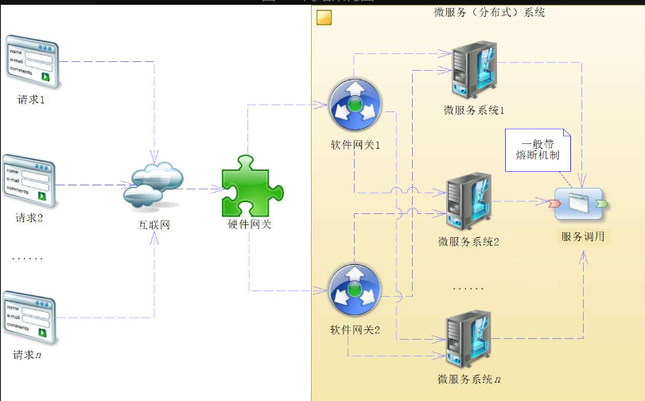
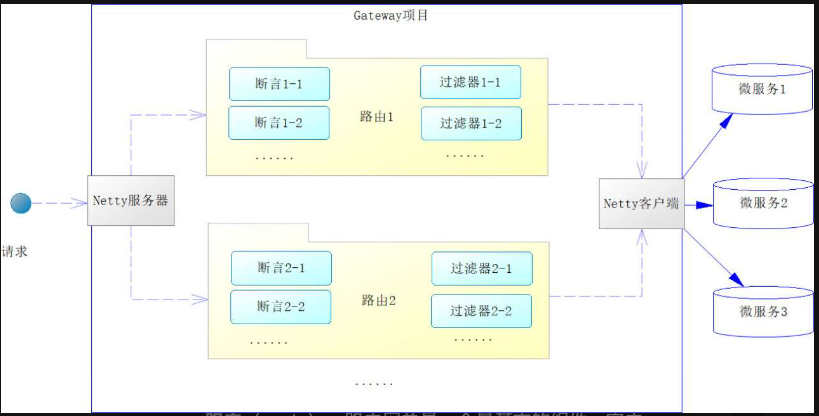
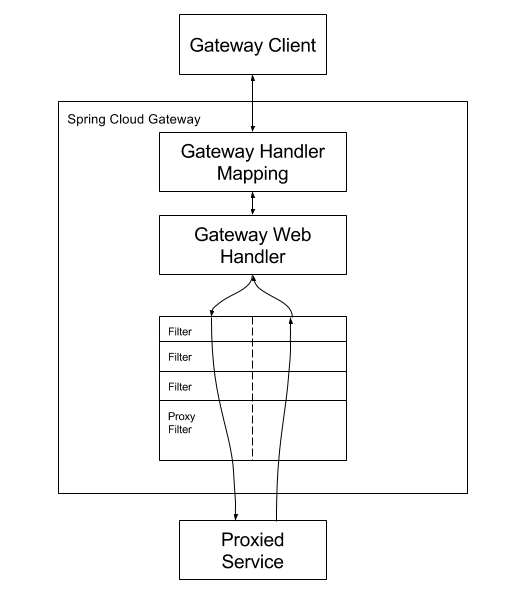
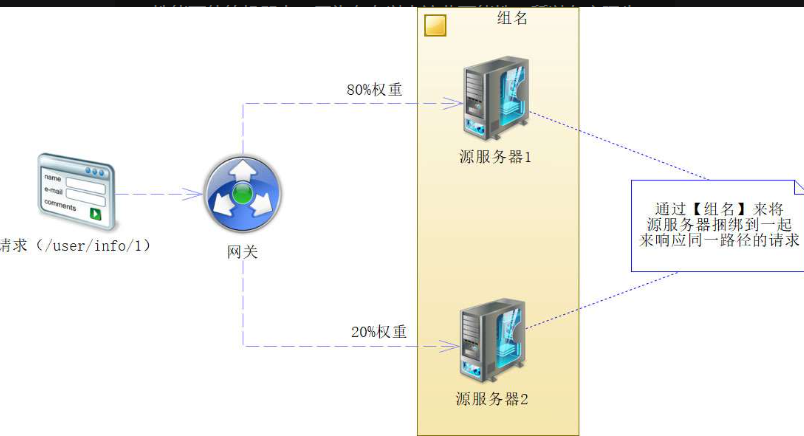
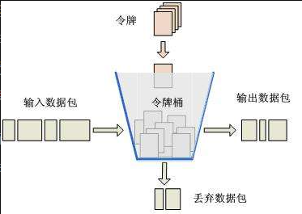
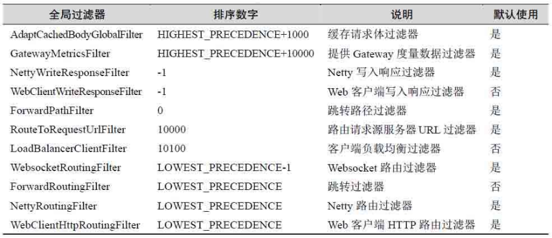
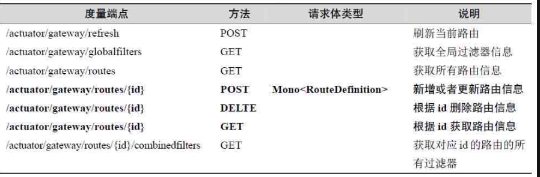

# 网关

软件网关是微服务系统的入口，它的作用为：

- 请求过滤：做验证请求有效性，身份验证等

- 路由分发：做负载均衡策略

  > 网关的负载均衡也被称为**服务器负载均衡**，它是针对微服务系统外部请求而言的；而**客户端负载均衡**则是对各个微服务业务系统之间的服务内部调用而言的

**Nginx 是流量网关**。而 **SpringGateway 是业务网关**：如果应用场景需要在API层面实现复杂逻辑，如动态路由、细粒度的鉴权和过滤等，Spring Cloud Gateway 能够提供更灵活的解决方案。Nginx作为最外层的反向代理处理静态内容和初步的负载均衡。

这里介绍 Spring Cloud Gateway ，它是由 WebFlux + Netty+ Reactor 实现的响应式 API 网关。旧网关 Zuul 不做介绍

Maven 依赖：

~~~xml
<dependency>
   <groupId>org.springframework.cloud</groupId>
   <artifactId>spring-cloud-starter-gateway</artifactId>
</dependency>
~~~

- Spring Cloud Gateway 需要 Spring Boot 和 Spring Webflux 提供的 Netty 运行时。它不能在传统的 Servlet 容器中工作，也不能以 WAR 的形式构建。
- 因为 Gateway 依赖 WebFlux，而 WebFlux 和 Spring Web MVC 的包冲突，所以项目再引入 spring- boot-starter-web 就会发生异常。

## YAML文件配置

~~~yaml
spring:
  cloud:
    gateway:
      # 开始配置路径
      routes:
        # 路径匹配
        - id: fund
        
          # 转发URI
          uri: http://localhost:7001
          
          # 断言配置
          predicates:
          - Path=/r4j/**
~~~

## 代码配置

~~~java
@SpringBootApplication(scanBasePackages = "com.spring.cloud.gateway.*")
public class GatewayApplication {
   public static void main(String[] args) {
      SpringApplication.run(GatewayApplication.class, args);
   } 

   /**
    * 创建路由规则
    * @param builder -- 路由构造器
    * @return 路由规则
    */
   @Bean
   public RouteLocator customRouteLocator(RouteLocatorBuilder builder) {
      return builder.routes() //开启路由配置
         // 一个断言,表示请求路径是否匹配指定路径
         .route(f -> f.path("/user/**") 
         // 将匹配的路径转发到具体的URI
         .uri("http://localhost:6001"))
         // 创建
         .build();
   }
}
~~~

## 执行原理

`Gateway` 执行请求的过滤和转发的示意图:

三个比较重要的组件:

- **路由（route）**：路由网关是一个最基本的组件，它由唯一标识 ID，目标 URI、断言集合和过滤器集合等共同组成。
- **断言（predicate）**：当请求满足所有断言时，才执行该路由，每个断言中的入参都是 Spring 框架的 ServerWebExchange 对象类型。它允许开发者匹配来自 HTTP 请求中的任何内容。
- **过滤器（filter）**：修改/过滤请求内容

`Gateway` 的执行过程如下：

一个请求首先是通过 `HandlerMapping` 机制找到对应的 `WebHandler`，然后是通过各类（代理）过滤器进行处理。过滤器被虚线分割的原因是，过滤器可以在代理请求发送之前和之后运行逻辑。所有的 `"pre"` （前）过滤器逻辑都被执行。然后发出代理请求。在代理请求发出后，`"post"` （后）过滤器逻辑被运行。

断言在 `HandlerMapping` 中实现，而 Filter 在 `WebHandler` 中实现。

## 断言

Before 断言在某个时间前的请求有效，有两种方式来使用 Before 断言

~~~java
// 通过代码来使用
@Bean
public RouteLocator customRouteLocator(RouteLocatorBuilder builder) {
   ZonedDateTime datetime = LocalDateTime.now()//获取当前时间
          // 两分钟后路由失效
          .plusMinutes(2)
          // 定义国际化区域
          .atZone(ZoneId.systemDefault()); // 定义UTC时间 ①
   return builder.routes()
          // 设置路由和 Before 断言
          // 这里的 /user/** 是路由的ID
          .route("/user/**", r -> r.before(datetime) 
                 // 转发到具体的URI
                 .uri("http://localhost:6001"))
          // 创建
          .build();
}
~~~

~~~yaml
# 通过配置文件来使用
spring:
  cloud:
    gateway:
      # 开始配置路径
      routes:
        - id: fund
          # 转发URI
          uri: http://localhost:7001
          # 断言配置
          predicates:
            - Path=/r4j/** # 路径匹配
            - Before=2019-09-14T10:58:00.9896784+08:00[Asia/Shanghai]
~~~

After 的示例：

~~~java
builder.routes()
    .route("/user/**", r -> r.after(datetime) 
    .build();
~~~

Between 的示例：

~~~java
builder.routes()
    .route("/user/**", r -> r.between(datetime1, datetime2) // ①
    .build();
~~~

~~~yaml
spring:
  cloud:
    gateway:
      routes:
          predicates:
            # Path断言
            - Path=/r4j/**
            # Between断言配置
            - Between=2019-09-14T13:18:53.5890502+08:00[Asia/Shanghai],2019-09-14T13:20:53.5890502+08:00[Asia/Shanghai]
~~~

Cookie 断言可以判定某个 Cookie 是否满足某个正则式

~~~java
builder.routes()
    // 设置路由和Cookies断言，
    // 判定Cookies中名称为“cookies_id”的参数是否匹配正则式“abcd.*”
    .route("/user/**", r -> r.cookie("cookies_id", "abcd.*")
    .build();
~~~

~~~yaml
spring:
  cloud:
    gateway:
      routes:
          predicates:
            # Path断言
            - Path=/r4j/** 
            # Cookie断言
            - Cookie=cookies_id,abcd.*
~~~

Header 断言判定某个请求头参数是否匹配一个正则式

~~~java
String regex = "^[0-9]*$"; // 0 ～ 9数字 ①

builder.routes()
    // 设置路由和 header 断言，
    // 判定请求头名称为 “id” 的参数是否为数字
    .route("/user/**", r -> r.header("id", regex) // ②
    // ...
~~~

Host 断言：

~~~java
String host1 = "**.host.com:3001";
String host2 = "**.myhost.com:3001";
builder.routes()
    // 设置路由和 Host 断言
    .route("/user/**", r -> r.host(host1, host2) 
    // ...
~~~

~~~yaml
predicates:
    # Host断言
    - Host=**.host.com:3001,**.myhost.com:3001
~~~

Method 断言：

~~~java
builder.routes()
    // 设置路由和Method断言，
    .route("/user/**", r -> r.method(HttpMethod.GET) // ①
    .build();
~~~

~~~yaml
predicates:
    # Method 断言
    - Method=GET
~~~

Path 断言：

~~~java
String path1 = "/user/info/{id}";
String path2 = "/user/infoes2";
builder.routes()
    // 设置路由和 Path 断言，
    .route("/user/**", r -> r.path(path1, path2) 
    .build();

~~~

~~~yaml
predicates:
    # Path断言
    - Path=/user/info/{id},/user/infoes2
~~~

Query 断言判断某个请求参数是否存在，或者参数是否通过验证

~~~java
String regex = "^[0-9]*$"; // 0～9的数字 ①
return builder.routes()
    // 设置路由和Method断言，要求参数和正则式匹配
    .route("/user/**", r-> r.query("id", regex) 
    // 要求存在参数  
    // .route("/user/**", r -> r.query("id") 
	//...
~~~

如果配置了 Weight 路由断言工厂，那么它就会根据组名和权重进行合理的路由。它的作用如下：

- 灰度发布
- 根据机器性能手动负载均衡

~~~java
@Bean
public RouteLocator customRouteLocator(RouteLocatorBuilder builder) {
   // 组名
   String groupName = "user_info"; 
   // 请求路径
   String path ="/user/info/{id}";
    
   return builder.routes()
      // 第一个路由
      .route("user_info_v1", r -> r.path(path)// 定义路径
         .and() // and连接词，表示并且
         .weight(groupName, 80) // 设置组名和权重
         .uri("http://localhost:6001"))
      // 第二个路由
      .route("user_info_v2", r -> r.path(path) 
         .and() 
         .weight(groupName, 20)
         .uri("http://localhost:6002"))
      //...
}
~~~

~~~yaml
spring:
  application:
    name: gateway
  cloud:
    gateway:
      # 开始配置路径
      routes:
        - id: fund
          uri: http://localhost:7001
          # 断言配置
          predicates:
            # 权重配置，第一个参数为组名，第二个参数为权重
            - Weight=fund-group-name,80
        # 路径匹配
        - id: fund2
          # 转发URI
          uri: http://localhost:7002
          # 断言配置
          predicates:
            - Weight=fund-group-name,20
~~~

我们也可以自定义断言：

~~~java
// 自定义路由断言工厂
@Component
public class AgeRoutePredicateFactory extends AbstractRoutePredicateFactory<AgeRoutePredicateFactory.Config> {

    public AgeRoutePredicateFactory() {
        super(AgeRoutePredicateFactory.Config.class);
    }

    // 将配置文件中的值按该方法所返回的顺序，赋值给配置类 AgeRoutePredicateFactory.Config
    @Override
    public List<String> shortcutFieldOrder() {
        return Arrays.asList(new String[]{"minAge", "maxAge"});
    }

    @Override
    public Predicate<ServerWebExchange> apply(Consumer<Config> consumer) {
        return super.apply(consumer);
    }

    @Override
    public Predicate<ServerWebExchange> apply(Config config) {
        // 创建网关断言对象
        return new Predicate<ServerWebExchange>() {
            // 检查
            @Override
            public boolean test(ServerWebExchange serverWebExchange) {
                // TODO 获取请求参数age，判断是否满足[18, 60)
                MultiValueMap<String, String> queryParams = serverWebExchange.getRequest().getQueryParams();
                String age = queryParams.getFirst("age");
                if (!StringUtils.isEmpty(age) && age.matches("[0-9]+")) {
                    int iAge = Integer.parseInt(age);
                    if (iAge >= config.minAge && iAge < config.maxAge) {
                        return true;
                    }
                }
                return false;
            }
        };
    }

    // 配置类，属性用于接收配置文件中的值
    @Validated
    public static class Config {
        private int minAge;
        private int maxAge;

        public int getMinAge() {
            return minAge;
        }

        public void setMinAge(int minAge) {
            this.minAge = minAge;
        }

        public int getMaxAge() {
            return maxAge;
        }

        public void setMaxAge(int maxAge) {
            this.maxAge = maxAge;
        }
    }
}
~~~

- 新建类名需要以 `RoutePredicateFactory` 结尾，并继承`AbstractRoutePredicateFactory`抽象类。
- 重写 apply() 方法

~~~yaml
routes:
    # 路由id
    - id: payment_routh
        uri: lb://cloud-payment-service
        # 断言
        predicates:
        # curl http://localhost:9527/payment/get/1
        - Path=/payment/get/**
        # Age：自动找到 "Age" + "RoutePredicateFactory" 断言工厂
        # 18,60: 断言工厂参数
        - Age=18,60
~~~

## 过滤器

Gateway 的过滤器分为全局过滤器（实现 `GlobalFilter` 接口）和局部过滤器（实现 `GatewayFilter` 接口）。全局过滤器针对所有路由有效，而局部过滤器则只针对某些路由有效。通过 Filter 我们可以做到修改该 HTTP 请求或者响应。

过滤器工厂是通过接口 `GatewayFilterFactory` 进行定义的，该接口还声明了一个 `apply` 方法，该方法返回类型为 `GatewayFilter`，即生成一个局部过滤器。Gateway 提供了内置的过滤器工厂，下面我们一一做介绍：

`AddRequestHeader` 是一个添加请求头参数的过滤器工厂：

~~~java
builder.routes()
    // 设置请求路径满足ANT风格“/user/**”的路由
    .route("user-service", r-> r.path("/user/**")
    // 通过增加请求头过滤器添加请求头参数
    .filters(f->f.addRequestHeader("id", "1")) // ①
//...
~~~

~~~yaml
spring:
  cloud:
    gateway:
      routes:
        # 路由编号
        - id: user-service
          # 转发URI
          uri: http://localhost:6001
          # 断言配置
          predicates:
            # 路径匹配
          - Path=/user/**
          # 过滤器工厂
          filters:
            # 请求头参数
          - AddRequestHeader=id, 1
~~~

`AddRequestParameter` 过滤器工厂可以新增请求参数

`AddResponseHeader` 过滤器工厂可以增加响应头参数

Retry  重试过滤器工厂有以下 5 个参数：

- `retries`：重试次数
- `statuses`：根据 HTTP 响应状态来断定是否重试
- `methods`：请求方法，如 GET、POST、PUT 和 DELETE 等
- `series`：相当于 `statuses` ，但它只考虑响应码的第一位。1 代表消息，2 代表成功，3 代表重定向，4 代表客户端错误，5 代表服务端错误。
- `exceptions`：请求异常列表，默认的情况下包含 `IOException` 和 `TimeoutException` 两种异常。

有以下 3 个 `retry` 方法：

~~~java
// 参数 retries 为重试次数
public GatewayFilterSpec retry(int retries)

// 需要 RetryGatewayFilterFactory.RetryConfig 重试配置
public GatewayFilterSpec retry(
   Consumer<RetryGatewayFilterFactory.RetryConfig> retryConsumer)

// 使用 Netty 底层，比较复杂，不推荐使用
public GatewayFilterSpec retry(
   Repeat<ServerWebExchange> repeat, Retry<ServerWebExchange> retry)
~~~

使用示例：

~~~java
builder.routes()
    .route("hystrix-service", r-> r.path("/hystrix/**")
    // 重试 2 次（最多尝试路由 3 次，其中 2 次是重试）
    .filters(f->f.retry(2))
//...
~~~

~~~java
builder.routes()
    // 设置请求路径满足ANT风格“/user/**”的路由
    .route("hystrix-service", r-> r.path("/hystrix/**")
     // 使用重试配置，配置重试
     .filters(f->f.retry(retryConfig ->{ // ①
     // 重试次数为2
     retryConfig.setRetries(2);
     // 接受HTTP的请求方法，限制范围为GET、POST和PUT
     retryConfig.setMethods(HttpMethod.GET, HttpMethod.POST, HttpMethod.PUT);
     // 限制重试的响应码为服务器错误（500）和坏请求（400）
     retryConfig.setStatuses(HttpStatus.INTERNAL_SERVER_ERROR, HttpStatus.BAD_REQUEST);
     // 限制重试的响应码系列为服务器错误
	retryConfig.setSeries(HttpStatus.Series.SERVER_ERROR);
}))

~~~

~~~yaml
spring:
  cloud:
    gateway:
      routes:
        # 路由编号
        - id: user-service
          # 转发URI
          uri: http://localhost:6001
          # 断言配置
          predicates:
            # 路径匹配
            - Path=/user/**
          # 过滤器工厂
          filters:
            # 过滤器工厂名称
            - name: Retry
              # 配置参数（对应RetryGatewayFilterFactory.RetryConfig）
              args:
                # 重试次数，默认为3
                retries: 2
                # 对应HTTP请求方法，默认只包含GET
                methods: GET, POST, PUT
                # 状态限制
                statuses: INTERNAL_SERVER_ERROR, BAD_REQUEST
                # 系列限制
                series: SERVER_ERROR
~~~

`RequestRateLimiter` 工厂用于限制请求流量，避免过大的流量进入系统。在 Gateway 中，唯一·的实现类是 `RedisRateLimiter`。从名称可以看出，要依赖 Redis，而且限流对象只能是 Path，这里就简单介绍一下。之后会着重介绍使用 Resilience4j 限流器，因为它是基于本地进程内存的，且不依赖第三方服务。

要是用 RedisRateLimiter，就需要引入 spring-boot-starter-data-redis-reactive 依赖：

~~~xml
<!--响应式Redis包-->
<dependency>
   <groupId>org.springframework.boot</groupId>
   <artifactId>spring-boot-starter-data-redis-reactive</artifactId>
</dependency>

<!--连接池包-->
<dependency>
   <groupId>org.apache.commons</groupId>
   <artifactId>commons-pool2</artifactId>
</dependency>
~~~

Redis 的配置文件：

~~~yaml
spring:
  redis:
    # Redis服务器
    host: 192.168.224.129
    # Redis密码
    password: 123456
    # Lettuce客户端配置
    lettuce:
      pool:
        # 最大活动数
        max-active: 20
        # 最大等待时间
        max-wait: 2000ms
        # 最小空闲数
        min-idle: 10
        # 最大空闲数
        max-idle: 15
~~~

在 YAML 文件中配置 `RequestRateLimiter`：

~~~yaml
spring:
  cloud:
    gateway:
      routes:
        # 路由编号
      - id: hystrix-service
        # 转发URI
        uri: http://localhost:6001
        # 断言配置
        predicates:
        # 路径匹配
        - Path=/hystrix/**
        # 过滤器工厂
        filters:
        # 过滤器名称
        - name: RequestRateLimiter
          # 参数
          args:
            # 每秒发放的令牌数量
            redis-rate-limiter.replenishRate: 10 # ①
            # 令牌桶容量
            redis-rate-limiter.burstCapacity: 20 # ②
~~~

`RedisRateLimiter` 使用了「令牌桶算法」来实现限流

令牌流会按照一个速率流入到令牌桶中。而请求需要到令牌桶中获取令牌后，才可以访问后端服务器。该算法存在三种情况：

- `请求流速率 = 令牌流速率`：
- `请求流速率 < 令牌流速率`：没有被消耗的令牌会存储在桶里。当令牌桶装满后，令牌就会溢出
- `请求流速率 > 令牌流速率`：会有部分请求流得不到令牌，从而被丢弃。

默认提供的限流过滤器工厂是根据 Path 断言来限流的。我们可以通过 `KeyResolver` 来实现基于用户进行限流：

~~~java
@Bean
public KeyResolver pathKeyResolver() {
   return exchange -> 
      // 获取用户编号（此时要求请求参数中带有名为"user-id"的参数）
      Mono.just(exchange.getRequest().getQueryParams().getFirst("user-id"));
}
~~~

KeyResolver 定义了一个 key， 而这个 key 对应一个独立的令牌桶。这样我们就可以基于用户进行限流

~~~yaml
spring:
  cloud:
    gateway:
      routes:
        # 路由编号
      - id: hystrix-service
        # 转发URI
        uri: http://localhost:6001
        # 断言配置
        predicates:
        # 路径匹配
        - Path=/hystrix/**
        # 过滤器工厂
        filters:
        # 过滤器名称
        - name: RequestRateLimiter
          # 参数
          args:
            # 每秒发放的令牌数量
            redis-rate-limiter.replenishRate: 3
            # 令牌桶容量
            redis-rate-limiter.burstCapacity: 2
            # 配置KeyResolver，产生独立的令牌桶
            key-resolver: "#{@pathKeyResolver}" // ①
~~~

注意代码①处，这是 Spring EL 的写法，用于指向我们自己创建的 KeyResolver。

有时候为了区分要路由到的源服务器，我们需要在请求路径中加入前缀，这个时候就可以使用 StripPrefix 过滤器工厂将这个前缀去除掉。

~~~Java
builder.routes()
    // 设置请求路径满足ANT风格“/u/**”的路由
    .route("user-service", r-> r.path("/u/**")
    // 通过StripPrefix过滤器添加响应参数
    .filters(f->f.stripPrefix(1)) // ①
    .uri("http://localhost:6001"))
    .build();
~~~

例如，请求路径为 `/u/user/info/1` 时，就会路由到源服务器地址 `/user/info/1`

RewritePath 过滤器工厂和 StripPrefix 过滤器工厂类似，但它的功能更加强大，可以重写请求路径：

~~~java
builder.routes()
    // 设置请求路径满足ANT风格“/u/**”的路由
    .route("user-service", r-> r.path("/u/**")
    // 重写请求路径
     .filters(f->f.rewritePath("/u/(?<segment>.*)","/$\\{segment}"))//②
     .uri("http://localhost:6001"))
    .build();
~~~

~~~yaml
spring:
  cloud:
    gateway:
      routes:
      - id: user-service
        # 转发URI
        uri: http://localhost:6001
        # 断言配置
        predicates:
        # 路径
        - Path=/u/**
        filters:
        # 定义重写路径的逻辑
        - RewritePath=/u/(?<segment>.*), /$\{segment}
~~~

SetStatus 过滤器工厂可以改写响应码

~~~java
builder.routes()
    // 请求路径满足ANT风格“/u/**”的路由
    .route("hystrix-service", r-> r.path("/hystrix/**")
    .filters(f->f.setStatus(HttpStatus.BAD_REQUEST.value())) // 401响应码
    //...
~~~

## 自定义过滤器

自定义过滤器分为 3 个内容：局部过滤器、定义全局过滤器和过滤器的执行顺序

### 局部过滤器

局部过滤器通过 `GatewayFilter` 接口来定义：

~~~java
public interface GatewayFilter extends ShortcutConfigurable {
    String NAME_KEY = "name";
    String VALUE_KEY = "value";

    Mono<Void> filter(ServerWebExchange exchange, GatewayFilterChain chain);
}
~~~

- `exchange`：数据交换对象，通过它的 `getRequest` 方法可以获取请求对象`ServerHttpRequest`，通过它的 `getResponse` 方法可以得到响应对象`ServerHttpResponse`
- `chain`：Gateway 过滤器责任链，调用它的 `filter(ServerWebExchange)` 方法，表示继续执行责任链里后续的过滤器。

下面我们介绍如何使用 Resilience4j + 局部过滤器来实现一个限流器

~~~yaml
# resilience4j配置
resilience4j:
  # 限速器注册机
  ratelimiter:
    limiters:
      # 名称为user的限速器
      user:
        # 时间戳内限制通过的请求数，默认为50
        limitForPeriod: 3
        # 配置时间戳（单位毫秒），默认值为500 ns
        limitRefreshPeriodInMillis: 5000
        # 超时时间
        timeoutInMillis: 10
~~~

~~~java
// 注入Resilience4j限流器注册机
@Autowired
private RateLimiterRegistry rateLimiterRegistry = null;

private ResultMessage rateLimit() {
   // 获取Resilience4j限速器
   RateLimiter userRateLimiter = rateLimiterRegistry.rateLimiter("user");
    
   // 绑定限速器
   Callable<ResultMessage> call 
          = RateLimiter.decorateCallable(userRateLimiter,
             () -> new ResultMessage(true, "PASS") ); // ①
    
   // 尝试获取结果
   Try<ResultMessage> tryResult = Try.of(() -> call.call())
          // 降级逻辑
          .recover(ex -> new ResultMessage(false, "TOO MANY REQUESTS")); // ②
   ResultMessage result = tryResult.get();
   return result;
}
~~~

~~~java
/**
 * 自定义Gateway过滤器
 * @return Gateway过滤器
 */
private GatewayFilter customGatewayFilter() {
   return (exchange, chain) -> { 
      // 执行Resilience4j限速器逻辑
      ResultMessage resultMessage = rateLimit();
      if (!resultMessage.getSuccess()) { // 限流逻辑
         // 获取响应对象
         ServerHttpResponse response = exchange.getResponse();
         // 响应码为 429——请求过多
         response.setStatusCode(HttpStatus.TOO_MANY_REQUESTS);
         // 响应类型为 JSON
         response.getHeaders()
             .setContentType(MediaType.APPLICATION_JSON_UTF8);
         // 转换为JSON字符串
         String body =toJson(resultMessage);
         // 响应数据放入缓冲区
         DataBuffer dataBuffer 
             = response.bufferFactory().wrap(body.getBytes());
         // 使用限流结果响应请求，不再继续执行过滤器链
         return response.writeWith(Mono.just(dataBuffer));
      }
      // 放行，继续执行过滤器链
      return chain.filter(exchange); // ③
};
}

private String toJson(ResultMessage result) {
   ObjectMapper mapper = new ObjectMapper();
   String body = null;
   try {
      body = mapper.writeValueAsString(result);
   } catch (JsonProcessingException e) {
      e.printStackTrace();
   }
   return body;
}
~~~

然后我们注册这个过滤器

~~~java
builder.routes()
    .route("user-service", r-> r.path("/user/**")
    // 添加自定义过滤器
    .filters(f->f.filter(customGatewayFilter())) // ①
    .uri("http://localhost:6001"))
    .build();
~~~

实际上有三个添加自定义过滤器的方法：

~~~java
// 加入单个Gateway过滤器
public GatewayFilterSpec filter(GatewayFilter gatewayFilter) 

// 加入单个Gateway过滤器，并定义过滤器顺序，之后会介绍
public GatewayFilterSpec filter(GatewayFilter gatewayFilter, int order)

// 加入 Gateway 过滤器列表
public GatewayFilterSpec filters(GatewayFilter... gatewayFilters)
~~~

### 全局过滤器

全局过滤器的接口定义是 GlobalFilter：

~~~java
public interface GlobalFilter {
   Mono<Void> filter(ServerWebExchange exchange, GatewayFilterChain chain);
}
~~~

对于全局过滤器，需要路由命令的处理器（`FilteringWebHandler`）把它转变为GatewayFilter，放到每个路由的过滤器链中。这件事 Gateway 已经帮我们完成了。我们仅需提供一个全局过滤器 Bean 即可。

下面我们以 Token 为例，介绍如何使用全局过滤器：

~~~java
@Bean // 装配为Spring Bean
public GlobalFilter tokenFilter() {
   // Lambda表达式
   return (exchange, chain) -> {
      // 判定请求头 token 是否存在
      boolean flag = !StringUtils.isBlank(
             exchange.getRequest().getHeaders().getFirst("token"));
      if (flag) { // 如果存在，则直接放行，不做任何处理。
         return chain.filter(exchange);
      }
      // 获取请求参数 token 
      String token = exchange.getRequest()
            .getQueryParams().getFirst("token");
      ServerHttpRequest request = null;
      // token 不为空，路由时将它放入请求头
      if (!StringUtils.isBlank(token)) {
         request  = exchange.getRequest().mutate() // 构建请求头
                .header("token", token)
                .build();
         // 构造请求头后执行责任链
         return chain.filter(exchange.mutate().request(request).build());
      }
      // 放行
      return chain.filter(exchange);
   };
}
~~~

### 过滤器顺序

Gateway 定义了一个Ordered（org.springframework.core.Ordered）接口来支持排序。实际上，Gateway 已经提供了默认的全局过滤器，它们的顺序如下：

默认的排序数字为 0 

~~~java
@Component // 让 Spring IoC 容器扫描 
public class TokenFilter implements GlobalFilter, Ordered { // ②
   // 过滤器逻辑
   @Override
   public Mono<Void> filter(
          ServerWebExchange exchange, GatewayFilterChain chain) {
		// ...
   }

   // 排序  ③
   @Override
   public int getOrder() {
      return HIGHEST_PRECEDENCE + 100001;
   }
}
~~~

实际上，我们可以使用 OrderedGatewayFilter 来完成对于局部过滤器的排序

~~~java
@Bean
public GatewayFilter customGatewayFilter() {
   int order = -100; // 排序
   // 创建委托过滤器
   GatewayFilter filter = (exchange, chain) -> {
		// ...
   };
   // 创建OrderedGatewayFilter
   return new OrderedGatewayFilter(filter, order);
}
~~~

## 服务发现的路由

上述的例子都是以微服务实例来进行路由，我们可以通过 `LoadBalancerClientFilter` 完成基于服务发现的路由。

首先要把 Gateway 模块注册到 Eureka 服务治理中心，在 YAML 文件中进行如下配置

~~~yaml
 # 请求URL指向Eureka服务治理中心
eureka:
  client:
    serviceUrl:
      defaultZone : http://localhost:5001/eureka/,http://localhost:5002/eureka/
~~~

在 Gateway 中，对于 URI 的配置有这样一种约定：使用 `lb://{service-id}` 格式时，就采用服务发现的路由

~~~java
@Bean
public RouteLocator customRouteLocator(RouteLocatorBuilder builder) {
   return builder.routes()
      // 设置请求路径满足ANT风格“/user/**”的路由
      .route("user-service", r-> r.path("/user/**")
      // 使用服务发现的路由
      .uri("lb://user")) 
      .build();
}
~~~

也可以通过 YAML 文件进行配置：

~~~yaml
spring:
  cloud:
    gateway:
      routes:
      - id: user-service
        # 客户端负载均衡路由
        uri: lb://user
        # 匹配路径
        predicates:
        - Path=/user/**
~~~

## 度量

在 Gateway 中，它提供的度量控制器的名称为 gateway，我们还需要在 YAML 文件中进行如下配置以暴露端点：

~~~yaml
management:
  endpoints:
    web:
      # 暴露端点
      exposure:
        # 配置暴露的端点
        include: gateway
~~~

在浏览器中请求地址 http://localhost:3001/actuator/gateway/routes，就可以看到下图对应的路由信息了。

