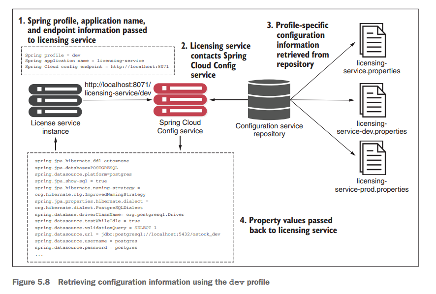
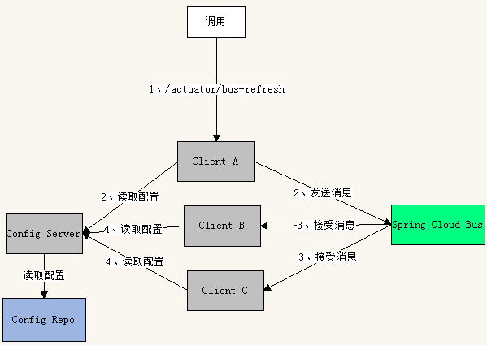

# 配置

在微服务体系中，手动更新每一个微服务实例的配置几乎无从谈起。因此，我们需要引入集中化的配置中心，可以统一配置各个微服务实例。这里我们介绍 Spring Cloud Config 配置中心。在 Config 中，有以下两个部分：

- 服务端（集中化配置中心）：从各种配置源中（例如 Github ）拉取对应的配置文件，提供给客户端。
- 客户端：具体的微服务实例，通过服务端来获取自己的配置文件

Config 服务端的 Maven 依赖：

~~~xml
<!-- Config 服务端依赖 -->
<dependency>
   <groupId>org.springframework.cloud</groupId>
   <artifactId>spring-cloud-config-server</artifactId>
</dependency>
~~~

服务端的配置文件：

~~~yaml
spring:
  cloud:
    config:
      # Config服务端配置
      server:
        # 使用Git，从Git仓库中读取配置文件
        git:
          # GitHub 的 URI，以这个 URI 作为配置文件的根目录
          uri: https://github.com/ykzhen2019/chapter10
          
          # GitHub用户名
          # username: your-username
          
          # GitHub密码
          # password: your-password
          
          # 默认的Git分支，默认值为“master”
          # default-label: master
          
          # 配置文件所在根目录
          # 使用逗号分隔可配置多个路径
          # search-paths: /config
  application:
    # 微服务名称
    name: config-center
# 配置端口
server:
  port: 4001
~~~

服务端暴露的端点有：

- /{application}/{profile}[/{label}]
- /{application}-{profile}.yml
- /{label}/{application}-{profile}.yml
- /{application}-{profile}.properties
- /{label}/{application}-{profile}.properties

在 Git 仓库中的配置文件命名要遵循 {application}-{profile}.yml 这样的格式

- `application` 通过 `spring.config.name` 注入，表示微服务名称
- `profile` 表明当前的环境，例如 `test`、`dev`、`prod`
- `label` 是一个可选的 git 标签（默认为 `master`）

通过注解 `@EnableConfigServer` 驱动该服务为 Config 的服务端

~~~java
@SpringBootApplication
// 驱动该微服务为 Config 服务端
@EnableConfigServer
public class CfgServerApplication {
   public static void main(String[] args) {
      SpringApplication.run(CfgServerApplication.class, args);
   }
}
~~~

客户端的 Maven 依赖：

~~~xml
<dependency>
   <groupId>org.springframework.cloud</groupId>
   <artifactId>spring-cloud-starter-config</artifactId>
</dependency>
~~~

然后在模块 cfg-client 中的 resources 文件夹下添加文件 bootstrap.yml。它先于 application.yml 文件进行加载，然后

~~~yaml
spring:
  application:
    # 微服务名称
    name: config-client
  cloud:
    # Config 客户端配置
    config:
      # 连接的 服务端 URI
      uri: http://localhost:4001
      # 是否支持快速失败
      fail-fast: false
      # 使用的分支，如果缺省就会采用服务端的spring.cloud.config.server.git.default-label 配置项
      # label: master
  profiles:
    # 配置版本号
    active:
    - v1
~~~

Config 客户端从服务端中获取 `{spring.application.name}-{spring.profiles.active}.yml` 配置文件（如果给出了这两个配置项）。

服务端也可以从本地读取配置文件：

~~~yaml
spring:
  cloud:
    config:
      # Config服务端配置
      server:
        # 本地文件
        native:
          # classpath指向类路径，/configs代表目录
          search-locations: classpath:/configs  # ①
  application:
    # 微服务名称
    name: config-center
  profiles:
    # 注意，这个配置项一定要配置，
    # 否则Config服务端会因默认使用 Git 而报错
    active: native # ②
server:
  # 启动端口
  port: 4001
~~~

## 安全

某些配置项是敏感信息，需要加密保存。在 Config 中，支持用 JCE（Java Cryptography Extension）规则进行加密配置。在 Config 中，会默认给出以下 4 个关于 JCE 的端点

- `/encrypt/status`：GET请求，查看当前 JCE 状态
- `/key`：GET 请求，加密或解密密钥
- `/encrypt`：POST 请求，加密请求体
- `/decrypt`：POST 请求，解密请求体

在  bootstrap.yml 文件中做如下配置：

~~~yaml
encrypt:
  # 这是一个对称加密的密钥
  key: chapter10
~~~

我们**手动**用该密钥进行加密，并将密文放在配置文件中：

~~~java
# 服务端口
server:
  port: 3001

# 当前版本信息 
version:
  message: '{cipher}b2f55adafb35d6dfd812a15365ff4c3c34fea63a180634b47f387c2bd93f0c54994f0f49d915b5daf5af266a559e7a15'  # 
~~~

Config 会根据 {encrypt.key} 以及密文的前缀（这里是 {cipher} ）来做解密的

## 高可用

我们通过 Eureka 来实现 Config 的高可用。Config 客户端通过服务发现指定配置中心

~~~yaml
spring:
  application:
    # 微服务名称
    name: config-client
  cloud:
    # 配置 Config 
    config:
      # ...
      # 配置服务发现
      discovery:
        # 是否启用服务发现寻找 Config 服务端
        enabled: true
        # Config 服务端的 serviceId
        serviceId: config-center
~~~

## 自动刷新

通过`@RefreshScope`注解 + `actuator`，来解决配置动态获取的问题。

~~~java
import org.springframework.cloud.context.config.annotation.RefreshScope;

@SpringBootApplication
@RefreshScope
public class LicenseServiceApplication {
     public static void main(String[] args) {
     	SpringApplication.run(LicenseServiceApplication.class, args);
     }
}
~~~

接下来，我们主动发送 POST 请求到 `http://localhost:8080/actuator/refresh` 这个接口，此时就会自动刷新配置了。但是这只会刷新一个客户端，如果要刷新所有客户端，那么就要使用`Spring Cloud Bus` ，然后发送 POST 请求到`actuator/bus-refresh` 即可.

Spring Bean 容器是支持自动刷新机制的。

## K8s

[Spring Cloud Kubernetes](https://docs.spring.io/spring-cloud-kubernetes/docs/1.1.5.RELEASE/reference/html/) 关联了`Spring Cloud`应用与`Kubernetes`服务。

maven 依赖如下

~~~xml
<dependency>
    <groupId>org.springframework.boot</groupId>
    <artifactId>spring-boot-starter-web</artifactId>
</dependency>
<dependency>
    <groupId>org.springframework.cloud</groupId>
    <artifactId>spring-cloud-starter-kubernetes-config</artifactId>
</dependency>
~~~

配置文件如下：

~~~yaml
server:
  port: 8080
spring:
  application:
    name: spring-cloud-kubernetes-configmap
  cloud:
    kubernetes:
      config:
        name: spring-cloud-kubernetes-configmap # 通过 ConfigMap Name 来指定要使用的 ConfigMap
~~~

ConfigMap 的内容如下：

~~~yaml
kind: ConfigMap
apiVersion: v1
metadata:
  name: spring-cloud-kubernetes-configmap
  namespace: default
  labels:
    app: scdf-server
data:
  application.yaml: |-
    pkslow:
      age: 19
      email: admin@pkslow.com
      webSite: www.pkslow.com
~~~

自动刷新配置：

~~~yaml
server:
  port: 8080
spring:
  application:
    name: spring-cloud-kubernetes-configmap
  cloud:
    kubernetes:
      config:
        name: spring-cloud-kubernetes-configmap
        namespace: default
      secrets:
        name: spring-cloud-kubernetes-secret
        namespace: default
        enabled: true
      reload:
        enabled: true
        monitoring-config-maps: true
        monitoring-secrets: true
        strategy: restart_context
        mode: event
management:
  endpoint:
    restart:
      enabled: true
  endpoints:
    web:
      exposure:
        include: restart
~~~

- `spring.cloud.kubernetes.reload.enabled=true`打开刷新功能；
- `strategy`：
  - `refresh`：只对有注解`@ConfigurationProperties` 或 `@RefreshScope`的配置生效。
  - `restart_context`：整个`Spring Context`会优雅重启，里面的所有配置都会重新加载。
- `mode`
  - `Event`：会通过`k8s API`监控`ConfigMap`的变更，读取配置并生效。
  - `Polling`：定期查看是否有变化，有变化则触发，默认为15秒。

此外，还需要配置`management.endpoint`来打开`actuator endpoint`，并且还要引入以下依赖：

~~~xml
<dependency>
  <groupId>org.springframework.boot</groupId>
  <artifactId>spring-boot-actuator</artifactId>
</dependency>
<dependency>
  <groupId>org.springframework.boot</groupId>
  <artifactId>spring-boot-actuator-autoconfigure</artifactId>
</dependency>
~~~
