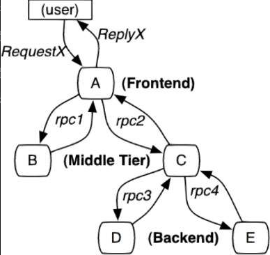

# 全链路追踪

假设链路中某个服务出现了异常，在如此复杂的链路上，如果没有对应的链路日志，就很难定位发生错误的服务实例，这就是为什么需要全链路追踪组件

Dapper, a Large-Scale Distributed Systems Tracing Infrastructure 是分布式链路追踪的理论基础。对于全链路追踪组件，Dapper 论文提出了 3 点要求：

- **低消耗**：在分布式系统中，植入分布式链路追踪组件，对系统性能的损耗应该是很小的
- **应用级的透明**：指在植入分布式链路追踪组件后，对原有的业务应该是透明的，不应该影响原有代码的编写和业务，链路追踪组件会按照自己的维度去采集服务调用之间的数据，并且通过日志进行展示
- **延展性**：链路追踪组件应该能够进行扩展，以适应分布式系统不断膨胀和转变的需求

全链路追踪组件所采集到的数据要满足：

- span：基本单元。执行一次服务调用就生成一个 span，用来记录当时的情况，它会以一个 64 位 ID 作为唯一标识。span 还有其他数据信息，如摘要、时间戳事件、关键值注释（tags）、 span 的 ID 和进度 ID（通常是 IP 地址）。
- trace：它代表一次请求，以一个 64 位 ID 作为唯一标识。一个 trace 包含多个 span
- annotation：注解，它代表服务调用的客户端和服务端的行为，存在以下注解
  - cs（Client Sent）：客户端（服务消费者）发起一个服务调用，它意味着一个 span 的开始
  - sr（Server Received）：服务端（服务提供者）获得请求信息，并开始处理。sr 与 cs 的时间差，就是网络延迟时间
  - ss（Server Sent）：服务端处理完请求，将结果返回给客户端。将 ss 与 sr 的时间差，就是服务端处理请求所用的时间
  - cr（Client Received）：它代表一个 span 的结束，客户端成功接收到服务端的回复。将 cr 与 cs 的时间差，就是客户端从服务端获取响应所用的时间。
  - tag：可以往 span 中添加一些 Key、Value 元信息。

Spring Cloud Sleuth 可以用来追踪微服务请求中的整个请求，通过它可以记录各个请求之间的耗时、异常等情况。Sleuth 记录的这些信息，需要有系统来收集、存储和查询，市场上有很多工具配合，如：Zipkin、Skywalking、pinpoint等。

Spring官方文档已经说明，`Springboot 3.x`不再支持`sleuth`的使用，已经转移至`Micrometer Tracing`项目

~~~xml
<dependency>
    <groupId>org.springframework.boot</groupId>
    <artifactId>spring-boot-starter-actuator</artifactId>
</dependency>
<dependency>
    <groupId>io.micrometer</groupId>
    <artifactId>micrometer-tracing</artifactId>
</dependency>
<dependency>
    <groupId>io.micrometer</groupId>
    <artifactId>micrometer-tracing-bridge-brave</artifactId>
</dependency>
<dependency>
    <groupId>io.zipkin.reporter2</groupId>
    <artifactId>zipkin-reporter-brave</artifactId>
</dependency>
~~~

~~~yaml
management:
  zipkin:
    tracing:
      endpoint: http://localhost:9411/api/v2/spans
  tracing:
    sampling:
      probability: 1.0  # 采样率默认为0.1(0.1 就是 10 次只能有一次被记录下来)
~~~

Spring Cloud Sleuth 的追踪信息中的 traceId、spanId 等会自动的添加到 Slf4j 的 MDC 中。在 `pattern` 中添加变量 `%X{traceId}`、`%X{spanId}` 就能读到 MDC 中设置的 traceId、spanId 值。而默认的日志格式会自带这些追踪信息。

在 Http 请求链中，Sleuth 将 traceId 等信息通过 Http 请求头传递过去。下面可以演示一下

~~~java
@GetMapping("/hello")
public String hello(@RequestParam String name, @RequestHeader Map<String, String> headers) {
    log.info("headers:{}", headers);
}
~~~

~~~
headers:{x-b3-traceid=6dd57dc2ad55c58f, x-b3-spanid=b5e6de658b261ac7, x-b3-parentspanid=6dd57dc2ad55c58f, x-b3-sampled=1, accept=*/*, user-agent=Java/1.8.0_202, host=localhost:8081, connection=keep-alive}
~~~

而 sleuth 框架的 `LazyTracingFilter`从 Http Request 的 Header 里获取 Span 数据。这样开发者就无需操心 span 是如何在整个请求链中传播的了。

sleuth 框架定义了自动配置，会将 spring 容器中注册的线程池 bean 代理成 `LazyTraceThreadPoolTaskExecutor`，而 LazyTraceThreadPoolTaskExecutor 这个框架自定义的线程池能实现对 traceId 等信息的传递。但是 jdk 中的 `ForkJoinPool.commonPool()`，并未被代理。

通过配置参数 `spring.sleuth.async.enabled`来开启代理，默认是开启的。如果部分自定义线程的 bean 不想如此代理，还可以配置 `spring.sleuth.async.ignored-beans`。

通过在代码中注入`Tracer`类，来获取 Span，并添加 tag：

~~~java
private Tracer tracer;

@Autowired
public void setTracer(Tracer tracer) {
    this.tracer = tracer;
}
~~~

~~~java
tracer.currentSpan().tag("transId", "11111");
tracer.currentSpan().tag("appId", "22222");
tracer.currentSpan().tag("reqTime", LocalDateTime.now().toString());
~~~

安装 Zipkin（官网 https://zipkin.io/pages/quickstart.html）

~~~bash
curl -sSL https://zipkin.io/quickstart.sh | bash -s
java -jar zipkin.jar
~~~

Zipkin Server 默认将追踪数据信息保存到内存。我们可以将其持久化到 MySQL 或者 ES 中。下面我们介绍如何持久化到 MySQL 中：

1. 建表语句：https://github.com/openzipkin/zipkin/blob/master/zipkin-storage/mysql-v1/src/main/resources/mysql.sql

2. 参数参考：

   ~~~bash
   
   nohup java -jar zipkin-server-2.23.18-exec.jar --STORAGE_TYPE=mysql --MYSQL_HOST=192.168.1.168 --MYSQL_TCP_PORT=3306 --MYSQL_DB=zipkin --MYSQL_USER=root --MYSQL_PASS=root -java.tmp.dir=/var/linktracking/zipkin/temp >/dev/null >zipkin.log 2>&1 & echo $! > pidfile.txt 
   ~~~

持久化到 ES 中：

~~~bash
nohup java -jar zipkin.jar --STORAGE_TYPE=elasticsearch --ES_HOSTS=http://114.116.218.95:9201 -java.tmp.dir=/var/zipkin/temp >/dev/null >zipkin.log 2>&1 & echo $! > pidfile.txt 
~~~

