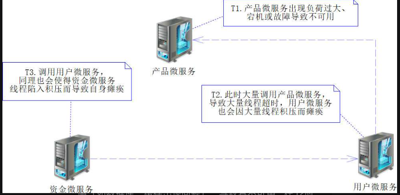
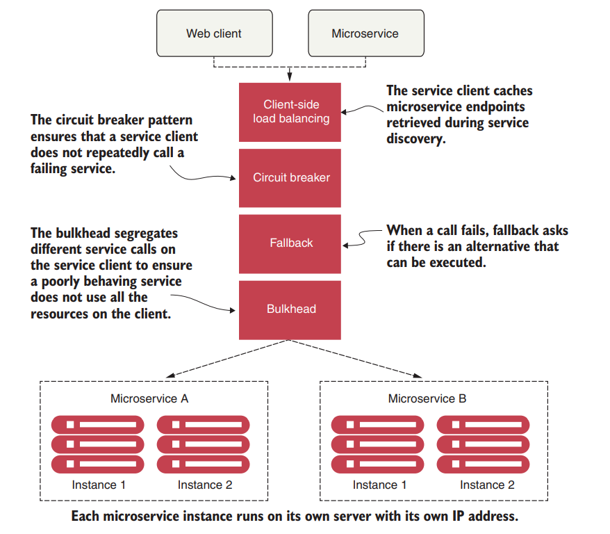
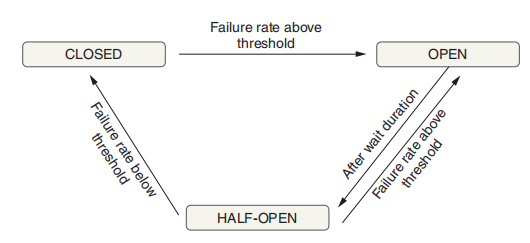
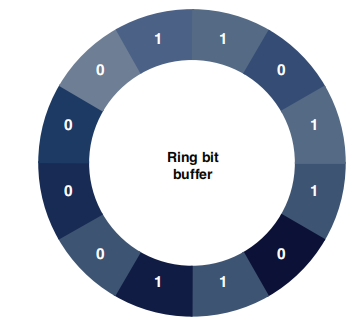

## 断路器——Hystrix

`Netflix Hystrix` 项目不再新增功能和发布新版本，只修复现有功能的缺陷，所以 Spring Cloud 打算使用 `Resilience4j` 框架取代 `Netflix Hystrix`。

## 新断路器——Resilience4j

### 基本概念

因为产品微服务不可用，会导致其他正常微服务出现线程积压的情况，这种情况会进一步蔓延，最终导致所有服务不可用，这便是雪崩效应。有三种方案来处理这种雪崩问题：

1. 熔断：熔断这一概念来源于电子工程中的断路器（Circuit Breaker）。在互联网系统中，当下游服务因访问压力过大而响应变慢或失败，上游服务为了保护系统整体的可用性，可以暂时切断对下游服务的调用。即**牺牲局部，保全整体**，避免请求堆积和资源耗尽

2. 限流：设置一个请求速率阈值，限制每个客户端或用户在特定时间内的请求次数。这样可以防止过多的请求涌入系统，保护系统免受过载和压力冲击，平滑流量，避免系统突发流量的影响。

3. 服务降级：当服务不可用时，降级服务会代替提供一些基本功能或返回预设的默认值，以确保系统依然能够提供有限的功能或服务；

   

Resilience4j 包含多个模块，开发者可以根据自己的需要加入依赖，核心模块有以下几个：

- resilience4j-circuitbreaker：断路器
- resilience4j-ratelimiter：限速器
- resilience4j-bulkhead：舱壁模式
- resilience4j-bulkhead：舱壁模式
- resilience4j-retry：自动重试（同步和异步）
- resilience4j-cache：响应结果缓存
- resilience4j-timelimiter：超时处理

附加模块有以下几个：

- resilience4j-reactor：Spring Reactor 适配器
- resilience4j-micrometer：Micrometer 度量输出
- resilience4j-spring-boot2：Spring Boot 2.x 启动器

~~~xml
<!--resilience4j Spring Boot Starter依赖，
   它会依赖circuitbreaker、ratelimiter和consumer包-->
<dependency>
   <groupId>io.github.resilience4j</groupId>
   <artifactId>resilience4j-spring-boot2</artifactId>
   <version>0.13.2</version>
</dependency>
<!-- 缓存模块 -->
<dependency>
   <groupId>io.github.resilience4j</groupId>
   <artifactId>resilience4j-cache</artifactId>
   <version>0.13.2</version>
</dependency>
<!--ehcache缓存包，它是一个JCache规范的实现--> 
<dependency>
   <groupId>org.ehcache</groupId>
   <artifactId>ehcache</artifactId>
   <version>3.6.3</version>
</dependency> 
<!-- 重试模块 -->
<dependency>
   <groupId>io.github.resilience4j</groupId>
   <artifactId>resilience4j-retry</artifactId>
   <version>0.13.2</version>
</dependency>
<!-- 舱壁模式 -->
<dependency>
   <groupId>io.github.resilience4j</groupId>
   <artifactId>resilience4j-bulkhead</artifactId>
   <version>0.13.2</version>
</dependency>
<!-- 超时限制 -->
<dependency>
   <groupId>io.github.resilience4j</groupId>
   <artifactId>resilience4j-timelimiter</artifactId>
   <version>0.13.2</version>
</dependency>
~~~

### CircuitBreaker

#### 基本概念

在 Resilience4j 中存在以下 5 种不同的断路器状态：

- `DISABLED(3)`：断路器失效，让所有请求通过。
- `FORCED_OPEN(4)`：强制打开断路器，不让请求通过。
- `CLOSED(0)`：初始化状态，关闭断路器，让所有请求通过。
- `OPEN(1)`：打开断路器，不让请求通过。
- `HALF_OPEN(2)`：半打开状态

CLOSED、OPEN 和 HALF_OPEN 这 3 个状态对外发布事件，其余的状态都不对外发布事件。

状态转移：

- 初始化的时候，断路器会处于 CLOSED 状态。

- 在调用业务逻辑到一定次数（默认为 10 次，可配置）时，判断环形位缓冲区中的失败比例是否达到阈值（默认失败比例 50% 以上，可配置）。若达到，则断路器状态就会从 CLOSED 转变为 OPEN 

-  **To calculate a failure rate, the ring must be full**. When the circuit breaker is in the open state, all calls are rejected during a configurable time, and the circuit breaker throws a `CallNotPermittedException`. Once the configuration time expires, the circuit breaker changes to the half-open state and allows a number of requests to see if the service is still unavailable. 

  In the half-open state, the circuit breaker uses another configurable ring bit buffer to evaluate the failure rate. If this new failure rate is above the configured threshold, the circuit breaker changes back to open;

- the only way to exit from the **DISABLED** & **FORCED_OPEN** is to reset the circuit breaker or trigger a state transition

断路器都会将成功或者失败记录到环形位缓冲区中。只有环满了才开始计算失败率。例如，如果Ring Bit Buffer 的大小设置为 10，如果一开始 9 次请求调用都失败，也不会计算失败率。

#### 使用示例

Resilience4 通过注册机来创建断路器，注册机的对应接口是 `CircuitBreakerRegistry`，它的唯一实现类是 `InMemoryCircuitBreakerRegistry`。 推荐使用静态方法 `CircuitBreakerRegistry.of` 来创建注册机：

~~~java
// 这里指定了一个默认自定义配置
circuitBreakerRegistry = CircuitBreakerRegistry.of(circuitBreakerConfig)
~~~

~~~java
static CircuitBreakerRegistry of(CircuitBreakerConfig circuitBreakerConfig) {
    return new InMemoryCircuitBreakerRegistry(circuitBreakerConfig);
}
~~~

可以从配置文件中，定义 Config 以及 CircuitBreaker 对象：

~~~yaml
resilience4j:
  circuitbreaker:
    configs:
      myDefault: # Config 名
        ringBufferSizeInClosedState: 10 # 熔断器关闭时的缓冲区大小
        ringBufferSizeInHalfOpenState: 5 # 熔断器半开时的缓冲区大小
        waitDurationInOpenState: 10000 # 熔断器从打开到半开需要的时间
        failureRateThreshold: 60 # 熔断器打开的失败阈值
        eventConsumerBufferSize: 10 # 事件缓冲区大小
        registerHealthIndicator: true # 健康监测
        automaticTransitionFromOpenToHalfOpenEnabled: false # 是否自动从打开到半开
        recordFailurePredicate:     com.example.resilience4j.predicate.RecordFailurePredicate # 谓词设置异常是否为失败
        recordExceptions: # 记录的异常
          - com.example.resilience4j.exceptions.BusinessBException
        ignoreExceptions: # 忽略的异常
          - com.example.resilience4j.exceptions.BusinessAException
    instances:
      backendA: # CircuitBreaker 名
        baseConfig: myDefault
        waitDurationInOpenState: 5000
        failureRateThreshold: 20
~~~

|                   配置属性                   |   默认值    | 描述                                                         |
| :------------------------------------------: | :---------: | ------------------------------------------------------------ |
|             failureRateThreshold             |     50      | 失败请求百分比,超过这个比例,CircuitBreaker就会变成OPEN状态   |
|          slowCallDurationThreshold           |  60000(ms)  | 慢调用时间,当一个调用慢于这个时间时，会被记录为慢调用        |
|            slowCallRateThreshold             |     100     | 当慢调用达到这个百分比的时候,CircuitBreaker就会变成OPEN状态  |
|    permittedNumberOfCallsInHalfOpenState     |     10      | 当CircuitBreaker处于HALF_OPEN状态的时候,允许通过的请求数量   |
|              slidingWindowType               | COUNT_BASED | 滑动窗口类型:COUNT_BASED代表是基于计数的滑动窗口,TIME_BASED代表是基于计时的滑动窗口 |
|              slidingWindowSize               |     100     | 滑动窗口大小,如果配置COUNT_BASED默认值100就代表是最近100个请求,如果配置TIME_BASED代表记录:最近100s的请求. |
|             minimumNumberOfCalls             |     100     | 最小请求个数.只有在滑动窗口内,请求个数达到这个个数,才会触发CircuitBreaker对于是否打开断路器的判断 |
|           waitDurationInOpenState            |  60000(ms)  | 从OPEN状态变成HALF_OPEN状态需要的等待时间                    |
| automaticTransitionFromOpenToHalfOpenEnabled |    false    | 如果设置为true代表:是否自动从OPEN状态变成HALF_OPEN,即使没有请求过来. |
|               recordExceptions               |    empty    | 需要记录为失败的异常列表                                     |
|               ignoreExceptions               |    empty    | 需要忽略的异常列表                                           |

也可以在代码中，通过注册机定义 CircuitBreaker 对象：

~~~java
@SpringBootApplication(scanBasePackages = "com.spring.cloud.product"
   // 排除Resilience4j Spring Boot stater的自动装配类
   , exclude = {CircuitBreakerAutoConfiguration.class, 
          CircuitBreakerMetricsAutoConfiguration.class,
          RateLimiterAutoConfiguration.class,
          RateLimiterMetricsAutoConfiguration.class
          })
// 驱动熔断器
@EnableCircuitBreaker
public class ProductApplication {

   @LoadBalanced
   @Bean
   public RestTemplate initRestTemplate() {
      return new RestTemplate();
   }

   // 断路器配置
   private CircuitBreakerConfig circuitBreakerConfig = null;
    
   // 断路器注册机
   private CircuitBreakerRegistry circuitBreakerRegistry = null;

   @Bean(name = "circuitBreakerConfig")
   public CircuitBreakerConfig initCircuitBreakerConfig() {
      if (circuitBreakerConfig == null) {
         circuitBreakerConfig = CircuitBreakerConfig.custom().// 自定义配置
             
                // 当请求失败比例达到30%时，打开断路器，默认为50%
                failureRateThreshold(30)
             
                // 当断路器为打开状态时，等待多少时间，转变为半打开状态，默认为60秒
                .waitDurationInOpenState(Duration.ofSeconds(5))
             
                // 配置断路器半打开时的环形位缓冲区大小（假设记为 n，默认为 10），
                // 在等待 n 次请求后，才重新分析请求结果，来确定是否改变断路器的状态
                .ringBufferSizeInHalfOpenState(5)
             
                // 配置断路器闭合时环形位缓冲区的大小（假设记为 n，默认为100），
                // 在等待 n 次请求后，才重新分析请求结果来确定是否改变断路器的状态
                .ringBufferSizeInClosedState(5)
             
                // 构建建立配置
                .build();
      }
      return circuitBreakerConfig;
   }

   // 构建断路器注册机
   @Bean(name = "circuitBreakerRegistry")
   public CircuitBreakerRegistry initCircuitBreakerRegistry() {
      if (circuitBreakerConfig == null) {
         initCircuitBreakerConfig();
      }
      if (circuitBreakerRegistry == null) {
         // 创建断路器注册机
         circuitBreakerRegistry = 
            CircuitBreakerRegistry.of(circuitBreakerConfig);
      }
      return circuitBreakerRegistry;
   }

   public static void main(String[] args) {
      SpringApplication.run(ProductApplication.class, args);
   }
}
~~~

从 CircuitBreakerRegistry 中获取 CircuitBreaker：

~~~java
//从entryMap中获取所有的熔断器
@Override
public Seq<CircuitBreaker> getAllCircuitBreakers() {}

// 根据名字获取熔断器，当不存在时，创建一个，并使用默认自定义配置
@Override
public CircuitBreaker circuitBreaker(String name) {}

// 根据名字获取熔断器，当不存在时，创建一个，并使用指定配置
@Override
public CircuitBreaker circuitBreaker(String name, CircuitBreakerConfig config) {}

// 根据名字获取熔断器，当不存在时，创建一个，并使用指定配置。这里的 configName 是配置文件中配置名
@Override
public CircuitBreaker circuitBreaker(String name, String configName) {}
~~~

为服务使用断路器：

~~~java
import com.spring.cloud.common.vo.ResultMessage;
public interface R4jFacade {
   public ResultMessage exp(String msg);
}

@Service
public class R4jFacadeImpl implements R4jFacade {
   @Autowired // 注册机
   private CircuitBreakerRegistry circuitBreakerRegistry = null;

   @Autowired // 默认配置
   CircuitBreakerConfig circuitBreakerConfig = null;

   @Autowired // REST 模板
   private RestTemplate restTemplate = null;

   // 错误结果 ID
   private static final long ERROR_ID = Long.MAX_VALUE;

   @Override
   public ResultMessage exp(String msg) {
      // 使用断路器注册机创建断路器，并且指定名称为“exp
      // 这里没有指定配置，那么使用一开始的自定义配置
      CircuitBreaker circuitBreaker = circuitBreakerRegistry.circuitBreaker("exp"); 
       
      // 描述事件，准备发送
      CheckedFunction0<ResultMessage> decoratedSupplier = 
         CircuitBreaker.decorateCheckedSupplier(circuitBreaker,
         () -> {
            String url = "http://USER/hystrix/exp/{msg}";
            System.out.println("发送消息【" + msg + "】");
            return restTemplate.getForObject(url, 
               ResultMessage.class, msg);
         }); 
       
      // 获取断路器的状态
      State state = circuitBreaker.getState(); 
      System.out.println("断路器状态：【" + state.name() + "】"); 
       
     // 发送事件
      Try<ResultMessage> result = Try.of(decoratedSupplier)
         // 如果发生异常，则执行降级方法
         .recover(ex -> {
            return new ResultMessage(false, ex.getMessage());
         }); 
      // Try 对象（result）还有一个isSuccess方法，降级逻辑中用不到。
      return result.get(); 
   }
}
~~~

我们可以使用注解来简化简单熔断器的代码编写。

~~~java
@CircuitBreaker(name = "licenseService") 
public List<License> getLicensesByOrganization(String organizationId) {
 	return licenseRepository.findByOrganizationId(organizationId);
}
~~~

#### 异常

有时候，我们还需要处理断路器抛出的异常。在断路器配置类（CircuitBreakerConfig）中，还有以下这 3 个处理异常的方法：

- recordFailure：仅仅追踪异常
- ignoreExceptions：忽略哪些异常
- recordExceptions：接收哪些异常，只有抛出接收的异常，才会认为是操作失败的。

~~~java
circuitBreakerConfig = CircuitBreakerConfig.custom().// 自定义配置
    // 断路器异常处理
    .recordFailure(ex -> {
        System.out.println("发生了异常，栈追踪信息为： ");
        ex.printStackTrace();
        return false;
    })
    // 忽略哪些异常，即当发生这些异常时，不认为执行失败
    .ignoreExceptions(ClassNotFoundException.class, IOException.class)
    // 只有在发生哪些异常时，才认为执行失败
    .recordExceptions(Exception.class, RuntimeException.class)
    // 构建建立配置
    .build();
~~~

#### 度量

在断路器中有一个 getMetrics 方法，通过它可以获取度量数据（Metrics）

~~~java
// 获取度量信息
CircuitBreaker.Metrics metrics = circuitBreaker.getMetrics();

// 获取环形位缓冲区中记录的调用失败比例
float failureRate= circuitBreaker.getMetrics().getFailureRate();

// 获取环形位缓冲区中记录的调用次数
int bufferedCalls = metrics.getNumberOfBufferedCalls();

// 获取环形位缓冲区中记录的调用失败数
int failedCalls = metrics.getNumberOfFailedCalls();
~~~

#### 事件监控

此外，断路器还给我们提供事件的监控

~~~java
circuitBreaker.getEventPublisher() // 获取事件发布者
   // 回调不允许调用事件，例如，断路器打开，不允许请求
   .onCallNotPermitted(env->{System.out.println(
       "【onCallNotPermitted】" + env.getEventType().name());})
   // 回调错误事件
   .onError(env->{System.out.println(
       "【onError】" + env.getEventType().name());})
   // 回调成功事件
   .onSuccess(env->{System.out.println(
       "【onSuccess】" + env.getEventType().name());})
   // 断路器状态改变事件
   .onStateTransition(env->{System.out.println(
       "【onStateTransition】" + env.getEventType().name());})
    // 忽略错误事件
   .onIgnoredError(env->{System.out.println(
       "【onIgnoredError】" + env.getEventType().name());})
   // 重置断路器事件，关于重置后续会谈及
   .onReset(env->{System.out.println(
       "【onReset】" + env.getEventType().name());});

circuitBreaker.getEventPublisher()
   .onEvent(env->{ // 注册消费者监听所有的事件
      System.out.println("【onEvent】" 
          + env.getEventType().name());
   });
~~~

#### 状态改变

断路器还存在一系列可以改变当前状态的方法：

- `reset`：重置断路器，返回原始状态，并删除原有度量数据
- `transitionToClosedState`：将断路器修改为关闭状态
- `transitionToOpenState`：将断路器修改为打开状态
- `transitionToHalfOpenState`：将断路器修改为半打开状态
- `transitionToDisabledState`：将断路器修改为失效状态，停止断路器的状态转换。若要从此状态恢复，必须强制进行新的状态转换。此外需要注意的是，在此状态下断路器将不发布事件，并且停止度量数据采集。
- `transitionToForcedOpenState`：将断路器修改为强制打开状态，停止断路器的状态转换，若要从此状态恢复，必须强制进行新的状态转换。此外需要注意的是，在此状态下断路器将不发布事件，并且停止度量数据采集。

使用示例：

~~~java
circuitBreaker.reset(); // 重置断路器，同时删除度量数据
circuitBreaker.transitionToClosedState(); // 将断路器状态修改为CLOSED
~~~

### 限速器

限速器是高并发系统中常见的工具，它让请求按照一个安全的速率通过系统，从而保证机器不超负荷工作，引发系统的各类问题。

限速器中也有限速配置（RateLimiterConfig）和注册机（RateLimiterRegistry）。

使用示例：

~~~java
// 限速器配置
private RateLimiterConfig rateLimiterConfig = null;
// 限速器注册机
private RateLimiterRegistry rateLimiterRegistry = null;

// 初始化限速器配置
@Bean(name = "rateLimiterConfig")
public RateLimiterConfig initRateLimiterConfig() {
   if (rateLimiterConfig == null) {
      // 定义限制20req/s的限流器
      rateLimiterConfig = RateLimiterConfig.custom() // 采用自定义
         // 配置时间戳，默认值为500 ns
         .limitRefreshPeriod(Duration.ofSeconds(1))
          
         // 时间戳内限制通过的请求数，默认值为50
         .limitForPeriod(20)
          
         // 配置超时，如果等待超时则限速器丢弃请求，默认值为5秒
         .timeoutDuration(Duration.ofSeconds(2))
         .build();
   } 
   return rateLimiterConfig;
}

// 初始化限速器注册机
@Bean(name = "rateLimiterRegistry")
public RateLimiterRegistry initRateLimiterRegistry() {
   if (rateLimiterConfig == null) {
      initRateLimiterConfig();
   }
   if (rateLimiterRegistry == null) {
      // 设置默认的限速配置，创建限速器注册机
      rateLimiterRegistry = RateLimiterRegistry.of(rateLimiterConfig);
       
      // 创建断路器，并注册在注册机内（使用默认配置）
      rateLimiterRegistry.rateLimiter("user");
   }
   return rateLimiterRegistry;
}
~~~

使用限速器：

~~~java
// 限速器注册机
@Autowired
private RateLimiterRegistry rateLimiterRegistry = null;

@Override
public UserInfo getUser(Long id) {
   // 获取或创建限速器
   RateLimiter rateLimiter = rateLimiterRegistry.rateLimiter("user");
    
   // 定义事件，但是没有发送请求
   CheckedFunction0<UserInfo> decoratedSupplier 
      = RateLimiter.decorateCheckedSupplier(rateLimiter,
         () -> reqUser(id)); 
    
   // 发送请求
   Try<UserInfo> result = Try.of(decoratedSupplier) 
      // 降级逻辑，如果超时则抛出异常
      .recover(ex -> {
         ex.printStackTrace();
         return new UserInfo(ERROR_ID, "", ex.getMessage());
      });
   return result.get(); 
}

// 获取用户信息
private UserInfo reqUser(Long id) {
   String url = "http://USER/user/info/{id}";
   System.out.println("获取用户" + id);
   return restTemplate.getForObject(url, UserInfo.class, id);
}
~~~

注意：限速器出于性能考虑，只是起到了大概限速的效果。

限速器的度量：

~~~java
// 获取度量
io.github.resilience4j.ratelimiter.RateLimiter.Metrics metrics 
    = rateLimiter.getMetrics();

// 获取估计剩下可用的调用数，
int ap = metrics.getAvailablePermissions();

// 获取估计当前还在运行的调用数
int nowt = metrics.getNumberOfWaitingThreads();
~~~

限速器的事件监听：

~~~java
rateLimiter.getEventPublisher() // 获取事件发布者
   // 监听调用失败事件
   .onFailure(evt->System.out.println(
      "事件类型【"+evt.getEventType()+"】"))
   // 监听调用成功事件
   .onSuccess(evt->System.out.println(
      "事件类型【"+evt.getEventType()+"】"))
   // 监听调用成功（或失败）事件
   .onEvent(evt->System.out.println(
      "监听所有事件，事件类型【"+evt.getEventType()+"】"));
~~~

限速器还可以动态修改 `changeLimitForPeriod` 和 `changeTimeoutDuration` 的参数：

~~~java
// 在单位时间戳内限制的速率
rateLimiter.changeLimitForPeriod(50);
// 请求等待1秒，如果仍旧没有运行则将请求丢失
rateLimiter.changeTimeoutDuration(Duration.ofSeconds(1L));
~~~

### 舱壁隔离（Bulkhead）

Resilience4j 只提供基于信号量实现的模式，不提供线程池的模式。使用舱壁模式的好处在于，可以把各种调用隔离出来，**以避免**某种调用占据舱壁资源太多，导致线程严重积压，甚至导致舱壁崩溃影响到其他业务调用的运行。

使用示例：

~~~java
// 舱壁注册机
private BulkheadRegistry bulkheadRegistry;
// 舱壁配置
private BulkheadConfig bulkheadConfig;

@Bean(name="bulkheadConfig")
public BulkheadConfig initBulkheadConfig() {
   if (bulkheadConfig == null) {
      // 舱壁配置
      bulkheadConfig = BulkheadConfig.custom()
         // 最大并发数，默认值为25
         .maxConcurrentCalls(20)
          
         /* 调度线程最大等待时间（单位毫秒），默认值为0，
          如果存在高并发场景，强烈建议设置为0，
          如果不设置为0，那么在高并发场景下，
          可能会导致线程积压，引发各类问题*/
         .maxWaitTime(0)
          
         .build();
   }
   return bulkheadConfig;
}

@Bean(name="bulkheadRegistry")
public BulkheadRegistry initBulkheadRegistry() {
   if (bulkheadConfig == null) {
      initBulkheadConfig();
   }
   if (bulkheadRegistry == null) {
      // 创建舱壁注册机，并设置默认配置
      bulkheadRegistry = BulkheadRegistry.of(bulkheadConfig);
      // 创建一个命名为user的舱壁
      bulkheadRegistry.bulkhead("user");
   }
   return bulkheadRegistry;
}
~~~

使用示例：

~~~java
@Override
public UserInfo getUser3(Long id) {
   // 获取舱壁
   Bulkhead bulkhead = bulkheadRegistry.bulkhead("user"); 
    
   // 描述事件
   CheckedFunction0<UserInfo> decoratedSupplier  
      = Bulkhead.decorateCheckedSupplier(
         bulkhead, () -> reqUser(id));
    
   // 发送请求
   Try<UserInfo> result = Try.of(decoratedSupplier) 
      .recover(ex -> { // 降级服务
         ex.printStackTrace();
         return new UserInfo(ERROR_ID, "", ex.getMessage());
      });
   return result.get(); 
}
~~~

通过注解简化简单舱壁的代码编写：

~~~java
@CircuitBreaker(name= "licenseService", fallbackMethod= "buildFallbackLicenseList") 
public List<License> getLicensesByOrganization(String organizationId) throws TimeoutException {
    
}

// This method must reside in the same class as the original method that was protected by @CircuitBreaker.
//we need to create a method that contains the same signature as the originating function plus one extra parameter, which is the target exception parameter
private List<License> buildFallbackLicenseList(String organizationId, Throwable t){
	// 返回 dummy 数据
}
~~~

支持动态修改舱壁配置：

~~~java
BulkheadConfig customCfg = BulkheadConfig.custom()
   // 重置最大并发15条
   .maxWaitTime(15)
    
   // 请注意：最大等待时间是不允许动态修改的，因此这里的设置是无效的
   .maxWaitTime(2).build();

bulkhead.changeConfig(customCfg);
~~~

舱壁也有度量数据：

~~~java
// 获取度量数据
io.github.resilience4j.bulkhead.Bulkhead.Metrics metrics
       = bulkhead.getMetrics();

// 获取可用并发数
metrics.getAvailableConcurrentCalls();
~~~

在舱壁中可以监听事件：

~~~java
bulkhead.getEventPublisher()
    // 调用许可事件
    .onCallPermitted(evt->System.out.println("调用许可"))
    // 调用完成事件
    .onCallFinished(evt -> System.out.println("调用完毕"))
    // 拒绝调用事件
    .onCallRejected(evt->System.out.println("拒绝调用"));

// 也可以监听所有事件，可以用事件类型区分
bulkhead.getEventPublisher()
    // 监听所有事件
    .onEvent(evt -> 
             System.out.println(evt.getEventType().name() + "监听所有事件"));
~~~

### 重试器

创建重试器：

~~~java
private RetryConfig retryConfig = null;
private RetryRegistry retryRegistry = null;

@Bean(name = "retryConfig")
public RetryConfig initRetryConfig() {
   if (retryConfig == null) {
      // 自定义
      retryConfig  = RetryConfig.custom()
          // 最大尝试次数（默认为3次）
          .maxAttempts(5)
          // 重试时间间隔（默认为500 ms）
          .waitDuration(Duration.ofSeconds(1))
          // 配置在何种异常下，放弃重试
          .ignoreExceptions(HttpServerErrorException.InternalServerError.class)
          // 根据请求所得结果判断是否继续重试
          .retryOnResult(result -> (result == null))
          .build();
   }
   return retryConfig;
}

@Bean(name = "retryRegistry")
public RetryRegistry initRetryRegistry() {
   if (retryConfig == null) {
      this.initRetryConfig();
   }
   if (retryRegistry == null) {
      // 创建重试注册机
      retryRegistry = RetryRegistry.of(retryConfig);
      // 创建命名为 exp 的重试器
      retryRegistry.retry("exp");
   }
   return retryRegistry;
}
~~~

使用示例：

~~~java
// 注册重试注册机
@Autowired
private RetryRegistry retryRegistry = null;

@Override
public ResultMessage exp() {
   // 获取或创建重试
   Retry retry = retryRegistry.retry("timeout");
    
   // 监听重试事件
   retry.getEventPublisher()
      .onRetry(evt->System.out.println("重试")); 
    
   // 描述事件
   CheckedFunction0<ResultMessage> decoratedSupplier 
      = Retry.decorateCheckedSupplier(retry,
         () -> reqExp());
    
   // 发送请求
   Try<ResultMessage> result = Try.of(decoratedSupplier)
      // 降级逻辑
      .recover(ex-> new ResultMessage(false, "异常信息" + ex.getMessage()));
   return result.get();
}

private ResultMessage reqExp() {
   // 不使用注入的 RestTemplate，原因是 Ribbon 存在重试机制
   RestTemplate restTmpl= new RestTemplate(); 
   String url = "http://localhost:6001/hystrix/exp/boot";
   return restTmpl.getForObject(url, ResultMessage.class);
}
~~~

度量：

~~~java
io.github.resilience4j.retry.Retry.Metrics metrics = retry.getMetrics();
// 返回未重试的失败调用数。
metrics.getNumberOfFailedCallsWithoutRetryAttempt();

// 返回所有重试后的失败调用数。
metrics.getNumberOfFailedCallsWithRetryAttempt();

// 返回未重试的成功调用数。
metrics.getNumberOfSuccessfulCallsWithoutRetryAttempt();

// 返回重试后成功调用的次数。
metrics.getNumberOfSuccessfulCallsWithRetryAttempt();
~~~

事件监听：

~~~java
// 监听重试事件
retry.getEventPublisher()
   // 监听重试事件
   .onRetry(evt -> System.out.println("重试"))
   // 监听执行错误事件
   .onError(evt -> System.out.println("执行错误"))
   // 监听忽略错误事件
   .onIgnoredError(evt -> System.out.println("忽略错误"))
   // 监听执行成功事件
   .onSuccess(evt -> System.out.println("执行成功"));

   // 也可以通过 onEvent 方法，监听所有事件，然后用事件类型判断是何种事件
   retry.getEventPublisher().onEvent(evt->{
   String evtName = evt.getEventType().name();
   System.out.println("事件类型名称"+ evtName);
});
~~~

### 缓存

Resilience4j 也能够支持缓存机制。这里我们使用 Ecache 作为 R4j 的缓存实现。Ecache 是一个 JCache 规范（JSR107，它是 Jakarta EE 缓存的规范）的实现包。

首先创建 Ecache 缓存实例：

~~~java
// 这里的 Cache 相当于 Key-Value 对
private javax.cache.Cache<String, UserInfo> getCacheInstance(Long id) {
   // 获取缓存提供者，适合只有一个 JCache 实现的情况
   CachingProvider cachingProvider = Caching.getCachingProvider(); 
    
   /* 如果系统有多种Jcache，则根据具体实现类名获取缓存提供者
   CachingProvider cachingProvider  
      = Caching.getCachingProvider(
         "org.ehcache.jsr107.EhcacheCachingProvider");
   */
    
   // 获取缓存管理器
   CacheManager cacheManager = cachingProvider.getCacheManager();
    
   // 尝试获取名称为"user_"+id的缓存
   javax.cache.Cache<String, UserInfo> cacheInstance 
      = cacheManager.getCache("user_" + id);
    
   if (cacheInstance == null) { // 获取失败，则创建缓存实例
      // 缓存配置类 
      MutableConfiguration<String, UserInfo> config 
         = new MutableConfiguration<>(); 
      // 注意，可以设置配置缓存键值类型、超时时间和其他规则
       
      // 设置缓存键值类型
      config.setTypes(String.class, UserInfo.class);
      // 创建一个JCache对象，键值为"user_"+id
      cacheInstance = cacheManager.createCache("user_" + id, config);
   }
   return cacheInstance;
}
~~~

使用 R4j 缓存：

~~~java
@Override
public UserInfo cacheUserInfo(Long id) {
   // 获取名称为【"user_"+id】的缓存
   javax.cache.Cache<String, UserInfo> cacheInstance = getCacheInstance(id);
    
   // 将获取到的 JCache 的缓存实例包装为 Resilience4j 的 Cache 实例
   // 此处的 Cache 类全限定名为 io.github.resilience4j.cache.Cache
   // 和 getCacheInstance 方法的 javax.cache.Cache 不同
   Cache<String, UserInfo> cache = Cache.of(cacheInstance); 
    
   // 描述事件
  // 这个函数首先尝试从缓存中获取数据，如果缓存中没有数据，那么它会执行 reqUser(id) 方法来获取数据，并将获取到的数据存入缓存
   CheckedFunction1<String, UserInfo> cachedFunction  
      = Cache.decorateCheckedSupplier(cache, () -> reqUser(id));
    
   // 获取结果
   UserInfo user = Try.of(() -> cachedFunction.apply("user_" + id)).get();
   return user;
}
~~~

度量：

~~~java
io.github.resilience4j.cache.Cache.Metrics metrics = cache.getMetrics();

// 获取缓存命中的次数
metrics.getNumberOfCacheHits();
// 获取缓存未命中的次数
metrics.getNumberOfCacheMisses();
~~~

事件监听：

~~~java
cache.getEventPublisher()
   // 缓存命中事件
    .onCacheHit(evt-> System.out.println("命中"))
    // 缓存未命中事件
    .onCacheMiss(evt->System.out.println("未命中"))
    // 错误事件
    .onError(evt-> System.out.println("出现错误"));

// 一次性监听所有事件，可通过类型区分具体事件
cache.getEventPublisher().onEvent(evt->{
    String evtName = evt.getEventType().name();
    System.out.println("事件类型名称"+ evtName);
});
~~~

### 超时器（TimeLimiter）

创建超时器配置：

~~~java
@Bean(name="timeLimiter")
public TimeLimiterConfig initTimeLimiterConfig()  {
   TimeLimiterConfig timeLimiterConfig = TimeLimiterConfig.custom()
       // 配置调用超时时间，默认值为1秒
       .timeoutDuration(Duration.ofSeconds(2))
       // 那么当调用超过设定的超时时间时，TimeLimiter 会尝试取消正在运行的 Future
       // 如果 cancelRunningFuture 设置为 false，那么即使调用超过了设定的超时时间，正在执行的任务也不会被中断，它会继续执行直到完成
       .cancelRunningFuture(false)
       .build();
   return timeLimiterConfig;
}
// 超时器并没有注册机
~~~

使用示例：

~~~java
@Autowired // 时间限制配置
private TimeLimiterConfig timeLimiterConfig = null;

@Override
public ResultMessage timeout() {
   // 直接创建时间限制器，并不使用工厂来创建
   TimeLimiter timeLimiter = TimeLimiter.of(timeLimiterConfig); 
    
   // 采用单线程
   ExecutorService executorService = Executors.newSingleThreadExecutor();
    
   // 创建Supplier对象，并描述Supplier事件逻辑
   Supplier<Future<ResultMessage>> futureSupplier = 
      // submit方法，提交任务执行并等待返回结果
      () -> executorService.submit(()->{
         // 不使用注入的 RestTemplate，因为不想启用 Ribbon 的超时机制
         RestTemplate restTmpl = new RestTemplate();
         String url = "http://localhost:6001/hystrix/timeout";
         return restTmpl.getForObject(url, ResultMessage.class);
      });
    
   // 时间限制器捆绑事件
   Callable<ResultMessage> callable 
      = TimeLimiter.decorateFutureSupplier(timeLimiter, futureSupplier);
   // 获取结果
   Try<ResultMessage> result = Try.of(() -> callable.call())
      // 降级逻辑
      .recover(ex->new ResultMessage(false, "执行超时"));
   return result.get();
}
~~~

### 组件混用

~~~java
// 混合使用组件
@Override
public UserInfo mixUserInfo(Long id) {
   // 具体事件
   Callable<UserInfo> call = () -> reqUser(id);
    
    // 断路器
   CircuitBreaker circuitBreaker 
       = circuitBreakerRegistry.circuitBreaker("user");
   // 断路器绑定事件
   Callable<UserInfo> call1 = CircuitBreaker.decorateCallable(circuitBreaker, call);
    
   // 舱壁
   Bulkhead bulkhead = bulkheadRegistry.bulkhead("user");
   // 舱壁捆绑断路器逻辑
   Callable<UserInfo> call2 = Bulkhead.decorateCallable(bulkhead, call1);
    
   // 获取或创建限速器
   RateLimiter rateLimiter = rateLimiterRegistry.rateLimiter("user");
   // 限速器捆绑舱壁事件
   Callable<UserInfo> call3 = RateLimiter.decorateCallable(rateLimiter, call2);
    
   // 重试机制
   Retry retry = retryRegistry.retry("timeout");
   // 重试捆绑事件 
   Callable<UserInfo> call4 = Retry.decorateCallable(retry, call3);
    
   // 获取名称为"user_"+id的缓存实例
   javax.cache.Cache<String, UserInfo> cacheInstance = getCacheInstance(id);
   Cache<String, UserInfo> cache = Cache.of(cacheInstance); 
   // 缓存捆绑限速事件，如果没有缓存，就执行 call4
   CheckedFunction1<String, UserInfo> cacheFunc = Cache.decorateCallable(cache, call4);
    
   // 创建事件限制器
   TimeLimiter timeLimiter = TimeLimiter.of(timeLimiterConfig);
   // 采用单线程池
   ExecutorService executorService = Executors.newSingleThreadExecutor();
   // 描述限时事件
   Supplier<Future<UserInfo>> supplier 
      = () -> executorService.submit(()-> {
         UserInfo cacheResult = null;
         try {
            cacheResult = cacheFunc.apply("user_"+id);
         } catch (Throwable e) {
            e.printStackTrace();
         }
         return cacheResult;
      });
    
   // 限时器捆绑缓存事件
   Callable<UserInfo> call5 = TimeLimiter.decorateFutureSupplier(timeLimiter, supplier);
    
   // 获取结果
   Try<UserInfo> result = Try.of(() -> call5.call())
      // 降级逻辑
      .recover(ex-> new UserInfo(ERROR_ID, "", ex.getMessage()));
   return result.get();
}
~~~

### 配置

配置断路器：

~~~yaml
resilience4j:
  # 配置断路器，配置的断路器会注册到断路器注册机（CircuitBreakerRegistry）中
  circuitbreaker:
    backends:
      # 名称为“user”的断路器
      user:
        # 当断路器为关闭状态时，监测环形数组多少位信息，
        # 才重新分析请求结果来确定断路器的状态是否改变
        ring-Buffer-size-in-closed-state: 10
        # 当断路器为打开状态时，监测环形数组多少位信息，
        # 才重新分析请求结果来确定断路器的状态是否改变
        ring-buffer-size-in-half-open-state: 10
        # 当断路器为打开状态时，等待多少时间（单位毫秒），
        # 转变为半打开状态，默认为60秒
        wait-duration-in-open-state: 5000
        # 当请求失败比例达到30%时，打开断路器，默认为50%
        failure-rate-threshold: 30
        # 是否注册metrics监控
        register-health-indicator: true
      # 名称为“product”的断路器
      product:
        # 当断路器为关闭状态时，监测环形数组多少位信息，
        # 才重新分析请求结果来确定断路器的状态是否改变
        ring-Buffer-size-in-closed-state: 10
        # 当断路器为打开状态时，监测环形数组多少位信息，
        # 才重新分析请求结果来确定断路器的状态是否改变
        ring-buffer-size-in-half-open-state: 10
        # 当断路器为打开状态时，等待多少时间（单位毫秒），
        # 转变为半打开状态，默认为60秒
        wait-duration-in-open-state: 5000
        # 当请求失败比例达到30%时，打开断路器，默认为50%
        failure-rate-threshold: 30
        # 是否注册metrics监控
        register-health-indicator: true
~~~

使用：

~~~java
@Service
public class ConfigFacadeImpl implements ConfigFacade {
   @Autowired
   private RestTemplate restTemplate = null;

   // 断路器注册机，这个对象是 Spring Boot 为我们自动装配的
   @Autowired
   private CircuitBreakerRegistry circuitBreakerRegistry = null; // ①

   @Override
   public UserInfo getUserWithCircuitBreaker(Long id) {
      // 从断路器注册机中获取“user”断路器
      CircuitBreaker userCircuitBreaker 
             = circuitBreakerRegistry.circuitBreaker("user"); // ②
       // ...
   }
}
~~~

