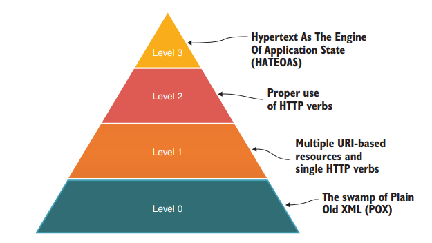

# 概述

「分布式系统」由为了完成共同任务而协调工作的计算机节点组成，它们通过网络来进行通信。

- 高性能：因为大量请求被合理地分摊到各个节点，使每一台 Web 服务器的压力减小
- 高可用：在分布式系统中，如果某个节点出现故障，系统会自动发现这个故障，不再向这个节点转发请求。
- 可伸缩性：当现有机器的性能不能满足业务的发展时，我们需要更多的机器提供服务。只要改造路由算法，就能够路由到新的机器，从而将更多的机器容纳到系统中
- 可维护性：如果设备当中有一台机器因某种原因不能对外提供服务，如机器出现故障，此时只需要停止那些出现故障的节点，对其进行处理，然后重新上线即可。

使用分布式系统，就意味着需要将系统按照不同的维度（如业务、数据等）切分给各个不同节点的机器

- 水平切分：将同一个系统部署到多台机器上

  - 简单：只需要实现一个路由算法，将请求合理地分配到各个节点即可。目前能够快速方便地实现这个功能的网关包括 Nginx、Netflix Zuul 和 Spring Cloud Gateway 等
  - 独立：每个节点都有完整的运算功能，不需要依赖其他节点，因此系统之间不需要太多的交互。
  - 高性能：因为都是在单机内完成，不需要做外部调用，因此可以得到很高的性能。

  但是所有业务都会耦合到一套系统里，不便于维护。

- 垂直切分：按照业务的维度进行拆分，将各个业务独立出来，单独开发和维护

  - 提高业务独立性：只要根据业务把系统划分成高内聚、低耦合的模块，就能极大地降低开发难度。
  - 增加了系统之间的协作：系统之间往往需要协作完成任务，也就是说，系统之间是相互依赖的。现今流行的系统交互有
    - 远程过程调用（RPC）
    - 面向服务的架构（SOA）
    - REST风格请求
  - 降低了可用性：因为系统之间存在依赖，所以任何一个系统出现问题，都会影响其他系统
  - 数据一致性难以保证

  

分布式系统只能通过网络来完成协作，但网络存在许多不确定性。早在1994年，Peter Deutsch就提出了分布式计算的七大谬论，后来被James Gosling（Java之父）等人完善为八大谬论。

- 网络是可靠的。（The network is reliable.）
- 网络是没有延迟的。（Latency is zero.）
- 带宽是无限的。（Bandwidth is infinite.）
- 网络是安全的。（The network is secure.）
- 网络拓扑不会改变。（Topology doesn't change.）
- 肯定至少有一个（在值班的）管理员。（There is oneadministrator.）
- 传输开销为零。（Transport cost is zero.）
- 网络是同质的。（The network is homogeneous.）

网络的不可靠性（如丢包、延时等）、拓扑结构的差异和传输速率大小等因素对分布式系统都存在很多的限制。此外，在分布式系统中，机器的配置、架构、性能、系统等都是不一样的。在不同的网络之间，通信带宽、延时、丢包率也是不一样的。那么在多机的分布式系统中，如何才能让所有的机器齐头并进，为同一个业务目标服务，这是一个相当复杂的问题。

在Andrew S. Tanenbaum创作的《分布式系统：原理与范例》中，指出了如何衡量一个分布式系统

- 透明性：所谓透明性，就是指一个分布式系统对外来说如同一个单机系统，使用者不需要知道其内部的实现，只需要知道其参数、功能和返回结果即可。
- 可伸缩性：当分布式系统的全部现有节点都无法满足业务膨胀的需求时，可以根据需要加入新的节点来应对业务数据的增加。当业务缩减时，又可以根据需要减少节点来达到节省资源的效果。
- 可用性：一般来说，分布式系统可全天候不间断地提供服务，即使在出现故障的情况下，也尽可能对外提供服务
- 可靠性：主要是针对数据来说的，数据要计算正确且不丢失地存储。
- 高性能：因为有多个节点分摊请求，所以能更快地处理请求。
- 一致性

## CAP

Eric Brewer 教授在 2000 年提出了CAP原则，也称为 CAP 定理。该原则指出，任何分布式系统都不能同时满足3个特点：

- **（强）一致性（consistency）**：代表数据在任何时刻、任何分布式节点中所看到的都是符合预期的

- **可用性（availability）**：代表系统不间断地提供服务的能力，理解可用性要先理解与其密切相关两个指标：可靠性（Reliability）和可维护性（Serviceability）。
  - 可靠性使用平均无故障时间（Mean Time Between Failure，MTBF）来度量
  
  - 可维护性使用平均可修复时间（Mean Time To Repair，MTTR）来度量
  
- **分区容忍性（partition tolerance）**：代表分布式环境中部分节点因网络原因而彼此失联后，即与其他节点形成“网络分区”时，系统仍能正确地提供服务的能力。

- **CA without P**：放弃 P 的同时也就意味着放弃了系统的扩展性，因为维护节点之间关联的复杂度，随着节点数量的增加而成指数级别增长。传统的关系型数据库 RDBMS：Oracle、MySQL就是CA。
- **CP without A：**如果不要求A（可用），相当于每个请求都需要在服务器之间保持强一致。但是 P（分区）会导致同步时间无限延长。
-  **AP without C：**要高可用并允许分区，则需放弃一致性

因为 P 是分布式网络的天然属性；而 A 通常是建设分布式的目的。因此现在微服务系统设计为 AP without C。

常见的一个误解就是，必须 3 选 2。实际上，当没有分区问题时，可以做到 C 与 A 的。另外一致性、可用性、分区容错都是一个范围属性，而不是一个布尔属性，即要么满足，要么不满足。

## BASE

BASE 分别是 Basically Available(基本可用)、Soft State（软状态）和 Eventually Consistent（最终一致性）三个短语的缩写。其核心思想是即使分布式系统无法做到强一致性，也可以采用适当的方法达到最终一致性。

- **BA（Basically Available，基本可用）**：系统出现了不可预知的故障，但正常运行，只是可能会有响应时间上的损失，或者服务降级。
- **S（Soft State，软状态）**：允许系统存在中间状态，即允许系统在多个不同节点的数据副本存在数据延时
- **E（Eventual Consistency，最终一致性）**：是指系统中的所有数据副本经过一定时间后，最终能够达到一致的状态，以保证数据的正确性。

## 微服务架构

微服务是一种通过多个小型服务组合来构建单个应用的架构风格，这些服务围绕业务能力而非特定的技术标准来构建。各个服务可以采用不同的编程语言，不同的数据存储技术，运行在不同的进程之中。服务采取轻量级的通信机制和自动化的部署机制实现通信与运维。满足以下九种风格的系统架构，我们都可以称之为微服务：

1. 组件化和服务：

   1. 把一个单体系统拆分为一个个可以单独维护和升级的软件单元，每一个单元就称为**组件**
   2. **服务**是指进程外的组件，它允许我们调用其他的组件，服务一般通过通信机制（HTTP 协议、Web Service、RPC 等）来提供的。

   开发人员只需要开发自己的组件。在他人的组件需要调用我们开发的组件功能时，我们只需要提供编写服务即可。但这会引入以下问题：

   - 边界界定问题：如何将一个单体系统拆分为各个组件
   - 在使用通信机制进行交互的情况下，性能远没有在单机内存的进程中运行高。

2. 围绕业务功能组织团队

   单体应用通常将团队分为前端团队、后端团队、数据。库团队和运维团队。但即使是很小的业务改动，也会牵涉跨团队的协作，从而增加沟通成本。微服务架构建议按业务模块来划分团队，将所牵涉的团队降低到最少，从而减少了不必要的沟通和内耗。

3. 是产品而不是项目

   传统的软件开发组织一开始会按业务模块进行划分，然后进行开发。一旦开发完成，将软件交付给维护部门，开发团队就解散了。微服务建议，开发团队应该维护整个产品的生命周期，也就是谁开发谁负责后续的改进。

4. 强化终端及弱化通道

   在微服务的构建中，建议弱化通信协议的复杂性。一般有两种方式：

   1. 轻量级消息通信协议：REST 风格的 HTTP 协议
   2. 轻量级消息总线：RabbitMQ或者ZeroMQ

   不建议使用性能较高的二进制协议，它在很大程度上会提高系统的开发和日后维护的难度。

5. 分散治理

   微服务架构没有编程语言的限制，不同的业务组件可以根据自己的需要来选择构建平台，各组件之间只需要约定好服务接口即可。

6. 分散数据管理

   每一个组件都应该拥有自己的数据源，包括数据库和NoSQL等。但分散数据管理也会引发两个弊端：

   1. 数据库的拆分会导致原有的 ACID 特性不复存在，需要使用分布式事务来确保数据库理论中的一致性，但这会增加系统实现的复杂性。
   2. 拆分之后关联计算会十分复杂

7. 基础设施自动化

   主要聚焦测试和部署

8. 容错性设计

   1. 在某些组件节点出现故障、断点和宕机时，系统允许组件节点优雅下线进行维护。在企业维护成功后，允许其重新上线，再次提供服务。
   2. 当系统接收大量请求时，可能出现某个组件响应变得缓慢的情况。此时，如果其他的组件再调用该组件，就需要等待大量的时间。这样，其他的组件也会因为等待超时而引发自身组件不可用，继而出现服务器雪崩的场景。当一个组件变得响应缓慢，造成大量超时，如果微服务能够发现它，并且通过一些手段将其隔离出去，这种情况就不会蔓延到调用者了。我们把这种情况称为**断路**，把微服务中处理这种情况的组件称为**断路器（Circuit Breaker）**。

9. 设计改进

   微服务的设计是循序渐进的

   微服务并不能解决所有的分布式系统的问题，它只是寻求一个平衡点，让架构师能够更为简单、容易地构建分布式系统。

为了构建微服务架构，Spring Cloud 容纳了很多分布式开发的组件

- Spring Cloud Config：配置管理，允许被集中化放到远程服务器中。
- Spring Cloud Bus：分布式事件、消息总线、用于集群（如配置发生变化）中传播事件状态
- Netflix Eureka：服务治理中心，它提供微服务的治理，包括微服务的注册和发现
- Netflix Hystrix：断路器，在某个组件因为某些原因无法响应或者响应超时之际进行熔断，以避免其他微服务调用该组件造成大量线程积压。它提供了更为强大的容错能力
- Netflix Zuul：API网关，它可以拦截Spring Cloud的请求，提供动态路由功能。它还可以限流，保护微服务持续可用，还可以通过过滤器提供验证安全
- Spring Cloud Security：它是基于Spring Security的，可以给微服务提供安全控制
- Spring Cloud Sleuth：它是一个日志收集工具包，可以提供分布式追踪的功能
- Spring Cloud Stream：分布式数据流操作，它封装了关于Redis、RabbitMQ、Kafka等数据流的开发工具
- Netflix Ribbon：提供客户端的负载均衡。它提供了多种负载均衡的方案
- OpenFeign：它是一个声明式的调用方案，可以屏蔽REST风格的代码调用，而采用接口声明方式调用，这样就可以有效减少不必要的代码，进而提高代码的可读性
- ...

Spring Cloud 的未来趋势是去 Netflix 组件

## REST

- REST （Representational State Transfer）在Roy Thomas Fielding 在 2000 年发表的博士论文《[Architectural Styles and the Design of Network-based Software Architectures](https://www.ics.uci.edu/~fielding/pubs/dissertation/top.htm)》中提出，其中的关键概念有：

  - **资源**（Resource）：例如，一篇文章
  - **表征**（Representation）：资源的表示形式。例如文章的PDF格式、HTML格式、JSON
  - **状态**（State），有关资源的上下文信息。如果状态在客户端维护，那么就是无状态。例如，用户正在阅读的文章。
  - **转移**（Transfer）：无论状态是由服务端还是客户端来提供的，状态转移这个行为逻辑必然只能由服务端来实现，因为只有服务端拥有该资源及其表征形式。例如，将“用户当前阅读的文章”转变成“下一篇文章”
  - **统一接口**（Uniform Interface）：URI 是统一资源标识符，是一个名词。而 HTTP 中的请求方法，是一个动词，同时这也是一套统一接口，它包括GET、HEAD、POST、PUT、DELETE、TRACE、OPTIONS 七种基本操作。任何一个支持 HTTP 协议的服务器都会遵守这套规定，对特定的 URI 采取这些操作，服务器就会触发相应的表征状态转移。
    - `GET` ：请求数据
    - `DELETE`：删除指定的资源
    - `HEAD`：该请求方法的一个使用场景是在下载一个大文件前先通过 `HEAD` 请求读取其 [`Content-Length`](https://developer.mozilla.org/zh-CN/docs/Web/HTTP/Headers/Content-Length) 标头的值获取文件的大小，而无需实际下载文件。
    - `PUT` ：创建一个新的资源，或用请求的有效载荷替换目标资源，它是幂等的。
    - `POST`：发送数据给服务器，非幂等的，也就是说，如果发送两次完全相同的POST请求，服务器会创建两个独立的资源。
    - `PATCH`：对现有资源进行局部更新，非幂等的。
  - **超文本驱动**（Hypertext Driven）：页面的导航行为都不可能是预置于浏览器代码之中，而是由服务器所发出的请求响应信息（超文本）来驱动的。这与有专门的页面控制器的客户端软件，有着十分本质的区别。
  - **自描述消息**（Self-Descriptive Messages）：由于资源的表征可能存在多种不同形态，在消息中应当有明确的信息，来告知客户端该消息的类型以及应如何处理这条消息。一种被广泛采用的自描述方法是在名为 Content-Type 的 HTTP Header 中，标识出互联网媒体类型（MIME type）。譬如 `Content-Type : application/json; charset=utf-8` ，则说明该资源会以 JSON 的格式来返回，请使用 UTF-8 字符集进行处理。
  
  > 术语上的细节
  >
  > - “REST”（**Re**presentational **S**tate **T**ransfer）实际上是“HTT”（**H**yper**t**ext **T**ransfer）的进一步抽象，两者就如同接口与实现类的关系一般。
  >
  > - 同时Fielding 提出 REST 时所谈论的范围是“架构风格与网络的软件架构设计”（Architectural Styles and Design of Network-based Software Architectures），而不是现在被人们所狭义理解的一种“远程服务设计风格”，前者包括后者。
  >
  > - REST 只能说是风格，而不是规范、协议。

几个常见的设计错误的例子：

~~~bash
# 这里的URI是只存在名词的，而get是动作，所以不符合REST风格的规则
GET /fund/account/get/{id}

# 这里的 v1 代表版本，我们之前论述过，在REST风格中，一个资源只对应一个 URI，所以这里也是不符合REST风格的。
# 关于版本，我们可以使用请求头参数来设置，如Accept: version = v1，这样就可以把URI设计为GET /fund/account/{id}，
GET /fund/account/v1/{id}

# 这里的请求参数不在URI中，也是不符合REST风格的，为此可以修改为：
# PUT /fund/account/1/account_1，后端只需要从请求路径中获取参数即可 
PUT /fund/account?Id=1&accountName=account_1
~~~

### RESTful

  Fielding 认为完全满足 REST 风格的系统应该满足以下六大原则：

  - **服务端与客户端分离**（Client-Server）

  - **无状态**（Stateless）：每一次从客户端发送的请求中，应包括所有的必要的上下文信息，会话信息也由客户端负责保存维护，服务端依据客户端传递的状态来执行业务处理逻辑，驱动整个应用的状态变迁。但在大型系统中，请求中所携带的上下文数量完全有可能膨胀到不切实际的程度。

  - **可缓存**（Cacheability）：无状态服务虽然提升了系统的可见性、可靠性和可伸缩性，但降低了系统的网络性，即需要多次请求来完成功能。为了缓解这个问题，REST 允许客户端或者代理将服务端的应答缓存起来。

  - **分层系统**（Layered System）：客户端无需知道是否直接到服务器，还是连接到代理。代理服务器可以通过负载均衡和共享缓存的机制提高系统的可扩展性

  - **统一接口**（Uniform Interface）：系统设计的重点放在抽象系统该有哪些资源上，而不是抽象系统该有哪些行为（服务）上。

    像 login、logout 这样的行为性服务，我们可以抽象出 Session 资源，那么 login 就对应 PUT Session，而 logout 对应 DELETE Session

  - **按需代码**（[Code-On-Demand](https://en.wikipedia.org/wiki/Code_on_demand)）：这是一条可选原则。它是指按照客户端的请求，将可执行的软件程序从服务器发送到客户端的技术。[Java Applet](https://en.wikipedia.org/wiki/Java_applet) 与 [WebAssembly](https://en.wikipedia.org/wiki/WebAssembly) 都是典型代表

 

  ### RMM成熟度

  

  0. The Swamp of [Plain Old XML](https://en.wikipedia.org/wiki/Plain_Old_XML)
  1. Resources：开始引入资源的概念
  2. HTTP Verbs：引入统一接口，映射到 HTTP 协议的方法上。
  3. Hypermedia Controls：也就是之前介绍的「超文本驱动」。在 Fielding 论文里的说法是“Hypertext As The Engine Of Application State，HATEOAS”，其实都是指同一件事情。

  

  ### 不足与争议

  问题一：**面向资源的编程思想只适合做 CRUD，面向过程、面向对象编程才能处理真正复杂的业务逻辑**

  见解：HTTP 的四个最基础的命令 POST、GET、PUT 和 DELETE 很容易让人直接联想到 CRUD 操作。而且我们还可以去扩展方法，按 Google 推荐的 REST API 风格，[自定义方法](https://cloud.google.com/apis/design/custom_methods)应该放在资源路径末尾，嵌入冒号加自定义动词的后缀

  ~~~http
  POST /user/user_id/cart/book_id:undelete
  
  ~~~

  

  问题二：**REST 与 HTTP 完全绑定，不适合应用于要求高性能传输的场景中**

  见解：这是有一定的道理的

  

  问题三：**REST 不利于事务支持**

  见解：这要看你要支持哪种事务了，如果只追求最终一致性，那么REST就足够了

  

  问题四：**REST 没有传输可靠性支持**

  见解：这是正确的，最简单的解决方式就是把消息再重发一遍，但这样做的前提是服务应具有[幂等性](https://zh.wikipedia.org/wiki/冪等)（Idempotency）

  

  问题五：**REST 缺乏对资源进行“部分”和“批量”的处理能力**

  见解：这也是正确的。HTTP协议完全没有对请求资源的结构化描述能力（但有非结构化的部分内容获取能力，即用于断点续传的[Range Header](https://developer.mozilla.org/zh-CN/docs/Web/HTTP/Range_requests)），我们必须专门设计一些抽象资源才能去应对这种问题。

  ### 与RPC的关系

  **REST 的基本思想是面向资源来抽象问题；而 RPC 的是面向过程来抽象问题**。REST 与 RPC 作为主流的两种远程调用方式，在使用上的确是有部分重合的。面向资源的编程思想与另外两种主流编程思想，只是在抽象问题时所处的立场不同，并没有高下之分。人们以面向方法的思想来设计 RPC API，随着时间推移，接口与方法越来越多却又各不相同，开发人员必须了解每一个方法才能正确使用它们，这样既耗时又容易出错。但 REST 可以缓解这种问题：

  - 降低服务接口的学习成本。统一接口（Uniform Interface）将对资源的标准操作都映射到了标准的 HTTP 方法上去。

  - 资源天然具有集合与层次结构。以方法为中心抽象的接口，由于方法是动词，逻辑上决定了每个接口都是互相独立的；但以资源为中心抽象的接口，由于资源是名词，天然就可以产生集合与层次结构。

    ~~~xml
    GET /posts - 获取所有文章
    GET /posts/{postId} - 获取特定文章
    POST /posts - 创建一篇文章
    PUT /posts/{postId} - 更新特定文章
    DELETE /posts/{postId} - 删除特定文章
    GET /posts/{postId}/comments - 获取特定文章的所有评论
    GET /posts/{postId}/comments/{commentId} - 获取特定文章的特定评论
    POST /posts/{postId}/comments - 创建一条评论
    PUT /posts/{postId}/comments/{commentId} - 更新特定评论
    DELETE /posts/{postId}/comments/{commentId} - 删除特定评论
    ~~~

    注意，虽然两个资源在URL上表现为嵌套关系，但是它们却对应不同的微服务。

  

## RestTemplate

Spring 提供了 RestTemplate 模块来简化 REST 风格请求的发送。

~~~java
public static void get() {
   RestTemplate restTemplate = new RestTemplate();
   String url = "http://localhost:8001/fund/account/{id}";
   // GET请求，返回 Account 对象
   // 第三个参数对应 URL 中的占位符{id}，第三个参数可以接收一个 Map
   Account account = restTemplate.getForObject(url, Account.class, 1L);
}
~~~

~~~java
public static void post() {
   RestTemplate restTemplate = new RestTemplate();
   String url = "http://localhost:8001/fund/account";
   // 请求头
   HttpHeaders headers = new HttpHeaders();
    
   // 设置请求体为JSON
   headers.setContentType(MediaType.APPLICATION_JSON_UTF8);
   Account account = new Account();
    
   // 封装请求实体对象，将账户对象设置为请求体
   HttpEntity<Account> request = new HttpEntity<>(account, headers);
    
   // 发送POST请求，返回 Account 对象
   Account result = restTemplate.postForObject(url, request, Account.class);
}
~~~

~~~java
public static void put() {
   RestTemplate restTemplate = new RestTemplate();
   String url = "http://localhost:8001/fund/account";
   // 请求头
   HttpHeaders headers = new HttpHeaders();
   // 设置请求体媒体类型为JSON
   headers.setContentType(MediaType.APPLICATION_JSON_UTF8);
   Account account = new Account();
   // 封装请求对象
   HttpEntity<Account> request = new HttpEntity<>(account, headers);
   // 发送请求，put 请求是无返回值的
   restTemplate.put(url, request);
}   
~~~

~~~java
public static void delete() {
   RestTemplate restTemplate = new RestTemplate();
    
   // {id}是占位
   String url = "http://localhost:8001/fund/account/{id}";
    
   // DELETE请求没有返回值
   restTemplate.delete(url, 123L);
}
~~~

