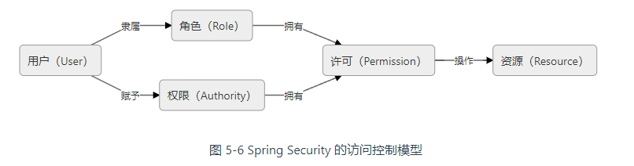

# 授权


SpringSecurity 中的访问控制模型：



Role 和 Authority 完全共享同一套存储结构，唯一的差别仅是 Role 会在 Authority 基础上带上「ROLE_」前缀罢了。在使用上，Authority 可以更加细粒度地管理 Permission。

~~~java
var user1 = User.withUsername("john")
    .authorities("READ")			// 具有 READ 权限
    .authorities("ROLE_ADMIN")		// 是 ADMIN 角色
    .role("ADMIN")					// role 方法会自动帮我们添加 ROLE_ 前缀。
    .build();
~~~


在 Spring Security 中，并不体现 Permission 这一概念

~~~java
public interface GrantedAuthority extends Serializable {
    String getAuthority();
}
~~~

~~~java
public interface UserDetails extends Serializable {
    Collection<? extends GrantedAuthority> getAuthorities();
    // 省略的代码
}
~~~


## Ant 表达式

~~~java
http.authorizeRequests().anyRequest().permitAll(); 		// 允许所有请求
http.authorizeRequests().anyRequest().hasAuthority("WRITE", "READ")	// 必须同时具有 WRITE、READ 权限才可以访问所有请求
    
    
http.authorizeRequests()
    // 对 /login 端点的 GET 请求，必须有 admin 角色
    .requestMatchers(HttpMethod.GET ,"/login").hasRole("admin")
    // 访问 /user 端点必须有 admin、user 
    .requestMachers("/user").hasAnyRole("admin", "user")
    // 其他请求直接放行
    .anyRequest().permitAll();

// 新版本 Spring Security 6.0 已经弃用 antMatchers()
// 用 requestMatchers() 替代 antMatchers() 即可
http.authorizeRequests()
    // 这些路径无需认证
    .antMatchers("/", "/home", "/css/**", "/js/**").permitAll()  
    // 其他请求则需要登录
    .anyRequest().authenticated();  

String expression ="hasAuthority('read') and !hasAuthority('delete')";
http.authorizeRequests()
    .anyRequest()
    .access(expression);
~~~

- `authorizeRequests()` ：让我们指定端点上的授权规则
- `anyRequest()`：表示授权规则适用于剩余所有请求
- `requestMatchers()`：表示授权规则适用于符合匹配规则的请求
- `regexMatchers()`：与 `requestMatchers()` 基本一致，但只能指定正则表达式，而不是`requestMatchers()` 中的 Ant 表达式
- `permitAll()` ：允许访问所有请求，无需身份验证（登录）
- `denyAll()`：拒绝访问所有请求
- `authenticated()`：无需权限，但需要身份验证（登录）
- `hasAuthority()`：要求具有指定的**全部**权限才可以访问
- `hasAnyAuthority()`：要求具有指定的**任一**权限才可以访问
- `hasRole()`：要求具有指定角色才可以访问，在指定角色名称时，不应该出现 `ROLE_` 前缀
- `access()`：可以编写复杂的权限表达式，但不推荐使用

`antMatchers()`，它与`requestMatchers()` 有一点差异，下面我们通过一个例子来说明，给定一个端点 `/hello`，我们提供 `requestMatchers("/hello")`以及 `antMathcers("/hello")`，那么我们在访问 `/hello` 时，都能进行匹配到该请求。但是在访问 `/hello/`时，只有 `requestMatchers` 仍匹配到，而 `antMathcers` 未匹配到，这是严重的安全漏洞，所以并不推荐使用 `antMatchers`

这里说明一下`requestMathcers`的匹配规则：

| 符号 |        含义        |
| :--: | :----------------: |
|  ?   |    任意单个字符    |
|  *   | 0 到任意数量的字符 |
|  **  |   0 到任意个目录   |
|  {}  |     正则表达式     |


## 授权注解

下面介绍利用授权注解结合 SpEl 表达式实现权限控制。我们可以在方法上添加授权注解来权限控制，常用的授权注解有3个：

- `@PreAuthorize`：方法执行前进行权限检查；
- `@PostAuthorize`：方法执行后进行权限检查；
- `@Secured`：类似于 `@PreAuthorize`，简化了角色权限的编写

我们首先需要使用 `@EnableGlobalMethodSecurity` 注解，来开启授权注解功能：

```java
@Configuration
@EnableGlobalMethodSecurity(prePostEnabled = true,securedEnabled = true)
public class SecurityConfig  {
    ...
    ...
}
```


然后在具体的接口方法上利用授权注解进行权限控制，代码如下：

```java
@RestController
public class UserController {
 
    @Secured({"ROLE_USER"})			// 只有拥有'ROLE_USER'角色的用户才能访问此方法
    @PreAuthorize("hasRole('USER')")	// 同上
    
    @PreAuthorize("permitAll()")	// 所有的用户，包括即使没有经过身份验证的用户，也都可以访问。
    
    @PreAuthorize("@ph.check('USERx')") // 首先要通过名称为 "ph" 的 bean（是一个权限检查服务）的 "check" 方法进行一次安全检查。在此标记下，只有当 "@ph.check('USERx')" 的调用返回 true 时，才会允许该方法被调用。
    @GetMapping("/user/hello")
    public String helloUser() {
        return "hello, user";
    }
 
    @PreAuthorize("hasRole('ADMIN')")
    @GetMapping("/admin/hello")
    public String helloAdmin() {
        return "hello, admin";
    }
 
    @PreAuthorize("#age>100")
    @GetMapping("/age")
    public String getAge(@RequestParam("age") Integer age) {
 
        return String.valueOf(age);
    }
 
    @GetMapping("/visitor/hello")
    public String helloVisitor() {
        return "hello, visitor";
    }
 
}
```

这个注解可以使你的安全控制规则非常明确和直观，但是同时也有缺点，因为它把安全控制规则和你的业务代码耦合在一起。

### 过滤器注解

接着介绍使用过滤器注解实现**数据权限控制**。在 Spring Security 中还提供了另外的两个注解，即 @PreFilter 和 @PostFilter，这两个注解可以对集合类型的参数或返回值进行**过滤**。即 Spring Security 将移除对应表达式结果为 false 的元素。也就是说权限的控制粒度在数据级别。

```java
@RestController
public class FilterController {
    /**
     * 只返回结果中id为偶数的user元素。
     * filterObject是@PreFilter和@PostFilter中的一个内置表达式，表示集合中的当前所遍历到的对象。
     */
    @PostFilter("filterObject.id%2==0")
    @GetMapping("/users")
    public List<User> getAllUser() {
        List<User> userList = new ArrayList<>(Arrays.asList(
            new User(1L,"admin","123456"),
            new User(2L,"test","123456"),
            new User(3L,"王五","123456"),
            new User(4L,"赵六","123456"),
            new User(5L,"小王","123456"),
            new User(6L,"小张","123456")
        ));
        return userList;
    }
}
```


```java
@PostFilter("filterObject.userName == authentication.principal.username")

@PostFilter("hasRole('USER') and filterObject.userName == authentication.principal.username")
```

```java
@Service
public class FilterService {
    /**
     * 当 @PreFilter 标注的方法内拥有多个集合类型的参数时，
     * 可以通过 @PreFilter 的 filterTarget 属性来指定当前是针对哪个参数进行过滤的。
     */
    @PreFilter(filterTarget = "ids", value = "filterObject%2==0")
    public List<Integer> doFilter(List<Integer> ids, List<User> users) {
        log.warn("ids=" + ids.toString());
        log.warn("users=" + users.toString());
        return ids;
    }

}
```

### 动态注解

最后介绍最常用的权限控制方法：**使用过滤器实现动态权限控制！**此时，资源权限必须在数据库中存储了。

`AuthorizationFilter`已经实现了动态权限控制的大部分的逻辑，我们只需实现`AuthorizationManager`接口即可，它的定义如下：

```java
public interface AuthorizationManager<T> {
    default void verify(Supplier<Authentication> authentication, T object) {
        AuthorizationDecision decision = this.check(authentication, object);
        if (decision != null && !decision.isGranted()) {
            throw new AccessDeniedException("Access Denied");
        }
    }

    @Nullable
    AuthorizationDecision check(Supplier<Authentication> authentication, T object);
}
```

实现的逻辑

```java

@Component
public class MyAuthorizationManager implements AuthorizationManager<RequestAuthorizationContext> {
    
    @Autowired
    RoleMapper roleMapper;
    
    @Override
    void verify(
        Supplier<Authentication> authentication, 
        T object) {
        
        // 当前用户的权限信息
        Collection<? extends GrantedAuthority> authorities = authenticationSupplier.get().getAuthorities();
        
        // 我们可以获取携带的查询参数
        Map<String, String> variables = requestAuthorizationContext.getVariables();
        
        // 获取URL
        String requestURI = requestAuthorizationContext.getRequest().getRequestURI();
        
        // 获取原始 request 对象
        HttpServletRequest request = requestAuthorizationContext.getRequest();
        
        // 根据URL、当前用户的权限信息以及对应的权限（@Mapper）做出进一步判断
        
        boolean isGranted = true;
        return new AuthorizationDecision(isGranted);
        
        //  授权失败
	    // throw new AccessDeniedException()
    }
}
```

甚至可以在 `httpSecurity` 的 `access` 方法中去实现动态认证的逻辑：

~~~java
// 注意和 httpSecurity.authorizeRequests 的区别
httpSecurity.authorizeHttpRequests()
    .anyRequest()
    .access((authenticationSupplier, requestAuthorizationContext) -> {
        Collection<? extends GrantedAuthority> authorities = authenticationSupplier.get().getAuthorities();
        Map<String, String> variables = requestAuthorizationContext.getVariables();
        HttpServletRequest request = requestAuthorizationContext.getRequest();

        boolean isGranted = true;
        return new AuthorizationDecision(isGranted);
    });
~~~

