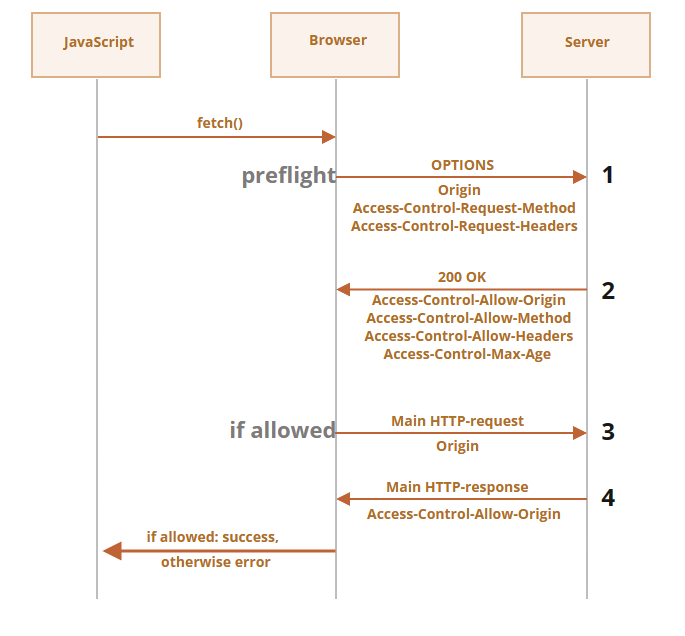

# Web 安全

[TOC]

## XSS 攻击

Cross-Site Scripting（跨站脚本攻击）简称 XSS，是一种代码注入攻击。攻击者通过在目标网站上注入恶意脚本，使之在用户的浏览器上运行。利用这些恶意脚本，攻击者可获取用户的敏感信息如 Cookie、SessionID 等，进而危害数据安全。

### 例子

下面我们通过一个例子来初步认识 XSS 攻击：

~~~html
<input type="text" value="<%= getParameter("keyword") %>">
<button>搜索</button>
<div>
  您搜索的关键词是：<%= getParameter("keyword") %>
</div>
~~~

现在我们输入 `"><script>alert('XSS');</script>`，接着客户端发送 `http://xxx/search?keyword="><script>alert('XSS');</script>`请求，然后服务器返回以下内容

~~~java
<input type="text" value=""><script>alert('XSS');</script>">
<button>搜索</button>
<div>
  您搜索的关键词是："><script>alert('XSS');</script>
</div>
~~~

由于浏览器无法分辨出 `<div>`下（包括`<input>`中的）的`<script>alert('XSS');</script>` 是恶意代码，因而将其执行。最简单的解决方案就是将插入到页面中的数据进行转义，`escapeHTML()` 按照如下规则进行转义：

| 字符 | 转义后的字符 |
| ---- | ------------ |
| `&`  | `&amp;`      |
| `<`  | `&lt;`       |
| `>`  | `&gt;`       |
| `"`  | `&quot;`     |
| `'`  | `&#x27;`     |
| `/`  | `&#x2F;`     |

修复代码如下：

~~~html
<input type="text" value="<%= escapeHTML(getParameter("keyword")) %>">
<button>搜索</button>
<div>
  您搜索的关键词是：<%= escapeHTML(getParameter("keyword")) %>
</div>
~~~

这样服务端返回以下内容：

~~~html
<input type="text" value="&quot;&gt;&lt;script&gt;alert(&#x27;XSS&#x27;);&lt;&#x2F;script&gt;">
<button>搜索</button>
<div>
  您搜索的关键词是：&quot;&gt;&lt;script&gt;alert(&#x27;XSS&#x27;);&lt;&#x2F;script&gt;
</div>
~~~


我们继续考虑这样一段代码：

~~~html
<a href="<%= escapeHTML(getParameter("redirect_to")) %>">跳转...</a>
~~~

当用户输入`javascript:alert('XSS')`后，客户端发送 `http://xxx/?redirect_to=javascript:alert('XSS')`，然后服务端返回以下内容：

~~~html
<a href="javascript:alert(&#x27;XSS&#x27;)">跳转...</a>
~~~

这样用户在点击 `<a>` 后就会弹出 “XSS”。原来不仅仅是特殊字符，连 `javascript:` 这样的字符串出现在特定的位置也会引发 XSS 攻击。可以使用白名单策略来解决这一问题：

~~~java
allowSchemes = ["http", "https"];
valid = isValid(getParameter("redirect_to"), allowSchemes); // 用来检查redirect_to 参数是否是一个有效的 HTTP(s) URL
if (valid) {
  <a href="<%= escapeHTML(getParameter("redirect_to"))%>">
    跳转...
  </a>
} else {
  <a href="/404">
    跳转...
  </a>
}
~~~

这里不使用黑名单策略的原因是要考虑的漏洞情况太多了，例如`jAvascRipt:`、`%20javascript:`等等


我们再来考虑这样一个场景：

~~~html
<script>
var initData = <%= data.toJSON() %>
</script>
~~~

插入 JSON 的地方不能使用 `escapeHTML()`，因为将 `"` 转义为`&quot`后，JSON 格式会被破坏。于是我们又要实现一个 `escapeEmbedJSON()` 函数，对内联 JSON 进行转义。

~~~html
<script>
var initData = <%= escapeEmbedJSON(data.toJSON()) %>
~~~

由此可见不同的上下文，如 HTML 属性、HTML 文字内容、HTML 注释、跳转链接、内联 JavaScript 字符串、内联 CSS 样式表等，所需要的转义规则不一致。

### 攻击类型

XSS 的本质是：恶意代码未经过滤，与网站正常的代码混在一起；浏览器无法分辨哪些脚本是可信的，导致恶意脚本被执行。

根据攻击的来源，XSS 攻击可分为存储型、反射型和 DOM 型三种。

| 类型       | 存储区*                 | 插入点*         |
| ---------- | ----------------------- | --------------- |
| 存储型 XSS | 后端数据库              | HTML            |
| 反射型 XSS | URL                     | HTML            |
| DOM 型 XSS | 后端数据库/前端存储/URL | 前端 JavaScript |


存储型 XSS 的攻击步骤：

1. 攻击者将恶意代码提交到目标网站的数据库中。
2. 用户打开目标网站时，网站服务端将恶意代码从数据库取出，拼接在 HTML 中返回给浏览器。

这种攻击常见于带有用户保存数据的网站功能，如论坛发帖、商品评论、用户私信等。


反射型 XSS 的攻击步骤：

1. 攻击者构造出特殊的 URL，其中包含恶意代码。
2. 用户打开带有恶意代码的 URL 时，网站服务端将恶意代码从 URL 中取出，拼接在 HTML 中返回给浏览器。

反射型 XSS 漏洞常见于通过 URL 传递参数的功能，如网站搜索、跳转等。由于需要用户主动打开恶意的 URL 才能生效，攻击者往往会结合多种手段诱导用户点击。


DOM 型 XSS 的攻击步骤：

1. 攻击者构造出特殊的 URL，其中包含恶意代码。
2. 用户打开带有恶意代码的 URL。
3. 前端 JavaScript 取出 URL 中的恶意代码并执行。

DOM 型 XSS 跟前两种 XSS 的区别：DOM 型 XSS 攻击中，取出和执行恶意代码由浏览器端完成，属于前端 JavaScript 自身的安全漏洞，而其他两种 XSS 都属于服务端的安全漏洞。

### 预防

XSS 攻击有两大要素：

1. 攻击者提交恶意代码。
2. 浏览器执行恶意代码。


针对第一个要素：我们是否能够在用户输入的过程，处理掉（转义）用户输入的恶意代码呢？我们要分情况来讨论

- 如果在客户端进行处理，那么一旦攻击者绕过前端，直接构造请求，就可以提交恶意代码了。

- 在后端进行处理时，**如果**我们并不确定内容要输出到哪里，那么这种方式是不可行的

  - 可能同时提供给前端和客户端，而一旦经过了 `escapeHTML()`，客户端显示的内容就变成了乱码( `5 &lt; 7` )。
  - 在前端中，不同的位置所需的编码也不同。
    - 当 `5 &lt; 7` 作为 HTML 拼接页面时，可以正常显示 `5 < 7`
    - 当 `5 &lt; 7` 通过 Ajax 返回，然后赋值给 JavaScript 的变量时，前端得到的字符串就是转义后的字符。

  一旦我们确定要输出到那里，我们可以针对性做相应的处理。


预防存储型和反射型 XSS 攻击，有两种常见做法：

- 改成纯前端渲染，把代码和数据分隔开
- 对 HTML 做充分转义，在 Java 工程里，常用的转义库为 `org.owasp.encoder`


DOM 型 XSS 攻击，实际上就是网站前端 JavaScript 代码本身不够严谨，把不可信的数据当作代码执行了。在使用 `.innerHTML`、`.outerHTML`、`document.write()` 时要特别小心，不要把不可信的数据作为 HTML 插到页面上，而应尽量使用 `.textContent`、`.setAttribute()` 等。DOM 中的内联事件监听器，如 `location`、`onclick`、`onerror`、`onload`、`onmouseover` 等，`<a>` 标签的 `href` 属性，JavaScript 的 `eval()`、`setTimeout()`、`setInterval()` 等，都能把字符串作为代码运行。如果不可信的数据拼接到字符串中传递给这些 API，很容易产生安全隐患，请务必避免。

## CSRF

**CSRF（Cross-site request forgery）跨站请求伪造**：攻击者诱导受害者进入第三方网站，在第三方网站中，向被攻击网站发送跨站请求。利用受害者在被攻击网站已经获取的注册凭证，绕过后台的用户验证，达到冒充用户对被攻击的网站执行某项操作的目的。

一个典型的CSRF攻击有着如下的流程：

- 受害者登录 a.com，并保留了登录凭证（Cookie）。
- 攻击者引诱受害者访问了 b.com。
- b.com 向 a.com 发送了一个请求：a.com/act=xx。浏览器会默认携带 a.com 的 Cookie。
- a.com 接收到请求后，对请求进行验证，并确认是受害者的凭证，误以为是受害者自己发送的请求。
- a.com 以受害者的名义执行了 act=xx。

显然，CSRF攻击具有两个特点：

- CSRF（通常）发生在第三方域名
- CSRF攻击者不能读取到 Cookie 等信息，但是可以跨域发送


针对这两点，我们可以专门制定防护策略，如下：

- 阻止不明外域的访问（对应第一个特点）

  - 同源检测：同协议，同域名，同端口就是同源的。如果攻击者有权限在本域发布评论（含链接、图片等，统称 UGC），那么它可以直接在本域发起攻击，这种情况下同源策略无法达到防护的作用。

- 提交时要求附加本域才能获取的信息（对应第二个特点）

  - CSRF Token：

    1. 用户打开页面的时候，服务器需要给这个用户生成一个Token，该Token 通过加密算法对数据进行加密，一般`Token`都包括 UserID 和时间戳的组合
    2. 用户在每次请求时都携带这个 Token
    3. 服务器将从`Token`解析出的`UserID`和时间戳来被验证有效性。时间戳可以防止重放攻击


 Spring Security 是通过 CSRF Token 来防范 CSRF 攻击的。具体来说是 CsrfFilter 过滤器在防范攻击，它直接放行对于 GET、HEAD、TRACE 等请求。而对于其他请求，它期望接收一个包含 Token 的请求头，或者表单数据中有 _csrf 属性。如果不存在或者不正确，那么它拒绝请求，并将响应状态设置为 HTTP 403 Forbidden。

~~~shell
curl -XPOST http://localhost:8080/hello
# 响应体
{
    "status":403,
    "error":"Forbidden",
    "message":"Forbidden",
    "path":"/hello"
}
~~~

~~~shell
curl -X POST http://localhost:8080/hello
-H 'Cookie: JSESSIONID=21ADA55E10D70BA81C338FFBB06B0206'
-H 'X-CSRF-TOKEN: 1127bfda-57b1-43f0-bce5-bacd7d94694e'

# 响应体
Hello！
~~~


`CsrfFilter` 使用 `CsrfTokenRepository` 组件来管理令牌。并且在令牌认证成功后，会在 HTTP 请求中添加 _csrf 属性来保存令牌值，之后的过滤器可以通过 `request.getAttribute("_csrf")` 来获取令牌值。

在 Spring Security 中，只有在后端渲染时添加 `${_csrf.parameterName} & ${_csrf.token}`，前端才能获取到 csrf，默认的登录页面 /login 就是这么做的。

~~~html
<form action="/product/add" method="post">
    <span>姓名：</span>
    <span><input type="text" name="name" /></span>
    <span><button type="submit">添加</button></span>
    <input type="hidden"
           th:name="${_csrf.parameterName}"
           th:value="${_csrf.token}" />
</form>
~~~

这对于前后端分离的项目来说是一个麻烦，我们在 JWT 中将给出解决方案。

我们也可以指定某个端点禁用 CSRF

~~~java
// 方法1
http.csrf(c -> {
	c.ignoringAntMatchers("/ciao");
});

// 方法2
String pattern = ".*[0-9].*";
String httpMethod = HttpMethod.POST.name();
RegexRequestMatcher r = new RegexRequestMatcher(pattern, httpMethod);
c.ignoringRequestMatchers(r);
~~~


默认实现的 CsrfTokenRepository 在 Session 中保存令牌，这对于分布式架构来说并不理想，我们可以自定义实现一个以满足需求，我们先来看它的接口定义：

~~~java
public interface CsrfTokenRepository {
    CsrfToken generateToken(HttpServletRequest var1);

    void saveToken(CsrfToken var1, HttpServletRequest var2, HttpServletResponse var3);

    CsrfToken loadToken(HttpServletRequest var1);
}
~~~

其中，CsrfToken 接口的定义如下：

~~~java
public interface CsrfToken extends Serializable {
    String getHeaderName();
    String getParameterName();
    String getToken();
}
~~~

下面我们来实现在 MySQL 数据库中存储 Token 的 CsrfTokenRepository ：

~~~java
public class CustomCsrfTokenRepository implements CsrfTokenRepository {
    @Autowired
    private JpaTokenRepository jpaTokenRepository;
    
    @Override
    public CsrfToken generateToken(HttpServletRequest httpServletRequest) {
        String uuid = UUID.randomUUID().toString();
        return new DefaultCsrfToken("X-CSRF-TOKEN", "_csrf", uuid);
    }
    
    // 这通常发生在 generateToken 方法生成新的令牌后，或者在需要更新当前的 CSRF 令牌时。crsfToken 是新的令牌值
    void saveToken(CsrfToken csrfToken, HttpServletRequest httpServletRequest, HttpServletResponse httpServletResponse) {
        // 通过 X-IDENTIFIER 来识别用户
        String identifier = httpServletRequest.getHeader("X-IDENTIFIER");
        Optional<Token> existingToken =
            jpaTokenRepository.findTokenByIdentifier(identifier);
        // 如果 ID 存在，即之前已经保存过 Token 了，则更新令牌的值
        if (existingToken.isPresent()) {
            Token token = existingToken.get();
            token.setToken(csrfToken.getToken());
         // 不存在
        } else {
            Token token = new Token();
            token.setToken(csrfToken.getToken());
            token.setIdentifier(identifier);
        }
        jpaTokenRepository.save(token);
    }
    
    // 用于检查请求中的 CSRF 令牌是否与 Repository 中的令牌匹配
    @Override
    public CsrfToken loadToken(HttpServletRequest httpServletRequest) {
        String identifier = httpServletRequest.getHeader("X-IDENTIFIER");
        Optional<Token> existingToken = jpaTokenRepository .findTokenByIdentifier(identifier);
        if (existingToken.isPresent()) {
            Token token = existingToken.get();
            return new DefaultCsrfToken(
                "X-CSRF-TOKEN",
                "_csrf",
                token.getToken());
        }
        return null;
    }
}
~~~

然后注册这个 `CsrfTokenRepository` ：

~~~java
http.csrf(c -> {
    c.csrfTokenRepository(customTokenRepository());
    c.ignoringAntMatchers("/ciao");
});
~~~


## CORS

**跨源资源共享**（[CORS](https://developer.mozilla.org/zh-CN/docs/Glossary/CORS)）允许服务器标示其他[源](https://developer.mozilla.org/zh-CN/docs/Glossary/Origin)（域、协议或端口）来加载访问自己的资源。如果一个请求同时满足下面这两个条件，则该请求是安全的：

1. 安全的方法：GET，POST 或 HEAD
2. 安全的 `Header`
   - `Accept`，
   - `Accept-Language`，
   - `Content-Language`，
   - `Content-Type` 的值为 `application/x-www-form-urlencoded`，`multipart/form-data` 或 `text/plain`。

任何其他请求都被认为是非安全请求。安全请求和非安全的区别在于，安全请求会立即发送，而对于其他非安全请求，浏览器会发出初步的「预检」请求，以请求许可。

如果一个请求是跨源的（无论是安全的，还是非安全的），浏览器始终会向其添加 `Origin` Header。`Origin`字段用来说明，本次请求来自哪个源（协议 + 域名 + 端口）。服务器根据这个值，决定是否同意这次请求。如果同意，就会在响应中添加一个特殊的 Header `Access-Control-Allow-Origin`。该 Header 包含了允许的源


浏览器在这里扮演受被信任的中间人的角色：

1. 它确保发送的跨源请求带有正确的 `Origin`。
2. 它检查响应中的许可 `Access-Control-Allow-Origin`，如果存在，则允许 JavaScript 访问响应，否则将失败并报错。

默认情况下，由 JavaScript 代码（MLHttpRequest 或 Fetch API）发起的跨源请求不会带来任何凭据（cookies 或者 HTTP 认证）。若要携带 Cookie，以 XMLHttpRequest 对象为例，需要设置属性 withCredentials 的值为 true，然后在请求中一并把 Cookie 发送出去。如果服务器同意接受 **带有凭据** 的请求，那么它还应该在响应中添加 Header `Access-Control-Allow-Credentials: true`。如果不同意，那么它拒绝这次请求以及 Cookie，同时浏览器中的 XMLHttpRequest 对象直接抛出异常

需要注意的是，如果要接收 Cookie，`Access-Control-Allow-Origin`就不能设为星号，必须指定与请求网页一致的域名。同时，Cookie 依然遵循同源政策，只有用服务器域名设置的 Cookie 才会上传，其他域名的 Cookie 并不会上传，且（跨源）原网页代码中的`document.cookie`也无法读取服务器域名下的 Cookie。


对于跨源请求，默认情况下，JavaScript 只能访问安全的 Response Header：

- `Cache-Control`
- `Content-Language`
- `Content-Type`
- `Expires`
- `Last-Modified`
- `Pragma`

访问任何其他 Response Header 都将抛出异常。要授予 JavaScript 对任何其他 Response Header 的访问权限，服务器必须发送 `Access-Control-Expose-Headers` Header。

```
Access-Control-Expose-Headers: Content-Length,API-Key
```

对于非安全请求，HTTP客户端会先发送一个初步的、所谓的**“预检（preflight）”**请求，来请求许可。预检请求使用 `OPTIONS` 方法，它没有 Body，但是有三个 Header：

- `Access-Control-Request-Method` header 带有非安全请求的方法。
- `Access-Control-Request-Headers` header 提供一个以逗号分隔的非安全 HTTP-header 列表。

如果服务器同意处理请求，那么它会进行响应，此响应的状态码应该为 200，没有 body，具有 header：

- `Access-Control-Allow-Origin` 必须为 `*` 或进行请求的源才能允许此请求。
- `Access-Control-Allow-Methods` 必须具有允许的方法。
- `Access-Control-Allow-Headers` 必须具有一个允许的 header 列表。
- 另外，header `Access-Control-Max-Age` 可以指定缓存此权限的秒数。因此，浏览器不是必须为满足给定权限的后续请求发送预检。




在 Spring Security 中，通过 @CrossOrigin 来简单地处理跨域请求：

~~~java
@PostMapping("/test")
@CrossOrigin("http://localhost:8080")
public String test() {
    return "你好";
}
~~~

也可以通过 CorsConfiguration 来处理：

~~~java
http.cors(c -> {
    CorsConfigurationSource source = request -> {
        CorsConfiguration config = new CorsConfiguration();
        config.setAllowedOrigins(
            List.of("example.com", "example.org"));
        config.setAllowedMethods(
            List.of("GET", "POST", "PUT", "DELETE"));
        return config;
    };
    c.configurationSource(source);
});
~~~


在 Spring MVC 中，可以使用`@CrossOrigin` 注解来处理跨域问题。`@CrossOrigin` 注解不止可以标注在类上，也可以标注在方法上。默认情况下 `@CrossOrigin` 的允许跨域范围是 * ，也就是任意，我们可以自行声明可以跨域的域名与端口

~~~java
@Controller
@RequestMapping("/user")
// 从 localhost:8080 的请求才允许跨域访问
@CrossOrigin(origins = "http://localhost:8080")
public class UserController76 { ... }
~~~

`@CrossOrigin` 干的事，其实就相当于我们用 `HttpServletResponse` 执行了这么一句代码：

~~~java
response.addHeader("Access-Control-Allow-Origin", "*");
~~~


## 会话固定攻击

会话固定攻击（session fixation attack）是利用应用系统在服务器的会话ID固定不变机制，借助他人用相同的会话ID获取认证和授权，然后利用该会话ID劫持他人的会话以成功冒充他人，造成会话固定攻击。


1.  Attacker 以一个合法的用户身份登录 www.website.com
2.  服务器与攻击者 Attacker 建立了一个会话，sessionid 为 1234567
3.  攻击者Attacker用该会话ID构造了一个URL：`http://www.website.com/login.jsp?sessionid=1234567`，发给了受害者Alice
4.  受害者 Victim 点击该链接，进行了登录