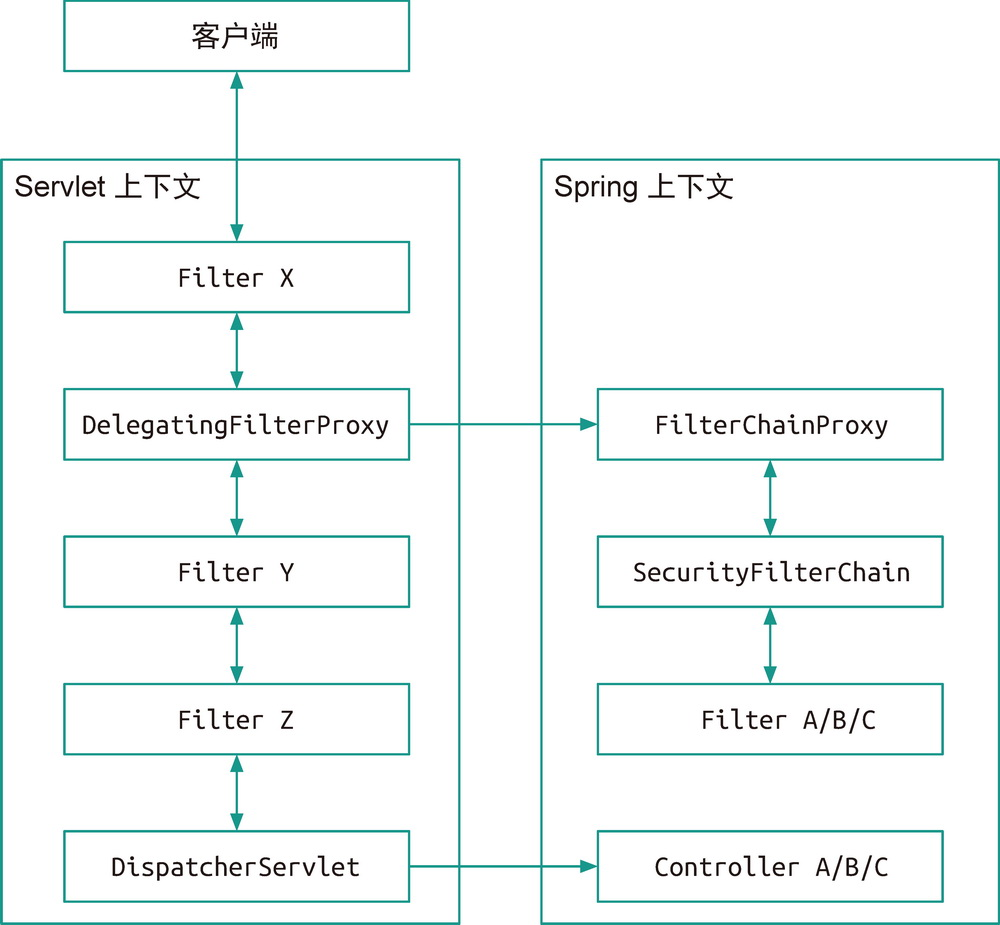
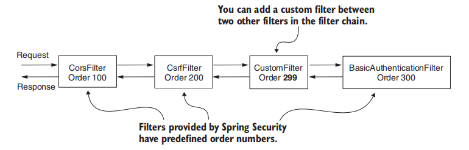

# 过滤器

原生的 `Filter` 是属于 Servlet 容器生命周期的，为了使基于 IOC 容器的 `Filter` 整合进 Servlet 容器的生命周期，SpringFramework 扩展了一个 `DelegatingFilterProxy` 来做代理适配。也就是说，将本来注册到 IOC 容器中的 `Filter` ，挂载到 Servlet 容器的应用上，这样就可以实现 IOC 容器中注册的 `Filter` 也能参与 `Servlet` 访问的过滤。

我们可以自定义 `Filter`，此时需要重写 `doFilter()`，它有以下几个关键的参数：

- `ServletRequest`：表示 HTTP 请求
- `ServletResponse`：表示 HTTP 响应
- `FilterChain`：表示过滤器链

`Fliter` 通过排序值来指定顺序（具有相同排序值的 `Filter`，它们顺序未定义）

下面我们给出一个示例：

~~~java
public class RequestValidationFilter
    implements Filter {
    @Override
    public void doFilter(
        ServletRequest servletRequest,
        ServletResponse servletResponse,
        FilterChain filterChain)
        throws IOException, ServletException {
        
        var httpRequest = (HttpServletRequest) request;
        var httpResponse = (HttpServletResponse) response;
        String requestId = httpRequest.getHeader("Request-Id");
        if (requestId == null || requestId.isBlank()) {
            // 如果没有 Request-Id 请求头
            // 那么直接返回 400 Bad Request
            httpResponse.setStatus(HttpServletResponse.SC_BAD_REQUEST);
            return;
        }
        // 否则，请求将被转发到下一个过滤器
        filterChain.doFilter(request, response);
    }
}
~~~

通过 `addFilterBefore` 或者 `addFilterAfter` 等方法来注册这个过滤器

~~~java
http.addFilterBefore(
    	new RequestValidationFilter(), 
    	BasicAuthenticationFilter.class)
    .addFilterAfter(
    	new AuthenticationLoggingFilter(),
    	BasicAuthenticationFilter.class)
    .addFilterAt(
    	new StaticKeyAuthenticationFilter(),
    	BasicAuthenticationFilter.class)		// 执行顺序未定义
~~~

`OncePerRequestFilter` 可以保证一次外部请求，只执行一次过滤方法，对于应用内部之间的 forward 等请求，不会再次执行过滤方法。

`Spring Security` 针对不同安全需求提供了大量过滤器：

- `WebAsyncManagerIntegrationFilter` ：把 SecurityContext 设置到异步线程中
- `SecurityContextPersistenceFilter`：从 HttpSession 中把 SecurityContext 取出来，然后放入 SecurityContextHolder。在所有拦截器都处理完成后，再把 SecurityContext 存入 HttpSession，并清除 SecurityContextHolder 内的引用。
- `CsrfFilter` ：跨站请求伪造的核心过滤器，会对所有 POST 、PUT 、DELETE 类请求进行验证，检查其中提交的数据是否包含于 CSRF 相关的 Token 信息，如果没有则会响应 403 拒绝访问。
- `LogoutFilter` ：精准匹配指定的注销登录请求（默认是 `/logout` ），以实现用户注销登录，清除认证信息的功能；
- `UsernamePasswordAuthenticationFilter` ：它会精准匹配指定的登录请求（默认是 `/login` ），通过收集用户名和密码信息，来进行认证；
  1. 调用 AbstractAuthenticationProcessingFilter.doFilter() 方法执行过滤器
  2. 调用 UsernamePasswordAuthenticationFilter.attemptAuthentication() 方法
  3. 调用 AuthenticationManager.authenticate() 方法
- `DefaultLoginPageGeneratingFilter` ：生成默认登录页的过滤器，如果我们没有使用 `http.loginPage(xxx)` 方法指定登录页，则由它生成内置的表单登录页；
- `DefaultLogoutPageGeneratingFilter` ：生成默认注销确认页的过滤器，
- `BasicAuthenticationFilter` ：提供一个 HTTP basic 的认证方式，这个过滤器会自动截取请求头中 `Authentication` ，且内容是以 `Basic` 开头的数据，之后按照特定的规则解析出用户名和密码；
- `RememberMeAuthenticationFilter`：处理记住我功能的过滤器
- `AnonymousAuthenticationFilter` ：当 `UsernamePasswordAuthenticationFilter` 和 `BasicAuthenticationFilter` 都没有有效提取并封装用户信息 `Authentication` 时，会由该过滤器生成一个匿名用户的信息 `AnonymousAuthenticationToken` ，并保存到 `SecurityContextHolder` 中；
- `ExceptionTranslationFilter` ：它可以收集并处理整个过滤器链上的异常并转换；如果不是 Spring Security 中的异常类型，则走 ServletException 异常类型的处理逻辑。
- `FilterSecurityInterceptor` ：它会根据当前登录信息，以及正在访问的资源路径，判定是否准许访问；`AuthorizationFilter` 取代了 `FilterSecurityInterceptor`。为了保持向后兼容，`FilterSecurityInterceptor` 仍然是默认的。