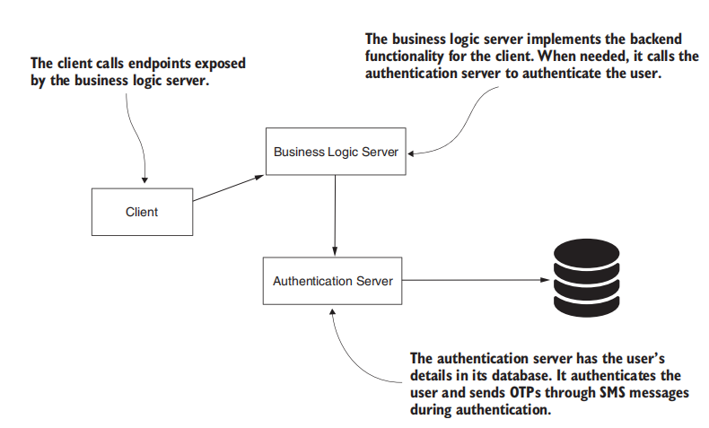
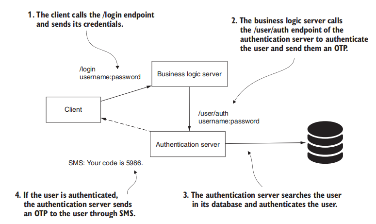
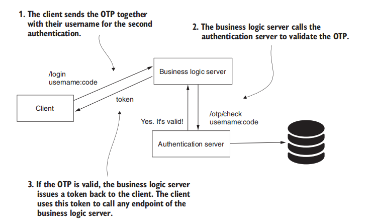
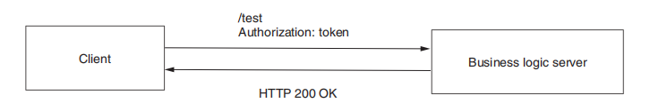
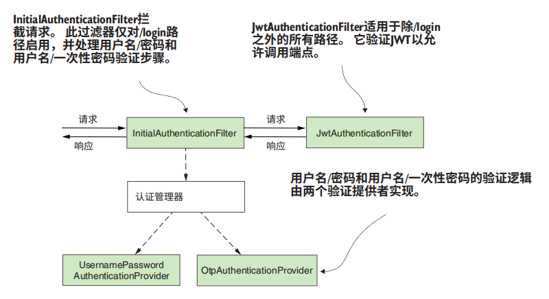
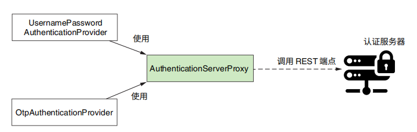

# 职责分离

大体构架如下：



认证服务器根据凭据（用户名和密码）对用户进行身份验证，并通过短信发送一次性密码（OTP）。这种识别用户的方式称为多因素身份验证（MFA），流程如下：





客户端在收到 Token 后，在每次 HTTP 请求中都加入这个 Token 来进行认证。



令牌具有以下优势：

- 避免在请求中携带凭据，减少了窃取凭据的可能性
- 可以定义具有短生命周期的令牌，避免重放攻击
- 可以携带有限的信息
- 将身份验证责任分离到系统中的另一个组件（重点）


当我们把认证逻辑剥离出来后，就可以不用在认证服务器中使用 Spring Security 来实现认证，反而可以用 MVC 架构来实现，向外部直接暴漏认证、注册等端点即可。在业务服务器中，仍需要 Spring Security 来完成认证工作，进行用户权限的检测。

在 SpringSecurity 中整合 jwt：

```xml
<!-- jwt -->
<dependency>
    <groupId>io.jsonwebtoken</groupId>
    <artifactId>jjwt-api</artifactId>
    <version>0.11.5</version>
</dependency>
<dependency>
    <groupId>io.jsonwebtoken</groupId>
    <artifactId>jjwt-impl</artifactId>
    <version>0.11.5</version>
</dependency>
<dependency>
    <groupId>io.jsonwebtoken</groupId>
    <artifactId>jjwt-jackson</artifactId>
    <version>0.11.5</version>
</dependency>
```

一个 JWT 由三部分组成：

1. Header（头部）
2. Payload（载荷）
3. Signature（签名）

各部分以 `.` 分割。payload 和 claims 这两个属性均可作为载荷，但只能设置其一，否则在 compact() 方法中抛出异常。此外，还提供了 JWT 标准 7 个保留声明（Reserved claims）：

- setIssuer()：签发者
- setSubject()：用户
- setAudience()：接收者
- setExpiration()：签发时间
- setNotBefore()：获取事件
- setIssuedAt()
- setId()

注意，要先设置 claims 再设置这些保留声明，否则这些保留声明将会被覆盖。




~~~java
@Component
public class InitialAuthenticationFilter extends OncePerRequestFilter {
    @Autowired
    private AuthenticationManager manager;
	
    // 从配置文件中获取密钥
    @Value("${jwt.signing.key}")
    private String signingKey;

    @Override
    protected void doFilterInternal(
        HttpServletRequest request, 
        HttpServletResponse response, 
        FilterChain filterChain) throws ServletException, IOException {
        String username = request.getHeader("username");
        String password = request.getHeader("password");
        String code = request.getHeader("code");
        if (code == null) {
            // 对于不同的请求头，做不同的验证方式。
            Authentication a = new UsernamePasswordAuthentication(username, password);
            // 认证失败抛异常
            manager.authenticate(a);
        } else {
            Authentication a = new OtpAuthentication(username, code);
            // 认证失败抛异常
            manager.authenticate(a);
			
            // 生成 JWT，并返回给客户端
            SecretKey key = Keys.hmacShaKeyFor(signingKey.getBytes(StandardCharsets.UTF_8));
            String jwt = Jwts.builder()
                    .setClaims(Map.of("username", username))
                    .signWith(key)
                    .compact();
            response.setHeader("Authorization", jwt);
            // 这里其实可以调用 remeberMeService，来实现记得我的功能
        }
        
		// 不再继续传播下去了
    }

    // 只拦截 /login 端点的请求
    @Override
    protected boolean shouldNotFilter(HttpServletRequest request) {
        return !request.getServletPath().equals("/login");
    }
}
~~~

~~~java
@Component
public class JwtAuthenticationFilter extends OncePerRequestFilter {

    @Value("${jwt.signing.key}")
    private String signingKey;

    @Override
    protected void doFilterInternal(
        HttpServletRequest request, 
        HttpServletResponse response, 
        FilterChain filterChain) throws ServletException, IOException {
        String jwt = request.getHeader("Authorization");
        SecretKey key = Keys.hmacShaKeyFor(signingKey.getBytes(StandardCharsets.UTF_8));
        // 解析 JWT，获取用户信息
        Claims claims = Jwts.parserBuilder()
                .setSigningKey(key)
                .build()
                .parseClaimsJws(jwt)
                .getBody();
		
        // 这里可以实现一个检测的逻辑
        String username = String.valueOf(claims.get("username"));
        // 封装 Authentication 对象
        List<GrantedAuthority> grantedAuthorityList = new ArrayList<>();
        for (String r : role.split(",")) {
            grantedAuthorityList.add(new SimpleGrantedAuthority(r));
        }
        var auth = new UsernamePasswordAuthenticationToken(userId, null, grantedAuthorityList);
       	// 将 Authentication 封装到 SecurityContextHolder 中
        // 这样在本次请求中，可以让 Controller 获取到用户的信息
        // 在权限检测中，也要从 SecurityContextHolder 中获取 Authentication
        var auth = new UsernamePasswordAuthentication(username, null, grantedAuthorityList);
        SecurityContextHolder.getContext().setAuthentication(auth);

        // 继续传播下去，要做权限检测的
        filterChain.doFilter(request, response);
    }

    @Override
    protected boolean shouldNotFilter(HttpServletRequest request) {
        return request.getServletPath().equals("/login");
    }
}

~~~

在 JWT 的 parseClaimsJws，会抛出以下异常：

- MalformedJwtException：token 格式不对
- SignatureException：token 签名不对
- ...


注册这些过滤器：

~~~java
http.addFilterBefore(
    	initialAuthenticationFilter,
    	BasicAuthenticationFilter.class)
    // 注意只有 Login 请求会走 AuthenticationFilter。其他请求都放行
    .addFilterAfter(
    	jwtAuthenticationFilter,
    	BasicAuthenticationFilter.class);
~~~


认证的逻辑如下，这里就不给出实现了



