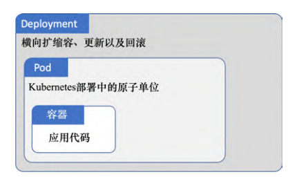
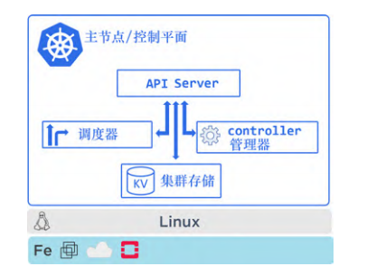
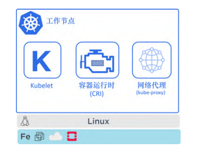
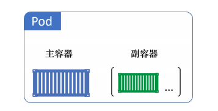
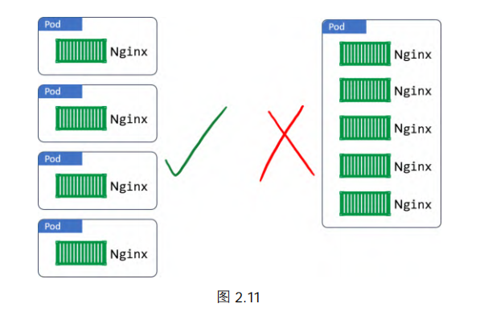
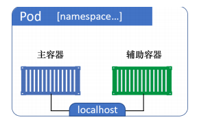
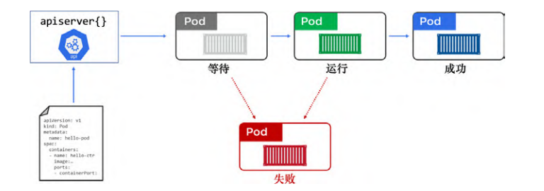
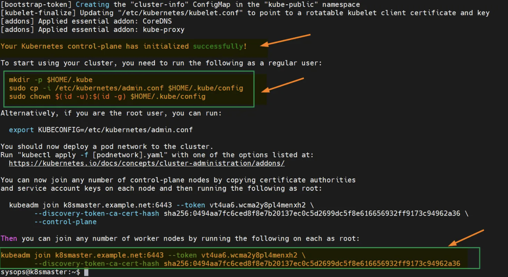

# 初识

[TOC]

Kubernetes 是一个**应用编排器（orchestrator）**，用于对容器化云原生微服务应用进行编排。就像 Linux 能够对各种硬件进行抽象一样，Kubernetes 能够对云上的资源实现抽象。Kubernetes 包括但不仅限于以下功能：

- 快速部署应用程序
- 根据需要动态扩缩容
- 当出现故障时自愈
- 进行不停机的滚动升级和回滚

Kubernetes 最突出的优点是，它可以在无须人工干预决策的情况下自动完成以上所有任务。

**Docker** 是一种更加偏向底层的技术，它负责诸如启停容器的操作；而 Kubernetes 是一种更加偏向上层的技术，它注重集群范畴的管理，比如决定在哪个节点上运行容器、决定什么适合进行扩缩容或升级。

**容器运行时接口（Container Runtime Interface, CRI）**是 Kubernetes 用来与第三方容器运行时进行对接的标准化的抽象层。这样容器运行时与 Kubernetes 是解耦的，同时又能够以一种标准化的方式予以支持。

## 操作概览

一个 Kubernetes 集群包括

- 数据平面（工作节点）：应用服务就运行在每个工作节点上。
- 控制平面（主节点）：对外提供 API，对内负责各节点的任务分配与调度，并在持久化存储中记录各节点的状态。


一般在 Kubernetes 上运行应用的过程：

1. 应用以微服务方式实现
2. 通过容器对每个微服务打包
3. 每个容器集成到 Pod
4. 使用 Controller 来在集群中部署 Pod（直接部署 Pod 也是可以的，但满足不了实际需求），Controller 是对 Pod 的更高一层的封装。Controller 包括但不限于：
   - Deployment：提供可扩展性和滚动更新
   - DaemonSet：在集群的每个工作节点中都运行相应服务的实例
   - StatefulSet：有状态应用部署于 StatefulSet
   - CronJob ：需要不定期运行的临时任务则由定时任务（CronJob）来管理




## 控制平面

Kubernetes 的控制平面是系统服务的集合，这些服务包括

- **API Server**：负责所有组件之间的通信，对外提供了 RESTful 风格的 API 接口
- **集群存储**：它持久化地存储了整个集群的配置与状态。它的底层通常选用分布式数据库 etcd
- **controller 管理器**：监听 API Server，并负责创建 controller。这些 controller 包括工作节点 controller、终端 controller，以及副本 controller。每个 controller 都在后台监控 API Server 的变更，执行必要的操作以保证集群的*当前状态（*current state*）*可以与*期望状态（*desired state*）*相匹配。**这是实现声明式的关键所在**。具体来说，控制器会监视资源的创建/更新/删除事件，并触发 `Reconcile` 函数作为响应。整个调整过程被称作 “Reconcile Loop”（调谐循环）或者 “Sync Loop”（同步循环）。
- **调度器**：通过监听 API Server 来启动新的工作任务，并将其分配到适合的且处于正常运行状态的节点中。
- **云 controller 管理器**：如果用户的集群运行在诸如 AWS、Azure、GCP、DO 和 IBM 等类似的公有云平台上，则控制平面会启动一个云 controller 管理器（cloud controller manager）。云 controller 管理器负责集成公有云提供的服务，例如实例、负载均衡以及存储等。



## 工作平面

工作节点的工作流程：

- 监听 API Server 分派的新任务
- 执行新分派的任务
- 向控制平面回复任务执行的结果（通过 API Server）



- Kubelet：它是每个工作节点上的核心部分，是 Kubernetes 中重要的代理端。负责执行由控制平面分配的任务，并且向控制平面反馈信息
- 容器运行时：Kubelet 需要一个容器运行时（container runtime）来执行任务
- kube-proxy：负责本地集群网络，保证了每个工作节点都可以获取到唯一的 IP地址，并且实现了本地 IPTABLE 以及 IPV， 来保障 Pod 间的网络路由与负载均衡

每个 Kubernetes 集群都有自己内部的 DNS 服务。


## Pod

Pod 本身并不会运行任何东西，只是作为一个承载容器的沙箱而存在。更准确来说， Pod 就是由一个或多个容器共享的运行环境。这个环境包括 IPC 命名空间，内存，磁盘、网络以及其他资源等。

对于存在强绑定关系的多个容器，比如需要共享内存与存储，多容器 Pod 就是一个非常完美的选择。但是，如果容器间并不存在如此紧密的关系，则更好的方式是将容器封装到不同的 Pod，通过网络以松耦合的方式来运行。这样可以在任务级别实现容器间的隔离，降低相互之间的影响。



Kubernetes 中最小的调度单元也是 Pod。但是千万不要选择通过向一个已经存在的 Pod 中增加更多的容器这种方式来完成扩容。




每个 Pod 会创建其自己的网络命名空间。其中包括一个 IP 地址、一组 TCP 和 UDP 端口范围，以及一个路由表。属于同一个 Pod 的两个容器间的通信，可以借助 Pod 的 localhost 接口实现。




**控制组（Control Group, CGroup）**用于限制某个容器使用节点上所有可用的 CPU、RAM 和 IOPS。每个容器有其自己的 CGroup 限额，也就是说，同一个 Pod 中的两个容器可以有不同的 CGroup 限额。

Pod 的生命周期示意图如下：



注意：Pod 的部署是一个原子操作。只有当 Pod 中的所有容器都启动成功且处于运行状态时，Pod 提供的服务才会被认为是可用的。对于部分启动的 Pod，绝对不会响应服务请求。

下面我们来部署一个 Pod。首先提供一个 manifest 文件：

~~~yaml
apiVersion: v1
kind: Pod
metadata:
	name: hello-Pod 
	labels:
		zone: prod
		version: v1
spec:
	containers:
	- name: hello-ctr
        image: nigelpoulton/k8sbook:latest 
        ports:
        - containerPort: 8080
~~~

其中，有四个顶级资源（top-level resource）：

- apiVersion：格式为 `<api-group>/<version>`，用于创建部署对象的 API 组和 API 版本。这里，Pod 对象定义在一个名为 Core 的 API 组（API Group）中，可以忽略 api-group 部分
- kind：告诉 Kubernetes 要部署的对象类型
- metadata：定义名称和标签（label）。这些信息用于在集群中描述所部署的对象
- spec：定义 Pod 所运行的容器

然后，通过执行 kubectl 命令将其 POST 到 API Server：

~~~shell
kubectl apply -f Pod.yml
~~~

执行 `kubectl get Pods` 命令来检查状态。而 `-o yaml` 参数可以返回一份完整的 Pod 清单，包括了期望状态与当前状态的对比：

~~~yaml
$ kubectl get Pods hello-Pod -o yaml
apiVersion: v1
kind: Pod
metadata:
	annotations: 
		kubectl.kubernetes.io/last-applied-configuration: | 
		...
	name: hello-Pod
	namespace: default
spec: #期望状态
	containers:
	- image: nigelpoulton/k8sbook:latest
	imagePullPolicy: Always
	name: hello-ctr
	ports:
	
status: #当前状态
	conditions:
	- lastProbeTime: null
	lastTransitionTime: 2019-11-19T15:24:24Z 
	state:
		running:
			startedAt: 2019-11-19T15:26:04Z
~~~

可以通过 `kubectl describe` 来打印对象的总览信息：

通过 `kubectl exec` 命令登录到容器内部的终端上。

~~~shell
 kubectl exec -it hello-Pod -- sh
~~~

参数 `-it` 的作用在于使 exec 的会话成为交互式（interactive）的，并且把当前终端的 STDIN 和 STDOUT 与 Pod 中第一个容器的 STDIN 和 STDOUT 连接起来。

对于 Pod 中有多个容器的情况，需要 --container 参数指定要登录的容器。如果不指定，则会登录 Pod 中第一个容器

## Kubectl

默认情况下，kubectl 的配置文件位于 $HOME/.kube/config。它包含如下配置信息

- clusters：指定 kubectl 可以连接的多个集群的列表
- contexts：定义集群和相关用户的组合。例如，配置中有名为 deploy-prod 的 context，它将名为 deploy 的用户凭证和名为 prod 的集群定义组合起来。此时如果基于这个 context 使用 kubectl，那么该命令将会以 deploy 用户的身份发送至集群 prod 的 API Server。
- users ：定义不同的用户以及对不同集群的不同级别的权限。

在 CCE 集群管理页面中，选择「配置中心」->「集群访问配置」，获取 kubectl 的配置文件。然后在 `$HOME/.kube` 下添加该配置文件。测试是否能连接集群：

~~~shell
$  kubectl cluster-info
Kubernetes control plane is running at https://116.205.108.119:5443
CoreDNS is running at https://116.205.108.119:5443/api/v1/namespaces/kube-system/services/coredns:dns/proxy

$ kubectl get nodes
192.168.0.143   Ready    <none>   2d    v1.29.2-r0-29.0.9.3
192.168.0.213   Ready    <none>   2d    v1.29.2-r0-29.0.9.3
192.168.0.245   Ready    <none>   2d    v1.29.2-r0-29.0.9.3
192.168.0.47    Ready    <none>   2d    v1.29.2-r0-29.0.9.3
192.168.0.55    Ready    <none>   2d    v1.29.2-r0-29.0.9.3
192.168.0.84    Ready    <none>   2d    v1.29.2-r0-29.0.9.3
~~~

执行 kubectl config current-context 命令可以查看当前使用的 context。使用 kubectl config use-context 来改变当前的 context


我们通过以下命令来查看 Node 的标签：

~~~shell
$ kubectl get nodes --show-labels
~~~

通过 `kubectl label` 来给节点添加标签：

~~~shell
$ kubectl label nodes ydzs-node2 com=youdianzhishi # 增加了一个com=youdianzhishi 标签
~~~


创建对象 `kubectl apply -f ./my-manifest.yaml` 

删除对象`kubectl delete -f ./pod.json`

~~~shell
# get 命令的基本输出
kubectl get services                          # 列出当前命名空间下的所有 Service
kubectl get pods --all-namespaces             # 列出所有命名空间下的全部的 Pod
kubectl get pods -o wide                      # 列出当前命名空间下的全部 Pod 并显示更详细的信息
kubectl get deployment my-dep                 # 列出某个特定的 Deployment
kubectl get pods                              # 列出当前命名空间下的全部 Pod
kubectl get pod my-pod -o yaml                # 获取一个 Pod 的 YAML

# describe 命令的详细输出
kubectl describe nodes my-node
kubectl describe pods my-pod
~~~

## 搭建 K8S 集群

- Master节点：192.168.31.200 master
- Node1节点：192.168.31.201 node1
- Node2节点：192.168.31.202 node2

设置主机名：

~~~shell
sudo hostnamectl set-hostname master
sudo hostnamectl set-hostname node1
sudo hostnamectl set-hostname node2
~~~

方便节点之间相互访问，在每个节点的`/etc/hosts`上添加如下配置：

~~~shell
192.168.31.200 master
192.168.31.201 node1
192.168.31.202 node2
~~~

修改内核的参数：

~~~shell
# 禁用swap
sudo swapoff -a
sudo sed -i '/ swap / s/^(.*)$/#1/g' /etc/fstab
# 执行完这两条命令后，建议重启

sudo tee /etc/modules-load.d/containerd.conf <<EOF
overlay
br_netfilter
EOF

sudo modprobe overlay
sudo modprobe br_netfilter


#
sudo tee /etc/sysctl.d/kubernetes.conf <<EOF
net.bridge.bridge-nf-call-ip6tables = 1
net.bridge.bridge-nf-call-iptables = 1
net.ipv4.ip_forward = 1
EOF

sudo sysctl --system
~~~


安装 containerd

~~~shell
sudo apt install -y curl gnupg2 software-properties-common apt-transport-https ca-certificates		# 安装依赖项

sudo curl -fsSL https://download.docker.com/linux/ubuntu/gpg | sudo gpg --dearmour -o /etc/apt/trusted.gpg.d/docker.gpg
sudo add-apt-repository "deb [arch=amd64] https://download.docker.com/linux/ubuntu $(lsb_release -cs) stable" # 添加 docker repo

# 安装 containerd
sudo apt update
sudo apt install -y containerd.io


containerd config default | sudo tee /etc/containerd/config.toml >/dev/null 2>&1 
sudo sed -i 's/SystemdCgroup \= false/SystemdCgroup \= true/g' /etc/containerd/config.toml

sudo systemctl restart containerd
sudo systemctl enable containerd
~~~


安装 kubernetes 组件

~~~shell
curl -s https://packages.cloud.google.com/apt/doc/apt-key.gpg | sudo apt-key add -
sudo apt-add-repository "deb http://apt.kubernetes.io/ kubernetes-xenial main"

sudo apt update
sudo apt install -y kubelet kubeadm kubectl
sudo apt-mark hold kubelet kubeadm kubectl
~~~


初始化主节点：

~~~shell
sudo kubeadm init --control-plane-endpoint=192.168.31.200
~~~



接着按照提示信息，进行后续的初始化工作：

```bash
mkdir -p $HOME/.kube
sudo cp -i /etc/kubernetes/admin.conf $HOME/.kube/config
sudo chown $(id -u):$(id -g) $HOME/.kube/config
```

完成上面的工作之后，可以尝试运行下面的 command 来查看当前集群的状态：

```armasm
kubectl cluster-info
kubectl get nodes
```


在 master 节点的初始化输出的最下面，会列出「主从节点」加入的 command，直接copy 然后到 node 节点运行即可。

~~~shell
sudo kubeadm join 192.168.31.200:6443 --token mjy0xx.95lsse7r7fw5sb00 
--discovery-token-ca-cert-hash sha256:73b92db9baf19a3e14d679e6d44b5c7a804902d6ffa3d170858d2ccfd5e0c93f
~~~


一般可以安装 Calico、Flannel 和 Weave-net 等插件来配置集群网络：

~~~shell
kubectl create -f https://raw.githubusercontent.com/projectcalico/calico/v3.26.3/manifests/tigera-operator.yaml
~~~


