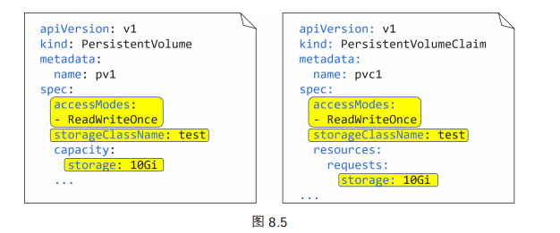

# 存储

## 持久化卷系统

Kubernetes 支持来自多种途径的多种类型的存储。例如 iSCSI、SMB、NFS，以及对象存储等。但无论什么类型的存储，在其通过**插件**对接到 Kubernetes 集群中后，都会被统称为卷（**volume**）。插件是基于**容器存储接口（The Container Storage Interface, CSI）**的

持久化卷子系统（Persistent Volume Subsystem）包括以下 3 个主要资源

- **持久化卷（Persistent Volume, PV）**：允许用户将外部存储映射到集群
- **持久化卷申请（Persistent Volume Claim, PVC）**：类似于许可证，使有被授权的应用（Pod）可以使用 PV。Pod 不能直接与 PV 对接，而是必须通过 PVC 与某个 PV 绑定
- **存储类（Storage Class，SC）**

在 Kubernetes 中的操作将分为如下几步：

1. 创建 PV
2. 创建 PVC
3. 在 PodSpec 中定义卷
4. 挂载到一个容器上

下面先来创建一个 PV：

~~~yaml
apiVersion: v1
kind: PersistentVolume
metadata:
 name: pv1
spec:
 accessModes:
 - ReadWriteOnce
 storageClassName: test
 capacity: 
 storage: 10Gi
 persistentVolumeReclaimPolicy: Retain
 gcePersistentDisk:
 pdName: uber-disk
~~~

- `spec.accessModes` 定义了 PV 是如何被挂载的，可选项包括以下几种：
  - **ReadWriteOnce（RWO）**：限制一个 PV 只能以读写方式被绑定到一个 PVC
  - **ReadWriteMany（RWM）**：允许一个 PV 能够以读写方式被绑定到多个 PVC 上
  - **ReadOnlyMany（ROM）**：允许 PV 以只读方式绑定到多个 PVC
- `spec.persistentVolumeReclaimPolicy` 定义在 PVC 被释放之后，如何处理对应的 PV。
  - **Delete**：删除对应的 PV 对象以及外部存储系统中关联的存储资源
  - **Retain**：会保留对应的 PV 对象，以及外部存储系统中的资源。不过，也会导致其他 PVC 无法继续使用该 PV。
- `spec.capacity` 用于告诉 Kubernetes 这个 PV 的容量是多少。它的值可以比实际的物理存储资源更少，但是不能更多。
- `spec.storageClassName`：通过名字来指定存储类。如果未获取到，那么自动创建一个存储类
- `pdName`：通过名字来指明要映射的外部存储

下面创建一个 `PVC`

~~~yaml
apiVersion: v1
kind: PersistentVolumeClaim
metadata:
 name: pvc1
spec:
 accessModes:
 - ReadWriteOnce
 storageClassName: test
 resources: 
 requests:
 storage: 10Gi
~~~

 最重要的是要注意到，PVC 的 spec 部分的值与要绑定的 PV 要一致（下面用黄标来说明这一点）。

最后，我们将 Pod 与 PVC 进行绑定：

~~~yml
apiVersion: v1
kind: Pod
metadata:
	name: volPod
spec:
	volumes			# 定义一个卷
	- name: data
	persistentVolumeClaim:	# 通过名字指定要使用的 PVC
		claimName: pvc1
containers:
	- name: ubuntu-ctr
	image: ubuntu:latest
	command:
	- /bin/bash
	- "-c"
	- "sleep 60m"
	volumeMounts:
	- mountPath: /data
	name: data			# 通过名字来指定要使用的卷
~~~

- `spec.volumes`：定义卷（volume）

手动创建和维护大量的 PV 和 PVC 是难以完成的任务。使用存储类（Storage Class）来解决这一问题。

~~~yaml
kind: StorageClass
apiVersion: storage.k8s.io/v1
metadata:
 name: fast
provisioner: kubernetes.io/aws-ebs
parameters:
 type: io1
 zones: eu-west-1a
 iopsPerGB: "10"
~~~

- `provisioner`：告知 Kubernetes 使用哪个插件
- `parameters`：设置插件的参数

部署和使用 StorageClass 对象的基本流程如下：

1. 创建 Kubernetes 集群及其存储后端
2. 创建一个 StorageClass 对象
3. 创建一个 PVC 对象，并通过名称与 StorageClass 对象关联
4. 部署一个 Pod，使用基于该 PVC 的卷

请注意以上流程**不**包括创建 PV。这是因为存储类能够自动创建 PV。下面给出一个示例

~~~yaml
kind: StorageClass
apiVersion: storage.k8s.io/v1
metadata: 
 name: fast # 定义 SC 的名字
provisioner: kubernetes.io.gce-pd
parameters: 
 type: pd-ssd
~~~

~~~yaml
apiVersion: v1 
kind: PersistentVolumeClaim
metadata:
 name: mypvc 
 namespace: mynamespace
spec:
 accessModes:
 - ReadWriteOnce 
 resources: 
 requests:
 storage: 50Gi
 storageClassName: fast # 通过名字来指定要使用的 SC
~~~

~~~yaml
apiVersion: v1
kind: Pod
metadata: 
 name: myPod
spec:
 volumes:
 - name: data 
   persistentVolumeClaim:
   claimName: mypvc 
~~~

StorageClass 部署成功之后，它会观测 API Server。当匹配的 PVC 出现时，StorageClass 会自动在后端存储系统上创建所需的卷，并在 Kubernetes 上创建 PV。

## ConfigMap

Kubernetes 通过提供一个名为 ConfigMap（CM）的对象，将配置数据从 Pod 中剥离出来。使用它可以动态地在 Pod 运行时注入数据。ConfigMap 通常用于存储如下的**非敏感**配置数据：

- 环境变量的值
- 整个配置文件（比如 Web Server 的配置和数据库的配置）
- 主机名（hostname）、服务端口（Service port）

我们不应使用 ConfigMap 来存储诸如凭证和密码等的敏感数据。Kubernetes 提供了另一种名为 Secret 的对象来存储敏感数据。

ConfigMap 是一个保存键值对（key/value pair）的 map。下面来声明式创建 ConfigMap：

~~~yaml
kind: ConfigMap 
apiVersion: v1
metadata:
 name: multimap
data:
 # 保存了各个 Key-Value
 given: Nigel
 family: Poulton
 test.conf: | # 管道符号 告诉 Kubernetes 这个符号之后的所有内容都需要被作为一个字面值来看待
  env = plex-test
  endpoint = 0.0.0.0:31001
  char = utf8
  vault = PLEX/test
  log-size = 512M
~~~

在数据被保存到 ConfigMap 之后，可以通过以下任一种途径注入运行的容器中。

1. 环境变量：

   

   在 Pod 的配置文件中，通过 `env` 来说明 ConfigMap 的 key 到环境变量名之间的映射关系。 

2. 容器启动命令的参数

3. 某个卷（volume）上的文件。这种方式最大的好处就是可以动态修改配置值

   1. 创建一个 ConfigMap（在上面介绍过）
   2. 在 Pod 模板中创建一个 ConfigMap 卷
   3. 然后将 ConfigMap 卷挂载到容器中

   

   ~~~yaml
   apiVersion: v1
   kind: Pod
   metadata:
     name: cmvol
   spec:
    # 创建了特殊的 ConfigMap 卷
     volumes:
     - name: volmap		
     configMap:
     name:multimap		# 通过名字来指定一个 configMap
     containers:
     - name: ctr
     image: nginx
     volumeMounts:
       - name: volmap
       mountPath: /etc/name # 把 ConfigMap 这个卷挂载到 /etc/name 上。文件名是 key，文件内容是 value
   ~~~

   