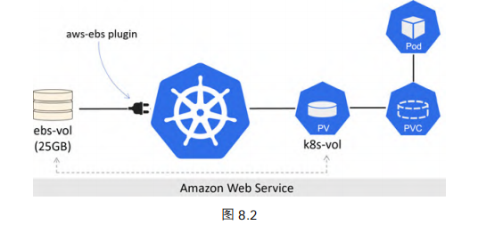
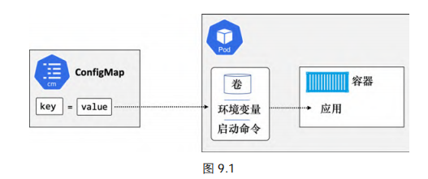
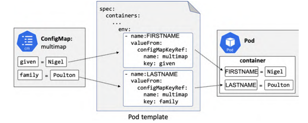
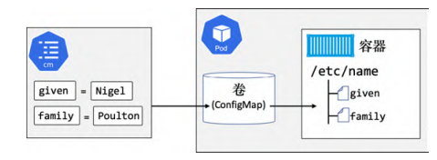

# 存储

[TOC]

## 持久化卷系统

Kubernetes 支持来自多种途径的多种类型的存储。例如 iSCSI、SMB、NFS，以及对象存储等。以 CCE 为例，它提供了以下类型的存储：

- 本地硬盘：将容器所在宿主机的文件目录挂载到容器的指定路径中
- 云硬盘存储卷：CCE 支持将 EVS 创建的云硬盘挂载到容器的某一路径下。当容器迁移时，挂载的云硬盘将一同迁移。这种存储方式适用于需要永久化保存的数据。
- ...

但无论什么类型的存储，在其通过**插件**对接到 Kubernetes 集群中后，都会被统称为卷（**volume**）。插件是基于**容器存储接口（The Container Storage Interface, CSI）**的

持久化卷子系统（Persistent Volume Subsystem）包括以下 3 个主要资源

- **持久化卷（Persistent Volume, PV）**：对底层共享存储的一种抽象
- **持久化卷申请（Persistent Volume Claim, PVC）**：PVC 可以理解为持久化存储的“接口”，它提供了对某种持久化存储的描述，但不提供具体的实现；而这个持久化存储的实现部分则由 PV 负责完成。作为应用开发者，我们只需要跟 PVC 这个「接口」打交道，而不必关心具体的实现是 hostPath、NFS 还是 Ceph。毕竟这些存储相关的知识太专业了，应该交给专业的人去做
- **存储类（Storage Class，SC）**：通过 PVC 请求到的存储设备，可能不足以满足应用的各种存储需求（读写速度）。为了解决这一问题，Kubernetes 又为我们引入了一个新的资源对象：`StorageClass`。通过 `StorageClass` 的定义，管理员可以将存储资源定义为某种类型的资源，比如快速存储、慢速存储等。用户根据 StorageClass 的描述，就可以非常直观地了解各种存储资源的具体特性了，这样就可以根据应用的特性去申请合适的存储资源了。此外 `StorageClass` 还可以为我们自动生成 PV，免去了每次手动创建的麻烦。

在 Kubernetes 中的操作将分为如下几步：

1. 创建 PV
2. 创建 PVC
3. 在 PodSpec 中定义卷
4. 挂载到一个容器上

下面先来创建一个 hostPath 类型的 PV 资源对象： PV：

~~~yaml
apiVersion: v1
kind: PersistentVolume
metadata:
  name: pv1
  labels:
    type: local
spec:
  storageClassName: manual
  capacity:
    storage: 10Gi
  accessModes:
    - ReadWriteOnce
  # 该卷位于集群节点上的 /data/k8s/test/hostpath 目录
  hostPath:
    path: "/data/k8s/test/hostpath"
~~~

- `spec.accessModes` 定义了 PV 是如何被挂载的，可选项包括以下几种：
  - **ReadWriteOnce（RWO）**：限制一个 PV 只能以读写方式被绑定到一个 PVC
  - **ReadWriteMany（RWM）**：允许一个 PV 能够以读写方式被绑定到多个 PVC 上
  - **ReadOnlyMany（ROM）**：允许 PV 以只读方式绑定到多个 PVC
- `spec.persistentVolumeReclaimPolicy` 定义在 PVC 被释放之后，如何处理对应的 PV。
  - **Delete**：删除对应的 PV 对象以及外部存储系统中关联的存储资源
  - **Retain**：会保留对应的 PV 对象，以及外部存储系统中的资源。不过，也会导致其他 PVC 无法继续使用该 PV。
  - Recycle（回收）：清除 PV 中的数据
- `spec.capacity` 用于告诉 Kubernetes 这个 PV 的容量是多少。它的值可以比实际的物理存储资源更少，但是不能更多。
- `spec.storageClassName`：通过名字来指定存储类。如果未获取到，那么自动创建一个存储类
- `pdName`：通过名字来指明要映射的外部存储

下面创建一个 `PVC`

~~~yaml
apiVersion: v1
kind: PersistentVolumeClaim
metadata:
 name: pvc1
spec:
 accessModes:
 - ReadWriteOnce
 storageClassName: test			# 绑定存储类与之相同的 PV
 resources: 
 requests:
 storage: 10Gi
~~~

创建 PVC 之后，Kubernetes 就会去查找满足我们声明要求的 PV，比如 `storageClassName`、`accessModes` 以及容量这些是否满足要求，如果满足要求就会将 PV 和 PVC 绑定在一起。目前 PV 和 PVC 之间是一对一绑定的关系

最后，我们将 Pod 与 PVC 进行绑定：

~~~yml
apiVersion: v1
kind: Pod
metadata:
	name: volPod
spec:
	volumes			# 定义一个卷
	- name: data
	persistentVolumeClaim:	# 通过名字指定要使用的 PVC
		claimName: pvc1
containers:
	- name: ubuntu-ctr
	image: ubuntu:latest
	command:
	- /bin/bash
	- "-c"
	- "sleep 60m"
	volumeMounts:
	- mountPath: /data
	name: data			# 通过名字来指定要使用的卷
~~~

- `spec.volumes`：定义卷（volume）

使用 hostPath 有一个局限性就是，我们的 Pod 不能随便漂移，需要一直固定到一个节点上。所以我们在使用 hostPath 时，都会搭配 Pod 的 nodeSelector 来进行使用。否则，调度 Pod 后，会在本地创建一个新的 hostPath PV，这并不符合预期。

`Local PV`  非常类似于 `hostPath` 加上 `nodeAffinity`，这样 K8s 保证 Pod 总是调度到 Local PV 所在的节点上面，我们就无需手动 hostPath + nodeSelector 了，从而减少了维护成本。下面给出一个例子：

~~~yaml
apiVersion: v1
kind: PersistentVolume
metadata:
  name: pv-local
spec:
  capacity:
    storage: 5Gi
  volumeMode: Filesystem
  accessModes:
  - ReadWriteOnce
  persistentVolumeReclaimPolicy: Delete
  storageClassName: local-storage
  local:
    path: /data/k8s/localpv  # ydzs-node1节点上的目录
    
  # 让 Local PV 在 ydzs-node1 节点上
  nodeAffinity:
    required:
      nodeSelectorTerms:
      - matchExpressions:
        - key: kubernetes.io/hostname
          operator: In
          values:
          - ydzs-node1
~~~

~~~yaml
kind: PersistentVolumeClaim
apiVersion: v1
metadata:
  name: pvc-local
spec:
  accessModes:
  - ReadWriteOnce
  resources:
    requests:
      storage: 5Gi
  storageClassName: local-storage
~~~

~~~yaml
# 在 Pod 中无需指定 nodeAffinity
apiVersion: v1
kind: Pod
metadata:
  name: localpv-pod
spec:
  containers:
    - name: localpv-po-container
      image: nginx
      ports: 
        - containerPort: 80
          name: "http-server"
      volumeMounts: 
        - mountPath: "/usr/share/nginx/html"
          name: example-pv-storage
  volumes:
    - name: example-pv-storage
      persistentVolumeClaim:
        claimName: pvc-local
~~~

但是这有一个问题，如果 PVC 找到了两个符合条件的 PV（pv1、pv2），它们分布在不同的节点 node1、node2 上，那么 PVC 就会与其中一个绑定。假设 PVC 与 pv2 绑定，而 Pod 需要在 node1 运行，那么就调度失败，Pod 处于 Pending 状态。我们可以通过 `StorageClass` 的延迟绑定来解决这个问题，下面是例子：

~~~yaml
apiVersion: storage.k8s.io/v1
kind: StorageClass
metadata:
  name: local-storage
provisioner: kubernetes.io/no-provisioner
volumeBindingMode: WaitForFirstConsumer
~~~

- 因为我们这里是手动创建的 PV，故 `provisioner: kubernetes.io/no-provisioner`
- `volumeBindingMode=WaitForFirstConsumer` 使得原本立即发生的 PVC 和 PV 的绑定过程，就被延迟到了 Pod 第一次调度时进行，从而保证了这个绑定结果不会影响 Pod 的正常调度。

**StorageClass 一旦被创建，则无法修改，如需更改，则只能删除原 StorageClass 资源对象并重新创建**。部署和使用 StorageClass 对象的基本流程如下：

1. 创建 Kubernetes 集群及其存储后端
2. 创建一个 StorageClass 对象
3. 创建一个 PVC 对象，并通过名称与 StorageClass 对象关联
4. 部署一个 Pod，使用基于该 PVC 的卷

~~~yaml
kind: StorageClass
apiVersion: storage.k8s.io/v1
metadata:
 name: fast
provisioner: kubernetes.io/aws-ebs
parameters:
 type: io1
 zones: eu-west-1a
 iopsPerGB: "10"
~~~

- `provisioner`：告知 Kubernetes 使用哪个插件
- `parameters`：设置插件的参数

~~~yaml
apiVersion: v1 
kind: PersistentVolumeClaim
metadata:
 name: mypvc 
 namespace: mynamespace
spec:
 accessModes:
 - ReadWriteOnce 
 resources: 
 requests:
 storage: 50Gi
 storageClassName: fast # 通过名字来指定要使用的 SC
~~~

~~~yaml
apiVersion: v1
kind: Pod
metadata: 
 name: myPod
spec:
 volumes:
 - name: data 
   persistentVolumeClaim:
   claimName: mypvc 
~~~

## ConfigMap

Kubernetes 通过提供一个名为 ConfigMap（CM）的对象，将配置数据从 Pod 中剥离出来。使用它可以动态地在 Pod 运行时注入数据。ConfigMap 通常用于存储如下的**非敏感**配置数据：

- 环境变量的值
- 整个配置文件（比如 Web Server 的配置和数据库的配置）

我们不应使用 ConfigMap 来存储诸如凭证和密码等的敏感数据。Kubernetes 提供了另一种名为 Secret 的对象来存储敏感数据。

ConfigMap 是一个保存键值对（key/value pair）的 map。下面来声明式创建 ConfigMap：

~~~yaml
kind: ConfigMap 
apiVersion: v1
metadata:
 name: multimap
data:
 # 保存了各个 Key-Value
 given: Nigel
 family: Poulton
 test.conf: | # 管道符号 告诉 Kubernetes 这个符号之后的所有内容都需要被作为一个字面值来看待
  env = plex-test
  endpoint = 0.0.0.0:31001
  char = utf8
  vault = PLEX/test
  log-size = 512M
~~~

我们也可以使用指定的文件进行创建 `ConfigMap`

~~~shell
$ kubectl create configmap cm-demo2 --from-file=testcm/redis.conf

$ kubectl get configmap cm-demo2 -o yaml
apiVersion: v1
data:
  redis.conf: |
    host=127.0.0.1
    port=6379
kind: ConfigMap
metadata:
  #...
~~~

在数据被保存到 ConfigMap 之后，可以通过以下任一种途径注入运行的容器中。

1. 环境变量：

   

   在 Pod 的配置文件中，通过 `env` 来说明 ConfigMap 的 key 到环境变量名之间的映射关系，从而将配置注入到 Pod 当中。

3. 某个卷（volume）上的文件。这种方式最大的好处就是可以动态修改配置值

   1. 创建一个 ConfigMap（在上面介绍过）
   2. 在 Pod 模板中创建一个 ConfigMap 卷
   3. 然后将 ConfigMap 卷挂载到容器中

   

   ~~~yaml
   apiVersion: v1
   kind: Pod
   metadata:
     name: cmvol
   spec:
    # 创建了特殊的 ConfigMap 卷
     volumes:
     - name: volmap		
     configMap:
     name:multimap		# 通过名字来指定一个 configMap
     containers:
     - name: ctr
     image: nginx
     volumeMounts:
       - name: volmap
       mountPath: /etc/name # 把 ConfigMap 这个卷挂载到 /etc/name 上。文件名是 key，文件内容是 value
   ~~~

   当 `ConfigMap` 以数据卷的形式挂载进 `Pod` 的时，这时更新 `ConfigMap`，Pod 内挂载的配置信息会热更新。

## Secret

`Secret`用来保存敏感信息，例如密码、OAuth 令牌和 ssh key 等等。`Secret` 主要使用的有以下三种类型：

- `Opaque`：base64 编码格式的 Secret，用来存储密码、密钥等；
- `kubernetes.io/dockerconfigjson`：用来存储私有`docker registry`的认证信息。
- ...

创建 Opaque 类型的 Secret

~~~yaml
apiVersion: v1
kind: Secret
metadata:
  name: dotfile
  namespace: default
type: Opaque
data:
  # 需要 base64 编码
  password: MTIzNDU2
  username: YWRtaW4=
immutable: true
~~~

在创建 Pod 时，可以执行 Secret，此时这些加密 Key-Value 将会注入到环境变量中

~~~yaml
apiVersion: v1
kind: Pod
metadata:
  name: pod1
spec:
  containers:
  - image: busybox
    name: busybox
    env:
    - name: USERNAME
      valueFrom:
        secretKeyRef:
          key: username
          name: dotfile    # secret 名称
    - name: PASSWORD
      valueFrom:
        secretKeyRef:
          name: mysecret
          key: password
~~~

也可以通过 volume ，将 Key-Value 分别注入到各自文件中（文件名为 key，文件内容为 value）

~~~yaml
apiVersion: v1
kind: Pod
metadata:
  name: pod2
spec:
  volumes:
  - name: sec
    secret:
      secretName: dotfile
      defaultMode: 0400  # 设置文件权限
  containers:
  - image: busybox
    name: busybox
    command: ["sleep", "24h"]
    volumeMounts:
    - mountPath: /etc/config
      name: sec
~~~

