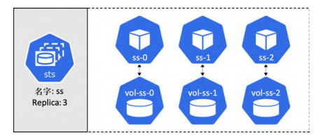

# Controller

[TOC]

## Deployment

Pod 没有自愈能力，不能扩缩容，也不支持方便的升级和回滚。而 Deployment 可以。因此，建议绝大多数情况下采用 Deployment 来部署 Pod。Deployment 在底层利用了另一种名为 ReplicaSet 的对象。并不建议直接操作 ReplicaSet。

ReplicaSet 的底层调谐循环确保当前状态与期望状态保持一致，以提供自愈与扩缩容能力。下面我们来看看如何在零宕机的情况下实现了一种平滑的滚动升级。

现在假设某人遇到了一个 Bug，并且需要部署一个新的镜像来完成修复。因此，他修改了同一个 Deployment 的 YAML 文件，将镜像版本更新，并重新 POST 到 API Server。为了到达期望状态，Kubernetes 基于新镜像的 Pod 创建了一个新的 ReplicaSet。此时就有两个 ReplicaSet 了：一个是包含基于旧版镜像的 Pod，一个是新版本的 Pod。每次 Kubernetes 增加新 ReplicaSet（新版镜像）中的 Pod 数量的时候，都会相应地减少旧 ReplicaSet（旧版镜像）中的 Pod 数量。这一切只需更新清单文件！

着重需要说明的是，旧版的 ReplicaSet 仍然有完整的配置信息，包括旧版的镜像，这对于回滚功能来说很重要。

下面，我们来创建一个 Deployment。首先创建 manifest 文件

~~~yaml
apiVersion: apps/v1
kind: Deployment
metadata: 			# Deployment 自己的 metadata 
  name: hello-deploy
spec:
  replicas: 10		# 需要多少个副本
  selector:			# 表明 Deployment 所要管理的 Pod 必须具备的标签
    matchLabels:
      app: hello-world
  revisionHistoryLimit: 5
  progressDeadlineSeconds: 300
  minReadySeconds: 10			# 每个 Pod 的更新操作要间隔 10s
  strategy:
    type: RollingUpdate	# 如何执行更新操作
    rollingUpdate:
      # 下面两个参数表明，在滚动更新的过程中，最多只能同时更新两个 Pod
      maxUnavailable: 1		# 不允许出现比期望状态指定的 Pod 数量少超过一个的情况，即在更新过程中，Pod 数量不能超过 11 个
      maxSurge: 1			# 不允许出现比期望状态指定的 Pod 数量多超过一个的情况，即即在更新过程中，Pod 数量不能少于 9 个
  template:		# Pod 模板
    metadata:
      labels:
        app: hello-world
    spec:
      containers:	
      - name: hello-pod		# 容器名
        image: nigelpoulton/k8sbook:1.0
        ports:
        - containerPort: 8080
        resources:
          limits:
            memory: 128Mi
            cpu: 0.1
~~~

然后 POST 到 API Server 中

~~~shell
$ kubectl apply -f deploy.yml
~~~

通过 kubectl get 或者 kubectl describe 命令来查看 Deployment 对象：

~~~shell
$ kubectl get deploy hello-deploy
$ kubectl describe deploy hello-deploy
~~~

现在，我们提供一个 Service 对象，对 Deployment 中的 Pod 对象提供一个稳定的、向外暴露的 IP 地址。

~~~yaml
apiVersion: v1
kind: Service
metadata:
  name: hello-svc
  labels:
    app: hello-world
spec:
  type: NodePort
  ports:
  - port: 8080
    nodePort: 30001
    protocol: TCP
  selector:
    app: hello-world
~~~

~~~shell
$ kubectl apply -f svc.yml
~~~

现在 Service 已经部署好了，可以通过以下任一种方式来访问该应用：

- 在集群内部，通过 DNS 名称 hello-svc （Service 的名称）和端口 8080 访问
- 在集群外部，通过集群任意一个节点的 IP 和端口号 30001 访问

现在只要修改 manifest 文件中的 spec.containers.image，然后 POST 即可实现更新操作。执行 kubectl apply 来 POST manifest 文件时，要附带 --record 参数，这对回滚操作很重要。

~~~shell
$ kubectl apply -f deploy.yml --record
~~~

可以执行 `kubectl rollout status`来查看更新过程：

~~~shell
$ kubectl rollout status deployment hello-deploy
Waiting for rollout to finish: 4 out of 10 new replicas... 
Waiting for rollout to finish: 4 out of 10 new replicas... 
Waiting for rollout to finish: 5 out of 10 new replicas...
~~~

由于在升级 Deployment 时使用了 --record 参数。因此，在执行 kubectl rollout history 命令时，可以显示 Deployment 的两个版本：

~~~shell
$ kubectl rollout history deployment hello-deploy
deployment.apps/hello-deploy
REVISION CHANGE-CAUSE 
1		<none> 
2		kubectl apply --filename=deploy.yml --record=true
~~~

下面通过 kubectl rollout 命令来回滚到版本 1：

~~~shell
$ kubectl rollout undo deployment hello-deploy --to-revision=1
~~~

## StatefulSet 

Deployment 和 StatefulSet 都支持自愈、自动扩缩容、滚动更新等特性。但是 StatefulSet  能够确保即使发生故障、扩缩容，调度等操作之后， Pod 名字、DNS 主机名、卷的绑定之间都是保持不变。

举个简单的例子，由 StatefulSet 管理的 Pod，在发生故障后会被新的 Pod 代替，不过依然保持相同的名字、相同的 DNS 主机名和相同的卷。即使新的 Pod 在另一个节点上启动，亦是如此。

下面就是一个典型的 StatefulSet 定义：

~~~yaml
apiVersion: apps/v1
kind: StatefulSet
metadata:
	name: tkb-sts 
spec: 
	selector:
		matchLabels:
			app: mongo 
	ServiceName: "tkb-sts" 
	replicas: 3 
	template: 
		metadata:
			labels:
				app: mongo
	spec:
		containers:
		- name: ctr-mongo 
		image: mongo:latest
~~~

StatefulSet 的 Pod 名字遵循`<StatefulSetName>-<Integer>`的规则。其中 Integer 是一个从零开始的索引号

关于 StatefulSet 的另一个基本特性就是，对 Pod 的启动和停止是受控和有序的。就是说在扩容时，StatefulSet 等前一个 Pod 达到运行且就绪状态之后，才开始创建下一个 Pod。

当缩容时，控制器会首先终止拥有最高索引号的 Pod，等待其被完全删除之后，再继续删除下一个拥有最高索引号的 Pod。还可以借助 `terminationGracePeriodSeconds` 这样的参数来调整间隔时间，以控制缩容速度。但请注意，删除一个 StatefulSet 并不是按序依次终止所有 Pod 的。

当一个 StatefulSet Pod 被创建时，所需的卷也会被创建，每一个 Pod 和卷（PVC）都是通过名字建立正确的绑定关系的。

如果 StatefulSet 的一个 Pod 在缩容操作中被删除，则当 StatefulSet 被再次扩容时，新增的 Pod 会通过名字的匹配，继续连接到之前已存在的卷上。当进行 Pod 的替换时，只需要保持名字不变，就可以连接同一个卷。

headless Service，就是一个将 spec.clusterIP 设置为 None 的 Service 对象。当这个 headless Service 被设置为 StatefulSet 的 spec.ServiceName 时，它就成为了 StatefulSet 的 governing Service。在二者如此关联之后，Service 会为所匹配的**每个** Pod 副本创建 DNS SRV 记录。其他 Pod 可以通过对 headless Service 发起 DNS 查询来获取 StatefulSet 的信息（不要直接通过 IP 来访问）。下面给出一个例子

~~~yaml
apiVersion: v1
kind: Service
metadata:
  name: mongo-prod
spec: 
  clusterIP: None		# 一个 headless Service
  selector:
    app: mongo
    env: prod
~~~

~~~yaml
apiVersion: apps/v1
kind: StatefulSet
metadata:
  name: sts-mongo
spec: 
  ServiceName: mongo-prod			# 通过名字来指定与这个 StatefulSet 关联的 Headless Service
~~~

Headless Service 与常见的 Service 对比：

- **正常的 Service**：适用于无状态应用，流量会通过 Service 的负载均衡策略分发到多个 Pod 上。
- **Headless Service**：适用于有状态应用，流量可以直接路由到特定的 Pod，适用于需要知道具体 Pod 地址的应用场景。

通过 `<object-name>.<Service-name>.<namespace>.svc.cluster.local`  域名来查询特定 Pod 的地址。

下面给出一个例子：

~~~yaml
# 部署 StorageClass
apiVersion: storage.k8s.io/v1
kind: StorageClass
metadata:
  name: flash
provisioner: pd.csi.storage.gke.io
volumeBindingMode: WaitForFirstConsumer
allowVolumeExpansion: true
parameters:
  type: pd-ssd
  
# 部署 governing headless Service
apiVersion: v1
kind: Service
metadata:
  name: dullahan
  labels:
    app: web
spec:
  ports:
  - port: 80
    name: web
  clusterIP: None
  selector:
    app: web
    
# 部署 StatefulSet
apiVersion: apps/v1
kind: StatefulSet
metadata:
  name: tkb-sts  # StatefulSet的名字
spec:
  replicas: 3
  selector:
    matchLabels:
      app: web
  serviceName: "dullahan"	# 通过名字来指定与这个 StatefulSet 关联的 Headless Service
  
  # Pod 模板 
  template:
    # 略
  volumeClaimTemplates:
  # 每个 Pod 都关联两个 PVC
  - metadata:
      name: webroot
    spec:
      accessModes: [ "ReadWriteOnce" ]
      storageClassName: "flash"		# 通过名字指定 StorageClass
      resources:
        requests:
          storage: 1Gi
  - metadata:
      name: logs
    spec:
      accessModes: ["ReadWriteOnce"]
      resources:
        requests:
          storage: 500Mi
~~~

`volumeClaimTemplate` 用于在每次创建一个新的 Pod 副本的时候，自动创建一个 PVC，并且为 PVC 命名，以便实现与 Pod 的准确关联。

