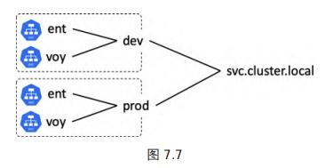
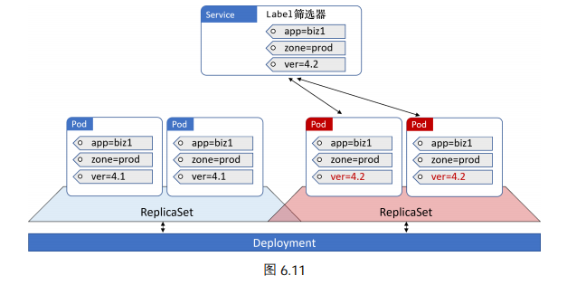

## Service

Pod 的 IP 地址是不可靠的：当 Pod 被替换或者水平扩容/缩容后，Pod 的 IP 地址会发生变化。

Service 为一组 Pod 提供了可靠且稳定的网络，以及基于 TCP 以及 UDP 的负载均衡能力。每一个 Service 都拥有固定的 IP 地址、固定的 DNS 名称，以及固定的端口。此外，Service 还可以利用 Label ，来动态选择（负载均衡）将流量转发至哪些 Pod。Service 只会将流量路由到健康的 Pod，这意味着如果 Pod 的健康检查失败，那么 Pod 就不会接收到任何流量。

Service 与 Pod 之间是通过 Label 和 Label 筛选器（selector）松耦合在一起的。匹配的 Pod 必须拥有所有在 Service Label 筛选器中定义的 Label。

Service 的工作原理：

- 每一个 Service 在被创建的时候，都会得到一个关联的 Endpoint 对象。整个 Endpoint 对象其实就是一个**动态**列表，其中包含匹配该 Service Label 筛选器的健康 Pod 的 IP。
- kube-proxy 会根据 Service 和 Endpoint 的变动，改变节点上 iptables 或者 ipvs 中保存的规则。
- 当节点将流量打到 ServiceIP 时，会被  kube-proxy 捕获拦截，然后将 IP 改写为某个健康 Pod 的 IP 地址。

当集群中的节点数量非常多时，iptables 并不能达到生产级别的可用性要求，每次对规则进行匹配时都会遍历 iptables 中的所有 Service 链。规则的更新也不是增量式的，当集群中的 Service 达到 5,000 个，每增加一条规则都需要耗时 11min，当集群中的 Service 达到 20,000 个时，每增加一条规则都需要消耗 5h 的时间。ipvs 正是解决 iptables 问题的技术，它使用哈希表作为底层的数据结构并且工作在内核态。

Kubernetes 支持几种不同类型的 Service：

- ClusterIP Service
- NodePort Service
- LoadBalancer Service

 `ClusterIP Service`（默认）：拥有固定的 IP 地址和端口号，并且仅能够从集群内部访问得到。在创建 ClusterIP Service 时，ClusterIP 与对应的 Service 名称（`metadata.name`）会被动地注册注册在集群内部的 DNS 服务中。所以， Pod（应用的微服务）只需知道 Service 的名称，就能够解析到对应的 ClusterIP，然后将流量打到 ClusterIP 上，Service 就自动帮我们转发流量到相应的 Pod 上。

~~~yaml
kind: Service
apiVersion: v1
metadata:
   name: ngx-service
spec:
   selector:
     app: ngx  
   ports:
     - protocol: TCP   #代理的协议，可选 TCP 或者 UDP
       port: 80        # service对外服务端口
       targetPort: 80  # Pod上的服务端口
~~~

`NodePort Service`：在 ClusterIP Service 的基础上，增加了另一个端口 NodePort（可用范围为 30000~32767），从而可以从集群外部访问到 Service。以下的例子表示一个 NodePort Service

~~~yaml
kind: Service
apiVersion: v1
metadata:
   name: ngx-sr-nodeport
spec:
   type: NodePort   	# 仍会为其分配一个ClusterIP
   selector:
     app: ngx
   ports:
     - protocol: TCP
       port: 80    		# 集群内部使用 CluserIP+port 访问服务
       targetPort: 80  	 # Pod 上的服务端口
       nodePort: 30080   # 集群外部使用 IP+nodeport 访问服务
~~~

- 在集群内部，可以通过`(ClusterIP、port)`来直接访问这个服务。
- 在集群外部，可以发送请求到集群中的任何一个节点上的 `NodePort` 端口来访问该服务。

`LoadBalancer Service` 基于 NodePort，并且集成了基于云的负载均衡器。

### 服务发现

Kubernetes 通过以下方式来实现**服务发现**（Service discovery）

- DNS（推荐）：DNS 服务以插件的形式存在（CoreDNS）。CoreDNS 在集群中的 Service 地址一般情况下是固定的，kubelet 会将使用 `--cluster-dns=<dns-service-ip>` 参数将 DNS 传递给每个容器。对于普通的 Service，CoreDNS 会注册 `servicename.namespace.svc.cluster.local` 域名，并解析到 Service 对应的 ClusterIP 上。而对于 Headless Service，它会注册`podname.servicename.namespace.svc.cluster.local`域名，以访问到具体的某一个 Pod。
- 环境变量（绝对不推荐）：关于环境变量方式的最大问题在于，环境变量只有在 Pod 最初创建的时候才会被注入。这就意味着，Pod 在创建之后是并不知道新 Service 的。

### 命名空间

Kubernetes 支持多个虚拟集群，它们底层依赖于同一个物理集群。 这些虚拟集群被称为**命名空间**，它们在逻辑上彼此隔离。这可以作为在多个团队之间访问控制和资源限额的一种手段。不过，它不能作为流量隔离的手段来使用。这里仅仅介绍如果创建

Kubernetes 启动时会创建四个初始名字空间：

1. **default**：如果一个对象并没有指定命名空间，那么它就会放入到 default 中
2. **kube-node-lease**
3. **kube-public**
4. **kube-system**

当你创建一个 Service 时， Kubernetes 会创建一个相应的 DNS 条目，该条目的形式是`<object-name>.<namespace>.svc.cluster.local`。这也被称为 Service 对象的**全限定域名（FQDN）**。在下面例子中，prod 命名空间中的 Pod 可以使用短名称（比如 ent 和 voy）来访问本命名空间内部的 Service。而如果需要连接其他命名空间中的 Service，则需要使用 FQDN，比如 `ent.dev.svc.cluster.local`作为域名。

下面给出一个命名空间的示例：

~~~~yaml
apiVersion: v1
kind: Namespace
metadata:
  name: dev
~~~~

Deployment 对象的命名空间绑定

~~~yaml
apiVersion: v1
kind: Deployment
metadata:
  name: enterprise
  labels:
    app: enterprise
  namespace: prod
spec:
~~~

单独 Pod 对象（不放在 Controller 中）的命名空间绑定

~~~yaml
apiVersion: v1
kind: Pod
metadata:
   name: jump
   namespace: dev
~~~

Service 可以用在简单的灰度发布上，我们只需修改该 Label Selector 即可完成流量分配。

## Ingress

Ingress 其实就是从 Kuberenets 集群外部访问集群的一个入口，将外部的请求转发到集群内不同的 Service 上，其实就相当于 nginx、haproxy 等负载均衡代理服务器。通过不断地监听 kube-apiserver，实时的感知后端 Service、Pod 的变化，当得到这些信息变化后，Ingress Controller 再结合 Ingress 的配置，更新反向代理负载均衡器。

