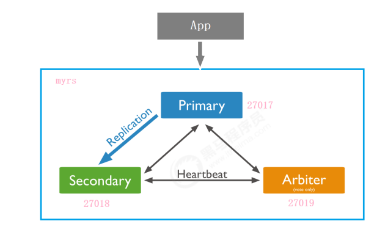

# 集群与安全

[TOC]

## 副本

副本集中的节点有两种类型：

- 主节点（Primary）
- 次节点（Secondaries）

节点分为三个角色：

- 主要成员（Primary）：接收所有写操作
- 副本成员（Replicate）：通过主从复制，维护相同的数据集
- 仲裁者（Arbiter）：不保留任何数据的副本，只具有投票选举作用。

下面我们来搭建一主一从一仲裁的结构

创建主节点 / 副本节点 / 仲裁节点

1. 建立数据和日志目录

   ~~~bash
   mkdir -p /mongodb/replica_sets/myrs_27017/log
   mkdir -p /mongodb/replica_sets/myrs_27017/data/db
   ~~~

2. 配置文件：

   ~~~yaml
   systemLog:
   	destination: file
       # 日志目录
       path: "/mongodb/replica_sets/myrs_27017/log/mongod.log"
       logAppend: true
   storage:	
       # 数据目录
       dbPath: "/mongodb/replica_sets/myrs_27017/data/db"
   processManagement:
   	# 后台运行
   	fork: true
       # PID文件
   	pidFilePath: "/mongodb/replica_sets/myrs_27017/log/mongod.pid"  
   net:
       bindIp: localhost,192.168.0.2
       port: 27017
   replication:
       #副本集的名称，主节点、副本节点、仲裁节点需要一致。
       replSetName: myrs
   ~~~

3. 启动各个节点

初始化节点集：

1. 通过客户端连接主节点

   ~~~bash
   mongo --host=180.76.159.126 --port=27017
   ~~~

2. 通过 `rs.initiate(configuration)` 来初始化副本集

   ~~~bash
   > rs.initiate()
   {
       "info2" : "no configuration specified. Using a default configuration forthe set",
       "me" : "180.76.159.126:27017",
       "ok" : 1,
       "operationTime" : Timestamp(1565760476, 1),
       "$clusterTime" : {
           "clusterTime" : Timestamp(1565760476, 1),
           "signature" : {
           	"hash" : BinData(0,"AAAAAAAAAAAAAAAAAAAAAAAAAAA="),
           	"keyId" : NumberLong(0)
           }
       }
   }
   myrs:SECONDARY>		# 这里输入一个回车，刷新下命令行，及时更新节点角色
   myrs:PRIMARY>
   ~~~

   通过 `rs.conf(configuration)` 返回当前副本集的配置，通过`rs.status()`查询副本集的状态。

3. 添加副本节点：

   ~~~bash
   rs.add(host, arbiterOnly)
   ~~~

   - host：指定要添加到副本集的新成员
   - arbiterOnly，类型为 Boolean， 如果为true，则添加的主机是仲裁者（不推荐）。

   ~~~bash
   rs.add("180.76.159.126:27018")
   ~~~

4. 添加仲裁节点

   ~~~bash
   rs.addArb(host)
   ~~~

默认情况下，副本节点是没有读写权限的，可以通过`rs.slaveOk(true)` 来承认自己是副本，从而获取到读权限。而仲裁节点是一定没有读写权限的。

当主节点下线后，MongoDB 会触发主节点选举。

|          | 投票权 | 选举权 |
| :------: | :----: | :----: |
| 仲裁节点 |   ✔️    |   ❌    |
|  主节点  |   ✔️    |   ✔️    |
| 副本节点 |   ✔️    |   ✔️    |

各个节点可以通过优先级来获得额外票数。默认情况下，主节点和副本节点的优先级的值是 1，即节点已经获得一票。修改优先级的步骤：

1. 先将配置导入cfg变量

   ~~~bash
   myrs:SECONDARY> cfg=rs.conf()
   ~~~

2. 然后修改值

   ~~~bash
   myrs:SECONDARY> cfg.members[1].priority=2
   ~~~

3. 重新加载配置

   ~~~bash
   myrs:SECONDARY> rs.reconfig(cfg)
   ~~~

当主节点检测不到多数节点，它会自动降级为副本节点。此时副本集不可写入数据了，已经故障了。

## 分片集群

MongoDB分片群集包含以下组件：

1. 分片（存储）
2. mongos（路由）
3. config servers：存放配置信息的

下面我们来搭建下面的分片集群。两个分片节点副本集（3+3）+ 一个配置节点副本集（3）+ 两个路由节点（2），共11个服务节点。

创建第一套副本集 / 第二套副本集 / 配置节点副本集

1. 准备存放数据和日志的目录

2. 新建或修改配置文件：

   ~~~yaml
   ...
   sharding:
       # 分片角色
       clusterRole: shardsvr
   ~~~

   一共有两个分片角色：

   1. configsvr：配置节点
   2. shardsvr：分片节点

然后启动这些副本集，并向副本集添加这些节点。

下面开始创建路由节点：

1. 准备存放数据和日志的目录

2. 新建或修改配置文件：

   ~~~yaml
   ...
   sharding:
   	configDB: ${配置集群的名称}/${所有的配置节点的IP}
   ~~~

3. 启动mongos：

   ~~~bash
   mongos -f /mongodb/sharded_cluster/mymongos_27017/mongos.conf
   ~~~

4. 添加分片：

   ~~~bash
   sh.addShard("${分片集群的名称}/${所有节点的IP}")
   ~~~

5. 移除分片

   ~~~bash
   use admin
   db.runCommand( { removeShard: "${分片集群的名称}" } )
   ~~~

   - 如果只剩下最后一个shard，是无法删除的
   - 移除时会自动转移分片数据

6. 开启分片功能

   ~~~bash
   sh.enableSharding("${库名}")
   sh.shardCollection(namespace, key, unique)
   ~~~

   - namespace 就是 `”<database>.<collection>“`

   - key 是**片键（Shard Key）**，它决定了在哪个字段上应用何种分片规则。

     ~~~bash
     # 使用 nickname 字段作为片键，根据它的哈希值进行数据分片
     mongos> sh.shardCollection("articledb.comment",{"nickname":"hashed"})
     
     # 使用 age 字段作为片键，按照范围进行数据分片
     # MongoDB默认是每分钟检查一次是否需要进行分片的，即均衡（balancing），将部分数据移动到其他分片。
     sh.shardCollection("articledb.author",{"age":1})
     ~~~

     - 一个集合只能指定一个片键，否则报错。
     - 一旦对一个集合分片，片键就不可改变。

