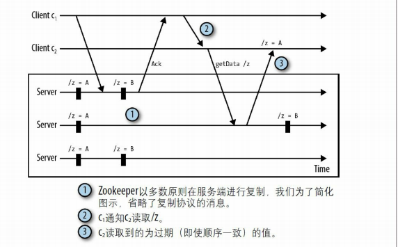
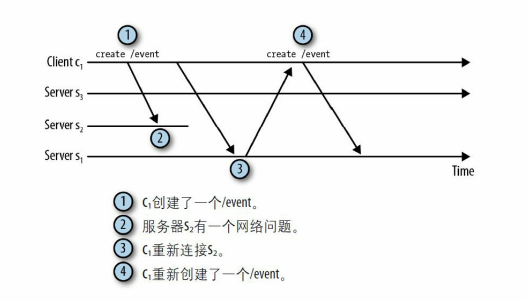
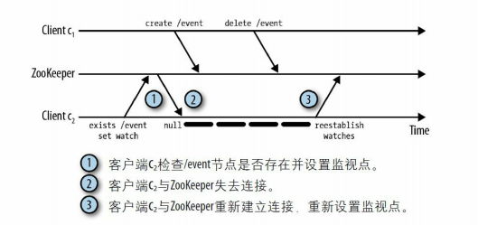
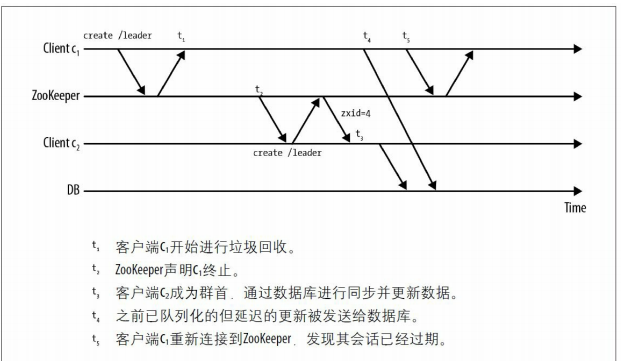

# 开发

## 基本操作

每个 API 调用都需要 Zookeeper 句柄，它表示客户端与 ZooKeeper 服务端之间的一个会话。 ZooKeeper 句柄的构造函数如下：

~~~java
ZooKeeper(
	String connectString,
	int sessionTimeout,
	Watcher watcher)
~~~

- connectString：指定 Zookeeper 的主机名和端口
- sessionTimeout：以毫秒为单位，设置会话超时时间
- watcher：用于接收会话事件

Wacher 接口可以监控会话状态，也可以监控节点的变化，它的定义如下：

~~~java
public interface Watcher {
	void process(WatchedEvent event);
}
~~~

下面给出一个使用示例：

~~~java
public class Master implements Watcher {
    ZooKeeper zk;
    String hostPort;
    
    Master(String hostPort) {
        this.hostPort = hostPort;
    }
    
    void startZK() {
        zk = new ZooKeeper(hostPort, 15000, this);
    }
    
    public void process(WatchedEvent e) {
        System.out.println(e);
    }
    public static void main(String args[])
        throws Exception {
        Master m = new Master(args[0]);
        m.startZK();
    }
}
~~~

当客户端与服务端连接断开时，客户端的 Watcher 会收到 Disconnected 事件。此时，千万不要立即重新创建 ZooKeeper 句柄，来重新连接服务。因为 ZooKeeper 客户端库会自己负责重新连接服务，之后你应该会接收到 SyncConnected 事件。

创建一个节点：

~~~java
zk.create("/master",
	serverId.getBytes(),
	OPEN_ACL_UNSAFE,
	CreateMode.EPHEMERAL);
~~~

这里常量 `ZooDefs.Ids.OPEN_ACL_UNSAFE` 给所有用户授权了所有权限。ZooKeeper 通过插件式认证方法，为每个节点提供了 ACL 策略功能。即限制某个用户对某个 znode 节点的哪些权限。

create 方法会抛出两种异常：

- `KeeperException`
- `InterruptedException`

在 Zookeeper 提供的 API 中，有同步与异步两个版本。以下为 create 方法的异步调用版本

~~~java
void create(
    String path,
	byte[] data,
	List<ACL> acl,
	CreateMode createMode,
	AsyncCallback.StringCallback cb,
	Object ctx)
~~~

- cb：提供回调方法的对象。该对象只需实现以下方法：

  ~~~java
  void processResult(int rc, String path, Object ctx, String name)
  ~~~

  - rc：返回 OK 或 KeeperException 等异常对应的编码值。
  - name：znode 节点的名称。在 `CreateMode.SEQUENTIAL` 模式下，name 与 path 不相等。

- ctx：上下文信息，会传入到回调方法中

注意：只有一个线程来处理回调调用。避免在回调函数中使用同步阻塞方法。StringCallback 对象的使用示例：

~~~java
static StringCallback masterCreateCallback = new StringCallback() {
    void processResult(int rc, String path, Object ctx, String name) {
        switch(Code.get(rc)) {
            case CONNECTIONLOSS:
                //... 
            case OK:
                //... 
            case NONODE:
        }
    }
};
~~~

注意到，对于连接断开等异常情况，同步方法直接抛出异常，而异步方法返回错误码。

获取数据：

~~~java
byte[] getData(
	String path,
	bool watch,
	Stat stat)
~~~

- path：指定从中获取数据的节点
- watch：是否想要监听后续的数据变更。如果设置为 true，那么我们可以通过创建 ZooKeeper 句柄时所设置的 Watcher 对象得到事件
- stat：该方法会向其填充 znode 节点的元数据

## 监控

一个应用在接收到通知后，注册另一个监视点时，可能会丢失事件。但这通常不是问题，因为我们可以通过读取操作，即获取最新的状态，又设置一个新的监控点。此外，在连接断开的情况下触发的 watcher 也是会丢失的。

客户端设置的每个监视点与会话关联，如果会话过期，等待中的监视点将会被删除。然而监控点是可以跨越不同的服务端连接。

可以注册 watcher 的方法：getData、exists、getChildren。 可以触发 watcher 的方法：create、delete、setData。

getData、exists、getChildren 的参数 watch 可以是以下两个类型：

- bool：如果设置为 true，那么就设立监控点，并在触发时，调用 ZooKeeper 句柄上注册的 Watcher
- Watcher：如果提供了该对象，那么就设立监控点，并在触发时，调用这个 Watcher

我们只需覆写 Watcher 接口类中的 process 方法，即可监听事件：

~~~java
public void process(WatchedEvent event);
~~~

WatchedEvent 对象包括以下字段：

- ZooKeeper会话状态（KeeperState）：Disconnected、SyncConnected、AuthFailed、ConnectedReadOnly、SaslAuthenticated 和 Expired
- 事件类型（EventType）：NodeCreated、NodeDeleted、NodeDataChanged、NodeChildrenChanged 和 None
- 除 None 事件类型外，都会返回 znode 路径

一旦设置监视点，就无法主动移除。只能通过以下两个方法来移除：

- 触发这个监视点
- 关闭会话

写操作与ZK内部产生的事件的对应关系：

|                        | event For “/path”             | event For “/path/child”   |
| :--------------------- | :---------------------------- | :------------------------ |
| create(“/path”)        | EventType.NodeCreated         | 无                        |
| delete(“/path”)        | EventType.NodeDeleted         | 无                        |
| setData(“/path”)       | EventType.NodeDataChanged     | 无                        |
| create(“/path/child”)  | EventType.NodeChildrenChanged | EventType.NodeCreated     |
| delete(“/path/child”)  | EventType.NodeChildrenChanged | EventType.NodeDeleted     |
| setData(“/path/child”) | 无                            | EventType.NodeDataChanged |

写操作与 watcher 的对应关系：

|                        | “/path” |         |             | “/path/child” |         |             |
| :--------------------- | :------ | :------ | :---------- | :------------ | :------ | :---------- |
|                        | exists  | getData | getChildren | exists        | getData | getChildren |
| create(“/path”)        | √       | √       |             |               |         |             |
| delete(“/path”)        | √       | √       | √           |               |         |             |
| setData(“/path”)       | √       | √       |             |               |         |             |
| create(“/path/child”)  |         |         | √           | √             | √       |             |
| delete(“/path/child”)  |         |         | √           | √             | √       | √           |
| setData(“/path/child”) |         |         |             | √             | √       |             |

**值得注意的是：getChildren(“/path”) 监视 /path 的子节点，如果 /path 自己删了，也会触发 NodeDeleted 事件。**

**exist 方法可以监控不存在的节点**。

根据YourKit（http://www.yourkit.com/ ）的分析工具所分析，设置一个监视点，会使服务端在内存消耗上增加大约 250 到 300 个字节，

此外，还需要关注监控点的羊群效应。即一个 znode 节点上有多个监控点，这样当该 znode 节点发生变化后，就会触发大量的监控通知。消耗网络资源。

## Multiop

Multiop 可以原子性地执行多个 ZooKeeper 的操作，即在 multiop 代码块中的所有操作要么全部成功，要么全部失败。

使用示例：

~~~java
Op deleteZnode(String z) {
    // 为 delete 方法创建 Op 对象
    return Op.delete(z, -1);
}

List<OpResult> results = zk.multi(
    Arrays.asList(deleteZnode("/a/b"),
                  deleteZnode("/a"));
~~~

每个 Op 操作都有对应的结果类型。例如，对于 delete 操作，它的结果类型是 DeleteResult 类，该类继承自 OpResult。

multi 方法同样也有异步版本：

~~~java
public List<OpResult> multi(Iterable<Op> ops) throws InterruptedException, KeeperException;
public void multi(Iterable<Op> ops, MultiCallback cb, Object ctx);
~~~

Transaction 封装了 multi 方法，提供了简单的接口：

~~~java
Transaction t = new Transaction();
t.delete("/a/b", -1);
t.delete("/a", -1);
List<OpResult> results = t.commit();
~~~

commit 方法同样也有一个异步版本的方法

~~~java
public void commit(MultiCallback cb, Object ctx);
~~~

此外，Multiop 还提供了 check 方法，与 setData 方法类似，只是没用 data 参数，用于检查节点的版本号。如果节点的版本号与 version 参数不一致，那么调用会失败。

~~~java
public static Op check(String path, int version);
~~~

值得注意的是，如果在 Multiop 中的某个操作上设置了 Watch，那么当这个操作被执行时，客户端就会收到一个通知。也就是说，Watch 并不受原子性的约束。

## 顺序

写操作的顺序：各个服务端节点要对状态变化的顺序达成一致，并使用相同的顺序执行状态的更新。

读操作的顺序：ZooKeeper 客户端总是会观察到相同的更新顺序，即使它们连接到不同的服务端上（这是由之前介绍过的 zxid 来保证的）。但是各个客户端可能是在不同时间观察到了更新。

让我们考虑以下场景：

1. 客户端 c1 更新了 /z 节点的数据，并收到应答
2. 客户端 c1 通过 TCP 连接告知客户端 c2 ，/z 节点状态发生了变化
3. 客户端 c2 读取 /z 节点的状态，但是在 c1 更新之前就观察到了这个状态。

为 ZooKeeper 并不知道客户端之间额外的通信。这被称为**隐藏通道（hidden channel）**。为了避免读取到过去的数据，我们建议对于所有涉及到 ZooKeeper 状态的通信，一律在 Zookeeper 中完成。（Zookeeper 保证的是顺序一致性）

sync 方法可以在一定程度上解决隐藏通道的问题。它保证 client 当前连接着的ZooKeeper 服务器，和 ZooKeeper 的 Leader 节点同步（sync）一下数据。这样就可以避免读到过期数据了。

~~~java
zk.sync(path, voidCb, ctx);
// 在获取数据前，调用 sync
zk.getData(path, watcher, dataCb, ctx);
~~~

其实这里面有一个隐含的逻辑，就是如果 leader 和 follower 之间的消息通信，是严格按顺序来发送的（TCP保证），因此，当 follower 接收到 Leader.SYNC 消息时，说明 follower 也一定接收到了 leader 之前（在 leader 接收到 sync 请求之前）发送的所有提案或者commit 消息。这样，就可以确保 follower 和 leader 是同步的了。

## 故障

由于网络分区而导致客户端与服务端短暂地断开，当客户端重新连接时，需要考虑以下事情：

1. 在提交 create 操作后，连接断开，此时我们无法获知节点是否创建成功。因此，在重连之后，需要执行 exist 操作来判断。

   

2. 客户端在失联期间，丢失节点的状态变更，所以客户端仍持有旧的状态。例如，因网络分区导致的脑裂问题

3. 当客户端连接服务端后，它会发送监视点列表和最后已知的 zxid。如果任何已经监视的 znode 节点的修改时间戳，晚于最后已知的zxid，那么服务器就会触发这个监视点。但这仍会丢失监控事件的情况，以下面例子说明：

   

   这种情况是无法解决的。

对于情况（2），我们补充更多的案例。考虑以下情况：

1. 程序使用 ZooKeeper 作为资源中心化管理方案，进程通过 Zookeeper 完成对外部资源的操作
2. 由于时钟偏移或者垃圾回收导致的冻结，Zookeeper 误认为 c1 已断开，从而终止会话。然而 c1 已经准备好执行对外部资源的更新
3. Zookeeper 选举 c2 作为主节点，然后 c2 更新了外部资源
4. c1 又对外部资源做了更新。此时，系统的状态已被损坏。
5. c1 已重新连接，发现会话已过期，但是更新操作已发生，无法撤销。

这种问题可以使用「隔离」技巧来解决。我们在创建节点时，获取 czxid，即创建该节点时的 zxid。当我们对外部资源进行请求时，提供该 czxid。如果外部资源已接收到更大的 czxid，那么就拒绝这次更新请求。

我们再来看一个因连接断开而导致的操作顺序问题。

1. 提交请求，执行 Op1 操作
2. 检测到连接丢失，取消了 Op1 操作的请求。
3. 在会话过期前重新连接。
4. 提交请求，执行 Op2 操作。
5. Op2 执行成功
6. Op1 返回 CONNECTIONLOSS 事件，重新提交 Op1 操作请求

如果 Op1 与 Op2 之间存在着依赖关系，那么上述情况就打破了这种关系。究其原因是因为 Op1 与 Op2 的提交请求是并行化的，我们仅需将其提交请求串行化即可，即在确认 Op1 执行成功后，再提交 Op2 操作请求。

总结起来就是，在连接丢失的情况下，应用程序只能依赖客户端库来解决所有后续恢复操作，而不能依赖 ZooKeeper 来承担这些恢复操作。

由于认证失败或者会话过期，Zookeeper 必须关闭会话，这是不可恢复的故障。处理这种情况最简单的方式就是重新建立新的会话，同时清除与旧会话关联的状态信息。

## Curator

Curator 是 ZooKeeper API 的高级封装库，它提供了锁（lock）、屏障（barrier）、缓存（cache）这些原语，以及支持 fluent 式编程风格（链式调用）。

~~~java
CuratorFramework zkc =
CuratorFrameworkFactory.newClient(connectString, retryPolicy);

zkc.create()
    .withMode(CreateMode.PERSISTENT)
    .forPath("/mypath", new byte[0]);

// 对于异步的执行方法，我们只需要增加 inBackground
zkc.create()
    .inBackground()
    .withMode(CreateMode.PERSISTENT)
    .forPath("/mypath",new byte[0]);

// 为了设置监视点，我们只需要增加 watched
zkc.getData()
    .inBackground()
    .watched()
    .forPath("/mypath");
~~~

