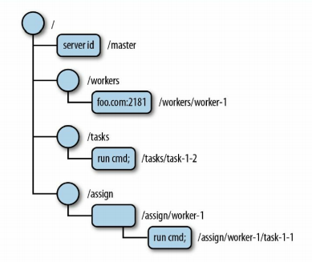
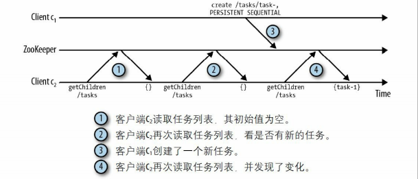
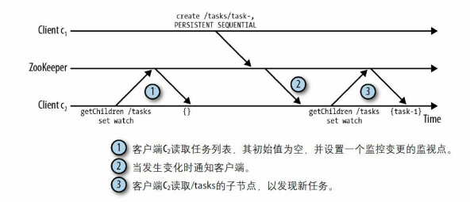
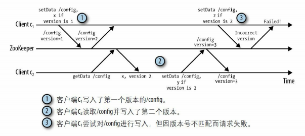
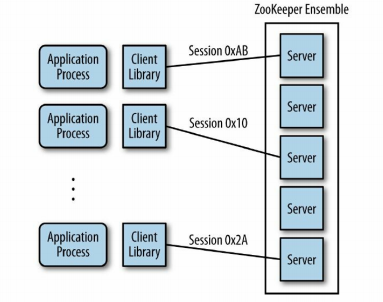
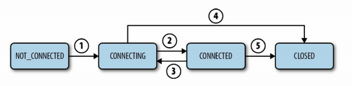
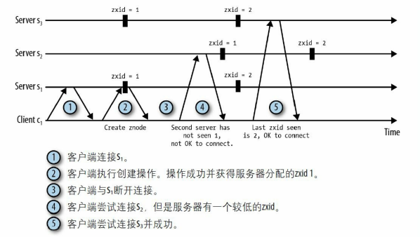

# 概述

Zookeeper 的设计目标是将复杂且容易出错的任务协作逻辑封装起来，构成一个高效可靠的原语集，并以一系列简单易用的接口提供给用户使用，用户在这些接口的基础上，可以构建应用自己的原语。基于它可以实现诸如数据发布/订阅、负载均衡、命名服务、分布式协调/通知、集群管理、Master 选举、分布式锁和分布式队列等功能。

**Zookeeper 保证的是顺序一致性**

ZooKeeper 所操作的对象是类似于文件系统的层级树状结构，每个节点被称为 znode

注：框里的内容表示该 znode 所存储的数据。

znode 里保存的是字节序列，它并不提供序列化的能力。序列化这项工作由应用来处理。ZooKeeper 的 API 暴露了以下方法：

- `create /path data`：创建一个路径为 /path 的 znode，并包含数据 data
- `delete /path`：删除 /path 节点，它只能删除不包含子节点的节点
- `exists /path`：检查是否存在 /path 节点。
- `setData /path data`：将 /path 节点的数据设置为data。
- `getData /path`：返回 /path 节点的数据
- `getChildren /path`：返回 /path 节点下所有子节点

注意，zookeeper 并不支持部分读写 znode 下的数据

znode 的类型有：

- **持久（persistent）节点**：该节点只能被 delete API 删除

- **临时（ephemeral）节点**：在以下两种情况下将会被删除

  - 当创建该 znode 的客户端的会话关闭时
  - 当某个客户端（不一定是创建者）主动删除该节点

  不允许临时节点下拥有子节点

- **有序（sequential）节点**：一个持久节点可以设置为有序的。有序 znode 节点会被分配唯一个单调递增的整数，该整数会追加到路径后。此外，递增整数是针对该目录（父节点）下的，而不是全局的。

- **临时有序（ephemeral_sequential）**

为了避免客户端轮询操作所带来的性能消耗（见下图），我们可以使用通知（notification）机制。

客户端向 ZooKeeper 注册需要监听的 znode。监视点是一个单次触发的操作，为了在同一个节点上多次监听，客户端必须在每次通知后设置一个新的监视点。

关于监控的更多细节，我们留在 Watcher 小节中讲解。

每一个 znode 都有一个版本号，它随着每次数据变化而自增。在调用 setData 或者 delete 时，需要传入一个版本号。如果该版本号与服务器上的版本号不一致，那么调用失败。当 znode 节点重新创建时，版本号会被重置

ZooKeeper 架构总览

这里服务端采用无主复制中的基于 Quorum 的数据冗余机制。

ZooKeeper 的安装（独立模式）

1. 从 http://zookeeper.apache.org 中下载压缩包
2. 解压 `tar -xvzf zookeeper-3.4.5.tar.gz`
3. 重命名配置文件：`mv conf/zoo_sample.cfg conf/zoo.cfg`
4. 启动服务器：`bin/zkServer.sh start`

客户端可以通过 `bin/zkCli.sh` 脚本工具来与服务端进行交互。下面介绍如何搭建一个 ZooKeeper 集群（仲裁模式）

1. 每一个节点的配置文件如下：

   ~~~shell
   tickTime=2000
   initLimit=10
   syncLimit=5
   dataDir=./data
   clientPort=2181
   server.1=127.0.0.1:2222:2223
   server.2=127.0.0.1:3333:3334
   server.3=127.0.0.1:4444:4445
   ~~~

   这里解释一下：server.n=ip:port1:port2：

   - n 是 Zookeeper 服务节点的编号
   - port1：仲裁通信的端口
   - port2：选主的端口

2. 在每个节点的 dataDir 目录下创建 myid 文件，里面只有一个整数，表示该节点的编号

使用 zkCli.sh 来访问集群：

~~~shell
/bin/zkCli.sh -server 127.0.0.1:2181,127.0.0.1:2182,127.0.0.1:2183
~~~

客户端的会话生命周期：

如果一个客户端与服务器因超时而断开连接，客户端仍然保持 CONNECTING 状态，直到分区问题修复，客户端才能从服务端那里获知会话已经 CLOSED。发生这种行为是因为 ZooKeeper 集合对会话超时负责，而不是由客户端负责。

如果经过时间 t 之后，服务接收不到这个会话的任何消息，服务就会声明会话过期。而在客户端侧，如果经过 t/3 的时间后未收到任何消息，客户端将向服务器发送心跳消息。在经过 2t/3 时间后仍未收到消息，ZooKeeper 客户端开始寻找其他的服务器，而此时它还有 t/3 时间去寻找。

当客户端尝试连接到一个不同的服务器时，这个服务器的 ZooKeeper 状态要比最后连接的服务器的ZooKeeper状态新。也就是说，如果一个客户端在位置 i 观察到一个更新，它就不能连接到观察到 i'<i 的服务器上。这点可以通过 zxid 事务标识符来实现。

zxid 是一个全局递增的整数，每当一个操作完成后，zxid 就会递增。每个 zookeeper 服务器实例维护一个本地的 zxid，当操作同步完成后，本地 zkid 也会相应地递增。

ZooKeeper客户端与服务端通信的线程模型主要由三个队列和两个线程组成，三个队列分别为：

- 待发送消息队列（`OutgoingQueue`）
- 已发送等待响应的队列（`PendingQueue`）
- 事件队列（`EventQueue`）

两个线程分别为：

- 消息发送线程
- 事件处理线程

现在考虑这样一个情景：异步提交两个请求 Aop1，Aop2。在 Aop1 的回调函数中调用同步方法 Sop1。这样期望的发送顺序是 Aop1、Aop2、Sop1，但是操作结果顺序却不一定。假设 Aop1 先执行完成，客户端就会发送 Sop1 同步请求，这会阻塞事件处理线程，导致 Aop2 的结果被阻塞，直到接收到 Sop1 的结果。因此程序观察到的操作结果顺序为 Aop1、Sop1、Aop2。
