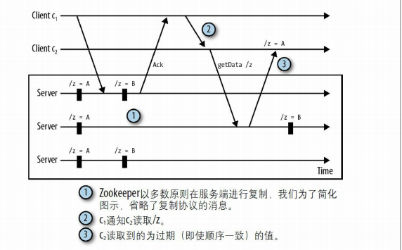
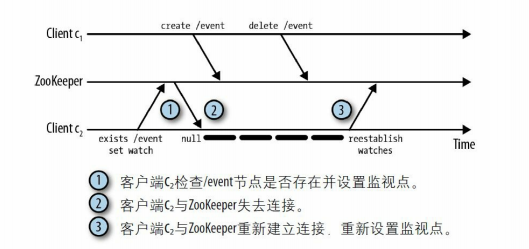
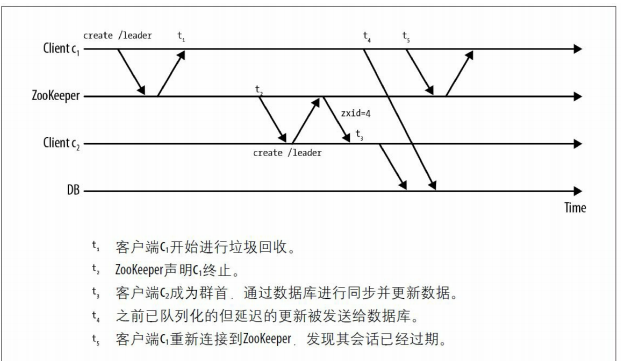

# 概述

[TOC]

Zookeeper 的设计目标是将复杂且容易出错的任务协作逻辑封装起来，构成一个高效可靠的原语集，并以一系列简单易用的接口提供给用户使用，用户在这些接口的基础上，可以构建应用自己的原语。基于它可以实现诸如数据发布/订阅、负载均衡、命名服务、分布式协调/通知、集群管理、Master 选举、分布式锁和分布式队列等功能。

## 安装

ZooKeeper 的安装（独立模式）

1. 从 http://zookeeper.apache.org 中下载压缩包
2. 解压 `tar -xvzf zookeeper-3.4.5.tar.gz`
3. 重命名配置文件：`mv conf/zoo_sample.cfg conf/zoo.cfg`
4. 启动服务器：`bin/zkServer.sh start`

客户端可以通过 `bin/zkCli.sh` 脚本工具来与服务端进行交互。下面介绍如何搭建一个 ZooKeeper 集群（仲裁模式）

1. 每一个节点的配置文件如下：

   ~~~shell
   tickTime=2000
   initLimit=10
   syncLimit=5
   dataDir=/root/zookeeper/data
   clientPort=2181
   server.2=114.116.204.34:2888:3888
   server.4=122.9.36.231:2888:3888
   server.6=116.63.9.166:2888:3888
   ~~~

   这里解释一下：server.n=ip:port1:port2：

   - n 是 Zookeeper 服务节点的编号
   - port1：仲裁通信的端口
   - port2：选主的端口

2. 在每个节点的 dataDir 目录下创建 myid 文件，里面只有一个整数，表示该节点的编号

1. 后台启动 ZK 服务: zkServer.sh start
2. 查看 ZK 服务状态: zkServer.sh status
3. 停止 ZK 服务: zkServer.sh stop
4. 重启 ZK 服务: zkServer.sh restart

使用 zkCli.sh 来访问集群：

~~~shell
bin/zkCli.sh -server 127.0.0.1:2181,127.0.0.1:2182,127.0.0.1:2183
~~~

它会从中随机选一个服务、端口来建立连接。如果连接在之后断开，客户端会从字符串中选择下一个服务器，继续尝试连接。

## Znode

ZooKeeper 所操作的对象是类似于文件系统的层级树状结构，每个节点被称为 znode

注：框里的内容表示该 znode 所存储的数据。

znode 里保存的是字节序列，它并不提供序列化的能力。序列化这项工作由应用来处理。ZooKeeper 的 API 暴露了以下方法：

- `create /path data`：创建一个路径为 /path 的 znode，并包含数据 data
- `delete /path`：删除 /path 节点，它只能删除不包含子节点的节点
- `exists /path`：检查是否存在 /path 节点。
- `setData /path data`：将 /path 节点的数据设置为data。
- `getData /path`：返回 /path 节点的数据
- `getChildren /path`：返回 /path 节点下所有子节点

注意，zookeeper 并不支持**部分**读写 znode 下的数据

znode 的类型有：

- **持久（persistent）节点**：该节点的生命周期不依赖于会话，并且只有在客户端显式执行删除操作的时候，它们才能被删除。

- **临时（ephemeral）节点**：在以下两种情况下将会被删除

  - 当创建该 znode 的客户端的会话关闭时
  - 当某个客户端（不一定是创建者）主动删除该节点

  不允许临时节点下拥有子节点

- **有序（sequential）节点**：一个持久节点可以设置为有序的。有序 znode 节点会被分配唯一个单调递增的整数，该整数会追加到路径后。此外，递增整数是针对该目录（父节点）下的，而不是全局的。

- **临时有序（ephemeral_sequential）**

ZNode 的数据结构如下（这里的子节点都是直接子节点）：

- `czxid`：创建数据节点时的事务 ID
- `ctime`：创建数据节点时的时间
- `mzxid`：最后一次修改数据节点时的事务 ID
- `mtime`：最后一次修改数据节点时的时间
- `pzxid`：表示该数据节点的子节点列表最后一次修改的事务 ID，添加子节点或删除子节点就会影响子节点列表，但是修改子节点的数据内容则不影响该 ID
- `cversion`：子节点版本号（子节点的更改次数），子节点每次修改版本号加1；
- `dataVersion`：数据版本号（节点数据的更改次数），数据每次修改该版本号加1；
- `aclVersion`：权限版本号（节点的 ACL 的更改次数），权限每次修改该版本号加1；
- `ephemeralOwner`：创建该临时节点的会话 sessionID，如果该节点是持久节点，那么这个属性值为 0
- `dataLength`：节点的数据长度
- `numChildren`：节点拥有子节点的数量

每一个 znode 都有一个版本号，它随着每次数据变化而自增。在调用 setData 或者 delete 时，需要传入一个版本号。如果该版本号与服务器上的版本号不一致，那么调用失败。当 znode 节点重新创建时，版本号会被重置。

## ACL

ACL（Access Control List）用于控制 ZNode 的相关权限。它包括：

- `Scheme` 代表了一种权限模式，有以下5种类型：
  - **world**：所有人都可以访问
  - **digest**：通过用户名+密码进行认证
  - **ip** ：只允许某些特定的 IP 访问
  - **auth**：允许授权的用户进行访问
  - **X509**：通过客户端的证书进行认证
- `PerMissions`：
  - **CREATE** 创建节点
  - **READ** 获取节点或列出其子节点
  - **WRITE** 能设置节点的数据
  - **DELETE** 能够删除子节点
  - **ADMIN** 能够设置权限
- `ID`：保存一些认证信息

例子：

~~~shell
$ setAcl /runoob/child01 digest:user1:HYGa7IZRm2PUBFiFFu8xY2pPP/s=:cdra
$ setAcl /runoob/child world:anyone:crwa
$ setAcl /runoob/child auth:user1:cdrwa
$ setAcl /runoob/ip ip:192.168.3.7:cdrwa
~~~

## 架构

Zookeeper 采用的基于主从的**读写分离**架构。如果 Follower 节点接收到了写请求，会将该请求转发给 Leader 节点处理，Follower 节点自身是不会处理写请求的。同时它的数据同步机制是采用无主复制中的 Quorum 。

Zookeeper 会保证消息的**顺序一致性**。这是通过 zxid 来实现的，它由两部分组成：

- epoch：Leader 发生变更时会自增
- counter：当接收到请求时会自增

每当一个操作完成后，zxid 就会递增。每个 zookeeper 服务器实例维护一个本地的 zxid，当操作同步完成后，本地 zkid 也会相应地递增。

ZAB 协议是一种**支持崩溃恢复**的的**原子广播**协议，用于在 Zookeeper 之间传递消息，使所有的节点都保持同步。ZAB 协议将Zookeeper 集群中的节点划分成了三个角色，分别是 **Leader**、**Follower **和 **Observer**。Observer 与 Follower 都为 Zookeeper 提供了横向扩展的能力。但在选举过程中，Observer**不参与投票**。

## Watch

为了避免客户端轮询操作所带来的性能消耗（见下图），我们可以使用通知（notification）机制。

客户端向 ZooKeeper 注册需要监听的 znode。监视点是一个单次触发的操作，为了在同一个节点上多次监听，客户端必须在每次通知后设置一个新的监视点。

Zookeeper 3.6.0 版本新增了 **永久性Watch**，在被触发之后，仍然保留。一次性的Watch可以在调用`getData()`、`getChildren()`和`exists()`等方法时在参数中进行设置，永久性的Watch则需要调用`addWatch()`来实现。

一次性 Watch 存在着事件丢失的问题。在 Watch 触发的事件到达客户端、再到客户端设立新的 Watch 之间，是有一个时间间隔的。而如果在这个时间间隔中发生的变更，客户端则无法感知。

客户端设置的每个监视点与会话关联，如果会话过期，等待中的监视点将会被删除。然而**监控点是可以跨越不同的服务端连接**，也就是说，当客户端连接到不同的服务器实例时，它的未触发的监控点仍会被保留。

可以注册 watcher 的方法：getData、exists、getChildren。 可以触发 watcher 的方法：create、delete、setData。

getData、exists、getChildren 的参数 watch 可以是以下两个类型：

- bool：如果设置为 true，那么就设立监控点，并在触发时，调用 ZooKeeper 句柄上注册的 Watcher
- Watcher：如果提供了该对象，那么就设立监控点，并在触发时，调用这个 Watcher

我们只需覆写 Watcher 接口类中的 process 方法，即可监听事件：

~~~java
public void process(WatchedEvent event);
~~~

WatchedEvent 对象包括以下字段：

- ZooKeeper会话状态（KeeperState）：Disconnected、SyncConnected、AuthFailed、ConnectedReadOnly、SaslAuthenticated 和 Expired
- 事件类型（EventType）：NodeCreated、NodeDeleted、NodeDataChanged、NodeChildrenChanged 和 None
- 除 None 事件类型外，都会返回 znode 路径

一旦设置监视点，就无法主动移除。只能通过以下两个方法来移除：

- 触发这个监视点
- 关闭会话

写操作与 ZK 内部产生的事件的对应关系：

|                        | event For “/path”             | event For “/path/child”   |
| :--------------------- | :---------------------------- | :------------------------ |
| create(“/path”)        | EventType.NodeCreated         | 无                        |
| delete(“/path”)        | EventType.NodeDeleted         | 无                        |
| setData(“/path”)       | EventType.NodeDataChanged     | 无                        |
| create(“/path/child”)  | EventType.NodeChildrenChanged | EventType.NodeCreated     |
| delete(“/path/child”)  | EventType.NodeChildrenChanged | EventType.NodeDeleted     |
| setData(“/path/child”) | 无                            | EventType.NodeDataChanged |

写操作与 watcher 的对应关系：

|                        | “/path” |         |             | “/path/child” |         |             |
| :--------------------- | :------ | :------ | :---------- | :------------ | :------ | :---------- |
|                        | exists  | getData | getChildren | exists        | getData | getChildren |
| create(“/path”)        | √       | √       |             |               |         |             |
| delete(“/path”)        | √       | √       | √           |               |         |             |
| setData(“/path”)       | √       | √       |             |               |         |             |
| create(“/path/child”)  |         |         | √           | √             | √       |             |
| delete(“/path/child”)  |         |         | √           | √             | √       | √           |
| setData(“/path/child”) |         |         |             | √             | √       |             |

**值得注意的是：**

- getChildren(“/path”) 监视 /path 的子节点，如果 /path 自己删了，也会触发 NodeDeleted 事件。

- exist 方法可以监控不存在的节点。

  

根据 YourKit（http://www.yourkit.com/ ）的分析工具所分析，设置一个监视点，会使服务端在内存消耗上增加大约 250 到 300 个字节，

此外，还需要关注监控点的羊群效应。即一个 znode 节点上有多个监控点，这样当该 znode 节点发生变化后，就会触发大量的监控通知。消耗网络资源。

## Session

客户端的会话生命周期：

如果一个客户端与服务器因超时而断开连接，客户端仍然保持 CONNECTING 状态，直到分区问题修复，客户端才能从服务端那里获知会话已经 CLOSED。

如果经过时间 t 之后，服务接收不到这个会话的任何消息，服务就会声明会话过期。而在客户端侧，如果经过 t/3 的时间后未收到任何消息，客户端将向服务器发送心跳消息。在经过 2t/3 时间后仍未收到消息，ZooKeeper 客户端开始寻找其他的服务器，而此时它还有 t/3 时间去寻找。

当客户端尝试连接到一个不同的服务器时，这个服务器的 ZooKeeper 状态要比最后连接的服务器的 ZooKeeper 状态新（顺序一致性）。也就是说，如果一个客户端在位置 i 观察到一个更新，它就不能连接到观察到 i'<i 的服务器上。这点可以通过 zxid 事务标识符来实现。

ZooKeeper 客户端与服务端通信的线程模型主要由三个队列和两个线程组成，三个队列分别为：

- 待发送消息队列（`OutgoingQueue`）
- 已发送等待响应的队列（`PendingQueue`）
- 事件队列（`EventQueue`）

两个线程分别为：

- 消息发送线程
- 事件处理线程

现在考虑这样一个情景：异步提交两个请求 Aop1，Aop2。在 Aop1 的回调函数中调用同步方法 Sop1。这样期望的发送顺序是 Aop1、Aop2、Sop1，但是操作结果顺序却不一定。假设 Aop1 先执行完成，客户端就会发送 Sop1 同步请求，这会阻塞事件处理线程，导致 Aop2 的结果被阻塞，直到接收到 Sop1 的结果。因此程序观察到的操作结果顺序为 Aop1、Sop1、Aop2。

## 基本操作

每个 API 调用都需要 Zookeeper 句柄，它表示客户端与 ZooKeeper 服务端之间的一个会话。 ZooKeeper 句柄的构造函数如下：

~~~java
ZooKeeper(
	String connectString,
	int sessionTimeout,
	Watcher watcher)
~~~

- `connectString`：指定 Zookeeper 的主机名和端口
- `sessionTimeout`：以毫秒为单位，设置会话超时时间
- `watcher`：用于接收会话事件

Wacher 接口可以监控会话状态，也可以监控节点的变化，它的定义如下：

~~~java
public interface Watcher {
	void process(WatchedEvent event);
}
~~~

下面给出一个使用示例：

~~~java
public class Master implements Watcher {
    ZooKeeper zk;
    String hostPort;
    
    Master(String hostPort) {
        this.hostPort = hostPort;
    }
    
    void startZK() {
        zk = new ZooKeeper(hostPort, 15000, this);
    }
    
    public void process(WatchedEvent e) {
        System.out.println(e);
    }
    
    public static void main(String args[])
        throws Exception {
        Master m = new Master(args[0]);
        m.startZK();
    }
}
~~~

当客户端与服务端连接断开时，客户端的 Watcher 会收到 Disconnected 事件。此时，千万不要立即重新创建 ZooKeeper 句柄，来重新连接服务。因为 ZooKeeper 客户端库会自己负责重新连接服务，之后你应该会接收到 SyncConnected 事件。

使用 create 方法来创建一个节点：

~~~java
zk.create("/master",
	serverId.getBytes(),
	OPEN_ACL_UNSAFE,
	CreateMode.EPHEMERAL);
~~~

Zookeeper 保证在任何时刻，只有一个客户端的创建请求会成功，即使多个客户端同时尝试创建同一个节点。

这里常量 `ZooDefs.Ids.OPEN_ACL_UNSAFE` 给所有用户授权了所有权限。ZooKeeper 通过插件式认证方法，为每个节点提供了 ACL 策略功能。即限制某个用户对某个 znode 节点的哪些权限。而 create 方法会抛出两种异常：

- `KeeperException`
- `InterruptedException`

在 Zookeeper 提供的 API 中，有同步与异步两个版本。以下为 create 方法的异步调用版本

~~~java
void create(
    String path,
	byte[] data,
	List<ACL> acl,
	CreateMode createMode,
	AsyncCallback.StringCallback cb,
	Object ctx)
~~~

- cb：提供回调方法的对象。该对象只需实现以下方法：

  ~~~java
  void processResult(int rc, String path, Object ctx, String name)
  ~~~

  - rc：返回 OK 或 KeeperException 等异常对应的编码值。
  - name：znode 节点的名称。在 `CreateMode.SEQUENTIAL` 模式下，name 与 path 不相等。

- ctx：上下文信息，会传入到回调方法中

注意：只有一个线程来处理回调调用。避免在回调函数中使用同步阻塞方法。StringCallback 对象的使用示例：

~~~java
static StringCallback masterCreateCallback = new StringCallback() {
    void processResult(int rc, String path, Object ctx, String name) {
        switch(Code.get(rc)) {
            case CONNECTIONLOSS:
                //... 
            case OK:
                //... 
            case NONODE:
        }
    }
};
~~~

注意到，对于连接断开等异常情况，同步方法直接抛出异常，而异步方法返回错误码。

获取数据：

~~~java
byte[] getData(
	String path,
	bool watch,
	Stat stat)
~~~

- path：指定从中获取数据的节点
- watch：是否想要监听后续的数据变更。如果设置为 true，那么我们可以通过创建 ZooKeeper 句柄时所设置的 Watcher 对象得到事件
- stat：该方法会向其填充 znode 节点的元数据

## Multiop

Multiop 可以原子性地执行多个 ZooKeeper 的操作，即在 multiop 代码块中的所有操作要么全部成功，要么全部失败。

使用示例：

~~~java
Op deleteZnode(String z) {
    // 为 delete 方法创建 Op 对象
    return Op.delete(z, -1);
}

List<OpResult> results = zk.multi(
    Arrays.asList(deleteZnode("/a/b"),
                  deleteZnode("/a"));
~~~

每个 Op 操作都有对应的结果类型。例如，对于 delete 操作，它的结果类型是 DeleteResult 类，该类继承自 OpResult。

multi 方法同样也有异步版本：

~~~java
public List<OpResult> multi(Iterable<Op> ops) throws InterruptedException, KeeperException;
public void multi(Iterable<Op> ops, MultiCallback cb, Object ctx);
~~~

Transaction 封装了 multi 方法，提供了简单的接口：

~~~java
Transaction t = new Transaction();
t.delete("/a/b", -1);
t.delete("/a", -1);
List<OpResult> results = t.commit();
~~~

commit 方法同样也有一个异步版本的方法

~~~java
public void commit(MultiCallback cb, Object ctx);
~~~

此外，Multiop 还提供了 check 方法，与 setData 方法类似，只是没用 data 参数，用于检查节点的版本号。如果节点的版本号与 version 参数不一致，那么调用会失败。

~~~java
public static Op check(String path, int version);
~~~

值得注意的是，如果在 Multiop 中的某个操作上设置了 Watch，那么当这个操作被执行时，客户端就会收到一个通知。也就是说，Watch 并不受原子性的约束。

## 顺序一致性

让我们考虑以下场景：

1. 客户端 c1 更新了 /z 节点的数据，并收到应答
2. 客户端 c1 通过 TCP 连接告知客户端 c2 ，/z 节点状态发生了变化
3. 客户端 c2 读取 /z 节点的状态，但是在 c1 更新之前就观察到了这个状态。

 ZooKeeper 并不知道客户端之间额外的通信。这被称为**隐藏通道（hidden channel）**。为了避免读取到过去的数据，我们建议对于所有涉及到 ZooKeeper 状态的通信，一律在 Zookeeper 中完成。（Zookeeper 保证的是顺序一致性）

sync 方法可以在一定程度上解决隐藏通道的问题。它保证 client 当前连接着的 ZooKeeper 服务器，和 ZooKeeper 的 Leader 节点同步（sync）一下数据。这样就可以避免读到过期数据了。

~~~java
zk.sync(path, voidCb, ctx);
// 在获取数据前，调用 sync
zk.getData(path, watcher, dataCb, ctx);
~~~

## 故障

由于网络分区而导致客户端与服务端短暂地断开，当客户端重新连接时，需要考虑以下事情：

1. 在提交 create 操作后，连接断开，此时我们无法获知节点是否创建成功。因此，在重连之后，需要执行 exist 操作来判断。

   

2. 客户端在失联期间，丢失节点的状态变更，所以客户端重连之后，仍持有旧的状态。例如，因网络分区导致的脑裂问题。

3. 当客户端连接服务端后，它会发送监视点列表和最后已知的 zxid。如果任何已经监视的 znode 节点的修改时间戳，晚于最后已知的 zxid，那么服务器就会触发这个监视点。但这仍会丢失监控事件的情况，以下面例子说明：

   

   这种情况是无法解决的。

对于情况（2），我们补充更多的案例。考虑以下情况：

1. 程序使用 ZooKeeper 作为资源中心化管理方案，进程通过 Zookeeper 完成对外部资源的操作
2. 由于时钟偏移或者垃圾回收导致的冻结，Zookeeper 误认为 c1 已断开，从而终止会话。然而 c1 已经准备好执行对外部资源的更新
3. Zookeeper 选举 c2 作为主节点，然后 c2 更新了外部资源
4. c1 又对外部资源做了更新。此时，系统的状态已被损坏。
5. c1 已重新连接，发现会话已过期，但是更新操作已发生，无法撤销。

这种问题可以使用「隔离」技巧来解决。我们在创建节点时，获取 czxid，即创建该节点时的 zxid。当我们对外部资源进行请求时，提供该 czxid。如果外部资源已接收到更大的 czxid，那么就拒绝这次更新请求。（幂等性的思想）

我们再来看一个因连接断开而导致的操作顺序问题。

1. 提交执行 Op1 操作的请求
2. 客户端检测到连接丢失
3. 在会话过期前重新连接。
4. 提交执行 Op2 操作的请求。
5. Op2 执行成功
6. Op1 返回 CONNECTIONLOSS 事件，重新提交 Op1 操作请求

如果 Op1 与 Op2 之间存在着依赖关系，那么上述情况就打破了这种关系。究其原因是因为 Op1 与 Op2 的提交请求是并行化的，我们仅需将其提交请求串行化即可，即在确认 Op1 执行成功后，再提交 Op2 操作请求。

总结起来就是，在连接丢失的情况下，应用程序只能依赖客户端库来解决所有后续恢复操作，而不能依赖 ZooKeeper 来承担这些恢复操作。

由于认证失败或者会话过期，Zookeeper 必须关闭会话，这是不可恢复的故障。处理这种情况最简单的方式就是重新建立新的会话，同时清除与旧会话关联的状态信息。

## Curator

Curator 是 ZooKeeper API 的高级封装库，它提供了锁（lock）、屏障（barrier）、缓存（cache）这些原语，以及支持 fluent 式编程风格（链式调用）。

Maven 依赖如下：

~~~xml
<dependency>
    <groupId>org.apache.curator</groupId>
    <artifactId>curator-recipes</artifactId>
    <version>2.12.0</version>
</dependency>
~~~

Curator 使用 CuratorFrameworkFactory 工厂类来创建客户端的

~~~java
ExponentialBackoffRetry retry = new ExponentialBackoffRetry(1000, 3);
CuratorFramework curatorFramework = CuratorFrameworkFactory.newClient(connectionStr,5000,5000, retry);
client.start();
~~~

newClient 静态工厂方法包含四个主要参数：

|        参数名         |                      说明                      |
| :-------------------: | :--------------------------------------------: |
|  `connectionString`   | 服务器列表，格式 `host1:port1,host2:port2,...` |
|     `retryPolicy`     |                   重试策略,                    |
|  `sessionTimeoutMs`   |             会话超时时间，单位毫秒             |
| `connectionTimeoutMs` |           连接创建超时时间，单位毫秒           |

创建节点

~~~java
// 创建一个初始内容为空的节点，注意要求父节点要存在
client.create().forPath(path);

// 创建一个包含内容的节点
client.create().forPath(path,"我是内容".getBytes());

// 创建临时节点，并递归创建父节点
client.create().creatingParentsIfNeeded().withMode(CreateMode.EPHEMERAL).forPath(path);
~~~

删除节点

~~~java
// 删除一个子节点
client.delete().forPath(path);

// 删除节点并递归删除其子节点
client.delete().deletingChildrenIfNeeded().forPath(path);

// 指定版本进行删除
client.delete().withVersion(1).forPath(path);

// 只要客户端会话有效，那么Curator会在后台持续进行删除操作，直到删除节点成功。
client.delete().guaranteed().forPath("path");
~~~

读取数据

~~~java
// 读取一个节点的数据内容
byte[] data = client.getData().forPath(path);

// 读取一个节点的数据内容，同时获取到该节点的stat
Stat stat = new Stat();
client.getData().storingStatIn(stat()).forPath(path);
~~~

更新数据

~~~java
// 普通更新
client.setData().forPath(path,"新内容".getBytes());

// 指定版本更新
client.setData().withVersion(1).forPath(path);
~~~

检查节点是否存在：

~~~java
Stat stat = client.checkExists().forPath("/path");
// 若不存在，则返回 null。
~~~

监控器的使用，Watcher 监听器是一次性的

~~~java
Watcher w = new Watcher() {
    @Override
    public void process(WatchedEvent watchedEvent) {
        log.info("监听器watchedEvent：" + watchedEvent);
    }
};

byte[] content = client.getData()
        .usingWatcher(w).forPath(workerPath)
~~~

`Curator`提供异步接口 `BackgroundCallback`：

~~~java
ExecutorService executor = Executors.newFixedThreadPool(2);

client.create()
    .creatingParentsIfNeeded()
    .withMode(CreateMode.EPHEMERAL)
    // inBackground() 开启异步
    .inBackground((client1, event) -> {
        // 事件类型
        CuratorEventType type = event.getType();
        // 结果编码
        int resultCode = event.getResultCode();
        System.out.println("事件类型: " + type + ", 结果编码: " + resultCode);
    }, executor)
    .forPath("/path");
~~~

| 事件类型 | 对应 CuratorFramework 实例的方法 |
| :------: | :------------------------------: |
|  CREATE  |             create()             |
|  DELETE  |             delete()             |
|  EXISTS  |          checkExists()           |
| GET_DATA |            getData()             |
| SET_DATA |            setData()             |
| CHILDREN |          getChildren()           |
|   SYNC   |       sync(String, Object)       |
| GET_ACL  |             getACL()             |
| SET_ACL  |             setACL()             |
| WATCHED  |         Watcher(Watcher)         |
| CLOSING  |             close()              |

| 响应码 |                   意义                   |
| :----: | :--------------------------------------: |
|   0    |              OK，即调用成功              |
|   -4   | ConnectionLoss，即客户端与服务端断开连接 |
|  -110  |        NodeExists，即节点已经存在        |
|  -112  |        SessionExpired，即会话过期        |

Cache 是事件监听的本地缓存视图，能够自动为开发者处理反复注册监听。Curator 提供了三种 Watcher 来监听结点的变化：

- Path Cache：ZNode 的子节点的监听

  ~~~java
  PathChildrenCache cache = new PathChildrenCache(client, PATH, true);
  cache.start(PathChildrenCache.StartMode.NORMAL);
  // 添加一个监听器
  cache.getListenable()
      .addListener((client1, event) -> {
          // 事件类型
          PathChildrenCacheEvent.Type type = event.getType();
          System.out.println("事件类型：" + type);
          // 子节点数据
          ChildData data = event.getData();
          System.out.println("子节点数据：" + data);
      });
  ~~~

- Node Cache：ZNode 节点的监听

  ~~~java
  // 创建NodeCache
  NodeCache nodeCache = new NodeCache(client, PATH);
  // 必须要先start
  nodeCache.start();
  
  NodeCacheListener listener = () -> {
      System.out.println("节点变化");
      ChildData currentData = nodeCache.getCurrentData();
      if (currentData != null) {
          System.out.println("节点数据：" + currentData);
      }else {
          System.out.println("节点无数据");
      }
  };
  nodeCache.getListenable().addListener(listener);
  ~~~

- Tree Cache：不光能监听子节点，也能监听 ZNode 节点自身

  ~~~java
  TreeCache treeCache = new TreeCache(client, PATH);
  treeCache.start();
  
  treeCache.getListenable().addListener((client1, event) -> {
      TreeCacheEvent.Type type = event.getType();
      ChildData data = event.getData();
      System.out.println("事件类型：" + type + ", 节点数据：" + data);
  });
  ~~~

  
