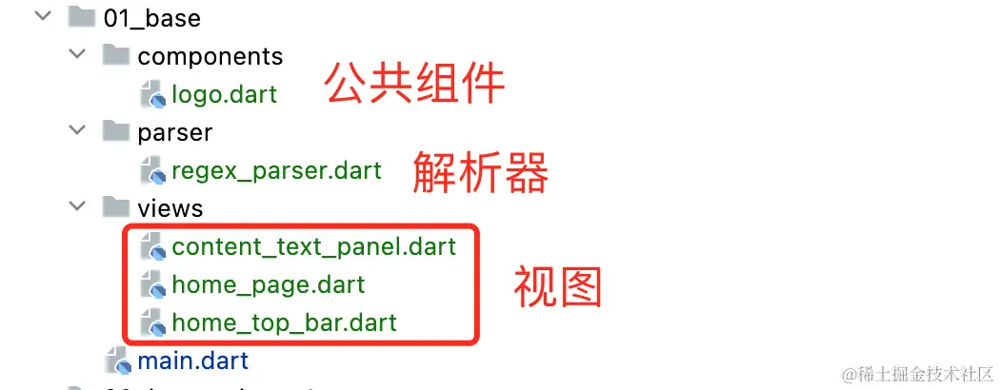
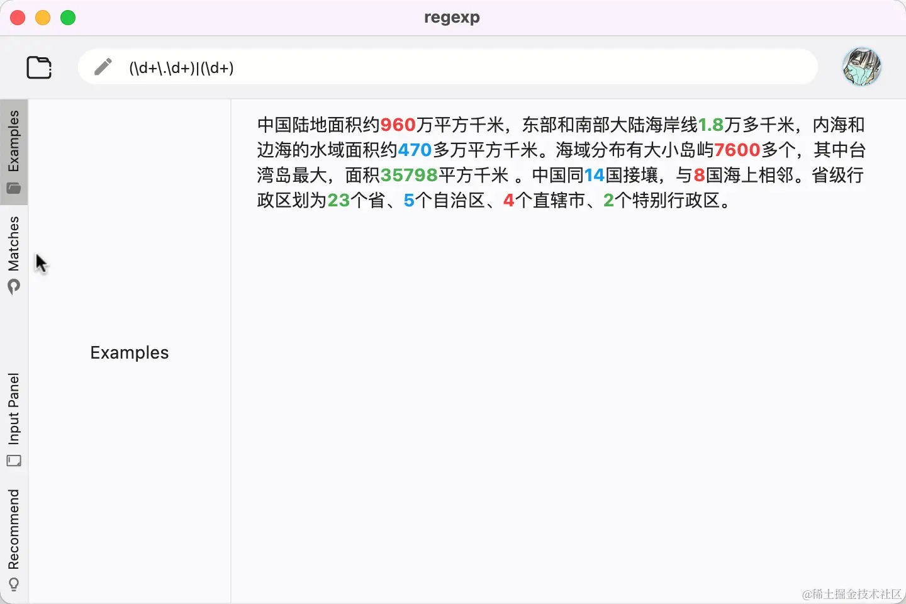
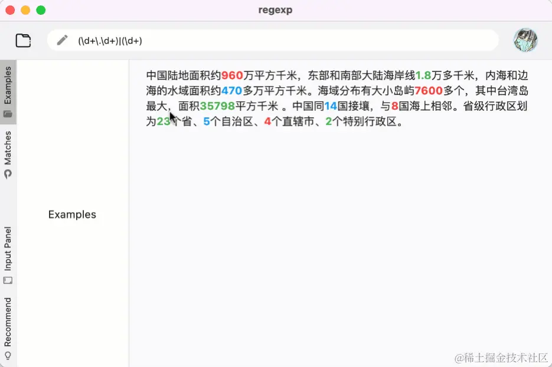
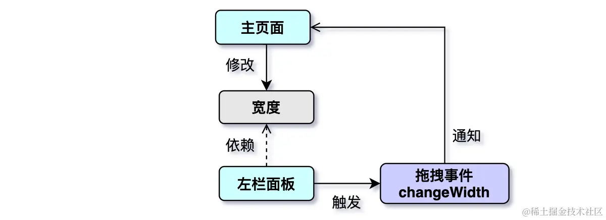
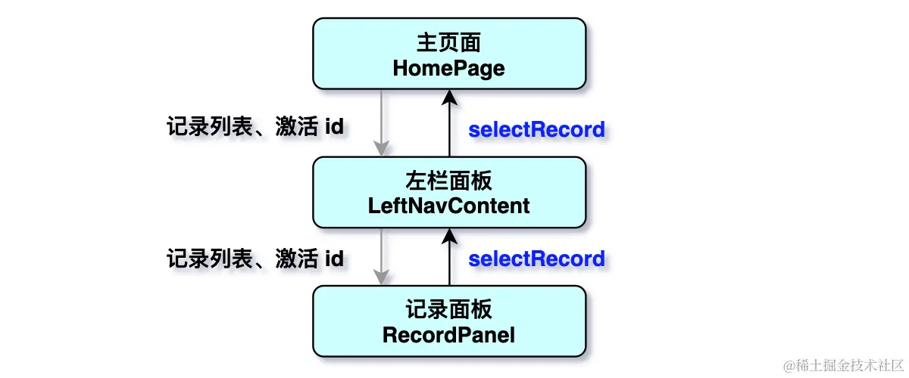
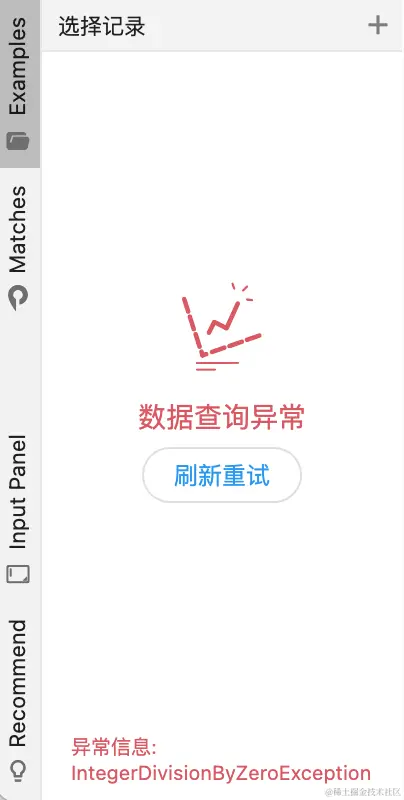
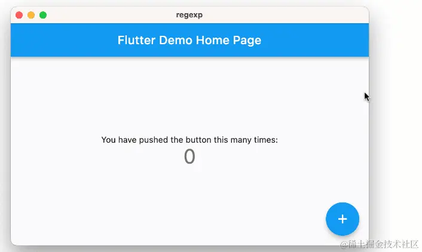

# Flutter实战

[TOC]

跨平台的挑战：

- UI元素的差异化
- 性能的差异化
- 平台特性和使用习惯的差异化

## 初步

在Flutter中富文本的使用：

~~~dart
void main() => runApp(
      MaterialApp(
        home: Scaffold(
          body: HomePage(),
        ),
      ),
    );

String src = '这是一段测试文字';
final TextStyle lightTextStyle =
    const TextStyle(color: Colors.blue, fontWeight: FontWeight.bold);
String part1 = src.substring(0, 4);
String part2 = src.substring(4, 6);
String part3 = src.substring(6, 8);

// 十分不推荐使用树状结构的TextSpan
InlineSpan span = TextSpan(children: [
  TextSpan(text: part1),
  TextSpan(text: part2, style: lightTextStyle),
  TextSpan(text: part3)
]);

class HomePage extends StatelessWidget {
  @override
  Widget build(BuildContext context) {
    return Text.rich(span);
  }
}
~~~

我们接下来实现匹配功能：

~~~dart
InlineSpan formSpan(String src, String pattern) {
  List<TextSpan> span = [];
  RegExp regExp = RegExp(pattern);

  List<String> parts = src.split(regExp); //获取分割段
  if (parts.isNotEmpty) return TextSpan(text: src);

  List<RegExpMatch> allMatches = regExp.allMatches(src).toList(); //获取匹配段
  for (int i = 0; i < parts.length; i++) {
    span.add(TextSpan(text: parts[i]));
    if (i != parts.length - 1) {
      String matchValue = allMatches[i].group(0) ?? '';
      span.add(TextSpan(text: matchValue, style: lightTextStyle));
    }
  }
  return TextSpan(children: span);
}
~~~

split在根据匹配规则进行切分字符时，已经做过了匹配，但丢弃了匹配结果，返回的是分割后的字符串列表。了获取匹配段，我们不得不用 `RegExp` 再匹配一次。**splitMapJoin** 方法可以优化上述问题。

~~~dart
String splitMapJoin(Pattern pattern,
      {String Function(Match)? onMatch, String Function(String)? onNonMatch});
~~~

- Pattern：匹配规则
- **onMatch** 监听到每次匹配结果
- **onNonMatch** 监听到不匹配结果

为此，我们可以将`formSpan`重构为：

~~~dart
InlineSpan formSpan(String src, String pattern) {
  List<TextSpan> span = [];
  RegExp regExp = RegExp(pattern);
  src.splitMapJoin(regExp, onMatch: (Match match) {
    String value = match.group(0) ?? '';
    span.add(TextSpan(text: value, style: lightTextStyle));
    return '';
  }, onNonMatch: (str) {
    span.add(TextSpan(text: str));
    return '';
  });
  return TextSpan(children: span);
}
~~~

## 视图

分析跨越不同组件之间的数据流是至关重要的，因为它决定了UI动态变化的逻辑。

一般从`界面构建`、`事件触发` 和 `数据维护` 三个维度去分析数据流

### 基本内容

界面：

事件

数据分析

项目目录组织

这里我们将`formSpan`的逻辑封装到`RegexParser`类中。对于组件来说，它所要处理的是与UI构造相关的逻辑，而不是这种数据处理的逻辑。

对于构建逻辑封装来说，是抽离成 **函数** 还是 **组件** 。

- **函数封装** ，封装的逻辑很难在其他组件的构建逻辑中被复用，但是可以使用本类的成员数据
- **组件封装** ，复用性要强很多，但无法享有其它类中的数据，只能通过构造进行传参。

这里并没有移动手势、动画这类高频率触发的事件，构建逻辑也并不复杂，所以 `setState` 并不会造成什么影响。

### 桌面导航

### 实现面板的可拖拽

我们要区分**内部状态** 与 **外部状态** 的概念。内部状态是并不需要向外界暴露的状态，例如点击后的动画。而这里面板的宽度是一个内部状态。

核心代码

~~~dart
// in home_page.dart
Row(
  children: [
	//...
    LeftNavContent(activeIndex: activeLeftNavId),
      
    // 自适应剩余的宽度，这样就不需要暴露LeftNavContent的内部状态了
    Expanded(child: ContentTextPanel(span: span)),
  ],
),
~~~

`LeftNavContent`在内部监听手势，并调用`setState()`。`LeftNavContent`的布局更新会向上传播到`Row`组件，然后`Row`再重新渲染该组件。

### 记录列表

这里有个问题，在切换面板时，`_RecordPanelState`会随着界面的消失而被销毁，无法保持状态。

一种方案是将RecordPanel的状态向上提升，这就形成了一个非常经典的 **双向传递链**：上层维护数据向下层传递，下层触发事件向上层传递：

但是这种方案在面对传递链特别长的情况下，就显得力不从心。

还有一种方案就是让状态类混入 `AutomaticKeepAliveClientMixin` 即可，并覆写`bool get wantKeepAlive => true`即可

| 数据为空                                                     | 加载中                                                       | 加载完成                                                     | 加载异常                                                     |
| ------------------------------------------------------------ | ------------------------------------------------------------ | ------------------------------------------------------------ | ------------------------------------------------------------ |
|  |  |  |  |

这些不同场景中的数据，彼此之间孤立，但又同属于一个UI组件。将各种场景下的界面所依赖的数据，分别进行封装。

~~~dart
class _RecordPanelState extends State<RecordPanel> {
    RecordState state = const EmptyRecordState();
    
    // 在数据流发生变化后，更新state
    void _loadData() async {
        state = const LoadingRecordState();
      	setState(() {});
        try {
            data = getNetwork();
            if (data.isNotEmpty) {
                state = LoadedRecordState(data: data);
            } else {
                state = const EmptyRecordState();
            }
        } catch (e) {
            state = ErrorRecordState(error: e.toString());
        }
        setState(() {});	//记得刷新页面
    }
    
    //然后再构建时，根据state，来选择构建的页面
    @override
    Widget build(BuildContext context) {
        // ...
        Widget? child;
        if (state is LoadingRecordState) {
            child = LoadingPanel();
        } else if (state is ErrorRecordState) {
            child = ErrorPanel(
                data: "数据查询异常",
                icon: TolyIcon.zanwushuju,
                onRefresh: _loadData,		//刷新数据流
           );
        }
    }
}
~~~

对状态值维护是一种 **业务逻辑**。我们需要将业务逻辑从 `_RecordPanelState` 中迁移出去独立维护，让状态类只负责构建UI的逻辑。这一点可以通过 `Stream` 来实现，如下图示意，我们抽离出 业务逻辑层` ，一方面，通过 `Stream` 向视图层提供状态数据；另一方面，业务层向视图层提供方法来操作数据。

这也就是`MVVM`架构。

在Flutter中如何优化异步耗时任务执行期间的界面？在相应UI控件中，维护一个状态，用于指示是否在异步执行任务。并根据这个状态构建相应的UI

~~~dart
class _AsyncButtonState extends State<AsyncButton> {
  bool _loading = false;、
  @override
  Widget build(BuildContext context) {
    return ElevatedButton(
        onPressed: _loading ? null : _doTask,	//加载时，禁用该按钮
        child: _loading							//根据loading，动态切换UI控件
            ? const CupertinoActivityIndicator(radius: 8)
            : Text(
                widget.conformText,
                style: const TextStyle(fontSize: 12),
              ));
  }
    
  void _doTask() async {
    setState(() {
      _loading = true;
    });
    await asyncTask(context);		//执行一个异步任务
    setState(() {					// 这里有个问题，在执行异步任务期间，如果Widget被销毁了，那么setState函数就会触发异常
      _loading = false;
    });
  } 
}
~~~

对于桌面而言， 下拉刷新 的场景几乎不常见。因为电脑的滚动操作基本上靠滚轮，这样 下拉刷新 的体验感并不强。另外，桌面端的屏幕空间是非常充裕的，所以允许很多事件以按钮的形式触发

如何实现下拉刷新

1. 创建一个控制器，并且注册一个监听事件

   ~~~dart
   class _LoadedPanelState extends State<LoadedPanel> {
     final ScrollController _scrollCtrl = ScrollController();
   
     @override
     void initState() {
       _scrollCtrl.addListener(_onScroll);	//注册回调事件
       super.initState();
     }
       
     void _onScroll() {
       if (_shouldLoadMore) {
         // 下拉事件
         context.read<RecordBloc>().loadRecord(operation: LoadType.more);
       }
     }
     
     // 滚动到90%的位置时，就触发下拉事件
     bool get _shouldLoadMore {
       if (!_scrollCtrl.hasClients) return false;
       final maxScroll = _scrollCtrl.position.maxScrollExtent;
       final currentScroll = _scrollCtrl.offset;
       final bool down =
           _scrollCtrl.position.userScrollDirection == ScrollDirection.reverse;
       return currentScroll >= (maxScroll * 0.9) && down;
     }
   ~~~

2. 向滚动控件注册这个控制器即可

### 关联功能扩展

数据之间的依赖关系，最终反映为Model View层对象之间的关系。

在 `1` 激活关联正则时，如何影响 `2` 输入框的值，并且触发重新匹配，影响 `3` 的内容:

此时，只能`context.read<Bloc>()`获取到所依赖的`Bloc`对象，再发布通知，来处理`Bloc`之间的依赖关系。

~~~dart
  @override
  Widget build(BuildContext context) {
    return BlocProvider<RecordBloc>(
      create: (_) => RecordBloc(),
      child: BlocProvider<MatchBloc>(
        create: (_) => MatchBloc(),
        child:  BlocProvider<LinkRegexBloc>(
          create: (_) => LinkRegexBloc(),
          child: MaterialApp(
            title: 'regexpo',
            debugShowCheckedModeBanner: false,
            theme: ThemeData(
              primarySwatch: Colors.blue,
            ),
            home: const HomePage(),
          ),
        ),
      ),
    );
~~~

遗憾的是，这种只能处理数据的单向依赖关系，因为`context.read<Bloc>`只能从下往上，而不能反过来。数据的双向依赖关系只能将数据状态暴露给依赖者，并在依赖者中实现数据的业务逻辑，这样才能拆分成单向关系，但这违反了最小依赖的原则。用图来描述的的、更加复杂的依赖关系，业务逻辑的拆分更加困难，甚至无从下手。

好在我们可以使用`MultiBlocProvider`，这样`context.read<Bloc>`就可以读取到相互依赖的`Bloc`对象，从而避免这个问题：

~~~dart
@override
Widget build(BuildContext context) {
  return MultiBlocProvider(
    providers: [
      BlocProvider<AppConfigBloc>(create: (_) => AppConfigBloc()),
      BlocProvider<RecordBloc>(create: (_) => RecordBloc()),
      BlocProvider<LinkRegexBloc>(create: (_) => LinkRegexBloc()),
      BlocProvider<MatchBloc>(create: (_) => MatchBloc()),
    ],
    child: child,
  );
}
~~~

### 适配暗黑模式

思路很简单，组件的颜色都是通过`MaterialApp`中的`colorScheme`对象来获取（`Theme.of(context).colorScheme.inversePrimary;`），或者通过单独维护的管理颜色的对象实例来获取。然后再按照Bloc思路去更新即可

### 项目的分层设计

- Repository
  - Model：数据对象
  - Dao：执行相关SQL语句的对象
  - DataBase：数据库对象，负责管理Dao对象以及与数据库的连接
- ModelView
  - XXXXbloc
    - state.dart
    - event.dart
    - bloc.dart

- View
  - Component：桌面端与手机端共用的组件，一般是响应式布局
  - Mobile：适配移动端的布局、组件
  - Desk：适配Windows端布局、组件（一个文件夹内，放与内容主题相关的控件，例如footer、header、nav等等）
  - main.dart：应用初始化的代码
- Helper
  - Util：工具类
  - Config：配置信息类
- Assets：项目的资源文件
  - images：图片资源
  - font：字体资源
  - config：配置文件

## 正则

## 

### 与

一个 `\d` 只能匹配到一个字符，而`\d\d` 就能匹配两个连续的数字。

`reg{m,n}` 内容连续匹配 `reg` 规则 至少 m 次，至多 n 次。

`\d+\.\d+`匹配小数，注意`.`为正则语法的特殊字符，必须加上`\`表示转义。

### 或

`reg1|reg2|reg3` 表示，内容符合 `reg1`、`reg2`、`reg3` 之一即可立即匹配。但是要注意或操作，具有短路效应，即如果前者匹配了，就被忽略后续字符的匹配。

`(\d+\.\d+)|(\d+)`，通过 `()` 来确保将两部分视为独立正则表达式。

`c1|c2|c3|...|cn`可以简写为`[c1c2c3c4...cn]`，其中`c1`等都是单字符。

`[a-f]`表示`[abcdef]`，即`a|b|c|d|e|f`

`^[ap]`表示匹配除 `a` 或 `p` 字符以外的所有字符

### 贪婪模式

默认情况下会匹配尽可能多的字符。

如果希望匹配尽可能少的字符，可以使用`?`。

`?`的三种含义

- 量词：`reg?`
- 位置匹配：`(?=regExp)`
- 懒惰模式：紧跟在量词的后面

### 位置匹配

**位置匹配**的特点是：匹配的内容为空字符，包括以下三类：

- 行

  - 行首`^`，从行首开始匹配，如果未开启多行模式，那么只会考虑第一行
  - 行尾`$`

- 单词

  - 单词边界`\b`：在我们汉语中，并没有 单词的概念，所以 `\b` 是无法匹配的。
  - 非单词边界`\B`：在所有位置中去除单词边界后所剩的位置

- 正则位置

  - `?=`：符合reg的前方位置

    

  - `?<=`：符合reg的后方位置，`(?<=a)r`匹配`a`字符后面的`r`字符

  - `?!`：不符合reg的前方位置

    

    `h(?!o)`：匹配不在`o`字符前方的`h`字符

    

  - `?<!`：不符合reg的后方位置

### 分组

`()` 可以创建分组，分组可以方便获取到局部正则匹配的内容。

`a[vm]`就没有分组，在获取匹配结果后，只能通过`group(0)`获取到`av`。而`a([vm])`就有一个分组，在获取匹配结果后，可以通过`group(0)`获取到整个匹配结果`av`，也可以通过`group(1)`获取到局部匹配结果`v`

我们可以从匹配结果中，提取出我们想要的结果，例如提取书名：

~~~dart
void main() {
  String src = '鲁迅创作了《狂人日记》，是中国现代文学史第一篇白话文小说。'
      '《诗经》是中国古代诗歌开端，最早的一部诗歌总集。';
  RegExp exp = RegExp(r'《(.*?)》');
  Iterable<RegExpMatch> allMatches = exp.allMatches(src);

  for (RegExpMatch match in allMatches) {
    print("match:${match.group(1)}");
  }
}
~~~

根据 `md` 的规则可以很轻松地通过 `!\[.*\](\(.*?\))` 正则匹配到图片链接内容。

多个括号嵌套时，分组规则为：从左到右数 左括号 ，是第几个，就是第几组

我们可以通过`(?<name>reg)`正则语法，为分组起名字。

~~~dart
const reg = r'(\d{1,4})年(?<月份>\d{1,2})月(\d{1,2})';
RegExp exp = RegExp(reg);
Iterable<RegExpMatch> allMatches = exp.allMatches(src);
for (RegExpMatch match in allMatches) {
    String? month = match.namedGroup("月份");
    print("====match:$month");
    print("====groupNames:${match.groupNames}");
}

~~~

有时候，我们需要基于前面匹配的内容，对后面的匹配进行限制。也就是说，后续的匹配规则需要依赖于前面匹配的内容。比如，匹配前后一致的标签`<h1></h1>`。我们可以使用**反向引用**语法来完成上述需求

 如下，通过`\1` 就可以引用第一组的匹配结果

反向引用也支持命名的方式：`\k<name>`

有时候我们加括号只是为了表示独立，并不想把它视为 **组**，这时可以使用特定的语法 `(?:reg)` 表示不捕获组。例如，`'a(?:[vm])'`

## 数据

### Sqlite

最常用的数据库插件是 `sqflite` 插件，默认支持 `Android`、`iOS`、`MacOS`。`sqflite_common_ffi`支持 `Windows`、`Linux` 桌面端。`sqflite_common_ffi_web`实验性支持`Web`。

注意Windows平台还需要下载 [sqlite3.dll](https://github.com/tekartik/sqflite/raw/master/sqflite_common_ffi/lib/src/windows/sqlite3.dll)，并放在项目的根目录里。

为了自定义数据库存储的位置，这里使用 `path_provider` 插件。并存储在 `Application Documents` 目录下。

首先，定义一个`DbOpenHelper`辅助类，处理不同平台上的差异

~~~dart
import 'dart:ffi';
import 'dart:io';
import 'package:path/path.dart' as path;
import 'package:path_provider/path_provider.dart';
import 'package:sqlite3/open.dart';
import 'package:sqlite3/sqlite3.dart';

class DbOpenHelper {
  const DbOpenHelper();
  void setupDatabase() {
    // 加载Windows平台的DDL文件
    if (Platform.isWindows) {
      String location = Directory.current.path;
      //我们之前将dll文件放在了项目的根目录中
      _windowsInit(path.join(location, 'sqlite3.dll'));
    }
  }

  void _windowsInit(String path) {
    //sqlite模块中的open方法
    open.overrideFor(OperatingSystem.windows, () {
      try {
        return DynamicLibrary.open(path);
      } catch (e) {
        stderr.writeln('Failed to load sqlite3.dll at $path');
        rethrow;
      }
    });
    sqlite3.openInMemory().dispose();
  }
	
  // 获取数据库文件所在文件夹的默认路径，如果不存在则创建一个
  Future<String> getDbDirPath() async {
    Directory appDocDir = await getApplicationDocumentsDirectory();
    String dirName = 'databases';

    //对不同平台，设置不同的dirPath
    String dirPath = path.join(appDocDir.path, dirName);

    if (Platform.isAndroid) {
      dirPath = path.join(appDocDir.parent.path, dirName);
    }
    if (Platform.isWindows || Platform.isLinux) {
      dirPath = path.join(appDocDir.path, 'regexpo', 'databases');
    }

    // 创建文件夹
    Directory result = Directory(dirPath);
    if (!result.existsSync()) {
      result.createSync(recursive: true);
    }
    return dirPath;
  }
}
~~~

然后定义一个`LocalDb`类，负责与数据库进行通信，以及统一管理Dao对象

~~~dart
import 'package:sqflite_common_ffi/sqflite_ffi.dart';
import 'package:path/path.dart' as path;

class LocalDb {
  Database? _database;

  // 私有化构造
  LocalDb._();

  // 内部实例化,提供静态访问方式
  static LocalDb instance = LocalDb._();

  final DbOpenHelper helper = const DbOpenHelper();

  // Dao对象交由 LocalDb 统一管理
  // 这里只提供 get 方法，也就是说只允许外界进行读取，不允许设置 dao 对象。
  late RecorderDao _recorderDao;
  RecorderDao get recorderDao => _recorderDao;

  // 与指定数据库建立连接
  Future<void> initDb({String name = "regexpo.db"}) async {
    if (_database != null) return;
    helper.setupDatabase();

    // 数据库文件所在的文件夹路径
    String databasesPath = await helper.getDbDirPath();
    // 数据库文件的路径
    String dbPath = path.join(databasesPath, name);

    print('数据库路径为 ${dbPath}');

    //当文件夹中未发现数据库时，会触发 onCreate 回调创建数据库
    //当数据库的版本变化时，会触发 onUpgrade 回调处理升级；
    //数据库打开成功后，会触发 onOpen 函数通知。
    OpenDatabaseOptions options = OpenDatabaseOptions(
        version: 1,
        onCreate: _onCreate,
        onUpgrade: _onUpgrade,
        onOpen: _onOpen);

    // 在Windows/Linux下，与数据库建立连接
    if (Platform.isWindows || Platform.isLinux) {
      DatabaseFactory databaseFactory = databaseFactoryFfi;
      _database = await databaseFactory.openDatabase(
        dbPath,
        options: options,
      );
      return;
    }
	
    // 在Android、Ios、Mac下，与数据库建立连接
    _database = await openDatabase(
      dbPath,
      version: options.version,
      onCreate: options.onCreate,
      onUpgrade: options.onUpgrade,
      onOpen: options.onOpen,
    );
  }
	
  // 释放连接
  Future<void> closeDb() async {
    await _database?.close();
    _database = null;
  }

  FutureOr<void> _onCreate(Database db, int version) async {
    print('数据库创建...');
    await Future.wait([
      db.execute(Record.tableSql),
    ]);
      
    // 与ORM框架不同，Dart必须手动管理这些Dao对象，并注入相应的依赖对象
    _recoderDao = RecoderDao(db);
 	_linkRegexDao = LinkRegexDao(db);
  }

  FutureOr<void> _onUpgrade(Database db, int oldVersion, int newVersion) {
    print('数据库升级 $oldVersion -> $newVersion');
  }

  FutureOr<void> _onOpen(Database db) {
    print('数据库打开...');
    _recorderDao = RecorderDao(db);		// 在这里集中创建DAO对象	
  }
}

~~~

这里使用 `RecorderRepository` 对不同的数据来源提供统一的操作接口

~~~dart
abstract class RecorderRepository {
  /// 查询记录
  Future<List<Record>> search({
    int page = 1,
    int pageSize = 25,
    String? arg,
  });

  /// 插入记录
  Future<int> insert(Record record);

  /// 根据 [id] 删除记录
  Future<int> deleteById(int id);

  /// 修改记录
  Future<int> update(Record record);
}
~~~

定义数据对象

~~~dart
class Record { //... }
~~~

定义`Dao`对象，它依赖于`Database`对象，负责与数据库进行交互

~~~dart
// dao 依赖于 Database 对象，是纯粹和数据库进行交互的层级，承担核心的数据库操作任务。
class RecorderDao implements RecorderRepository {
  final Database _database;

  RecorderDao(this._database);

  // page 1 pageSize 25 ==> 1~25
  Future<List<Map<String, Object?>>> _search(
      int page, int pageSize, String? arg) {
    String? where;
    List<Object?>? whereArgs;
    if (arg != null) {
      where = "title LIKE ?";
      whereArgs = ['%$arg%'];
    }

    return _database.query('Recorder',
        where: where,
        whereArgs: whereArgs,
        limit: pageSize,
        offset: (page - 1) * pageSize);
  }

  @override
  Future<List<Record>> search(
      {int page = 1, int pageSize = 25, String? arg}) async {
    List<Map<String, Object?>> result = await _search(page, pageSize, arg);
    return result.map(Record.fromJson).toList();
  }

  Future<int> insert(Record data) => _database.insert(
        'Recorder',
        data.toJson(),
        conflictAlgorithm: ConflictAlgorithm.replace,
      );

  Future<int> deleteById(int id) => _database.delete(
        'Recorder',
        where: "id = ?",
        whereArgs: [id],
      );

  Future<int> update(Record data) => _database.update(
        'Recorder',
        data.toJson(),
        where: "id = ?",
        whereArgs: [data.id],
      );
}

~~~

### Bloc

如果组件间是强依赖关系，而且嵌套层数只有一、二层。那么就推荐使用这个状态提升方案。

`Bloc`框架就是提供一个基于 `Stream` 的 `MVVM` 架构中的 `ViewModel `层。一方面，它将业务逻辑以及视图逻辑解耦；另一方面，实现了订阅者发布者框架，解决了在状态提升中的跨节点更新难的问题。

对于简单的状态，可以使用 `Cubit` 来处理。它把流控制器隐藏在了内部，通过 `emit` 函数发送通知。如果有多个同类型的`Bloc`对象在`Element Tree`的不同节点，那么`emit`的消息就像`InheritedWidget`那样，只发布给最近的`Bloc`对象。

我们首先定义`ModelView`层的对象

~~~dart
class RecordBloc extends Cubit<RecordState> {
  // RecordState是Stream中元素的类型
  // 我们不用显式维护这个状态了，通过super.state可以访问到这个状态
  
  RecordBloc() : super(const EmptyRecordState()); //设置初始状态
    
  // 按需调用这个方法，调用emit更新状态，并向订阅者发送通知
  void loadRecord() async {
    RecordState state;			// 局部状态，要与super.state区分
    try {
        
      // 更新状态super.state并通知订阅者
      emit(const LoadingRecordState());
      List<Record> records = await repository.search();
      if (records.isNotEmpty) {
        state = LoadedRecordState(
          activeRecordId: records.first.id,
          records: records,
        );
      } else {
        state = const EmptyRecordState();
      }
    } catch (e) {
      state = ErrorRecordState(error: e.toString());
    }
    emit(state);
  }
	
  // 按需调用这个方法，调用emit更新状态，并向订阅者发送通知
  void select(int id) {
    emit(state.copyWith(activeRecordId: id));
  }
}
~~~

定义订阅者：

~~~dart
class _RecordPanelState extends State<RecordPanel> {
    
  // 通过 BuildContext对象的read方法，获取对应类型的Bloc对象
  // 这个与InheritedWidget类似，只会获取最近的RecordBloc对象
    
  // 获取ModelView层的对象，用于发布消息。
  RecordBloc get bloc => context.read<RecordBloc>();
  
  @override
  void initState() {
    super.initState();
    bloc.loadRecord();		//更新数据，并且发送通知
  }
    
   @override
  Widget build(BuildContext context) {
    super.build(context);
    return Column(
      children: [
        const RecordTopBar(),
        Gap.dividerH,
        Expanded(
            // 向Bloc注册订阅者，监听RecordBloc事件。这里RecordState仅仅说明builder回调函数中参数state的类型
            
           	// 通过 BlocBuilder 可以监听 Bloc 中状态流的变化，本质上和 StreamBuilder一样
            child: BlocBuilder<RecordBloc, RecordState>(
          builder: (_, state) => _buildByState(state),
        ))
      ],
    );
  }
}
~~~

`BlocListener`与`BlocBuilder`一样，但是它的回调函数并没有返回值。

最后再创建`ModelView`对象，它定义了订阅发布的范围。

~~~dart
BlocProvider<RecordBloc>(
    create: (_) => RecordBloc(),
    child: RecordPanel(onSelectRecord: widget.onSelectRecord));
~~~

Cubit对象的状态发生变化是，就会执行onChange 方法。因此我们可以覆写该方法，来“观察”Cubit对象的变化

~~~dart
class CounterCubit extends Cubit<int> {
  CounterCubit() : super(0);

  void increment() => emit(state + 1);

  @override
  void onChange(Change<int> change) {
    super.onChange(change);
    print(change);
  }
}
~~~

此外Bloc对象除了能够执行onChange方法，还可以执行onTransition方法，当接受到事件后，就会执行onTransition方法

~~~dart
class CounterIncrementPressed extends CounterEvent {}

class CounterBloc extends Bloc<CounterEvent, int> {
  CounterBloc() : super(0) {
    on<CounterIncrementPressed>((event, emit) => emit(state + 1));
  }

  @override
  void onChange(Change<int> change) {
    super.onChange(change);
    print(change);
  }

  @override
  void onTransition(Transition<CounterEvent, int> transition) {
    super.onTransition(transition);
    print(transition);  // { currentState: 0, event: CounterIncrementPressed, nextState: 1 }
  }
} 
~~~

`Bloc`和`Cubit`都是 `BlocBase` 的派生类，本质上并没有什么区别。`Cubit` 弱化了事件的概念。而 `Bloc` 依赖于事件来触发业务逻辑，是一种更加灵活的用法，可以定义多种类型的事件进行分发（在Cubit视角中，只有一种事件）。

首先定义事件，这些事件都携带着要更新的数据：

~~~dart
abstract class MatchEvent {
  const MatchEvent();
  @override
  List<Object?> get props => [];
}

class ChangeRegex extends MatchEvent {
  final String pattern;
  const ChangeRegex({required this.pattern});
}

class ChangeContent extends MatchEvent {
  final String content;
  const ChangeContent({required this.content});
}

class HoverMatchRegex extends MatchEvent {
  final MatchInfo? matchInfo;
  const HoverMatchRegex({required this.matchInfo});
}

class UpdateRegexConfig extends MatchEvent {
  final RegExpConfig config;
  const UpdateRegexConfig({required this.config});
}
~~~

然后定义`ModelView`层对象，即`Bloc`对象。`Bloc`中有两个泛型，分别表示 事件 和 状态。

~~~dart
class MatchBloc extends Bloc<MatchEvent, MatchState> {
  RegexParser parser = RegexParser(); //这里使用RegexParser来负责业务逻辑的处理

  MatchBloc() : super(const MatchSuccess()) {
    // 调用On方法，为某个事件注册回调函数
    on<ChangeRegex>(_onChangeRegex);
    on<ChangeContent>(_onChangeContent);
    on<HoverMatchRegex>(_onHoverMatchRegex);
    on<UpdateRegexConfig>(_onUpdateRegexConfig);
  }

  void _onChangeRegex(ChangeRegex event, Emitter<MatchState> emit) {
    //更新状态的具体逻辑
    MatchState match = parser.match(
      state.content,
      event.pattern,
      state.config,
    );
      
   	//更新状态并通知订阅者
    emit(match);
  }

  void _onHoverMatchRegex(HoverMatchRegex event, Emitter<MatchState> emit) {
    MatchState match = parser.match(
      state.content,
      state.pattern,
      state.config,
      activeMatch: event.matchInfo,
    );
    emit(match);
  }

  void _onChangeContent(ChangeContent event, Emitter<MatchState> emit) {
    MatchState match = parser.match(
      event.content,
      state.pattern,
      state.config,
    );
    emit(match);
  }

  void _onUpdateRegexConfig(UpdateRegexConfig event, Emitter<MatchState> emit) {
    MatchState match = parser.match(
      state.content,
      state.pattern,
      event.config,
    );
    emit(match);
  }
}
~~~

除了使用`BlocBuilder`来监听重新构建之外，还可以在控件内部通过 `watch` 获取 `MatchBloc` 。这样当状态发生变化，会触发 `build` 进行重新构建：

~~~~dart
class RegexConfigTools extends StatelessWidget {
    @override
    Widget build(BuildContext context) {
        //监听事件
		MatchBloc bloc = context.watch<MatchBloc>();
    }
}
~~~~

这里再说一下`read`方法，它只会获取状态，而不会进行监听。

此外，可以通过`select`监听并获取状态的某个属性。如果发生变化了，那么就触发 `build` 进行重新构建：

~~~dart
@override
Widget build(BuildContext context) {
  Color color = Theme.of(context).primaryColor;
    
  //要监听的属性类型RegExpConfig，要监听的ModelView层对象MatchBloc
  RegExpConfig config = context.select<MatchBloc, RegExpConfig>(
    (value) => value.state.config,
  );
  // ... 
}
~~~

这里发布者需要调用`bloc#add()`的方法来发布消息：

~~~dart
MatchBloc bloc = context.read<MatchBloc>();
// ...
// 发布UpdateRegexConfig类型的消息，并携带RegExpConfig类型的数据
bloc.add(UpdateRegexConfig(config: cfg));
~~~

`BlocListener` 也支持通过 `listenWhen` 回调，对比前后状态来选择是否执行listener回调函数以及刷新组件

~~~dart
@override
Widget build(BuildContext context) {
    return BlocListener<RecordBloc, RecordState>(
    	listenWhen(curretnState, nextState) =>
        	curretnState.id != nextState.id
        listener: _listen
        child : ...
    )
}
~~~

还有，`MultiBlocListener`来同时监听多个事件。

~~~dart
@override
Widget build(BuildContext context) {
  return MultiBlocListener(
    listeners: [
      BlocListener<RecordBloc, RecordState>(
        listenWhen: (p, n) => p.activeRecord?.id != n.activeRecord?.id,
        listener: _listenRecordState,
      ),
      BlocListener<LinkRegexBloc, LinkRegexState>(
        listener: _listenLinkRegexChange,
      )
    ],
    child: child,
  );
}
~~~

### 持久化

`shared_preferences`主要的作用是用于将键值对数据**异步持久化到磁盘**。可用于

- Web Cache的实现
- 配置信息的保存

支持存储类型：`bool`、`int`、`double`、`string`、`stringList`

获取实例对象：

~~~dart
SharedPreferences? sharedPreferences = await SharedPreferences.getInstance();
~~~

调用`set`方法保存数据：

~~~dart
// 设置string类型
  await sharedPreferences?.setInt("name", 12);
~~~

调用`get`方法读取持久化数据：

~~~dart
sharedPreferences?.getInt("name")
~~~

此外还有一些方法`getKeys()`、`containsKey()`、`remove()`、`clear()`

### 首屏加载页面

定义一个Cubit对象，来处理数据的初始化加载

~~~dart
class AppConfigBloc extends Cubit<AppConfig> {
  AppConfigBloc() : super(const AppConfig());

    
  // 一定是一个异步方法
  void initApp() async {
    // 读取数据
    int mode = (await sp).getInt(SpKey.appThemeModel) ?? 0;
    await LocalDb.instance.initDb();
    emit(state.copyWith(appThemeMode: mode, inited: true));		//发布事件
  }
}
~~~

然后，定义`Splash Page`即可

~~~dart
class SplashPage extends StatefulWidget {
     final int minCostMs;// 启动页的最小时间
  	const SplashPage({super.key, this.minCostMs = 600});
    // ...
}

class _SplashPageState extends State<SplashPage> {
  @override
  void initState() {
    super.initState();
    _timeRecoder = DateTime.now().millisecondsSinceEpoch;
    context.read<AppConfigBloc>().initApp();
    // 由于initApp是一个异步方法，所以在注册完initApp后，initState就直接退出。initApp交由后台处理
  }
    
   @override
  Widget build(BuildContext context) {
    // 监听数据加载完成的事件
    return BlocListener<AppConfigBloc,AppConfig>(
      listener: _listenInit,		
      child : //... 启动页的构建逻辑
  }
  
  void _listenInit(BuildContext context, AppConfig state) async{
    // 动画的一个最小时间
    int now = DateTime.now().millisecondsSinceEpoch;
    int cost = now - _timeRecoder;
    int delay = widget.minCostMs - cost;
    recoder.loadRecord();
    if(delay > 0){
     await Future.delayed(Duration(milliseconds: delay));
    }
      
      
    if(state.inited) {
      Widget home = const PlatformUIAdapter(
        mobile: PhoneHomePage(),
        desk: HomePage(),
      );
        
      // 通过Navigator将启动页替换为主界面
      Navigator.of(context).pushReplacement(
        MaterialPageRoute(builder: (_) => home),
      );
    }
  }
}
}
~~~

最后，创建`Cubit`对象以及订阅者即可

~~~dart
BlocProvider(
	child : BlocBuilder (
    	child : MaterialApp(		// 这个语法是错误的，但是明白意图就行
        	home : SplashPage();
        )
    )
)
~~~

### 平台界面适配

响应式布局，即根据区域尺寸大小动态构建组件，是适配各种屏幕的「银弹」。在Flutter中，我们可以通过`LayoutBuilder`组件来动态构建UI。

~~~dart
class MyHomePage extends StatelessWidget{
  const MyHomePage({super.key});

  @override
  Widget build(BuildContext context) {
    return LayoutBuilder(
      builder: (ctx,cts){
        if(cts.maxWidth<400){
          return const SmallWidthLayout();
        }
        if(cts.maxWidth>650){
          return const LargeWithLayout();
        }
        return const MiddleWidthLayout();
      },
    );
  }
}
~~~

可以通过 `Expanded`、`Flexible`、`Spacer` 组件，在 `Column`、`Row` 中利用填充剩余空间，实现某些区域在变化时等分区域。

对于构建桌面和移动端差异性非常大的界面（动态布局已经满足不了需求了），根据平台来构建定制化界面。我们可以通过 `Platform.isXXX` 来判断当前平台是否是 `XXX`。

~~~dart
if (Platform.isAndroid || Platform.isIOS){
  // 返回移动 UI
} else {
  // 返回桌面 UI
}
~~~

也可以将上述逻辑封装成一个类（可选）：

~~~dart
class PlatformUIAdapter extends StatelessWidget {
  final Widget desk;
  final Widget mobile;

  const PlatformAdapter({
    super.key,
    required this.desk,
    required this.mobile,
  });

  @override
  Widget build(BuildContext context) {
    if (Platform.isAndroid || Platform.isIOS) {
      return mobile;
    }
    return desk;
  }
}
~~~

### 桌面端特性

在应用设计时需要考虑应用的最小尺寸，避免产生异常情况：

可以通过`desktop_window`插件来设置桌面端应用窗口

~~~dart
import 'package:desktop_window/desktop_window.dart';

Future testWindowFunctions() async {
    Size size = await DesktopWindow.getWindowSize();
    print(size);
    await DesktopWindow.setWindowSize(Size(500,500));

    await DesktopWindow.setMinWindowSize(Size(400,400));
    await DesktopWindow.setMaxWindowSize(Size(800,800));

    await DesktopWindow.resetMaxWindowSize();
    await DesktopWindow.toggleFullScreen();
    bool isFullScreen = await DesktopWindow.getFullScreen();
    await DesktopWindow.setFullScreen(true);
    await DesktopWindow.setFullScreen(false);
}
~~~

