## 系统概述


单聊


一个用户A给另一个用户B发送消息时，用户B不在线，此时，消息就需要存储在服务器上；**只要在设定的时间范围内**，用户B登录到服务器，此消息就会同步到用户B，这就是**离线消息**

**群聊**


群的信息与成员列表因为更新频率不高，通常是**持久**在数据库中。而会话（记录用户与连接的关系）随着用户的**登录、退出、被踢、连接异常断开、自动重连**等情况导致会经常**变动**，也就是大量的写入和删除操作，通常是存放在高速缓存中。

因此，这里的读取成员列表实际上是有两步：

1. 从**数据库**中读取成员列表
2. 从**高速缓存**中读取每个成员的登录会话信息

> 假设一个群成员有1千人，每一次消息转发，忽略消息持久化处理时长，仅**读取成员列表和会话**在性能上就是个考验。因此会话之类的信息是不可能保存在事务类的数据库中的。


长连服务（私有二进制协议）相对 http 服务来说，是重客户端逻辑，因为用户与服务端建立的**连接**是有**生命周期**的。比如**登录退出、自动重连，消息重试**等逻辑都是依赖客户端实现。


除了正常的登录，登出，及消息收/发，原生系统的 SDK 还要考虑消息的缓存问题，否则在用户端的体验是很不好的。比如在APP中打开一个会话界面之后，还需要从服务端读取消息，那么界面上肯定会有一个空白时间，这个体验是非常差的，而且对服务端压力也会增加很多。


## 通信协议状态

**所有接入互联网中的设备正是通过这些协议，来达成基本共识**


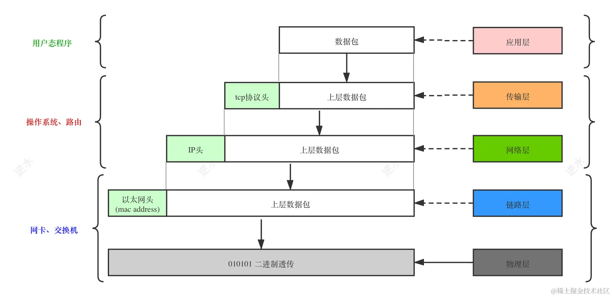

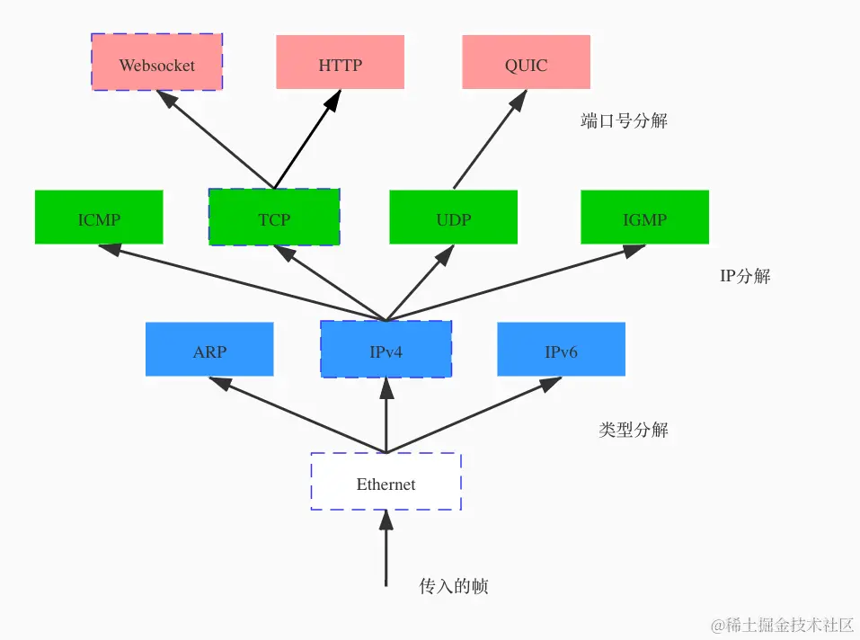

### Ethernet协议

以太网协议只能在局域网的范围内通信。

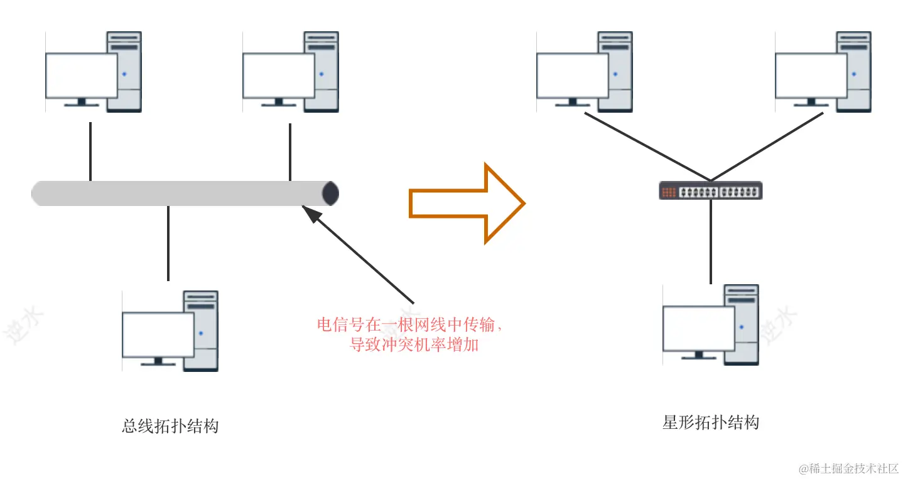

帧格式：

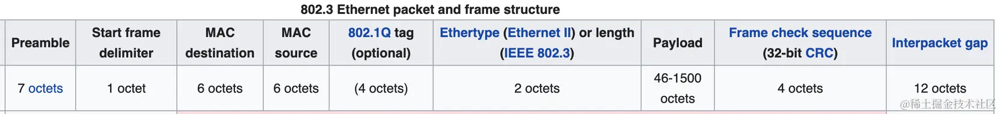

- payload 数据包最小 46 byte，最大 1500 byte
- MAC（Media Access Control， 介质访问控制）地址，也叫硬件地址，长度是6字节，由16进制的数字组成，分为前 24 位和后 24 位。 
  - 前 24 位叫做组织唯一标志符是由 IEEE 的注册管理机构给不同厂家分配的代码，区分了不同的厂家。 
  - 后 24 位是由厂家自己分配的，称为扩展标识符。

### IP 协议

IP提供了一种尽力而为、无连接的数据报交付服务。即它不保证任何数据包均能送达目的地，也不保证所有数据包均按照正确的顺序无重复地到达。

IP地址分为三种：

- 单播地址 
- 广播地址 
- 多播地址

IP 协议通过子网的划分及路由表等，**突破了局域网的限制**

1. Total Length：为 16 bits，也就是 IPv4 一个报文最大 65,535 字节。
2. TTL(Time to Live)：设置了一个数据报可经过的路由器上限，路由器转发时减 1，到 0 就丢弃报文。
3. Protocol：通常有两种17 (UDP)和 6（TCP)。
4. Header Checksum：只检测IP头数据完整性，不检查数据报中的有效载荷(如TCP数据包)。

### TCP 协议

**传输控制协议（Transmission Control Protocol，缩写：TCP）**是一种面向连接的、可靠的、基于字节流的传输层通信协议，由 IETF 的 RFC 793 定义。

1. 连接性 - 生命周期、双向缓冲。
2. 可靠性 - ACK、超时重传、拥塞控制等。
3. 字节流 - 粘包、解包。


### WebSocket

**WebSocket是一种网络传输协议**，在TCP连接上进行全双工通信，它允许服务端主动向客户端推送数据，而且它通过心跳机制来维护长连接。它是在HTTP 的基础上升级而来，来自客户端的握手如下所示：

~~~http
GET /chat HTTP/1.1
Host: server.example.com
Upgrade: websocket
Connection: Upgrade
Sec-WebSocket-Key: dGhlIHNhbXBsZSBub25jZQ==
Origin: http://example.com
Sec-WebSocket-Protocol: chat, superchat
Sec-WebSocket-Version: 13
~~~

**来自服务器的握手如下所示**:

~~~http
HTTP/1.1 101 Switching Protocols
Upgrade: websocket
Connection: Upgrade
Sec-WebSocket-Accept: s3pPLMBiTxaQ9kYGzzhZRbK+xOo=
Sec-WebSocket-Protocol: chat
~~~

服务器返回 101 状态码，表示同意协议升级

**WebSocket协议的格式如下**：

~~~txt
0                   1                   2                   3
0 1 2 3 4 5 6 7 8 9 0 1 2 3 4 5 6 7 8 9 0 1 2 3 4 5 6 7 8 9 0 1
+-+-+-+-+-------+-+-------------+-------------------------------+
|F|R|R|R| opcode|M| Payload len |    Extended payload length    |
|I|S|S|S|  (4)  |A|     (7)     |             (16/64)           |
|N|V|V|V|       |S|             |   (if payload len==126/127)   |
| |1|2|3|       |K|             |                               |
+-+-+-+-+-------+-+-------------+ - - - - - - - - - - - - - - - +
|     Extended payload length continued, if payload len == 127  |
+ - - - - - - - - - - - - - - - +-------------------------------+
|                               |Masking-key, if MASK set to 1  |
+-------------------------------+-------------------------------+
| Masking-key (continued)       |          Payload Data         |
+-------------------------------- - - - - - - - - - - - - - - - +
:                     Payload Data continued ...                :
+ - - - - - - - - - - - - - - - - - - - - - - - - - - - - - - - +
|                     Payload Data continued ...                |
+---------------------------------------------------------------+


 Opcode:  4 bits
 
      Defines the interpretation of the "Payload data".  If an unknown
      opcode is received, the receiving endpoint MUST _Fail the
      WebSocket Connection_.  The following values are defined.

      *  %x0 denotes a continuation frame
      *  %x1 denotes a text frame <---文本
      *  %x2 denotes a binary frame  <---二进制
      *  %x8 denotes a connection close
      *  %x9 denotes a ping <---ping包
      *  %xA denotes a pong <---pong包
~~~

| 名词             | 说明                                                         |
| ---------------- | ------------------------------------------------------------ |
| FIN              | 如果是 1，表示这是消息（message）的最后一个分片（fragment）；如果是 0，表示不是是消息（message）的最后一个分片（fragment） |
| RSV1, RSV2, RSV3 | 预留位，可以做协议的扩展                                     |
| opcod            | 决定了应该如何解析后续的数据载荷（data payload）。           |
| mask             | 表示是否要对数据载荷进行掩码操作。从客户端向服务端发送数据时，需要对数据进行掩码操作；从服务端向客户端发送数据时，不需要对数据进行掩码操作。  如果 Mask 是 1，那么在 Masking-key 中会定义一个掩码键（masking key），并用这个掩码键来对数据载荷进行反掩码。所有客户端发送到服务端的数据帧，Mask 都是 1。 |
| Payload length   | 数据载荷的长度，单位是字节。假设数 Payload length == 125，<br>如果 x 为 0~126：数据的长度为 x 字节。 <br/>x 为 126：后续 2 个字节代表一个 16 位的无符号整数，该无符号整数的值为数据的长度。<br/> x 为 127：后续 8 个字节代表一个 64 位的无符号整数（最高位为 0），该无符号整数的值为数据的长度。<br/> 此外，payload length 的二进制表达采用网络序（big endian，重要的位在前）。 |
| Masking-key      |                                                              |
| Payload data     |                                                              |


协议标识符是`ws`（如果加密，则为`wss`），服务器网址就是 URL。

~~~url
ws://example.com:80/some/path
~~~

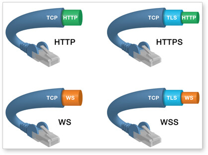

**常见的轮询方式分为轮询与长轮询，它们的区别如下图所示：**
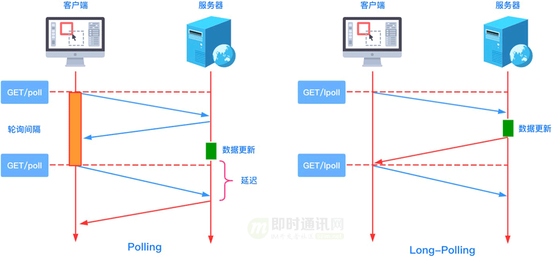

**为了更加直观感受轮询与长轮询之间的区别，我们来看一下具体的代码：**
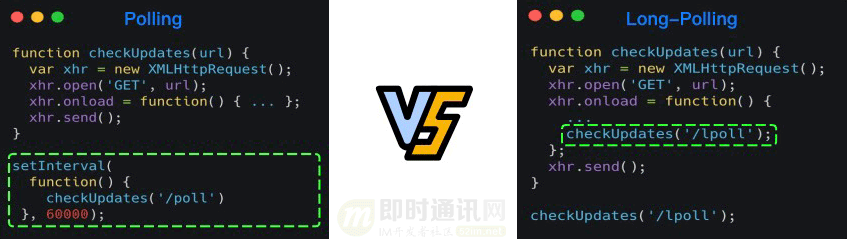

### 硬件


网卡上面装有处理器和存储器（包括RAM和ROM）。网卡与局域网之间的通信是通过**电缆**，并以**串行**传输方式进行的。而网卡与计算机之间的通信则是通过计算机主板上的**I/O总线**，并以**并行**传输方式进行。每个网卡都拥有一个MAC地址。

交换机按功能划分，可以分为一、二、三、四和七层（根据OSI七层协议来划分）交换机。二层交换机依据 MAC 地址传送网络帧，它通过自动学习算法在内存中维护**MAC地址**与**端口**的映射表。

路由器是连接**两个以上不同网络**的设备。提供**路由**与**转发**两种重要机制

## 通信协议行为

### Socket

Socket（套接字）是在网络中不同主机上的应用进程中，对双向通信端点的抽象。如下是Socket全部接口：

| 方法      | 描述           |
| --------- | -------------- |
| Create()  | 创建socket     |
| Bind()    | 绑定地址       |
| Listen()  | 准备接收连接   |
| Connect() | 客户端建立连接 |
| Accept()  | 服务端接受连接 |
| Write()   | 发送数据       |
| Read()    | 接收数据       |
| Close()   | 关闭连接       |

- Stream Socket：基于TCP/IP协议面向连接的流式传输套接字，特点是安全，可靠。
- Datagram Socket：基于UDP/IP协议的面向消息的套接字，特点是不保持可靠性，简单，速度快。


### 应用层行为

TCP是全双工通信协议，建立一条连接时，操作系统就需要为它在内核内存中分配两个缓冲区（读 buffer，写 buffer）

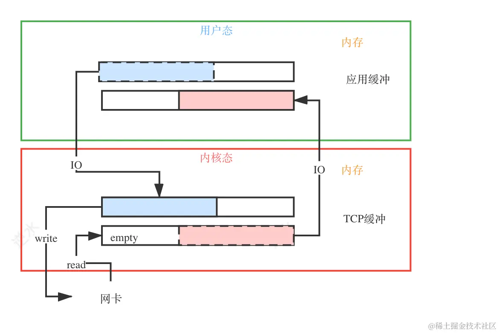

我们的应用程序是在用户态，用户态进程是无法直接访问内核内存空间的，因此需要额外的数据复制操作

### 传输层行为

TCP/IP 数据包在发送到 NAT 网关上时，网关进行拆包才能得到：IP协议头、TCP协议头。然后修改数据包中的「源 IP」及「源端口」和「校验信息」，IP 会替换成 NAT 网关的出口 IP，端口就需要动态分配，并把这个信息记录到转换表。这样当 NAT 收到回复消息时，通过转换表，得到接收方的内网 ip 地址。

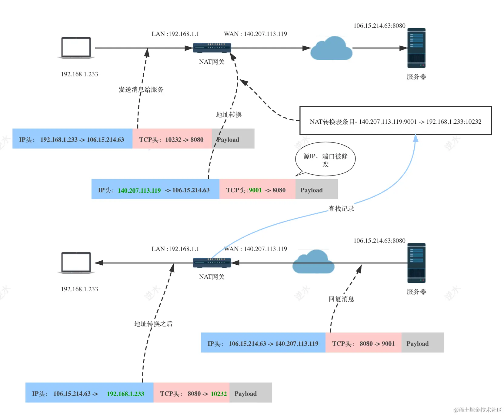


### 网络层行为

在一台linux主机中输入route可以看到如下路由表：

~~~shell
~# route -n
Kernel IP routing table
Destination     Gateway         Genmask         Flags Metric Ref    Use Iface
0.0.0.0         172.19.63.253   0.0.0.0         UG    100    0        0 eth0
172.17.0.0      0.0.0.0         255.255.0.0     U     0      0        0 docker0
172.18.0.0      0.0.0.0         255.255.0.0     U     0      0        0 docker_gwbridge
172.19.48.0     0.0.0.0         255.255.240.0   U     0      0        0 eth0
172.19.63.253   0.0.0.0         255.255.255.255 UH    100    0        0 eth0
~~~

| 属性        | 说明                                                         |
| ----------- | ------------------------------------------------------------ |
| destination | 目的网段；（0.0.0.0或default）表示通向默认网关。如果没有找到路由记录就走此网关 |
| Gateway     | 网关地址；（0.0.0.0）表示当前记录对应的目的网段跟本机在同一个网段，通信时不需要经过网关 |
| Genmask     | 子网掩码；目标IP和子网掩码做逻辑与计算可以得出目的网段       |
| Flags       | 标记；U 路由是活动的、H 目标是个主机、G 需要经过网关         |
| Metric      | 跳数;当有多个匹配的记录时，选择跳数最小的记录                |
| Iface       | 网卡；例如 eth0                                              |

如果**目的IP地址** 逻辑与 **子网掩码**（Genmask）等于**目的网段**(Destination)，就把这条消息发送到**此条目**指定的**网卡**（Iface）上。

### 链路层行为

ARP（Address Resolution Protocol）即地址解析协议， 用于实现从 IP 地址到 MAC 地址的映射。

### 直接交付

没有跨网段不需要经过路由器，那么就是直接交付

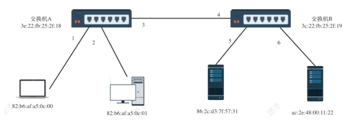

自学习算法，`82:b6:af:a5:0c:00`要给主机`82:b6:af:a5:0c:01`发消息，首先数据会到达交换机A，这时交换机A还不知道`82:b6:af:a5:0c:01`所在的端口，它会把消息交付给2、3端口（**这会导致不必要的开销**），同时记下端口1的MAC地址，这就是一次学习过程

### 间接交付

如果 IP 不在本网段内，那么直接发送到网关路由器上。

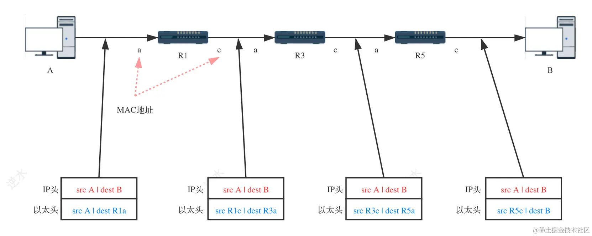

## 可靠连接

影响长连接稳定的因素：

- NAT网关地址转换表中的记录有一个老化时间（aging-time）属性，如果连接空闲超过这个时间，转换记录就会被删除

  | 地区/网络                   | NAT Aging-time |
  | --------------------------- | -------------- |
  | 中国移动4G                  | 1分钟          |
  | 中国移动3G、2G              | 5分钟          |
  | 中国联通2G、3G、4G          | 5分钟          |
  | 中国电信4G                  | 5分钟          |
  | 中国电信2G、3G              | 大于28分钟     |
  | 台湾和香港各大运营商 4G、3G | 大于28分钟     |
  | 美国各大运营商 4G、3G       | 大于28分钟     |

- 在建立连接（SYN包）时，防火墙会记录一条 tcp 会话数据，这个会话的也是有一个老化时间，连接空闲超时后，防火墙将从会话表中删除此 tcp 会话信息

- DHCP（动态主机配置协议）是一个局域网的网络协议。如果租约到期，而不自动续租导致IP变更，连接也就中断。不过这种情况很少见。

- 网络异常

  - 进入网络不稳定环境
  - 进入网络拥堵的环境
  - 网络切换等人为原因，比如 WIFI 切 5G 等。

- 进程 Crash

### 保活

首先我们来解决保活问题，一般通过心跳机制来处理这种问题。心跳指不间断的发送一个较小的数据包，保持长连接活跃。此外，它还有「死连检测」的作用。

从保活的角度，应该尽量使用较大的心跳间隔时间，达到减少系统开销。但是从检测的角度则，偏向使用较小的间隔时间，这样感知连接异常的延迟就越低

大多数操作系统都实现了 TCP Keepalive 机制，Golang 中的 TCPConn 库提供了 Keepalive 机制：

~~~go
// SetKeepAlive sets whether the operating system should send
// keep-alive messages on the connection.
func (c *TCPConn) SetKeepAlive(keepalive bool) error {
	if !c.ok() {
		return syscall.EINVAL
	}
	if err := setKeepAlive(c.fd, keepalive); err != nil {
		return &OpError{Op: "set", Net: c.fd.net, Source: c.fd.laddr, Addr: c.fd.raddr, Err: err}
	}
	return nil
}
~~~

tcp_keepalive 三个关键参数：

~~~shell
# cat /proc/sys/net/ipv4/tcp_keepalive_time
7200
# cat /proc/sys/net/ipv4/tcp_keepalive_intvl
75
# cat /proc/sys/net/ipv4/tcp_keepalive_probes
9
~~~

在连接闲置 tcp_keepalive_time（2小时）后，发送探测包。如果收到回应ACK，便认为连接正常；否则每间隔 tcp_keepalive_intvl（75秒） 发送探测包，一直到发送了 tcp_keepalive_probes（9）个探测包后，还未得到ACK回馈，便认为连接已经中断了。

操作系统提供的 TCP KeepAlive 机制不方便修改，因此我们在业务层中实现心跳机制。

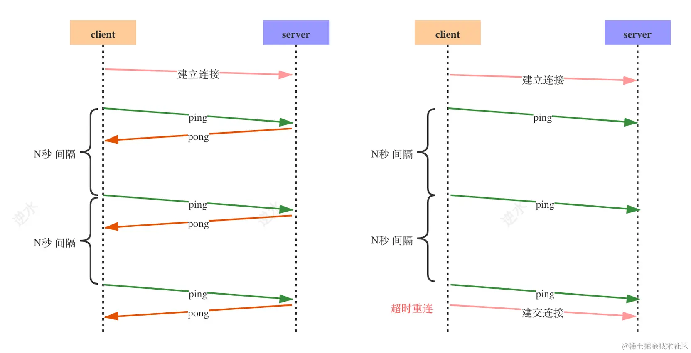

虽然 WebSocket 协议本身允许 Ping/Pong 消息，但并不是所有的 WebSocket API 都开放了这些功能。在一些情况下，库或框架可能会内部处理 Ping/Pong 消息。我们可以在业务层协议中，自定义心跳逻辑的实现

| 消息指令 Command | 消息长度 Length | 消息载体 Payload |
| :--------------: | :-------------: | :--------------: |
|     2 bytes      |     4 bytes     |     n bytes      |

### 自动重连

心跳可以解决 NAT 网关等问题，但是无法解决网络异常连接真实断开的场景，所以如果客户端发现TCP连接异常断开，就需要尝试重连

### 连接异常

如果服务的接入网关故障，一般有两种处理方式：

- SLB（Server Load Balancer）

  如果我们的网关是 Websocket 协议，可以使用 Nginx 等应用型负载均衡 ALB（Application Load Balancer）作为七层负载。如果是 TCP 协议，则可以使用传统型负载均衡 CLB（Classic Load Balancer）作为四层负载。

  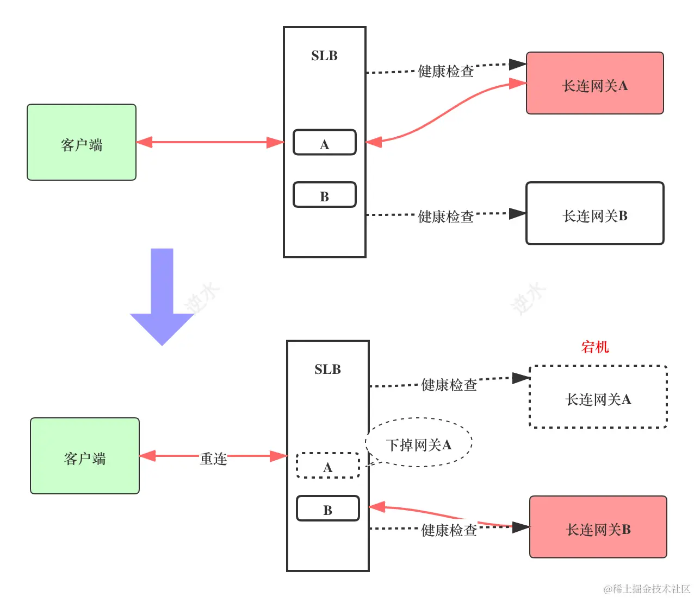

- CLB (Client Load Balancer)

  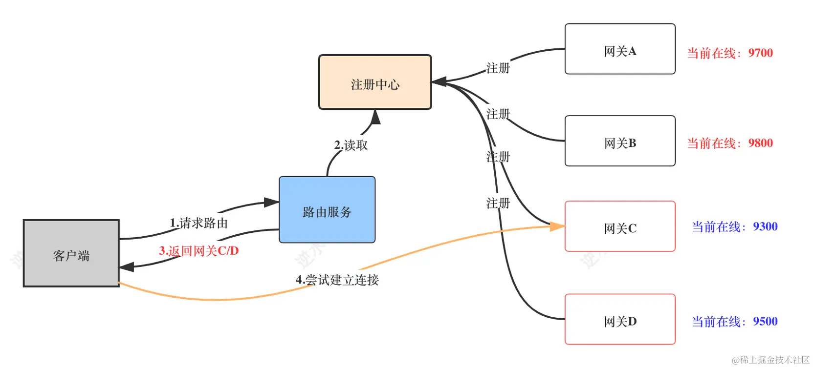

  CLB 把节点选择的逻辑放到了客户端。通过配置或者接口返回一批网关地址，由客户端选择一个正常的网关建立连接


## 网络传输

### 字节序

**0x00000201**的小端序（低位字节在低位地址）

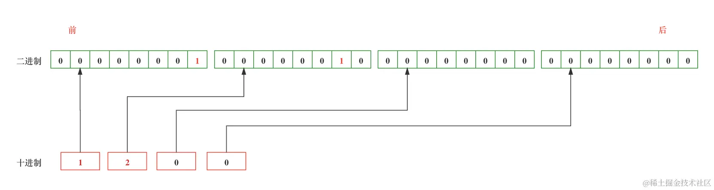

**0x00000201**的大端序（低位字节在高位地址）

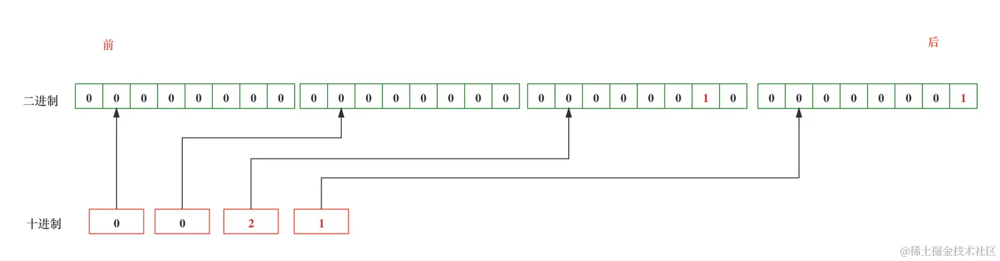

不同机器类型可能采用不同标准的字节序，所以在设计通信层协议时必须要考虑大小端问题：

~~~go
// golang
a := uint32(0x01020304)
arr := make([]byte, 4)
binary.BigEndian.PutUint32(arr, a)
t.Log(arr) //[1 2 3 4]

binary.LittleEndian.PutUint32(arr, a)
t.Log(arr) //[4 3 2 1]
~~~

### 序列化

常用的序列化框架：

- Fastjson/Jackson
- Thrift
- Protobuf
- Hessian

我们下面分别使用三种方法来序列化下面的对象：

~~~go
var pkt = struct {
        Source   uint32
        Sequence uint64
        Data     []byte
}{
        Source:   257,
        Sequence: 5,
        Data:     []byte("hello world"),
}
~~~

#### 自定义

~~~go
endian := binary.BigEndian

buf := make([]byte, 1024) // buffer
i := 0
endian.PutUint32(buf[i:i+4], pkt.Source)
i += 4
endian.PutUint64(buf[i:i+8], pkt.Sequence)
i += 8
dataLen := len(pkt.Data)
endian.PutUint32(buf[i:i+4], uint32(dataLen))
i += 4
copy(buf[i:i+dataLen], pkt.Data)
i += dataLen
~~~

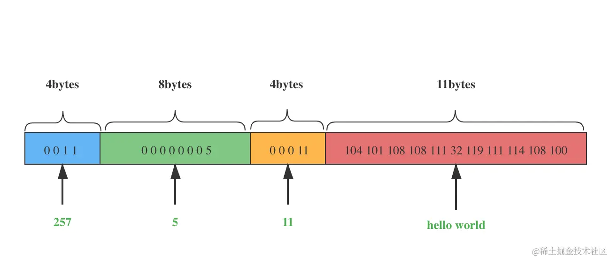

#### protobuf

定义相同结构的 message：

~~~protobuf
syntax = "proto3";
package pkt;
option go_package = "./pkt";

message Pkt {
    uint32 Source  = 1;
    uint64 Sequence = 3;
    bytes  Data = 5;
}
~~~

protoc -I proto/ --go_out=. proto/*.proto 编译成 go 文件

~~~go
type Pkt struct {
	state         protoimpl.MessageState
	sizeCache     protoimpl.SizeCache
	unknownFields protoimpl.UnknownFields

	Source   uint32 `protobuf:"varint,1,opt,name=Source,proto3" json:"Source,omitempty"`
	Sequence uint64 `protobuf:"varint,3,opt,name=Sequence,proto3" json:"Sequence,omitempty"`
	Data     []byte `protobuf:"bytes,5,opt,name=Data,proto3" json:"Data,omitempty"`
}
~~~

测试代码：

~~~go
p := Pkt{
        Source:   257,
        Sequence: 5,
        Data:     []byte("hello world"),
}
bts, err := proto.Marshal(&p)
~~~

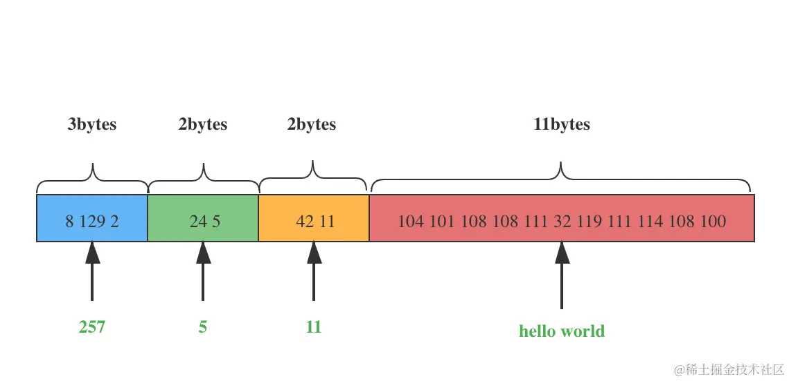

#### json 序列化

~~~go
p := Pkt{
        Source:   10000000,
        Sequence: 2<<60 + 3,
        Data:     []byte("hello world"),
}

bts, err = json.Marshal(&p)
~~~

#### 基准测试

环境：cpu: Intel(R) Core(TM) i5-8257U CPU @ 1.40GHz

| name     | t.N         | ns/op | B/op | allocs/op |
| -------- | ----------- | ----- | ---- | --------- |
| 自定义   | 290,041,615 | 4.299 | 0    | 0         |
| Protobuf | 5,633,020   | 205.6 | 56   | 2         |
| Json     | 2,686,958   | 432.8 | 104  | 2         |

- t.N 表示在2秒内一共执行了多少次
- op 表示一次操作

### 粘包与解包

TCP 协议是面向**字节流**传输数据的，也就是说，它所传输的数据是**无边界**的，数据的边界由上层协议（HTTP）来负责。

按照  RFC 标准实现的 WebSocket 的是不会产生[粘包](https://www.zhihu.com/search?q=粘包&search_source=Entity&hybrid_search_source=Entity&hybrid_search_extra={"sourceType"%3A"answer"%2C"sourceId"%3A53331153})、半包问题的，但是由于 WebSocket 实现者的偷懒，可能有这个问题。

### 魔数

在网络通信中，我们在协议头中加入魔数，有两个主要作用：

1. 快速过滤无效数据包。
2. 支持多种不同的协议。


## 架构设计

通信系统的多个架构方案及演变，但是本质上都是在`可扩展`、`高性能`与`高可用`这三个因素之间做出一定的取舍。


### 单体架构

在Web服务中，HTTP/1.x是一个无状态的协议，这里的**状态**指的是，每次请求的业务逻辑是独立的，请求之间的业务含义没有关联。

我们可以使用 Cookie + Session 技术来维护请求的状态。

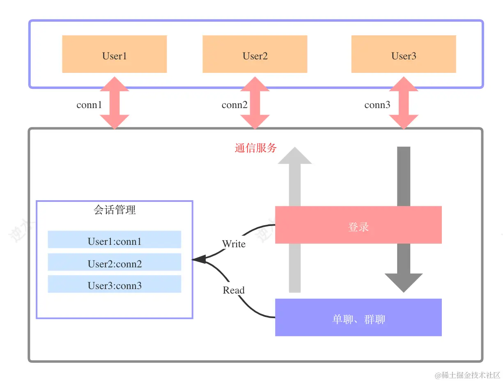

它读写逻辑简单，由于会话都在同一个进程内部，消息的转发效率非常高。但它主要有如下缺陷：

1. 单机的并发连接是有上限的，无法扩展。
2. 单点故障会导致系统不可用。

### 集群架构

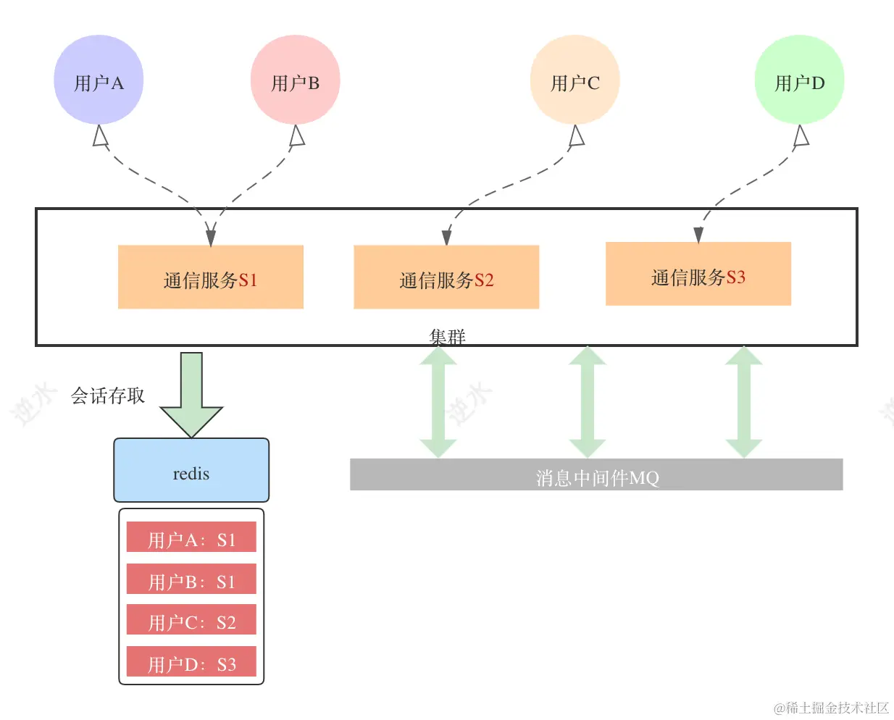

将用户与通信服务的关系记录在Redis 缓存，通信服务系统之间通过 MQ 来进行通信。

### 分布式架构

在微服务体系中，通常都会有网关层，它的作用如下：

- 服务聚合
- 鉴权
- 限流
- 路由
- 负载均衡

通过把鉴权、限流之类的通用逻辑分离到网关中，后端服务就只需要关注业务逻辑的实现，而且服务之间就可以直接调用，而无需实现鉴权逻辑。

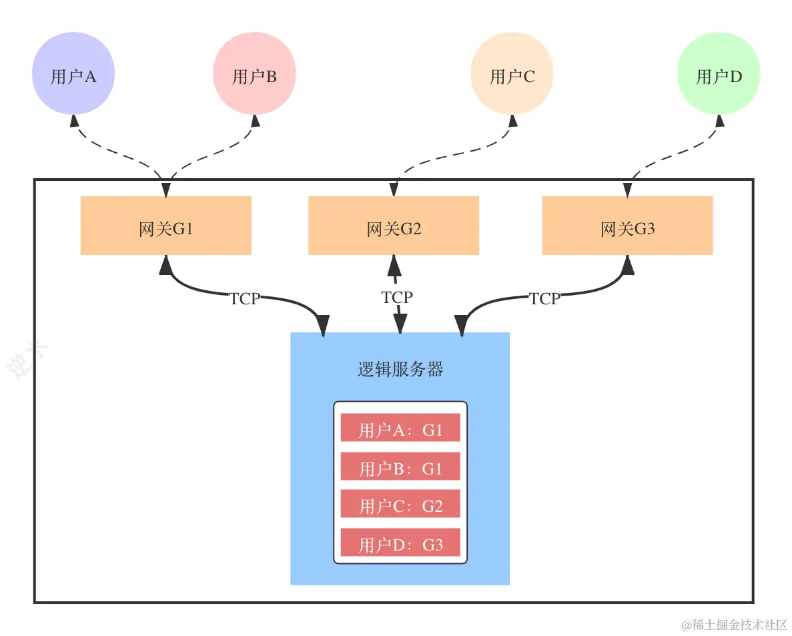

通过分层，网关与逻辑服务的职责就更加清晰：

1. 接入网关：
   - 维护与用户的长连接。
   - 转发消息到逻辑服务。
2. 逻辑服务：
   - 维护登录会话
   - 处理网关转发来的消息

如此依赖，消息链路如下：

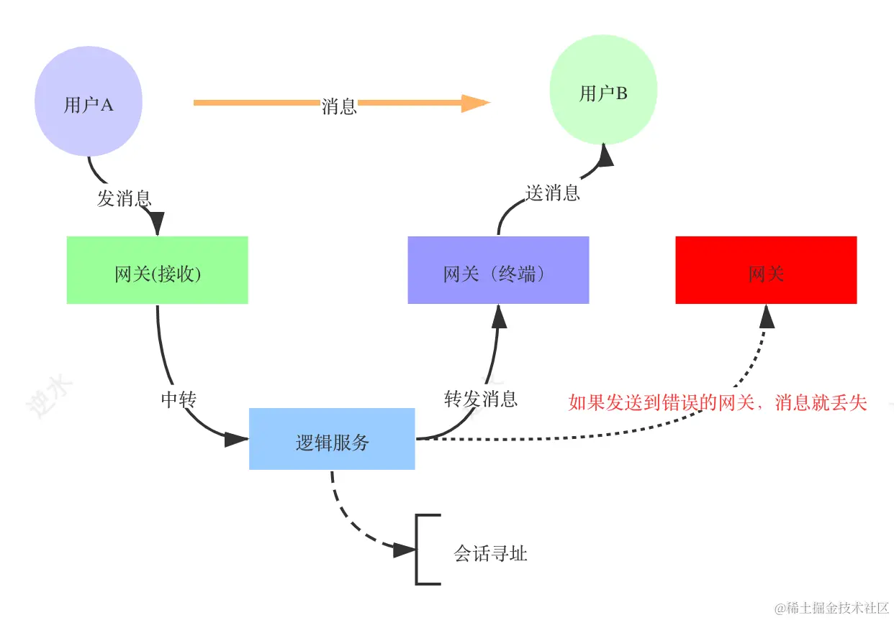

逻辑服务器就变为了一个有状态的服务，因为它维护了用户与网关的关系。

此外，我们还要解决逻辑服务器扩展问题，通常可以采用如下两种方案：

1. 在网关层通过**用户标签**来做路由，保证相同标签的用户永远登录到相同的逻辑服务
2. 把会话信息从逻辑服务中分离出去，保存到**高性能的缓存中间件**（如Redis）中，这样所有的逻辑服务器都通过这个缓存来读写会话信息，变为一个无状态的服务。这样会话被分离到进程之外，读写性能下降很多，消息的转发吞吐量会下降。但是更加灵活、简单及扩展性好。

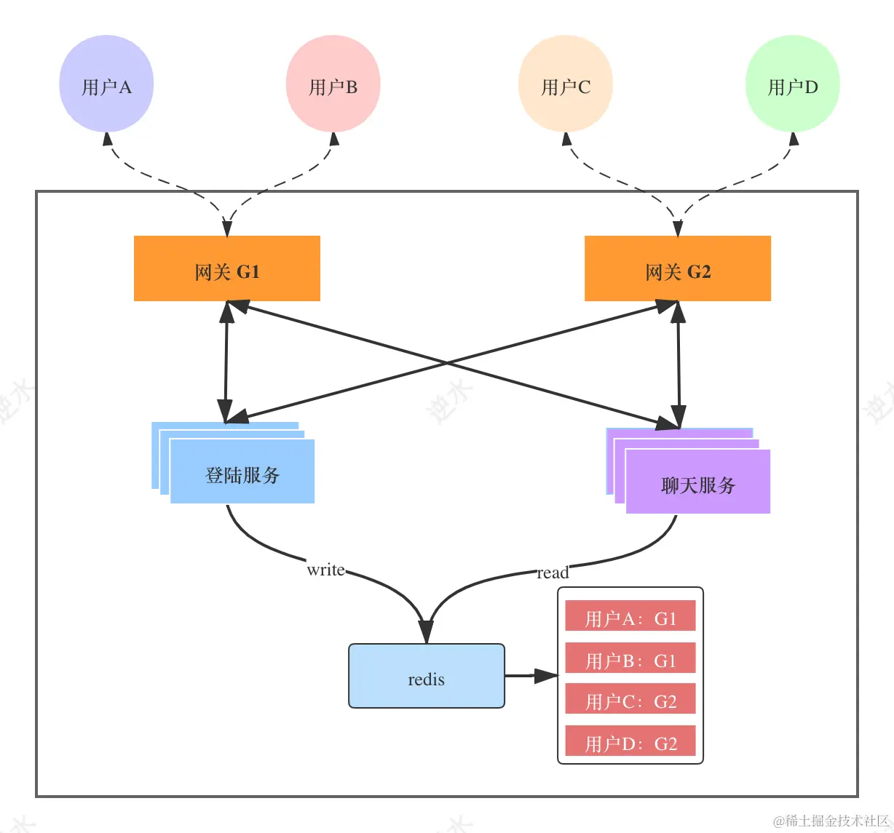


## 系统架构

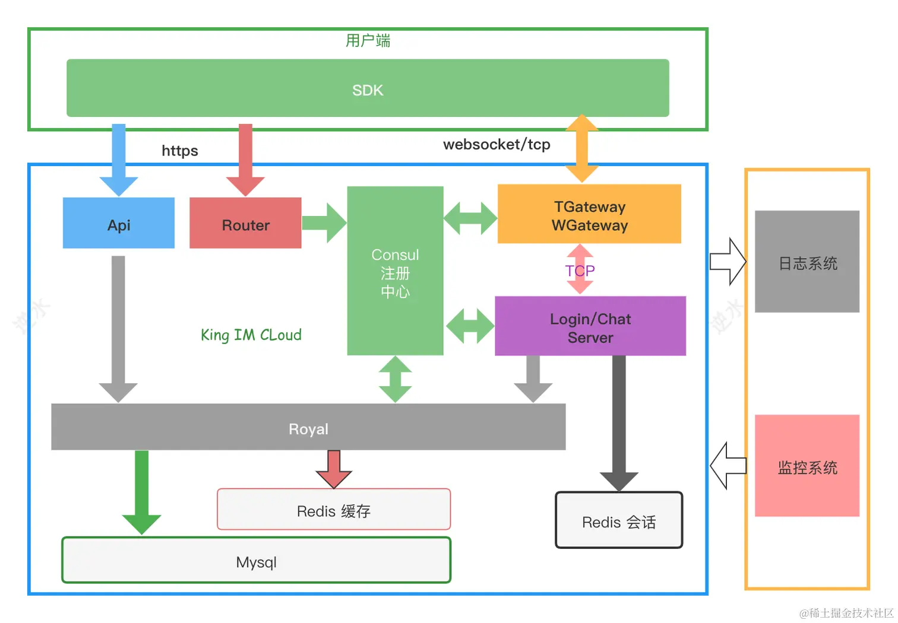

整个系统核心由 6 个核心服务组成，它们分别是：

- `ApiGateway`: API 接口网关，开放系统内部一些功能，供第三方开发。
- `Royal`: RPC 服务
- `Router`：网关层智能路由，SDK 通过调用 Router 提供的接口路由到指定的网关。
- `WGateway/TGateway`：长连接网关，与 `Router` 功能相同。 WGateway 提供 Websocket协议的连接服务，TGateway 提供 TCP 协议的连接服务。
- `LoginServer`：授权登录
- `ChatServer`：聊天服务

通过一个简化的时序图来看看服务之间的调用关系：

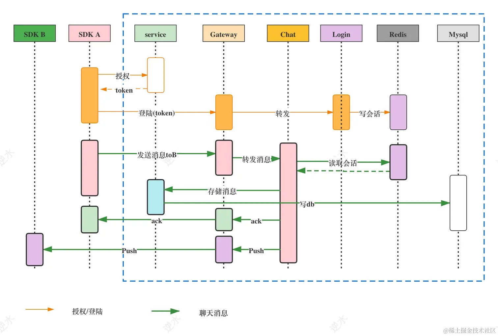

主要有两个逻辑：**授权登录**与**单聊消息**，整个系统都是以这两个逻辑为核心展开。

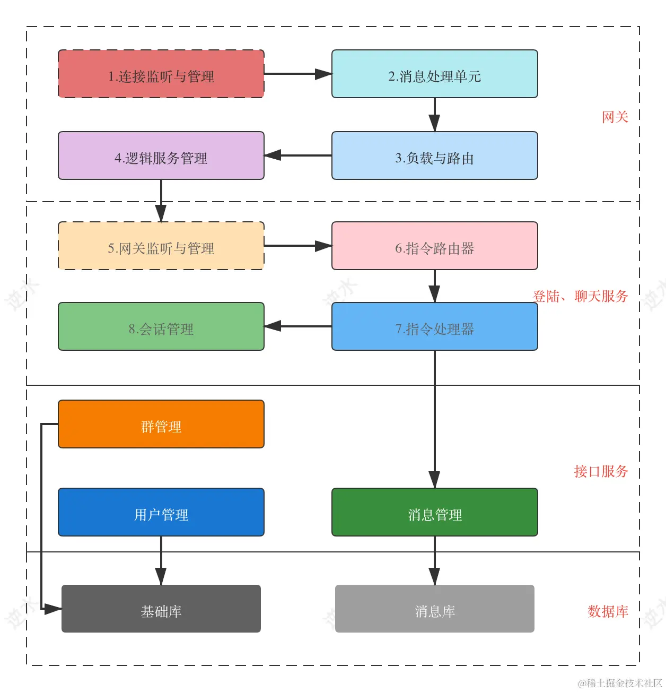

技术选型

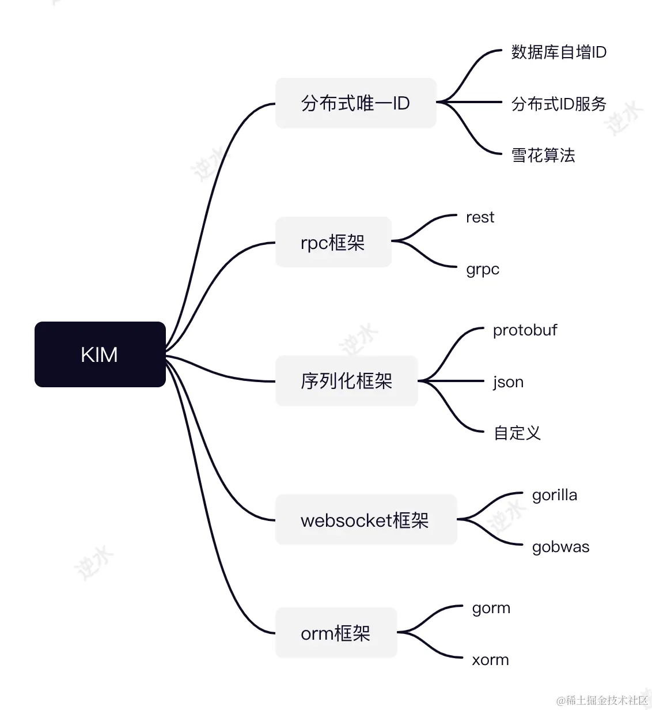

本项目使用 https://github.com/bwmarrin/snowflake 生成分布式ID。示例如下：

```golang
golang复制代码// Create a new Node with a Node number of 1
node, err := snowflake.NewNode(1)
if err != nil {
        fmt.Println(err)
        return
}
// Generate a snowflake ID.
id := node.Generate()
// Print out the ID in a few different ways.
fmt.Printf("Int64  ID: %d\n", id)
```

使用 snowflake 对有两点要注意：

- Make sure your system is keeping accurate system time

  > NTP（Network Time Protocol，网络时间协议）是由 RFC 1305 定义的时间同步协议，用来在分布式服务器和客户端之间进行时间同步。NTP 基于 UDP 报文进行传输，使用的 UDP 端口号为 123。

- Make sure you never have multiple nodes running with the same node ID

RPC框架 = 通信协议 + 序列化

|          | REST     | GPRC     |
| -------- | -------- | -------- |
| 通信协议 | HTTP/1.1 | HTTP/2   |
| 序列化   | Json     | Protobuf |

虽然 GRPC 的性能更好，不过它也有一些缺点：

- 长连接会导致 SLB 负载不均衡
- GRPC 服务注册与发现相对复杂些
- 对测试不友好

这里出于方便开发的目的，我们这里使用 REST


golang 的 websocket 库：

- [github.com/gorilla/web…](https://link.juejin.cn/?target=https%3A%2F%2Fgithub.com%2Fgorilla%2Fwebsocket) 15k Star。使用简单
- [github.com/gobwas/ws](https://link.juejin.cn/?target=https%3A%2F%2Fgithub.com%2Fgobwas%2Fws) 3.9k Star。 对底层的逻辑开放的更多，使用时需要有一点websocket 协议基础知识

这里我们选用 gorilla


我们使用 gorm 作为 orm 框架。

通常使用 OSS（比如阿里OSS）作为图片的存储方案。在 IM 系统中发送的图片与视频，通常是先上传到OSS，再把 url 通过消息发送出去


## 通信层

在前面的架构设计中，系统被划分为了三个层级：SDK层、网关层、逻辑服务层。如此一来，用户 A 发送给用户 B 一条消息，要经过四个长连接通道。

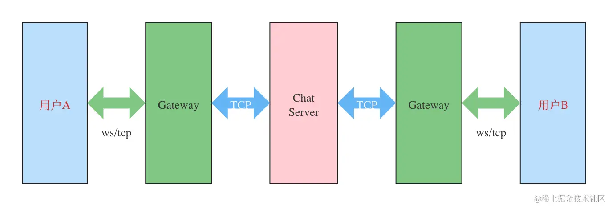

我们要管理这些长连接通道，必须把**端口监听、拨号连接、消息发送、消息接收、心跳、连接管理**等相同的逻辑实现多次！下面我们通过分析与抽象，把 websocket 和 tcp 协议封装到通信层内部，提供抽象接口给上层使用，达到业务逻辑与通信协议解耦的目的。

通过通信层的逻辑内聚，极大的简化了业务层的逻辑。通过对通信层的封装，对上层业务透明，高内聚与低耦合带来的系统层次非常分明，而且逻辑也更清晰。


我们先来了解系统内部的一个大致逻辑关系：

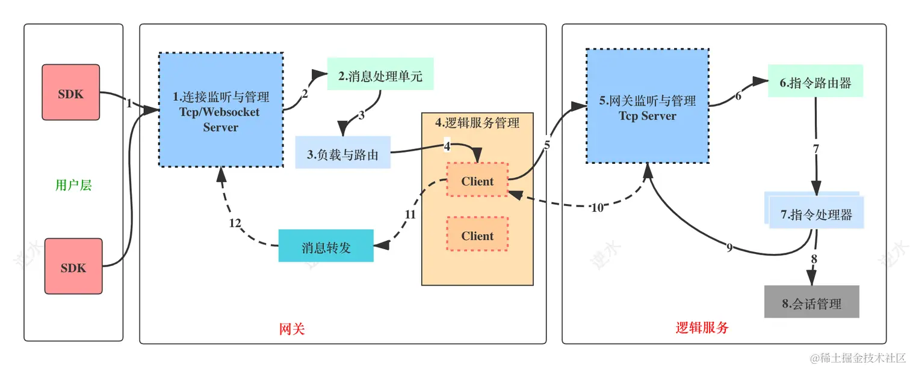

这里的 Server 接口设计如下：

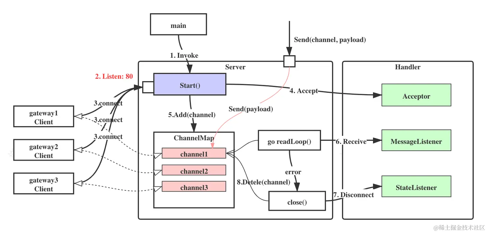

设计要点如下：

1. Server 提供 Start 方法，上层业务用它来启动服务并监听端口。但是 Server 内部无法处理连接的握手逻辑，需要回调给上层处理。此外，Server 在内部会自动维护连接列表 ChannelMap
2. Server在 Accept 一个连接之后，就会执行`go readloop()`循环读取通道中的数据，并且把读取的消息回调给上层业务处理器。
3. 当检测到连接断开，需要告知上层业务。
4. 提供一个 Push 方法，上层业务逻辑可以指定 Channel 对象，把消息 Push 到客户端。

**最终我们得到如下定义**：

```go
// server.go
type Server interface {
    SetAcceptor(Acceptor)
    SetMessageListener(MessageListener)
    SetStateListener(StateListener)
    SetReadWait(time.Duration)
    SetChannelMap(ChannelMap)
    
    Start() error
    Push(string, []byte) error
    Shutdown(context.Context) error
}
```

1. `SetAcceptor`：用于设置一个 Acceptor，在 Server 的 Start() 方法中监听到连接之后，就要调用这个 Accept 方法，通知上层业务处理握手相关工作

   ~~~go
   type Acceptor interface {
   	Accept(Conn, time.Duration) (string, error)
       // Accept 方法返回两个信息：
       // 1. channelID: 一个唯一通道标识
       // 2. error:
   }
   ~~~

2. `SetStateListener`：用于设置一个状态监听器，将连接断开的事件上报给业务层

   ~~~go
   type StateListener interface {
   	Disconnect(string) error
   }
   ~~~

3. `SetReadWait`：设置连接读超时，用于控制心跳逻辑。

4. `SetChannelMap`： 设置一个连接管理器，Server 在内部会自动管理连接的生命周期

   ~~~go
   type ChannelMap interface {
   	Add(channel Channel)
   	Remove(id string)
   	Get(id string) (Channel,bool)
   	All() []Channel
   }
   ~~~

5. `SetMessageListener`：用于设置一个消息监听器

   ~~~go
   type MessageListener interface {
   	Receive(Agent, []byte)
   }
   
   type Agent interface {
   	ID() string
   	Push([]byte) error
   }
   ~~~

   Agent 表示发送方，ID 是连接的 channelID，而 Push 用于让上层业务向发送方返回消息。


因为我们要封装 TCP/WebSocket 协议，因此我们要进行协议抽象

~~~go
// server.go
type Frame interface {
	SetOpCode(OpCode)
	GetOpCode() OpCode
	SetPayload([]byte)
	GetPayload() []byte
}

const (
	OpContinuation OpCode = 0x0
	OpText         OpCode = 0x1
	OpBinary       OpCode = 0x2
	OpClose        OpCode = 0x8
	OpPing         OpCode = 0x9
	OpPong         OpCode = 0xa
)
~~~

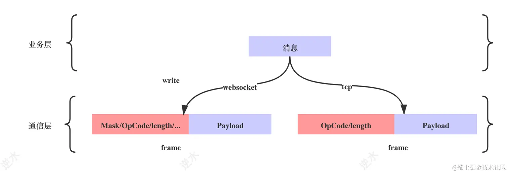

此外，我们对 net.Conn 进行二次包装，把读与写的操作封装到连接中：

~~~go
type Conn interface {
	net.Conn
	ReadFrame() (Frame, error)
	WriteFrame(OpCode, []byte) error
	Flush() error
}
~~~

Server 端管理的对象就是 Channel，而不是 Conn 连接对象。原因在于Conn只提供了两个最基本的 Frame 读写的方法，它是一个相对底层的接口，而 Channel 则是相对上层的接口，也就是说 kim.Conn 更抽象简单，而 kim.Channe l功能更强。如下图是三者的关系：

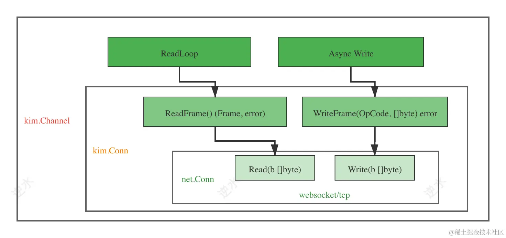

kim.Conn的意义在于解决了websocket/tcp两种协议读、写逻辑上的差异

Client 接口设计：

~~~go
type Client interface {
	ID() string
	Name() string
	Connect(string) error
	SetDialer(Dialer)
	Send([]byte) error
	Read() (Frame, error)
	Close()
}
~~~

- 建立连接，握手的逻辑是要回调给上层处理

- 读取一个 Frame 的消息

- 发送一个 Frame 的消息

- 关闭连接

- Connect：主动向一个服务器发起连接

- SetDialer：设置一个拨号器，这个方法会在 Connect 中被调用，完成连接的建立和握手

  ~~~go
  // server.go
  type Dialer interface {
  	DialAndHandshake(DialerContext) (net.Conn, error)
  }
  type DialerContext struct {
  	Id      string
  	Name    string
  	Address string
  	Timeout time.Duration
  }
  ~~~


Push 的处理逻辑

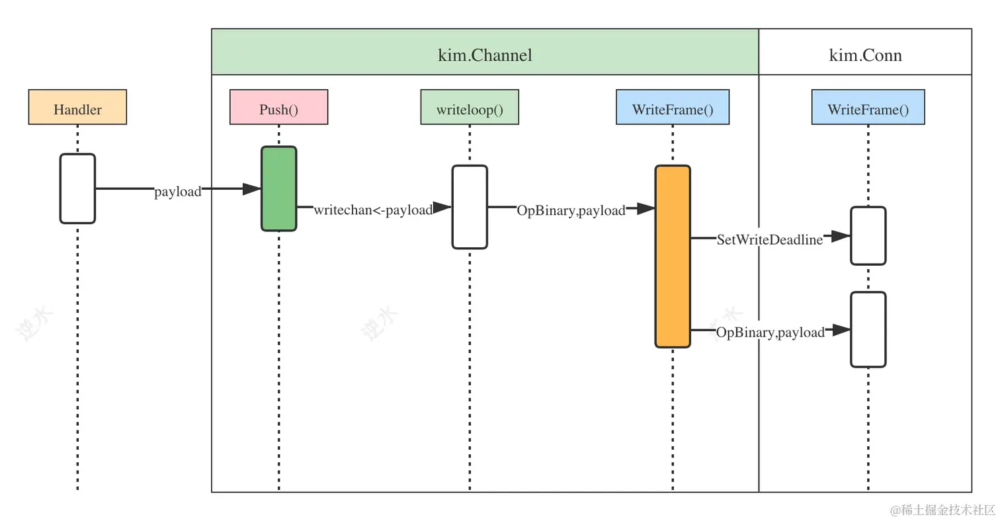

通信层框架的总体调用关系

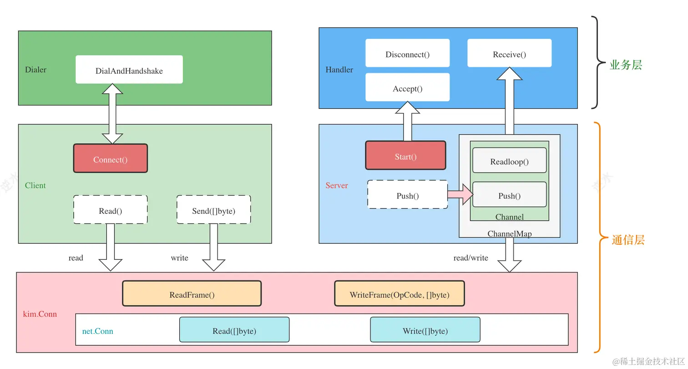

- 通信层核心逻辑：`Client.Connect()` 与 `Server.Start()`。
- 业务层使用的主要方法：`Client.Read()`、`Client.Send()` 和 `Server.Push()`。
- 交给业务层来处理「协议连接差异性问题」的核心回调方法：`DialAndHandshake()`、`Accept()`、`Receive()` 和 `Disconnect()`。
- 解决了「协议格式差异问题」的两个核心方法：ReadFrame 和 WriteFrame。
