## 目录结构


整个通信系统分为：基础层、通信层、容器层、链路层、控制层。

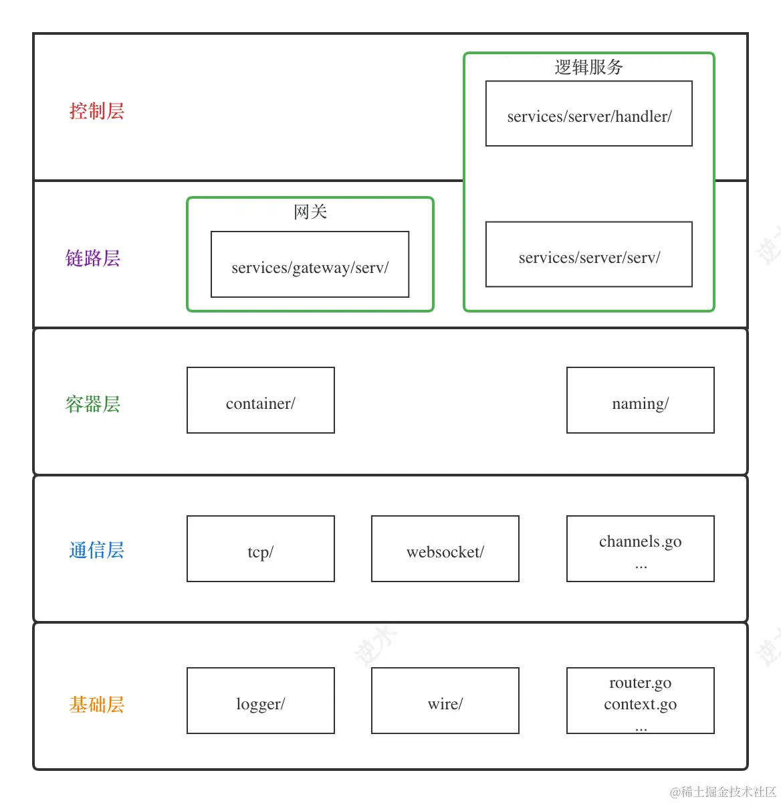

业务层包括了链路层与控制层，代码在`/services/`目录中：

## 逻辑协议

与 HTTP 类似，在通信系统中，也需要设计一套协议。一个协议通常由两部分组成：协议头、协议体。为了和通信层中的协议（WebSocket、TCP、自定义二进制协议）做出区分，我们称这里的协议为逻辑协议。

~~~go
// 给它定义一个名称逻辑协议，与后面的基础协议分开。
type LogicPkt struct {
	Header
	Body []byte `json:"body,omitempty"`
}
~~~

body 对通信层来说不重要，它在「指令处理器」中被解析并处理。通信层处理的主要对象就`Header`。

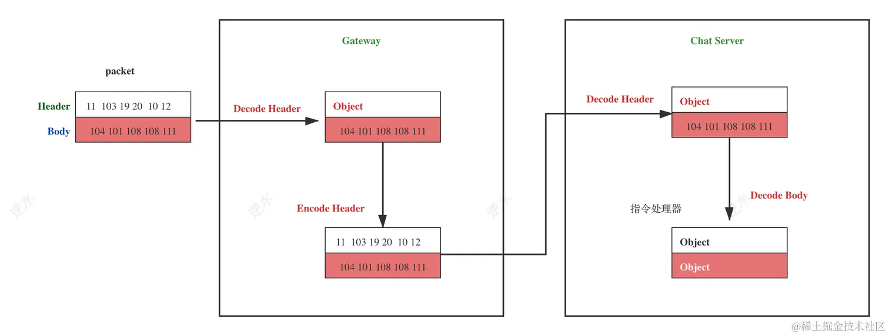

Header 指消息头，在通信系统中我们直接使用 **protobuf** 来序列化Header，格式如下：

|    属性    |  类型  |      说明      |
| :--------: | :----: | :------------: |
|  command   | string |      指令      |
| channelId  | string |    连接标识    |
|  sequence  | uint32 |     序列号     |
|    flag    |  enum  |      标识      |
|   status   |  enum  |     状态码     |
|    dest    | string | 目标：群、用户 |
| bodyLength | uint32 |  消息体的长度  |

- `command`：由于我们把逻辑服务分成多个子服务，因此在网关层就需要一个标识知道消息包是转发给哪个服务。所以在 command 中定义了一个通过格式：`服务名.指令`

  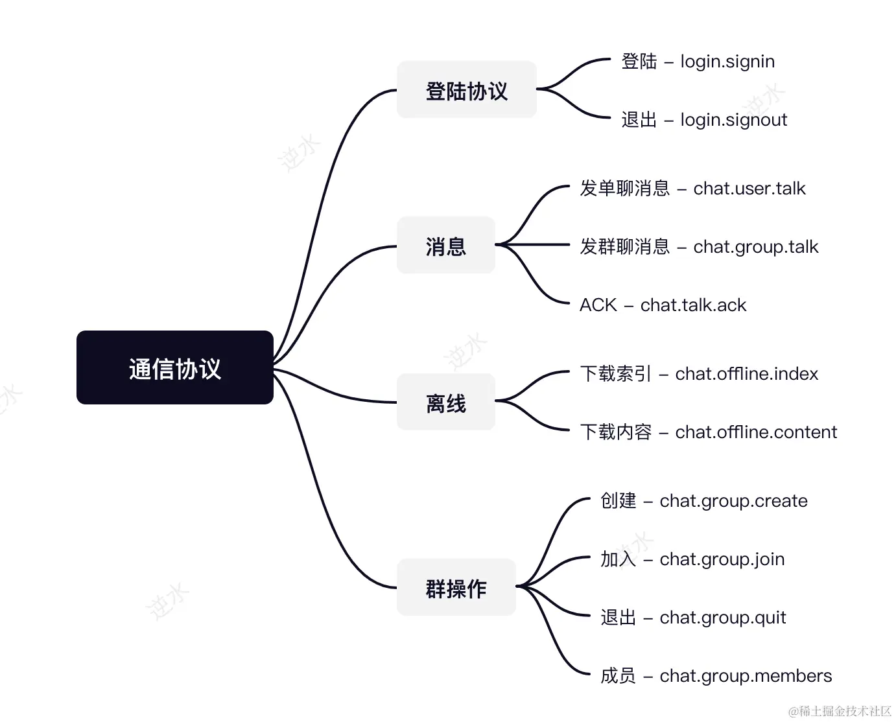

- `channelId`：用户的唯一标识 `Account`。连接的唯一标识 `channelId`。

  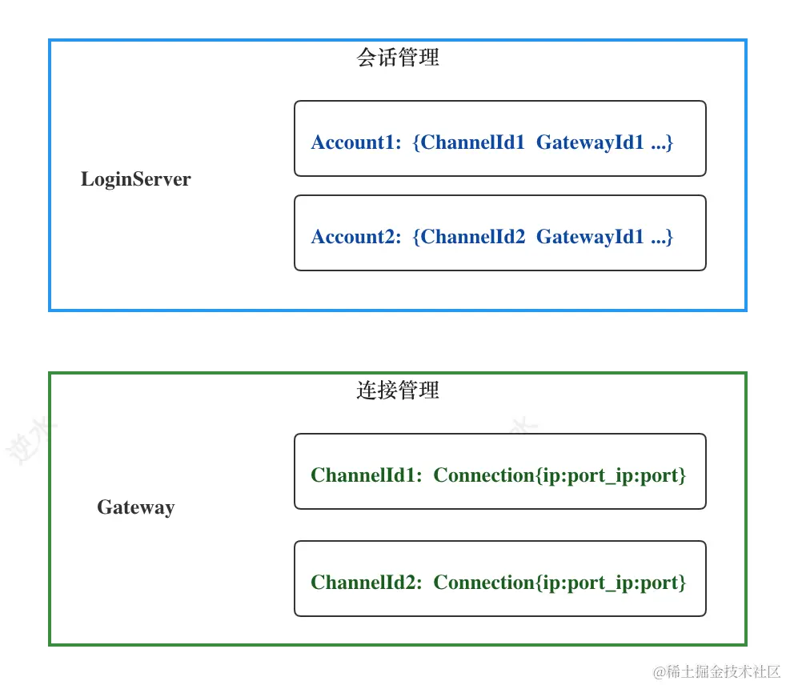

  用户标识也是全局唯一，为什么不直接使用用户标识？用户标识在空间维度是唯一的，但是在时间维度是不唯一。简单来说就是同一个用户账号存在同时登录的情况，导致系统在某个时刻有多个相同账号的连接，会造成逻辑混乱。

- `sequence`：长连接通信协议是一个「全双工」协议，它与 Http1.x 「半双工协议」的区别在于消息的发送与接收是没有顺序要求的

  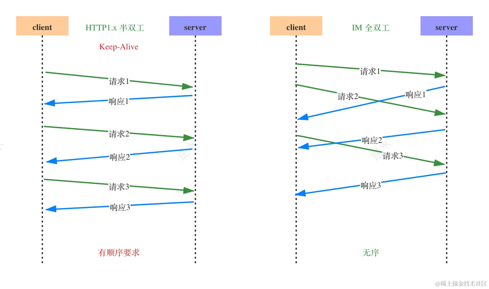

  全双工通信协议通常在协议头中有个序列号字段。这样请求与响应就可以相互配对了。

- `dest`：用于指定消息的接收方，在IM系统中有两类：用户和群，分别用 Account 和 GroupId 表示。系统通过 Command 请求头来判断这个字段值是 Account 还是 GroupId。

## 基础协议

我们直接在「逻辑协议」的基础上添加心跳指令，是不太合适的，原因主要有两点：

1. 心跳在网关层就返回，不应该转发给逻辑服务处理。
2. 心跳包要尽量小，逻辑协议的 Header 太重。

因此，我们设计一个简单的基础协议，来处理一些轻量的消息：

| 消息指令 Command | 消息长度 Length | 消息载体 Body |
| :--------------: | :-------------: | :-----------: |
|      2bytes      |     2bytes      |    n bytes    |

~~~go
type BasicPkt struct {
	Code   uint16
	Length uint16
	Body   []byte
}
~~~

| 协议code | 说明 |
| :------: | :--: |
|    1     | ping |
|    2     | pong |

body 为空的情况下，包的长度就是:$$4(magic)+2(code)+2(Length) = 8byte$$

### 序列化

「逻辑协议」与「基础协议」都实现了 Packet 接口。它有两个方法，Decode 反序列化和Encode 序列化

~~~go
type Packet interface {
	Decode(r io.Reader) error
	Encode(w io.Writer) error
}
~~~

### 协议区分

我们通过 Magic 来区分「逻辑协议」与自定义二进制的「基础协议」

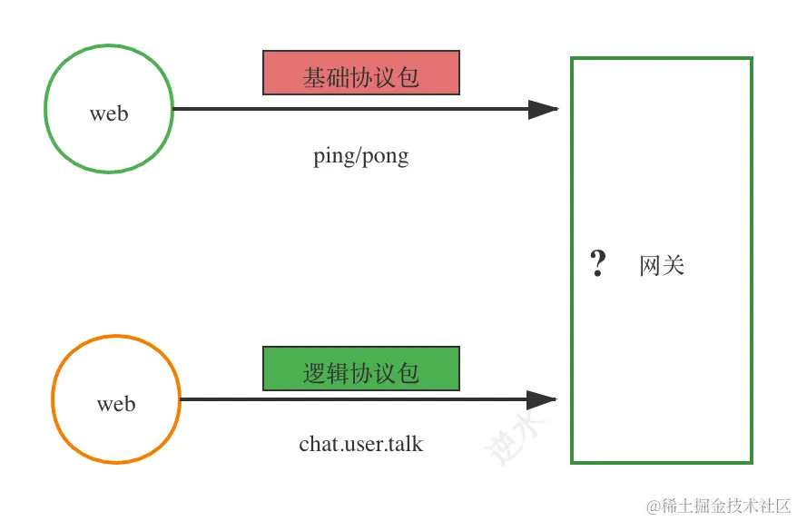

~~~go
type Magic [4]byte

var (
	MagicLogicPkt = Magic{0xc3, 0x11, 0xa3, 0x65} //逻辑协议
	MagicBasicPkt = Magic{0xc3, 0x15, 0xa7, 0x65} //基础协议
)
~~~

协议区分的具体代码：

~~~go
type Magic [4]byte

var (
	MagicLogicPkt = Magic{0xc3, 0x11, 0xa3, 0x65} //逻辑协议
	MagicBasicPkt = Magic{0xc3, 0x15, 0xa7, 0x65} //基础协议
)

func Read(r io.Reader) (interface{}, error) {
	magic := wire.Magic{}
    
    // 它的作用是从指定的读取器（Reader）读取足够的数据来填满给定的切片
	_, err := io.ReadFull(r, magic[:])
	if err != nil {
		return nil, err
	}
	switch magic {
	case wire.MagicLogicPkt:
		p := new(LogicPkt)
		if err := p.Decode(r); err != nil {
			return nil, err
		}
		return p, nil
	case wire.MagicBasicPkt:
		p := new(BasicPkt)
		if err := p.Decode(r); err != nil {
			return nil, err
		}
		return p, nil
	default:
		return nil, errors.New("magic code is incorrect")
	}
}
~~~

把 Magic 封装到消息头部的方法：

~~~go
func Marshal(p Packet) []byte {
	buf := new(bytes.Buffer)
    
    // 使用反射获取 Packet 实现的具体类型。
	kind := reflect.TypeOf(p).Elem()
        
	if kind.AssignableTo(reflect.TypeOf(LogicPkt{})) {
		_, _ = buf.Write(wire.MagicLogicPkt[:])
	} else if kind.AssignableTo(reflect.TypeOf(BasicPkt{})) {
		_, _ = buf.Write(wire.MagicBasicPkt[:])
	}
	_ = p.Encode(buf)
	return buf.Bytes()
}
~~~

## 容器层

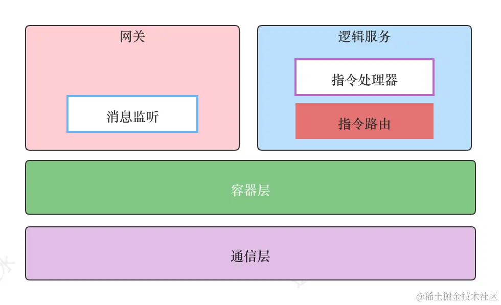

容器层的作用：

1. 委托 Server
2. 维护服务的依赖关系
3. 处理消息上下行

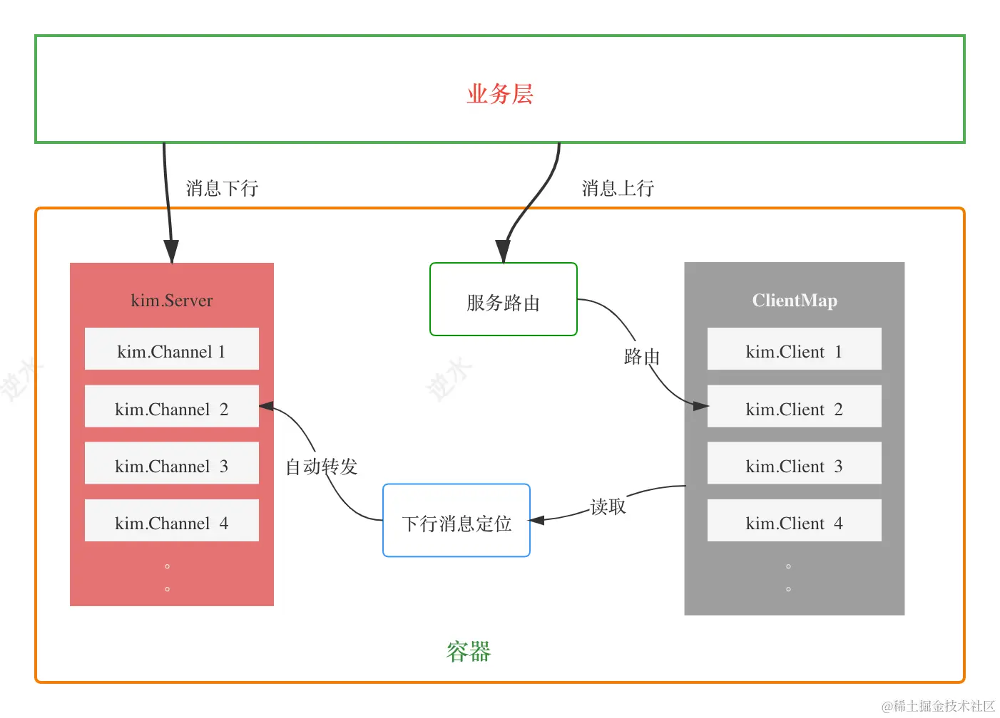

总之，它极大减少了业务层（网关与逻辑服务）的重复性工作。

~~~go
// Container Container
type Container struct {
	sync.RWMutex
	Naming naming.Naming
	// Server 是上层实例化之后注入到 Container
	Srv kim.Server
	// 容器的状态
	state uint32
	// ClientMap与通信层中的ChannelMap类似
	// 比如在下游服务（网关）中与依赖的服务（如Login Server）建立的连接就被包装为Client
	// 而在Login Server中与网关建立的连接就被包装为Channel
	// 并且kim.Client的整个生命周期都是在Container内部自动处理，无需上层业务关心
	// 这里的 key 是服务名
	srvclients map[string]ClientMap

	// Selector 则是在消息上行时，用于从一批服务列表中选择一个合适的服务
	selector Selector
    
	// ，唯一需要上层逻辑参与的地方就是创建Client时的拨号与握手，它是通过kim.Dialer接口暴露给上层的。
	dialer kim.Dialer

	//  这里的 key 是服务名
	deps map[string]struct{}
}

// Selector is used to select a Service
type Selector interface {
	Lookup(*pkt.Header, []kim.Service) string
}

~~~

由于 Container 的特性，我们使用单例模式来初始化 Container 对象。

~~~go
var c = &Container{
	state:    0,
	selector: &HashSelector{},
	deps:     make(map[string]struct{}),
}

type HashSelector struct {
}

// Lookup a server
func (s *HashSelector) Lookup(header *pkt.Header, srvs []kim.Service) string {
	ll := len(srvs)
	// ChannelId 通过 crc32 算法得到一个数字
	code := HashCode(header.ChannelId)
	return srvs[code%ll].ServiceID()
}


// Init Init
// 比如在网关中就依赖 login 和 chat 服务，它的初始化调用就是这样的：
// _ = container.Init(srv, wire.SNChat, wire.SNLogin)
// 而在chat服务中，由于目前它没有依赖其它长连服务，因此它的始终化就是这样的：
// _ = container.Init(srv)
func Init(srv kim.Server, deps ...string) error {
	if !atomic.CompareAndSwapUint32(&c.state, stateUninitialized, stateInitialized) {
		return errors.New("has Initialized")
	}
	c.Srv = srv
	for _, dep := range deps {
		if _, ok := c.deps[dep]; ok {
			continue
		}
		c.deps[dep] = struct{}{}
	}
	log.WithField("func", "Init").Infof("srv %s:%s - deps %v", srv.ServiceID(), srv.ServiceName(), c.deps)
	c.srvclients = make(map[string]ClientMap, len(deps))
	return nil
}
~~~


### 消息上下行

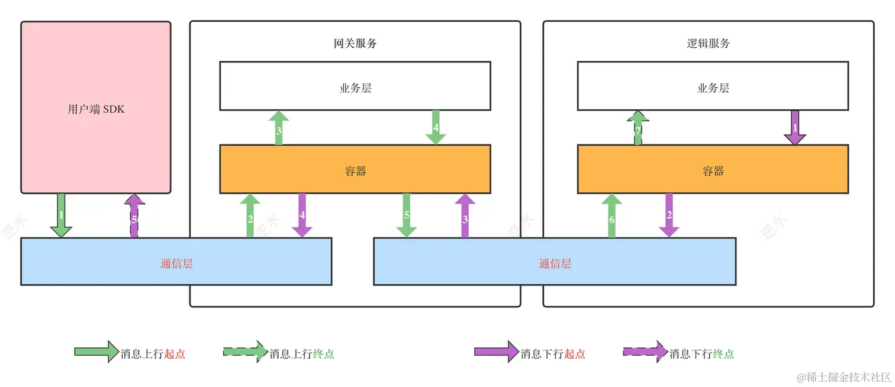

在上面的框架图中，读者应该注意到了，在网关服务中，容器会处理从Client （逻辑服务是服务端）读取的消息，并根据我们设计的定位规则，把消息  写到指定 Server 的 Channel 中，从而推送到客户端。

~~~go
// 消息通过网关服务器推送到 channel 中
func pushMessage(packet *pkt.LogicPkt) error {
	// 这里的关键就是packet的Header中Meta信息，它附带的两个值，这个值会在发送时设置（逻辑服务中）：
	// wire.MetaDestServer: 消息抵达的服务
	// wire.MetaDestChannels：消息接收方，这是一个列表，也就是一个消息是可以推送给多个用户。
	server, _ := packet.GetMeta(wire.MetaDestServer)
	if server != c.Srv.ServiceID() {
		return fmt.Errorf("dest_server is not incorrect, %s != %s", server, c.Srv.ServiceID())
	}
	channels, ok := packet.GetMeta(wire.MetaDestChannels)
	if !ok {
		return fmt.Errorf("dest_channels is nil")
	}

	channelIds := strings.Split(channels.(string), ",")
	packet.DelMeta(wire.MetaDestServer)
	packet.DelMeta(wire.MetaDestChannels)
	payload := pkt.Marshal(packet)
	log.Debugf("Push to %v %v", channelIds, packet)

	for _, channel := range channelIds {
		err := c.Srv.Push(channel, payload)
		if err != nil {
			log.Debug(err)
		}
	}
	return nil
}

~~~


在逻辑服务中，消息是被上层业务手动调用容器中的 Push 方法，把消息发送给网关的，代码如下：

~~~go
package container

func Push(server string, p *pkt.LogicPkt) error {
    // 消息附上一个 MetaDestServer
    /**
    const (
        // 消息将要送达的网关的ServiceName
        MetaDestServer = "dest.server"
        // 消息将要送达的channels
        MetaDestChannels = "dest.channels"
    )
    */
	p.AddStringMeta(wire.MetaDestServer, server)
    // c.Srv 就是一个Server对象
	return c.Srv.Push(server, pkt.Marshal(p))
}
~~~

~~~go
func (p *LogicPkt) AddStringMeta(key, value string) {
	p.AddMeta(&Meta{
		Key:   key,
		Value: value,
        /**
        const (
            MetaType_int    MetaType = 0
            MetaType_string MetaType = 1
            MetaType_float  MetaType = 2
        )
        */
		Type:  MetaType_string,
	})
}

func (p *LogicPkt) AddMeta(m ...*Meta) {
	p.Meta = append(p.Meta, m...)
}
~~~

逻辑协议头的实现：

~~~go
package pkt

type Header struct {
	state         protoimpl.MessageState
	sizeCache     protoimpl.SizeCache
	unknownFields protoimpl.UnknownFields

	Command string `protobuf:"bytes,1,opt,name=command,proto3" json:"command,omitempty"`
	// sender channel id
	ChannelId string `protobuf:"bytes,2,opt,name=channelId,proto3" json:"channelId,omitempty"`
	Sequence  uint32 `protobuf:"varint,3,opt,name=sequence,proto3" json:"sequence,omitempty"`
	Flag      Flag   `protobuf:"varint,4,opt,name=flag,proto3,enum=pkt.Flag" json:"flag,omitempty"`
	Status    Status `protobuf:"varint,5,opt,name=status,proto3,enum=pkt.Status" json:"status,omitempty"`
	// destination is defined as a account,group or room
	Dest string  `protobuf:"bytes,6,opt,name=dest,proto3" json:"dest,omitempty"`
	Meta []*Meta `protobuf:"bytes,7,rep,name=meta,proto3" json:"meta,omitempty"`
}
~~~


消息上行主要用于 **下游服务（长连网关）** 发送消息到**上游服务（如LoginServer）** 。因此容器开放了两个方法：`Forward`和`ForwardWithSelector`。

~~~go
// Forward message to service
func Forward(serviceName string, packet *pkt.LogicPkt) error {
	if packet == nil {
		return errors.New("packet is nil")
	}
	if packet.Command == "" {
		return errors.New("command is empty in packet")
	}
	if packet.ChannelId == "" {
		return errors.New("ChannelId is empty in packet")
	}
	return ForwardWithSelector(serviceName, packet, c.selector)
}

// Forward 使用了默认的 c.selector，而 ForwardWithSelector 可以动态指定一个 Selector
// ForwardWithSelector forward data to the specified node of service which is chosen by selector
func ForwardWithSelector(serviceName string, packet *pkt.LogicPkt, selector Selector) error {
	cli, err := lookup(serviceName, &packet.Header, selector)
	if err != nil {
		return err
	}
    
	// add a tag in packet
	packet.AddStringMeta(wire.MetaDestServer, c.Srv.ServiceID())
	log.Debugf("forward message to %v with %s", cli.ID(), &packet.Header)
	return cli.Send(pkt.Marshal(packet))
}
~~~

它们的第一个参数就是`serviceName`服务名，在系统中，我们需要给每个服务定义一个名称，它们定义在了 `wire` 包中的 `definitions.go` 文件中

```go
// Service Name 定义统一的服务名
const (
	SNWGateway = "wgateway"
	SNTGateway = "tgateway"
	SNLogin    = "login" //login
	SNChat     = "chat" //chat
)
```

消息上行关键的一步是  `lookup`，它根据服务名路由/负载均衡一个客户端，然后将消息发送到该客户端中。loopup 的实现：

~~~go
func lookup(serviceName string, header *pkt.Header, selector Selector) (kim.Client, error) {
	clients, ok := c.srvclients[serviceName]
	if !ok {
		return nil, fmt.Errorf("service %s not found", serviceName)
	}
	// 只获取状态为StateAdult的服务
	srvs := clients.Services(KeyServiceState, StateAdult)
	if len(srvs) == 0 {
		return nil, fmt.Errorf("no services found for %s", serviceName)
	}
	id := selector.Lookup(header, srvs)
	if cli, ok := clients.Get(id); ok {
		return cli, nil
	}
	return nil, fmt.Errorf("no client found")
}
~~~

这里我们会有疑惑：c.srvclients 从何而来？实际上在容器的 Start() 方法中，调用`connectToService`来完成初始化的

~~~go
func lookup(serviceName string, header *pkt.Header, selector Selector) (kim.Client, error) {
	clients, ok := c.srvclients[serviceName]
	if !ok {
		return nil, fmt.Errorf("service %s not found", serviceName)
	}

	// 只获取状态为 StateAdult 的服务
	srvs := clients.Services(KeyServiceState, StateAdult)
	if len(srvs) == 0 {
		return nil, fmt.Errorf("no services found for %s", serviceName)
	}
	id := selector.Lookup(header, srvs)
	if cli, ok := clients.Get(id); ok {
		return cli, nil
	}
	return nil, fmt.Errorf("no client found")
}

func connectToService(serviceName string) error {
	// 相当于创建一个容量为 10 的 Sync.Map
	clients := NewClients(10)
	c.srvclients[serviceName] = clients
	delay := time.Second * 10
	err := c.Naming.Subscribe(serviceName, func(services []kim.ServiceRegistration) {
		for _, service := range services {
			if _, ok := clients.Get(service.ServiceID()); ok {
				log.WithField("func", "connectToService").Infof("Watch a new service: %v", service)

			}
			service.GetMeta()[KeyServiceState] = StateYoung
			go func(service kim.ServiceRegistration) {
				time.Sleep(delay)
				// 标记为StateAdult
				service.GetMeta()[KeyServiceState] = StateAdult
			}(service)
			// 与服务端简历连接
			_, err := buildClient(clients, service)
			if err != nil {
				logger.Warn(err)
			}
		}
	})
	if err != nil {
		return err
	}
	// 2. 再查询已经存在的服务
	services, err := c.Naming.Find(serviceName)
	if err != nil {
		return err
	}
	log.Info("find service ", services)
	for _, service := range services {
		// 标记为StateAdult
		service.GetMeta()[KeyServiceState] = StateAdult
		_, err := buildClient(clients, service)
		if err != nil {
			logger.Warn(err)
		}
	}
	return nil
}

func buildClient(clients ClientMap, service kim.ServiceRegistration) (kim.Client, error) {
	c.Lock()
	defer c.Unlock()
	var (
		id   = service.ServiceID()
		name = service.ServiceName()
		meta = service.GetMeta()
	)
	// 1. 检测连接是否已经存在
	if _, ok := clients.Get(id); ok {
		return nil, nil
	}
	// 2. 服务之间只允许使用tcp协议
	if service.GetProtocol() != string(wire.ProtocolTCP) {
		return nil, fmt.Errorf("unexpected service Protocol: %s", service.GetProtocol())
	}

	// 3. 构建客户端并建立连接
	cli := tcp.NewClientWithProps(id, name, meta, tcp.ClientOptions{
		Heartbeat: kim.DefaultHeartbeat,
		ReadWait:  kim.DefaultReadWait,
		WriteWait: kim.DefaultWriteWait,
	})
	if c.dialer == nil {
		return nil, fmt.Errorf("dialer is nil")
	}
	cli.SetDialer(c.dialer)
	err := cli.Connect(service.DialURL())
	if err != nil {
		return nil, err
	}
	// 4. 读取消息
	go func(cli kim.Client) {
		err := readLoop(cli)
		if err != nil {
			log.Debug(err)
		}
		clients.Remove(id)
		cli.Close()
	}(cli)
	// 5. 添加到客户端集合中
	clients.Add(cli)
	return cli, nil
}
~~~


## 注册中心

在微服务体系中，注册中心是一个基础又核心的中间件。服务A调用服务B时，需要通过服务发现模块找到服务B的IP和端口列表，而服务B的实例在启动时需要把提供服务的IP和端口注册到服务注册中心。一个典型的结构如下图：

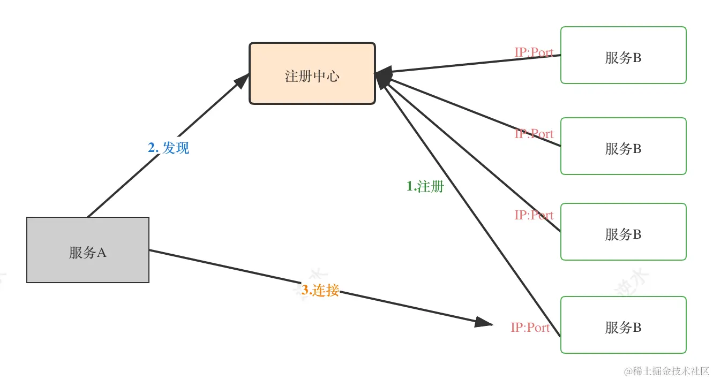

服务注册通常有三种：

- 自注册：服务提供方在启动服务时自己把提供服务的IP和端口发送到注册中心，并通过心跳方式维持健康状态；服务下线时，自己把相应的数据删除。
- 第三方注册
- 注册中心主动同步

在真正发起服务调用前，调用方需要从注册中心中，拿到相应服务可用的IP和端口列表，即服务发现。服务发现从应用侵入性上可以分为两大类：

- **基于SDK**：这类的服务发现方式，需要显式调用注册中心的SDK
- **基于DNS**：只要注册中心实现了DNS的解析协议，服务消费方就可以直接通过域名实现服务调用。

这里我们使用 Consul 注册中心。Agent 是 Consul 的核心进程。它有两种模式：客户端、服务器

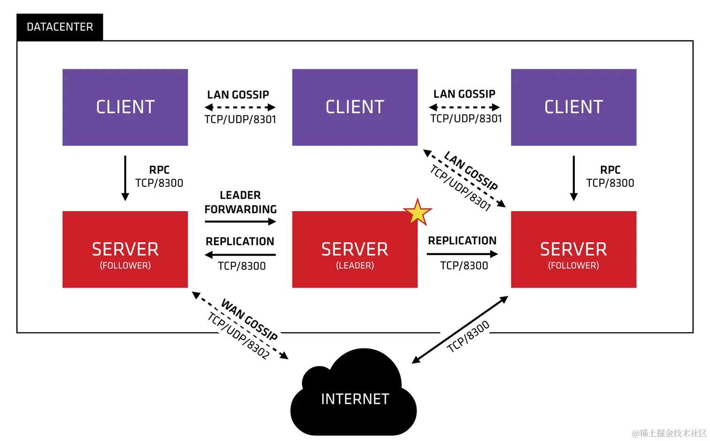

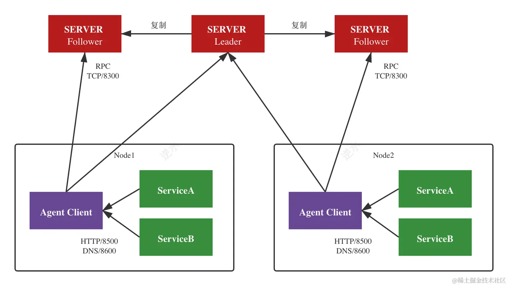

Consul 的 Server 节点是采用`Raft`一致性协议。Consul的健康检查机制不仅支持客户端心跳，而且可以配置 Check，Consul Agent 客户端会主动向服务发起健康检查（服务需要提供 health check ）

必要性：**网关与逻辑服务**之间的服务发现问题。假设我们把逻辑服务器的地址列表配置在所有网关中，这当然可行；但是如果增加一台逻辑服务器，所有的网关都要重新手工配置。

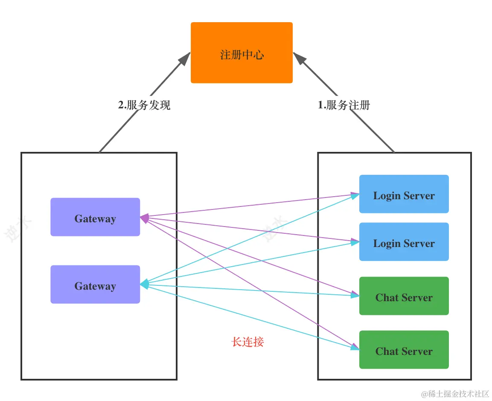

与微服务的使用场景不同的是，在这里由于网关与逻辑服务之间是长连接，所以如果一台逻辑服务下线，注册中心还没有检测到，而在网关中可以立刻发现。

