# 多线程编程的硬件基础与 Java 内存模型

[TOC]

## 竞态

计算正确性依赖于特定的并行指令流，这种现象称为**竞态（Race Condition）**。但是，我们不能对并行指令流做出任何假设。

术语规范：

- **状态变量(State Variable )**：即类的实例变量、静态变量。

- **共享变量(Shared Variable)**：即可以被多个线程共同访问的变量。

在编程层面上，竞态有两种表现形式：

- **read-modify-write**，例如：

  ~~~java
  load(sequence,rl);	// 1
  increment(rl);		// 2
  store(sequence,rl);	 // 3
  ~~~

  1. 一个线程在执行完 load 指令后，准备执行 increment 指令时，其他线程已经更新 sequence。
  2. 此时，该线程所读取的 sequence 就是一个旧值。
  3. 之后执行 store 指令会将旧值写入，从而发生更改丢失的现象。

- **check-then-act**

  ~~~java
  1f(sequence >= 999)(		// 1
  	sequence = 0;			// 2
  } else {
  	sequence++;
  )
  ~~~

  一个线程在执行完 ① 到开始执行 ② 的这段时间内，其他线程可能已经更新了共享变量的值，使得 if 语句中的条件变为不成立，那么此时该线程仍然会执行子操作 ②

## 线程安全性

线程安全性是指调用者在不加任何保护措施的情况下，调用该方法总能保证结果的正确性。线程安全问题有三种表现形式：原子性、可见性和有序性。

在体系结构的层面上

- 原子性是通过 CAS 指令来解决的
- 可见性与有序性都是通过内存屏障来解决的

## 原子性

原子性是指，该操作对于其他线程来说是不可分割的，也就是说要么已经完成了，要么还未开始，不会存在正在执行中的这种中间状态。

Java中有两种方式来实现原子性：

- 锁 (Lock)
- CAS (Compare-and-Swap) 指令

Java 语言规范规定，对基础类型和引用的写操作都是原子的，对于任何变量的读操作也都是原子操作

> 在 32 位处理器上， long/double 型变量的写操作不具备原子性，可以通过 volatile 关键字

## 可见性

可见性描述这样一个问题：写操作何时被其他处理器观察到。如果程序存在可见性问题，那么就意味着某些线程读取到了旧数据。问题的根源在于存储系统的数据一致性。

下面我们来看一个因编译器优化而导致的可见性问题：

~~~java
public class VisibilityDemo {
    public static void main(String[] args) throws InterruptedException {
        TimeConsumingTask timeConsumingTask = new TimeConsumingTask();

        Thread thread = new Thread(new TimeConsumingTask());
        thread.start();
        
        //指定的时间内任务没有执行结束的话，就将其取消
        Thread.sleep(10000);
        timeConsumingTask.cancel();
    }
}

class TimeConsumingTask implements Runnable (
	private boolean toCancel = false;
	@override
	public void run(){
		while (!toCancel) {
			if (doExecute()) {
				break;
			}
		}
     }

	public void cancel(){
		toCancel = true;
	}
}
~~~

因为，代码没有给 JIT 编译器足够多的提示（toCancel 被多个线程共享），从而 JIT 会优化上述代码，不幸的是这将导致死循环。

~~~java
if (!toCannel) {
    while (true) {
        if (doExecute()) {
            break;
        }
    }
}

~~~

我们可以使用 volatile 关键字来保证可见性，它有两个作用：

- 提示 JIT 编译器，被修饰的变量可能被多个线程共享，以阻止 JIT 编译器做出错误的优化。例如保证 volatile 分配到主存上
- 读取 volatile 变量时，处理器会执行刷新缓存的操作

## 有序性

重排序是对内存访问操作所做的一种优化，它可以在不影响单线程程序正确性的情况下，提升程序的性能。但是，它可能对多线程程序的正确性产生影响。

它的表现形式有三种：

- 程序顺序与源代码顺序不一致：编译器对汇编代码的重排
- 执行顺序与程序顺序不一致：处理器的乱序执行、分支预测。处理器的乱序技术保证，存在**数据依赖关系**的语句不会被重排序。存在**控制依赖关系**的语句是可以允许被重排序的（动态预测技术）
- 缓存系统对可见性的影响，即其他处理器对本处理器上**写操作顺序**的感知。注意，不要与可见性中「何时可见写操作」这个问题混淆

> - **源代码顺序(Source Code)**
> - **程序顺序(Program Order)**：字节码 / 汇编
> - **执行顺序(Execution Order)**：在处理器上的实际执行顺序

下面我们说明一个指令重排序的例子：

~~~java
helper = new Helper(externalData);
~~~

该语句可以分解为为以下几个子操作

~~~c++
//子操作①:分配Helper实例所需的内存空间
objRef = allocate(Helper,class);

//子操作②:调用Helper类的构造器
inovkeConstructor(objRef);

//子操作③
helper = objRef; 
~~~

JIT可能将 ③ 重排到 ② 之前，这就导致其他线程检查到 hepler 不为 null时，该实例可能并没有完成初始化。

## 硬件基础——高速缓存

高速缓存填补了处理器与内存之间的鸿沟。

现代计算机系统高速缓存结构：

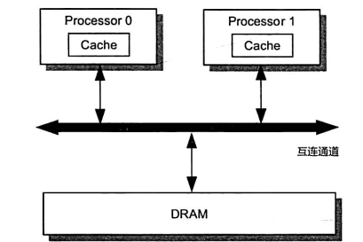

从内部结构来看，高速缓存相当于一个拉链散列表（Chained Hash Table）

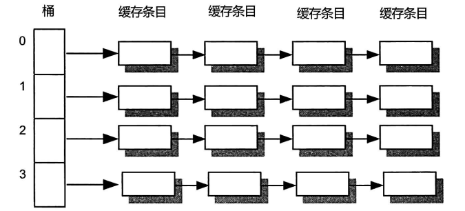

缓存条目可被进一步划分为 Tag、Data Block 以及 Flag 这三个部分

- Data Block，也被称为缓存行（Cache Line），是高速缓存与主内存之间的数据交换最小单元
- Tag 表述与缓存数据对应的内存地址信息
- Flag 表示缓存行的状态信息（可读、可写、是否有效）

处理器在执行内存访问操作时，会将内存地址解码为 tag、index、offset 这三部分数据。

- index：桶编号
- tag：缓存条目的索引
- offset：缓存行内的偏移量

## 缓存一致性协议——MESI

假设我们修改了缓存上的数据，这份数据要如何同步回内存呢？常见的有两种方法[[1\]](https://lotabout.me/2022/MESI-Protocol-Introduction/#fn1)：

1. Write-Though（直写），每次修改都同步更新到缓存和内存中
2. Write-Back（写回），修改先更新到缓存上，缓存快失效时才更新回内存中

它们的核心区别在于更新操作是“同步”还是“异步”。显然异步的写入性能更高，这也是主流的方案。

`MESI（Modified-Exclusive-Shared-Invalid）`协议是一种缓存一致性协议，它将缓存条目的状态划分为`Modified`、`Exclusive`、`Shared` 和 `Invalid`这4种，并在此基础上定义了一组消息（Message）用于协调各个处理器的读、 写内存操作。

- **Invalid（无效的，I）**：不包括有效的数据
- **Shared（共享的，S）**
- **Exclusive（独占的，E）**：只有本核上的缓存行是有效的，其他核上的缓存行是过期的
- **Modified（修改过的，M）**：只有本核上的缓存行是有效的，并且该缓存行被修改过。

MESI 协议中的消息分为「请求消息」和「响应消息」。处理器会往总线（Bus）中发送请求/响应消息，同时每个处理器还嗅探（Snoop，也称拦截）总线中的消息。

具体消息类型如下：

|          名称          | 类型 |                             描述                             |
| :--------------------: | :--: | :----------------------------------------------------------: |
|          Read          | 请求 | 通知其他处理器、主内存，当前处理器准备读取某个数据。该消息包含待读取数据的内存地址。 |
|     Read Response      | 响应 | 该消息包含被请求读取的数据。该消息可能是主内存提供的，也可能其他核上的高速缓存提供的 |
|       Invalidate       | 请求 | 通知其他处理器将其高速缓存中指定内存地址对应的缓存条目状态置为 I，即通知这些处理器删除指定内存地址的副本数据 |
| Invalidate Acknowledge | 响应 | 接收到 Invalidate 消息的处理器必须回复该消息，以表示删除了其高速缓存上的相应副本数据 |
|    Read Invalidate     | 请求 | 该消息是由 Read 消息和 Invalidate 消息组合而成的复合消息。接收到该消息的处理器必须回 复Read Response 消息和 Invalidate Acknowledge 消息 |
|       Writeback        | 请求 |       该消息包含需要写入主内存的数据及其对应的内存地址       |

下面我们通过一些场景来学习协议是如何工作的。

场景一：Processor0 要读取内存地址为 A 的数据

1. 如果 Processor0 所找到的缓存条目的状态为 M、E、S，那么直接读取缓存行；

2. 否则（状态为 I），那么需要往总线发送 Read 消息（该操作可以视为幂等的）

   假设 Processor1 中对应的缓存条目的状态不为 I，那么 Processor1 嗅探到 Processor0 的请求消息后，会构造相应的 Read Response 消息并发送。同时，相应的缓存条目的状态会被更新为 S。特别地，如果 Processor1 中对应的缓存条目的状态为 M，那么在发送消息前，将数据写入主内存

场景二：Processor 要向内存地址 A 写入数据

1. 若如果 Processor0 所找到的缓存条目的状态为 E、M，则说明该处理器已经拥有数据的所有权，此时该处理器可以直接将数据写入相应的缓存行，并将其状态更新为 M
2. 否则
   1. 若状态为 S，
      1. 发送 Invalidate 消息以获得数据的所有权。
      2. 其他处理器接收到 Invalidate 消息后，会将相应的缓存条目状态更新为I （相当于删除相应的副本数据），并回复 Invalidate Acknowledge 消息。
      3. Processor0 在接收到所有来自其他核的 Invalidate Acknowledge 消息后，将缓存条目的状态更新为 E。
      4. 接着， Processor 0 便将数据写人相应的缓存行，并将其状态更新为 M。
   2. 若状态为 I，
      1. 发送 Read Invalidate 消息，以获取数据本身以及其所有权。
      2. Processor 0 在接收到 Read Response 消息，以及所有来自其他核的Invalidate Acknowledge消息后，会将相应缓存条目的状态更新为E
      3. 接着， Processor 0 便将数据写人相应的缓存行，并将其状态更新为 M。

**总之，MESI 协议中，先发送消息，得到确认后再写入**

这里缓存接收到读写操作后，必要时需要与其它缓存**同步**并更新状态，此时读写操作可能被阻塞（一致性是有代价的）。这里补充点硬件知识，加深对于同步的理解。

 假设处理器 A，B 和 C 同时向总线发起总线事务，这时总线仲裁（Bus Arbitration）会对竞争做出裁决。假设 A 在竞争中获胜，那么 A 可以使用总线来访问内存。此时，如果处理器 D 向总线发起了总线事务，那么该发起就会被拒绝。 总线的这种工作机制可以把所有处理器对内存的访问以串行化的方式来执行。在任意时间点，最多只能有一个处理器可以访问内存。这个特性确保了单个总线事务之中的内存读/写操作具有原子性。

总线锁定就是使用处理器提供的一个 LOCK＃信号，当其中一个处理器在总线上输出此信号时，其它处理器的请求将被阻塞住，那么该处理器可以独占共享内存。由此可见，总线锁定性能低下。而 MESI 使用了总线窥探（Bus snooping）技术来代替总线锁定，CPU 不断窥探总线上发生的数据交换，确保及时的接收到消息。

## 硬件缓冲区

从理论上讲，MESI 已经解决了缓存一致性问题。但是为了减少写操作的等待时间，硬件设计者引入了写缓冲器和无效化队列。请考虑以下场景：

- 如果总线上发来一条消息，要使某个缓存段失效，但是如果此时缓存正在处理其他事情（比如和 CPU 传输数据），那么这个消息可能无法在当前指令周期中得到处理
- **在执行写操作之前，我们先要得到缓存段的独占权**，如果我们当前没有独占权，我们先要和其他处理器协商，这也需要一些时间。在这种场景下，让处理器闲着是一种资源浪费的表现。

### 写缓冲器

写缓冲器对于每个核来说是私有的。引入写缓冲器后，如果缓存条目的状态为 I、S，那么就先将更新数据先写入缓冲器中，然后再发送消息。此时，任务写操作已经完成了，无需等待 Invalidate Acknowledge/Read Response 消息，而是继续执行其他指令。再接收其他所有 Invalidate Acknowledge 响应消息后，才将写缓冲器的数据写入到缓存行中。

当核中读取某个数据时，会优先查询写缓冲器，确保结果是最新的。若查询失败，才会考虑缓冲行中的数据。这种技术称为**存储转发（Store Forwarding）**。

### 无效化队列

引入**无效化队列（Invalidate Queue）**之后，处理器在接收到 Invalidate 消息之后，并不删除消息中指定地址对应的副本数据。而是将消息存入无效化队列之后，就回复 Invalidate Acknowledge 消息，从而减少了执行写操作的处理器所需的等待时间。

### 内存重排序和可见性问题

但是写缓冲器和无效化队列又引入了新的问题 —— 内存重排序和可见性问题。

写缓冲器可能导致 **StoreLoad 重排序（Stores Reordered After Loads）**，考虑下面一个情景：
| Processor0    | Processor1    |
| ------------- | ------------- |
| X = 1   // S1 | Y = 1 // S3   |
| r1 = Y  // L2 |               |
|               | r2 = X  // L4 |

其中，X、Y 为共享变量，初值为 0；而 r1、r2 为局部变量。当 Processor0 执行 L2 时，Processor1 对于 Y 的写操作还停留在写缓冲器中，并且 Invalidate 消息尚未接收，那么此时 Processor0 就读取到了 Y = 0 这个旧值。这对 L4 操作有着同样的问题。

写缓冲器还可能导致 **StoreStore 重排序**，考虑下面一个情景：
| Processor0            | Processor1                            |
| --------------------- | ------------------------------------- |
| data = 1        // S1 |                                       |
| ready = true  // S2   |                                       |
|                       | while (!ready) continue   // L1       |
|                       | print(data)                     // L2 |

data、ready 为共享变量，初始值分别为 0、false。假设当执行 S1、 S2 时，data 并未在缓存中，而 ready 已经在了。那么在写入时，data 会被写到写缓冲器中，而 ready 直接写入缓存了。由于 MESI 协议，ready 在 Processor0 的写操作，能够在 L1 处感知。但是在执行 L2 时，data 很有可能尚未被冲刷到缓存中，那么 Processor1 未感知到对 data 的写入操作，从而读取到旧值

无效化队列可能导致 **LoadLoad重排序（Loads Reordered After Loads）**。

继续以上面表格为例，假设 Processor0 的高速缓存中存有变量 data 和 ready 的副本，Processor1 仅存有变量 data 的副本，而未存有变量 ready 的副本。考虑下面这个执行序列：

1. Processor0 执行 S1，发送 Invalidate 消息，并将 S1 的结果写入到写缓冲器中
2. Processor1 收到 Invalidate 消息，将该消息存入到无效化队列中，并回复 Invalidate Acknowledge 消息
3. Processor0 收到 Invalidate Acknowledge 消息，将 S1 的结果写入到高速缓存中。
4. 然后执行 S2，由于有 ready 的副本，所以直接写入到缓存行中
5. Processor1 执行 L1，由于没有 ready 变量的副本，因此发送 Read 消息
6. Processor0 收到消息后，回复 Read Response 消息
7. Processor1 执行 L2，此时由于 Invalidate 消息在无效化队列中，并没有使得 data 副本失效，因此，Processor1 读取到的 data 仍是旧值。

从 Processor0 的角度来看，L4 被重排序到了 L3 之前。

实际上，存储转发技术也会导致可见性问题。假设，Processor0 在 t1 时刻更新某个变量，随后又在 t2 时刻读取了该变量。在 t1 时刻到 t2 时刻的这段时间内，其他处理器更新结果已经到达该处理器的高速缓存中，但是 Processor 0 在 t1 时刻所做的更新，仍然停留在该处理器的写缓冲器之中，那么存储转发技术会使 Processor 0 直接从其写缓冲器读取该共享变量的值，但这是一个旧值。

## 内存屏障

内存屏障是被插人到两个指令之间的，其作用是解决编译器、处理器、缓存引起重排序问题，从而保障有序性。这隐含着有些屏障保证写操作的可见性。

>x86平台的内存屏障指令：sfence指令、mfence指令
>
>ARM处理器的内存屏障指令：DMB指令

LoadLoad屏障、LoadStore屏障、StoreStore 屏障和 StoreLoad 屏障统称为 XY 屏障。这类指令的作用是禁止该指令左侧的任何 X 操作，与该指令右侧的任何 Y 操作进行重排序。

按照可见性保障来划分，内存屏障又可以分为：

- **加载屏障（Load Barrier）**：清空无效化队列，使处理器在读取共享变量时，先从主内存或其他处理器的高速缓存中读取相应变量，更新到自己的缓存中
- **存储屏障（Store Barrier）**：将写缓冲器内容写入高速缓存中，使处理器对共享变量的更新写入高速缓存或者主内存中

按照有序性保障来划分，内存屏障又分为：

- **获取屏障（Acquire Barrier）**：相当于`LoadLoad屏障`与`LoadStore屏障`的组合。在读操作后插入，禁止该读操作与其后的任何读写操作发生重排序；
- **释放屏障（Release Barrier）**：相当于`LoadStore屏障`与`StoreStore屏障`的组合。在一个写操作之前插入，禁止该写操作与其前面的任何读写操作发生重排序。

这两个屏障一起保证了临界区中的任何读写操作不可能被重排序到临界区之外。

## volatile 的实现

 读操作：

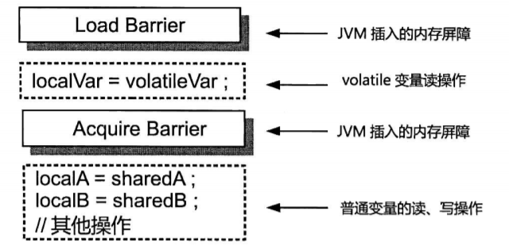

Load Barrier：保证读到的是最近一次写入的

写操作：

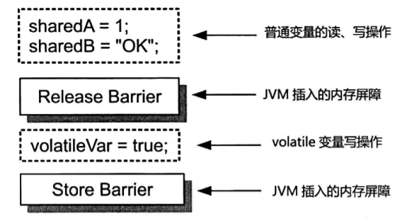

Store Barrier：保证写操作对其他处理器立即可见

实际上 `volatile` 在只有一个更改源的情况下，也可以保证原子性。但在 volatile 变量的写操作中，不得涉及任何的共享变量，例如：

~~~java
volatile int count1
count1 = count2 + 1;
~~~

如果变量 count2 是一个共享变量，那么该赋值操作显然是一个 read-modify-write 操作，需要锁的保护。

## Final 的实现

Java 语言规范会保障其他线程看到该 final 字段时，这个字段必然是初始化完毕的。

## 内置锁的实现

Java内置锁的状态总共有4种，级别由低到高依次为：无锁、偏向锁、轻量级锁和重量级锁。状态会随着竞争的激烈程度而逐渐升级，而且是不可逆的过程。在 JDK 1.6 之前，Java 内置锁仅仅是一个重量级锁。在 JDK 1.6 之后，JVM 为了提高锁的获取与释放效率，引入了偏向锁和轻量级锁。

首先介绍 Java 中的对象布局：对象在堆内存中的存储布局可以划分为三个部分：**对象头（Header）**、**实例数据（Instance Data）**和**对齐填充（Padding）**。

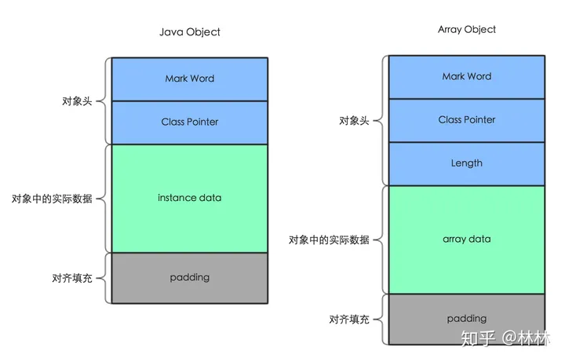

HotSpot 虚拟机对象的对象头部分包括两类信息：

- **Mark Word**：用于存储对象自身的运行时元数据，如哈希码（HashCode）、GC分代年龄、锁状态标志、线程持有的锁、偏向线程ID、偏向时间戳等。在64位HotShot虚拟机中，用64个bit存储这些信息。实际上Mark Word被设计成一个有着动态定义的数据结构。它会根据对象的状态（锁标志位），复用自己的存储空间来存储不同信息：

  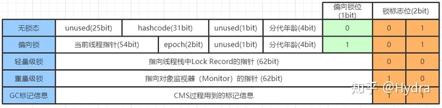

- **类型指针**：即对象指向它的类型元数据的指针。Java虚拟机通过这个指针来确定该对象是哪个类的实例。

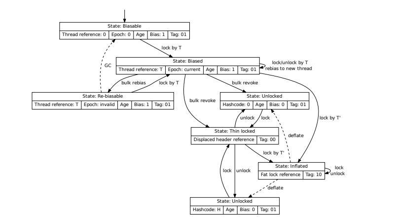

### 偏向锁

**偏向锁（Biased Locking）**是 Java 虚拟机对锁的实现所做的一种优化。这种优化基于这样的观测结果（Observation）：大多数锁并没有被争用（Contented），并且这些锁在其整个生命周期内至多只会被一个线程持有。

Java 虚拟机在实现 monitorenter 字节码（申请锁）和 monitorexit 字节码（释放锁）时需要借 一个原子操作（ CAS 操作 ），这个操作代价相对来说比较昂贵。在偏向锁中，Java 虚拟机会为每个对象维护一个偏好（ Bias ）。偏向锁在第一次被线程获得时，仍使用 CAS 操作，将该线程的 ID 记录在 Mark Word 中，此后，这个线程后续无论是再次申请该锁还是释放该锁，都无须借助原先昂贵的 CAS 操作。

下面我们通过几个例子来认识偏向锁的使用。这里需要可以查看对象内存布局的工具 [JOL (java object layout)](https://search.maven.org/artifact/org.openjdk.jol/jol-core/0.16/jar)：

~~~xml
<dependency>
  <groupId>org.openjdk.jol</groupId>
  <artifactId>jol-core</artifactId>
  <version>0.14</version>
</dependency>
~~~

首先我们来看这样一种场景：

~~~java
public static void main(String[] args) {
    Object o = new Object();
    log.info("未进入同步块，MarkWord 为：");
    log.info(ClassLayout.parseInstance(o).toPrintable());
    synchronized (o){
        log.info(("进入同步块，MarkWord 为："));
        log.info(ClassLayout.parseInstance(o).toPrintable());
    }
}
~~~

当进入同步块时，对象从无锁状态转变为轻量锁。虽然默认开启了偏向锁，但是开启是**有延迟**的，大概 4s。原因是 JVM 内部的代码有很多地方用到了 synchronized，如果直接开启偏向，产生竞争就要有锁升级，会带来额外的性能损耗，所以就有了延迟策略。可以通过参数 `-XX:BiasedLockingStartupDelay=0` 将延迟改为 0，但是**不建议**这么做。

因此，我们来看下面这段代码：

~~~java
public static void main(String[] args) throws InterruptedException {
    // 睡眠 5s
    Thread.sleep(5000);
    Object o = new Object();
    log.info("未进入同步块，MarkWord 为：");
    log.info(ClassLayout.parseInstance(o).toPrintable());
    synchronized (o){
        log.info(("进入同步块，MarkWord 为："));
        log.info(ClassLayout.parseInstance(o).toPrintable());
    }
}

~~~

当其他线程 B 尝试获取锁时，会检查该锁的偏向线程 A 是否在同步块内：

- 如果在同步块内，那么就会在安全点撤销偏向锁，并升级为轻量级锁
- 如果不在，那么就先把偏向锁**撤销**为无锁状态，然后再用 CAS 的方式尝试重新竞争。

如果出现了大量对象 obj 的偏向锁撤销为无锁的情况，那么 JVM 推测后面都是类似的情况，于是就不再撤销了，而是直接 CAS 竞争 threadId，具体步骤如下：

1. JVM 会在 obj 对象的**class 类对象**中定义一个偏向撤销计数器
2. 每当有一个对象被撤销偏向锁（撤销的结果只有两种：无锁、轻量锁）， 都会让偏向撤销计数器 +1
3. 一旦加到 20， 则认为出现大规模的锁撤销动作。 于是 class 类对象的 epoch 值 +1
4. 接着， jvm 会找到所有正处在同步代码块中的 obj 对象， 让它的 epoch 等于 class类对象的 epoch。
5. 其他不在同步代码块中的 obj 对象，则不修改 epoch。
6. 当 B 线程来访问时，发现 obj 对象的 epoch 和 class 对象的不相等，则不再做撤销动作，直接 CAS 抢占。 

但如果短时间内该类的撤销动作超过 40 个，那么 JVM 则将其标记为不可偏向，后续将直接走轻量级锁的逻辑。

无锁状态以及偏向状态的对象头中是没有 hashcode 的。要注意，hashcode 要经过**第一次**调用 `Object::hashCode()` 或者`System::identityHashCode(Object)`时， 才会存储在对象头中的。显然在生成 hashCode 时，要升级锁：

1. 即便是可偏向状态的对象，一旦在同步块外调用 `Object::hashCode()` 或者`System::identityHashCode(Object)` ，进入同步块时就会直接使用**轻量级锁**。

   ~~~java
   Object o = new Object();
   o.hashCode();
   synchronized (o){
      
   }
   ~~~

   ~~~java
   Object o = new Object();
   synchronized (o){
       // 偏向锁
   }
   
   o.hashCode();
   synchronized (o){
       // 轻量锁
   }
   ~~~

2. 即便是可偏向状态的对象，一旦在同步块内调用 hashCode()，那么立即生成为重量级锁：

   ~~~java
   Object o = new Object();
   synchronized (o){
       // 偏向锁
        o.hashCode();
       // 重量级锁
   }
   ~~~

无论是在哪种情况下，一旦调用 wait() 方法，必定升级为重量级锁。

由于偏向锁给 JVM 增加了巨大的复杂性，维护成本很高。因此从 JDK 15 开始，偏向锁默认就是 disabled 的

### 轻量级锁

引入轻量级锁的主要目的是在多线程竞争不激烈的情况下，通过 CAS 机制竞争锁减少重量级锁产生的性能损耗。重量级锁使用了操作系统底层的互斥锁（Mutex Lock），会导致线程在用户态和核心态之间频繁切换，从而带来较大的性能损耗。

轻量级锁主要有两种：

- 普通自旋锁：当有线程来竞争锁时，抢锁线程会在原地循环等待，而不是被阻塞，直到那个占有锁的线程释放锁之后，这个抢锁线程才可以获得锁。但是，循环等待的时候是会消耗 CPU 的，为了避免过度消耗，限制自旋的次数为 10 次，可以通过`-XX:PreBlockSpin` 选项。
- 自适应自旋锁：由自适应算法来动态确定自旋限制次数。自 JDK 1.7 后，只能使用自适应自旋锁。

如果超过自旋次数的限制，那么就升级为重量级锁。

获取轻量级锁的过程：

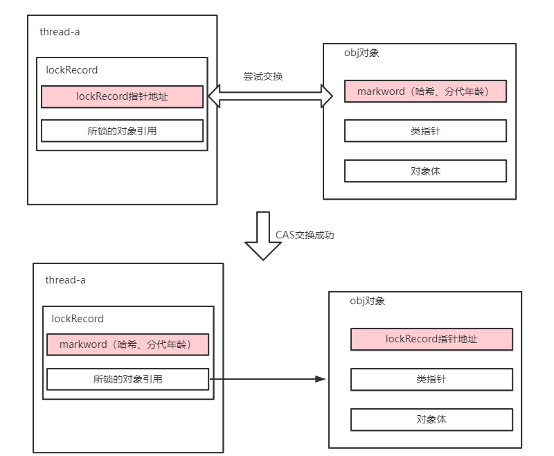

1. JVM 首先将在抢锁线程的栈帧中，建立一个锁记录（Lock Record）

2. 拷贝对象头中的 Mark Word 复制到锁记录中的 Displaced Mark Word。

   这是因为无锁状态下的 Mark Word 存储 Hashcode 等信息，而轻量级锁状态下的 MarkWord 只主要存储 ptr_to_lock_record，而没有保留 Hashcode 信息。所以在释放锁时，要还原无锁状态下的信息。因此，我们必须使用 Displaced Mark Word 来暂存无锁状态下的 markWord。

3. 拷贝成功后，抢锁线程将使用 CAS 自旋操作，尝试将对象头的 MarkWord 的 ptr_to_lock_record（锁记录指针）指向自己的锁记录。如果更新成功：再将锁记录的 owner 指针指向锁对象。

### 重量级锁

在 JVM 中，每个对象都关联一个监视器。监视器提供两种机制：

- 同步：互斥地执行
- 协作：信号与唤醒机制

在 Hotspot 虚拟机中，监视器是由 C++ 类 ObjectMonitor 实现的。

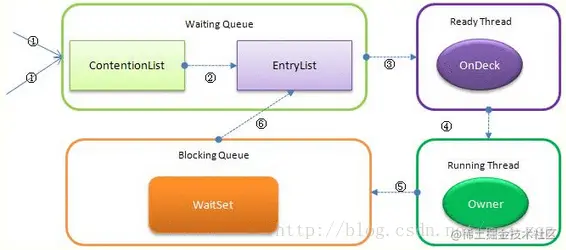

当多个线程一起访问某个对象监视器的时候，对象监视器会将这些线程存储在不同的队列中：

- **Contention List（竞争队列）**：它通过 CAS 操作（无锁结构）+ 自旋，将请求失败的线程放在队首。并且只有 owner 线程才能从队尾将线程放入 EntryList 中
- **Wait Set（阻塞队列）**：保存因调用 wait 方法而被阻塞的线程。
- **Entry List（候选者队列 ）**：保存有资格运行的线程（Ready 状态的线程）
- **OnDeck**：准备运行的 Thread，至多有一个。Owner 线程并不把锁直接传递给 OnDeck 线程，而是把锁竞争的权利交给 OnDeck，OnDeck 需要重新竞争锁。下面会介绍这种锁被其他线程抢走的情况。

注意：处于 ContentionList、EntryList、WaitSet 中的线程都处于阻塞状态

`Synchronized` 是非公平锁，在线程进入`ContentionList` 时，该线程会先尝试自旋获取锁，如果获取不到就进入ContentionList，这明显对于以下对象是不公平的，

- 已经进入 Contention List 队列的线程
- OnDeck 线程

## 内存模型

Java 内存模型定义了一些动作，包括变量的读/写、锁的申请与释放以及线程的启动和加入等。假设动作 A 和动作 B 之间存在 happens-before 关系称之为 `A happens-before B`，那么 Java内存模型保证 A 的操作结果对 B 可见，即 A 的操作结果会在 B 被执行前提交（比如写入高速缓存或者主内存）。实际上，happens-before 是可见性的另一种表述。

happens-before 关系具有传递性，即如果 A happens-before B，并且B happens-before C，那么有 A happens-before C。由传递性引申出来「可见性保障的积累」，假设A -> B -> C -> D ，那么就有A -> D以及B->D

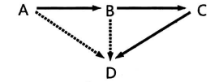

Java内存模型定义了一些关于 happens-before 关系的规则，规定了两个动作在什么情况下具有 happens-before 关系

- **程序顺序规则（Program Order Rule）**：即单线程上的貌似串行语义（As-if-serial Semantics）

- **内部锁规则（Monitor Lock Rule）**：对于同一个锁的释放和申请是 happen-before的关系

- **volatile 变量规则（Volatile Variable Rule）**。对同一个 volatile 变量的写操作 happen-before 读操作

-  **线程启动规则（Thread Start Rule）**。用一个线程的 start() 方法 happens-before 该线程执行后的任何一个动作

- **线程终止规则（Thread Termination Rule）**。一个线程中的任何一个动作都 happens-before 该线程的 join() 方法。

Java 内存模型只会从“什么”（What）而不会从“如何”（How）的角度，来描述Java语言对可见性、有序性的保障。这些 happens-before 规则最终是由 Java 虚拟机、编译器以及处理器一同协作来落实的

## 伪共享

由于一个缓存行中可以存储多个变量的副本，因此，如果多个核在操作同一个缓存行中的数据，那么就会出现频繁的缓存失效，即使在代码层面看这两个线程操作的数据之间完全没有关系。这种不合理的资源竞争情况就是伪共享（False Sharing）。

伪共享会有严重的性能问题，下面是「在循环中进行简单地字段读取和更新」的例子

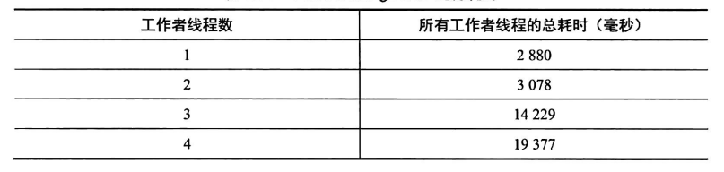

这是因为 L1 上的缓存未命中的数量急剧增加，从而导致更多的内存访问延迟。

解决伪共享问题的一个直观思路就是填充（Padding），填充方式分为两种

- 手动填充：自行添加一些无用字段，但可能会被 JVM 优化掉

  ~~~java
  class Pointer {
      volatile long x;
      //缓存行填充
      long p1, p2, p3, p4, p5, p6, p7;
      volatile long y;
  ~~~

- 自动填充：使用 @sun.misc.Contended 注解，由 JVM 自动填充

  ~~~java
  
  35 class Pointer {
  36     //  @Contended +  jvm 参数：-XX:-RestrictContended
  37     @Contended
  38     volatile long x;
  41     volatile long y;
  ~~~

  
