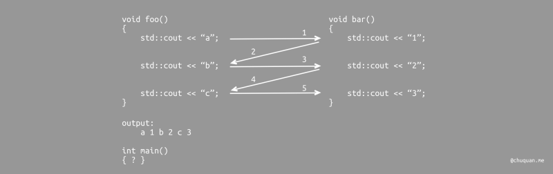
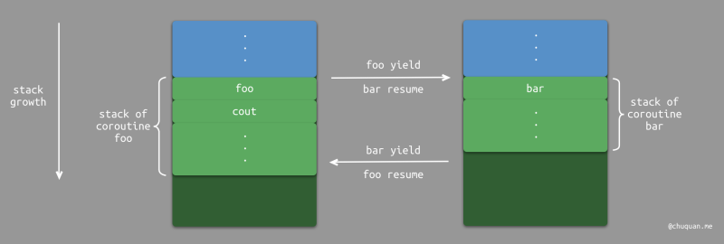
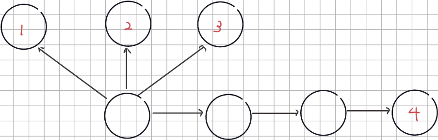
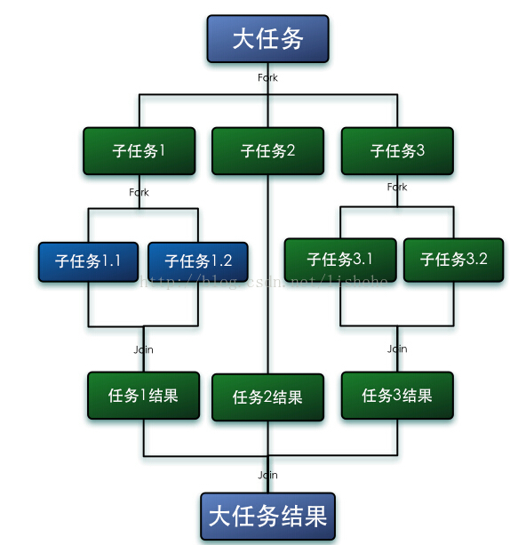
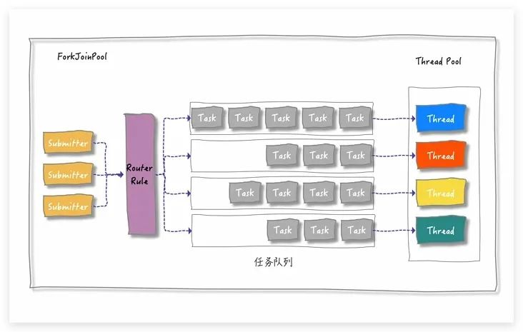
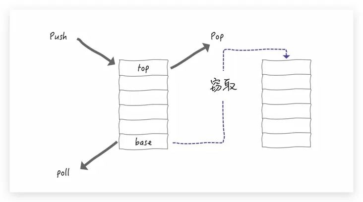

# 异步

[TOC]

## 异步模型概述

异步编程有很多模型，包括：线程、回调、Future/Promise、协程

### 线程

线程是最经典的、解决同步阻塞的方法，但它有一系列缺点：

- 线程并非廉价的。线程需要昂贵的上下文切换。
- 线程不是无限的。可被启动的线程数受底层操作系统的限制
- 线程理解起来是困难的

### 回调

回调的代码形式

```java
fun postItem(item: Item) {
    preparePostAsync { token -> 
        submitPostAsync(token, item) { post -> 
            processPost(post)
        }
    }
}

fun preparePostAsync(callback: (Token) -> Unit) {
    // 发起请求并立即返回
    // 设置稍后调用的回调
}
```

原则上这感觉就像一个更优雅的解决方案，但又有几个问题：

- 回调嵌套的难度，臭名远扬的**「回调地狱」**
- 错误处理很复杂

### Future/Promise

`Future/Promise`将回调的嵌套模型转换为一个线性回调模型，稍微改善了回调的问题。编程模型从自上而下的命令式方法转变为具有链式调用的组合模型。传统的编程结构例如循环，异常处理，等等。通常在此模型中不再有效。

```JavaScript
fun postItem(item: Item) {
    preparePostAsync() 
        .thenCompose { token -> 
            submitPostAsync(token, item)
        }
        .thenAccept { post -> 
            processPost(post)
        }

}

fun preparePostAsync(): Promise<Token> {
    // 发起请求并当稍后的请求完成时返回一个 promise
    return promise 
}
```

### 协程

Java 的线程模型在微服务时代就显得力不从心了，因为每个请求都足够简单，而且数量还多，以至于线程的系统开销变得不可接受了（内核态的陷入、调度算法、上下文切换）。

协程本质上是一个**用户态线程**，采用**协作式多任务**的模型。而我们平常所说的线程是**内核态线程**，采用抢占式任务模型。内核态线程的开销主要在于复杂的调度算法实现、内核态检查（例如判断是何种中断）以及保存更多的寄存器。

协程是一种计算可被挂起的想法（函数将被执行、暂停执行以及在某个时间点恢复）。协程的一个好处是，非阻塞协程代码的结构与同步阻塞代码的基本相同，也是就是说，编程模型本身并没有真正改变。

协程并没有解决 IO 密集问题，协程只是优化了异步回调模型增强了代码的可读性。真正解决 io 密集问题的是：

- IO多路复用函数
- 响应式编程模式——Reactor

协程是什么？在函数的基础上，可以**挂起/恢复**执行流：

[](https://github.com/AtsukoRuo/note/blob/66be0c7c034caeecfb90b82c57dd8b4526c7ba0f/编程/Kotlin/assets/resize,w_800-1707976924447-17.png)

异步和协程有些相似，但是异步编程侧重于任务的非阻塞性执行，而协程更侧重于代码的执行流程控制。两者并不冲突，例如 Javascript 中的 await 就是一种以协程的形式来实现异步编程的方法

协程按调用栈分类

- **有栈（stackful）协程**，例如 微信的 libco、阿里的 cooobjc、Golang 中的 goroutine、Lua 中的协程。

  在有栈协程中，每个协程有自己的独立栈。当协程进行上下文切换时，它们的状态（包括调用栈和所需的所有寄存器）都会被保存到内存中的一块特定区域。在切换回这个协程时，再从内存中恢复这个保存的状态。

  [](https://github.com/AtsukoRuo/note/blob/66be0c7c034caeecfb90b82c57dd8b4526c7ba0f/编程/Kotlin/assets/resize,w_800.png)

  这种模式的优点是极端灵活，可以在任何函数深度中切换协程。但缺点是每个协程都需要保存一个完整的调用栈，其内存占用可能会非常大。

- **无栈（stackless）协程**，例如 ES6、Dart 中的 await/async、Python 的 Generator、Kotlin 中的协程、C++20 中的 cooroutine 都是无栈协程。

  无栈协程通常是 **基于状态机或闭包** 来实现。以基于状态机为例，它记录上次协程挂起时的位置，以及必要的局部变量以及上下文信息，而无需保存整个栈帧。

  ```c++
  void bar() {
      static int state = 0;
      switch (state) {
          case 0: goto LABEL0;
          case 1: goto LABEL1;
          case 2: goto LABEL2;
      }
      LABEL0:
      std::cout << "1";
      LABEL1:
      std::count << "2";
      LABEL2:
      std::count << "3";
  }
  ```

  所以不管从效率，还是从内存占用来看，无栈当然是更优的方案，但是无栈需要编译器支持，有栈只需要编写同一套上下文切换的代码。

  此外，无栈协程还有函数染色的问题。即在调用很深的地方使用一个 await，就必须把整个调用栈的函数都变成 async，还需要注意它们在其它地方的调用都要改成 await，这简直就是重构的噩梦。

协程按调度方式分类：

- **对称协程**（Symmetric Coroutine）：任何一个协程都是相互独立且平等的，调度权可以在任意协程之间转移。

- **非对称协程**（Asymmetric Coroutine）：协程出让调度权的目标只能是它的调用者，即协程之间存在调用和被调用关系。例如Lua 的协程中当前协程调用 `yield` 总是会将调度权转移给 `resume` 它的协程。

  事实上，我们只要对非对称协程稍作修改，即可实现对称协程的能力。我们可以在非对称协程的基础上，添加有关协程调度权的分发中心。所有的协程在挂起时都将控制权转移到分发中心，分发中心根据参数来决定将调度权转移给哪个协程，如 Lua 的第三方库 coro

协程之间的切换（挂起和恢复）可以是协作式的（await/async、suspend），也可以是抢占式的（gorountine 1.4）。

协作式协程何时被挂起：

- 主动放弃使用权：yield（例如Python中的Generator）
- 遇到阻塞函数：系统调用属于内核态的范畴，它对协程这种用户态的技术并无感知。此时，如果直接执行阻塞的系统调用，那么协程机制就失效了（无法切换到其他协程上）。go、nodejs等对阻塞的系统调用做了一层封装，在执行真正的系统调用前，将协程切换出去，在执行完成后，再切换回来。
- await/async suspend，如果直接在Dart中调用 async 函数，那么就会获得一个Future对象，而 async 函数会异步执行。通过 await 一个Future对象，可以同步获取结果。

## Executor

`Executor` 接口使得任务的提交方只需要知道调用 `Executor.execute()` 方法便可以使指定的任务执行，而无须关心任务具体的执行细节：比如，任务是采用一个专门的线程执行的，还是采用线程池执行的；

~~~Java
public interface Executor {
    void execute(Runnable command);
}
~~~

`Executor` 接口比较简单，但它有以下局限性：

- 无法将任务的处理结果返回给客户端代码
- 没有相应的方法来释放掉相应的线程资源

`ExecutorService` 接口继承自 `Executor` 接口，来解决了上述问题。

~~~java
public interface ExecutorService extends Executor {
    void shutdown();
    List<Runnable> shutdownNow();

    <T> Future<T> submit(Callable<T> task);
    <T> Future<T> submit(Runnable task, T result);
    Future<?> submit(Runnable task);
    
    //...
}
~~~

`ThreadPoolExecutor` 是 `ExecutorService` 接口的默认实现类。而通过`Executors`工具类，可以快捷创建`ExecutorService`的实现类。大厂的编程规范都不允许使用 `Executors` 创建线程池，而是要求使用标准构造器 `ThreadPoolExecutor` 创建线程池。

- `Executors.newCachedThreadPool()`

  ~~~java
  new ThreadPoolExecutor(
      0, 
      Integer.MAX_VALUE, 		// 如果任务提交较多，就会造成大量的线程被启动
      60L, 
      TimeUnit.SECONDS,
      new SynchronousQueue<Runnable>());	
  ~~~

  适用于执行大量耗时较短且提交频率较高的任务

- `Executors.newFixedThreadPool(int nThreads)`

  ~~~java
  new ThreadPoolExecutor(
      nThreads, 
      nThreads,
      0L, 
      TimeUnit.MILLISECONDS,
      new LinkedBlockingQueue<Runnable>());	// 这里使用的是无界队列，如果提交速度持续大于处理速度，那么会占用大量内存资源来存储待执行的任务。
  ~~~

- `Executors.newSingleThreadExecutor()`。相当于 `Executors. newFixedThreadPool(1)`


## CompletionService

CompletionService 可以按任务完成顺序来获取结果，而不是像 ExecutroService 那样，按任务提交顺序来获取结果（对返回的 Futre 对象依次调用 get）。

~~~java
public interface CompletionService<V> {
    Future<V> submit(Callable<V> task);
    Future<V> submit(Runnable task, V result);

    Future<V> take() throws InterruptedException;			  // 阻塞
    Future<V> poll();									   // 非阻塞
    Future<V> poll(long timeout, TimeUnit unit) throws InterruptedException;
}
~~~

Java 标准库提供的 CompletionService 实现类为 ExecutorCompletionService，它相当于 Executor 实例与 BlockingQueue 实例的结合。Executor 实例负责接收并执行异步任务，而 BlockingQueue 实例用于保存异步任务的执行结果。这样可以将执行任务与处理任务分离开来。

使用示例：

~~~java
ExecutorService exs = Executors.newFixedThreadPool(5);

CompletionService<Integer> completionService = new ExecutorCompletionService<Integer>(exs); 

// 2.添加任务
for(int i = 0;i < taskCount;i++){
    Future<Integer> future = completionService.submit(new Task(i+1));
}

// 3.获取结果
for(int i=0;i<taskCount;i++){
    Integer result = completionService.take().get();
}
~~~

## Future 

Future 接口在 Java5 中被引入，设计初衷是表示将来某个时刻会产生的结果。它建模了一种异步运算。

~~~java
public interface Future<V> {
    boolean cancel(boolean mayInterruptRunning);
   	boolean isCancelled();
    boolean isDone();

    V get() throws InterruptedException, ExecutionException;

    V get(long timeout, TimeUnit unit) throws
        InterruptedException, ExecutionException, TimeoutException;
	// ...
 }
~~~

`Future.get()` 是个阻塞方法。另外，若任务执行过程中抛出一个任意的异常 `originalException`，那么 `Future.get()`方法本身会抛出 `ExecutionException` 异常。调用这个异常（ExecutionException）的 `getCause()`方法便可返回 `originalException`。

- 如果在给定的超时时间内没有获得结果，那么便抛出 `TimeoutException` 异常；
- 或者执行的任务被取消（此时抛出 `CancellationException` 异常）；
- 或者执行任务时出错，即执行过程中出现异常（此时抛出 `ExecutionException` 异常）；
- 或者当前线程被中断（此时抛出 `InterruptedException` 异常 —— 注意，当前线程是指调用 `get` 方法的线程，而不是运行任务的线程）。


`Future` 接口还支持任务的取消：

~~~java
boolean cancel(boolean mayInterruptIfRunning)
~~~

- 返回值为 `boolean` 类型，如果任务成功被取消，则返回 `true`；如果任务无法被取消（例如，已经完成，已经被取消，或一些其他情况），则返回 `false`。
- 当 `mayInterruptIfRunning` 参数设置为 `true` 的时候，会向任务发送中断信号。

该方法仅仅是将 Future Task 标记为 `cancel` 状态而已。一个任务被成功取消之后，调用`Future.get()` 会抛出 `CancellationException` 异常（运行时异常）。`Future.isDone()`方法可以检测任务是否执行完毕（包括异常、取消）。


`Future` 接口的实现类是 `FutureTask`，它的定义如下：

~~~java
public class FutureTask<V> implements RunnableFuture<V> {}
public interface RunnableFuture<V> extends Runnable, Future<V> {}
~~~

`FutureTask` 的一个构造器接收 `Callable` 参数，这样可以将 `Callable` 实例转换为 `Runnable` 实例：

~~~java
public FutureTask(Callable<V> callable)
~~~

当 `FutureTask` 实例所代表的任务执行结束后，`protected void FutureTask.done()`会被执行。

`FutureTask` 设计为一次性执行的任务。`FutureTask.run()` 在执行任务前，会先判断任务的运行状态，如果该任务已经被执行过（无论成功与否），那么 `FutureTask.run()` 会直接返回（并不会抛出异常）。可以通过  `runAndReset()` 来重置状态

## 计划任务

`ExecutorService` 接口的子类 `ScheduledExecutorService` 接口定义了一组方法用于执行计划任务。`ScheduledExecutorService` 接口的默认实现类是 `java.util.concurrent.ScheduledThreadPoolExecutor`类

它还提供了两个静态工厂方法，用于创建 ScheduledExecutorService 实例：

~~~Java
public static ScheduledExecutorService newScheduledThreadPool (
    int corePoolSize)
    
public static ScheduledExecutorService newScheduledThreadPool(
    int corePoolSize, ThreadFactory threadFactory)
~~~


`ScheduledExecutorService` 接口的方法，按功能可分为以下两种：

- 延迟执行提交的任务

  ~~~Java
  <V> ScheduledFuture<V> schedule(Callable<V> callable, long delay, TimeUnit unit)
      
  ScheduledFuture<?> schedule(Runnable command, long delay,TimeUnit unit)
  ~~~

- 周期性地执行提交的任务

  ~~~Java
  ScheduledFuture<?> scheduleAtFixedRate(
      Runnable command, 
      long initialDelay,
      long period, 
      TimeUnit unit)
      
      
  ScheduledFuture<?> scheduleWithFixedDelay(
      Runnable command,
      long initialDelay,
      long detay,
      TimeUnit unit)
  ~~~

首先要明确两个概念：

- 执行周期（Interval）：相邻两次的任务开始执行时间
- 耗时（Execution Time）：一个任务从开始到结束所花费的时间


scheduleAtFixedRate 的执行周期为，$Interval =max(Execution Time, period)$ 

scheduleWithFixedDelay 的执行周期为，$Interval = Execution Time + delay$ 


提交给 `ScheduledExecutorService` 执行的计划任务，在其执行过程中如果抛出未捕获的异常，那么该任务后续就不会再被执行，而且即使设置了`UncaughtExceptionHandler`也不会被调用。


## CompletableFuture

CompletableFuture 异步任务编排组合

|                             | Future | CompletableFuture | RxJava | Reactor |
| :-------------------------- | :----- | :---------------- | :----- | ------- |
| Composable（可组合）        | ❌      | ✔️                 | ✔️      | ✔️       |
| Asynchronous（异步）        | ✔️      | ✔️                 | ✔️      | ✔️       |
| Operator fusion（操作融合） | ❌      | ❌                 | ✔️      | ✔️       |
| Lazy（延迟执行）            | ❌      | ❌                 | ✔️      | ✔️       |
| Backpressure（回压）        | ❌      | ❌                 | ✔️      | ✔️       |

> RxJava与Reactor显然更加强大，但同时也带来了更大的学习成本。


我们注意`CompletableFuture`的命名规则：

- `xxx()`：表示该方法将继续在已有的线程中执行。
- `xxxAsync()`：表示将尽可能地申请新地线程来执行。

这些方法都会返回一个新的 future 对象，这些 future 对象依赖关系可以用依赖图来描述。有些方法在功能上是类似的，比如 whenComplete 与 thenApply，但是它们有着不同的语义，用在不同的场合中。

在一个依赖链上任务，无论是通过 thenApply 还是 thenAsyncApply 提交的，会严格按照提交顺序依次执行任务。注意要区分在同一个 future 对象上调用多次 thenAsyncApply，与以回调链的形式调用这两者的差别。

~~~dart
CompletableFuture<Integer> future = CompletableFuture.completedFuture(1);
Function<? super T,? extends U> fn = (result) -> 1;

CompletableFuture<Integer> future1 = future.thenApply(fn);
CompletableFuture<Integer> future2 = future.thenApply(fn);
CompletableFuture<Integer> future3 = future.thenApply(fn);


CompletableFuture<Integer> future4 = future.thenApply(fn).thenApply(fn).thenApply(fn);
~~~




注意future1、future2、future3、future4并不按提交顺序来执行。毕竟它们都不在一个依赖链上。


### 实例化 CompletableFuture

~~~java
//supplyAsync 用于有返回值的任务
public static <U> CompletableFuture<U> supplyAsync(Supplier<U> supplier);
public static <U> CompletableFuture<U> supplyAsync(Supplier<U> supplier, Executor executor);

//runAsync 则用于没有返回值的任务
public static CompletableFuture<Void> runAsync(Runnable runnable);
public static CompletableFuture<Void> runAsync(Runnable runnable, Executor executor);
~~~

Executor 参数可以手动指定线程池。如果不指定 Executor 参数，那么 CompletableFuture 使用公共线程池 ForkJoinPool，而且线程池里面的线程都是守护线程。

直接创建一个状态处于已完成的 CompletableFuture 对象：

~~~java
CompletableFuture<Integer> future = CompletableFuture.completedFuture(1);
~~~

### get

~~~java
//同步阻塞获取结果
public T get() throws 
    InterruptedException, ExecutionException	
    
//同步阻塞获取结果，并设置一个等待时间。如果超过等待时间仍未获取结果，那么直接抛出TimeoutException
public T get(long timeout, TimeUnit unit) throws InterruptedException, ExecutionException, TimeoutException 									
// 如果调用时结果并未计算完成，那么直接返回 valueIfAbsent。它会抛出Throws:CancellationException 或 CompletionException
public T getNow(T valueIfAbsent)				
    
// 同步阻塞获取结果。与 get 唯一不同的是，它会抛出 unchecked 异常，即Throws:CancellationException或CompletionException。
public T join()					
~~~

### whenComplete

当任务完成（正常退出或者异常抛出）时，会调用此函数。

~~~java
public CompletableFuture<T> whenComplete(
    BiConsumer<? super T, ? super Throwable> action)
    
public CompletableFuture<T> whenCompleteAsync(
    BiConsumer<? super T, ? super Throwable> action)	
    
public CompletableFuture<T> whenCompleteAsync(
    BiConsumer<? super T, ? super Throwable> action, 
    Executor executor)
~~~

### handle

~~~java
public <U> CompletableFuture<U> handle(
        BiFunction<? super T, Throwable, ? extends U> fn)
    
public <U> CompletableFuture<U> handleAsync(
        BiFunction<? super T, Throwable, ? extends U> fn)
    
public <U> CompletableFuture<U> handleAsync(
        BiFunction<? super T, Throwable, ? extends U> fn, Executor executor)
~~~

handle 与 whenComplete 的唯一区别在于：handle 会消耗异常，而 whenComplete 不会。不管函数是否抛出异常，handle 方法一定执行。

~~~java
CompletableFuture<Integer> future = CompletableFuture.supplyAsync(() -> {throw new ArrayIndexOutOfBoundsException();});

CompletableFuture<Integer> future1 = future.whenComplete((res, err) -> {});

CompletableFuture<Integer> future2 = future.handle((res, err) -> {return 1;});

future1.get();			//这个会抛出异常
future2.get();			//这个不会抛出异常
~~~

### apply、accept

thenApply 描述了一元依赖关系，可以将多个任务组织成一个依赖链。它用于处理结果

而 thenAccept 与 thenApply 类似，但它返回一个`CompletableFuture<Void>`。故一般表示一个终端操作。

~~~java
public <U> CompletableFuture<U>     
    thenApply(Function<? super T,? extends U> fn)
    
public <U> CompletableFuture<U>     
    thenApplyAsync(Function<? super T,? extends U> fn)
    
public <U> CompletableFuture<U>     
    thenApplyAsync(Function<? super T,? extends U> fn, Executor executor)
~~~


thenCompose 与 thenApply 的区别就在于，它要求 Function 对象返回一个 `CompletionStage<U>`。

~~~java
public <U> CompletionStage<U> thenCompose(
    Function<? super T, ? extends CompletionStage<U>> fn);
~~~

~~~java
compute().thenApply(s-> s + 1);


CompletableFuture<Integer> computeAnother(Integer i) {
    return CompletableFuture.supplyAsync(() -> 10 + i);
}
compute().thenCompose(this::computeAnother);
~~~


### exceptionally

~~~java
public CompletableFuture<T> exceptionally(Function<Throwable, ? extends T> fn)
~~~

依赖链上的某个任务抛出了异常，那么之后的所有任务都不会执行。此时调用 get 等方法就会抛出 unchecked 异常：

~~~java
CompletableFuture<Integer> future = CompletableFuture.completedFuture(1);
CompletableFuture<Integer> future1 = future.thenApply((result) -> {
   throw new ArrayIndexOutOfBoundsException();
}).thenApply((result) -> {
    System.out.println("这一句不应该打印出来");
    return 0;
}).thenApply((result) -> {
    System.out.println("这一句也不应该打印出来");
    return 0;
});

System.out.println(future1.get());
~~~

为此，可以调用 exceptionally 来处理异常情况（无异常下，并不会调用 exceptionally ）。exceptionally 也可以消耗异常。

~~~java
CompletableFuture<Integer> future1 = future.thenApply((result) -> {
   throw new ArrayIndexOutOfBoundsException();
}).exceptionally(throwable -> {
    System.out.println("异常处理");
    return 0;
}).thenApply((result) -> {
    System.out.println("这一句应该打印出来");
    return 0;
});
~~~

一般 exceptionally 在依赖链的最后调用。

### thenCombine

与 thenApply 类似，但是它描述的是二元依赖关系

~~~java
public <U,V> CompletableFuture<V> thenCombine(
        CompletionStage<? extends U> other,
        BiFunction<? super T,? super U,? extends V> fn)
~~~

使用例子：

~~~java
CompletableFuture<Integer> thenComposeOne = CompletableFuture.supplyAsync(() -> 192);

CompletableFuture<Integer> thenComposeTwo = CompletableFuture.supplyAsync(() -> 196);

CompletableFuture<Integer> thenComposeCount = thenComposeOne
        .thenCombine(thenComposeTwo, (s, y) -> s + y);

System.out.println(thenComposeCount.get());
~~~

### allOf、anyOf

allOf 与 thenApply 类似，但是它描述的是多元依赖关系，逻辑关系是「与」

~~~java
public static CompletableFuture<Void> allOf(CompletableFuture<?>... cfs)
~~~

~~~java
//URI集合
List<String> webPageLinks = Arrays.asList();		

//创建多个并行任务。
List<CompletableFuture> pageContentFutures = webPageLinks
    .stream()
    .map(uri -> downLoadWebPage(uri))
    .collect(Collectors.toList());


//等待所有网站下载完成
CompletableFuture<Void> allFutures = CompletableFuture.allOf(
	pageContentFutures.toArray()
)
~~~


anyOf 与 allOf 类似，它也描述一个多元依赖关系，但是逻辑关系是「或」

~~~java
public static CompletableFuture<Object> anyOf(CompletableFuture<?>... cfs)
~~~

只要有一个任务执行完成，那么 future 的状态为 complete，其他正在执行任务的之后结果就会被忽略掉，并且不再继续提交任务。


## ForkJoin

Fork/Join 一个用于并行执行任务的框架， 能够把一个大任务分割成若干个小任务，最终汇总每个小任务结果后得到大任务的计算结果。在 Java 8 中引入的并行流计算，内部就是采用的 ForkJoinPool 来实现的。



下面是该框架中几个比较核心的组件：

- `ForkJoinPool`：执行任务的线程池
- `ForkJoinWorkerThread`：执行任务的工作线程
- `ForkJoinTask`：表示一个任务。
  - `RecursiveTask`：代表有返回值的任务，是 ForkJoinTask 的子类
  - `RecursiveAction`：代表没有返回值的任务，是 ForkJoinTask 的子类


在 ForkJoinTask 类的 compute() 方法中，我们一般这样编写代码：

~~~java
if 任务足够小
 	直接返回结果
 else
 	分割成N个子任务
 	依次调用每个子任务的fork方法执行子任务
 	依次调用每个子任务的join方法，等待子任务完成，然后合并执行结果
~~~

下面我们给出一个累加求和的例子：

~~~java
public class AccumulateTask extends RecursiveTask<Integer> {
    private static final int THRESHOLD = 2;
    private int start;
    private int end;

    public AccumulateTask(int start, int end) {
        this.start = start;
        this.end = end;
    }

    @Override
    protected Integer compute() {
        int sum = 0;
        boolean canCompute = (end - start) <= THRESHOLD;
        if (canCompute) {
            for (int i = start; i <= end; i++) {
                sum += i;
            }
        } else {
            int middle = (start + end) / 2;
            AccumulateTask lTask = new AccumulateTask(start, middle);
            AccumulateTask rTask = new AccumulateTask(middle + 1, end);
            lTask.fork();
            rTask.fork();
            int leftResult = lTask.join();
            int rightResult = rTask.join();
            sum = leftResult + rightResult;
        }
        return sum;
    }
}
~~~

~~~java
ForkJoinPool forkJoinPool = new ForkJoinPool();
AccumulateTask countTask = new AccumulateTask(1, 100);
Future<Integer> future = forkJoinPool.submit(countTask);
Integer sum = future.get();
~~~


ForkJoinPool 的构造器如下：

~~~java
public ForkJoinPool(int parallelism,
                    ForkJoinWorkerThreadFactory factory, 
                    UncaughtExceptionHandler handler, 
                    boolean asyncMode) { 
 	//...
}
~~~

- parallelism：可并行级别。
- factory：线程创建工厂
- handler：异常捕获处理程序
- asyncMode：异步模式。在ForkJoinPool中，每一个工作线程都有一个独立的任务队列，asyncMode 表示工作线程内的任务队列是采用何种方式进行调度，可以是先进先出 FIFO，也可以是后进先出 LIFO（默认 false）。

对于 ForkJoinPool 来说，任务提交有两种： 

- 通过 ForkJoinPool 来提交的**外部任务 external/submissions task** 
- 内部 fork 分割的**子任务 Worker task**

当我们通过 ForkJoinPool 的 invoke 或 submit 方法提交任务时，ForkJoinPool 会根据一定的路由规则将任务分配到一个任务队列中。如果任务执行过程中创建了子任务，那么子任务会被提交到当前工作线程对应的任务队列中。



ForkJoinPool 引入了一种称为"任务窃取"的机制。当工作线程空闲时，它可以从其他工作线程的任务队列中"窃取"任务。


