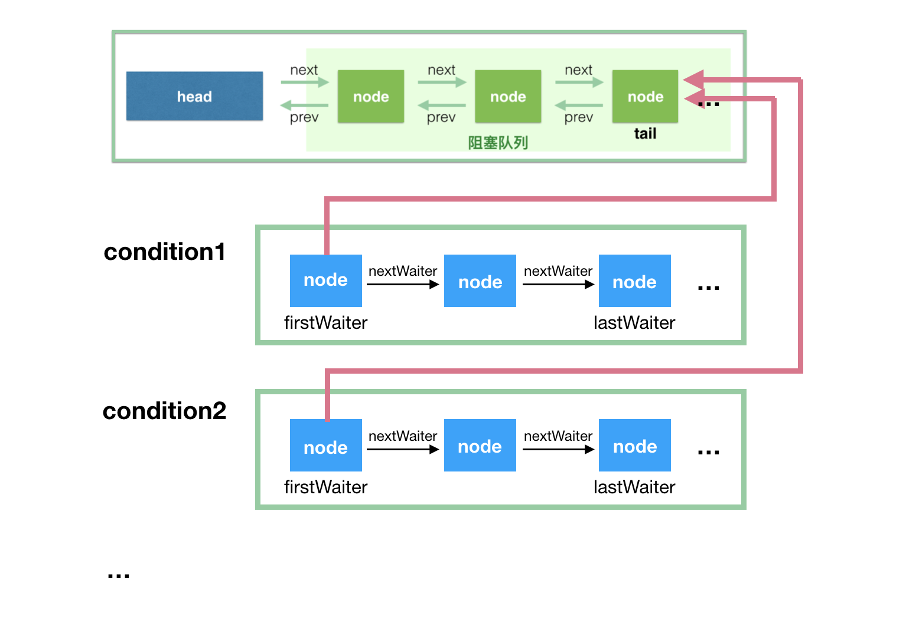

# AQS & CAS

[TOC]

## CAS

 CAS 实现原子型背后的一个假设是共享变量的当前值与当前线程所提供的旧值相同，我们就认为这个变量没有被其他线程修改过（乐观锁的思想）。在执行 CAS 指令时，CPU会履行 Coherence 协以确保 CAS 操作的可见性。

CAS 虽然很高效，但是它也存在三大问题：

- **ABA问题**：对于共享变量V，当前线程看到它的值为 A 那一刻，其他线程已经将其值更新为B，接着在当前线程执行 CAS 的时候，该变量的值又被其他线程更新为 A。这就是ABA问题，该问题是否可以接受与算法有关。想要规避 ABA 问题也不难，为共享变量的更新引入一个修订号（也称时间戳）即可。AtomicStampedReference 类就是基于这种思想的。
- **特定的性能问题**，空旋消耗 CPU 资源，此外在SMP架构上，还可能导致总线风暴
- **只能保证一个共享变量的原子操作**。对一个共享变量执行操作时，CAS能够保证原子操作，但是对多个共享变量操作时，CAS是无法保证操作的原子性的。

使用 CAS 进行无锁编程的基本模型：

~~~java
do {
	获得字段的期望值（oldValue）;
	计算出需要替换的新值（newValue）;
} while (!CAS(内存地址，oldValue，newValue))
~~~

### Unsafe

我们可以使用 sun.misc.Unsafe 下的 CAS 操作。由于 Unsafe 类不可以实例化，我们只能通过反射技术来间接实例化：

~~~java
public static Unsafe getUnsafe(){
    try {
        Field theUnsafe =
            Unsafe.class.getDeclaredField("theUnsafe");
        theUnsafe.setAccessible(true);
        return (Unsafe) theUnsafe.get(null);
    } catch (Exception e) {
        throw new AssertionError(e);
    }
}
~~~

Unsafe提供的 CAS 方法主要如下

- `public final native boolean compareAndSwapObject(Object o, long offset, Object  expected, Object update);`

  - 字段所在的对象
  - 字段在对象中的偏移量
  - 期望值
  - 更新值

  如果字段值和期望值相同，那么就将值设置为更新值。

- `public final native boolean compareAndSwapInt(Object o, long offset, int expected,int update);`

- `public final native boolean compareAndSwapLong(Object o, long offset, long expected, long update);`


Unsafe 提供的获取字段（属性）偏移量的方法：

- `public native long staticFieldOffset(Field field);`
- `public native long objectFieldOffset(Field field);`

下面给出一个使用示例：

~~~java
while (!unSafeCompareAndSet(oldValue, oldValue + 1))
    ;
~~~

~~~java
public final boolean unSafeCompareAndSet(
    int oldValue, 
    int newValue) {
    long valueOffset = unsafe.objectFieldOffset(OptimisticLockingPlus.class.getDeclaredField("value"));
    return unsafe.compareAndSwapInt(this, valueOffset, oldValue, newValue);
}
~~~


###  原子变量类

 原子变量类（Atomics）是基于 CAS 实现的工具类。能够保证 read-modify-write 操作的原子性和可见性。在执行 CAS 指令时，CPU会履行 Coherence 协以确保 CAS 操作的可见性

Java为我们提供的CAS类：

- 基础数据型：AtomicInteger、AtomicLong、AtomicBoolean
- 数组型：AtomicIntegerArray、AtomicLongArray、AtomicReferenceArray
- 字段更新器：AtomiclntegerFieldUpdater、AtomicLongFieldUpdater、AtomicReferenceFieldUpdater
- 引用型：AtomicReference、AtomicStampedReference、AtomicMarkableReference

`AtomicLong` 类的常用方法

- `long get()`
- `long getAndIncrement()`
- `long getAndDecrement()`
- `long incrementAndGet()`
- `void set(long newValue)`
- `boolean compareAndSet(long expect, long update)`

`AtomicBoolean`类主要提供了以下方法：

- `get()`：获取当前值。
- `set(boolean newValue)`：设置新的值。
- `getAndSet(boolean newValue)`：获取当前值，并设置新的值。
- `compareAndSet(boolean expect, boolean update)`：如果当前值`==`预期值，则以原子方式将该值设置为输入值（update）。

AtomicIntegerArray 类提供了以下方法：

- `int get(int i)` 
- `int getAndSet(int i, int newValue)`
- `int getAndIncrement(int i)`
- `int getAndDecrement(int i)` 
- `int getAndAdd(int i, int delta)` 
- `boolean compareAndSet(int i, int expect, int update)` 
- `void lazySet(int i, int newValue)`:在 set 之后的一小段时间内，仍有可能读到旧值

### ABA

JDK 提供了一个 AtomicStampedReference 类来解决 ABA 问题。AtomicStampedReference 除了要比较当前值和预期值外，还需要比较 Stamp。它的构造函数需要指定一个初始 Stamp

~~~java
AtomicStampedReference(V initialRef, int initialStamp)
~~~

AtomicStampReference 常用的几个方法如下：

- `V getRerference()`
- `int getStamp()`
- `boolean compareAndSet(V expectedReference, V newReference, int expectedStamp,int newStamp)`

### 空旋

可以以空间换时间来解决 CAS 恶性空旋，较为常见的方案为：

- 分散操作热点，例如使用 LongAdder 替代基础原子类 AtomicLong。
- 使用队列削峰，将发生 CAS 争用的线程加入一个队列中排队，降低 CAS 争用的激烈程度。JUC中非常重要的基础类 AQS（抽象队列同步器）就是这么做的。


LongAdder 将 value 值分散到一个数组中（见下图），不同线程会命中到数组的不同槽（元素）中，各个线程只对自己槽中的那个值进行 CAS 操作。这样热点就被分散了，冲突的概率就小很多。如果要获得完整的值，只要将各个槽中的变量值累加即可。


LongAdder 的 API 相对比较简陋，只有对数值的加减，而 LongAccumulator 提供了自定义计算操作：

~~~java
// accumulatorFunction：二元函数（接收 2 个 long 作为形参，并返回 1 个long）；identity：初始值
public LongAccumulator(LongBinaryOperator accumulatorFunction, long identity) {
    this.function = accumulatorFunction;
    base = this.identity = identity;
}

LongAccumulator accumulator = new LongAccumulator(Long::max, Long.MIN_VALUE);
 accumulator.accumulate(value); // 比较 value 和当前值，然后存储较大者
~~~


## AQS

为了避免由于无效争夺资源而导致的性能恶化，通常都会使用队列来进行排队与削峰。我们先来介绍 CLH 队列：

- 申请锁的线程通过 CAS 操作在单向链表的尾部增加一个节点
- 该线程只需要在其前驱节点上进行普通自旋，等待前驱节点释放锁即可（类似于使用 ZooKeeper 来实现锁实现）。这一点可以通过信号唤醒机制来优化，但增加了实现复杂度。可以考虑 Thread.yield();

这样的设计可以有效避免 CPU 总线风暴，因为只在入队时进行 CAS 操作。而且没有羊群效应，即避免了同时唤醒大量线程，在瞬间争抢 CPU 资源。


JUC 包内许多类都是基于AQS构建的，例如 ReentrantLock、Semaphore、CountDownLatch、ReentrantReadWriteLock、FutureTask 等。AQS 是 CLH 队列的一个变种，只不过它在内部维护一个 FIFO 双向链表。

 AQS 使用 state 变量来表示同步状态，并提供了相应的方法：

~~~java
private volatile int state;

// 返回同步状态
protected final int getState() {  
    return state;
}
// 设置同步状态的值，无法保证原子性
protected final void setState(int newState) { 
    state = newState;
}
// 设置同步状态的值，可以保证原子性
protected final boolean compareAndSetState(int expect, int update) {
    return unsafe.compareAndSwapInt(this, stateOffset, expect, update);
}
~~~

以可重入的互斥锁 `ReentrantLock` 为例，`state` 的初始值为 0，表示锁处于未锁定状态。当线程 A 调用 `lock()` 方法时，会尝试通过 `tryAcquire()` 方法独占该锁，并让 `state` 的值加 1。如果成功了，那么线程 A 就获取到了锁。如果失败了，那么线程 A 就会被加入到一个等待队列（CLH 队列）中，直到其他线程释放该锁。释放锁之前，A 线程自己是可以重复获取此锁的（`state` 会累加），这就是可重入性的体现。

`AbstractQueuedSynchronizer` 继承了 `AbstractOwnableSynchronizer`，这个基类只有一个变量 `exclusiveOwnerThread`，表示当前独占该锁的线程：

~~~java
public abstract class AbstractOwnableSynchronizer
    implements java.io.Serializable {

    //表示当前占用该锁的线程
    private transient Thread exclusiveOwnerThread;
    
    protected final void setExclusiveOwnerThread(Thread thread) {
        exclusiveOwnerThread = thread;
    }

    protected final Thread getExclusiveOwnerThread() {
        return exclusiveOwnerThread;
    }
}
~~~

`AbstractQueuedSynchronizer` 的底层数据结构是使用虚拟的双向队列，也就是说，仅存在结点之间的关联关系：

~~~java
static final class Node {
    
    static final Node SHARED = new Node();	// 共享模式
    
    static final Node EXCLUSIVE = null;      // 独占模式
    
    // 结点状态
    static final int CANCELLED =  1;
    static final int SIGNAL    = -1;
    static final int CONDITION = -2;
    static final int PROPAGATE = -3;        

    volatile int waitStatus;   	// 结点状态
    volatile Node prev;   	    // 前驱结点
    volatile Node next;         // 后继结点
    volatile Thread thread;     // 持有的线程  
    Node nextWaiter;		   // 在等待队列中的下一个节点
    
    final boolean isShared() {
        return nextWaiter == SHARED;
    }
    
    // 获取前驱结点，若前驱结点为空，抛出异常
    final Node predecessor() throws NullPointerException 
    
    // 无参构造方法
    // Used to establish initial head or SHARED marker
    Node() { }
    
    // 构造方法
    Node(Thread thread, Node mode) {    // Used by addWaiter
        this.nextWaiter = mode;
        this.thread = thread;
    }
    
    // 构造方法
    Node(Thread thread, int waitStatus) { // Used by Condition
        this.waitStatus = waitStatus;
        this.thread = thread;
    }
}
~~~

- waitStatus：表明节点的类型
  - CANCELLED（1）：表示当前线程取消了争抢这个锁
  - SIGNAL（-1）：表示当前node的后继节点需要被唤醒
  - CONDITION（-2）：表示当前节点在等待队列中，等待唤醒
  - PROPAGATE（-3）：共享模式释放锁才会使用

- nextWaiter： 指向下一个处于 CONDITION 状态的节点。
- SHARED 表示线程因获取共享资源失败，而被添加到队列中的。
- EXCLUSIVE 表示线程因获取独占资源失败，而被添加到队列中的。

队列的 head 节点只会被 setHead() 方法修改。而 tail 节点只在有新线程获取资源失败时才被创建。

 

AQS定义了两种资源共享方式：

- Exclusive（独享锁）：只有一个线程能占有锁资源。独享锁又可分为公平锁和非公平锁。
- Share（共享锁）：多个线程可同时占有锁资源

AQS 使用了模板方法模式，自定义同步器时，需要重写下面几个 AQS 提供的模板方法：

```java
isHeldExclusively()		// 该线程是否正在独占资源。只有用到condition才需要去实现它。
tryAcquire(int)			// 独占方式。尝试获取资源，成功则返回true，失败则返回false。
tryRelease(int)			// 独占方式。尝试释放资源，成功则返回true，失败则返回false。
tryAcquireShared(int)    // 共享方式。尝试获取资源。负数表示失败；0表示成功，但没有剩余可用资源；正数表示成功，且有剩余资源。
tryReleaseShared(int)    // 共享方式。尝试释放资源，成功则返回true，失败则返回false。
```

以上钩子方法的默认实现会直接抛出 `UnsupportedOperationException` 异常。

### 独占模式

 AQS 提供 acquire 方法来获取资源。因为流程很复杂，这里直接贴上源代码和注解来分析。

~~~java
public final void acquire(int arg) {
    // 如果钩子方法 tryAcquire 尝试获取同步状态失败的话，就。在节点入队之后，就开始自旋抢锁的流程 —— acquireQueued
    if (!tryAcquire(arg) &&
        acquireQueued(addWaiter(Node.EXCLUSIVE), arg))
        selfInterrupt();
}
~~~

这里有三个关键方法：

- tryAcquire：用于获取资源
- acquireQueued：当获取资源失败时，调用此方法，开始自旋抢锁。
- addWaiter：当获取资源失败时，调用此方法，首先构造节点（Node.EXCLUSIVE），然后将该节点以 CAS 方法添加到同步队列的队尾。

我们来看一下 acquireQueued 方法的实现 

~~~java
final boolean acquireQueued(final Node node, int arg) {
    boolean failed = true;
    try {
        boolean interrupted = false;
        // 不断地执行 for 死循环来获取同步状态
        for (;;) {
            // 获取节点的前驱节点
            final Node p = node.predecessor();
            // 只有节点的前驱是头节点才能尝试获取锁
            // 当唤醒时，必须再次尝试获取锁
            if (p == head && tryAcquire(arg)) {
                // 获取成功后，将自己设置为头节点
                setHead(node);
                p.next = null; 
                failed = false;
                return interrupted;
            }
            // 为了不浪费资源，在自旋过程中会阻塞线程
            if (shouldParkAfterFailedAcquire(p, node) && parkAndCheckInterrupt())
                interrupted = true; 
        }

    } finally {
        if (failed)
            // 一般  tryAcquire() 抛出异常时，会走到这一步
            // 把当前 node 的状态设置为 CANCELLED
            cancelAcquire(node);
    }
}
~~~

~~~java
// 在调用 `parkAndCheckInterrupt()` 来挂起节点之前，要使用 `shouldParkAfterFailedAcquire()` 来决定是否要挂起，它的实现如下：
private static boolean shouldParkAfterFailedAcquire(Node pred, Node node) {
    int ws = pred.waitStatus; // 获得前驱节点的状态
    if (ws == Node.SIGNAL)   // 如果前驱节点状态为 SIGNAL（值为-1）就直接返回
        return true;
    if (ws > 0) {
        // 遍历找到有效前驱节点，不是 CANCELLED（1）类型节点
        // 并删除掉其中的 CANCELLED 节点
        do {
            pred = pred.prev; 
            node.prev = pred;
        } while (pred.waitStatus > 0);
        pred.next = node;
    } else {
        // 设置前驱的状态为 SIGNAL，用于后续唤醒操作
        compareAndSetWaitStatus(pred, ws, Node.SIGNAL);
    }
    // 如果 `shouldParkAfterFailedAcquire()` 返回 false，那么节点继续循环获取同步状态
    return false;
}

private final boolean parkAndCheckInterrupt() {
    LockSupport.park(this);			// 该方法不会抛出异常
    return Thread.interrupted(); 	
}
~~~

 AQS 提供 release 方法来释放资源

~~~java
public final boolean release(long arg) {
    if (tryRelease(arg)) { 
        Node h = head; 
        // h != null && waitStatus == 0 表明后继节点对应的线程仍在运行中，不需要唤醒
        // h != null && waitStatus < 0 表明后继节点可能被阻塞了，需要唤醒
        if (h != null && h.waitStatus != 0)
            unparkSuccessor(h); // 唤醒后继线程
        return true;
    }
    return false;
}

private void unparkSuccessor(Node node) {
    int ws = node.waitStatus;
    if (ws < 0)
        // 清空头节点的 waitStatus 值，即置为0
        compareAndSetWaitStatus(node, ws, 0);
    
    Node s = node.next;
    // 找到在所有 waitStatus<=0 节点中排在最前面的
    if (s == null || s.waitStatus > 0) {
        s = null;
        // 之所以从尾部开始遍历，是为了能保证遍历到所有的节点
        // 比如，当前 node 是前 tail 节点，新的 node2 正在变成 tail 节点，但是 addWaiter 中 pred.next = node; 并不是原子操作，很可能这步还未来得及执行，如果正向遍历，node.next，会为null，就会遗漏新加入的节点，但是从 tail 开始遍历肯定没问题，因为在设置 tail 节点时，compareAndSetTail(pred, node) 是原子操作
        for (Node t = tail; t != null && t != node; t = t.prev)
            if (t.waitStatus <= 0) 
                s = t;
    }
    
    if (s != null)
        LockSupport.unpark(s.thread); 
}
~~~


下面我们来实现一个简单的公平锁

~~~java
class SimpleMockLock implements Lock {
    private final Sync sync  = new Sync();

    private static class Sync extends AbstractQueuedSynchronizer {
        @Override
        protected boolean tryAcquire(int arg) {
            if (compareAndSetState(0, 1)) {
                setExclusiveOwnerThread(Thread.currentThread());
                return true;
            }
            return false;
        }

        @Override
        protected boolean tryRelease(int arg) {
            if (Thread.currentThread() != getExclusiveOwnerThread() || getState() == 0) {
                throw new  IllegalMonitorStateException();
            }
            // 完全释放资源后，将独占线程设置为null,这样后面的竞争线程才有可能抢占。
            setExclusiveOwnerThread(null);
            setState(0);
            return true;
        }
    }

    @Override
    public void lock()
    {
        // 委托给同步器的acquire()抢占方法
        sync.acquire(1);
    }

    @Override
    public void unlock()
    {
        // 委托给同步器的release()释放方法
        sync.release(1);
    }
}
~~~


下面我们通过 ReentrantLock 来分析如何使用 AQS 来实现非公平锁：

~~~java
public ReentrantLock() {
    // ReentrantLock 默认使用非公平策略。
    sync = new NonfairSync();
}

public void lock() {
    sync.lock();
}

// ReentrantLock 将加锁的逻辑委托给一个同步器 Sync
static final class NonfairSync extends Sync {
    // 非公平锁抢占
    final void lock() {
        if (compareAndSetState(0, 1))
            // ReentrantLock「非公平」就体现在这里。如果占用锁的线程刚释放锁，将 state 置为 0，而排队等待锁的线程尚未被唤醒，那么新来的线程就直接抢占了该锁。
            setExclusiveOwnerThread(Thread.currentThread());
        else
            // 通过 acquire 来抢占锁
            acquire(1);
    }
    
    protected final boolean tryAcquire(int acquires) {
        return nonfairTryAcquire(acquires);
    }
}

abstract static class Sync extends AbstractQueuedSynchronizer {
    final boolean nonfairTryAcquire(int acquires) {
        final Thread current = Thread.currentThread();
        int c = getState();
        if (c == 0) {
            // 对于头节点的后继来说，如果它被唤醒后发现不是 0，说明被新来的线程抢占了
            // 此时，继续死循环获取同步状态，而且头节点保持不变。
            if (compareAndSetState(0, acquires)) {
                setExclusiveOwnerThread(current);
                return true;
            }
        }
        // 处理可重入的逻辑
        else if (current == getExclusiveOwnerThread()) {
            int nextc = c + acquires;
            if (nextc < 0) // overflow
                throw new Error("Maximum lock countexceeded");
            setState(nextc);
            return true;
        }
        return false;
    }
}
~~~

~~~java
static final class FairSync extends Sync {
    // 公平锁抢占
    final void lock() {
        acquire(1);
    }
    // 省略其他
}
~~~


### 共享模式

AQS 提供 acquireSharedInterruptibly 来获取资源：

~~~java
public final void acquireSharedInterruptibly(int arg)
            throws InterruptedException {
    if (Thread.interrupted())      // 如果线程已经中断，直接抛出异常结束。
        throw new InterruptedException();
    if (tryAcquireShared(arg) < 0) // 尝试获取共享资源，获取失败后，CAS 操作进入队列
        doAcquireSharedInterruptibly(arg);
}
~~~

doAcquireSharedInterruptibly() 方法在获取失败后调用，它的实现如下：

~~~java
private void doAcquireSharedInterruptibly(int arg)
    throws InterruptedException {
    final Node node = addWaiter(Node.SHARED);
    boolean failed = true;
    try {
        for (;;) {
            // 获取当前节点的前驱节点
            final Node p = node.predecessor(); 
            if (p == head) {
                // 共享模式获取许可
                int r = tryAcquireShared(arg);
                //  r>=0 说明此时还有锁资源，设置头节点，并且通知后面的节点也获取锁资源。独占锁和共享锁的差异点就在于此，共享锁在前一个节点获取资源后，会通知后续的节点也一起来获取
                if (r >= 0) { 
                    // 设置当前节点为头结点并且唤醒后继节点
                    setHeadAndPropagate(node, r); 
                    p.next = null; // help GC
                    failed = false;
                    return;
                }
            }
            if (shouldParkAfterFailedAcquire(p, node) && 
                parkAndCheckInterrupt()) 
                throw new InterruptedException();
        }
    } finally {
        if (failed)
            cancelAcquire(node); 
    }
}
~~~

我们来看 `setHeadAndPropagate(node, r);` 这个关键代码的实现：

~~~java
private void setHeadAndPropagate(Node node, int propagate) {
    // 记录旧 head 节点
    Node h = head; 
    // 执行完 setHead 方法后，node 节点成为新的 head 节点
    setHead(node); 
    // propagate > 0 说明有剩余资源
    if (propagate > 0 || h == null || h.waitStatus < 0 || 
        (h = head) == null || h.waitStatus < 0) { 
        Node s = node.next;
        // 没有后继节点或者后继节点是共享类型，进行唤醒
        if (s == null || s.isShared()) 
            // 会通知后继的节点也一起来获取资源
            doReleaseShared(); 
    }
}
~~~

如果后继节点被唤醒后成功获取资源，那么它将自己设置为 head，然后唤醒后继的后继，依次传递下去。然后在独占模式下，节点只有在头节点释放资源时，才会被唤醒。而在共享模式下，除了释放资源时，还可以在成功获取资源后唤醒后继节点。


AQS 提供 releaseShared 来释放资源：

~~~java
public final boolean releaseShared(int arg) {
    if (tryReleaseShared(arg)) {
        doReleaseShared();
        return true;
    }
    return false;
}
~~~

~~~java
private void doReleaseShared() {
    for (;;) {
        // 唤醒操作从头结点开始
        Node h = head;
        if (h != null && h != tail) {
            int ws = h.waitStatus;
            // 如果后继节点需要被唤醒,所以将头节点的状态 SIGNAL 改为 0（因为SIGNAL表示的是下一个节点是阻塞状态）
            if (ws == Node.SIGNAL) {
                if (!compareAndSetWaitStatus(h, Node.SIGNAL, 0))
                    continue;   
                // 唤醒下一个可以被唤醒的节点
                unparkSuccessor(h);
            }
            else if (ws == 0 &&
                     !compareAndSetWaitStatus(h, 0, Node.PROPAGATE))
                continue;               
        }
        if (h == head)                   
            break;
    }
}
~~~

引入了 PROPAGATE 状态是为了解决这个 BUG （JDK-6801020）


注意，我们在独占模式下，一般要使用 setExclusiveOwnerThread 来标识正在执行的线程，用于之后获取资源的判断。而在共享模式下，我们无需调用该方法，毕竟同时有多个线程正在执行。

### ConditionObject

ConditionObject 类是实现等待队列的关键。每个 ConditionObject 对应一个等待队列



当线程调用 await() 方法时，要求正好处于占有锁的状态，即当前线程为当前 AQS 队列的头节点。await() 方法需要把该线程从 AQS 队列挪到 Condition 等待队列里，然后唤醒头节点的后继节点。

线程在某个 ConditionObject 对象上调用 signal() 方法后，等待队列中的 firstWaiter 会被加入同步队列中的队尾。
