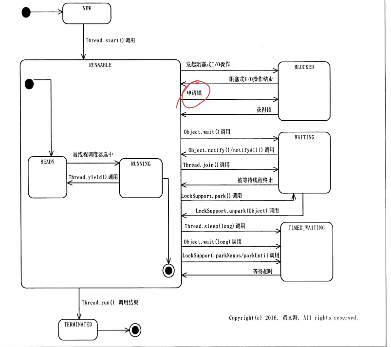
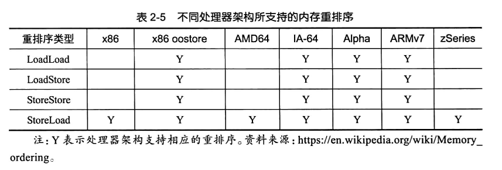
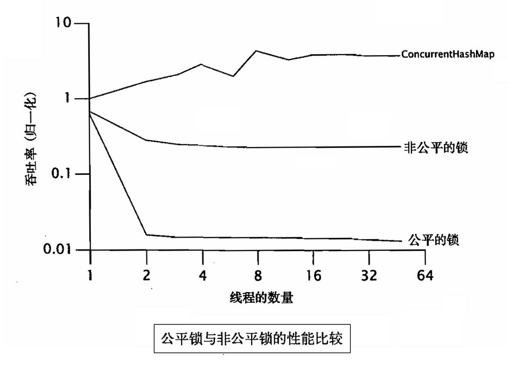
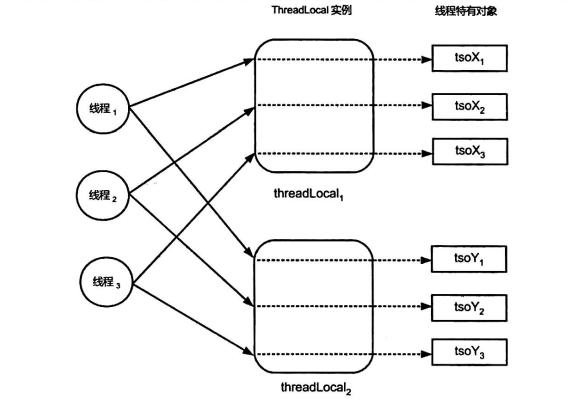
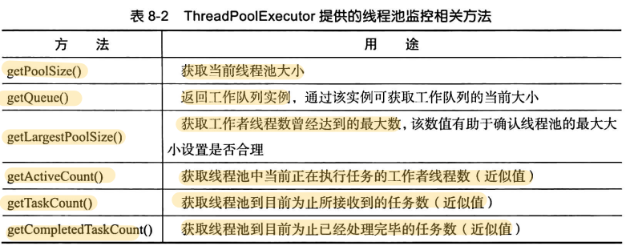

# Java线程

[TOC]

## 概述

多线程编程可以充分利用多核（Multicore）处理器资源。这充分利用体现在两个方面：

- **并发**同时执行多个任务，解决的是**阻塞**问题。
- **并行**同时**在多处**执行多个任务，解决的是**计算密集型**问题。

从上述定义可以看出易混淆这两个术语的原因：两者都是「同时执行多个任务」，而并行则额外包括了多处理器、分布式处理的概念。这两者解决的是不同类型的问题：对于I/O密集型问题，并行可能起不到什么明显的作用，因为性能瓶颈不在于执行速度，而在于阻塞；而对于计算密集型问题，如果想用并发在单处理器上解决，则多半会徒劳无功。

很多编程语言（包括Java）使用了相同的机制——**线程**——来同时实现并发和并行。但线程机制也同时带来了以下问题：

- 线程安全(Thread Safe)问题
- 线程活性(Thread Liveness)问题
  - 死锁(Deadlock)
  - 锁死(Lockout)，例如唤醒信号丢失
  - 活锁(Livelock)
  - 饥饿(Starvation)
- 上下文切换(Context Switch)的性能损耗

- **进程**是向操作系统申请资源（如内存空间和文件句柄）的基本单位。
- **线程( Thread)** 是进程中一条控制流，同时也是是操作系统能够进行调度的最小单位。同一个进程中的所有线程共享该进程中的资源。

为什么线程开销比进程开销小？

- 通信代价少（线程使用虚拟内存，进程需要信号量等机制），简化了编程模型的复杂度
- 占用资源少，多个线程共享同一份进程资源（例如，堆内存）

### 线程的创建

- 基于继承

  ~~~java
  class WelcomeThread extends Thread {
  	@Override
      public void run() {
          System.out.println("Hello World");
      }
  }
  // 创建线程
  Thread welcomeThread = new WelcomeThread();
  
  // 启动线程
  welcomeThread.start();
  ~~~
  
- 基于组合

  ~~~java
  // 创建线程
  Thread welcomeThread = new Thread(new Runnable() {
      @Override
      public void run() {
          System.out.println("Hello World");
      }
  })
      
  // 启动线程
  welcomeThread.start();
  ~~~

小知识点：

- 线程的 `start` 方法也只能被调用一次，多次调用同一个 `Thread` 实例的 `start`方法，会导致其抛出 `lllegalThreadStateException` 异常。

- JVM 在合适时机会调用`run`方法，而在应用代码中直接调用线程的 `run` 方法，只会在当前线程中执行。

- 输出当前线程的信息：

  ~~~java
  Thread.currentThread().getName()
  Thread.currentThread().getId()
  Thread.currentThread().getState()
  Thread.currentThread().getPriority()
  ~~~

- `Runnable`接口可以被看作对任务进行的抽象：

  ~~~java
  @FunctionalInterface
  public interface Runnable {
      public abstract void run();
  }
  ~~~

  `Thread`类是`Runnable`接口的一个实现类：

  ~~~java
  public class Thread implements Runnable {
      private Runnable target;
      
      public Thread(Runnable target) {
          this(null, target, "Thread-" + nextThreadNum(), 0);
      }
      
      @Override
      public void run() {
          if (target != null) {
              target.run();
          }
      }
  }
  ~~~

### 线程的属性

|       属性        |                             用途                             | 是否只读 |
| :---------------: | :----------------------------------------------------------: | :------: |
|     编号 (ID)     |                      用于标识不同的线程                      |    ✔️     |
|    名称 (Name)    |                   有助于代码调试和问题定位                   |    ❌     |
| 线程类别 (Daemon) | 值为 true 表示相应的线程为守护线程，否则表示相应的线程为用户线程。该属性的默认值与父线程的相同 |    ❌     |
| 优先级 (Priority) | 给线程调度器的**提示**信息，用于表示哪个线程能够优先得以运行。Java定义了1~10（最高）优先级。默认值一般为 5，或者与其父线程的优先级值相等 |    ❌     |

小知识点：

- `Daemon`属性必须在线程启动前设置，即`setDaemon` 方法必须在 `start` 方法之前调用，否则 `setDaemon` 方法会抛出 `lllegalThreadStateException` 异常

- 用户线程会阻止 Java 虚拟机的正常停止，而守护线程却不会。

### Thread常用方法

- `static Thread currentThread()`：返回当前线程对象
- `void run()`：仅仅是一个普通方法，表示要执行的任务
- `void start()` ：启动线程
- `void join()`：等待被调用线程执行完毕
- `void join(long millis)` 
- `static void yield()`：使当前线程主动放弃其对处理器的占用，即从运行状态转到就绪状态
- `static void sleep(long millis)`：休眠

不过，Java平台中并没有提供获取父线程，或者获取所有子线程的API。并且，父线程和子线程之间的生命周期也没有必然的联系。例如父线程运行结束后，子线程可以继续运行，子线程运行结束也不妨碍其父线程继续运行。

在Java中，没有直接方式来 kill 掉一个线程，但是可以通过中断机制来间接结束一个线程。

### 线程的状态

可以通过 `Thread.getState()` 调用来获取Java 线程的状态

- **NEW**：已创建而未启动

- **RUNNABLE**：它包括两个子状态

  - READY：等待线程调度器(Scheduler)进行调度
  - RUNNING：正在运行

  执行 `Thread.yield()`的线程，其状态可能会由 RUNNING 转换为READY。

- **BLOCKED**：线程发起一个阻塞式I/O操作后，或者申请一个独占资源时，线程会处于该状态

- **WAITING**：等待执行该线程所期望的特定操作，例如`object.notify()`。线程在Waiting状态下是主动放弃CPU资源并且不持有任何锁，而线程在Blocked状态下是被动地等待锁的释放。

- **TIMED_WAITING**：当其他线程没有在指定时间内，执行该线程所期望的特定操作时，该线程的状态自动转换为RUNNABLE。

- **TERMINATED**：执行结束

  - `Thread.run()`正常返回
  - 抛出异常而提前终止

## 竞态

计算正确性依赖于特定的并行指令流，这种现象称为**竞态(Race Condition)**。但是，我们不能对并行指令流做出任何假设。

术语规范：

- **状态变量(State Variable )**：即类的实例变量、静态变量。

- **共享变量(Shared Variable)**：即可以被多个线程共同访问的变量。

在编程层面上，竞态有两种表现形式：

- **read-modify-write**，例如：

  ~~~java
  load(sequence,rl);	// 1
  increment(rl);		// 2
  store(sequence,rl);	// 3
  ~~~

  1. 一个线程在执行完load指令后，准备执行increment指令时，其他线程已经更新sequence。
  2. 此时，该线程所读取的sequence就是一个旧值。
  3. 之后执行store指令会将旧值写入，从而发生更改丢失的现象。

- **check-then-act**

  ~~~java
  1f(sequence >= 999)(		// 1
  	sequence = 0;			// 2
  }else {
  	sequence++;
  )
  ~~~

  一个线程在执行完子操作①到开始(或者正在)执行子操作②的这段时间内，其他线程可能已经更新了共享变量的值，使得if语句中的条件变为不成立，那么此时该线程仍然会执行子操作②

## 线程安全性

线程安全性是指调用者在不加任何保护措施的情况下，调用该方法总能保证结果的正确性。线程安全问题有三种表现形式：原子性、可见性和有序性。

在体系结构的层面上

- 原子性是通过CAS指令来解决的
- 可见性与有序性都是通过内存屏障来解决的

### 原子性

原子性是指，该操作对于其他线程来说是不可分割的，也就是说要么已经完成了，要么还未开始，不会存在正在执行中的这种中间状态。

Java中有两种方式来实现原子性：

- 锁(Lock)
- CAS(Compare-and-Swap)指令

Java 语言规范规定，对基础类型和引用的写操作都是原子的，对于任何变量的读操作也都是原子操作

> 在32位处理器上， long/double 型变量的写操作不具备原子性，可以通过 volatile 关键字

我们会在同步一节，详细讨论如何去构建原子性。

### 可见性

一个线程对某个共享变量进行更新之后，后续访问该变量的线程可能无法立刻读取到这个更新的结果，这就是可见性问题。

下面我们来看一个因编译器优化而导致的可见性问题：

~~~java
public class VisibilityDemo {
    public static void main(String[] args) throws InterruptedException {
        TimeConsumingTask timeConsumingTask = new TimeConsumingTask();

        Thread thread = new Thread(new TimeConsumingTask());
        thread.start();
        
        //指定的时间内任务没有执行结束的话，就将其取消
        Thread.sleep(10000);
        timeConsumingTask.cancel();
    }
}

class TimeConsumingTask implements Runnable (
	private boolean toCancel = false;
	@override
	public void run(){
		while (!toCancel) {
			if (doExecute()) {
				break;
			}
		}
     }

	public void cancel(){
		toCancel = true;
	}
}
~~~

因为，代码没有给JIT编译器足够多的提示（toCancel被多个线程共享），从而让JIT优化上述代码，不幸的是这将导致死循环。

~~~java
if (!toCannel) {
    while (true) {
        if (doExecute()) {
            break;
        }
    }
}

~~~

此外，可见性问题还与计算机的存储系统有关：

- 如果两个线程分别运行在不同的处理器上，而这两个线程所共享的变量却被分配到寄存器上进行存储，那么可见性问题就会产生。
- 即便某个共享变量是被分配到主内存中进行存储的，由于处理器的高速缓存(Cache)子系统，也不能保证该变量的可见性。

总结起来就是存储系统的数据一致性问题。

我们可以使用volatile关键字来保证可见性，它有两个作用：

- 提示JIT编译器，被修饰的变量可能被多个线程共享，以阻止JIT编译器做出错误的优化。例如保证分配到主存上
- 读取volatile变量时，处理器会执行刷新缓存的操作

Java语言规范保证：

- 在父线程启动子线程之前的共享变量更新操作，对于子线程来说，是可见的。
- 线程终止之前的共享变量更新操作，对于调用该线程的 join 方法的线程而言，是可见的。

此外，还有由于写缓冲器/无效化队列导致的可见性问题。该问题也可以视为有序性问题的一种。

### 有序性

重排序是对内存访问操作所做的一种优化，它可以在不影响单线程程序正确性的情况下，提升程序的性能。但是，它可能对多线程程序的正确性产生影响。

它的表现形式有两种：
- 程序顺序与源代码顺序不一致——编译器
- 执行顺序与程序顺序不一致——编译器、处理器

> - **源代码顺序(Source Code)**
> - **程序顺序(Program Order)**：字节码
> - **执行顺序(Execution Order)**：在处理器上的实际执行顺序

重排序有四种类型：

- LoadLoad 重排序 (Loads reordered after loads )
- StoreStore 重排序 (Stores reordered after stores)
- LoadStore 重排序 (Loads reordered after stores)
- StoreLoad 重排序 (Stores reordered after loads)

下面我们说明一个指令重排序的例子：

~~~java
helper = new Helper(externalData);
~~~

该语句可以分解为为以下几个子操作

~~~c++
//子操作①:分配Helper实例所需的内存空间
objRef = allocate(Helper,class);

//子操作②:调用Helper类的构造器
inovkeConstructor(objRef);

//子操作③
helper = objRef; 
~~~

JIT可能将③重排到②之前，这就导致其他线程检查到hepler不为null时，该实例可能并没有完成初始化。

关于指令重排还有几点说明：

- 处理器出于吞吐量的考虑，会乱序执行指令，而指令的结果会存入**重排序缓冲器(ROB,Reorder Buffer)**，然后按照程序顺序提交给主存。也就是说，即使指令是乱序执行的，但是结果是顺序提交的。
- 处理器还使用了动态预测技术，这也会对有序性产生影响。
- 处理器的乱序技术保证，存在**数据依赖关系**的语句不会被重排序。存在**控制依赖关系**的语句是可以允许被重排序的（动态预测技术）

## 上下文切换

上下文切换分为

- **自发性上下文切换 (Voluntary Context Switch)**，下列任意一个方法都会引起自发性上下文切换：

  - Thread.sleep(long millis)
  - Object.wait()
  - Thread.yieldO
  - Thread.join()
  - LockSupport.park()

  另外，线程发起了I/O操作或者，等待获取锁，也会导致自发性上下文切换

- **非自发性上下文切换(Involuntary Context Switch)**

  - 用完分配给线程的时间片

它的开销代价有：

- 操作系统保存和恢复上下文
- 线程调度器的调度策略
- 处理器高速缓存的重新加载

## 资源争用与调度

只能够被一个线程占用的资源被称为**排他性(Exclusive)资源**。常见的排他性资源包括处理器、 数据库连接、文件等。当一个线程未放弃资源所有权时，其他线程试图访问该资源源的现象就被称为**资源争用(Resource Contention)**。并发系统的理想情况是高并发、低争用。

如果资源的先申请者总是能够比后申请者先获得该资源的独占权，那么该资源调度策略就被称为是**公平的(Fair)**，否则是**非公平的 (Non-fair）**。一般来说，非公平调度策略的吞吐率比公平调度的高，这与非公平调度算法所要实现的目标有关。

## 合理设置线程数

**Amdahl's**定律：

设处理器的数量为$N$，程序中必须串行（即无法并发化）的部分耗时占程序全部耗时的比率为$P$，那么将这样一个程序改为多线程程序，并假设可并行部分被$N$个处理器平分，那么最大提速$S$与$N$、$P$之间的关系如下：
$$
S_{max} = \frac{1}{P +\frac{1-P}{N}}
$$

线程数设置得过少，可能无法充分利用处理器资源；而线程数设置得过大吗，又可能导致过多的上下文切换，反而降低了系统的性能。

有一个经验准则是，对于CPU密集型线程，线程数设置为$N_{cpu}+1$；对于IO密集型线程，线程数设置为$N_{cpu} * 2$。但是这个经验准则无法满意的回答下述这个问题：

假设一个请求的计算操作需要 5ms，而数据库操作需要 100ms，对于一台 8 核 CPU 的服务器该如何设置线程数？

为此，我们再介绍一个公式：
$$
N_{threads} = N_{cpu} * U_{cpu} * (1 + \frac{WT}{ST})
$$

- $U_{cpu}$是CPU最大使用率，准确点来说是，操作系统限制该程序所能使用的CPU资源
- WT 是 IO 等待时长
- ST 是实际使用 CPU 的时长

使用该公式，我们就可以回答上述问题了，答案是 $8 * 21 = 168$个线程数

## ThreadLocal

TheadLocal 为每个线程单独维护一个对象。

方法摘要：

- `public T get()`
- `public void set(T value)`
- `protected T initialValue()`，设置线程特有对象的初始值，默认是返回 null。需要覆写该方法
- `public void remove()`

注意，ThreadLocal 有一个潜在的内存泄露问题。我们先来看 ThreadLocal 的实现原理，每一个 Thread 维护唯一一个 ThreadLocalMap，key 就是 ThreadLocal 实例的**弱引用**，而 value 为需要保存的值。也就是说，ThreadLocal 本身并不存储对象，它依赖于 Thread 类中的`ThreadLocalMap`，当调用`set(T value)`时，`ThreadLocal` 将自身作为 `Key`，值作为 `Value` 存储到 `Thread` 类中的`ThreadLocalMap`中，这就相当于所有线程读写的都是自身的一个私有副本，也就不存在线程安全问题了。

对于 Key，我们无需考虑内存泄漏问题，毕竟它是弱引用的。但是对于 Value，ThreadLocalMap 持有它的强引用。也就是说，Value 的生命周期跟线程的绑定在一起了。线程一般很少回收，基本上在线程池中进行复用。因此，Value 可能在很长一段时间内都不被回收，从而造成了内存泄漏。我们可以主动调用 remove 方法，来删除这个 Value 的强引用。或者，ThreadLocal 在执行 get、set、remove 方法时，会执行一定的清理工作，可能就删除 Value 的强引用。

~~~java
// 假设线程一直运行
// 1. 泄漏了
ThreadLocal local = new ThreadLocal();
local.set(new Test());
local = null;

// 2. 主动调用 remove 方法，确保能回收 Value
ThreadLocal local = new ThreadLocal();
local.set(new Test());
local.remove();//手动删除
local = null;

// 3. ThreadLocal 自动清理（不推荐，有很大不确定性）
ThreadLocal local = new ThreadLocal();
local.set(new Test());
local = null;

// get()过程会触发清理
for (int i = 0; i < 10; i++) {
    new ThreadLocal<>().get();
}
~~~

## 活性故障

死锁的产生，需要同时满足以下四个条件：

- 资源互斥（Mutual Exclusion）：资源是独占的
- 资源不可抢夺（No Preemption）
- 占用并等待资源（Hold and Wait）：涉及的线程当前至少持有一个资源 A， 并申请其他资源 B，而资源 B 恰好被其他线程持有。在这个资源等待的过程中，线程并不释放其已经持有的资源 A。
- 循环等待资源（Circular Wait）

由于锁具有排他性，并且锁只由其持有线程主动释放，因此由锁导致的死锁只能够从「占用并等待资源」和「循环等待资源」这两个方面入手。

- 锁排序法（Lock Ordering），锁申请的顺序具有偏序关系。
- 通过`ReentrantLock.tryLock(long,TimeUnit)`申请锁。

死锁的恢复：

1. 通过`Lock.lockInterruptibly()`来获取锁
2. 定义一个工作者线程 `DeadlockDetector`，专门用于死锁检测与恢复。
   1. 通过`java.lang.management.ThreadMXBean.findDeadlockedThreads()` 方法来进行死锁检测
   2. 对死锁的线程发送中断

活锁（Livelock）是指线程一直处于运行状态，但是其任务却一直无法进展的一种活性故障。死锁是语言层面上的，而活锁是业务层面上的。

## 线程组

官方已经废除线程组了，不再做介绍了。

## 可靠性问题

~~~java
@FunctionalInterface
public interface UncaughtExceptionHandler {
    /**
     * Method invoked when the given thread terminates due to the
     * given uncaught exception.
     * Any exception thrown by this method will be ignored by the
     * Java Virtual Machine.
     * @param t the thread
     * @param e the exception
     */
    void uncaughtException(Thread t, Throwable e);
}
~~~

使用示例：

~~~java
Thread thread = new Thread(...);
thread.setUncaughtExceptionHandler(new UncaughtExceptionHandler() {
    @Override
    public void uncaughtException(Thread t, Throwable e) {
        // 记录异常
    }
});
~~~

如果一个线程没有关联的 `UncaughtExceptionHandler` 实例，那么该线程会调用所属线程组的 `uncaughtException` 方法

~~~java
// ThreadGroup
public void uncaughtException(Thread t, Throwable e) {
    if (parent != null) {
        parent.uncaughtException(t, e);
    } else {
        Thread.UncaughtExceptionHandler ueh =
            Thread.getDefaultUncaughtExceptionHandler();
        if (ueh != null) {
            ueh.uncaughtException(t, e);
        } else if (!(e instanceof ThreadDeath)) {
            System.err.print("Exception in thread \""
                             + t.getName() + "\" ");
            e.printStackTrace(System.err);
        }
    }
}
~~~

最后会调用默认的`Thread.UncaughtExceptionHandler`。

`Thread.setDefaultUncaughtExceptionHandler`方法可用来指定默认的 `UncaughtExceptionHandler`。

## 线程池

对象池的目的就是复用对象资源，避免频繁地创建和销毁对象所带来的性能开销。

~~~java
public class ThreadPoolExecutor extends AbstractExecutorService {}
~~~

通过`submit`方法来提交任务

~~~java
// AbstractExecutorService
public <T> Future<T> submit(Callable<T> task) {}
public <T> Future<T> submit(Callalbe<T> task) {}
~~~

注：`Executors.callable(Runnable task,T result)`能够将 `Runnable` 接口转换为 `Callable` 接口。

`ThreadPoolExecutor`的构造器

~~~Java
public ThreadPoolExecutor(int corePoolSize,
    int maximumPoolSize,
    long keepAliveTime,
    TimeUnit unit,
    BlockingQueue<Runnable> workQueue,
    ThreadFactory threadFactory,
    RejectedExecutionHandler handler)
~~~

- `keepAliveTime` 和 `unit` 合在一起，用于指定线程池中空闲（Idle）线程的最大存活时间

- `threadFactory`，创建工作者线程的线程工厂。如果我们没有设置该属性，那么会使用默认的线程池——`Executors.defaultThreadFactory()`。它就是将创建线程的逻辑封装一下，定义如下：

  ~~~java
  public interface ThreadFactory {
      Thread newThread(Runnable r);
  }
  ~~~

- `workQueue`，一个缓冲队列。当提交任务时，会调用其非阻塞方法`offer(E e)`。如果队列已满，那么会执行拒绝策略

三个关键属性

- 当前线程池大小
- 核心线程池大小：corePoolSize
- 最大线程池大小：maximumPoolSize

若$当前大小 \leq 核心大小$，那么创建的线程即使超过空闲时间，也不会被销毁。换句话说，对于超过线程池核心大小部分的工作者线程，若其空闲时间达到 keepAliveTime 所指定的时间后，就会被清理掉。

`ThreadPoolExecutor.prestartAllCoreThreads()`使得我们可以使线程池在未接收到任何任务的情况下，预先创建并启动所有核心线程。

当线程池饱和（Saturated）时，即$当前大小 == 最大大小$，或者 workQueue 已满，此时会拒绝（Reject）提交的任务。为了提高线程池的可靠性， Java标准库引入了一个 `RejectedExecutionHandler`接口用于封装拒绝任务的处理策略：

~~~Java
public interface RejectedExecutionHandler {
    void rejectedExecution(Runnable r, ThreadPoolExecutor executor);
}
~~~

我们可以通过线程池的构造器参数 `handler` 或者线程池的 `setRejectedExecutionHandler(RejectedExecutionHandler handler)`方法来为线程池关联一个 `RejectedExecutionHandler`。

ThreadPoolExecutor 自身提供了几个现成的 RejectedExecutionHandler 接口实现类

| 实现类                                   | 处理策略                                                 |
| ---------------------------------------- | -------------------------------------------------------- |
| `ThreadPoolExecutor.AbortPolicy`（默认） | 直接抛出异常                                             |
| `ThreadPoolExecutor.DiscardPolicy`       | 丢弃当前被拒绝的任务                                     |
| `ThreadPoolExecutor.DiscardOldestPolicy` | 将工作队列中最老的任务丢弃，然后重新尝试接纳被拒绝的任务 |
| `ThreadPoolExecutor.CallerRunsPolicy`    | 在客户端线程中执行被拒绝的任务                           |

ThreadPoolExecutor.shutdown()/shutdownNow() 方法可用来关闭线程：

- shutdown()，已提交的任务（包括等待的）会继续执行，而新提交的任务会直接被拒绝掉
- shutdownNow()，向正在执行的任务发送中断信号，而直接拒绝正在等待执行的任务。返回值是已提交未但被执行的任务列表。

可以调用 awaitTermination() 来同步等待线程池关闭，要是在指定时间后仍未关闭，那么就返回 false。

另外，`ThreadPoolExecutor` 提供了以下钩子方法: 

~~~java
ExecutorService pool = new ThreadPoolExecutor(2, 4, 60, TimeUnit.SECONDS, new LinkedBlockingQueue<>(2)){
    // 在任务执行前调用 beforeExecute 方法
    @Override
    protected void beforeExecute(Thread t, Runnable r) {
        System.out.println("前置钩子被执行");
        super.beforeExecute(t, r);
    }

    @Override
    protected void afterExecute(Runnable r, Throwable t) {
        System.out.println("后置钩子被执行");
        super.afterExecute(r, t);
    }
    
    // Executor 终止时调用
    @Override
    protected void terminated() { 
    } 
};
~~~

对于通过 `ThreadPoolExecutor.submit` 方法所提交的任务，其执行过程中所抛出的未捕获异常，并不会调用与工作者线程关联的 `UncaughtExceptionHandler`。但是，通过 `execute` 方法提交的可以。

