# 虚拟机执行子系统
[TOC]

## 基石

代码编译的结果从本地机器码转变为字节码，是存储格式发展的一小步，却是编程语言发展的一大步。字节码是与机器指令集无关的、平台中立的格式。

Java虚拟机不与任何程序语言（包括 Java）绑定，它只与 “Class文件” 关联。这就要求字节码指令集必须拥有足够强大的语法表达能力！

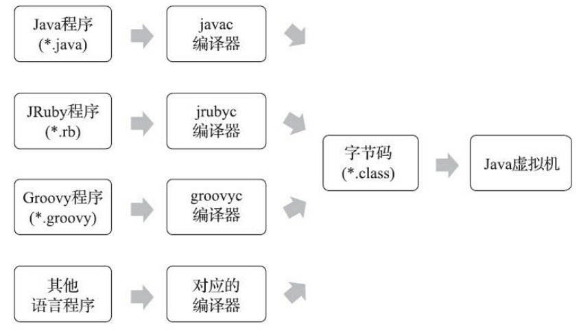

Java 技术能够一直保持着非常良好的向后兼容性，Class文件结构的稳定功不可没。尽管不同版本的《Java虚拟机规范》对 Class 文件格式进行了几次更新，但基本上只是在原有结构基础上新增内容、扩充功能，并未对已定义的内容做出修改。

虚拟机实现的方式主要有以下两种：

- 将输入的 Java 虚拟机代码，在加载时或执行时，翻译成另一种虚拟机的指令集；
- 将输入的 Java 虚拟机代码，在加载时或执行时，翻译成宿主机处理程序的本地指令集

## Class 文件格式

Class 文件中的指令之间并没有分隔符，而是以 8 字节作为基本单位。Class文件格式采用一种类似于 C 语言结构体的伪结构来存储数据，这种伪结构中只有两种数据类型：「无符号数」和「表」。

- 「无符号数」属于基本的数据类型，以 u1、u2、u4、u8 来分别代表 1 个字节、2 个字节、4 个字节和 8 个字节的无符号数
- 「表」是由多个无符号数或者其他表作为数据项，构成的复合数据类型

Class 文件具体由以下几个构成:

- 魔数
- 版本信息
- 常量池
- 访问标志
- 类索引、父类索引、接口索引集合
- 字段表集合
- 方法表集合
- 属性表集合

可以使用`javap -verbose`来打印 Class 文件的格式

### 魔数

魔数：Class 文件的头 4 个字节称为魔数（`0xCAFEBABE`），用于确定是否为Class文件。

### 版本信息

版本信息：紧接着魔数的 4 个字节是 Class 文件的版本号：第 5 和第 6 个字节是**次版本号（Minor Version）**，第 7 和第 8 个字节是**主版本号（Major Version）**。

高版本的 JDK 能向下兼容以前版本的 Class 文件，但不能运行以后版本的 Class 文件。

在 Java12 后，次版本号用于标识对「技术预览版」功能的支持。如果 Class 文件中使用了该版本 JDK 尚未列入正式特性清单中的预览功能，则必须把次版本号设置为 65535，其余情况设置为 0 即可。

### 常量池

版本信息之后就是常量池，常量池中存放两种类型的常量：

- 字面值常量，例如在程序中定义的字符串、被 final 修饰的值。
- 符号引用，它主要包括：
  - 被模块导出的包名（Package）
  - 类和接口的全限定名（Fully Qualified Name）
  - 字段的名称和描述符（Descriptor）
  - 方法的名称和描述符
  - 方法句柄和方法类型（Method Handle、Method Type、Invoke Dynamic）
  - 动态调用点和动态常量（Dynamically-Computed Call Site、Dynamically-Computed Constant）

常量池中常量数量不固定，因此常量池开头放置一个 u2 类型的无符号数，用来存储当前常量池的容量。注意，它是从1 开始计数的，也就是说如果有 $x$ 个常量，那么这个值就为 $x+1$。而其他所有的容量计数是从 0 开始的。

常量池的每一项常量都是一个表。表开始的第一位是一个 u1 类型的标志位（tag），代表当前这个常量属于哪种常量类型。

| 类型                             | tag  | 描述                   |
| -------------------------------- | ---- | ---------------------- |
| CONSTANT_utf8_info               | 1    | UTF-8 编码的字符串     |
| CONSTANT_Integer_info            | 3    | 整型字面量             |
| CONSTANT_Float_info              | 4    | 浮点型字面量           |
| CONSTANT_Long_info               | 5    | 长整型字面量           |
| CONSTANT_Double_info             | 6    | 双精度浮点型字面量     |
| CONSTANT_Class_info              | 7    | 类或接口的符号引用     |
| CONSTANT_String_info             | 8    | 字符串类型字面量       |
| CONSTANT_Fieldref_info           | 9    | 字段的符号引用         |
| CONSTANT_Methodref_info          | 10   | 类中方法的符号引用     |
| CONSTANT_InterfaceMethodref_info | 11   | 接口中方法的符号引用   |
| CONSTANT_NameAndType_info        | 12   | 字段或方法的符号引用   |
| CONSTANT_MethodHandle_info       | 15   | 表示方法句柄           |
| CONSTANT_MethodType_info         | 16   | 标识方法类型           |
| CONSTANT_InvokeDynamic_info      | 18   | 表示一个动态方法调用点 |

以 CONSTANT_Class_info 表为例：

| 类型 | 名称       | 数量 |
| ---- | ---------- | ---- |
| u1   | tag        | 1    |
| u2   | name_index | 1    |

- tag 是标志位，用于区分常量类型；

- name_index 是常量池的索引值，它指向常量池中一个 CONSTANT_Utf8_info 类型常量，此常量代表了这个类（或者接口）的全限定名

以 CONSTANT_Utf8_info 表为例：

| 类型 | 名称   | 数量   |
| ---- | ------ | ------ |
| u1   | tag    | 1      |
| u2   | length | 1      |
| u1   | bytes  | length |

CONSTANT_Utf8_info 的 tag 为 1；length 表示这个字符串的长度；bytes 是这个字符串的内容，以 UTF-8 缩略编码（不是普通的 UTF-8 编码）。由于 u2 类型能表达的最大值 65535。所以超过 64KB 英文字符的变量或方法名，是无法编译的。

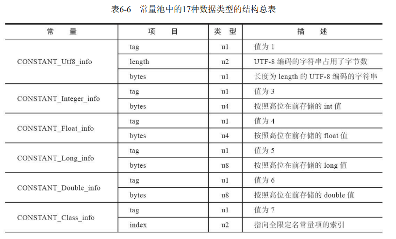

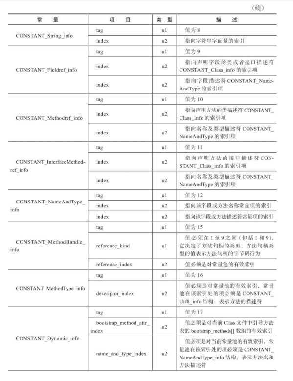

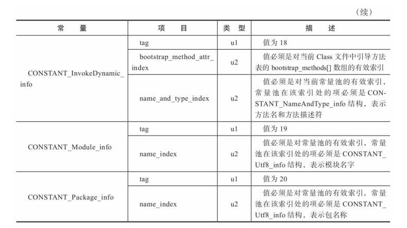

### 访问标志

说明 Class 文件所描述的类的访问信息。

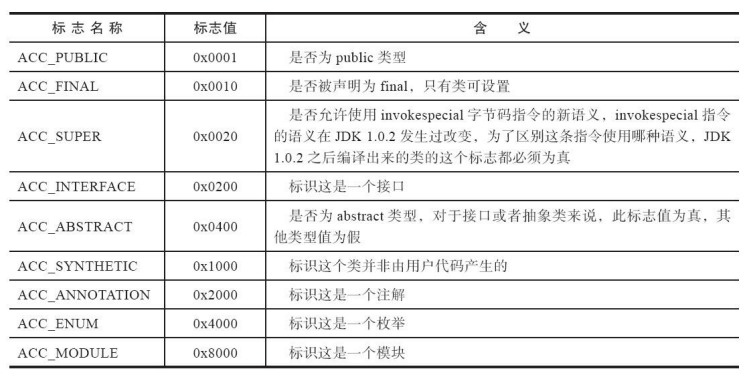

### 类索引、父类索引与接口索引集合

类索引（this_class）和父类索引（super_class）都是一个 u2 类数据，而接口索引集合 （interfaces）是一组 u2 数据的集合，Class 文件中由这三项数据来确定该类型的继承关系。

类索引用于确定这个类的全限定名，父类索引用于确定这个类的父类的全限定名。它们各自指向一个`CONSTANT_Class_info`类型的常量

对于接口索引集合，第一个 u2 数据为接口计数器（interfaces_count），表示实现接口的数量。

### 字段表集合

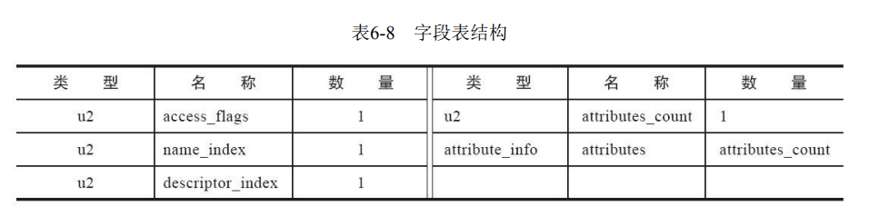

字段修饰符放在`access_flags`中，

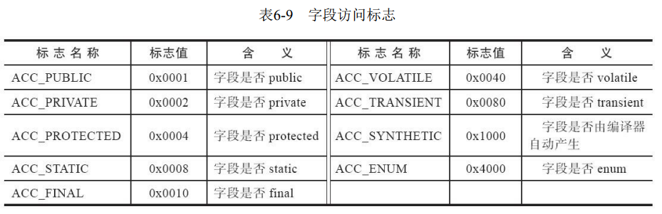

`name_index`和`descriptor_index`。它们都是对常量池项的引用，分别代表着简单名称以及描述符。其中，描述符是用来说明字段的数据类型、方法的参数列表（包括数量、类型以及顺序）和返回值。

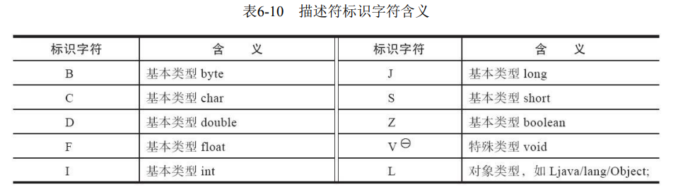

对于数组类型，每一维度使用一个前置的`[`字符来描述，如一个`java.lang.String`[][]类型的二维数组将被记录成`[[Ljava/lang/String`，一个整型数组`int[]`将被记录成`[I`。

对于方法，按照参数列表、返回值的顺序来描述。方法`java.lang.String toString()`的描述符 为`()Ljava/lang/String`，方法`int indexOf(char[]source，int sourceOffset，int sourceCount，char[]target， int targetOffset，int targetCount，int fromIndex)`的描述符为`([CII[CIII)I`

`attributes_count、attributes`描述了属性表，我们会单独介绍的。

字段表集合中不列出从父类或者父接口中继承而来的字段。但是有可能会额外添加一些字段，例如内部类中为了保持对外部类的访问性，编译器会自动添加指向外部类实例的字段。

### 方法表集合

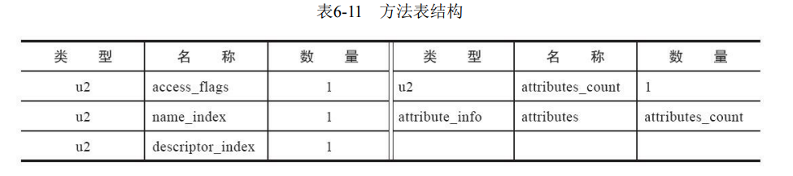

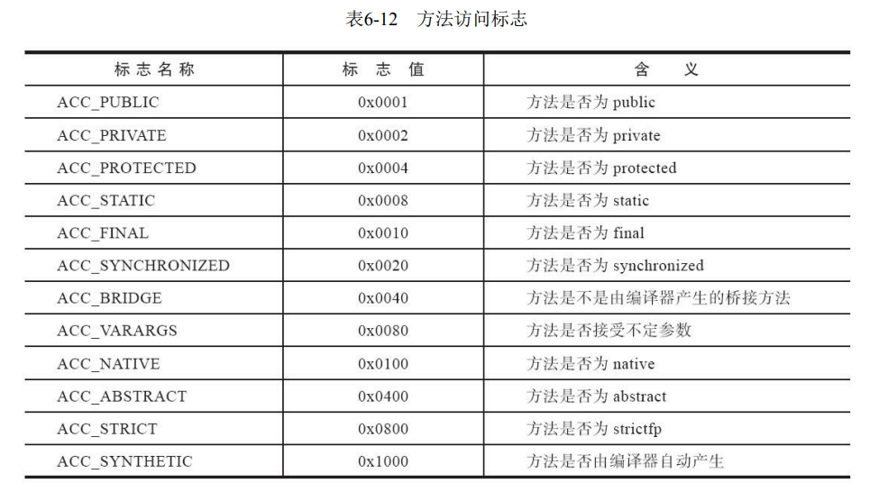

属性表中保存了方法的代码

### 属性表集合

任何编译器可以向属性表中写入自定义的信息。Java 虚拟机运行时会忽略掉它不认识的属性。对于每一个属性，它的名称都要从常量池中引用一个`CONSTANT_Utf8_info`类型的常量来表示， 而属性值的结构则是完全自定义的，只需要通过一个u4的长度属性去说明属性值所占用的位数即可。

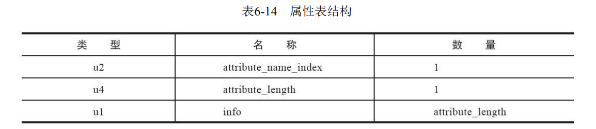

`attribute_name_index`是一项指向`CONSTANT_Utf8_info`型常量的索引，代表了该属性的名称。`attribute_length`指示了属性表的长度（包括name_index、length）

虚拟机规范中的预定义属性。

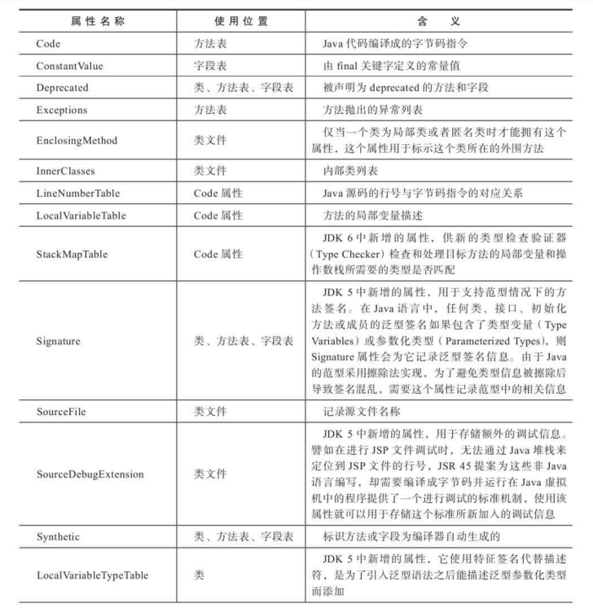

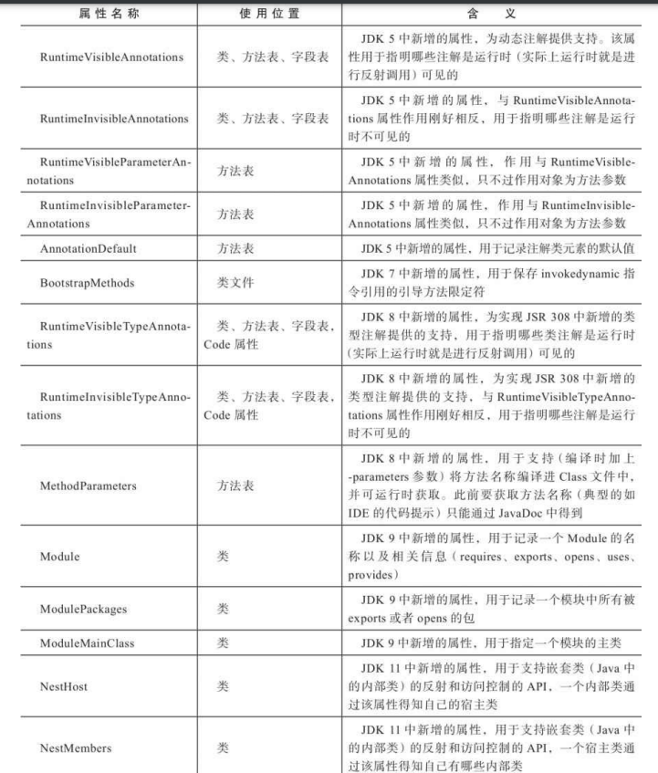

Java 方法的字节码指令存储在 Code 属性内。注意，接口中的方法声明或者抽象类中的抽象方法，并不存在对应的 Code 属性。

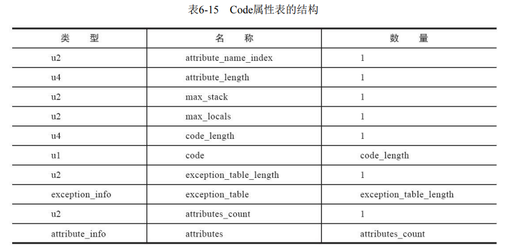

- `max_stack`代表了操作数栈（Operand Stack）的深度最大值。

- `max_locals`代表了局部变量表所需的存储空间，单位为变量槽（Slot）。为了节约槽的数量，Java虚拟机会根据作用域对其进行复用。（注意，this变量会在局部变量表中）

- code_length 和 code 用来存储 Java 源程序编译后生成的字节码指令。code 是一个 u1 数据，可以支持 256 条指令（x86 指令集都有上千条指令）。

  此外，虽然 code_length 是 u4 数据，但是《Java虚拟机规范》中明确规定了一个方法不允许超过 65535 条字节码指令。

- exception_table_length 与 exception_table 用于描述异常表的。

  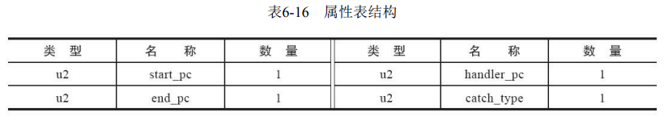

  如果当字节码从第 start_pc 行到第 end_pc 行之间（不含第 end_pc 行）出现了类型为 catch_type 或者其子类的异常（catch_type 为指向一个 CONSTANT_Class_info 型常量的索引），则转到第 handler_pc 行继续处理。当 catch_type 的值为 0 时，代表任意异常情况都需要转到handler_pc 处进行处理。

Exceptions 属性（不是异常表）列举出方法中可能抛出的受查异常（Checked Excepitons）

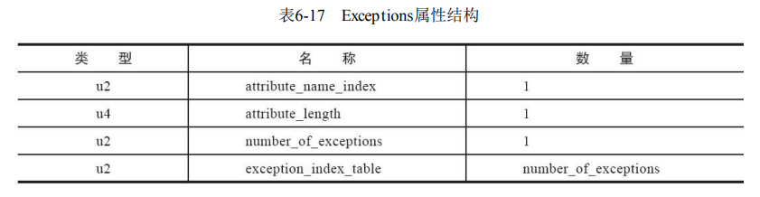

`exception_index_table`是一个指向常量池中 `CONSTANT_Class_info `型常量的索引，代表了该受查异常的类型。

`LineNumberTable`属性用于描述 Java 源码行号与对应字节码所处的行号之间的映射关系。在 Javac 中使用`-g：none`或`-g：lines`选项，来决定是否保存这种映射关系。

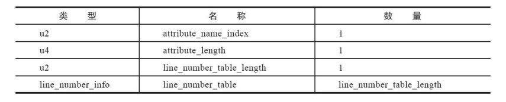

`LocalVariableTable` 属性用于描述栈帧中局部变量表的变量与 Java 源码中定义的变量之间的映射关系。在 Javac 中使用`-g：none`或`-g：vars`选项，来决定是否保存这种映射关系。如果不保存，IDE 将会使用诸如 arg0、arg1 之类的占位符代替原有的参数名。

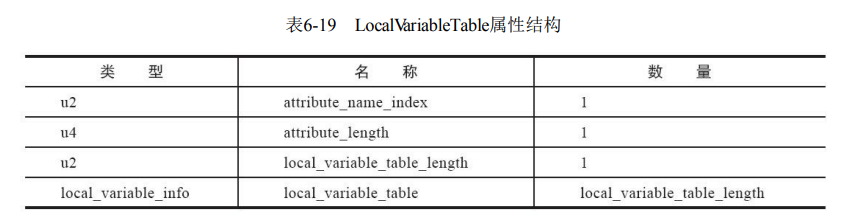

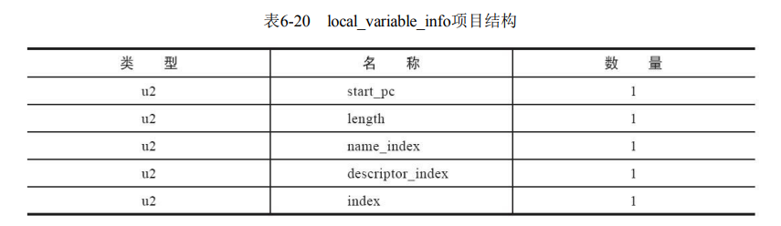

`line_number_info`表包含`start_pc`和`line_number`两个 u2 类型的数据项，前者是字节码行号，后者是 Java 源码行号。

`start_pc`和`length`属性分别代表了这个局部变量的生命周期开始的字节码偏移量，及其作用范围覆盖的长度，两者结合起来就是这个局部变量在字节码之中的作用域范围。

name_index 和 descriptor_index都是指向常量池中 CONSTANT_Utf8_info 型常量的索引，分别代表了局部变量的名称以及局部变量的描述符。 index 是局部变量的在栈帧中变量槽的初始位置。

在引入泛型之后，由于描述符中参数化类型会被擦除掉，因此出现了LocalVariableTypeTable 属性，使用字段的特征签名来完成对泛型的描述。

SourceFile 属性用于记录生成这个 Class 文件的源码文件名称

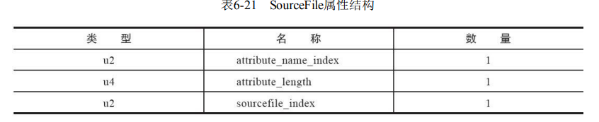

SourceDebugExtension 属性用于存储额外的代码调试信息。

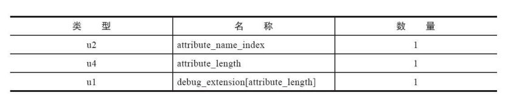

ConstantValue 属性的作用是通知虚拟机自动为静态变量赋值。只有静态变量才可以使用这项属性。

对实例变量的赋值是在实例构造器方法中进行的；而对类变量（Static字段）的赋值，有两种方式可以选择：

- 在类构造器方法中
- 使用 ConstantValue 属性

目前 Oracle 公司实现的 Javac 编译器的选择是，对于 final static 基本类型/String 变量使用 ConstantValue 方式

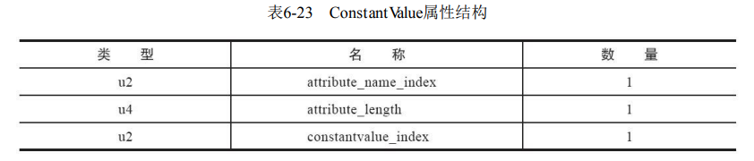

constantvalue_index 数据项代表了常量池中一个字面量常量的引用，根据字段类型的不同，字面 量可以是 CONSTANT_Long_info、CONSTANT_Float_info、CONSTANT_Double_info、 CONSTANT_Integer_info和CONSTANT_String_info 常量中的一种。

InnerClasses 属性用于记录内部类与宿主类之间的关联。

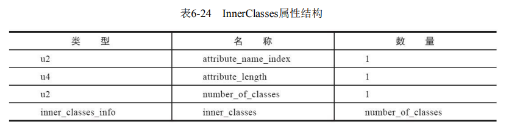

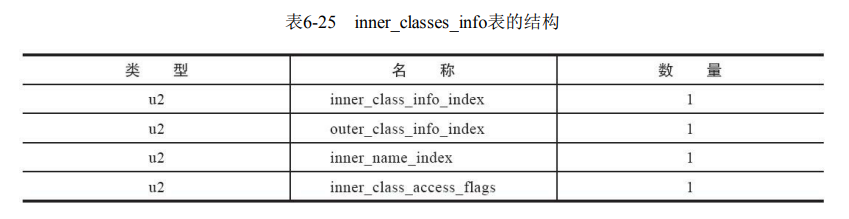

- `inner_class_info_index`和`outer_class_info_index`都是指向常量池中CONSTANT_Class_info型常量的索引，分别代表了内部类和宿主类的符号引用。
- `inner_name_index`是指向常量池中CONSTANT_Utf8_info型常量的索引，代表这个内部类的名称， 如果是匿名内部类，这项值为0。
- `inner_class_access_flags`是内部类的访问标志

  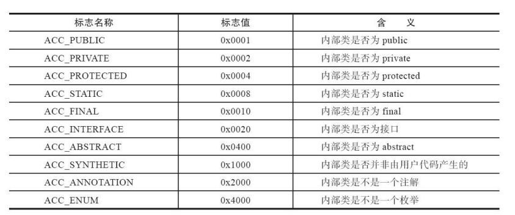

Deprecated 属性用于表示某个类、字段或者方法，已经被程序作者定为不再推荐使用，它可以通 过代码中使用“@deprecated”注解进行设置。

Synthetic 属性代表此字段或者方法并不是由 Java 源码编译而来的，而是由编译器自行添加的（例如，生成枚举类的一些方法）

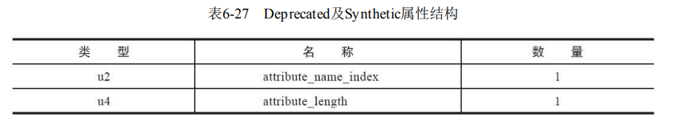

其中 attribute_length 数据项的值必须为 0x00000000，因为它们是布尔属性。

其他的属性：

- StackMapTable 属性会在虚拟机类加载的字节码验证阶段被Type Checker使用。
- Signature 属性会记录泛型签名信息，这样反射API就能够获取的泛型类型。
- BootstrapMethods 属性与 invokedynamic 指令相关，被用于实现 Java的动态类型语言支持，例如 Lambda 表达式。
- MethodParameters 主要用于存储方法参数的额外信息
- 模块描述文件（module-info.java）最终是要编译成一个独立的 Class 文件来存储的，所以，Class 文件格式也扩展了 Module、ModulePackage s和 ModuleMainClass 三个属性，用于支持 Java 模块化相关功能。
- 为了存储源码中注解信息，Class 文件支持RuntimeVisibleAnnotations、 RuntimeInvisibleAnnotations、RuntimeVisibleParameterAnnotations 和 RuntimeInvisibleParameterAnnotations 四个属性

## 字节码指令

由于Java虚拟机采用「面向操作数栈」而不是「面向寄存器」的架构，大多数指令都不包含操作数，只有一个操作码，指令参数都存放在操作数栈中。而且一个字节来代表操作码，这些都是为了尽可能获得短小精干的编译代码，追求尽可能小数据量、高传输效率，这与 Java 语言面向网络和智能家电的设计初衷是相契合的。

### 数据类型

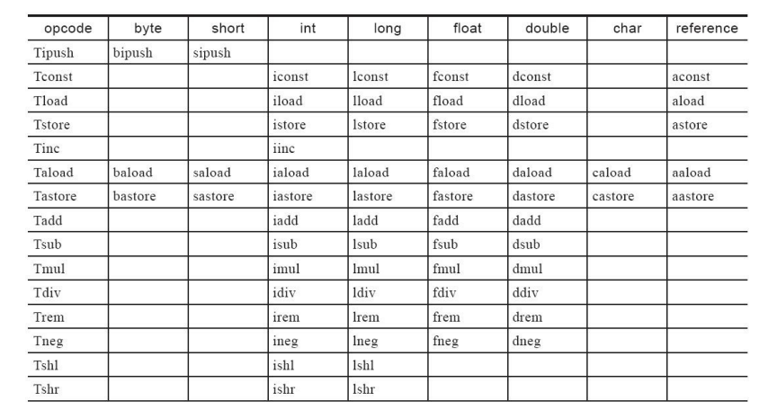

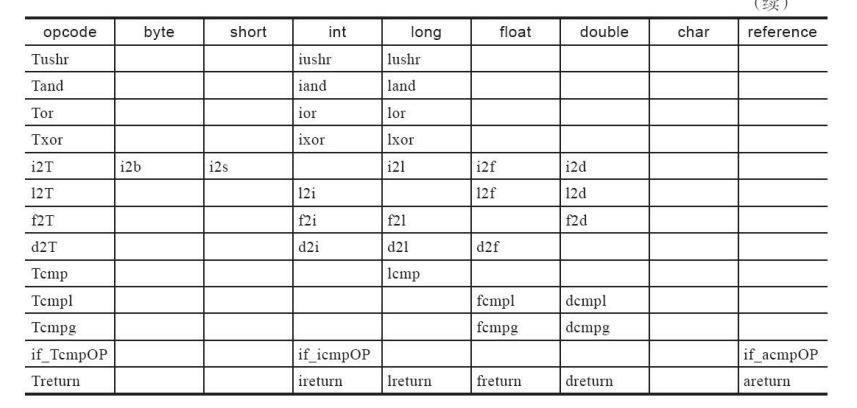

编译器会将byte和short符号扩展（Sign-Extend）为int，将boolean和char零位扩展（Zero-Extend）为int。

### 加载和存储指令

加载和存储指令用于将数据在栈帧中的局部变量表和操作数栈之间来回传输，这类指令包括：

- 将一个局部变量加载到操作栈：`iload`等
- 将一个数值从操作数栈存储到局部变量表：`istore`等
- 将一个常量加载到操作数栈：`bipush`等
- 扩充局部变量表的访问索引：`wide`

### 运算指令

算术指令用于对两个操作数栈上的值进行某种特定运算，并把结果重新存入到操作栈顶

- 加法指令：iadd、ladd、fadd、dadd 
- 减法指令：isub、lsub、fsub、dsub 
- 乘法指令：imul、lmul、fmul、dmul 
- 除法指令：idiv、ldiv、fdiv、ddiv 
- 求余指令：irem、lrem、frem、drem 
- 取反指令：ineg、lneg、fneg、dneg 
- 位移指令：ishl、ishr、iushr、lshl、lshr、lushr 
- 按位或指令：ior、lor 
- 按位与指令：iand、land 
- 按位异或指令：ixor、lxor 
- 局部变量自增指令：iinc 
- 比较指令：dcmpg、dcmpl、fcmpg、fcmpl、lcmp

《Java虚拟机规范》要求虚拟机实现在处理浮点数时，必须严格遵循 IEEE 754规范

### 类型转换指令

Java虚拟机直接支持以下数值类型的宽化类型转换（Widening Numeric Conversion，即小范围类型向大范围类型的安全转换）：

- int类型到long、float或者double类型
- long类型到float、double类型
- float类型到double类型

与之相对的，处理窄化类型转换（Narrowing Numeric Conversion）时，就必须显式地使用转换指 令来完成，这些转换指令包括i2b、i2c、i2s、l2i、f2i、f2l、d2i、d2l和d2f。

- 如果浮点值是NaN，那转换结果就是int或long类型的0。
- 如果浮点值不是无穷大的话，浮点值使用IEEE 754的向零舍入模式取整
- 从double类型到float类型做窄化转换的过程与IEEE 754中定义的一致

尽管数据类型窄化转换可能会发生上限溢出、下限溢出和精度丢失等情况，但是《Java虚拟机规 范》中明确规定数值类型的窄化转换指令永远不可能导致虚拟机抛出运行时异常。

### 对象创建与访问指令

- 创建类实例的指令：new
- 创建数组的指令：newarray、anewarray、multianewarray
- 访问类字段（static字段，或者称为类变量）和实例字段（非static字段，或者称为实例变量）的指令：getfield、putfield、getstatic、putstatic
- 把一个数组元素加载到操作数栈的指令：baload、caload、saload、iaload、laload、faload、 daload、aaload
- 将一个操作数栈的值储存到数组元素中的指令：bastore、castore、sastore、iastore、fastore、 dastore、aastore
- 取数组长度的指令：arraylength
- 检查类实例类型的指令：instanceof、checkcast

### 操作数栈管理指令

- 将操作数栈的栈顶一个或两个元素出栈：pop、pop2
- 将栈最顶端的两个数值互换：swap
- 复制栈顶一个或两个数值，并将复制值重新压入栈顶：dup、dup2、dup_x1、 dup2_x1、dup_x2、dup2_x2

### 控制转移指令

- 条件分支：ifeq、iflt、ifle、ifne、ifgt、ifge、ifnull、ifnonnull、if_icmpeq、if_icmpne、if_icmplt、 if_icmpgt、if_icmple、if_icmpge、if_acmpeq和if_acmpne
- 复合条件分支：tableswitch、lookupswitch
- 无条件分支：goto、goto_w、jsr、jsr_w、ret

### 方法调用和返回指令

- `invokevirtual` ：用于调用对象的实例方法，根据对象的实际类型进行分派（虚方法分派）
- `invokestatic` ：用于调用类静态方法（static方法）
- `invokedynamic` ：用于在运行时动态解析出调用点限定符所引用的方法。
- `invokeinterface` ：用于调用接口方法
- `invokespecial` ：用于调用一些需要特殊处理的实例方法，包括实例初始化方法、私有方法和父类方法

方法返回指令包括 ireturn（当返回值是boolean、byte、char、short和int类型时使用）、lreturn、freturn、dreturn 和 areturn。另外还有一条 return 指令供声明为 void 的方法、实例初始化方法、类和接口的类初始化方法使用。

### 异常处理指令

在 Java 程序中显式抛出异常的操作（throw语句）都由 athrow 指令来实现。

而在 Java 虚拟机中，处理异常（catch 语句）不是由字节码指令来实现的，而是采用异常表来完成。

### 同步指令

Java 虚拟机的指令集中有 monitorenter 和 monitorexit 两条指令来支持synchronized 关键字的语义。

## 虚拟机类加载机制

Java 虚拟机把描述类的 Class 文件加载到内存，并对数据进行校验、转换解析和初始化，最终构建出可被虚拟机直接使用的Java类型，这个过程被称作「虚拟机的类加载机制」。

在 Java 语言里面，类型的加载、链接和初始化过程都是在程序运行期间完成的。虽然增加了性能开销，但是却拥有了动态扩展的语言特性。

一个类型的生命周期如下：加载 （Loading）、验证（Verification）、准备（Preparation）、解析（Resolution）、初始化 （Initialization）、使用（Using）和卸载（Unloading）七个阶段

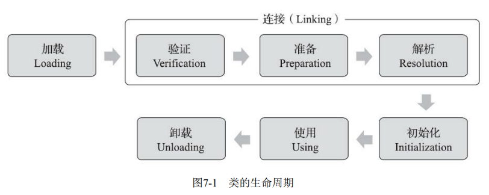

注意，解析阶段可能在初始化阶段之后再开始，这是为了支持 Java 语言的运行时绑定特性（也称为动态绑定或晚期绑定）。

对于何时开始加载阶段，《Java虚拟机规范》并未作出规定。但是对于初始化阶段，做出了严格规定：

- 遇到 new、getstatic、putstatic 或 invokestatic 这四条字节码指令时
- 使用 java.lang.reflect 包的方法对类型进行反射调用的时候
- 当初始化类的时候，如果发现其父类还没有进行过初始化，则需要先触发其父类的初始化。
- 当虚拟机启动时，用户需要指定一个要执行的主类（包含main()方法的那个类），虚拟机会先初始化这个主类。
- 如果一个 java.lang.invoke.MethodHandle 实例最后的解析结果为REF_getStatic、REF_putStatic、REF_invokeStatic、REF_newInvokeSpecial 四种类型的方法句柄，并且这个方法句柄对应的类没有进行过初始化，则需要先触发其初始化。
- 当一个接口中定义了默认方法（被 default 关键字修饰的接口方法）时，如果有这个接口的实现类发生了初始化，那该接口要在其之前被初始化。

下面给出一个例子：

~~~java
class SuperClass {
    static {
        System.out.println("SuperClass init!");
    }
    public static int value = 123;
}

class SubClass extends SuperClass {
    static {
        System.out.println("SubClass init!");
    }
}

class NotInitialization {
    public static void main(String[] args) {
        // 只会触发父类的初始化，而不会触发子类的初始化
        System.out.println(SubClass.value);
    }
}
/**
 SuperClass init!
 123
*/
~~~

对于HotSpot虚拟机来说，可通过`-XX： +TraceClassLoading`参数观察到，此操作是会导致子类加载的。

另一个例子：

~~~java
public class NotInitialization {
    public static void main(String[] args) {
        SuperClass[] sca = new SuperClass[10];
    }
}
// 无输出
~~~

最后一个例子：

~~~java
public class ConstClass {
    static {
    	System.out.println("ConstClass init!");
    }
	public static final String HELLOWORLD = "hello world";
}

public class NotInitialization {
    public static void main(String[] args) {
    	System.out.println(ConstClass.HELLOWORLD);
    }
}
// 无输出
~~~

常量在编译阶段会存入调用类的常量池中，本质上没有直接引用到定义常量的类，因此不会执行初始化操作。

## 类加载过程

### 加载

在加载阶段，Java 虚拟机需要完成以下三件事情：

1. 通过一个类的全限定名来获取定义此类的二进制字节流。可以从网络、Jar、动态生成、其他文件中获取。
2. 将这个字节流所代表的静态存储结构，转化为方法区的运行时数据结构。
3. 在内存中生成一个代表这个类的 java.lang.Class 对象。JVM 在做类加载的时候会把 Class 文件的各个部分分别解析（parse）为 JVM 的内部数据结构

对于非数组类型，用户可以通过自定义的类加载器来完成加载，期间可以做很多事情。但对于数组类型，它是由 Java 虚拟机直接在内存中动态构造出来的，对数组能做的事情很少。

### 验证

由于 Class 文件的加载方式多种多样，我们完全可以以其他方式构建出Class 文件，绕过编译器的语法检查，从而执行一些恶意代码。因此，验证字节码是一项必要的措施。

1. 验证字节流是否符合 Class 文件格式的规范。
2. 对字节码描述的信息进行语义分析，这一阶段包括的验证点有：
   - 这个类的父类是否继承了不允许被继承的类（被final修饰的类）
   - 类中的字段、方法是否与父类产生矛盾（例如覆盖了父类的 final 字段，或者出现不符合规则的方法重载，例如方法参数都一致，但返回值类型却不同等）
   - ...
3. 通过数据流分析和控制流分析，确定程序语义是合法的、符合逻辑的。
   - 保证任何跳转指令都不会跳转到方法体以外的字节码指令上。
   - 保证方法体中的类型转换总是有效的
   - ...
4. 符号引用验证可以看作是对类自身以外（常量池中的各种符号引用）的各类信息进行匹配性校验
   - 符号引用中通过字符串描述的全限定名是否能找到对应的类。
   - 符号引用中的类、字段、方法的可访问性（private、protected、public）是否可被当前类访问。
   - ...

根据停机问题，即不能通过程序判断出程序是否能在有限的时间之内结束运行，因此不可能用程序来准确判定一段程序是否存在 Bug，校验无法做到绝对准确的。

### 准备阶段

准备阶段是正式为类的静态变量分配存储空间，并初始化为零值

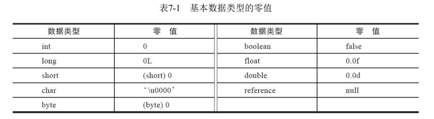

但是，如果静态变量是 ConstantValue 属性，那么初始化为在ConstantValue 中设定的值。

### 符号解析

解析阶段是 Java 虚拟机将常量池内的符号引用替换为直接引用的过程。

注意，在解析阶段，已经将 Class 文件中的静态结构转换为运行期的动态数据结构，该结构除了 Class 文件中描述的字段，还有一些运行期所需的字段，例如方法的直接引用。

- 符号引用（Symbolic References）：符号引用以一组符号来描述所引用的目标，符号可以是任何形式的字面量，只要使用时能无歧义地定位到目标即可。符号引用与虚拟机的内存布局无关
- 直接引用（Direct References）：指针（指向类变量、类方法）、相对偏移量（指向实例变量，实例方法），或者一个能间接定位到目标的句柄。直接引用是和虚拟机的布局相关的

### 初始化

初始化阶段就是执行类构造器`<clinit>()`方法的过程。`<clinit>()`并不是程序员在 Java 代码中直接编写的方法，它是 Javac 编译器自动生成的产物。

`<clinit>()`是由编译器自动收集类中的所有静态变量的赋值语句和静态语句块（static{} 块）中的语句合并产生的

编译器收集的顺序是由语句在源文件中出现的顺序决定的，静态语句块中只能访问到定义在静态语句块之前的变量，定义在它之后的变量，可以赋值，但是不能访问

~~~java
public class Test {
	static {
		i = 0; // 给变量复制可以正常编译通过
		System.out.print(i); // 这句编译器会提示“非法向前引用”
	}
	static int i = 1;
}

~~~

Java 虚拟机会保证在子类的`<clinit>()`方法执行前，父类的`<clinit>()`方法已经执行完毕。

但接口与类不同的是，执行接口的`<clinit>()`方法不需要先执行父接口的`<clinit>()`方法， 因为只有当父接口中定义的变量被使用时，父接口才会被初始化。此外，接口的实现类在初始化时，也一样不会执行接口的`<clinit>()`方法。

## 类加载器

对于任意一个类，都必须由加载它的类加载器和这个类本身，一起共同确立其在 Java 虚拟机中的唯一性。每一个类加载器，都拥有一个独立的类名称空间。

比较两个类是否「相等」，只有在这两个类是由同一个类加载器加载的前提下才有意义，否则必定是不相等的。这里所指的「相等」，包括 equals() 方法、isAssignableFrom() 方法、isInstance() 方法

### 双亲委派模型

Java 曾经保持着三层类加载器、双亲委派的类加载架构

三层类加载器是指：

- 启动类加载器（Bootstrap Class Loader）负责加载存放在`<JAVA_HOME>\lib`目录，或者`-Xbootclasspath`参数所指定的路径下的类库
- 扩展类加载器（Extension Class Loader）：这个类加载器是在以Java实现的`sun.misc.Launcher$ExtClassLoader`类中的。它负责加载`<JAVA_HOME>\lib\ext`目录，或者`java.ext.dirs`系统变量所指定的路径下的类库。
- 应用程序类加载器（Application Class Loader）：这个类加载器由 `sun.misc.Launcher$AppClassLoader`来实现。它负责加载 ClassPath 上的类库
- 此外，用户还可以加入自定义的类加载器来进行拓展

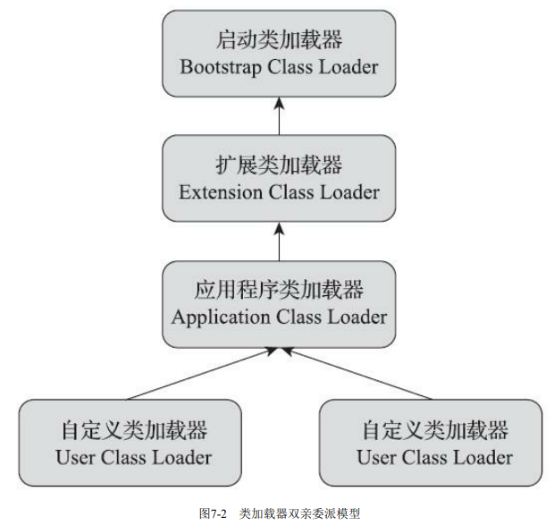

双亲委派模型的工作过程是：如果一个类加载器收到了类加载的请求，它首先不会自己去尝试加载这个类，而是把这个请求委派给父类加载器去完成。只有当父加载器反馈自己无法完成这个加载请求（它的搜索范围中没有找到所需的类）时，子加载器才会尝试自己去完成加载。

一个显而易见的好处就是，类随着它的类加载器，具备一种带有优先级的层次关系。例如类 java.lang.Object，它存放在 rt.jar 之中，无论哪一 个类加载器要加载这个类，最终都是委派给处于模型最顶端的启动类加载器进行加载，因此 Object 类在程序的各种类加载器环境中都能够保证是同一个类。

双亲委派模型并不是一个具有强制性约束的模型。有时候出于技术原因不得不对该模型进行破坏。例如，支持动态热部署（Hot Deployment）功能的一个框架 OSGi，它不再使用双亲委派模型推荐的树状结构，而是进一步发展为更加复杂的网状结构。

Java9 引入的模块化对该模型造成了又一次破坏，在这里就不再细谈了。

## 虚拟机字节码执行引擎

物理机的执行引擎是直接建立在处理器、缓存、指令集和操作系统上的，而虚拟机的执行引擎则是由软件自行实现的，因此可以不受物理条件制约地定制指令集与执行引擎的结构体系。

## 栈帧

栈帧的内存布局在编译期就已经计算出来。

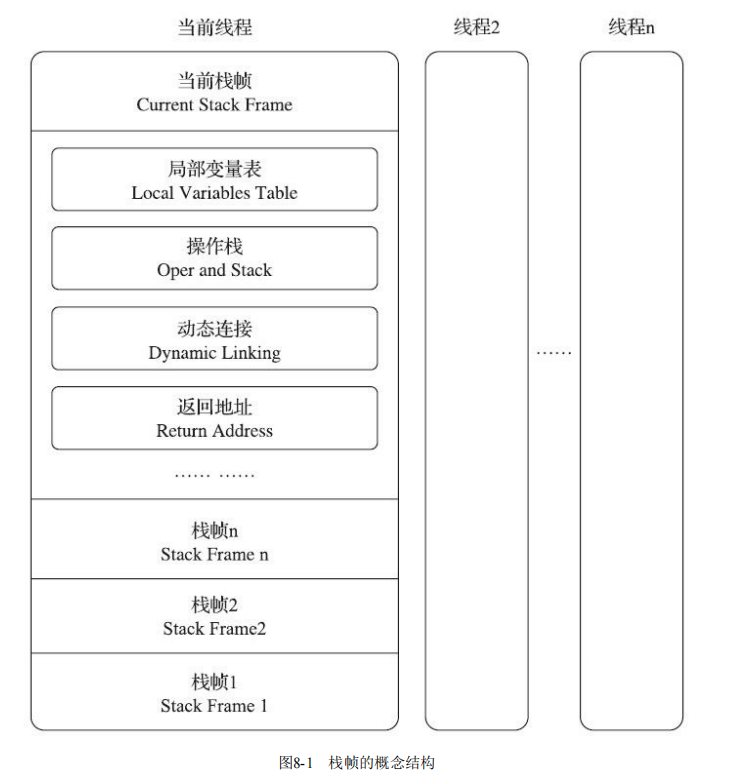

局部变量表（Local Variables Table）是方法参数和局部变量的存储空间。Code 属性中的`max_locals`数据项就确定了该方法所需分配的局部变量表的最大容量。

局部变量表的容量以**变量槽（Variable Slot）**为最小单位，《Java虚拟机规范》中并没有明确地指出一个变量槽应占用的内存大小，而是强烈暗示每个变量槽都应该能存放一个boolean、byte、char、short、int、float、reference或returnAddress类型的数据。

对于两个相邻的、用于存放64位数据的变量槽。虚拟机不允许采用任何方式单独访问其中的某一个。《Java虚拟机规范》中明确要求如果遇到执行这种操作的字节码序列，虚拟机就应该在类加载的校验阶段中抛出异常。

Java虚拟机的数据类型有 boolean、byte、char、short、int、float、reference 和 returnAddress。

当一个方法被调用时，虚拟机会使用局部变量表来完成实参到形参的传递。

为了尽可能节省栈帧所耗用的内存空间，虚拟机会根据作用域来复用变量槽。这种复用机制给垃圾回收带来了一定的复杂性，下面请看一个例子：

~~~java
public static void main(String[] args)() {
	byte[] placeholder = new byte[64 * 1024 * 1024];
	System.gc();		// placeholder被回收
}
~~~

~~~java
public static void main(String[] args)() {
	{
		byte[] placeholder = new byte[64 * 1024 * 1024];
	}
    // 没有被回收，因为 placeholder 原本所占用的变量槽还没有被其他变量复用
	System.gc();
}
~~~

~~~java
public static void main(String[] args)() {
	{
		byte[] placeholder = new byte[64 * 1024 * 1024];
	}
	int a = 0;
    // 被回收
	System.gc();
}
~~~

「手动将不使用的对象赋值为 null」看似是最优的解决方案，实则不然。因为这仅仅是从概念模型上考虑的，实际上编译优化技术会正确地处理这种行为，我们无需担心太多。

### 操作数栈

操作数栈是寄存器的代替方案。

操作数栈中元素的数据类型必须与字节码指令的序列严格匹配，在校验阶段的数据流分析中还要验证这一点。

在大多虚拟机的实现里，都会对进行一些优化处理，令两个栈帧出现一部分重叠，即操作数栈和局部变量表栈之间的重叠。除了节约空间外，它可以在调用函数时，无需进行额外地参数复制了。

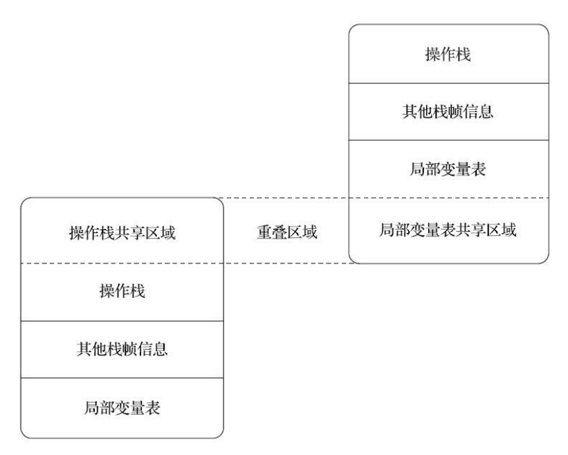

Java虚拟机的解释执行引擎被称为“基于栈的执行引擎”，里面的“栈”就是操作数栈

### 栈帧信息

栈帧信息包括

- 动态链接：每个栈帧为了支持动态链接（Dynamic Linking），都持有一个该栈帧在常量池中对应的方法符号引用的引用

  我们知道，字节码中的方法调用指令就以常量池里指向方法的符号引用作为参数，这些一部分符号引用会在类加载阶段转化为直接引用，这种转化被称为**静态解析**。而另一部分将在每一个调用时转换为直接引用，这种转换被称为**动态解析**。

- 方法调用：

  方法的返回有两种方式：

  - 正常返回，返回地址由调用点处的PC值来决定的
  - 异常返回，根据异常处理器表来确定的

- 额外信息：Java虚拟机规范允许额外添增信息到栈帧中，例如与性能相关的信息。

## 方法调用

方法调用阶段唯一的任务就是确定被调用方法的版本 （即调用哪一个方法），而并不是执行方法。

Class 文件的编译过程中不包含传统程序语言编译的链接步骤，一切方法调用在 Class 文件里面存储的都只是符号引用。这个特性给 Java 带来了更强大的动态扩展能力，但也引入了复杂的机制。

### 解析

静态解析要求在运行时，方法的调用版本是不可改变的，主要包括：

- 私有方法
- 静态方法
- 实例构造器
- final 方法
- 父类方法

它们在语法层面就不支持覆写，因此适合在类加载阶段进行静态解析。

在 Java 虚拟机支持以下 5 条方法调用字节码指令，分别是：

- `invokestatic`。用于调用静态方法
- `invokespecial`。用于调用实例构造器()方法、私有方法和父类中的方法
- `invokevirtual`。用于调用所有的虚方法
- `invokeinterface`。用于调用接口方法，会在运行时再确定一个实现该接口的对象。
- `invokedynamic`。先在运行时动态解析出调用点限定符所引用的方法，然后再执行该方法。

只要能被`invokestatic`和`invokespecial`指令调用的方法，都可以在解析阶段中确定唯一的调用版本， Java 语言里符合这个条件的方法共有静态方法、私有方法、实例构造器、父类方法，再加上被 final 修饰的方法（尽管它使用`invokevirtual`指令调用），这 5 种方法调用会在类加载的时候就可以把符号引用解析为该方法的直接引用。这些方法统称为**「非虚方法」（Non-Virtual Method）**，与之相反，其他方法就被称为**「虚方法」（Virtual Method）**。

### 分派

Dispatch 这一词在规范里为 Method Overload Resolution。它的类型有

- 静态单分派
- 静态多分派
- 动态单分派
- 动态多分派

### 静态分派

我们来先看一个例子：

~~~java
public class StaticDispatch {
    static abstract class Human { }
    static class Man extends Human { }
    static class Woman extends Human { }
    
    public void sayHello(Human guy) {
    	System.out.println("hello,guy!");
    }
    
    public void sayHello(Man guy) {
    	System.out.println("hello,gentleman!");
    }
    
    public void sayHello(Woman guy) {
    	System.out.println("hello,lady!");
    }
    
    public static void main(String[] args) {
    	Human man = new Man();
    	Human woman = new Woman();
    	StaticDispatch sr = new StaticDispatch();
    	sr.sayHello(man);
    	sr.sayHello(woman);
    }
}
/**
 hello, guy!
 hello, guy!
 */
~~~

为了解释为何输出该结果，我们先通过一个例子来明确两个概念：

~~~java
Human man = Man();
~~~

我们把上面代码中的 Human 称为变量的**静态类型（Static Type）**，或者叫 **外观类型（Apparent Type）**，后面的 Man 则被称为变量的**实际类型（Actual Type）**或者叫**运行时类型（Runtime Type）**.

在重载时，是通过参数的静态类型而不是实际类型来判断的。

所有依赖静态类型来决定方法调用版本的分派动作，都称为静态分派。静态分派的最典型应用就是方法重载。而且静态分派发生在编译阶段。

下面我们来看一个重载决议的例子：

~~~java
package org.fenixsoft.polymorphic;
public class Overload {
    public static void sayHello(Object arg) {
    	System.out.println("hello Object");
    }
    
    public static void sayHello(int arg) {
   		System.out.println("hello int");
    }
    
    public static void sayHello(long arg) {
    	System.out.println("hello long");
    }
    
    public static void sayHello(Character arg) {
    	System.out.println("hello Character");
    }
    
    public static void sayHello(char arg) {
    	System.out.println("hello char");
    }
    
    public static void sayHello(char... arg) {
    	System.out.println("hello char ...");
    }
    
    public static void sayHello(Serializable arg) {
    	System.out.println("hello Serializable");
    }
    
    public static void main(String[] args) {
    	sayHello('a');
    }
}
~~~

该例子中的适配规则：char -> int -> long -> float -> double -> Character -> Serializable(Comparable) -> Object -> char...

这里有几点需要说明：

- Character -> Serializable 是因为 Serializable 是 Character 的接口。
- 对于 null，该适配规则也成立，不过会同时匹配到 Character 与 char...

编译器无法确定要自动转型为哪种类型，会提示**“类型模糊”（Type Ambiguous）**，并拒绝编译。程序必须在调用时显式地指定字面量的静态类型。

### 动态分派

~~~java
public class DynamicDispatch {
    static abstract class Human {
    	protected abstract void sayHello();
    }
    
    static class Man extends Human {
    	@Override
    	protected void sayHello() {
    		System.out.println("man say hello");
    	}
    }
    
    static class Woman extends Human {
    	@Override
    	protected void sayHello() {
    		System.out.println("woman say hello");
    	}
    }
    
    public static void main(String[] args) {
        Human man = new Man();
        Human woman = new Woman();
        man.sayHello();
        woman.sayHello();
        man = new Woman();
        man.sayHello();
    }
}
/**
man say hello
woman say hello
woman say hello
*/
~~~

我们把这种在运行期根据实际类型确定方法执行版本的分派过程称为动态分派。显然字段是无法分派的。下面我们来看一个相关的例子：

~~~java
public class FieldHasNoPolymorphic {
    static class Father {
        public int money = 1;
        
        public Father() {
        	money = 2;
        	showMeTheMoney();
    	}
         
   	 	public void showMeTheMoney() {
    		System.out.println("I am Father, i have $" + money);
        }
	}
    
    static class Son extends Father {
    	public int money = 3;
        
    	public Son() {
    	    money = 4;
            showMeTheMoney();
		}
        
        @Override
		public void showMeTheMoney() {
			System.out.println("I am Son, i have $" + money);
		}
    }
    
    public static void main(String[] args) {
	    Father gay = new Son();
        System.out.println("This gay has $" + gay.money);
    }
}
/**
I am Son, i have $0
I am Son, i have $4
This gay has $2
*/
~~~

在创建 Son 时，会隐式调用 Father 构造函数，而 Father 构造函数中对showMeTheMoney() 的调用是一次虚方法调用，实际执行的版本是 Son::showMeTheMoney() 方法，所以输出的是 ”I am Son”。此时虽然父类的 money 字段已经被初始化成 2 了，但 Son::showMeTheMoney() 方法中访问的却是 Son 的 money 字段，这时候还未初始化，结果自然还是 0。

### 单分派与多分派

方法的接收者与方法的参数统称为方法的宗量。单分派是根据一个宗量对目标方法进行选择，多分派则是根据多于一个宗量对目标方法进行选择。

Java 语言是一门静态多分派、动态单分派的语言。我们可以通过一个例子来认识这一点。

~~~java
public class Dispatch {
	static class QQ {}
    static class _360 {}
    
    public static class Father {
        public void hardChoice(QQ arg) {
            System.out.println("father choose qq");
        }
        
       	public void hardChoice(_360 arg) {
        	System.out.println("father choose 360");
        }
    }
    
    public static class Son extends Father {
        public void hardChoice(QQ arg) {
        	System.out.println("son choose qq");
        }
        public void hardChoice(_360 arg) {
        	System.out.println("son choose 360");
        }
    }
    
    public static void main(String[] args) {
    	Father father = new Father();
    	Father son = new Son();
    	father.hardChoice(new _360());
    	son.hardChoice(new QQ());
    }
}
/**
father choose 360
son choose qq
*/
~~~

在静态解析阶段，选择目标方法依据两点（双分派）：

1. 接收者的静态类型 Father 和 Son。这次选择结果的最终产物是产生了两条 invokevirtual 指令，两条指令的参数分别为常量池中指向 Father: hardChoice(360) 以及 Father:hardChoice(QQ) 方法的符号引用
2. 方法参数 QQ 和 _360

在动态阶段，仅需考虑接收者的动态类型，因此就是单分派

### 动态分派的实现

Java虚拟机实现基于性能的考虑，在真正运行时，不会频繁地去反复搜索类型元数据，来执行动态分派。一种优化手段就是建立一个**虚方法表（Virtual Method Table）**。

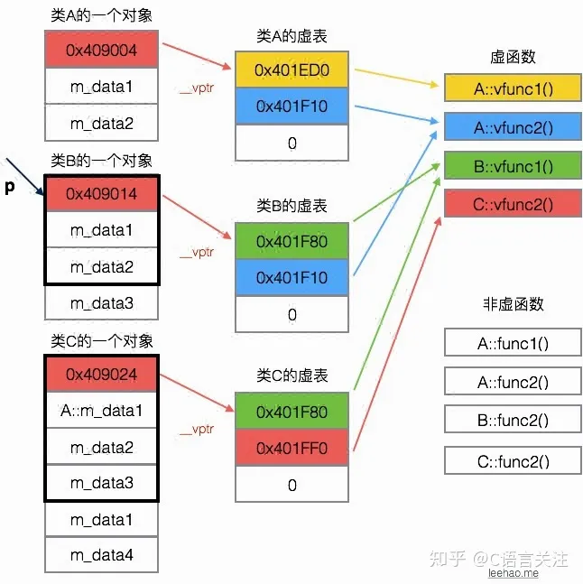

除了使用虚方法表之外，Java 虚拟机还会使用类型继承关系分析（Class Hierarchy Analysis，CHA）、守护内联（Guarded Inlining）、内联缓存（Inline Cache）等多种非稳定的激进优化来争取更大的性能空间。
