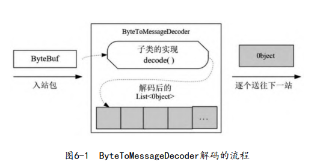

# Netty

[TOC]

## 初步

## Decoder

Netty 中的解码器都是 Inbound 入站处理器类型。ByteToMessageDecoder 是一个非常重要的解码器基类，用于完成从 ByteBuf 到 Java POJO 对象的解码功能。它根据入站包（ByteBuf），解码出一个`List<Object>`，然后将其中元素逐个送往下一站。

自定义一个解码器

~~~java
public class Byte2IntegerDecoder extends ByteToMessageDecoder {
    @Override
    protected void decode(
        ChannelHandlerContext channelHandlerContext,
        ByteBuf byteBuf,
        List<Object> list) throws Exception {
        while (byteBuf.readableBytes() >= 4) {
            int i = byteBuf.readInt();
            list.add(i);
        }
    }
}
~~~

这里将ByteBuf处理为了Object对象，因此该ByteBuf并不会发送到TailContext中，来完成释放引用计数。然而，基类ByteToMessageDecoder会完成ByteBuf释放工作，它会调用ReferenceCountUtil.release(in)方法将之前的ByteBuf缓冲区的引用计数减1。

可以在子类的decode()方法中调用一次ReferenceCountUtil.retain(in)来增加一次引用计数。

注册该解码器

~~~java
ChannelInitializer i= new ChannelInitializer<EmbeddedChannel>(){
    protected void initChannel(EmbeddedChannel ch) {
        ch.pipeline().addLast(new Byte2IntegerDecoder());
        ch.pipeline().addLast(new IntegerProcessHandler());
    }
};
~~~

ReplayingDecoder类是ByteToMessageDecoder的子类，它在读取ByteBuf缓冲区的数据之前，需要检查缓冲区是否有足够的字节。如果不够，那么停止解码。这省去了之前的长度判断代码。

~~~java
public class Byte2IntegerReplayDecoder extends ReplayingDecoder {
    @Override
    protected void decode(ChannelHandlerContext channelHandlerContext, ByteBuf byteBuf, List<Object> list) throws Exception {
        int i = byteBuf.readInt();
    }
}
~~~

实现原理如下：内部定义一个新的二进制缓冲区类（类名为ReplayingDecoderBuffer），又对ByteBuf缓冲区进行装饰。该装饰器的特点是，在缓冲区真正读数据之前先进行长度的判断：如果长度足够，就读取数据；否则，抛出`ReplayError`异常，导致decode结束（如果不在decode中捕获该异常），而且会截断该 byteBuf 的传播。ReplayingDecoder 捕获到异常后会留着数据，等待下一次IO事件到来时再读取。

当一个ByteBuf发送包到达接收端后，可能已经被分成很多ByteBuf接收包。可以通过Head-Content协议格式来解决，在Head中说明包的长度，在Content中存放内容。

此外，还需要ReplayingDecoder类的state属性，它保存当前解码器所处的阶段。相关源码如下：

~~~java
public abstract class ReplayingDecoder<S> extends ByteToMessageDecoder {
    private S state;
    
    protected ReplayingDecoder(S initialState) {
        this.replayable = new ReplayingDecoderByteBuf();
        this.checkpoint = -1;
        this.state = initialState;
    }
    
    protected ReplayingDecoder() {
        this((Object)null);
    }
}
~~~

以字符串解码为例：

~~~java
public class StringReplayDecoder extends ReplayingDecoder<StringReplayDecoder.PHASE> {
    enum PHASE {
        PHASE_1,
        PHASE_2,
    }

    private int length;
    private byte[] inBytes;

    public StringReplayDecoder() {
        // 初始化状态
        super(PHASE.PHASE_1);
    }

    @Override
    protected void decode(ChannelHandlerContext channelHandlerContext, ByteBuf byteBuf, List<Object> list) throws Exception {
        switch (state()) {
            case PHASE_1 :
                // 第一阶段，获取长度
                // 这里仅仅解码出长度，而并没有调用list.add，将内容发送到下一个处理器中
                length = byteBuf.readInt();
                inBytes = new byte[length];
                checkpoint(PHASE.PHASE_2);
                break;
                
            case PHASE_2:
                byteBuf.readBytes(inBytes, 0, length);
                // 将解码出的内容发送到下一个处理器中
                list.add(new String(inBytes, "UTF-8"));
                checkpoint(PHASE.PHASE_1);
                break;
            default:
                break;
        }
    }
}
~~~

checkpoint()方法有两个作用：

~~~java
protected void checkpoint(S state) {
    this.checkpoint();		// 设置“读指针检查点”
    this.state(state);		// 设置state属性的值
}
~~~

当读数据时，一旦缓冲区可读的数据不够，ReplayingDecoderBuffer在抛出ReplayError异常之前，就会把 readerIndex 还原到读指针检查点。

可见ReplayingDecoder是有状态的，所以它应该是Channel私有的。

然而并不推荐使用ReplayingDecode来处理复杂的解析逻辑，因为

- ReplayingDecoderBuffer 装饰器类并不支持所有的ByteBuf操作，对于调用不支持的ByteBuf操作，装饰器类一律抛出ReplayError异常
- 在网络条件比较糟糕时，一个数据包的解析逻辑会被反复执行多次

建议继承ByteToMessageDecoder，再以上面字符串解码为例

~~~java
public class StringIntegerHeaderDecoder extends ByteToMessageDecoder {
    @Override
    protected void decode(
        ChannelHandlerContext channelHandlerContext,
        ByteBuf byteBuf,
        List<Object> list) throws Exception {
	
        // 处理消息头
        if (byteBuf.readableBytes() < 4) {
            return;
        }

        byteBuf.markReaderIndex();
        int length = byteBuf.readInt();
        if (byteBuf.readableBytes() < length) {
            byteBuf.resetReaderIndex();
            return;
        }
        byte[] inBytes = new byte[length];
        byteBuf.readBytes(inBytes, 0, length);
        list.add(new String(inBytes, "UTF-8"));
    }
}
~~~

实际上，ByteToMessageDecoder也是有状态的，它在内部维护一个cumulation，用来保存没有解析完的二进制内容。

MessageToMessageDecoder 解码器将POJO对象解码成另外一种POJO对象。它的泛型参数I指定了入站POJO的类型。一个例子：

~~~java
public class Integer2StringDecoder extends MessageToMessageDecoder<Integer> {
    @Override
    protected void decode(ChannelHandlerContext channelHandlerContext, Integer integer, List<Object> list) throws Exception {
        list.add(String.valueOf(integer));
    }
}
~~~

常用的内置Deocer：

- 固定长度数据包解码器——`FixedLengthFrameDecoder`

- 自定义长度数据包解码器—— `LengthFieldBasedFrameDecoder`

- 行分割数据包解码器——`LineBasedFrameDecoder`

  LineBasedFrameDecoder支持配置一个最大长度值，表示解码出来 的ByteBuf能包含的最大字节数。如果连续读取到最大长度后仍然没有 发现换行符，就会抛出异常。

- 自定义分隔符数据包解码器—— `DelimiterBasedFrameDecoder`

  ~~~java
  public DelimiterBasedFrameDecoder(
   	int maxFrameLength, //解码的数据包的最大长度
   	Boolean stripDelimiter, //解码后的数据包是否去掉分隔符
   	ByteBuf delimiter) //分隔符
  ~~~

  

下面重点介绍`LengthFieldBasedFrameDecoder`

~~~java
 public LengthFieldBasedFrameDecoder(
     int maxFrameLength, 	
     int lengthFieldOffset, 
     int lengthFieldLength, 
     int lengthAdjustment, 
     int initialBytesToStrip
 ) {
     // ...
 }
~~~

- `maxFrameLength`：发送的数据包的最大长度
- `lengthFieldOffset`：长度字段偏移量
- `lengthFieldLength`：长度字段所占的字节数。
- `lengthAdjustment`：长度的调整值。$内容字段偏移量-lengthFieldOffset-lengthFieldLength$
- `initialBytesToStrip`：丢弃的字节数（一般是内容字段的偏移量）

## Encoder

编码器是一个Outbound出站处理器，它将Java POJO对象编码成二进制ByteBuf，或者另一个POJO对象。

MessageToByteEncoder基类是一个很重要的Encoder类，它的泛型参数说明了要编码对象的类型。子类必须实现它的encode()抽象方法。下面自定义一个Encoder：

~~~java
public class Integer2ByteEncoder extends MessageToByteEncoder<Integer> {
    @Override
    protected void encode(
        ChannelHandlerContext channelHandlerContext, 
        Integer integer, 
        ByteBuf byteBuf) throws Exception {
        byteBuf.writeInt(integer);
    }
}

~~~

MessageToMessageEncoder编码器，一个示例：

~~~java
public class String2IntegerEncoder extends MessageToMessageEncoder<String> {
    @Override
    protected void encode(
        ChannelHandlerContext channelHandlerContext, 
        String s, 
        List<Object> list) throws Exception {
        // 基类会对这个list输出容器中的所有元素进行迭代，将列表的元素逐个发送给下一站。
    }
}

~~~

## Codec（编解码器）

Codec（编解码器）是解码器和编码器的结合，它的基类为`ByteToMessageCodec<I>`

~~~java
public class Byte2IntegerCodec extends ByteToMessageCodec<Integer> {
    @Override
    protected void encode(
        ChannelHandlerContext channelHandlerContext,
        Integer integer,
        ByteBuf byteBuf) throws Exception {

    }

    @Override
    protected void decode(
        ChannelHandlerContext channelHandlerContext,
        ByteBuf byteBuf,
        List<Object> list) throws Exception {
        
    }
}
~~~

Codec是通过继承来完成加密器和编码器的结合的，还可以通过组合来完成。

~~~java
public class IntegerDuplexHandler extends CombinedChannelDuplexHandler<Byte2IntegerDecoder, Integer2ByteEncoder> {
    public IntegerDuplexHandler() {
        super(new Byte2IntegerDecoder(), new Integer2ByteEncoder());
    }
}
~~~

