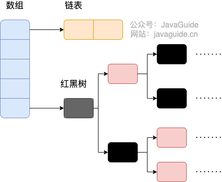
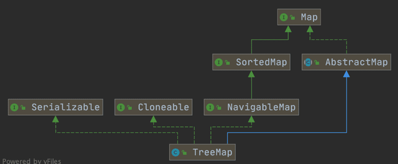
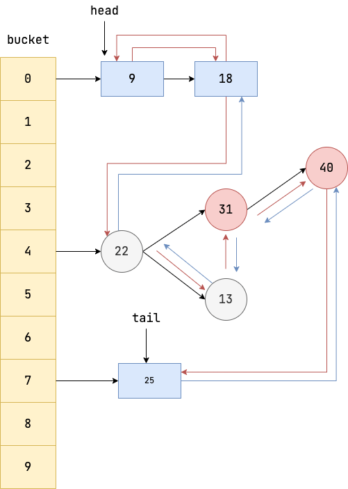

# Java 集合

[TOC]


## 集合类

Java集合类库是用来「持有对象」的，而且从设计上讲，它可以分为两个不同的概念，表示以下两个基本接口：

- `Collection`：Collection接口就是序列概念的一般化。它是由多个元素组成的序列，而且这些元素要符合一条或多条规则。
	- `List`必须按照元素插入顺序来保存它们；
	- `Set`中不能存在重复元素；
	- `Queue`则要按照排队规则来输出元素。
- `Map`：一组键值对象对，使用键来查找值。数组就是使用一个数值来查找某个对象，所以在**某种意义上**它将数值与对象关联在了一起。而Map使用另一个对象来查找某个对象。它也被称作**关联数组**（或者被称作**字典**），因为它将对象与其他对象关联在了一起；


在Java中，几乎所有的容器类都是**持有对象的引用**。当你向一个容器中添加一个对象时，实际上是将这个对象的引用添加到容器中（浅复制），而不是对象本身（深复制）。因此，如果你修改了这个对象，这些修改也会反映存储在容器中的引用所指向的对象上。

~~~Java
class A {
    int i = 0;
    A(int i) { this.i = i;}
}

A a = new A(1);
A a1 = new A(2);
A a2= new A(3);

List<A> list = new ArrayList<>(Arrays.asList(a, a1, a2));
aa1.i = 10;
System.out.println(list);

list = List.of(a, a1, a2);
a1.i = 1000;
System.out.println(list);
/*
[1, 10, 3]
[1, 1000, 3]
*/
~~~


### Collection接口

~~~java
public interface Collection<E> extends Iterable<E> {
    int size();
    boolean isEmpty();
    boolean contains(Object o);
    Iterator<E> iterator();
    Object[] toArray();
    <T> T[] toArray(T[] a);
    boolean add(E e);
    boolean remove(Object o);
    boolean containsAll(Collection<?> c);
    boolean addAll(Collection<? extends E> c);
    boolean removeAll(Collection<?> c);
    boolean retainAll(Collection<?> c);
    void clear();
    boolean equals(Object o);
    int hashCode();
    default Stream<E> stream() { //... }
}
~~~


## Set

- **HashSet**：基于哈希表实现，支持快速查找，但不支持有序性操作。并且失去了元素的插入顺序信息，也就是说使用 Iterator 遍历 HashSet 得到的结果是不确定的。

- **TreeSet**：如果存储顺序非常重要，可以使用TreeSet，它会以升序保存对象；底层使用红黑树来实现的，支持有序性操作

- **LinkedHashSet**。具有 HashSet 的查找效率，且内部使用双向链表维护元素的插入顺序。

- **ConcurrentSkipListSet**

- **CopyOnWriteArraySet**

- **SortedSet**（接口）

	

`Set`接口继承了`Collection`接口，并没有添加什么特殊的方法

## Map

- **HashMap**：键和值在 HashMap 之中的存储顺序不同于插入顺序

- **TreeMap**：TreeMap 会按照键的升序来排序。

- **LinkedHashMap**：LinkedHashMap 则按照插入顺序来保存键，同时保留了HashMap 的查找速度。

- **Hashtable**：被淘汰了。


**对象作为 Map 的 key 时，需重写 equals() 和 hashCode() 方法**

~~~java
HashMap:

// 构造一个空的HashMap,默认初始容量为16,负载因子为0.75
HashMap() 		
    

HashMap(int initialCapacity) 
HashMap(int initialCapacity, float loadFactor) 

// 构造一个包含指定Map的数据的新HashMap
HashMap(Map<? extends K, ? extends V> m) 
~~~


~~~java
Map<String, Pet> petMap = new HashMap<>();

//创建一个不可变的 map 对象，但是由于参数限制，最多支持十个键值对
Map.of("My Hamster", new Hamster("bosco")
         ,"My Dog", new Dog()
         ,"My Cat", new Cat());		

//插入键值对。If the map previously contained a mapping for the key, the old value is replaced by the specified value
petMap.put("My Hamster", new Hamster("Bosco"));
petMap.put("My Hamster", new Hamster("Molly"));	


petMap.containsKey("My Hamster");			//判断键是否在map中
petMap.containsValue("Bosco");				//判断值是否在map中
System.out.println(petMap.get("My Hamster"));//根据键获取值，若未查找到键则返回null

System.out.println(petMap.values());		//返回所有的value
System.out.println(petMap.keySet());		//返回所有的key
~~~


~~~java
if (map.containsKey(words[i])) {
    map.put(words[i], map.get(words[i]) + 1);
} else {
    map.put(words[i], 1);
}
~~~

可以优化为

~~~java
map.put(words[i], map.getOrDefault(words[i], 0) + 1);
~~~

### HashMap

- `HashMap` 可以存储 null 的 key 和 value，但 null 作为键只能有一个

- `HashMap` 默认的初始化大小为 16。创建时如果给定了容量初始值，`HashMap` 会将其扩充为 2 的幂次方大小

- JDK1.8 以后的 `HashMap` 在解决哈希冲突时有了较大的变化，当链表长度大于阈值（默认为 8）时，将链表转化为红黑树（将链表转换成红黑树前会判断，如果当前数组的长度小于 64，那么会选择先进行数组扩容，而不是转换为红黑树）

  


### TreeMap



实现 `NavigableMap` 接口让 `TreeMap` 有了对集合内元素的搜索的能力。

`NavigableMap` 接口提供了丰富的方法来探索和操作键值对:

1. **定向搜索**: `ceilingEntry()`, `floorEntry()`, `higherEntry()`和 `lowerEntry()` 等方法可以用于定位大于、小于、大于等于、小于等于给定键的最接近的键值对。
2. **子集操作**: `subMap()`, `headMap()`和 `tailMap()` 方法可以高效地创建原集合的子集视图，而无需复制整个集合。
3. **逆序视图**:`descendingMap()` 方法返回一个逆序的 `NavigableMap` 视图，使得可以反向迭代整个 `TreeMap`。
4. **边界操作**: `firstEntry()`, `lastEntry()`, `pollFirstEntry()`和 `pollLastEntry()` 等方法可以方便地访问和移除元素。

这些方法都是基于红黑树数据结构实现的。

实现`SortedMap`接口让 `TreeMap` 有了对集合中的元素根据键排序的能力。默认是按 key 的升序排序，不过我们也可以指定排序的比较器。

~~~java
TreeMap<Person, String> treeMap = new TreeMap<>(new Comparator<Person>() {
    @Override
    public int compare(Person person1, Person person2) {
        int num = person1.getAge() - person2.getAge();
        return Integer.compare(num, 0);
    }
});

~~~

**综上，相比于`HashMap`来说， `TreeMap` 主要多了对集合中的元素根据键排序的能力以及对集合内元素的搜索的能力。**

当你把对象加入`HashSet`时，`HashSet` 会先计算对象的`hashcode`值来判断对象加入的位置，同时也会与其他加入的对象的 `hashcode` 值作比较，如果没有相符的 `hashcode`，`HashSet` 会假设对象没有重复出现。但是如果发现有相同 `hashcode` 值的对象，这时会调用`equals()`方法来检查 `hashcode` 相等的对象是否真的相同。如果两者相同，`HashSet` 就不会让加入操作成功（返回 false ）。

### LinkedHashMap

`LinkedHashMap` 在 `HashMap` 基础上维护一条双向链表，支持遍历时会按照插入顺序有序进行迭代。




此外，`LinkedHashMap` 可以通过构造函数中的 `accessOrder` 参数指定按照访问顺序迭代元素。当 `accessOrder` 为 true 时，每次访问一个元素时，该元素会被移动到链表的末尾，因此下次访问该元素时，它就会成为链表中的最后一个元素，从而实现按照访问顺序迭代元素。基于此特点，我们可以实现 LRU 缓存：

~~~java
public class LRUCache<K,V> extends LinkedHashMap<K,V> {

    private int cacheSize;

    public LRUCache(int cacheSize) {
        super(16, 0.75f, true); // 第三个参数表示 LinkedHashMap 的访问顺序
        this.cacheSize = cacheSize;
    }

    // 一旦插入操作让 removeEldestEntry 返回 true 时，视为缓存已满，LinkedHashMap 就会将链表首元素移除
    @Override
    protected boolean removeEldestEntry(Map.Entry<K,V> eldest) {
        return size() > cacheSize; 
    }
}
~~~


LinkedHashMap 如何实现 LRU 缓存？

### ConcurrentHashMap

- `ConcurrentHashMap` 的 key 和 value 不能为 null ，主要是为了避免二义性。多线程下无法正确判定键值对是否存在（存在其他线程修改的情况），单线程是可以的（不存在其他线程修改的情况）。
- `ConcurrentHashMap` 提供了一些原子性的复合操作，如 `putIfAbsent`、`compute`、`computeIfAbsent` 、`computeIfPresent`、`merge`等


ConcurrentHashMap 使用了锁分段技术，它在内部创建了N（默认值为16）个锁实例。


## List

有两种类型的List：

- **ArrayList**：擅长随机访问元素，但是在List的中间插入或删除元素比较慢。
- **LinkedList**：供了理想的顺序访问性能，在List的中间插入和删除元素的成本都比较低。LinkedList随机访问性能相对较差

### 接口

~~~java
public interface List<E> extends Collection<E> {
    E get(int index);
    E set(int index, E element);    // return the element previously at the specified position
    void add(int index, E element);
    E remove(int index);
    int indexOf(Object o);
    int lastIndexOf(Object o);
    List<E> subList(int fromIndex, int toIndex);	//注意返回List的引用，而不是创建一个新List
    static <E> List<E> of(E... elements);		//创建一个List
    
}
~~~


### ArrayList

- `ArrayList`是**非线程安全**的 
- `ArrayList` 底层使用的是 **`Object` 数组**；`LinkedList` 底层使用的是 **双向链表** 数据结构
- ArrayList 每次扩容之后容量都会变为原来的 1.5 倍左右。oldCapacity + (oldCapacity >> 1)

ArrayList的构造器如下：

~~~java
public class ArrayList<E> extends AbstractList<E>
        implements List<E>, RandomAccess, Cloneable, java.io.Serializable {
    
    public ArrayList(int initialCapacity)    		// 初始容量
    public ArrayList()							 // 创建一个默认初始容量(10)空 ArrayList。
    public ArrayList(Collection<? extends E> c)    // 浅拷贝
        
}
~~~

可以用第三种初始化方法返回列表的浅拷贝

~~~java
Integer[] array = {1, 2, 3, 4, 5};
List<Integer> list = Arrays.asList(array);
System.out.println(list);
List<Integer> list2= new ArrayList<>(list);
list.set(2, 100);
System.out.println(list);

/*
    [1, 2, 3, 4, 5]
    [1, 2, 100, 4, 5]
*/
~~~


ArrayList 的 set 方法要满足 index < 0 || index >= size()，否则抛出异常`IndexOutOfBoundsException` – if the index is out of range 


另外,从 Java 9 开始,还提供了几个工厂方法来创建不可变的 ArrayList:

- List.of()
- List.copyOf()

这些方法创建的 ArrayList 在添加和删除时会抛出异常。

### LinkedList

`LinkedList` 底层数据结构是链表。需要用到 `LinkedList` 的场景几乎都可以使用 `ArrayList` 来代替，并且，性能通常会更好！就连 `LinkedList` 的作者Josh Bloch自己都说从来不会使用 `LinkedList` 。


### Stack、Vector

`Vector` 和 `Stack` 两者都是线程安全的，都是使用 `synchronized` 关键字进行同步处理

Java 1.0 就提供了Stack类，结果这个类的设计非常糟糕。不过因为要向后兼容，所以我们永远也无法摆脱Java过去的设计错误了。

### CopyOnWriteArrayList

对于大部分业务场景来说，读取操作往往是远大于写入操作的。`CopyOnWriteArrayList` 针对这点进行了优化。`CopyOnWriteArrayList` 中的读取操作是完全无需加锁的。写入操作也不会阻塞读取操作，只有写写才会互斥。

当需要修改（ `add`，`set`、`remove` 等操作） `CopyOnWriteArrayList` 的内容时，不会直接修改原数组，而是会先创建底层数组的副本，对副本数组进行修改，修改完之后再将修改后的数组赋值回去。但是修改操作不会立即反映到最终结果中，还需要等待复制完成，这可能会导致数据一致性问题。


## Queue

### Queue接口

~~~java
public interface Queue<E> extends Collection<E> {
    boolean add(E e);
    boolean offer(E e);
    E remove();
    E poll();
    E element();
    E peek();
}
~~~

在操作失败后，有两种处理策略，它们分别是抛出异常与返回特殊值。

| `Queue` 接口 | 抛出异常  | 返回特殊值 |
| ------------ | --------- | ---------- |
| 插入队尾     | add(E e)  | offer(E e) |
| 删除队首     | remove()  | poll()     |
| 查询队首元素 | element() | peek()     |

### Deque接口

`Deque`接口继承了`Queue`接口

| `Deque` 接口 | 抛出异常      | 返回特殊值      |
| ------------ | ------------- | --------------- |
| 插入队首     | addFirst(E e) | offerFirst(E e) |
| 插入队尾     | addLast(E e)  | offerLast(E e)  |
| 删除队首     | removeFirst() | pollFirst()     |
| 删除队尾     | removeLast()  | pollLast()      |
| 查询队首元素 | getFirst()    | peekFirst()     |
| 查询队尾元素 | getLast()     | peekLast()      |

事实上，`Deque` 还提供有 `push()` 和 `pop()` 等其他方法，可用于模拟栈

### ArrayDeque

`ArrayDeque`实现了 `Deque` 接口

`ArrayDeque` 是基于可变长的数组和双指针来实现。`ArrayDeque` 不支持存储 `NULL` 数据，但 `LinkedList` 支持。

### PriorityQueue

- `PriorityQueue` 利用了二叉堆的数据结构来实现的，底层使用可变长的数组来存储数据

- `PriorityQueue` 通过堆元素的上浮和下沉，实现了在 O(logn) 的时间复杂度内插入元素和删除堆顶元素。

- `PriorityQueue` 是非线程安全的，且不支持存储 `NULL` 和 `non-comparable` 的对象。

- `PriorityQueue` 默认是小顶堆，但可以接收一个 `Comparator` 作为构造参数，从而来自定义元素优先级的先后。

  ~~~java
  PriorityQueue<String> queue = new PriorityQueue<>(Collection.reverseOrder());
  ~~~

### BlockingQueue

~~~java
public interface BlockingQueue<E> extends Queue<E> {
  // ...
}
~~~

`BlockingQueue` 常用于生产者-消费者模型中


BlockingQueue 的实现类有

- `ArrayBlockingQueue`：ArrayBlockingQueue 的缺点是其内部在实现 put、take 操作的时候使用的是同一个锁

- `LinkedBlockingQueue`：LinkedBlockingQueue 的优点是其内部在实现 put、take 操作的时候分别使用了两个显式锁(putLock 和 takeLock)。由于是基于链表实现的，它可能增加垃圾回收的负担。

- `PriorityBlockingQueue`：支持优先级排序的无界阻塞队列。元素必须实现`Comparable`接口或者在构造函数中传入`Comparator`对象，并且不能插入 null 元素。

- `SynchronousQueue`：它一个不存储元素的队列。每一个`put`操作必须等待一个`take`操作，反之亦然

- `DelayQueue`

  

BlockingQueue 接口定义的 offer(E) 和 poll() 分别相当于 put(E) 和 take() 的非阻塞版。

### ArrayBlockingQueue

为了解决高并发场景下多线程之间数据共享的问题，JDK1.5 版本中出现了 `ArrayBlockingQueue` 和 `LinkedBlockingQueue`，它们是带有生产者-消费者模式实现的并发容器。其中，`ArrayBlockingQueue` 是有界队列，即添加的元素达到上限之后，再次添加就会被阻塞或者抛出异常。而 `LinkedBlockingQueue` 则由链表构成的队列

- `ArrayBlockingQueue` 一旦创建，容量不能改变。
- 为了保证线程安全，`ArrayBlockingQueue` 的并发控制采用可重入锁 `ReentrantLock` ，不管是插入操作还是读取操作，都需要获取到锁才能进行操作。并且，它还支持公平和非公平两种方式的锁访问机制，默认是非公平锁
- 通过 `Condition` 实现线程间的等待和唤醒操作。


新增元素：

| 方法                                      | 队列满时处理方式                                         | 方法返回值 |
| ----------------------------------------- | -------------------------------------------------------- | ---------- |
| `put(E e)`                                | 线程阻塞，直到中断或被唤醒                               | void       |
| `offer(E e)`                              | 直接返回 false                                           | boolean    |
| `offer(E e, long timeout, TimeUnit unit)` | 指定超时时间内阻塞，超过规定时间还未添加成功则返回 false | boolean    |
| `add(E e)`                                | 直接抛出 `IllegalStateException` 异常                    | boolean    |

获取/移除元素：

| 方法                                | 队列空时处理方式                                    | 方法返回值 |
| ----------------------------------- | --------------------------------------------------- | ---------- |
| `take()`                            | 线程阻塞，直到中断或被唤醒                          | E          |
| `poll()`                            | 返回 null                                           | E          |
| `poll(long timeout, TimeUnit unit)` | 指定超时时间内阻塞，超过规定时间还是空的则返回 null | E          |
| `peek()`                            | 返回 null                                           | E          |
| `remove()`                          | 直接抛出 `NoSuchElementException` 异常              | boolean    |


### DelayQueue

`DelayQueue` 是 JUC 包(`java.util.concurrent)`为我们提供的延迟队列。`DelayQueue` 中存放的元素必须实现 `Delayed` 接口，并且需要重写 `getDelay()`方法（计算是否到期）。

```java
public interface Delayed extends Comparable<Delayed> {
    long getDelay(TimeUnit unit);
}
```

默认情况下, `DelayQueue` 会按照到期时间升序编排任务。只有当元素过期时（`getDelay()`方法返回值小于等于 0），才能从队列中取出。注意：并不是任务到期后就会执行，而是可以从队列中取出到期的任务。

~~~java
// 延迟任务

public class DelayedTask implements Delayed {
    // 任务到期时间
    private long executeTime;
    
    // 任务
    private Runnable task;

    public DelayedTask(long delay, Runnable task) {
        this.executeTime = System.currentTimeMillis() + delay;
        this.task = task;
    }

    // 查看当前任务还有多久到期
    @Override
    public long getDelay(TimeUnit unit) {
        return unit.convert(executeTime - System.currentTimeMillis(), TimeUnit.MILLISECONDS);
    }

    // 延迟队列需要到期时间升序入队，所以我们需要实现compareTo进行到期时间比较
    @Override
    public int compareTo(Delayed o) {
        return Long.compare(this.executeTime, ((DelayedTask) o).executeTime);
    }

    public void execute() {
        task.run();
    }
}
~~~


- `DelayQueue` 就是基于 `ReentrantLock` 独占锁确保存取操作的线程安全。
- `DelayQueue` 底层是使用优先队列 `PriorityQueue` 来存储元素

`DelayQueue`维护了一个  leader 成员变量，它表示当前在队列中等待的线程中最有可能是下一个被唤醒的线程，有效地减少了无用的线程唤醒，提升了性能。


`DelayQueue` 添加元素的方法无论是 `add`、`put` 还是 `offer`，本质上就是调用一下 `offer` 。`offer` 方法的整体逻辑为:

1. 尝试获取 `lock` 。
2. 如果上锁成功,则调 `q` 的 `offer` 方法将元素存放到优先队列中。
3. 调用 `peek` 方法看看当前队首元素是否就是本次入队的元素。如果是，则说明当前这个元素是即将到期的任务（即优先级最高的元素），于是将 `leader` 设置为空。唤醒因为队列为空时调用 `take` 等方法而导致阻塞的线程来争抢元素。
4. 上述步骤执行完成，释放 `lock`。
5. 返回 true。

`DelayQueue` 中获取元素的方式分为阻塞式和非阻塞式。先来看看阻塞式获取元素方法`take`，以 3 个线程并发获取元素为例

1. 首先， 3 个线程会尝试获取可重入锁 `lock`。 t1 得到了锁，而 t2、t3 没有抢到锁，故将这两个线程存入等待队列中。

   

2. 紧接着 t1 开始进行元素获取的逻辑。线程 t1 首先会查看 `DelayQueue` 队列首元素是否为空。

   1. 如果元素为空，则说明当前队列没有任何元素，故 t1 就会被阻塞存到 `conditionWaiter` 这个队列中。

      

      注意，调用 `await` 之后 t1 就会释放 `lcok` 锁。假如 `DelayQueue` 持续为空，那么 t2、t3 也会像 t1 一样执行相同的逻辑并进入 `conditionWaiter` 队列中。

      

   2. 如果元素不为空，则判断当前任务是否到期，如果元素到期，则直接返回出去。如果元素未到期，则判断当前 `leader` 线程是否为空。若不为空，则说明当前 `leader` 正在等待执行一个优先级比当前元素还高的元素到期，故当前线程 t1 只能调用 `await` 等待。等到 `leader` 取得元素后唤醒。反之，若 `leader` 线程为空，则将 leader 设置为当前线程，并进入有限期等待，到期后取出元素并返回。


## 工具类 

~~~java
public static <T> java.util.List<T> asList(@NotNull  T... a )
~~~

返回一个固定大小的`List`。推荐使用`List.of`方法，但他也返回一个不可变的`List`。

~~~java
List<Integer> list1 = List.of(1, 2, 3);、
list1.set(1, 2);	//Error
list1.add(5);		//Error

List<Integer> list2 = Arrays.asList(1, 2, 3);
list2.set(1, 2);	//Error
list2.add(5);		//Ok
~~~


## 迭代器 Iterator

迭代器（也是一种设计模式）是一个对象，它可以在序列中移动，并用来选择该序列中的每个对象。能够**将序列的遍历操作与序列的底层结构分离**。因此，我们有时候会说，**迭代器统一了对集合的访问**。

`Iterator`接口（迭代器）中的方法有：

- `next()`方法获得序列中的下一个对象。
- `hasNext()`方法检查序列中是否还有更多对象。
- `remove()`方法删除该迭代器最近返回的元素。这暗含着调用`remove()`之前必须调用`next()`。


`Iteratable`接口（可迭代对象）中的方法有

- `iterator()`方法让`Collection`返回一个`Iterator`。这个迭代器将准备好返回序列中的第一个元素。

### List Iterator

`ListIterator`是`Iterator`的一种更为强大的子类型。它是`List`对象特有的迭代器。

- `hasPrevious`
- `privious`
- `listIterator(int)`，返回一个`Iterator`对象。第一次`next`返回索引为`n`的元素。

### for-in与Iterator

`for-in`强制要求接受一个数组，或者`java.lang.Iterable`对象。

对于已经实现`Iterable`的对象，`for-in`会自动调用它的`iterator()`方法获取`Iterator`，然后开始迭代。

~~~java
public class ForEachAndIetrator {
    public static void main(String[] args) {
        for (String s : new T()) {
            System.out.print(s + " ");
        }
        System.out.println();
        for (String s : new T().reversedIterator()) {
            System.out.print(s + " ");
        }
    }
}

class T implements Iterable<String> {
    protected String[] words = ("And that is how we know the Earth to be banana-shaped.").split(" ");
    
    @Override
    public Iterator<String> iterator() {
        return new Iterator<String>() {
            private int index = 0;
            @Override public boolean hasNext() {
                return index < words.length;
            }
            @Override public String next() {
                return words[index++];
            }
            @Override public void remove() {
                throw new UnsupportedOperationException();
            }
        };
    }
    
    //适配器
    public Iterable<String> reversedIterator() {
        return new Iterable<String>() {
            @Override public Iterator<String> iterator() {
                return new Iterator<String>() {
                    private int index = words.length;
                    
                    @Override public boolean hasNext() {return index > 0; }
                    @Override public String next() { return words[--index];}
                    @Override public void remove() {throw new UnsupportedOperationException();}
                };
            }
        };
    }
}
/*
And that is how we know the Earth to be banana-shaped. 
banana-shaped. be to Earth the know we how is that And 
*/
~~~

### 修改

在遍历时增删集合元素，有两种处理方法：

- **遍历的时候不允许增删元素**。在获取迭代器时，就立即禁止集合的修改操作。当程序员使用完迭代器后，主动调用`finishIteration()`方法，允许集合的修改操作。

- **增删元素之后让遍历报错**，这也正是 Java 集合库所采用的方案。

  在容器中定义一个属性 modCount，记录集合被修改的次数。当创建迭代器时，迭代器的expectedModCount 属性初始化为 modCount。每次调用迭代器的 hasNext()、next()、currentItem() 方法时，都会检查集合上的 modCount 是否等于 expectedModCount。

  若不相等，则说明集合被修改了，迭代器可能产生不符合预期的结果。此时，直接一个 fail-fast，抛出运行时异常。

当我们获取迭代器时，创建当前容器的一个「快照」。迭代器遍历的对象是快照而非容器，这样就避免了在使用迭代器遍历的过程中，增删容器中的元素而导致的不可预期的结果。最简单的实现方式就是直接复制容器：

~~~java
public class SnapshotArrayIterator<E> implements Iterator<E> {
  private int cursor;
  private ArrayList<E> snapshot;							//用于保存快照

  public SnapshotArrayIterator(ArrayList<E> arrayList) {
    this.cursor = 0;
    this.snapshot = new ArrayList<>();
    this.snapshot.addAll(arrayList);						// 浅复制容器
  }
}
~~~

显然，每次创建迭代器时，都要复制一份数据到快照中，这比较浪费资源。

在容器中，为每个元素保存添加时间戳`addTimestamp`和删除时间戳`delTimestamp`。当向集合添加元素时，我们将该元素的`addTimestamp`设置为当前时间，将`delTimestamp`设置成最大长整型值（Long.MAX\_VALUE）。当元素被删除时，我们将delTimestamp 更新为当前时间，标记为删除，但并不将它从容器中移除。

同时，每个迭代器也保存一个迭代器创建时间戳`snapshotTimestamp`。当使用迭代器来遍历容器的时候，只有满足约束关系$addTimestamp<snapshotTimestamp<delTimestamp$的元素，才是属于这个迭代器的快照。

~~~java
private Object[] elements;
private long[] addTimestamps;
private long[] delTimestamps;
~~~

实际上，这种解决方案又引入了另外一个问题，因为删除是惰性删除，就不支持随机访问了。我们可以在 ArrayList 中维护两个数组来解决这个问题。一个支持标记删除的，用来实现快照遍历功能；一个不支持标记删除的，用来支持随机访问。
