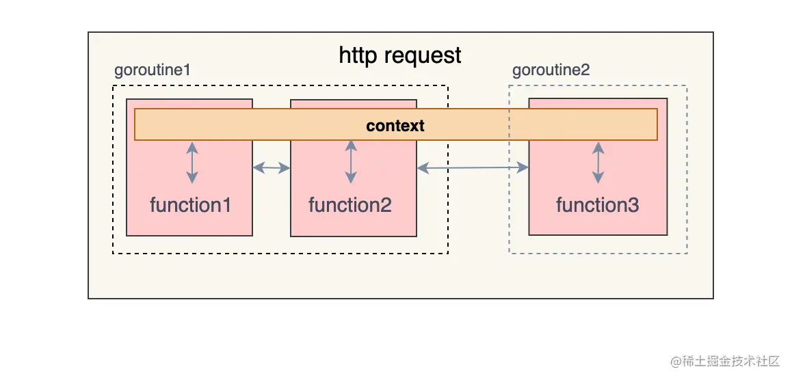
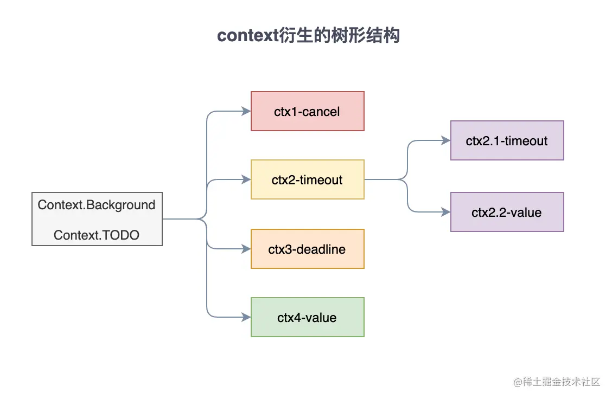

# 工具

[TOC]

## 命令行

### os.Args

如果你只是简单的想要获取命令行参数，可以像下面的代码示例一样使用 os.Args 来获取命令行参数。

~~~dart
func main() {
    //os.Args是一个[]string
    if len(os.Args) > 0 {
        for index, arg := range os.Args {
            fmt.Printf("args[%d]=%v\n", index, arg)
        }
    }
}
~~~

~~~bash
$ ./args_demo a b c d
args[0]=./args_demo
args[1]=a
args[2]=b
args[3]=c
args[4]=d
~~~

### flag

这里我们介绍 `flag` 包，它是用于解析命令行选项的。支持的命令行参数类型有：

|   flag参数   | 有效值                                                       |
| :----------: | :----------------------------------------------------------- |
|  字符串flag  | 合法字符串                                                   |
|   整数flag   | 1234、0664、0x1234等类型，也可以是负数。                     |
|  浮点数flag  | 合法浮点数                                                   |
| bool类型flag | 1, 0, t, f, T, F, true, false, TRUE, FALSE, True, False。    |
|  时间段flag  | 任何合法的时间段字符串。如”300ms”、”-1.5h”、”2h45m”。 合法的单位有”ns”、”us” /“µs”、”ms”、”s”、”m”、”h”。 |


有以下两种的定义命令行 flag 参数的方法：

- `flag.Type()`：

  ~~~go
  name := flag.String("name", "张三", "姓名")
  age := flag.Int("age", 18, "年龄")
  married := flag.Bool("married", false, "婚否")
  delay := flag.Duration("d", 0, "时间间隔")
  ~~~

  1. 参数名
  2. 默认值
  3. 提示信息

- `flag.TypeVar()`：

  ~~~go
  var name string
  var age int
  var married bool
  var delay time.Duration
  flag.StringVar(&name, "name", "张三", "姓名")
  flag.IntVar(&age, "age", 18, "年龄")
  flag.BoolVar(&married, "married", false, "婚否")
  flag.DurationVar(&delay, "d", 0, "时间间隔")
  ~~~

  


`flag`库支持的命令行参数格式有以下几种：

~~~bash
-flag xxx
--flag xxx 
-flag=xxx 
--flag=xxx 
~~~

其中，布尔类型的参数必须使用等号的方式指定。


## 终端

终端其实是一个文件，相关实例如下：

- `os.Stdin`：标准输入的文件实例，类型为`*File`
- `os.Stdout`：标准输出的文件实例，类型为`*File`
- `os.Stderr`：标准错误输出的文件实例，类型为`*File`

~~~go
var buf [16]byte
os.Stdin.Read(buf[:])
os.Stdout.WriteString(string(buf[:]))
~~~

https://colobu.com/2016/10/12/go-file-operations/

## 终端命令

通过 `CombinedOutput()` 来执行命令，并返回 standard output and standard error

```go
func main() {
    cmd := exec.Command("ls", "-lah")
    out, err := cmd.CombinedOutput()
    if err != nil {
        log.Fatalf("cmd.Run() failed with %s\n", err)
    }
    fmt.Printf("combined out:\n%s\n", string(out))
}
```

`Output()`也可以执行命令，但只返回 standard output

```go
func main() {
    out, err := exec.Command("date").Output()
    if err != nil {
        log.Fatal(err)
    }
    fmt.Printf("The date is %s\n", out)
}
```


命令行的输入输出可以重定向到 Buffer 上

```go
func main() {
    cmd := exec.Command("ls", "-lah")
    var stdin, stdout, stderr bytes.Buffer
    cmd.Stdin = &stdin
    cmd.Stdout = &stdout
    cmd.Stderr = &stderr
    err := cmd.Run()
    if err != nil {
        log.Fatalf("cmd.Run() failed with %s\n", err)
    }
    outStr, errStr := string(stdout.Bytes()), string(stderr.Bytes())
    fmt.Printf("out:\n%s\nerr:\n%s\n", outStr, errStr)
}
```

- cmd.Run() 阻塞等待命令执行结束

- cmd.Start() 不会等待命令完成（异步）


检查命令是否存在

~~~go
path, err := exec.LookPath("ls")
if err != nil {
    fmt.Printf("didn't find 'ls' executable\n")
} else {
    fmt.Printf("'ls' executable is in '%s'\n", path)
}
~~~


管道的实现

~~~go
func main() {
    c := exec.Command("ls", "|", "wc", "-l")		// 错误
    c.Stdout = os.Stdout
    _ = c.Run()
}

// 正确
c1 := exec.Command("ls")
c2 := exec.Command("wc", "-l")
c2.Stdin, _ = c1.StdoutPipe()
c2.Stdout = os.Stdout
_ = c2.Start()
_ = c1.Run()
_ = c2.Wait()


// 正确
cmd := "cat /proc/cpuinfo | egrep '^model name' | uniq | awk '{print substr($0, index($0,$4))}'"
out, err := exec.Command("bash", "-c", cmd).Output()
~~~


## 网络编程

每一种通信方式都使用 xxConn 结构体来表示，诸如 IPConn、TCPConn 等，这些结构体都实现了 Conn 接口，Conn接口实现了基本的读、写、关闭、获取远程和本地地址、设置 timeout 等功能。

~~~go
type Conn interface {
    // Read 从连接中读取数据
    // Read 超时后返回错误
    Read(b []byte) (n int, err error)
    
    // Write 向连接中写入数据
    // Write 超时后返回错误
    Write(b []byte) (n int, err error)
    
    // Close 方法关闭该连接
    // 并会导致任何阻塞中的 Read 或 Write 返回错误
    Close() error
    
    // 返回本地网络地址
    LocalAddr() Addr
    
    // 返回远端网络地址
    RemoteAddr() Addr
    
    // 设定该连接的读写 deadline，等价于同时调用 SetReadDeadline 和SetWriteDeadline
    //  超过 deadline 时间后, I/O 操作就会直接因超时失败返回，而不会继续阻塞
    SetDeadline(t time.Time) error
    
    SetReadDeadline(t time.Time) error
    
    SetWriteDeadline(t time.Time) error
}
~~~


## 输入输出

- `Print`：输出到控制台（不能格式化）
- `Println`： 输出到控制台并换行（不能格式化）
- `Printf` ：格式化输出字符串
- `Sprintf`：按照格式化内容返回一个字符串
- `Fprintf`：将格式化字符串输出到指定的 IO 流上
- `Eprintf`：返回一个 Error 对象，报错信息为格式化字符串。

格式化的占位符

| 占位符 |                说明                |
| :----: | :--------------------------------: |
|   %v   |          值的默认格式表示          |
|  %+v   | 类似%v，但输出结构体时会添加字段名 |
|  %#v   |           值的Go语法表示           |
|   %T   |            打印值的类型            |
|   %%   |               百分号               |

| 占位符 |     说明      |
| :----: | :-----------: |
|   %t   | true 或 false |

| 占位符 |                    说明                     |
| :----: | :-----------------------------------------: |
|   %b   |                表示为二进制                 |
|   %c   |           该值对应的 unicode 码值           |
|   %d   |                表示为十进制                 |
|   %o   |                表示为八进制                 |
|   %x   |          表示为十六进制，使用 a-f           |
|   %X   |          表示为十六进制，使用 A-F           |
|   %U   | 表示为 Unicode 格式：U+1234，等价于”U+%04X” |
|   %q   |                                             |

| 占位符 |                       说明                        |
| :----: | :-----------------------------------------------: |
|   %b   | 无小数部分、二进制指数的科学计数法，如-123456p-78 |
|   %e   |            科学计数法，如-1234.456e+78            |
|   %E   |            科学计数法，如-1234.456E+78            |
|   %f   |         有小数部分但无指数部分，如123.456         |
|   %F   |                     等价于%f                      |
|   %g   |                                                   |
|   %G   |                                                   |

| 占位符 |                   说明                    |
| :----: | :---------------------------------------: |
|   %s   |         直接输出字符串或者[]byte          |
|   %q   |                                           |
|   %x   |  每个字节用两字符十六进制数表示（使用a-f  |
|   %X   | 每个字节用两字符十六进制数表示（使用A-F） |

| 占位符 |              说明              |
| :----: | :----------------------------: |
|   %p   | 表示为十六进制，并加上前导的0x |

| 占位符 |        说明        |
| :----: | :----------------: |
|   %f   | 默认宽度，默认精度 |
|  %9f   |  宽度9，默认精度   |
|  %.2f  |  默认宽度，精度2   |
| %9.2f  |    宽度9，精度2    |
|  %9.f  |    宽度9，精度0    |


fmt 包中提供了3类读取输入的函数：

- Scan 家族：从标准输入 os.Stdin 中读取数据，包括 Scan()、Scanf()、Scanln()

  `Scanln` 扫描来自标准输入的文本，将空格分隔的值依次存放到后续的参数内，直到碰到换行。`Scanf` 与其类似，除了 `Scanf` 的第一个参数用作格式字符串，用来决定如何读取。

- SScan 家族：从字符串中读取数据，包括 Sscan()、Sscanf()、Sscanln()

- Fscan 家族：从 io.Reader 中读取数据，包括Fscan()、Fscanf()、Fscanln()

使用：

~~~go
var (
    name string
    age  int
)
fmt.Print("输入姓名和年龄，使用空格分隔：")
fmt.Scanln(&name, &age)
~~~

## HTTP

### 服务端

服务端主要涉及这两个对象：

- ServeMux：HTTP 请求路由器，根据请求的 URL 分发到 Handler 处理器。

- Handler：请求处理方法

  ~~~go
  type Handler interface {
  	ServeHTTP(ResponseWriter, *Request)
  }
  ~~~

  - `*http.Request`表示 HTTP 请求对象，该对象包含请求的所有信息

  - `ResponseWriter` 接口用于写入响应信息

    ~~~go
    type ResponseWriter interface {
        Header() Header
        Write([]byte) (int, error)
        WriteHeader(statusCode int)
    }
    ~~~


http 包中提供了一个默认 ServeMux，直接调用 `http.ListenAndServe()` 就可以开包即用 HTTP 服务端：

~~~go
 func hello(w http.ResponseWriter, r *http.Request) {
     fmt.Fprintf(w, "Hello!")
 }
 
 func main() {
     http.HandleFunc("/hello", hello)
     http.ListenAndServe(":8080", nil)
     // 后面的代码会被阻塞
 }
~~~

我们可以通过 `http.NewServeMux()`创建一个新的`ServeMux`对象

~~~go
mux := http.NewServeMux()
mux.HandleFunc("/", handler)
server := &http.Server{
    Addr:         ":8080",
    Handler:      mux,
    ReadTimeout:  20 * time.Second,
    WriteTimeout: 20 * time.Second,
}
server.ListenAndSere()
~~~


### 客户端

~~~go
resp, err := http.Get("http://5lmh.com/")
...
resp, err := http.Post("http://5lmh.com/upload", "image/jpeg", &buf)
...
resp, err := http.PostForm("http://5lmh.com/form",
    url.Values{"key": {"Value"}, "id": {"123"}})
~~~

程序在使用完 response 后必须关闭回复的主体。

```go
resp, err := http.Get("http://5lmh.com/")
if err != nil {
    // handle error
}
defer resp.Body.Close()
body, err := ioutil.ReadAll(resp.Body)
```

 POST 的示例：

~~~go
url := "http://127.0.0.1:9090/post"
// 表单数据
//contentType := "application/x-www-form-urlencoded"
//data := "name=枯藤&age=18"


// json
contentType := "application/json"
data := `{"name":"枯藤","age":18}`
resp, err := http.Post(url, contentType, strings.NewReader(data))
if err != nil {
    fmt.Println("post failed, err:%v\n", err)
    return
}
defer resp.Body.Close()
b, err := ioutil.ReadAll(resp.Body)
if err != nil {
    fmt.Println("get resp failed,err:%v\n", err)
    return
}
fmt.Println(string(b))
~~~

有时需要在请求的时候设置头参数、cookie 之类的数据，就可以使用 `http.Do` 方法。

~~~go
client := &http.Client{}

req, err := http.NewRequest("POST", "http://www.01happy.com/demo/accept.php", strings.NewReader("name=cjb"))
if err != nil {
    // handle error
}

req.Header.Set("Content-Type", "application/x-www-form-urlencoded")
req.Header.Set("Cookie", "name=anny")

resp, err := client.Do(req)
~~~


自定义 Client：

~~~go
address := &net.TCPAddr{Port: 8080}
dialer := &net.Dialer{LocalAddr: address}
transport := &http.Transport{
    Proxy:                 http.ProxyFromEnvironment,
    DialContext:           dialer.DialContext,
    MaxIdleConns:          100,
    IdleConnTimeout:       10 * time.Second,
    TLSHandshakeTimeout:   10 * time.Second,
    ExpectContinueTimeout: 1 * time.Second,
}
client := &http.Client{
    Transport: transport,
}
resp, err := client.Get("http://5lmh.com")
// ...
~~~

~~~go
type Client struct { 
    Transport RoundTripper 
    CheckRedirect func(req *Request, via []*Request) error 
    Jar CookieJar 
    Timeout time.Duration
}
~~~

- **Transport**：
- **CheckRedirect**：用于指定处理重定向的策略；
- **Jar**：用于管理和存储请求中的 cookie；
- **Timeout**：指定客户端请求的最大超时时间

### context

Context 主要作用是在一次请求经过的所有协程或函数间，**传递取消信号及共享数据**，以达到父协程对子协程管理的目的。



`context.Context `是一个接口，该接口定义了四个需要实现的方法。具体签名如下：

```go
type Context interface {
    Deadline() (deadline time.Time, ok bool)
    Done() <-chan struct{}
    Err() error
    Value(key interface{}) interface{}
}
```

在 context 包中定义有 emptyCtx、cancelCtx、timerCtx、valueCtx 结构体，它们都实现了 Context 接口。它们都有对应构造函数：

~~~go
// emptyCtx
Backgroud()
TODO()

// cancelCtx
func WithCancel(parent Context) (ctx Context, cancel CancelFunc)

// timerCtx
func WithDeadline(parent Context, deadline time.Time) (Context, CancelFunc)
func WithTimeout(parent Context, timeout time.Duration) (Context, CancelFunc)

// valueCtx
func WithValue(parent Context, key, val interface{}) Context
~~~

Background() 和 TODO()  作为最顶层的 partent context，衍生出更多的子上下文对象。通过调用 WithXXX 函数，会衍生出一个 Context 树，树的每个节点都可以有任意多个子节点 Context。当一个上下文被取消时，它派生的所有上下文也被取消。



如果衍生出新的 partent context，那么就视为新的 Context Tree，不受父 Tree 的影响。

#### 携带数据

~~~go
ctx := context.WithValue(context.Background(), "trace_id", "value")
v, ok := ctx.Value(k)
~~~

#### 超时控制

当协程运行时间达到 Deadline 时，就会调用取消函数，关闭 done 通道，往 done 通道中输入一个空结构体消息 struct{}{}，这时所有监听 done 通道的子协程都会收到该消息，便知道父协程已经关闭，需要自己也结束运行。

这里要注意的是，创建 timeCtx 时会返回一个`cancelFunc`方法，通过调用这个方法可以达到提前进行取消。

~~~go
func foo() {
    ctx, cancel := context.WithTimeout(context.Background(), 3 * time.Second)
    defer cancel()
    deal(ctx)
}
func deal(ctx context.Context)  {
    for i:=0; i< 10; i++ {
        time.Sleep(1 * time.Second)
        select {
        case <- ctx.Done():
            fmt.Println(ctx.Err())
            return
        default:
            fmt.Printf("deal time is %d\n", i)
        }
    }
}
~~~


#### 取消控制

WithCancel 函数的返回值有两个，一个是 ctx，一个是取消函数 cancel。当父协程调用 cancel 函数时，就相当于触发了关闭的动作，在 cancel 的执行逻辑中会将 ctx 的 done 通道关闭，然后所有监听该通道的子协程就会收到一个 struct{} 类型的零值。

来看一个例子：

```go
func main()  {
    // 在创建 Context 时，获取到一个取消函数，用于通知子协程取消的。
    ctx,cancel := context.WithCancel(context.Background())
    go Speak(ctx)
    time.Sleep(10*time.Second)
    cancel()					// 通知子协程取消
    time.Sleep(1*time.Second)
}

func Speak(ctx context.Context)  {
    for range time.Tick(time.Second){
        select {
        case <- ctx.Done():			// 等待父协程的取消信号
            fmt.Println("我要闭嘴了")
            return
        default:
            fmt.Println("balabalabalabala")
        }
    }
}
```

## logrus

很多知名的开源项目都使用了这个库，如大名鼎鼎的 docker。

~~~shell
$ go get github.com/sirupsen/logrus
~~~

`logrus`支持更多的日志级别：

~~~go
logrus.Trace("trace msg")
logrus.Debug("debug msg")
logrus.Info("info msg")
logrus.Warn("warn msg")
logrus.Error("error msg")
logrus.Fatal("fatal msg")
logrus.Panic("panic msg")
~~~

- `Panic`：记录日志，然后`panic`。
- `Fatal`：致命错误，出现错误时程序无法正常运转。输出日志后，程序退出；
- `Error`：错误日志，需要查看原因；
- `Warn`：警告信息，提醒程序员注意；
- `Info`：关键操作，核心流程的日志；
- `Debug`：一般程序中输出的调试信息；
- `Trace`：很细粒度的信息，一般用不到；


log 支持更多的设定：

~~~go

// 设置日志格式为json格式
logrus.SetFormatter(&log.JSONFormatter{})

// 设置将日志输出到标准输出（默认的输出为stderr,标准错误）
// 日志消息输出可以是任意的 io.writer 类型
logrus.SetOutput(os.Stdout)

// 设置日志级别为 warn 以上
logrus.SetLevel(log.InfoLevel)

// 在输出日志中添加文件名和方法信息
logrus.SetReportCaller(true)
~~~


有时候需要在输出中添加一些字段，可以通过调用`logrus.WithField`和`logrus.WithFields`实现：

~~~go
// 临时添加
logrus.WithFields(logrus.Fields{
    "name": "dj",
    "age": 18,
}).Info("info msg")

// 永久添加
requestLogger := logrus.WithFields(logrus.Fields{
    "user_id": 10010,
    "ip":      "192.168.32.15",
})

requestLogger.Info("info msg")
~~~


## IO 流


## Buffer

~~~go
type Buffer struct {
	buf      []byte // contents are the bytes buf[off : len(buf)]
	off      int    // read at &buf[off], write at &buf[len(buf)]
	lastRead readOp 
}
~~~

- **创建 Buffer：**

  ~~~go
  // 1.  NewBuffer 函数系列
  buf := bytes.NewBufferString("hello world")
  b := bytes.NewBuffer(s []byte)
  
  // 2. 结构体
  var buf bytes.Buffer
  ~~~

- **写入数据**

  ~~~go
  func (b *Buffer) Write(p []byte) (n int, err error)
  // 返回值 n 表示实际写入的字节数
  ~~~

  除了 Write 方法之外，Buffer 类型还提供了一系列其他方法来写入数据，例如 WriteString、WriteByte、WriteRune 等。这些方法分别用于向缓冲区写入字符串、单个字节、单个 Unicode 字符等。

  在字符串拼接时，如果直接使用 + 运算符会产生大量的中间变量，影响程序的效率。使用 Buffer 类型可以避免这个问题。

  在写入数据的过程中，如果缓冲区的容量不够，就需要进行扩容。

- **读取数据**

  ~~~go
  func (b *Buffer) Read(p []byte) (n int, err error)
  // 返回值 n 表示实际读取的字节数
  ~~~

  除了 Read 方法之外，Buffer 类型还提供了一系列其他方法来读取数据，例如 ReadString、ReadByte、ReadRune 等

- 读入到缓存区/从缓存区写入

  ~~~go
  //从 io.Reader 接口写入到 Buffer 尾部
  b.ReadFrom(r io.Reader) (n int64, err error)    
  
  //将 Buffer 中的内容输出到 io.Writer 接口
  b.WriteTo(w io.Writer) (n int64, err error)
  ~~~

- 重置缓冲区：

  ~~~go
  func (b *Buffer) Reset() 
  ~~~

  Reset 方法将缓冲区清空并重置为初始状态

## Strconv

strconv包实现了基本数据类型与其字符串表示的转换，主要有以下常用函数： Atoi()、Itia()、parse系列、format系列、append系列。


Atoi() 函数用于将字符串类型的整数转换为 int 类型

~~~go
func Atoi(s string) (i int, err error)
~~~

Itoa() 函数用于将 int 类型数据转换为对应的字符串表示，**数字的最高位在索引 0 处，有点反直觉。**

~~~go
func Itoa(i int) string
~~~

Parse 类函数用于转换字符串为给定类型的值：ParseBool()、ParseFloat()、ParseInt()、ParseUint()

~~~go
func ParseBool(str string) (value bool, err error)
func ParseInt(s string, base int, bitSize int) (i int64, err error)
func ParseUint(s string, base int, bitSize int) (n uint64, err error)
func ParseFloat(s string, bitSize int) (f float64, err error)
~~~

- ParseBool 接受1、0、t、f、T、F、true、false、True、False、TRUE、FALSE；否则返回错误。
- base 指定进制（2到36）
- bitSize 指定结果必须能无溢出赋值的整数类型，0、8、16、32、64 分别代表 int、int8、int16、int32、int64；或者指定期望的浮点类型，32 是 float32，64 是 float64；


Format 系列函数实现了将给定类型数据格式化为 string 类型数据的功能

~~~go
func FormatBool(b bool) string
func FormatInt(i int64, base int) string
func FormatUint(i uint64, base int) string
func FormatFloat(f float64, fmt byte, prec, bitSize int) string
~~~

- prec：控制精度（排除指数部分）
- fmt：表示格式
  - ’f’（-ddd.dddd）
  - ’b’（-ddddp±ddd，指数为二进制）
  - ’e’（-d.dddde±dd，十进制指数）
  - ’E’（-d.ddddE±dd，十进制指数）
- bitSize：表示 f 的来源类型（32：float32、64：float64）


## 排序

对于 `[]int`, `[]float`, `[]string` 基础类型的切片，可以使用 sort 包提供的下面几个函数进行排序。

~~~go
s := []int{4, 2, 3, 1}
sort.Ints(s)

// sort.Floats
// sort.Strings
~~~

`sort.Slice` 对任何类型的切片进行排序，它可以接受一个比较器。而 `sort.SliceStable` 在排序切片时会保留相等元素的原始顺序。

~~~go
family := []struct {
    Name string
    Age  int
}{
    {"Alice", 23},
    {"David", 2},
    {"Eve", 2},
    {"Bob", 25},
}

// 用 age 排序，年龄相等的元素保持原始顺序
sort.SliceStable(family, func(i, j int) bool {
    return family[i].Age < family[j].Age
})
~~~


使用 `sort.Sort` 或者 `sort.Stable` 函数，可以对实现了  `sort.Interface` 接口的任意类型进行排序：

~~~go
type Interface interface {
    Len() int
    Less(i, j int) bool // i, j 是元素的索引
    Swap(i, j int)
}
~~~

