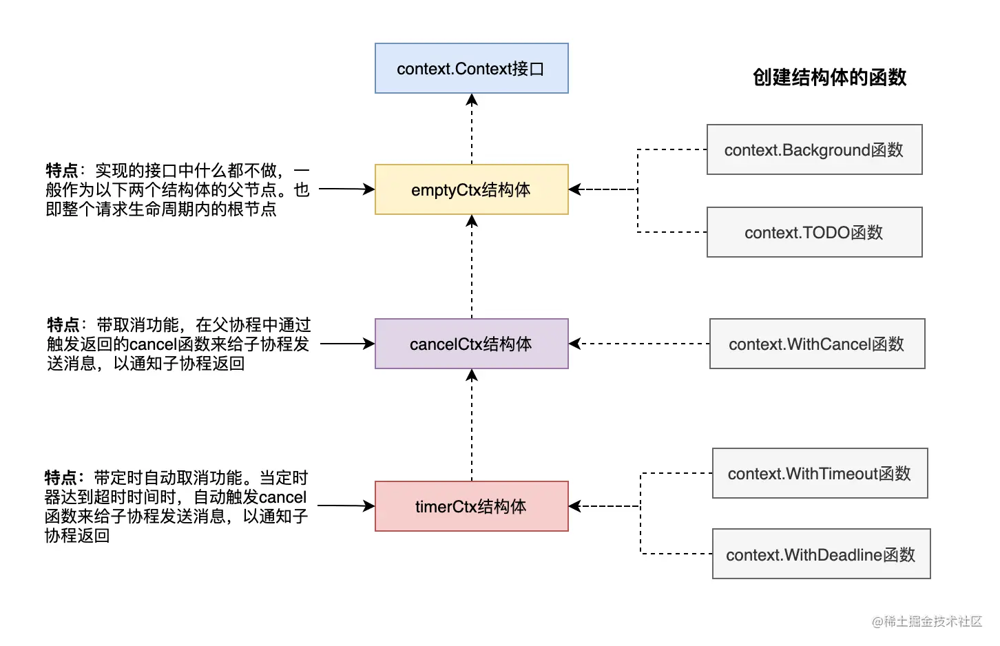

# 工具

[TOC]

## 命令行

如果你只是简单的想要获取命令行参数，可以像下面的代码示例一样使用 os.Args 来获取命令行参数。

~~~dart
func main() {
    //os.Args是一个[]string
    if len(os.Args) > 0 {
        for index, arg := range os.Args {
            fmt.Printf("args[%d]=%v\n", index, arg)
        }
    }
}
~~~

~~~bash
$ ./args_demo a b c d
args[0]=./args_demo
args[1]=a
args[2]=b
args[3]=c
args[4]=d
~~~


这里我们介绍 `flag` 包，它是用于解析命令行选项的。支持的命令行参数类型有：

|   flag参数   | 有效值                                                       |
| :----------: | :----------------------------------------------------------- |
|  字符串flag  | 合法字符串                                                   |
|   整数flag   | 1234、0664、0x1234等类型，也可以是负数。                     |
|  浮点数flag  | 合法浮点数                                                   |
| bool类型flag | 1, 0, t, f, T, F, true, false, TRUE, FALSE, True, False。    |
|  时间段flag  | 任何合法的时间段字符串。如”300ms”、”-1.5h”、”2h45m”。 合法的单位有”ns”、”us” /“µs”、”ms”、”s”、”m”、”h”。 |


有以下两种的定义命令行 flag 参数的方法：

- `flag.Type()`：

  ~~~go
  name := flag.String("name", "张三", "姓名")
  age := flag.Int("age", 18, "年龄")
  married := flag.Bool("married", false, "婚否")
  delay := flag.Duration("d", 0, "时间间隔")
  ~~~

  1. 参数名
  2. 默认值
  3. 提示信息

- `flag.TypeVar()`：

  ~~~go
  var name string
  var age int
  var married bool
  var delay time.Duration
  flag.StringVar(&name, "name", "张三", "姓名")
  flag.IntVar(&age, "age", 18, "年龄")
  flag.BoolVar(&married, "married", false, "婚否")
  flag.DurationVar(&delay, "d", 0, "时间间隔")
  ~~~

  


`flag`库支持的命令行参数格式有以下几种：

~~~bash
-flag xxx
--flag xxx 
-flag=xxx 
--flag=xxx 
~~~

其中，布尔类型的参数必须使用等号的方式指定。

## 终端命令

CombinedOutput()，执行命令并返回 standard output and standard error

```go
func main() {
    cmd := exec.Command("ls", "-lah")
    out, err := cmd.CombinedOutput()
    if err != nil {
        log.Fatalf("cmd.Run() failed with %s\n", err)
    }
    fmt.Printf("combined out:\n%s\n", string(out))
}
```

Output()，执行命令并返回 standard output

```go
func main() {
    out, err := exec.Command("date").Output()
    if err != nil {
        log.Fatal(err)
    }
    fmt.Printf("The date is %s\n", out)
}
```


用 buffer 接受输出

```go
func main() {
    cmd := exec.Command("ls", "-lah")
    var stdin, stdout, stderr bytes.Buffer
    cmd.Stdin = &stdin
    cmd.Stdout = &stdout
    cmd.Stderr = &stderr
    err := cmd.Run()
    if err != nil {
        log.Fatalf("cmd.Run() failed with %s\n", err)
    }
    outStr, errStr := string(stdout.Bytes()), string(stderr.Bytes())
    fmt.Printf("out:\n%s\nerr:\n%s\n", outStr, errStr)
}
```

- cmd.Run() 阻塞等待命令执行结束

- cmd.Start() 不会等待命令完成（异步）


预先检查命令是否存在

~~~go
path, err := exec.LookPath("ls")
if err != nil {
    fmt.Printf("didn't find 'ls' executable\n")
} else {
    fmt.Printf("'ls' executable is in '%s'\n", path)
}
~~~


管道通信的实现

~~~go
func main() {
    c := exec.Command("ls", "|", "wc", "-l")		// 错误
    c.Stdout = os.Stdout
    _ = c.Run()
}

// 正确
c1 := exec.Command("ls")
c2 := exec.Command("wc", "-l")
c2.Stdin, _ = c1.StdoutPipe()
c2.Stdout = os.Stdout
_ = c2.Start()
_ = c1.Run()
_ = c2.Wait()


// 正确
cmd := "cat /proc/cpuinfo | egrep '^model name' | uniq | awk '{print substr($0, index($0,$4))}'"
out, err := exec.Command("bash", "-c", cmd).Output()
~~~


## 网络编程

每一种通信方式都使用 xxConn 结构体来表示，诸如 IPConn、TCPConn 等，这些结构体都实现了 Conn 接口，Conn接口实现了基本的读、写、关闭、获取远程和本地地址、设置 timeout 等功能。

~~~go
type Conn interface {
    // Read 从连接中读取数据
    // Read 超时后返回错误
    Read(b []byte) (n int, err error)
    
    // Write 向连接中写入数据
    // Write 超时后返回错误
    Write(b []byte) (n int, err error)
    
    // Close 方法关闭该连接
    // 并会导致任何阻塞中的 Read 或 Write 返回错误
    Close() error
    
    // 返回本地网络地址
    LocalAddr() Addr
    
    // 返回远端网络地址
    RemoteAddr() Addr
    
    // 设定该连接的读写 deadline，等价于同时调用SetReadDeadline和SetWriteDeadline
    // deadline是一个绝对时间，超过该时间后I/O操作就会直接因超时失败返回而不会阻塞
    // deadline对之后的所有I/O操作都起效，而不仅仅是下一次的读或写操作
    // 参数 t 为零值表示不设置期限
    SetDeadline(t time.Time) error
    
    SetReadDeadline(t time.Time) error
    
    SetWriteDeadline(t time.Time) error
}
~~~

## 输入输出

- `Print`：输出到控制台（不能格式化）
- `Println`： 输出到控制台并换行（不能格式化）
- `Printf` ：格式化输出字符串
- `Sprintf`：按照格式化内容返回一个字符串
- `Fprintf`：将格式化字符串输出到指定的 IO 流上

格式化的占位符

| 占位符 |                说明                |
| :----: | :--------------------------------: |
|   %v   |          值的默认格式表示          |
|  %+v   | 类似%v，但输出结构体时会添加字段名 |
|  %#v   |           值的Go语法表示           |
|   %T   |            打印值的类型            |
|   %%   |               百分号               |

| 占位符 |     说明      |
| :----: | :-----------: |
|   %t   | true 或 false |

| 占位符 |                    说明                     |
| :----: | :-----------------------------------------: |
|   %b   |                表示为二进制                 |
|   %c   |           该值对应的 unicode 码值           |
|   %d   |                表示为十进制                 |
|   %o   |                表示为八进制                 |
|   %x   |          表示为十六进制，使用 a-f           |
|   %X   |          表示为十六进制，使用 A-F           |
|   %U   | 表示为 Unicode 格式：U+1234，等价于”U+%04X” |
|   %q   |                                             |

| 占位符 |                       说明                        |
| :----: | :-----------------------------------------------: |
|   %b   | 无小数部分、二进制指数的科学计数法，如-123456p-78 |
|   %e   |            科学计数法，如-1234.456e+78            |
|   %E   |            科学计数法，如-1234.456E+78            |
|   %f   |         有小数部分但无指数部分，如123.456         |
|   %F   |                     等价于%f                      |
|   %g   |                                                   |
|   %G   |                                                   |

| 占位符 |                   说明                    |
| :----: | :---------------------------------------: |
|   %s   |         直接输出字符串或者[]byte          |
|   %q   |                                           |
|   %x   |  每个字节用两字符十六进制数表示（使用a-f  |
|   %X   | 每个字节用两字符十六进制数表示（使用A-F） |

| 占位符 |              说明              |
| :----: | :----------------------------: |
|   %p   | 表示为十六进制，并加上前导的0x |

| 占位符 |        说明        |
| :----: | :----------------: |
|   %f   | 默认宽度，默认精度 |
|  %9f   |  宽度9，默认精度   |
|  %.2f  |  默认宽度，精度2   |
| %9.2f  |    宽度9，精度2    |
|  %9.f  |    宽度9，精度0    |


fmt 包中提供了3类读取输入的函数：

- Scan 家族：从标准输入 os.Stdin 中读取数据，包括 Scan()、Scanf()、Scanln()

  `Scanln` 扫描来自标准输入的文本，将空格分隔的值依次存放到后续的参数内，直到碰到换行。`Scanf` 与其类似，除了 `Scanf` 的第一个参数用作格式字符串，用来决定如何读取。

- SScan 家族：从字符串中读取数据，包括 Sscan()、Sscanf()、Sscanln()

- Fscan 家族：从 io.Reader 中读取数据，包括Fscan()、Fscanf()、Fscanln()

使用：

~~~go
var (
    name string
    age  int
)
fmt.Print("输入姓名和年龄，使用空格分隔：")
fmt.Scanln(&name, &age)
~~~


## HTTP

通过`http.HandleFunc()`和`http.ListenAndServe()`两个函数就可以轻松创建一个简单的Go web服务器

~~~go
 func hello(w http.ResponseWriter, r *http.Request) {
     fmt.Fprintf(w, "Hello!")
 }
 
 func main() {
     http.HandleFunc("/hello", hello)
     http.ListenAndServe(":8080", nil)
     // 后面的代码会被阻塞
 }
~~~

### 客户端

~~~go
resp, err := http.Get("http://5lmh.com/")
...
resp, err := http.Post("http://5lmh.com/upload", "image/jpeg", &buf)
...
resp, err := http.PostForm("http://5lmh.com/form",
    url.Values{"key": {"Value"}, "id": {"123"}})
~~~

程序在使用完 response 后必须关闭回复的主体。

```go
resp, err := http.Get("http://5lmh.com/")
if err != nil {
    // handle error
}
defer resp.Body.Close()
body, err := ioutil.ReadAll(resp.Body)
```

 POST 的示例：

~~~go
url := "http://127.0.0.1:9090/post"
// 表单数据
//contentType := "application/x-www-form-urlencoded"
//data := "name=枯藤&age=18"


// json
contentType := "application/json"
data := `{"name":"枯藤","age":18}`
resp, err := http.Post(url, contentType, strings.NewReader(data))
if err != nil {
    fmt.Println("post failed, err:%v\n", err)
    return
}
defer resp.Body.Close()
b, err := ioutil.ReadAll(resp.Body)
if err != nil {
    fmt.Println("get resp failed,err:%v\n", err)
    return
}
fmt.Println(string(b))
~~~

有时需要在请求的时候设置头参数、cookie之类的数据，就可以使用 `http.Do` 方法。

~~~go
client := &http.Client{}

req, err := http.NewRequest("POST", "http://www.01happy.com/demo/accept.php", strings.NewReader("name=cjb"))
if err != nil {
    // handle error
}

req.Header.Set("Content-Type", "application/x-www-form-urlencoded")
req.Header.Set("Cookie", "name=anny")

resp, err := client.Do(req)
~~~


自定义 Client：

~~~go
address := &net.TCPAddr{Port: 8080}
dialer := &net.Dialer{LocalAddr: address}
transport := &http.Transport{
    Proxy:                 http.ProxyFromEnvironment,
    DialContext:           dialer.DialContext,
    MaxIdleConns:          100,
    IdleConnTimeout:       10 * time.Second,
    TLSHandshakeTimeout:   10 * time.Second,
    ExpectContinueTimeout: 1 * time.Second,
}
client := &http.Client{
    Transport: transport,
}
resp, err := client.Get("http://5lmh.com")
// ...
~~~

~~~go
type Client struct { 
    Transport RoundTripper 
    CheckRedirect func(req *Request, via []*Request) error 
    Jar CookieJar 
    Timeout time.Duration
}
~~~

- **Transport**：
- **CheckRedirect**：用于指定处理重定向的策略；
- **Jar**：用于管理和存储请求中的 cookie；
- **Timeout**：指定客户端请求的最大超时时间

### context

为什么需要 context？ 我们来看一个示例：

~~~go
var wg sync.WaitGroup

// 初始的例子

func worker() {
    for {
        fmt.Println("worker")
        time.Sleep(time.Second)
    }
    // 如何接收外部命令实现退出
    wg.Done()
}

func main() {
    wg.Add(1)
    go worker()
    // 如何优雅的实现结束子goroutine
    wg.Wait()
    fmt.Println("over")
}
~~~

方法一：全局变量

~~~go
var wg sync.WaitGroup
var exit bool

// 全局变量方式存在的问题：
// 1. 使用全局变量在跨包调用时不容易统一
// 2. 如果worker中再启动goroutine，就不太好控制了。

func worker() {
    for {
        fmt.Println("worker")
        time.Sleep(time.Second)
        if exit {
            break
        }
    }
    wg.Done()
}

func main() {
    wg.Add(1)
    go worker()
    time.Sleep(time.Second * 3) // sleep3秒以免程序过快退出
    exit = true                 // 修改全局变量实现子goroutine的退出
    wg.Wait()
    fmt.Println("over")
}
~~~

方法二：通道

~~~go
var wg sync.WaitGroup

// 管道方式存在的问题：
// 1. 使用全局变量在跨包调用时不容易实现规范和统一，需要维护一个共用的channel

func worker(exitChan chan struct{}) {
LOOP:
    for {
        fmt.Println("worker")
        time.Sleep(time.Second)
        select {
        case <-exitChan: // 等待接收上级通知
            break LOOP
        default:
        }
    }
    wg.Done()
}

func main() {
    var exitChan = make(chan struct{})
    wg.Add(1)
    go worker(exitChan)
    time.Sleep(time.Second * 3) // sleep3秒以免程序过快退出
    exitChan <- struct{}{}      // 给子goroutine发送退出信号
    close(exitChan)
    wg.Wait()
    fmt.Println("over")
}
~~~

方法三：context（官方推荐）

~~~go
func worker(ctx context.Context) {
LOOP:
    for {
        fmt.Println("worker")
        time.Sleep(time.Second)
        select {
        case <-ctx.Done(): // 等待上级通知
            break LOOP
        default:
        }
    }
    wg.Done()
}

func main() {
    ctx, cancel := context.WithCancel(context.Background())
    wg.Add(1)
    go worker(ctx)
    time.Sleep(time.Second * 3)
    cancel() // 通知子goroutine结束
    wg.Wait()
    fmt.Println("over")
}
~~~

Context 主要作用是在一次请求经过的所有协程或函数间传递取消信号及共享数据，以达到父协程对子协程管理的目的


`context.Context `是一个接口，该接口定义了四个需要实现的方法。具体签名如下：

```go
type Context interface {
    Deadline() (deadline time.Time, ok bool)
    Done() <-chan struct{}
    Err() error
    Value(key interface{}) interface{}
}
```

当协程运行时间达到 Deadline 时，就会调用取消函数，关闭 done 通道，往 done 通道中输入一个空结构体消息 struct{}{}，这时所有监听 done 通道的子协程都会收到该消息，便知道父协程已经关闭，需要自己也结束运行。

在 context 包中定义有 emptyCtx、cancelCtx、timerCtx、valueCtx。

~~~go
// 创建带有取消功能的 Context
func WithCancel(parent Context) (ctx Context, cancel CancelFunc) 

// 创建带有定时自动取消功能的 Context
func WithTimeout(parent Context, timeout time.Duration) (Context, CancelFunc)

// 创建带有定时自动取消功能的 Context
func WithDeadline(parent Context, d time.Time) (Context, CancelFunc)
~~~



WithCancel函数的返回值有两个，一个是 ctx，一个是取消函数 cancel。当父协程调用 cancel 函数时，就相当于触发了关闭的动作，在 cancel 的执行逻辑中会将 ctx 的 done 通道关闭，然后所有监听该通道的子协程就会收到一个 struct{} 类型的零值。

Background() 和 TODO()  作为最顶层的partent context，衍生出更多的子上下文对象。通过调用 WithXXX 函数，会衍生出一个 Context 树，树的每个节点都可以有任意多个子节点 Context。当一个上下文被取消时，它派生的所有上下文也被取消。


## Log

log 包定义了 Logger 类型，该类型提供了一些格式化输出的方法。

```go
type Logger struct {
    mu     sync.Mutex // ensures atomic writes; protects the following fields
    prefix string     // prefix on each line to identify the logger (but see                            Lmsgprefix)
    flag   int        // properties
    out    io.Writer  // destination for output
    buf    []byte     // for accumulating text to write
}
```

本包提供了一个预定义的 logger，可以通过调用函数 Print 系列`(Print|Printf|Println）`、Fatal 系列`（Fatal|Fatalf|Fatalln）`、和 Panic 系列`（Panic|Panicf|Panicln）`来使用

~~~go
func main() {
    log.Println("这是一条优雅的日志。")
    v := "优雅的"
    log.Printf("这是一个%s日志\n", v)
    
    // fatal 系列函数会在写入日志信息后调用 os.Exit(1)
    log.Fatalln("这是一天会触发fatal的日志") 
    
    // Panic 系列函数会在写入日志信息后 panic。
    log.Panicln("这是一个会触发panic的日志。") 
}
~~~

也可以自行创建一个对象：

~~~go
func main() {
    logger := log.New(os.Stdout, "<PS>", log.Lshortfile|log.Ldate|log.Ltime)
    logger.Println("这是自定义的logger记录的日志。")
}
~~~

### Flags

```go
const (
    Ldate    = 1 << iota     // the date in the local time zone: 2009/01/23
    Ltime                    // the time in the local time zone: 01:23:23
    Lmicroseconds           // microsecond resolution: 01:23:23.123123.  assumes Ltime.
    Llongfile               // full file name and line number: /a/b/c/d.go:23
    Lshortfile   // final file name element and line number: d.go:23. overrides Llongfile
    LUTC         // if Ldate or Ltime is set, use UTC rather than the local time zone
    Lmsgprefix  // move the "prefix" from the beginning of the line to before the message
    LstdFlags = Ldate | Ltime // initial values for the standard logger
)
```

```go
func main() {
    log.SetFlags(log.Llongfile | log.Lmicroseconds | log.Ldate)
    log.Println("这是一条优雅的日志。")
    // 2020/07/14 22:51:06.079594 D:/go_workspace/src/leaning_go/src/main/test_log.go:24: 这是一
}
```

### Out

out 属性是一个 io.Writer 输出流，通过它可以把日志输出到文件中。

~~~go
logFile, err := os.OpenFile("./xx.log", os.O_CREATE|os.O_WRONLY|os.O_APPEND, 0644)
if err != nil {
    return
}
log.SetOutput(logFile)
log.SetOutput(ioutil.Discard) // 关闭输出
~~~

## logrus

~~~go
import (
    "os"

    log "github.com/sirupsen/logrus"
)

func init() {
    // 设置日志格式为json格式
    log.SetFormatter(&log.JSONFormatter{})

    // 设置将日志输出到标准输出（默认的输出为stderr,标准错误）
    // 日志消息输出可以是任意的io.writer类型
    log.SetOutput(os.Stdout)

    // 设置日志级别为 warn 以上
    log.SetLevel(log.InfoLevel)
}

func main() {
    log.Info("A group of walrus emerges from the ocean")
    log.Warn("The group's number increased tremendously!")
}
~~~


## File

终端其实是一个文件，相关实例如下：

- `os.Stdin`：标准输入的文件实例，类型为`*File`
- `os.Stdout`：标准输出的文件实例，类型为`*File`
- `os.Stderr`：标准错误输出的文件实例，类型为`*File`

~~~go
var buf [16]byte
os.Stdin.Read(buf[:])
os.Stdout.WriteString(string(buf[:]))
~~~

https://colobu.com/2016/10/12/go-file-operations/

## IO 流

**输入流（Reader）**的定义

~~~go
type Reader interface {
	Read(p []byte) (n int, err error)
}
~~~

- Read 最多读取 len(p) 字节的数据，并保存到 p。
- n<len(p) 时，表示读取的数据不足以填满 p，这时方法会立即返回，而不是阻塞等待更多的数据。

**输出流（Writer）**的定义

~~~go
type Writer interface {
	Write(p []byte) (n int, err error)
}
~~~

- write 方法向底层数据流写入 len(p) 字节的数据，这些数据来自于切片 p


bufio 包实现了缓存IO。它包装了 io.Reader 和 io.Writer 对象。不过它们是有缓存的。该包同时为文本 I/O 提供了一些便利操作。

~~~go
type Reader struct {
    buf          []byte        // 缓存
    rd           io.Reader    // 底层的io.Reader
    // r: 从buf中读走的字节（偏移）；w: buf中填充内容的偏移；
    // w - r 是buf中可被读的长度（缓存数据的大小），也是Buffered()方法的返回值
    r, w         int
    err          error        // 读过程中遇到的错误
    lastByte     int        // 最后一次读到的字节（ReadByte/UnreadByte)
    lastRuneSize int        // 最后一次读到的Rune的大小 (ReadRune/UnreadRune)
}

type Writer struct {
    err error        // 写过程中遇到的错误
    buf []byte        // 缓存
    n   int            // 当前缓存中的字节数
    wr  io.Writer    // 底层的 io.Writer 对象
}
~~~


~~~go
file, err := os.OpenFile("./xxx.txt", os.O_CREATE|os.O_WRONLY, 0666)
if err != nil {
    return
}
defer file.Close()

// 获取writer对象
writer := bufio.NewWriter(file)
for i := 0; i < 10; i++ {
    writer.WriteString("hello\n")
}

// 刷新缓冲区，强制写出
writer.Flush()

// 获取 Reader 对象
reader := bufio.NewReader(strings.NewReader("http://studygolang.com. \nIt is the home of gophers"))
line, _ := reader.ReadBytes('\n')
~~~

