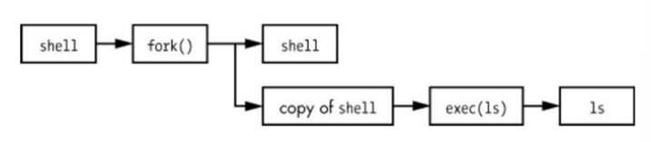
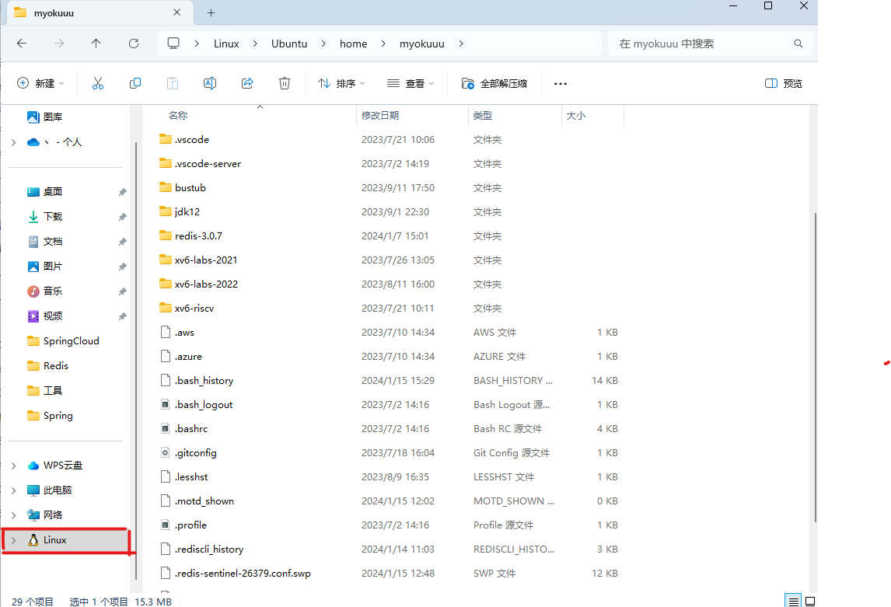
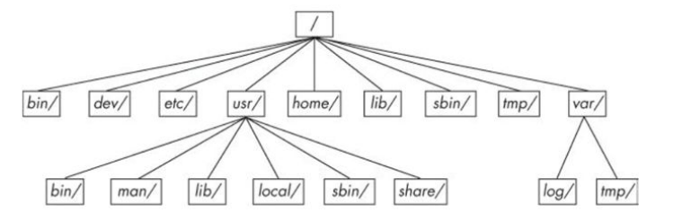
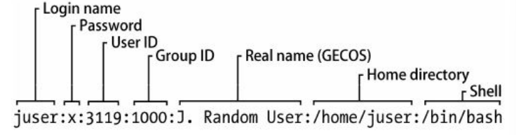
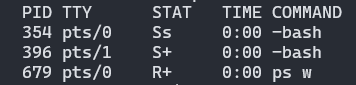
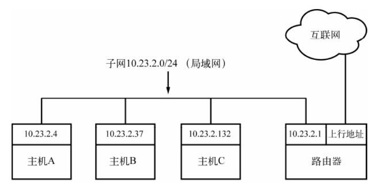
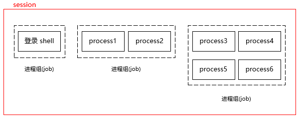

# Linux

[TOC]


## 概述

除了 init 以外，Linux 中的所有用户进程都是通过 `fork()` 来启动的。



虚拟设备对于用户进程而言是物理设备，但其实它们都是在内核上实现的，例如随机数生成器（/dev/random）

## 远程连接

~~~shell
$ scp 本地文件 -r root@124.70.201.56:~/tomcat
$ ssh root@117.88.47.10
~~~


可以在 Windows 下访问 WSL2 的文件系统

~~~
\\wsl.localhost\Ubuntu\home\myokuuu
~~~




用户将自己的公钥储存在远程主机上。登录的时候，远程主机会向用户发送一段随机字符串，用户用自己的私钥加密后，再发回来。远程主机用事先储存的公钥进行解密并对比，如果比对成功，就证明用户是可信的，直接允许登录 shell，不再要求密码。通过 ssh-keygen 来生成密钥。

下面介绍如何配置多个 SSH 密钥：

~~~shell
$ ssh-keygen -t rsa  -f ~/.ssh/github_id_rsa
$ ssh-keygen -t rsa  -f ~/.ssh/gitlab_id_rsa
$ touch ~/.ssh/config
~~~

~~~shell
$ vim config
# github
Host github.com
HostName github.com
PreferredAuthentications publickey
IdentityFile ~/.ssh/github_id_rsa

# gitlab
Host gitlab.com
HostName gitlab.com
PreferredAuthentications publickey
IdentityFile ~/.ssh/gitlab_id_rsa
~~~

~/.ssh/authorized_keys 存储对端的公玥的。


## 基础命令

Unix 的 shell 有很多种，它们都是基于 Bourne shell（/bin/sh）。而 Linux 使用了一个增强版本的 Bourne shell —— Bourne-again shell（BASH）

`CTRL-D`：终止当前终端的标准输入

`CTRL-C`：终止当前进程的运行

`CTRL-Z`：暂停当前进程运行

命令行

- `CTRL-B` 左移光标
- `CTRL-F` 右移光标
- `CTRL-A` 移动光标至行首
- `CTRL-E` 移动光标至行尾


### 文件

`ls` 显示指定目录，缺省为当前目录：

- `-l`：显示详细的列表
- `-F`：显示文件类型信息

`ll` 显示指定目录，但以列表的形式打印


`cp` 复制文件

~~~bash
cp file1 file2

# 将多个文件(file1 ... fileN)复制到目录 dir
cp file1 ... fileN dir
~~~


`mv` 重命名文件/移动文件

~~~bash
# 重命名
mv file1 file2

# 将多个文件移动到某个目录
mv file1 ... fileN dir
~~~

将当前文件重命名或者移动到别的位置，这并不影响文件的写入，因为进程仍持有这些文件的描述符


`touch`  创建文件。如果文件已经存在，则会更新文件的时间戳

~~~bash
touch file1 file2 ...
~~~


`rm` 删除文件，`-r`递归删除（删除目录）


`echo`  将它的参数（环境变量）显示到标准输出中。

~~~bash
echo Hello again.
# Hello again

echo $PATH
# 输出环境变量PATH
~~~


`cd` 设置当前工作目录。如果不指定参数，那么返回到个人主目录中（`~`）


`mkdir` 创建新目录

~~~bash
mkdir dir
~~~

- -p：若路径中的某些目录尚不存在，则自动创建


-  grep 更适合单纯的查找或匹配文本
-  sed 更适合编辑匹配到的文本
-  awk 更适合格式化文本，对文本进行较复杂格式处理

`*`匹配任意个字符，`?`匹配一个字符


`grep` 显示在文件或输入流中与参数匹配的**行**

~~~shell
grep [options] pattern [files]
~~~

- `pattern`: 是你要搜索的文本模式。
- `files`: 是你要在其中搜索模式的文件。如果不提供任何文件，grep 将从标准输入读取。
- `options`：影响 grep 搜索的各种设置。

下面是一些常用的 `grep` 命令选项：

- `-i` : 忽略大小写。

- `-v` : 反转匹配，也就是只输出不匹配该模式的行。

- `-l` : 只列出文件名（匹配某个模式的文件）。

- `-n` : 显示行号。

- `-c` : 计数匹配的行数。

- `-r`：递归查找当前目录的文件


**awk** 是一种编程语言，用于对文本和数据进行处理。

~~~bash
awk options 'BEGIN{ print "start" } pattern{ commands } END{ print "end" }' file
~~~

- `options`：是一些选项，用于控制 `awk` 的行为。
  
  - -F <分隔符> 或 --field-separator=<分隔符>： 指定输入字段的分隔符，默认是空格。
  - -v <变量名>=<值>： 设置 `awk` 内部的变量值
  - -f <脚本文件>： 指定一个包含 `awk` 脚本的文件。这样可以在文件中编写较大的 `awk` 脚本，然后通过 `-f` 选项将其加载。
  
  

 awk 的工作原理

- 执行`BEGIN{ commands }`语句块中的语句（可选）
- 从文件或标准输入读取一行，然后执行`pattern {commands}`语句块，它逐行扫描文件。如果省略 `pattern`，就认为成功匹配每一行。
- 当读至输入流末尾时，执行`END{ commands }`语句块（可选）


下面通过一个示例来说明，log.txt 文本内容如下：

```
2 this is a test
3 Do you like awk
This's a test
10 There are orange,apple,mongo
```

~~~bash
# 每行按空格或TAB分割，输出文本中的1、4项
$ awk '{print $1,$4}' log.txt
 
2 a
3 like
This's
10 orange,apple,mongo
    
# 过滤第一列大于2并且第二列等于'Are'的行
$ awk '$1>2 && $2=="Are" {print $1,$2,$3}' log.txt
~~~


sed 命令基于模式匹配过虑及修改文件，逐行处理：

- **d：**删除指定的字符
- **p：**显示指定的行
- **s：**替换指定的字符
- **i：** 在指定的行之前插入文本
- **a：**在指定的行之后追加文本
- **c：**替换指定的行
- **r：**读取文件
- **w：**保存到文件
- **i** ：直接修改源文件，默认只是在内存中临时修改文件，对源文件并无影响
- **n**：仅显示处理后的结果，默认会将原始文本一并输出

下面我们看几个示例：

~~~shell
sed -n '4,7p' a.txt          # 输出第4~7行
sed	-n '4,+10p' a.txt        # 输出第4行及其后的10行内容
sed -n '/^bin/p' a.txt       # 输出以bin开头的行

sed 's/xml/XML/g' a.txt     # 将所有的xml都替换为XML
sed 's/xml/XML/'  a.txt        # 将每行中第一个xml替换为XML
sed 's/xml/XML/3' a.txt     # 将每行中的第3个xml替换为XML

sed  '3,5d' a.txt             # 删除第3~5行
sed  '/xml/d' a.txt            # 删除所有包含xml的行
sed  '/^$/d' a.txt             # 删除所有空行

sed  '2a XX'   a.txt            # 在第二行后面，追加XX
sed  'a  xxxx'    nssw.txt   #在所有行后追加xxxx

sed  '2c XX'   a.txt            #将第二行替换为XX
sed  'c  xxxx'    nssw.txt   #在所有行前插入xxxx
sed  '1,3c  xxxx'    nssw.txt  #对1到3行替换成xxx

sed '2r a.txt'  n.txt   # 在第2行插入a.txt
sed '/^ee/r n.txt'  a.txt  # 在以ee开头的行下方插入n.txt

sed -n '/^ii/w d.txt' a.txt  # 把ii开头的行保存为d.txt
~~~


 tee 命令用于读取标准输入的数据，并将其内容输出成文件。

~~~shell
# 把错误输出也同时打印到屏幕和文件
ls -l not_find_runoob 2>&1 | tee -a lsls.log
~~~

- -a，追加，默认为覆盖。


`less` 查看大文件

- 按空格键可查看下一屏，B 键查看上一屏，Q 键退出。
- 使用 /word 从当前位置向前搜索word这个词
- 使用 ?word 从当前位置向后搜索。
- 当找到一个匹配的时候，按 N 键可以跳到下一个匹配。

`head` 显示显示文件的前 N 行内容，缺省为 10 行

- `-n`：指定要显示的行数

~~~bash
head -5 /etc/passwd
~~~

`tail` 显示文件后 N 行内容

`cat` 显示文件的内容

~~~bash
cat file1 file2 ...
~~~

当不指定参数时，cat适用内核的标准输入流（终端输入）来获取数据


`pwd` 输出当前的工作目录名

- `-P`：显示当前目录符号链接实际指向的目录名


`file` 显示文件的格式信息

`find [路径] [匹配条件]` 查找文件

- `-name pattern`：按文件名查找，支持使用通配符 `*` 和 `?`
- `-type type`：按文件类型查找，可以是 `f`（普通文件）、`d`（目录）、`l`（符号链接）等
- `-size [+-]size[cwbkMG]`：按文件大小查找，支持使用 `+` 或 `-` 表示大于或小于指定大小，单位可以是 `c`（字节）、`w`（字数）、`b`（块数）、`k`（KB）、`M`（MB）或 `G`（GB）。
- `-mtime days`：按修改时间查找，支持使用 `+` 或 `-` 表示在指定天数前或后，days 是一个整数表示天数。
- `-user username`：按文件所有者查找。
- `-group groupname`：按文件所属组查找。

`locate` 与 `file` 类似，但是它在系统创建的文件索引中查找文件。这个索引由操作系统周期性地进行更新，查找速度比 `find` 更快。但是 `locate` 对于查找新创建的文件可能会无能为力，因为它们有可能还没有被加入到索引中。

`whereis` 快速查找指定文件名在哪里

`which` 在 PATH 变量指定的路径中，搜索某个系统命令的二进制可执行文件路径，并且返回第一个搜索结果。


在 Linux 和 Unix 系统中，以`.`开始的文件是隐藏文件。 这些被称为 dot 文件。 Shell 通配符（比如 `*`）默认情况下不会匹配这些点文件，除非明确指定`ls -a`可以显示出 dot 文件。


硬限制（Hard Limit）是用户或进程在任何时候都不能超过的资源限制。由 root 用户设置。软限制（Soft Limit）可以被用户或进程提高或降低，但不能超过硬限制。系统会按照软限制的值限制资源。

`ulimit -n 1000` 表示设置进程的文件描述符数量的上限为1000，默认值为1024。不过这个命令仅对当前会话有效。可以在`/etc/rc.local`中添加`ulimit -SHn 1000000`即可永久修改该配置。其中，选项`-S`表示软性极限值，`-H`表示硬性极限值。

`ulimit` 命令：只对当前会话有效，而且不能超过硬限制

`limits.conf` 文件：在所有会话中有效，且重启系统后依然有效。

### 变量

shell 中可以保存一些临时变量，称作 shell 变量

~~~bash
VARIABLE_NAME="value"
echo $VARIABLE_NAME 

# 删除shell变量
unset VARIABLE_NAME
~~~

进程是不能访问到 shell 变量的，可以通过 `export` 命令，将 shell 变量提升为环境变量，这样就可以被进程访问到了：

~~~bash
export VARIABLE_NAME
~~~

~~~bash
# 创建了一个临时的环境变量
export VAR_NAME="value"
~~~

如果你想创建持久的环境变量（也就是在你每次登陆或重启后仍然存在的环境变量），你需要把 export 语句添加到你的 shell 配置文件中，如 `~/.bashrc`，`~/.bash_profile`，或 `~/.profile`。然后通过 `source` 命令开启新的 shell 会话来使改动生效。

PATH 是一个特殊的环境变量，它定义了命令路径。shell 在执行一个命令的时候，会**从前往后**去这些目录中查找这个命令，直到在某个目录下**首次匹配**到这个命令。

当 shell 变量和环境变量同名时，大部分 shell 会优先考虑 shell 变量，忽略同名的环境变量。在脚本中使用 unset 命令时，会同时删除同名的 shell 变量以及环境变量

### man手册

 man 获取在线帮助：

在线帮助手册章节列表

| 章节号 |            内容            |
| :----: | :------------------------: |
|   1    |          用户命令          |
|   2    |          系统调用          |
|   3    |     Unix高级编程库文档     |
|   4    | 设备接口和设备驱动程序信息 |
|   5    | 文件描述符（系统配置文件） |
|   6    |            游戏            |
|   7    |    文件格式、规范和编码    |
|   8    |      系统命令和服务器      |

~~~bash
man 5 passwd

man ls
~~~


### 重定向

重定向标准输出流 `>`

~~~bash
command > file
~~~

如果文件 file 不存在，shell 会创建一个新文件 file 。如果 file 文件已经存在，shell 会先清空文件的内容。如果不想把原文件覆盖，你可以使用 `>>` 将命令的输出结果加入到文件末尾：


重定向错误输出流 `2>`

~~~bash
ls /fffffffff > f 2> e
~~~


`2>&1` 将标准输出和标准错误输出重定向到同一个地方

~~~bash
ls /fffffffff > f 2>&1
~~~


标准输入重定向 `<`

~~~shell
head < /proc/cpuinfo
~~~


管道字符（`|`）将一个命令的执行结果输出到另一个命令:

~~~bash
head /proc/cpuinfo | tr a-z A-Z
~~~

对于重定向到 `/dev/null` 来说，内核会直接忽略输入/输出数据。

### 压缩

压缩文件

` tar -cvf archive.tar file1 file2 ...`

- `c`：压缩文件模式
- `v`：详细输出
- `f`：指定`tar`应该使用哪个文件

解压文件：

`tar -xvf archive.tar`

- `x`：解压文件模式


压缩文件：

`gzip filename`

解压文件：

`gunzip filename.gz`

## 硬盘和文件系统

### 权限

-rw-r--r--

- 第一个字符`-`是文件类型 ，`-`代表常规文件
- 用户权限
- 用户组权限
- 其他权限

有些可执行文件的执行位是 `s` （setuid）而不是 `x` ，表示你必须以文件拥有者
的身份运行该文件。各个权限对应的数字为：`r:4`、`w:2`、`x:1`


`chmod` 命令更改文件权限

- 数字形式：每个权限对应一个数字

  ~~~bash
  chmod 777 文件名
  ~~~

- 符号形式：使用字母 'u'、'g' 和 'o' 代表用户，群组和其他人。使用 '+'，'-' 和 '=' 表示添加，删除和设置权限。使用字母 'r'、'w' 和 'x' 代表读，写和执行权限

  ~~~bash
  # 删除群组的写权限
  chmod g-w 文件名
  
  chmod guo+rw bgDemo
  ~~~
  

`-R` 选项可以递归修改权限。


`chown`是一个在 Unix 和 Linux 类型操作系统上，用来更改文件或者目录所有者的命令：

~~~bash
chown [OPTION]... [OWNER][:[GROUP]] FILE...
~~~

- `OWNER`可以是一个用户名或者用户ID。
- `GROUP`可以是一个组名或者组ID。

~~~bash
chown newowner:newgroup filename
~~~

这个命令将`filename`的所有者改为`newowner`，所属的组改为`newgroup`。

### 目录结构

Linux目录结构基础



- `/bin` 可执行文件（程序）

- `/sbin` 重要的可执行文件（程序），一般只有 root 用户能使用。

- `/dev` 设备文件

- `/etc` 配置文件

- `/home` 个人目录

- `/lib`  共享库代码库

- `/proc` 通过一个可浏览的目录与文件接口，来存放系统相关信
  息，比如当前运行的进程和内核的信息

- `/sys` 类似 /proc，里面是设备和系统的信息

- `/tmp` 临时文件。很多系统会在启动时清空 /tmp 目录

- `/usr` 用户的可执行文件

  - /usr/bin 

  - /usr/include

  - ..

- `/var` 是程序存放运行时信息的地方，如系统日志、用户信息、
  缓存和其他信息。（这里有一个子目录 /var/tmp，和 /tmp 不同的是，系统不会在启动时清空它。）

- `/root`

  

/etc/sudoers 它定义了哪些用户或用户组可以对系统执行哪些操作，可以用来设置管理员。`user ALL=(ALL:ALL) ALL`

### 文件描述符


系统级的打开文件描述符表：

- 当前文件偏移量（调用 read() 和 write() 时更新，或使用 lseek() 直接修改）
- 打开文件时的标识（open() 的 flags 参数）
- 文件访问模式（如调用 open() 时所设置的只读模式、只写模式或读写模式）
- 与信号驱动相关的设置
- 对该文件 i-node 对象的引用

文件系统的 i-node 表：

- 文件类型（例如：常规文件、套接字或FIFO）
- 文件锁
- 文件的各种属性，例如大小、创建时间、访问权限等

### 硬链接

硬连接指通过索引节点来进行连接。

硬连接的作用是允许一个文件拥有多个有效路径名，这样用户就可以建立硬连接到重要文件，以防止“误删”的功能。

### 符号链接

符号链接（也叫软连接）为复杂的目录提供了便捷快速的访问方式

`ln -s target linkname`

### 设备文件

设备的类型

- 块设备
- 字符设备
- 管道设备
- 套接字设备

「主要设备号」和「次要设备号」，是内核用来识别设备的数字。相同类型的设备一般有相同的主设备号。


硬盘设备大部分都以 sd 为前缀来命名，如 `/dev/sda`，`/dev/sdb` 等。这些设备代表整块硬盘。硬盘分区用数字来标识，例如如 `/dev/sda1`、`/dev/sda2`。

终端设备 /dev/tty/*


dd 命令复制固定大小的数据块

~~~bash
dd if=/dev/zero of=new_file bs=1024 count=1
~~~

- if=file ：代表输入文件
- of=file ：代表输出文件
- bs=size ：代表数据块大小
- count=num ：代表复制块的总数
- skip=num ：代表跳过前面的num个

### 文件系统

在sdf2分区上，创建一个ext4类型的文件系统

`mkfs -t ext4 /dev/sdf2`

挂载文件系统：

- 文件系统所在设备
- 文件系统类型
- 挂载点

挂载/dev/sdf2设备到/home/extra

~~~bash
mount -t ext4 /dev/sdf2 /home/extra
~~~

### Swap

free 命令可以显示当前交换空间的使用情况

## 系统配置

### 用户信息

`/etc/passwd`

- 登录名
- 经过加密的用户密码，密码存放在 shadow 文件中。
  - `x` 代表加密过的密码存放在 shadow 文件中
  - `*` 代表用户不能登录
  - 空，表示登录不需要密码
- 用户ID
- 用户组ID
- 用户的真实名称（通常称为GECOS列）
- 用户的个人目录
- 用户使用的终端




`passwd` 可以更改用户密码，但你还可以使用 `-f` 选项来更改用户名，用 `-s` 选项来更改 shell。

### 用户组

`/etc/group` 文件中包含了用户组ID

- 用户组名
- 用户组密码
- 用户组ID
- 属于该组的用户列表


用户 ID 包括

- **实际用户ID（Real User ID）**：实际用户ID指定了启动进程的用户是谁。基本上，这就是你登录时的ID。
- **有效用户ID（Effective User ID）**：有效用户 ID 定义了进程执行期间的权限。系统通过这个 ID 来确定进程是否有权访问特定的资源。例如运行特权程序（如`sudo`）时，有效用户 ID 就会变为root。
- 保存的设置用户ID（Saved Set-user-ID）：


## 进程与资源

`ps` 列出所有正在运行的进程



- PID ：进程ID
- TTY ：进程所在的终端设备
- STAT ：进程状态
- TIME ：进程目前为止所用CPU时长
- COMMAND ：命令名


- `ps x` 显示当前用户的所有进程
- `ps ax` 显示系统的所有进程，包括其他用户的进程
- `ps u` 显示更详细的进程信息
- `ps w`  显示启动进程命令


`kill` 向进程发送信号，缺省为 `TERM` （或者 terminate ）

- `kill -STOP pid`  被暂停的进程仍然驻留在内存，等待被继续执行
- `kill -CONT pid` 继续执行被暂停的进程
- `kill -KILL` 强行终止进程

还可以使用数字来代替信号名，例如：`kill -9` 等同于`kill -KILL` 


`&`将任务放在后台执行。后台运行的任务可以标准输出，但无法从终端中获取输入。

`fg` 命令默认将最近一个转移到后台的任务放到前台执行。如果你有多个后台任务，你可以使用 `jobs` 命令来列出它们，然后选择你想要转移到前台的任务，用任务的编号作为 `fg` 命令的参数。

将正在运行的前台任务放在后台

1.  `Ctrl + Z` 来将它暂停
2.  通过命令 `bg` 将其转移到后台执行


top 显示系统的当前状态，一些比较重要的键盘命令：

- M 按照当前内存使用量排序。

- T 按照CPU累计使用量排序。

- P 按照当前CPU使用量（默认）排序。

- u 仅显示某位用户的进程。

- f 选择不同的统计信息来显示。

- ? 为所有`top`命令显示使用情况统计。

`-p` 选项：监控指定进程


time 命令用于衡量某个命令或程序的运行时间

- user ：用户时间，指CPU用来运行程序代码的时间，以秒为单位
- system ：系统时间，指内核用来执行进程任务的时间
- elapsed ：消耗时间，指进程从开始到结束所用的全部时间，包括CPU执行其他任务的时间


`lsof` 命令列出打开的文件以及使用它们的进程

- COMMAND 
- PID ：PID
- USER ：运行进程的用户
- TYPE ：文件类型（如常规文件、目录、套接字等）
- DEVICE ：包含该文件的设备的主要代码和次要代码
- SIZE ：文件大小
- NODE ：文件的索引节点编号
- NAME ：文件名


可以提供一个文件名作为参数，这样只显示和参数匹配的条目。

`-i`参数是指查询所有网络连接，包括 TCP 和 UDP ，以下是一些典型的用法:

1. `lsof -i`：列出所有网络连接。
2. `lsof -i tcp`：列出所有TCP网络连接。
3. `lsof -i udp`：列出所有UDP网络连接。
4. `lsof -i :22`：列出所有在端口22（通常是SSH）上的网络连接。


PR （意思是优先级）字段显示内核当前赋予进程的调度优先级。这个数字越大，内核调用该进程的几率越小。

`nice` 命令：你可以使用 `nice` 命令来启动一个进程，并设定它的优先级

~~~bash
nice -n 19 tar -czvf archive.tar.gz /path/to/directory
~~~

`renice` 命令：如果一个进程已经在运行，你可以使用 `renice` 命令来改变它的优先级

~~~bash
renice +5 -p <pid>
~~~

在这个例子中，`+5`表示我们将 `nice` 值增加了5，这实际上降低了进程的优先级


uptime 命令显示系统的负载

~~~bash
uptime
# 16:02:18 up  2:00,  3 users,  load average: 0.70, 0.26, 0.09
~~~

当前时间是 16:02:18。系统已经运行了 2 小时。目前有 3 个用户登录。过去 1 分钟、5 分钟和 15 分钟的平均系统负载分别是 0.70、0.26 和 0.09。 平均系统负载越低代表系统压力越小，性能越好。

## 网络配置

虚拟机（VM）和宿主机（主机）之间的通信依赖于虚拟网络适配器（vNIC）。以下是三种常见的络配置模式：

1. **桥接模式（Bridged Networking）**
2. **NAT（Network Address Translation）模式**
3. **主机模式（Host-only Networking）**

当计算机需要发送一个数据包时，会先查找路由表来决定通过哪个网络接口发送，然后通过ARP 协议找到对方的 MAC 地址。数据包最终经由指定的网络接口，携带着目标的 MAC 地址发送出去。


默认情况下，WSL 使用基于 NAT（网络地址转换）的网络体系结构。 请牢记以下注意事项：



1. 端口号都是共用的

2. 如果要在 Linux 分发版中构建网络应用，可以使用 `localhost` 从 Windows 应用访问 Linux

3. 如果要从 Linux 分发版访问 Windows 上运行的网络应用，则需要使用主机的 IP 地址。在 CMD 中运行`ifconfig` 命令，来查看主机使用中的 IP 地址


`ip` 命令也可以用来查看网络接口信息，包括 IP 地址。

```
$ ip addr show
```

通过 route 来查看路由表（要 `apt install net-tools`）：

~~~shell
Destination     Gateway         Genmask         Flags Metric Ref    Use Iface
# 这是个默认路由
default         gateway         0.0.0.0         UG    0      0        0 eth0
10.0.0.10       10.139.128.1    255.255.255.255 UGH   0      0        0 eth0
10.139.128.0    0.0.0.0         255.255.224.0   U     0      0        0 eth0
link-local      0.0.0.0         255.255.0.0     U     1002   0        0 eth0
172.17.0.0      0.0.0.0         255.255.0.0     U     0      0        0 docker0
172.18.0.0      0.0.0.0         255.255.0.0     U     0      0        0 br-0ab63c131848

~~~

- Gateway：网关地址，`0.0.0.0` 表示当前记录对应的 Destination 跟本机在同一个网段，通信时不需要经过网关
- Genmask：Destination 字段的网络掩码，Destination 是主机时需要设置为 `255.255.255.255`，是默认路由时会设置为 `0.0.0.0`


一个网卡上可以绑定多个 IP，这是通过修改路由表来实现的。

~~~bash
ip addr add 192.168.1.2/24 dev eth0
ip addr del 192.168.1.2/24 dev eth0
~~~

操作系统能够根据路由表判断 IP 地址对应哪个网卡，如果匹配上，那么就从该网卡转发数据包。`0.0.0.0/0`能匹配互联网中的所有 IP，它是默认路由 ，只有所有网卡都不能匹配该 IP 时，才考虑从默认路由所在的网卡中转发数据包。要确保多张网卡之间有且只有一个默认路由。


`ping` ：向目标发送 ICMP 报文。

`traceroute` 用于显示数据包从你的主机（源）到目的地主机（目标）的完整路由过程


通过 hostnamectl 来修改本机的主机名：

~~~shell
sudo hostnamectl set-hostname <主机名>
~~~


linux 服务器配置DNS解析的三种方法：

1. 编辑 **/etc/hosts** 文件，利用 hosts 自动解析域名到ip

   ~~~bash
   vim /etc/hosts
   127.0.0.1 localhost
   10.23.2.3 atlantic.aem7.net atlantic
   10.23.2.4 pacific.aem7.net pacific
   ~~~

2. 编辑 DNS 客户端配置文件：**/etc/resolv.conf**

   ~~~bash
   vim /etc/resolv.conf
   nameserver 114.114.114.114
   nameserver 8.8.8.8
   ~~~

3. 假设网卡名为 eth0，编辑网卡配置文件，增加DNS规则：

   ~~~bash
   vim /etc/sysconfig/network-scripts/ifcfg-eth0 
   # 添加规则
   DNS1=114.114.114.114
   DNS2=8.8.8.8
   service network restart #重启网络使配置生效
   ~~~


优先级：本地 Hosts > 网卡配置 > 系统默认 DNS 配置


curl 获取指定 URL 的内容

- `-I` 获取响应头
- `-e`： 指定一个 Referers


有关防火墙的设定：

1. 开启防火墙

   ~~~bash
   systemctl start firewalld
   ~~~

2. 重启防火墙

   ~~~bash
   systemctl restart firewalld
   ~~~

3. 重载规则

   ~~~bash
   firewall-cmd --reload
   ~~~

4. 查看已配置规则

   ~~~bash
   firewall-cmd --list-all
   ~~~

5. 指定端口和 ip 访问

   ~~~bash
   firewall-cmd --permanent --add-rich-rule='rule family="ipv4" source address="192.168.44.101"
   port protocol="tcp" port="8080" accept'
   ~~~

6. 移除规则

   ~~~bash
   firewall-cmd --permanent --remove-rich-rule="rule family="ipv4" source
   address="192.168.44.101" port port="8080" protocol="tcp" accept"
   ~~~

## 下载源

通过 /etc/apt/sources.list 来更换为国内的下载源

清华源的地址：https://mirrors.tuna.tsinghua.edu.cn/help/ubuntu/

~~~shell
# 默认注释了源码镜像以提高 apt update 速度，如有需要可自行取消注释
deb https://mirrors.tuna.tsinghua.edu.cn/ubuntu/ jammy main restricted universe multiverse
# deb-src https://mirrors.tuna.tsinghua.edu.cn/ubuntu/ jammy main restricted universe multiverse
deb https://mirrors.tuna.tsinghua.edu.cn/ubuntu/ jammy-updates main restricted universe multiverse
# deb-src https://mirrors.tuna.tsinghua.edu.cn/ubuntu/ jammy-updates main restricted universe multiverse
deb https://mirrors.tuna.tsinghua.edu.cn/ubuntu/ jammy-backports main restricted universe multiverse
# deb-src https://mirrors.tuna.tsinghua.edu.cn/ubuntu/ jammy-backports main restricted universe multiverse
deb https://mirrors.tuna.tsinghua.edu.cn/ubuntu/ jammy-security main restricted universe multiverse
# deb-src https://mirrors.tuna.tsinghua.edu.cn/ubuntu/ jammy-security main restricted universe multiverse

# 预发布软件源，不建议启用
# deb https://mirrors.tuna.tsinghua.edu.cn/ubuntu/ jammy-proposed main restricted universe multiverse
# deb-src https://mirrors.tuna.tsinghua.edu.cn/ubuntu/ jammy-proposed main restricted universe multiverse
~~~

~~~shell
sudo apt update
sudo apt upgrade
~~~


在第三方下载仓库中安装软件的步骤：

1. GPG 密钥

2. 将下载仓库添加到包源列表中，即 /etc/apt/sources.list.d/*.list。如果是国外的下载仓库，那么可以替换为国内镜像下载仓库，例如 Gitlab 的清华源镜像：

   ~~~shell
   # /etc/apt/source.list.d/gitlab_gitlab-ce.list
   deb https://mirrors.tuna.tsinghua.edu.cn/gitlab-ce/apt/packages.gitlab.com/gitlab/gitlab-ce/ubuntu/ bionic main
   deb-src https://mirrors.tuna.tsinghua.edu.cn/gitlab-ce/apt/packages.gitlab.com/gitlab/gitlab-ce/ubuntu/ bionic main
   ~~~

3. ~~~shell
   apt update
   apt upgrade
   ~~~

   如果报错 Err:5 https://mirrors.tuna.tsinghua.edu.cn/gitlab-ce/apt/packages.gitlab.com/gitlab/gitlab-ce/ubuntu jammy InRelease The following signatures couldn't be verified because the public key is not available: NO_PUBKEY 3F01618A51312F3F。那么执行下面命令

   ~~~shell
   sudo sudo apt-key adv --keyserver keyserver.ubuntu.com --recv-keys 3F01618A51312F3F # 就是 NO_PUBKEY 后面的公玥
   ~~~

   

## Shell 脚本

在执行 shell 时，会优先找出变量、通配符以及其他代词，并对它们进行替代。然后再执行命令。假设你想查找 /etc/passwd 中符合正则表达式 r.*t  

~~~shell
grep r.*t /etc/passwd
~~~

如果当前目录包含名字如 r.input 和 r.output 的文件，那么 shell 就会将 r.*t  扩展为 r.input  和 r.output ，命令就会变成：`$ grep r.input r.output /etc/passwd`。我们可以使用单引号来避免这个问题，shell 并不会单引号中的内容做替换。双引号 (`"`) 比单引号 (`'`) 宽松，只是 shell 会对双引号中的所有变量都进行扩展，对通配符不做替换。

在单引号中使用单引号的两种方式：

- 将所有`'`（单引号）改成 `'\''`

- 通过双引号包括：

  ~~~shell
  echo 'hello'"'"'world'
  hello'world
  ~~~

  

Shell 中的特殊变量

- `$1` ， `$2`，可获取命令中的参数

  ~~~bash
  #!/bin/sh
  echo First argument: $1
  echo Third argument: $3
  ~~~

  ~~~bash
  $ ./pshow one two -t
  First argument: one
  Third argument: -t
  ~~~

  shell 的内置命令 shift 能删除第一个参数`$1` ，并用后面的补上。说具体一
  点，就是`$2` 变成`$1` ，`$3` 变成`$2` ，如此类推

- `$#` 参数的数量

- `$@`，获取所有参数，参数用空格分割

- `$0` 持有脚本的名称

- `$$`：持有shell的进程号

-  `$?`：shell 执行上一个命令的退出码


命令替换是指 Shell 可以先执行`$()`，然后用标准输出替换`$()`，可以对变量赋值：

~~~shell
http_code=$(curl -k --connect-timeout 3 $addr/healthz -w "%{http_code}" -s -o /dev/null) 
~~~


条件：

~~~bash
if [ $1 = hi ]; then
	echo 'The first argument was "hi"'
elif [ "$2" = "bye" ]; then
	...
else
	...
fi
~~~

上例的条件判断还有个小问题，即 $1 可能会是空的，因为用户可能没有输入参数。没有参数的话，该脚本就会变成[ = hi ]，从而报错。可用以下方法来修复：

~~~bash
if [ "$1" = hi ]; then
~~~

test运算符：

- 文件运算符：
  - `-d FILE`：如果 FILE 存在且是一个目录，则为真。
  - `-f FILE`：如果 FILE 存在且是一个普通文件（不是目录或设备），则为真。
  - `-e FILE`：如果 FILE 存在，则为真。
  - ...
- 数字比较运算符：
  - `-eq`：等于。
  - `-ne`：不等于。
  - `-gt`：大于。
  - `-lt`：小于。
  - `-ge`：大于或等于。
  - `-le`：小于或等于
- 字符串运算符：
  - `=`或 `==`：比较两个字符串是否相等。
  - `!=`：比较两个字符串是否不相等。
  - `-n`：检查字符串长度是否非零。
- 逻辑运算符：
  - `! EXPRESSION`：逻辑 NOT。
  - `EXPRESSION1 -a EXPRESSION2`：逻辑 AND。
  - `EXPRESSION1 -o EXPRESSION2`：逻辑 OR。

~~~bash
if [ $a -eq $b ]; then
~~~


`command1 && command2` 这里，shel l 会执行 command1 ，如果其退出码是 0 ，就会接着执行 command2 。|| 结构也类似。如果 || 之前的命令返回了非 0 的退出码，|| 之后的命令就会被执行。

for 循环：

~~~shell


# 数字
for((i=1;i<=10;i++)); do   
	echo $(expr $i \* 3 + 1);  
done  

for i in $(seq 1 10)  do   
	echo $(expr $i \* 3 + 1);  
done  

# 字符串
for i in `ls`;  do   
	echo $i is file name\! ;  
done  

for str in one two three four; do
	echo $str
done

# 路径查找
for file in /proc/*;  do  
	echo $file is file path \! ;  
done  

for file in $(ls *.sh)  do  
	echo $file is file path \! ;  
done  
~~~


~~~shell
while tail -10 $FILE | grep -q firstline; do
	echo newline >> $FILE
done
~~~

函数：

~~~bash
function demoFun() {
    echo "这是我的第一个 shell 函数!"
}

echo "-----函数开始执行-----"
demoFun
echo "-----函数执行完毕-----"
~~~

函数参数：

~~~bash
funWithParam(){
    echo "第一个参数为 $1 !"
    echo "第二个参数为 $2 !"
    echo "第十个参数为 $10 !"
    echo "第十个参数为 ${10} !"
    echo "第十一个参数为 ${11} !"
    echo "参数总数有 $# 个!"
    echo "作为一个字符串输出所有参数 $* !"
}

funWithParam 1 2 3 4 5 6 7 8 9 34 73
~~~


## 用户管理

- 添加用户：useradd。添加用户时，默认创建一个与用户同名的组。

- 设置密码 ：passwd。新创建的用户必须设置密码，否则将无法登录

- 删除用户：userdel，`-r` 参数表示删除其宿主目录以及在系统中的相关内容

- 创建用户组：groupadd

  ~~~shell
  groupadd –g 888 users # 创建一个组 users，其 GID 为 888
  ~~~

- 更改组成员： gpasswd

  ~~~shell
  gpasswd –a user1 users # 把 user1 加入 users 组
  gpasswd –d user1 users # 把 user1 退出 users 组
  ~~~

- 删除组：groupdel


su：切换到 root 账户

su - username：切换到 username 账户，并赋予 root 权限

su username：切换到 username 账户


Adduser 不是标准 Linux 命令，它本质上是一个在后台使用 useradd 命令的 Perl 脚本，但操作简单推荐使用。实际上 adduser 等价于：

~~~shell
sudo useradd -d /home/test -m -s/bin/bash \ -c FullName,Phone,OtherInfo test && passwd test
~~~


## 会话

当我们打开一个新的终端时，总会创建一个新的 shell Session。



Session 中的每个进程组被称为一个 job，有一个 job 会成为 session 的 **前台 job(foreground)**，其它的 job 则是 **后台 job(background)**。每个 session 连接一个控制终端（control terminal），控制终端中的输入被发送给前台 job，从前台 job 产生的输出也被发送到控制终端上。

当关闭终端时，内核中会将 SIGHUP 信号发送到整个 session。默认情况下，这会杀死 session 中的所有进程。但是我们可以通过 nohup 命令避免这一点。

- &：放到后台执行，关掉终端会停止运行
- nohup cmd & ： 后台运行，关掉终端不会停止运行
- ctrl + z：一个正在前台执行的命令放到后台，并暂停该进程的执行
- jobs：查看当前有多少在后台运行的命令
- fg：将后台任务调至前台继续运行。如果后台中有多个命令，可以用 `fg %jobnumber` 将选中的命令调出
- bg：恢复一个在后台暂停的任务，它仍在后台执行


**Tmux 就是会话与终端窗口的"解绑"工具，将它们彻底分离。**

- 分屏（split），支持窗口任意的垂直和水平拆分。
- 保护现场（attach）：即使退出终端，tmux仍会为你保持住会话
- 会话共享


输入`tmux`命令，创建一个会话。默认情况下第一个启动的 Tmux 窗口，编号是`0`，第二个窗口的编号是`1`，以此类推。

~~~shell
tmux
~~~

下面命令**新建一个指定名称的会话**。

~~~shell
tmux new -s <session-name>
~~~

按下`Ctrl+b d`或者显式输入`exit`命令，就可以**退出 Tmux 窗口**，但会话中的进程仍然在后台运行。

`tmux ls`命令可以**查看当前所有的 Tmux 会话**。


`tmux attach`命令用于**重新接入某个已存在的会话**。

~~~shell
# 使用会话编号
$ tmux attach -t 0

# 使用会话名称
$ tmux attach -t <session-name>
~~~

`tmux kill-session`命令用于**杀死某个会话**。

~~~shell
# 使用会话编号
$ tmux kill-session -t 0

# 使用会话名称
$ tmux kill-session -t <session-name>
~~~

`tmux switch`命令用于**切换会话**。

~~~shell
# 使用会话编号
$ tmux switch -t 0

# 使用会话名称
$ tmux switch -t <session-name>
~~~

`tmux rename-session`命令用于**重命名会话**。

~~~shell
$ tmux rename-session -t 0 <new-name>
~~~


Tmux快捷键都必须键入在`ctrl + b`后才能使用。

Tmux 可以将窗口分成多个窗格（pane）.

~~~shell
# 划分上下两个窗格
$ tmux split-window

# 划分左右两个窗格
$ tmux split-window -h
~~~

`tmux select-pane`命令用来移动光标位置。

~~~shell
# 光标切换到上方窗格
$ tmux select-pane -U

# 光标切换到下方窗格
$ tmux select-pane -D

# 光标切换到左边窗格
$ tmux select-pane -L

# 光标切换到右边窗格
$ tmux select-pane -R
~~~

- `Ctrl+b %`：划分左右两个窗格。
- `Ctrl+b "`：划分上下两个窗格。
- `Ctrl+b <arrow key>`：光标切换到其他窗格。`<arrow key>`是指向要切换到的窗格的方向键，比如切换到下方窗格，就按方向键`↓`。 
- 按住 Ctrl + b，再不断按方向键可以调整大小
- `Ctrl+b {`：当前窗格与上一个窗格交换位置。
- `Ctrl+b }`：当前窗格与下一个窗格交换位置。
- `Ctrl+b Ctrl+o`：所有窗格向前移动一个位置，第一个窗格变成最后一个窗格。
- `Ctrl+b Alt+o`：所有窗格向后移动一个位置，最后一个窗格变成第一个窗格。
- `Ctrl+b x`：关闭当前窗格。
- `Ctrl+b !`：将当前窗格拆分为一个独立窗口。
- `Ctrl+b z`：当前窗格全屏显示，再使用一次会变回原来大小。
- `Ctrl+b Ctrl+<arrow key>`：按箭头方向调整窗格大小。
- `Ctrl+b q`：显示窗格编号。

## 安装

 Linux 系统基本上分两大类：

- RedHat 系列：Redhat、Centos、Fedora 等
- Debian 系列：Debian、Ubuntu 等

RedHat 系列的安装包格式为 rpm 包，而 Debian 系列的安装包格式为 deb 包。而 yum 与 apt 是软件包管理。


下面介绍如何快速切换 Java 版本：

~~~shell
$ apt list *jdk
default-jdk/jammy 2:1.11-72build2 amd64
openjdk-11-jdk/jammy-updates,jammy-security 11.0.24+8-1ubuntu3~22.04 amd64
openjdk-17-jdk/jammy-updates,jammy-security 17.0.12+7-1ubuntu2~22.04 amd64
openjdk-18-jdk/jammy-updates,jammy-security 18.0.2+9-2~22.04 amd64
openjdk-19-jdk/jammy-updates,jammy-security 19.0.2+7-0ubuntu3~22.04 amd64
openjdk-21-jdk/jammy-updates,jammy-security 21.0.4+7-1ubuntu2~22.04 amd64
openjdk-8-jdk/jammy-updates,jammy-security 8u422-b05-1~22.04 amd64
~~~

`update-alternatives`命令可以更改符号链接

~~~shell
$ sudo update-alternatives --config java
There are 2 choices for the alternative java (providing /usr/bin/java).

  Selection    Path                                         Priority   Status
------------------------------------------------------------
* 0            /usr/lib/jvm/java-17-openjdk-amd64/bin/java   1711      auto mode
  1            /usr/lib/jvm/java-11-openjdk-amd64/bin/java   1111      manual mode
  2            /usr/lib/jvm/java-17-openjdk-amd64/bin/java   1711      manual mode

Press <enter> to keep the current choice[*], or type selection number:
~~~

通过 `--install <软链接> <切换名称> <路径>` 来添加切换源，下面给出一个例子。

~~~shell
sudo update-alternatives --install /usr/bin/java java /usr/share/oracle-jdk8/bin/java 1 
~~~


## Service

service 命令本身是一个 shell 脚本，它在`/etc/init.d/`目录查找指定的服务脚本，然后调用该服务脚本来完成任务。systemd 对应的进程管理命令是 systemctl。 systemctl 命令兼容了service

Systemd 的设计目标是，为系统的启动和管理提供一套完整的解决方案。Systemd 取代了`initd`，成为系统的第一个进程（PID 等于 1），其他进程都是它的子进程。Systemd 可以管理所有系统资源。不同的资源统称为 Unit（单位）。Unit 一共分成12种：

- Service unit：系统服务
- Target unit：多个 Unit 构成的一个组
- Device Unit：硬件设备
- Mount Unit：文件系统的挂载点
- ...

systemd 的 Unit 放在目录 `/usr/lib/systemd/system(Centos)` 或 `/etc/systemd/system(Ubuntu)` 

下面是与 Unit 相关的命令

~~~shell

# 显示单个 Unit 的状态
$ sysystemctl status bluetooth.service

# 立即启动一个服务
$ sudo systemctl start apache.service

# 立即停止一个服务
$ sudo systemctl stop apache.service

# 重启一个服务
$ sudo systemctl restart apache.service

# 杀死一个服务的所有子进程
$ sudo systemctl kill apache.service

# 重新加载一个服务的配置文件
$ sudo systemctl reload apache.service
~~~


每一个 Unit 都有一个配置文件，告诉 Systemd 怎么启动这个 Unit 。Systemd 默认从目录`/etc/systemd/system/`读取配置文件。但是，里面存放的大部分文件都是符号链接，指向目录`/usr/lib/systemd/system/`，真正的配置文件存放在那个目录。

`systemctl enable`命令用于在上面两个目录之间，建立符号链接关系：

~~~shell
$ sudo systemctl enable clamd@scan.service
# 等同于
$ sudo ln -s '/usr/lib/systemd/system/clamd@scan.service' '/etc/systemd/system/multi
~~~

如果配置文件里面设置了开机启动，`systemctl enable`命令相当于激活开机启动。与之对应的，`systemctl disable`命令用于在两个目录之间，撤销符号链接关系，相当于撤销开机启动。


配置文件的格式：

~~~shell
[Unit]
Description=ATD daemon

[Service]
Type=forking
ExecStart=/usr/bin/atd

[Install]
WantedBy=multi-user.target
~~~

配置文件分成几个区块，比如`[Unit]`。每个区块内部是一些键值对。

`[Unit]`区块通常是配置文件的第一个区块，用来定义 Unit 的元数据，以及配置与其他 Unit 的关系：

`[Install]`通常是配置文件的最后一个区块，用来定义如何启动，以及是否开机启动。

Unit 之间存在依赖关系：A 依赖于 B，就意味着 Systemd 在启动 A 的时候，同时会去启动 B
